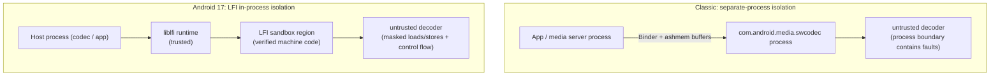
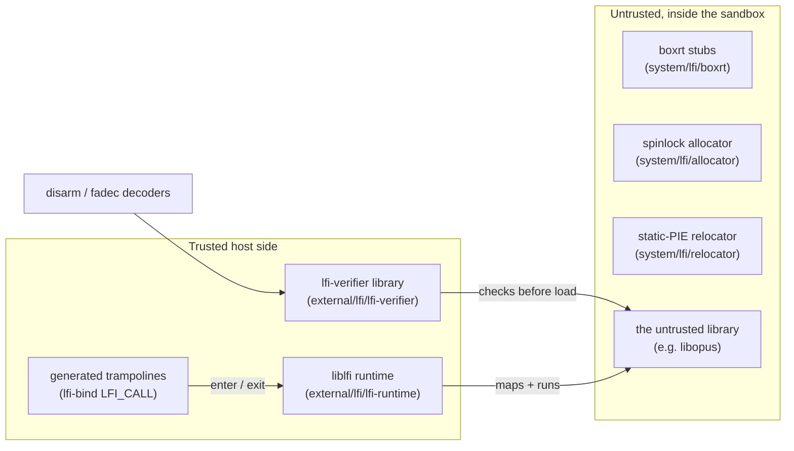
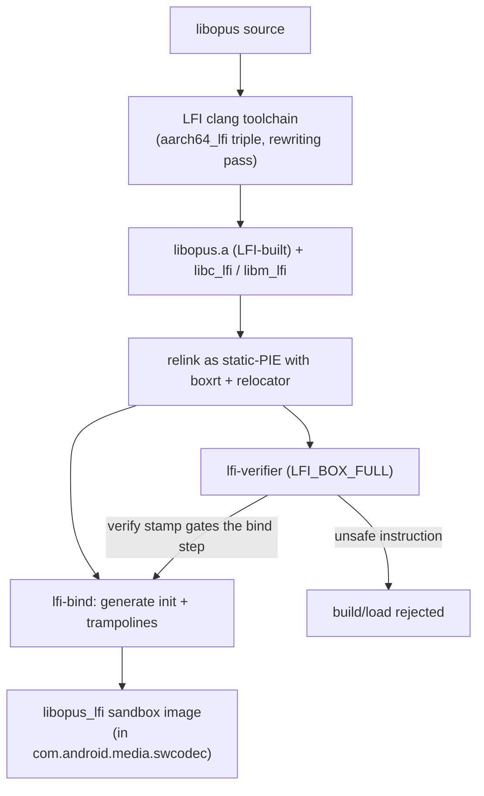
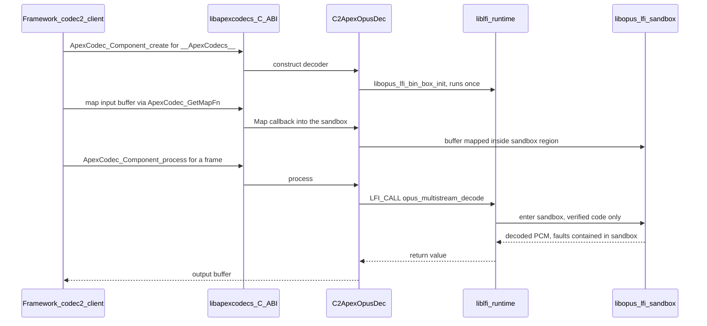

# Chapter 43: LFI In-Process Sandbox

Android has always isolated untrusted native code with the heaviest tool it
owns: a separate process. The software media codecs are the canonical example.
Because a malformed audio or video frame can drive a buffer overflow in a C
decoder, AOSP runs the software codecs in their own hardened APEX process
(`com.android.media.swcodec`), reached over Binder, so that a memory-corruption
bug in `libopus` or an AAC decoder cannot reach into the app or the media
server. The isolation is real, but it is not free: every decoded frame crosses a
process boundary, buffers are shared through ashmem and Binder, and a whole
process must be spawned, scheduled, and kept warm.

Android 17 adds a second, much lighter isolation primitive: **Lightweight Fault
Isolation (LFI)**. LFI confines an untrusted native library's memory accesses and
control flow to a reserved region of *its own host process's* address space,
enforced by machine code that a verifier has proven cannot escape that region.
The untrusted decoder runs in-process, but it provably cannot read or write
outside its sandbox, cannot jump to code outside it, and cannot make raw
syscalls. There is no second process, no Binder hop, and no buffer copy across an
address-space boundary, yet a memory-safety bug in the decoder stays inside the
sandbox.

The first production consumer is exactly the case that motivated swcodec in the
first place: a software Opus decoder running inside the media APEX, sandboxed by
LFI instead of (or alongside) the separate-process model. This chapter explains
what LFI is and the threat model it serves, the verifier/runtime/binding split
between the in-tree glue (`system/lfi`) and the external toolchain
(`external/lfi`), how a sandboxed codec is compiled and loaded, the Soong LFI
toolchain that builds it, and the security tradeoffs of pulling untrusted code
back into the process it used to be isolated from.

---

## 43.1 What LFI Is and the Threat Model

### 43.1.1 Software fault isolation, modernized

LFI is a software-fault-isolation (SFI) scheme: the idea that you can run
untrusted machine code safely in your own address space if every memory access
and every control transfer it makes is constrained to a sandbox region by the
*instructions themselves*. Classic SFI (Google Native Client and its
predecessors) achieved this by masking the high bits of every address before a
load, store, or jump, so a sandboxed pointer could never name memory outside a
power-of-two-aligned region. LFI is the modern, research-grade descendant of that
line of work; `system/lfi/README.md` points readers at the Stanford LFI paper and
the LLVM LFI documentation as background.

The key property is that safety does not depend on trusting the untrusted code.
It depends on two things the platform *does* trust:

1. A **compiler pass** that emits only sandbox-safe instruction sequences (masked
   addresses, restricted control flow, a reserved register holding the sandbox
   base), and
2. A **verifier** that re-checks the finished binary instruction by instruction
   and refuses to load anything that could escape — so even a malicious or
   miscompiled library cannot get past the gate.

Because the guarantee is re-established by the verifier at load time, the threat
model does not require trusting the toolchain that produced the binary. The
verifier is small, auditable, and the actual root of trust.

### 43.1.2 The threat model: memory safety without a second process

The asset LFI protects is the **host process** — for the first consumer, the
media swcodec process and, by extension, the buffers and credentials it holds.
The adversary is a malformed media bitstream that triggers undefined behavior
(out-of-bounds read/write, use-after-free, type confusion) inside an untrusted C
decoder. Without LFI the platform's only structural answer is to put that decoder
in a different process so the blast radius of a corruption bug is one sacrificial
process. LFI offers a different containment boundary: the decoder runs in-process,
but the verified machine code guarantees it can only touch its sandbox region,
can only transfer control to verified targets inside the sandbox, and cannot
issue arbitrary syscalls — every "syscall" becomes a call back into a trusted
runtime that decides what to allow.

What LFI is *not* is a confidentiality boundary against side channels or a
defense against logic bugs in the decoder's allowed behavior. It is a
**memory-safety** boundary: it turns "this codec has a heap overflow" from a
process-compromise primitive into a contained fault. The honest framing in the
source reflects this — `MediaCodecInfo::getSecurityModel()` reports the LFI path
as `SECURITY_MODEL_MEMORY_SAFE`, distinct from the `SECURITY_MODEL_SANDBOXED`
(separate-process) model, rather than claiming the two are equivalent
(`frameworks/av/media/libmedia/MediaCodecInfo.cpp:199`).

The diagram contrasts the two containment strategies for the same untrusted
decoder.

#### Separate-process sandbox versus LFI in-process sandbox



## 43.2 The Verifier, Runtime, and Binding Split

LFI in Android is split across two trees that play very different roles. The
in-tree `system/lfi` repo holds the *shared glue* that every sandboxed library
needs. The `external/lfi` tree vendors the *upstream toolchain* — the verifier,
the runtime, the binding generator, and the instruction decoders. Understanding
which piece does what is the key to reading the codec integration later.

### 43.2.1 The external toolchain (`external/lfi`)

`external/lfi` is a vendored upstream dependency. The platform integrates it; it
does not modify its internals. There are seven components, each a separate upstream
project mirrored into AOSP.

**`lfi-verifier` (builds the `lfi-verifier` library and the `lfi-verify` host tool).** The verifier is the root of trust. It scans
a compiled code buffer and decides whether every instruction is sandbox-safe
before the runtime is ever allowed to execute it. Its public interface is a
handful of per-architecture entry points in
`external/lfi/lfi-verifier/src/include/lfiv.h:36-46`:

```c
// external/lfi/lfi-verifier/src/include/lfiv.h:37-46
bool
lfiv_verify_arm64(char *code, size_t size, uintptr_t addr, struct LFIVOptions *opts);

bool
lfiv_verify_x64(char *code, size_t size, uintptr_t addr, struct LFIVOptions *opts);

bool
lfiv_verify_riscv64(char *code, size_t size, uintptr_t addr, struct LFIVOptions *opts);
```

The `LFIVOptions` struct (`lfiv.h:12-26`) selects the sandbox model. There are two
box types (`lfiv.h:7-10`): `LFI_BOX_FULL`, which constrains both loads and stores
(and control flow), and `LFI_BOX_STORES`, a weaker stores-only mode. It can also
reserve a **context register** (`ctxreg`, `lfiv.h:19-22`) — `x25` on arm64,
`r15` on x64 — that the sandbox is forbidden to modify and may only use for
64-bit loads/stores from the address it holds. The sandbox base lives in a
separate reserved register — `x27` on arm64 (`REG_BASE`,
`external/lfi/lfi-verifier/src/arm64/verify.c:67`). The verifier links against
the instruction decoders below to understand the bytes it is checking.

**`lfi-runtime` (builds `liblfi`).** The runtime owns the sandbox at execution
time. Per `external/lfi/lfi-runtime/README.md`, it splits into a `core` layer that
reserves virtual address space, maps sandbox memory, and transfers control into
and out of the sandbox, and a `linux` layer that provides a Linux emulation layer
(host-call handling) on top of core. The core object model is three structs
documented in `external/lfi/lfi-runtime/core/include/lfi_core.h:16-28`:

- `LFIEngine` — "tracks a large pool of virtual memory and manages the allocation
  of sandboxes from this pool."
- `LFIBox` — "a region of the virtual address space reserved for a sandbox. There
  is one LFIBox object per sandbox."
- `LFIContext` — "a sandbox execution context, tracking the sandbox's registers,
  thread pointer, stack, and a reference to the corresponding LFIBox," with one
  context per sandbox thread.

`LFIOptions` (`lfi_core.h:30-64`) carries the box size, a `stores_only` toggle
that must agree with the verifier, and a deliberately scary `no_verify` flag whose
comment marks it "(unsafe)" — verification is on by default and turning it off is
the explicit opt-out.

**`lfi-bind` (a Go tool).** Sandboxed libraries are not called directly; the host
calls into them through generated trampolines. `external/lfi/lfi-bind/README.md`
describes the tool: "it generates routines to initialize the library sandbox, and
trampolines for calling functions from the library." The workflow (README lines
20-31) is: compile the library with the LFI compiler to a `.a`; relink it as a
static-PIE against `boxrt` to produce a `.lfi` sandbox image; run `lfi-bind` over
that image to emit an init file and a trampolines file; and compile those into the
host. The generated header also defines the `LFI_CALL(fn, ...)` macro
(`external/lfi/lfi-bind/embed/lib.h.in:164`) that the host uses to invoke a
sandboxed function — you will see this macro all over the codec integration.

**`rlbox` and `rlbox-lfi`.** RLBox is a general-purpose sandboxing API: the host
writes `tainted<T>` types so the compiler forces it to validate any value that
crosses back out of the sandbox. `external/lfi/rlbox-lfi/README.md` describes the
LFI plug-in as "integration with [the] RLBox sandboxing API to leverage the
sandboxing from the LFI compiler." In AOSP this is a header-only library
(`rlbox_lfi_headers`); it is the higher-level alternative to hand-written
trampolines, available but not yet used by the first codec consumer — the Soong
`lfi.use_rlbox` property is wired but rejected as "not supported yet"
(`build/soong/cc/lfi.go:90-91`).

**`disarm` and `fadec`.** These are the instruction decoders the verifier depends
on: `disarm` is a fast, zero-dependency AArch64 decoder/encoder, and `fadec` is
the equivalent for x86-32/64. The verifier uses them to classify each instruction
it inspects; they carry no LFI policy of their own.

### 43.2.2 The in-tree glue (`system/lfi`)

`system/lfi` is the small amount of Android-specific code that every sandboxed
library links against. Per `system/lfi/README.md`, it is "code needed to compile
LFI in Android that is shared across the various sandboxed libraries," and it has
three pieces:

- **`boxrt`** — "a set of runtime stub functions that get linked with the
  sandboxed library." This is the code that runs *inside* the sandbox to bootstrap
  it. Its minimal form (`system/lfi/boxrt/boxrt_minimal.c`) implements `abort`,
  `lfi_brk`, and `lfi_pause` as raw `svc` syscalls and provides the
  `_lfi_malloc`/`_lfi_free` family plus the `_lfi_ret` return sequence the
  trampolines need.
- **`allocator`** — "a thread-safe minimal allocator that utilizes spinlocks"
  (`system/lfi/allocator/alloc.c`). The sandbox has no system libc, so it needs its
  own heap; this implicit-free-list allocator obtains memory through `lfi_brk` and
  guards it with an atomic spinlock.
- **`relocator`** — "a minimal loader that does relocations for `-static-pie`
  that is necessary for lfi-bind" (`system/lfi/relocator/relocate.c` plus the
  architecture entry stub `system/lfi/relocator/start.S`). Because the sandbox
  image is a static-PIE, something must apply its `R_*_RELATIVE` relocations on
  load before any sandbox code runs; the relocator does exactly that and then
  jumps to the sandbox's `runtime_main`.

These three combine into the runtime image baked into the sandbox library. The
verifier (a trusted host component) and `boxrt`/`allocator`/`relocator` (untrusted
sandbox-side code) are on opposite sides of the trust boundary even though they
ship in adjacent repos — the in-sandbox glue is itself verified before it runs.

This division of labor is summarized below.

#### Trust boundary across the LFI components



## 43.3 Building a Sandboxed Codec with the Soong LFI Toolchain

Compiling a library to safe machine code is the verifier's precondition, and that
is a build-system job. Android 17 teaches Soong about an LFI cross-toolchain and a
per-module opt-in.

### 43.3.1 The LFI toolchain in Soong

Soong models LFI as a distinct toolchain selected alongside the OS and
architecture. `build/soong/cc/config/toolchain.go` keys its toolchain-factory map
on `[os][arch][lfi]`, with `registerLFIToolchainFactory` registering the `lfi=true`
slot, and the `Toolchain` interface exposes an `Lfi() bool` method so the rest of
Soong can ask whether a variant is being built for LFI.

The arm64 LFI toolchain itself lives in
`build/soong/cc/config/arm64_lfi_device.go`. It is a thin specialization of the
ordinary arm64 device toolchain with an LFI-specific clang target triple and a
forced baseline architecture:

```go
// build/soong/cc/config/arm64_lfi_device.go:37-43
func (t *toolchainLFIArm64) ClangTriple() string {
	return "aarch64_lfi-unknown-linux-android30"
}

func (t *toolchainLFIArm64) Cflags() string {
	return "${config.Arm64Cflags} -mno-outline-atomics"
}
```

The `aarch64_lfi-...` triple is what drives clang's LFI assembly-rewriting pass —
the reserved context register and masked memory accesses come from the compiler,
not from Soong flags. The factory also forces `armv8-a`/`cortex-a53` with
`branchprot`, because, as the comment notes, "that's all the lfi compiler supports
for now" (`arm64_lfi_device.go:69-77`). Only arm64 device is registered
(`arm64_lfi_device.go:85-87`); there is no host or x86 LFI toolchain in 17.

### 43.3.2 How a module opts in

A `cc` module enables LFI through two cooperating properties parsed in
`build/soong/cc/lfi.go`:

- `lfi_supported: true` declares that a module *may* be built in an LFI variant.
- `lfi: { enabled: true }` (on a binary) actually turns it on. The
  `LFIProperties` struct (`build/soong/cc/lfi.go:39-45`) also carries
  `stores_only` and `use_rlbox`, both currently rejected as unsupported
  (`lfi.go:87-92`).

`lfi.begin` (`build/soong/cc/lfi.go:77-97`) gates LFI to arm64 device, non-SDK
variants only, and enforces the contract that `lfi.enabled` requires
`lfi_supported: true`:

```go
// build/soong/cc/lfi.go:77-85
func (lfi *Lfi) begin(ctx BaseModuleContext) {
	lfiEnabled := Bool(lfi.Properties.Lfi.Enabled)
	if ctx.Host() || ctx.Arch().ArchType != android.Arm64 || ctx.isSdkVariant() {
		lfiEnabled = false
	}

	if lfiEnabled && !ctx.Module().(*Module).IsLFISupported() {
		ctx.PropertyErrorf("lfi.enabled", "lfi_supported: true must be set if LFI is enabled for the module.")
	}
```

Enabling LFI on a binary then propagates down its static-dependency graph: a
`lfiTransitionMutator` (`build/soong/cc/lfi.go:149-255`) creates an
`lfi_stores_and_loads` (or `lfi_stores_only`) variant of every static dependency
of an LFI binary, so the whole transitive closure is recompiled with the LFI
toolchain. That is why the C library and math library need LFI builds of their
own: `libc_lfi` (`bionic/libc/Android.bp`) and `libm_lfi`
(`bionic/libm/Android.bp`) are arm64-only, `stl: "none"`,
`lfi_supported: true` static libraries restricted to the swcodec APEX
(`libc_lfi` also sets `nocrt: true`). A sandboxed
library has no normal libc — it links these LFI-built variants instead.

### 43.3.3 `system_lfi_defaults`

`system/lfi/Android.bp` collects the common settings every sandboxed library
needs into one `cc_defaults`:

```
// system/lfi/Android.bp:32-60
cc_defaults {
    name: "system_lfi_defaults",
    lfi_supported: true,
    stl: "none",
    system_shared_libs: [],
    nocrt: true,
    min_sdk_version: "apex_inherit",
    apex_available: [
        "com.android.media.swcodec",
    ],
    static_libs: [
        "libc_lfi",
        "libm_lfi",
    ],
    arch: {
        arm: { enabled: false },
        arm64: { enabled: true },
        x86: { enabled: false },
        x86_64: { enabled: false },
    },
}
```

Everything here follows from the sandbox model: `stl: "none"` and
`system_shared_libs: []` because the sandbox has no normal C++ or system
libraries; `nocrt: true` because `boxrt`/`relocator` supply startup, not the
ordinary CRT; `libc_lfi`/`libm_lfi` as the only libraries; arm64-only; and
`apex_available` restricted to `com.android.media.swcodec`, which both documents
and enforces that the first production scope is exactly the software codec APEX.

The end-to-end build pipeline for the Opus sandbox is the chain of all of the
above.

#### Build-time pipeline: from libopus source to a verified sandbox library



## 43.4 Loading and Running a Sandboxed Codec

The runtime consumer is the media codec stack. The boundary across which a
sandboxed codec is exposed is `libapexcodecs`; the switch that selects the
in-process LFI path is the `in_process_sw_codec_lfi` aconfig flag; and the actual
sandboxed decoder is `C2ApexOpusDec`.

### 43.4.1 `libapexcodecs`: the C ABI boundary

`libapexcodecs` is a stable C ABI that lets the updatable media (swcodec) APEX
expose Codec2 software components to the framework. Its header
(`frameworks/av/media/module/libapexcodecs/include/apex/ApexCodecs.h`) defines an
opaque C surface — `ApexCodec_ComponentStore`, `ApexCodec_Component`, and
`ApexCodec_Component_create/start/flush/reset/process` — and the framework loads
the implementation lazily by `dlopen`ing
`libcom.android.media.swcodec.apexcodecs.so`
(`frameworks/av/media/codec2/hal/client/ApexCodecsLazy.cpp:104`).

Crucially for LFI, the header also exposes a pair of memory-mapping hooks.
`ApexCodec_GetMapFn` and `ApexCodec_GetUnmapFn`
(`ApexCodecs.h:275-297`) return `mmap`/`munmap`-shaped function pointers, and the
header explains exactly why they exist:

> This is used by the framework to handle memory buffers when codecs are running
> under sandboxing mechanisms such as LFI (Lightweight Fault Isolation). In such
> cases, the mapping needs to have an address in the specific sandboxed region for
> the sandboxed library to access the pointer.

A sandboxed decoder can only touch addresses inside its box, so the framework
cannot hand it a buffer mapped at an arbitrary host address. These hooks let the
sandbox supply the mapping so the buffer lands inside the box.

### 43.4.2 The `in_process_sw_codec_lfi` flag

The whole path is gated by a single aconfig flag
(`frameworks/av/media/aconfig/codec_fwk.aconfig:152-157`):

```
flag {
  name: "in_process_sw_codec_lfi"
  namespace: "codec_fwk"
  description: "Feature flag for supporting in-process software codec using LFI"
  bug: "435023366"
}
```

It is read in two places. First, it controls how a codec advertises its security
model. `MediaCodecInfo::getSecurityModel()` reports an ApexCodecs-owned component
as memory-safe only when the flag is on
(`frameworks/av/media/libmedia/MediaCodecInfo.cpp:199-205`):

```cpp
// frameworks/av/media/libmedia/MediaCodecInfo.cpp:199-205
int MediaCodecInfo::getSecurityModel() const {
    if (android::media::codec::provider_->in_process_sw_codec_lfi()) {
        if (mOwner == "codec2::__ApexCodecs__") {
            return SECURITY_MODEL_MEMORY_SAFE;
        }
    }
    return SECURITY_MODEL_SANDBOXED;
}
```

Second, it selects the buffer-mapping functions. When the flag is on, the codec2
client swaps the default `::mmap`/`::munmap` for the sandbox-aware mapping
functions so buffers are mapped inside the box — for output blocks in
`allocOutputBuffer` (`frameworks/av/media/codec2/hal/client/client.cpp:1906-1914`)
and for input const linear blocks in `fillMemory` (`:2031-2038`):

```cpp
// frameworks/av/media/codec2/hal/client/client.cpp:1906-1914
if (__builtin_available(android 37, *)) {
    ApexCodec_MapFn mapFn = ::mmap;
    ApexCodec_UnmapFn unmapFn = ::munmap;
    if (android::media::codec::provider_->in_process_sw_codec_lfi()) {
        mapFn = ApexCodec_GetMapFn(mApexStore, mComponentName.c_str());
        unmapFn = ApexCodec_GetUnmapFn(mApexStore, mComponentName.c_str());
    }
    linearView->emplace(_C2BlockFactory::MapLinearWithMapper(
            *linearBlock, mapFn, unmapFn).get());
}
```

### 43.4.3 `C2ApexOpusDec`: a codec inside the box

`C2ApexOpusDec` (`frameworks/av/media/module/libapexcodecs/C2ApexOpusDec.cpp`) is
the first decoder wired to run inside an LFI sandbox. The `libopus` functions it
calls are not linked directly; they are reached through the `lfi-bind`-generated
`libopus_lfi_bin_box` shim (`#include "libopus_lfi_bin_box.h"`,
`C2ApexOpusDec.cpp:37`). Three things happen at the integration seam.

**The sandbox is initialized once.** A `SandboxInitializer` singleton calls the
generated box-init exactly once, guarded by a mutex
(`C2ApexOpusDec.cpp:94-103`), and the decoder constructor calls
`SandboxInitializer::Get().ensure()` (`:176`):

```cpp
// frameworks/av/media/module/libapexcodecs/C2ApexOpusDec.cpp:94-103
bool ensure() {
    std::unique_lock lk(mMutex);
    if (mInit) {
        LOG(INFO) << "ensure: sandbox is already initialized";
        return true;
    }
    mInit = libopus_lfi_bin_box_init();
    LOG(INFO) << "ensure: sandbox is" << (mInit ? "" : " not") << " initialized.";
    return mInit;
}
```

**Memory comes from inside the box.** Allocations that the decoder will touch use
the sandbox heap, not the host heap. `LfiAlloc` is a RAII wrapper around the
generated `libopus_lfi_bin_box_malloc`/`_free` (`C2ApexOpusDec.cpp:71-85`), and the
mapping hooks the framework asked for in §43.4.2 forward to the box's own
`mmap`/`munmap` (`C2ApexOpusDec.cpp:207-215`):

```cpp
// frameworks/av/media/module/libapexcodecs/C2ApexOpusDec.cpp:207-215
void *C2ApexOpusDec::Map(void *addr, size_t size, int prot, int flags, int fd, off_t offset) {
    return ::libopus_lfi_bin_box_mmap(addr, size, prot, flags, fd, offset);
}

int C2ApexOpusDec::Unmap(void *addr, size_t size) {
    return ::libopus_lfi_bin_box_munmap(addr, size);
}
```

**Every codec call crosses the trampoline.** The actual decode work invokes
`libopus` only through the `LFI_CALL` macro, which routes the call through the
generated trampoline into the sandbox and back — for example creating the decoder
(`C2ApexOpusDec.cpp:360`) and decoding a frame (`:478`):

```cpp
// frameworks/av/media/module/libapexcodecs/C2ApexOpusDec.cpp:360, 478
mDecoder = LFI_CALL(opus_multistream_decoder_create, /* ...args... */);
// ...
int numSamples = LFI_CALL(opus_multistream_decode, /* ...args... */);
```

Because the decoder is reached only through `LFI_CALL` and only ever touches
box-allocated, box-mapped memory, a corruption bug in `opus_multistream_decode`
can scribble over the sandbox heap but cannot reach the host process's memory —
and it cannot make a syscall, because the verifier guarantees the only way out is
back through the runtime's host-call handler.

The end-to-end runtime flow is below.

#### Runtime: decoding a frame through the LFI sandbox



## 43.5 Security Tradeoffs

LFI changes the shape of the isolation problem rather than strictly improving it,
and the tradeoffs are worth being precise about.

**What you gain.** The decoder runs in-process, so there is no Binder round trip
and no cross-process buffer plumbing for every frame — lower latency and less
overhead than the separate-process model. The memory-safety guarantee does not
depend on trusting the decoder or even the compiler, because the verifier
re-checks the finished binary and rejects anything unsafe; the trusted computing
base for the guarantee is the small verifier plus the runtime, not the large
untrusted library. And the boundary is fine-grained: each sandboxed library gets
its own `LFIBox`.

**What you give up relative to a separate process.** A process boundary is a
coarse but very well-understood barrier: separate address space, separate
credentials, kernel-enforced, and effective against more than memory-safety bugs.
LFI's guarantee is narrower — it is memory safety and control-flow confinement,
enforced by verified code in the *same* address space. It does not by itself stop
side-channel leakage, and its correctness rests on the verifier being right about
every instruction form. That is precisely why the platform models the LFI codec as
`SECURITY_MODEL_MEMORY_SAFE` and not as the same thing as
`SECURITY_MODEL_SANDBOXED` (`frameworks/av/media/libmedia/MediaCodecInfo.cpp:199`):
they are different guarantees, surfaced to callers as different models.

**Why the scope is deliberately small in 17.** Several signals in the source say
"new and constrained": LFI is arm64-device-only in Soong
(`build/soong/cc/lfi.go:79`), `system_lfi_defaults` is `apex_available` only to
`com.android.media.swcodec` (`system/lfi/Android.bp:39-41`), the whole runtime path
is behind the `in_process_sw_codec_lfi` aconfig flag
(`frameworks/av/media/aconfig/codec_fwk.aconfig:153`), and the weaker
stores-only and RLBox modes are parsed but rejected as "not supported yet"
(`build/soong/cc/lfi.go:88-91`). The first consumer is a single audio decoder.
This is the conservative way to introduce a new isolation primitive: prove it on
one well-bounded, attacker-reachable component (a software codec, the historic
source of media CVEs) before widening it.

The honest summary is that LFI is not a replacement for process isolation; it is a
second, lighter tool that gives memory safety for untrusted native code where a
whole extra process would be too expensive, with a small verified TCB carrying the
guarantee.

## 43.6 Try It

These commands inspect the LFI integration on an Android 17 source tree and a
running device. Run the tree commands from the root of an `android17-release`
checkout.

- See the in-tree glue and its three pieces:

  ```bash
  ls system/lfi system/lfi/boxrt system/lfi/allocator system/lfi/relocator
  cat system/lfi/README.md
  ```

- Read the `cc_defaults` every sandboxed library inherits:

  ```bash
  sed -n '/cc_defaults/,/^}/p' system/lfi/Android.bp
  ```

- Find the LFI toolchain wiring in Soong and the per-module opt-in:

  ```bash
  grep -rn "Lfi()\|registerLFIToolchainFactory" build/soong/cc/config/
  sed -n '37,43p' build/soong/cc/config/arm64_lfi_device.go
  sed -n '39,97p' build/soong/cc/lfi.go
  ```

- Locate the feature flag and its two read sites:

  ```bash
  grep -n -A4 "in_process_sw_codec_lfi" frameworks/av/media/aconfig/codec_fwk.aconfig
  grep -rn "in_process_sw_codec_lfi" frameworks/av/media/libmedia frameworks/av/media/codec2/hal/client
  ```

- Read the sandbox seam in the Opus decoder (init, alloc, map, `LFI_CALL`):

  ```bash
  grep -n "libopus_lfi_bin_box\|LFI_CALL\|SandboxInitializer" \
      frameworks/av/media/module/libapexcodecs/C2ApexOpusDec.cpp
  ```

- Inspect the external verifier and runtime contracts (integration only):

  ```bash
  sed -n '1,54p' external/lfi/lfi-verifier/src/include/lfiv.h
  sed -n '16,28p' external/lfi/lfi-runtime/core/include/lfi_core.h
  ```

- On a running Android 17 device, check whether the flag is set. (A codec's
  security model itself is only observable through the Java API —
  `MediaCodecInfo.getSecurityModel()` / `MediaFormat.KEY_SECURITY_MODEL` — not
  via a shell command.) Note that aconfig flags are stored under their
  fully-qualified package name:

  ```bash
  adb shell device_config get codec_fwk android.media.codec.in_process_sw_codec_lfi
  adb shell printflags | grep in_process_sw_codec_lfi
  ```

## Summary

- **LFI is software fault isolation for untrusted native code.** It confines a
  library's memory accesses and control flow to a reserved region of its host
  process via verified machine code, giving a memory-safety boundary without a
  separate process. Android 17 adds it as a second, lighter isolation primitive
  alongside the classic separate-process sandbox.
- **The threat model is memory safety, not full process isolation.** The asset is
  the host process; the adversary is a malformed bitstream corrupting an untrusted
  C decoder. The platform reflects the distinction by reporting the LFI codec as
  `SECURITY_MODEL_MEMORY_SAFE`, separate from the separate-process
  `SECURITY_MODEL_SANDBOXED`.
- **Verifier, runtime, and binding split across two trees.** `external/lfi`
  vendors the toolchain — `lfi-verifier` (the trusted root that rejects
  unsafe instructions), `lfi-runtime`/`liblfi` (reserves/maps the box and handles
  host calls), `lfi-bind` (generates init + `LFI_CALL` trampolines), `rlbox`/
  `rlbox-lfi` (a higher-level API, not yet used), and the `disarm`/`fadec`
  decoders. `system/lfi` adds the in-sandbox glue: `boxrt`, a spinlock
  `allocator`, and a static-PIE `relocator`.
- **Soong has an LFI cross-toolchain.** An `aarch64_lfi` clang triple drives the
  rewriting pass; modules opt in with `lfi_supported`/`lfi: { enabled }`; a
  transition mutator recompiles the whole static-dependency closure (hence
  `libc_lfi`/`libm_lfi`); and `system_lfi_defaults` packages the common settings,
  scoped to the swcodec APEX and arm64.
- **The first consumer is a sandboxed software Opus decoder.** `libapexcodecs`
  is the C ABI boundary; `ApexCodec_GetMapFn`/`GetUnmapFn` map buffers inside the
  box; `C2ApexOpusDec` initializes the sandbox once, allocates and maps from the
  box, and calls `libopus` only through `LFI_CALL` trampolines — all gated by the
  `in_process_sw_codec_lfi` flag.
- **The tradeoff is a narrower guarantee for much lower cost.** LFI buys
  in-process memory safety with a small verified TCB, but it is not a substitute
  for the coarse, kernel-enforced barrier of a separate process; 17 keeps it
  deliberately scoped to one decoder behind a flag.

### Key Source Files Reference

| File | Purpose |
|------|---------|
| `system/lfi/README.md` | Describes the in-tree glue: `boxrt`, `allocator`, `relocator` |
| `system/lfi/Android.bp` | `system_lfi_defaults` cc_defaults (arm64, nocrt, swcodec-only) |
| `system/lfi/boxrt/boxrt_minimal.c` | In-sandbox runtime stubs (`abort`, `lfi_brk`, `_lfi_ret`) |
| `system/lfi/allocator/alloc.c` | Thread-safe spinlock allocator for the sandbox heap |
| `system/lfi/relocator/relocate.c` | Static-PIE relocation loader for the sandbox image |
| `external/lfi/lfi-verifier/src/include/lfiv.h` | Verifier API: `lfiv_verify_arm64/x64/riscv64`, box types |
| `external/lfi/lfi-runtime/core/include/lfi_core.h` | Runtime model: `LFIEngine`, `LFIBox`, `LFIContext`, `LFIOptions` |
| `external/lfi/lfi-bind/README.md` | Trampoline/init generator; sandboxed-library workflow |
| `external/lfi/rlbox-lfi/README.md` | RLBox API integrated with the LFI backend |
| `build/soong/cc/lfi.go` | `lfi_supported`/`lfi.enabled` properties, transition mutator |
| `build/soong/cc/config/arm64_lfi_device.go` | arm64 LFI toolchain (`aarch64_lfi` clang triple) |
| `build/soong/cc/config/toolchain.go` | Toolchain `Lfi()` selection and factory registration |
| `bionic/libc/Android.bp` / `bionic/libm/Android.bp` | `libc_lfi` / `libm_lfi` LFI-built C/math libraries |
| `frameworks/av/media/aconfig/codec_fwk.aconfig` | `in_process_sw_codec_lfi` feature flag |
| `frameworks/av/media/module/libapexcodecs/include/apex/ApexCodecs.h` | C ABI boundary; `ApexCodec_GetMapFn`/`GetUnmapFn` for LFI |
| `frameworks/av/media/module/libapexcodecs/C2ApexOpusDec.cpp` | Sandboxed Opus decoder: init, alloc, map, `LFI_CALL` |
| `frameworks/av/media/libmedia/MediaCodecInfo.cpp` | `getSecurityModel()` -> `SECURITY_MODEL_MEMORY_SAFE` |
| `frameworks/av/media/codec2/hal/client/client.cpp` | Flag-gated swap to sandbox-aware buffer mapping |
