# Chapter 46: Accessibility

## 46.1 Accessibility Architecture

Android's accessibility framework is one of the platform's most sophisticated
subsystems. It provides a mechanism by which users with disabilities --
including visual, motor, hearing, and cognitive impairments -- can interact
with every application on the device, even those whose developers never
anticipated such use. The architecture is designed around three pillars:
**event observation**, **content introspection**, and **action injection**.

At the highest level, the accessibility framework connects three categories of
participants:

1. **Applications** (Views and ViewGroups) that produce `AccessibilityEvent`s
   and expose their content as trees of `AccessibilityNodeInfo` objects.
2. **AccessibilityManagerService** (AMS), the centralized system service that
   routes events, manages service bindings, and enforces security policies.
3. **AccessibilityServices**, which consume events, inspect the view tree, and
   perform actions on behalf of the user. TalkBack, Switch Access, and
   Voice Access are the most widely deployed examples.

### 46.1.1 High-Level Data Flow

The following diagram illustrates the core data flow from a View's state
change through to an accessibility service's response:

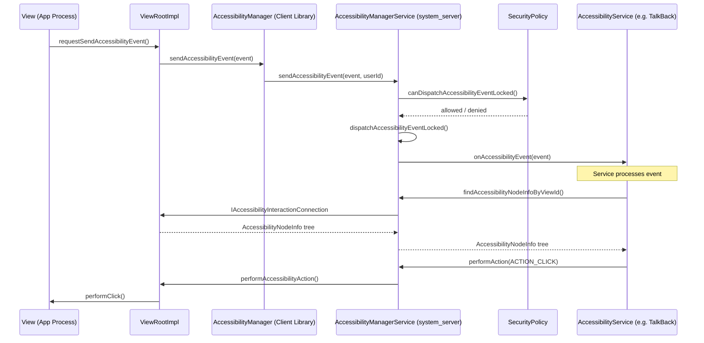

### 46.1.2 The Three Core Classes

The accessibility framework revolves around three core classes that every
AOSP developer must understand:

**AccessibilityManagerService** is the central coordinator. Defined in:
```
frameworks/base/services/accessibility/java/com/android/server/accessibility/
    AccessibilityManagerService.java
```

It runs inside `system_server` and implements the `IAccessibilityManager`
AIDL interface. The class declaration reveals its many roles:

```java
// AccessibilityManagerService.java, line 256
public class AccessibilityManagerService extends IAccessibilityManager.Stub
        implements AbstractAccessibilityServiceConnection.SystemSupport,
        AccessibilityUserState.ServiceInfoChangeListener,
        AccessibilityWindowManager.AccessibilityEventSender,
        AccessibilitySecurityPolicy.AccessibilityUserManager,
        SystemActionPerformer.SystemActionsChangedListener,
        SystemActionPerformer.DisplayUpdateCallBack, ProxyManager.SystemSupport {
```

At roughly 7,600 lines in Android 17, it is one of the larger system services.

**AccessibilityService** is the abstract base class that all accessibility
services extend. Defined in:
```
frameworks/base/core/java/android/accessibilityservice/AccessibilityService.java
```

Services run in their own process and communicate with AMS over Binder. Each
service declares its capabilities in an XML metadata file and receives events
matching its configured event types and package filters.

**AccessibilityNodeInfo** represents a single node in the accessibility tree.
Defined in:
```
frameworks/base/core/java/android/view/accessibility/AccessibilityNodeInfo.java
```

At roughly 9,200 lines in Android 17, it is the richest data structure in the
accessibility framework, carrying text content, bounds, actions, collection
info, range info, and tree relationships.

### 46.1.3 Component Architecture Diagram

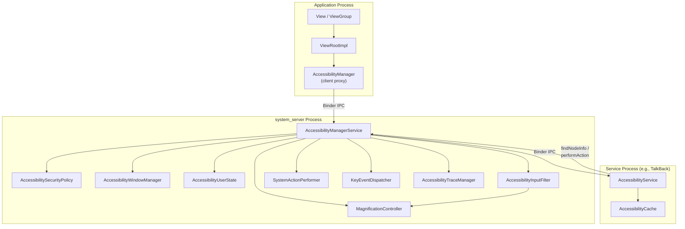

### 46.1.4 AccessibilityNodeInfo in Detail

Every `View` in the Android UI hierarchy is capable of producing an
`AccessibilityNodeInfo` snapshot of itself. This snapshot is what
accessibility services see when they query the window content. The node
carries a wealth of information:

| Property Category | Examples |
|-------------------|----------|
| Identity | `viewIdResourceName`, `className`, `packageName` |
| Text | `text`, `contentDescription`, `hintText`, `tooltipText` |
| State | `isChecked`, `isEnabled`, `isFocused`, `isSelected`, `isPassword` |
| Geometry | `boundsInScreen`, `boundsInParent`, `boundsInWindow` |
| Tree structure | `parentNodeId`, `childNodeIds`, `labeledBy`, `labelFor` |
| Actions | `AccessibilityAction` list (click, long-click, scroll, etc.) |
| Collection info | `CollectionInfo`, `CollectionItemInfo` for lists/grids |
| Range info | `RangeInfo` for seekbars, progress bars |
| Extra data | `Bundle` of extras for custom key-value pairs |

The node ID scheme uses a 64-bit value composed of two 32-bit IDs:

```java
// AccessibilityNodeInfo.java
public static final long UNDEFINED_NODE_ID =
    makeNodeId(UNDEFINED_ITEM_ID, UNDEFINED_ITEM_ID);

public static final long ROOT_NODE_ID =
    makeNodeId(ROOT_ITEM_ID, AccessibilityNodeProvider.HOST_VIEW_ID);
```

The `makeNodeId` function packs a view ID and a virtual descendant ID into
a single `long`. This supports `AccessibilityNodeProvider`, which allows a
single `View` to report itself as a tree of virtual nodes -- essential for
custom views that draw multiple interactive elements.

### 46.1.5 AccessibilityNodeInfo Actions

The action system in `AccessibilityNodeInfo` allows accessibility services to
interact with the UI. Standard actions are defined as bit-masked constants for
legacy compatibility and as `AccessibilityAction` objects for newer APIs:

```java
// AccessibilityNodeInfo.java -- legacy action constants
public static final int ACTION_FOCUS       = 1;        // 1 << 0
public static final int ACTION_CLICK       = 1 << 4;   // 0x00000010
public static final int ACTION_LONG_CLICK  = 1 << 5;   // 0x00000020
public static final int ACTION_SELECT      = 1 << 2;   // 0x00000004
public static final int ACTION_SCROLL_FORWARD  = 1 << 12;
public static final int ACTION_SCROLL_BACKWARD = 1 << 13;
public static final int ACTION_SET_TEXT    = 1 << 21;
```

The `AccessibilityAction` class wraps an action ID and an optional label,
allowing custom actions to be exposed to services alongside the standard ones.

### 46.1.6 Prefetch Strategies

Modern Android provides sophisticated prefetch strategies for accessibility
node traversal. These are declared as flags on `AccessibilityNodeInfo`:

```java
public static final int FLAG_PREFETCH_ANCESTORS = 1;
public static final int FLAG_PREFETCH_SIBLINGS = 1 << 1;
public static final int FLAG_PREFETCH_DESCENDANTS_HYBRID = 1 << 2;
public static final int FLAG_PREFETCH_DESCENDANTS_DEPTH_FIRST = 1 << 3;
public static final int FLAG_PREFETCH_DESCENDANTS_BREADTH_FIRST = 1 << 4;
```

The hybrid strategy prefetches children of the root before recursing, which
provides a good balance between latency and completeness. The depth-first and
breadth-first strategies are mutually exclusive with each other and with the
hybrid strategy; combining incompatible strategies triggers an
`IllegalArgumentException`.

---

## 46.2 AccessibilityManagerService

`AccessibilityManagerService` (AMS) is the beating heart of Android's
accessibility subsystem. It is a system service that runs in the
`system_server` process. It is started during system boot by
`SystemServer.startOtherServices()` and registered under the name
`Context.ACCESSIBILITY_SERVICE`.

Source location:
```
frameworks/base/services/accessibility/java/com/android/server/accessibility/
    AccessibilityManagerService.java
```

### 46.2.1 Responsibilities

AMS has seven primary responsibilities:

1. **Event Dispatch** -- Receiving `AccessibilityEvent`s from applications and
   routing them to bound accessibility services.
2. **Service Lifecycle** -- Binding to, managing, and unbinding from
   accessibility services.
3. **Security Enforcement** -- Ensuring that events are only dispatched to
   authorized services and that services can only access content they are
   permitted to see.
4. **Window Management** -- Maintaining the accessibility window tree, a
   parallel structure to the window manager's window list.
5. **Input Filtering** -- Installing an `AccessibilityInputFilter` in the
   input pipeline when features like touch exploration or magnification are
   enabled.
6. **Magnification Coordination** -- Managing the `MagnificationController`
   which handles both full-screen and windowed magnification.
7. **User State Management** -- Maintaining per-user accessibility
   preferences, enabled services, and shortcut configurations.

### 46.2.2 Key Internal Components

AMS delegates to several collaborator classes:

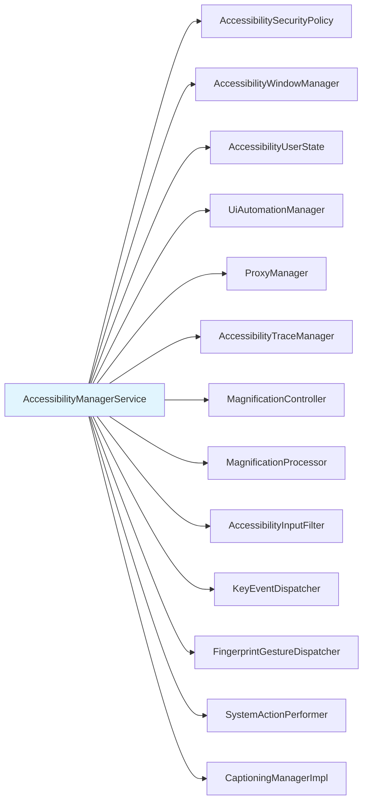

**AccessibilitySecurityPolicy** (about 800 lines) is the gatekeeper. It
determines:

- Whether an event can be dispatched to a given service
- Whether a service can retrieve window content
- Which package name should be reported for cross-profile events
- Whether a non-accessibility-categorized service should trigger a warning

The security policy maintains a bitmask of event types for which the source
`AccessibilityNodeInfo` should be retained:

```java
// AccessibilitySecurityPolicy.java, line 70
private static final int KEEP_SOURCE_EVENT_TYPES =
    AccessibilityEvent.TYPE_VIEW_CLICKED
    | AccessibilityEvent.TYPE_VIEW_FOCUSED
    | AccessibilityEvent.TYPE_VIEW_HOVER_ENTER
    | AccessibilityEvent.TYPE_VIEW_HOVER_EXIT
    | AccessibilityEvent.TYPE_VIEW_LONG_CLICKED
    | AccessibilityEvent.TYPE_VIEW_TEXT_CHANGED
    | AccessibilityEvent.TYPE_WINDOW_STATE_CHANGED
    | AccessibilityEvent.TYPE_WINDOWS_CHANGED
    | AccessibilityEvent.TYPE_VIEW_SELECTED
    | AccessibilityEvent.TYPE_WINDOW_CONTENT_CHANGED
    | AccessibilityEvent.TYPE_VIEW_TEXT_SELECTION_CHANGED
    | AccessibilityEvent.TYPE_VIEW_SCROLLED
    | AccessibilityEvent.TYPE_VIEW_ACCESSIBILITY_FOCUSED
    | AccessibilityEvent.TYPE_VIEW_ACCESSIBILITY_FOCUS_CLEARED
    | AccessibilityEvent.TYPE_VIEW_TEXT_TRAVERSED_AT_MOVEMENT_GRANULARITY
    | AccessibilityEvent.TYPE_VIEW_TARGETED_BY_SCROLL;
```

Events not in this bitmask have their source node stripped before delivery to
services, preventing unauthorized content scraping.

**AccessibilityWindowManager** maintains the accessibility window tree. It
tracks:

- Global interaction connections (cross-user windows)
- Per-user interaction connections
- The active window and accessibility-focused window
- The Picture-in-Picture window

**AccessibilityUserState** holds per-user configuration:

- The list of bound and binding services (`mBoundServices`)
- Enabled service component names
- Shortcut assignments per shortcut type
- Magnification mode preferences
- Soft keyboard show mode

### 46.2.3 Event Dispatch Pipeline

The event dispatch pipeline is the most performance-critical path in the
accessibility framework. Let us trace an event from origin to delivery.

**Step 1: Event origination.** A `View` calls `sendAccessibilityEvent()` or
`sendAccessibilityEventUnchecked()`. The event propagates up the view tree
through `requestSendAccessibilityEvent()` on parent views, allowing parent
views to augment or block the event.

**Step 2: Cross-process delivery.** The event reaches `ViewRootImpl`, which
calls through the client-side `AccessibilityManager` to the server-side AMS
over Binder:

```java
// AccessibilityManagerService.java, line 1617
public void sendAccessibilityEvent(AccessibilityEvent event, int userId) {
```

**Step 3: Security checks.** AMS resolves the calling user, validates the
reported package name, and checks dispatch permission:

```java
// AccessibilityManagerService.java, lines 1647-1653
resolvedUserId = mSecurityPolicy
    .resolveCallingUserIdEnforcingPermissionsLocked(userId);
event.setPackageName(mSecurityPolicy.resolveValidReportedPackageLocked(
    event.getPackageName(), UserHandle.getCallingAppId(),
    resolvedUserId, getCallingPid()));
```

**Step 4: Window state update.** For events that affect window tracking
(like `TYPE_WINDOW_STATE_CHANGED`), AMS asks WindowManager to recompute
windows for accessibility:

```java
// AccessibilityManagerService.java, line 1698
wm.computeWindowsForAccessibility(displayId);
```

**Step 5: Dispatch to services.** The actual dispatch calls
`notifyAccessibilityServicesDelayedLocked()` twice -- the boolean parameter
is `isDefault`, so the first call notifies non-default services and the
second notifies default services (those declaring `flagDefault` in their
`AccessibilityServiceInfo`):

```java
// AccessibilityManagerService.java, line 1716
private void dispatchAccessibilityEventLocked(AccessibilityEvent event) {
    if (mProxyManager.isProxyedDisplay(event.getDisplayId())) {
        mProxyManager.sendAccessibilityEventLocked(event);
    } else {
        notifyAccessibilityServicesDelayedLocked(event, false);
        notifyAccessibilityServicesDelayedLocked(event, true);
    }
    mUiAutomationManager.sendAccessibilityEventLocked(event);
}
```

**Step 6: Input filter notification.** If an input filter is installed (for
touch exploration or magnification), the event is also forwarded to it:

```java
// AccessibilityManagerService.java, line 1663
if (mHasInputFilter && mInputFilter != null) {
    mMainHandler.sendMessage(obtainMessage(
        AccessibilityManagerService::sendAccessibilityEventToInputFilter,
        this, AccessibilityEvent.obtain(event)));
}
```

The following diagram captures this pipeline:

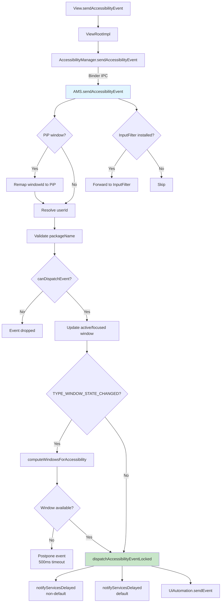

### 46.2.4 AMS Initialization

The constructor of `AccessibilityManagerService` reveals the complete set of
collaborators it creates:

```java
// AccessibilityManagerService.java, line 642
public AccessibilityManagerService(Context context) {
    super(PermissionEnforcer.fromContext(context));
    mContext = context;
    mPowerManager = context.getSystemService(PowerManager.class);
    mWindowManagerService =
        LocalServices.getService(WindowManagerInternal.class);
    mTraceManager = AccessibilityTraceManager.getInstance(
        mWindowManagerService.getAccessibilityController(), this, mLock);
    mMainHandler = new MainHandler(mContext.getMainLooper());
    mActivityTaskManagerService =
        LocalServices.getService(ActivityTaskManagerInternal.class);
    mPackageManager = mContext.getPackageManager();
    // Security policy + window tracking
    mSecurityPolicy = new AccessibilitySecurityPolicy(
        policyWarningUIController, mContext, this,
        LocalServices.getService(PackageManagerInternal.class));
    mA11yWindowManager = new AccessibilityWindowManager(
        mLock, mMainHandler, mWindowManagerService,
        this, mSecurityPolicy, this, mTraceManager);
    mA11yDisplayListener = new AccessibilityDisplayListener(...);
    // Magnification
    mMagnificationController = new MagnificationController(
        this, mLock, mContext,
        new MagnificationScaleProvider(mContext),
        Executors.newSingleThreadExecutor(),
        mContext.getMainLooper());
    mMagnificationProcessor =
        new MagnificationProcessor(mMagnificationController);
    // Additional collaborators
    mCaptioningManagerImpl = new CaptioningManagerImpl(mContext);
    mProxyManager = new ProxyManager(mLock, mA11yWindowManager,
        mContext, mMainHandler, mUiAutomationManager, this);
    mFlashNotificationsController = new FlashNotificationsController(mContext);
    mUmi = LocalServices.getService(UserManagerInternal.class);
    mInputManager = context.getSystemService(InputManager.class);

    if (UserManager.isVisibleBackgroundUsersEnabled()) {
        mVisibleBgUserIds = new SparseBooleanArray();
        mUmi.addUserVisibilityListener((u, v) -> onUserVisibilityChanged(u, v));
    } else {
        mVisibleBgUserIds = null;
    }
    // Hearing-device call routing notification controller (flag-gated)
    if (com.android.settingslib.flags.Flags
            .hearingDevicesInputRoutingControl()) {
        mHearingDeviceNotificationController =
            new HearingDevicePhoneCallNotificationController(context);
    } else {
        mHearingDeviceNotificationController = null;
    }
    init();
}
```

In Android 17 the constructor wires up two collaborators that older releases
did not have at this point: `ProxyManager` (for accessibility on proxy-owned
virtual displays, section 46.2.16) and a `UserManagerInternal`
(`mUmi`) handle used both for the visible-background-user listener and, later,
for checking the Advanced Protection Mode user restriction (section 46.12).
Note that the `FullScreenMagnificationController` is no longer created here --
it is owned and lazily constructed by `MagnificationController`.

During `init()`, AMS registers broadcast receivers, sets up content observers
for accessibility-related settings changes, and registers the set of keyboard
key gestures it can handle:

```java
// AccessibilityManagerService.java, line 693
private void init() {
    mSecurityPolicy.setAccessibilityWindowManager(mA11yWindowManager);
    registerBroadcastReceivers();
    mAccessibilityContentObserver =
        new AccessibilityContentObserver(mMainHandler);
    mAccessibilityContentObserver.register(mContext.getContentResolver());

    List<Integer> supportedGestures = new ArrayList<>();
    if (enableColorInversionKeyGestures()) {
        supportedGestures.add(
            KeyGestureEvent.KEY_GESTURE_TYPE_TOGGLE_DISPLAY_COLOR_INVERSION);
    }
    if (enableSelectToSpeakKeyGestures()) {
        supportedGestures.add(
            KeyGestureEvent.KEY_GESTURE_TYPE_ACTIVATE_SELECT_TO_SPEAK);
    }
    supportedGestures.add(KeyGestureEvent.KEY_GESTURE_TYPE_TOGGLE_MAGNIFICATION);
    if (enableTalkbackKeyGestures()) {
        supportedGestures.add(
            KeyGestureEvent.KEY_GESTURE_TYPE_TOGGLE_SCREEN_READER);
    }
    supportedGestures.add(KeyGestureEvent.KEY_GESTURE_TYPE_TOGGLE_VOICE_ACCESS);
    if (enableA11yTopRowShortcut()) {
        supportedGestures.add(
            KeyGestureEvent.KEY_GESTURE_TYPE_TOGGLE_TOP_ROW_ACCESSIBILITY_KEY);
    }
    if (!supportedGestures.isEmpty()) {
        mInputManager.registerKeyGestureEventHandler(
            supportedGestures, mKeyGestureEventHandler);
    }
    disableAccessibilityMenuToMigrateIfNeeded();
}
```

This initialization sequence demonstrates how AMS connects to the input
system, settings database, and window manager at startup. Compared with
Android 16, two of the key gestures -- toggling magnification and toggling
Voice Access -- are now registered unconditionally rather than behind feature
flags, reflecting that the keyboard-shortcut work for those features has
shipped. The flags `enableTalkbackAndMagnifierKeyGestures` and
`enableVoiceAccessKeyGestures` that gated them in earlier drafts have been
removed. The remaining flags (`enableColorInversionKeyGestures`,
`enableSelectToSpeakKeyGestures`, `enableTalkbackKeyGestures`, and
`enableA11yTopRowShortcut`) continue to gate newer additions, including the
top-row accessibility key described in section 46.10.

### 46.2.5 The LocalService Interface

AMS exposes an internal interface for use by other system services within
`system_server` through `AccessibilityManagerInternal`:

```java
// AccessibilityManagerService.java, line 479
private static final class LocalServiceImpl
    extends AccessibilityManagerInternal {

    @Override
    public void setImeSessionEnabled(
        SparseArray<IAccessibilityInputMethodSession> sessions,
        boolean enabled) { ... }

    @Override
    public void unbindInput() { ... }

    @Override
    public void bindInput() { ... }

    @Override
    public void createImeSession(ArraySet<Integer> ignoreSet) { ... }

    @Override
    public void startInput(
        IRemoteAccessibilityInputConnection connection,
        EditorInfo editorInfo, boolean restarting) { ... }

    @Override
    public void performSystemAction(int actionId) { ... }
}
```

This interface allows `InputMethodManagerService` to coordinate with
accessibility services for input method session management, and allows
other system services to trigger system actions through the accessibility
framework.

### 46.2.6 Window State Changed Event Postponement

A notable detail in the event dispatch pipeline is the postponement logic for
`TYPE_WINDOW_STATE_CHANGED` events. When an app reports a window state change
but the corresponding window is not yet registered in the accessibility window
list (a race condition between the app process and WindowManagerService), AMS
postpones the event for up to 500ms:

```java
// AccessibilityManagerService.java, line 281
private static final int
    POSTPONE_WINDOW_STATE_CHANGED_EVENT_TIMEOUT_MILLIS = 500;
```

When a `WINDOWS_CHANGE_ADDED` event arrives, AMS checks for pending postponed
events that match the new window and dispatches them:

```java
// AccessibilityManagerService.java, line 5249
public void sendAccessibilityEventForCurrentUserLocked(AccessibilityEvent event) {
    if (event.getWindowChanges() == AccessibilityEvent.WINDOWS_CHANGE_ADDED) {
        sendPendingWindowStateChangedEventsForAvailableWindowLocked(
            event.getRealWindowId());
    }
    sendAccessibilityEventLocked(event, mCurrentUserId);
}
```

Note that in Android 17 this lookup keys off `event.getRealWindowId()` rather
than the logical window ID, which matters for Picture-in-Picture windows whose
visible window ID is remapped.

### 46.2.7 Service Binding

Accessibility services are bound using the standard Android `bindService()`
mechanism, with a critical security constraint: only services declared with
the `android.permission.BIND_ACCESSIBILITY_SERVICE` permission can be bound.

The binding lifecycle is managed by `AccessibilityServiceConnection`:

```
frameworks/base/services/accessibility/java/com/android/server/accessibility/
    AccessibilityServiceConnection.java
```

This class extends `AbstractAccessibilityServiceConnection`, which provides
the common behavior for both accessibility services and UiAutomation
connections. The abstract base class implements
`IAccessibilityServiceConnection.Stub`, meaning it is the server-side Binder
endpoint that services call into.

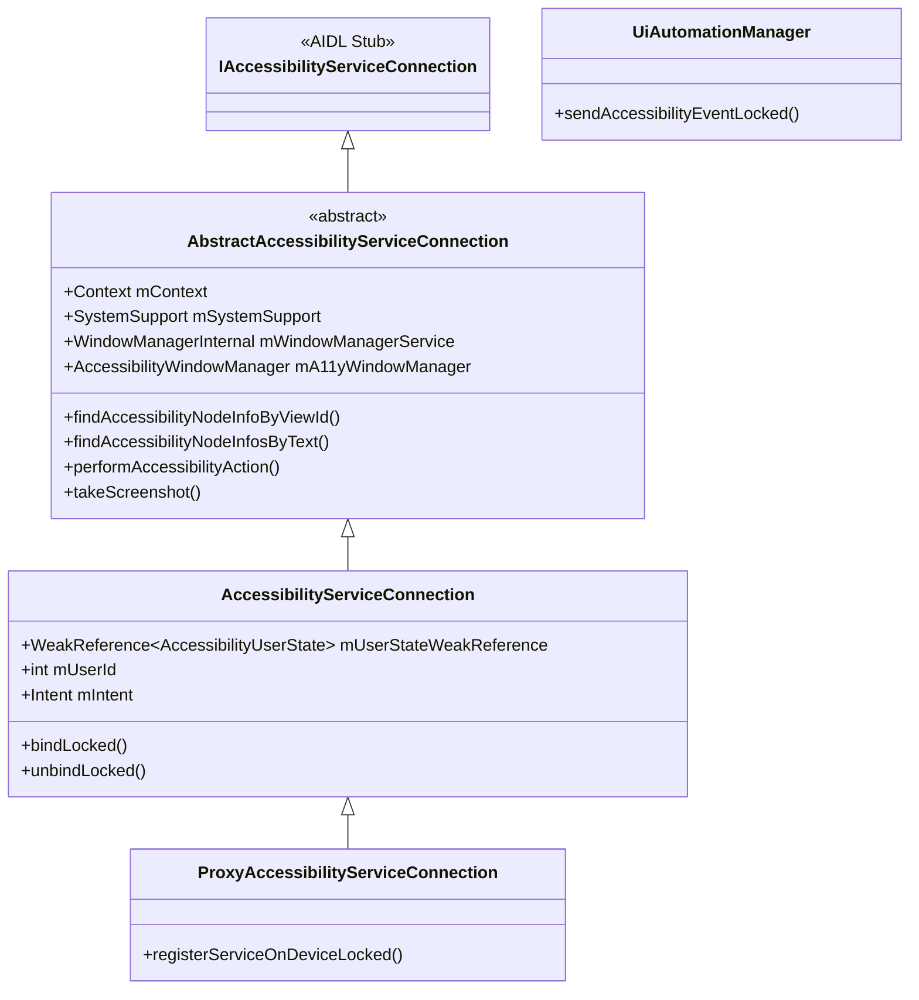

The connection holds a weak reference to `AccessibilityUserState` to avoid
reference cycles, since user state maintains lists of bound services:

```java
// AccessibilityServiceConnection.java, line 98
final WeakReference<AccessibilityUserState> mUserStateWeakReference;
```

### 46.2.8 Security Model

The accessibility framework has an extensive security model because
accessibility services are granted extraordinary power -- they can read screen
content, observe user input, and inject actions. The security controls are:

1. **Permission requirement**: Services must declare
   `android.permission.BIND_ACCESSIBILITY_SERVICE` in their manifest.

2. **Explicit user consent**: Users must explicitly enable each service in
   Settings. A confirmation dialog warns about the capabilities being granted.

3. **Event filtering**: `AccessibilitySecurityPolicy.canDispatchAccessibilityEventLocked()`
   checks whether the event should be dispatched to the current user's
   services.

4. **Package validation**: The reported package name is validated to prevent
   a malicious app from spoofing events as coming from another package:
   ```java
   mSecurityPolicy.resolveValidReportedPackageLocked(
       event.getPackageName(), UserHandle.getCallingAppId(),
       resolvedUserId, getCallingPid());
   ```

5. **Source stripping**: For event types not in `KEEP_SOURCE_EVENT_TYPES`,
   the source `AccessibilityNodeInfo` is removed before dispatch, preventing
   services from querying content they should not access.

6. **Non-accessibility-tool notification**: Services that are not categorized
   as accessibility tools (via `accessibilityTool="true"` in their metadata)
   trigger a persistent notification warning the user. This is controlled by
   `PolicyWarningUIController`:
   ```
   frameworks/base/services/accessibility/java/com/android/server/accessibility/
       PolicyWarningUIController.java
   ```

7. **Enhanced Confirmation Mode (ECM)**: The `EnhancedConfirmationManager`
   provides an additional layer of verification for accessibility service
   activation, particularly for side-loaded apps. AMS consults it before
   enabling a service (`AccessibilityManagerService.java`, line 5634).

8. **Per-user isolation**: Each user has independent accessibility state,
   managed through `AccessibilityUserState`. Profile parents share
   accessibility state with their managed profiles.

9. **Advanced Protection Mode (AAPM)**: New in Android 17, when the device
   owner enables Advanced Protection Mode, AMS can be told to disallow
   non-tool accessibility services entirely. This integration is described in
   detail in section 46.12.

### 46.2.9 The Lock and Threading Model

AMS uses a single lock (`mLock`) for all state synchronization. Operations
that must not hold the lock during execution (such as Binder calls to service
processes) use a resyncing pattern -- they copy needed state under the lock,
release it, and then make the outbound call.

AMS processes events on the main handler to ensure serialization:

```java
// AccessibilityManagerService.java, line 5258
private void sendAccessibilityEventLocked(AccessibilityEvent event, int userId) {
    // Resync to avoid calling out with the lock held
    event.setEventTime(SystemClock.uptimeMillis());
    mMainHandler.sendMessage(obtainMessage(
        AccessibilityManagerService::sendAccessibilityEvent,
        this, event, userId));
}
```

This ensures that event dispatch, window state updates, and service
notifications happen in a deterministic order on the main thread.

### 46.2.10 AMS Shell Commands

AMS exposes a shell command interface through `AccessibilityShellCommand` for
debugging and testing:

```bash
# List enabled accessibility services
adb shell settings get secure enabled_accessibility_services

# Enable an accessibility service
adb shell settings put secure enabled_accessibility_services \
    com.google.android.marvin.talkback/\
    com.google.android.marvin.talkback.TalkBackService

# Check if touch exploration is enabled
adb shell settings get secure touch_exploration_enabled

# Dump accessibility state
adb shell dumpsys accessibility
```

The `dumpsys accessibility` command is especially valuable for debugging. It
prints the current user state, all bound services and their capabilities,
the accessibility window list, magnification state, and input filter state.

### 46.2.11 Flash Notifications

The `FlashNotificationsController` provides visual notification alerts for
users who are deaf or hard of hearing:

```
frameworks/base/services/accessibility/java/com/android/server/accessibility/
    FlashNotificationsController.java
```

When enabled, it flashes the camera LED or the screen when notifications,
alarms, or other alerting events occur. The controller monitors audio
playback configurations and maps alarm/notification sounds to flash
patterns. The flash reasons are categorized:

```java
AccessibilityManager.FLASH_REASON_ALARM
AccessibilityManager.FLASH_REASON_PREVIEW
```

This is configured through `Settings.System.CAMERA_FLASH_NOTIFICATION` and
`Settings.System.SCREEN_FLASH_NOTIFICATION`.

### 46.2.12 FingerprintGestureDispatcher

For devices with rear-mounted fingerprint sensors, accessibility services can
capture swipe gestures on the sensor:

```
frameworks/base/services/accessibility/java/com/android/server/accessibility/
    FingerprintGestureDispatcher.java
```

The dispatcher registers with the fingerprint HAL and routes gesture events
to services that declared `flagRequestFingerprintGestures`:

```java
// FingerprintGestureDispatcher.java, line 36
public class FingerprintGestureDispatcher
    extends IFingerprintClientActiveCallback.Stub
    implements Handler.Callback {
```

This enables TalkBack to use fingerprint swipes for navigation (swipe up/down
on the sensor to scroll through items) without requiring the user to touch
the screen.

### 46.2.13 SystemActionPerformer

The `SystemActionPerformer` enables accessibility services to trigger
system-level actions like going back, going home, opening the notification
shade, and taking screenshots:

```
frameworks/base/services/accessibility/java/com/android/server/accessibility/
    SystemActionPerformer.java
```

It supports both legacy global action IDs (used by older services) and the
newer `RemoteAction`-based system action registration API (used by SystemUI):

```java
// SystemActionPerformer.java -- supported use cases:
// 1. Legacy: service calls performGlobalAction(GLOBAL_ACTION_BACK)
// 2. Modern: SystemUI registers actions, service discovers and triggers them
// 3. Hybrid: Service uses new API to find actions, falls back to legacy IDs
```

The available system actions include:

| Action | Description |
|--------|-------------|
| `GLOBAL_ACTION_BACK` | Simulates the Back button |
| `GLOBAL_ACTION_HOME` | Simulates the Home button |
| `GLOBAL_ACTION_RECENTS` | Opens the Recents screen |
| `GLOBAL_ACTION_NOTIFICATIONS` | Opens the notification shade |
| `GLOBAL_ACTION_QUICK_SETTINGS` | Opens Quick Settings |
| `GLOBAL_ACTION_POWER_DIALOG` | Shows the power menu |
| `GLOBAL_ACTION_TOGGLE_SPLIT_SCREEN` | Toggles split screen |
| `GLOBAL_ACTION_LOCK_SCREEN` | Locks the screen |
| `GLOBAL_ACTION_TAKE_SCREENSHOT` | Captures a screenshot |

### 46.2.14 AccessibilityTraceManager

The `AccessibilityTraceManager` provides comprehensive tracing for debugging
accessibility interactions:

```
frameworks/base/services/accessibility/java/com/android/server/accessibility/
    AccessibilityTraceManager.java
```

Tracing categories are defined as flags:

```java
// AccessibilityTrace.java
FLAGS_ACCESSIBILITY_MANAGER           // AMS-side operations
FLAGS_ACCESSIBILITY_MANAGER_CLIENT    // Client-side calls
FLAGS_ACCESSIBILITY_SERVICE_CLIENT    // Service-side calls
FLAGS_ACCESSIBILITY_SERVICE_CONNECTION // Service connection events
FLAGS_ACCESSIBILITY_INTERACTION_CONNECTION // Window queries
FLAGS_WINDOW_MANAGER_INTERNAL         // WM interactions
FLAGS_FINGERPRINT                     // Fingerprint gesture events
FLAGS_INPUT_FILTER                    // Input filter operations
FLAGS_MAGNIFICATION_CONNECTION        // Magnification events
FLAGS_PACKAGE_BROADCAST_RECEIVER      // Package change events
FLAGS_USER_BROADCAST_RECEIVER         // User change events
```

When tracing is enabled, every Binder call, event dispatch, and state
transition is logged with full parameter values. This is invaluable for
diagnosing complex interaction bugs between services, AMS, and applications.

Tracing state can be checked at each log point:

```java
if (mTraceManager.isA11yTracingEnabledForTypes(FLAGS_ACCESSIBILITY_MANAGER)) {
    mTraceManager.logTrace(LOG_TAG + ".sendAccessibilityEvent",
        FLAGS_ACCESSIBILITY_MANAGER,
        "event=" + event + ";userId=" + userId);
}
```

### 46.2.15 Multi-User and Visible Background Users

AMS maintains per-user accessibility state through the `mUserStates` sparse
array. When the current user changes, AMS transitions accessibility state:

```java
// AccessibilityManagerService.java
@GuardedBy("mLock")
@VisibleForTesting
final SparseArray<AccessibilityUserState> mUserStates = new SparseArray<>();
```

Recent Android versions support visible background users (e.g., on
automotive multi-display devices). AMS tracks these through:

```java
@GuardedBy("mLock")
@Nullable // only set when device supports visible background users
private final SparseBooleanArray mVisibleBgUserIds;
```

When a background user becomes visible, their accessibility services need to
be active. The `mVisibleBgUserIds` tracking ensures that events from visible
background user windows are dispatched to the correct set of services.

### 46.2.16 The ProxyManager

The `ProxyManager` supports accessibility on virtual displays that are owned
by proxy connections (e.g., remote desktop or casting scenarios):

```
frameworks/base/services/accessibility/java/com/android/server/accessibility/
    ProxyManager.java
```

Proxy displays have their own accessibility service connections
(`ProxyAccessibilityServiceConnection`) that operate independently from the
main display's services. Events from proxy displays are dispatched through
the proxy manager rather than the normal event pipeline.

### 46.2.17 Input Method Integration

AMS integrates with the Input Method Manager to support accessibility input
methods. An accessibility service can provide its own input method session
through `IAccessibilityInputMethodSession`, enabling:

- Braille keyboard input
- Morse code input
- Switch-based text entry

The integration is managed through the `LocalServiceImpl` interface:

```java
// AccessibilityManagerService inner class
@Override
public void setImeSessionEnabled(
    SparseArray<IAccessibilityInputMethodSession> sessions,
    boolean enabled) { ... }

@Override
public void startInput(
    IRemoteAccessibilityInputConnection connection,
    EditorInfo editorInfo, boolean restarting) { ... }
```

---

## 46.3 TalkBack and Screen Readers

TalkBack is Android's built-in screen reader, the most important
accessibility service on the platform. While TalkBack itself ships as a
Google app (not in AOSP's core), the framework it depends on is entirely
in AOSP. Understanding TalkBack's interaction model illuminates the
capabilities and constraints of the `AccessibilityService` API.

### 46.3.1 How a Screen Reader Works on Android

A screen reader on Android operates through the following cycle:

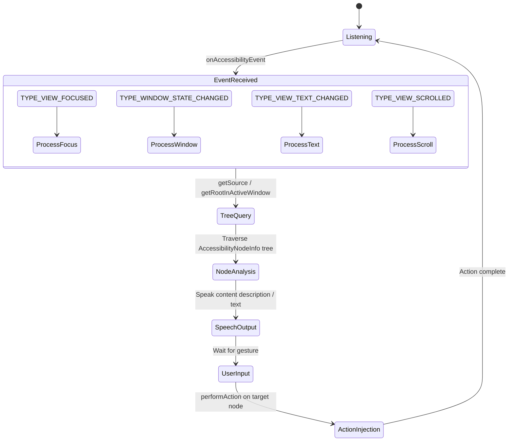

1. **Event Reception**: TalkBack receives `AccessibilityEvent`s from AMS.
   It configures its `AccessibilityServiceInfo` to request all event types
   and to retrieve window content.

2. **Tree Querying**: When an event indicates a meaningful state change (focus
   moved, window changed, text updated), TalkBack queries the accessibility
   tree starting from the event source or the root of the active window.

3. **Content Processing**: TalkBack analyzes the `AccessibilityNodeInfo`
   tree to determine what to speak. It considers:
   - `contentDescription` (always preferred for custom views)
   - `text` (for `TextView`-derived widgets)
   - `hintText` (for empty input fields)
   - `roleDescription` (for custom semantics -- an extras-bundle key
     written by AndroidX, not a first-class platform node property)
   - Collection and range information
   - State descriptions (`stateDescription`)

4. **Speech Synthesis**: Content is synthesized through Android's
   `TextToSpeech` API and spoken through the audio system.

5. **Haptic and Audio Feedback**: Navigation events produce earcons (short
   audio cues) and haptic feedback to provide non-visual context.

6. **Gesture Navigation**: In touch exploration mode, the user navigates by
   swiping (left/right to move between elements, up/down to change navigation
   granularity) and double-tapping to activate.

### 46.3.2 AccessibilityService Lifecycle

An `AccessibilityService` extends `android.app.Service` and is bound by the
system when the user enables it. The lifecycle callbacks are:

```java
// AccessibilityService.java (simplified)
public abstract class AccessibilityService extends Service {

    // Called when the system connects to the service
    protected void onServiceConnected() { }

    // Called for each accessibility event matching the service's filters
    public abstract void onAccessibilityEvent(AccessibilityEvent event);

    // Called when the system wants to interrupt the service's feedback
    public abstract void onInterrupt();

    // Called when a gesture is detected (if service requests gestures);
    // the deprecated onGesture(int gestureId) overload is protected
    public boolean onGesture(AccessibilityGestureEvent gestureEvent) {
        return false;
    }

    // Called for key events (if service requests key event filtering)
    protected boolean onKeyEvent(KeyEvent event) { return false; }
}
```

### 46.3.3 Service Configuration via XML Metadata

Every accessibility service declares its configuration in an XML file
referenced from the service's manifest entry:

```xml
<service
    android:name=".MyAccessibilityService"
    android:permission="android.permission.BIND_ACCESSIBILITY_SERVICE">
    <intent-filter>
        <action android:name=
            "android.accessibilityservice.AccessibilityService" />
    </intent-filter>
    <meta-data
        android:name="android.accessibilityservice"
        android:resource="@xml/accessibility_service_config" />
</service>
```

The XML configuration file specifies:

```xml
<accessibility-service
    xmlns:android="http://schemas.android.com/apk/res/android"
    android:accessibilityEventTypes="typeAllMask"
    android:accessibilityFeedbackType="feedbackSpoken"
    android:accessibilityFlags="flagReportViewIds
        |flagRetrieveInteractiveWindows
        |flagRequestTouchExplorationMode
        |flagRequestFilterKeyEvents
        |flagRequestMultiFingerGestures"
    android:canRetrieveWindowContent="true"
    android:canRequestTouchExplorationMode="true"
    android:canRequestFilterKeyEvents="true"
    android:canPerformGestures="true"
    android:canTakeScreenshot="true"
    android:notificationTimeout="100"
    android:settingsActivity=".SettingsActivity"
    android:isAccessibilityTool="true" />
```

Key flags include:

| Flag | Purpose |
|------|---------|
| `flagReportViewIds` | Include resource IDs in `AccessibilityNodeInfo` |
| `flagRetrieveInteractiveWindows` | Query multiple windows |
| `flagRequestTouchExplorationMode` | Enable touch exploration |
| `flagRequestFilterKeyEvents` | Receive key events before dispatch |
| `flagRequestMultiFingerGestures` | Receive multi-finger gestures |
| `flagRequestAccessibilityButton` | Show an accessibility button |
| `flagServiceHandlesDoubleTap` | Intercept double-tap during explore |
| `flagSendMotionEvents` | Receive raw motion events |
| `isAccessibilityTool` | Suppress non-a11y-tool warning |

### 46.3.4 Window Content Traversal

When a screen reader needs to build a complete understanding of the current
screen, it traverses the accessibility tree starting from the root:

```java
AccessibilityNodeInfo root = getRootInActiveWindow();
if (root != null) {
    traverseTree(root);
}

void traverseTree(AccessibilityNodeInfo node) {
    // Process this node
    processNode(node);

    // Recurse into children
    for (int i = 0; i < node.getChildCount(); i++) {
        AccessibilityNodeInfo child = node.getChild(i);
        if (child != null) {
            traverseTree(child);
        }
    }
}
```

Each `getChild()` call is a Binder IPC to the app process (unless the node
is cached). To mitigate this cost, the prefetch system (described in
section 46.1.6) fetches related nodes proactively.

### 46.3.5 The AccessibilityCache

Services maintain an `AccessibilityCache` to reduce Binder round-trips:

```
frameworks/base/core/java/android/view/accessibility/AccessibilityCache.java
```

The cache stores `AccessibilityNodeInfo` and `AccessibilityWindowInfo` objects
and is invalidated when events indicate that cached data may be stale. Cache
invalidation events include `TYPE_WINDOW_CONTENT_CHANGED`,
`TYPE_WINDOW_STATE_CHANGED`, and `TYPE_WINDOWS_CHANGED`.

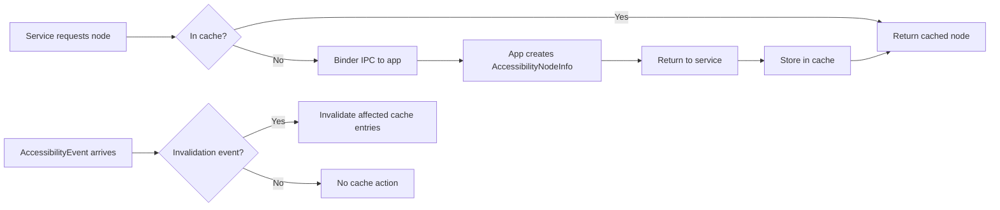

### 46.3.6 Braille Display Support

Recent Android versions include `BrailleDisplayConnection`, which allows
accessibility services to communicate with refreshable braille displays:

```
frameworks/base/services/accessibility/java/com/android/server/accessibility/
    BrailleDisplayConnection.java
```

This enables TalkBack to output content to Braille hardware and receive
Braille keyboard input, supporting deafblind users.

---

## 46.4 Switch Access

Switch Access is Android's scanning-based accessibility service that enables
users with severe motor impairments to interact with the device using one or
more physical switches (buttons, keyboard keys, or Bluetooth devices).

### 46.4.1 Operating Principle

Unlike TalkBack, which relies on touch exploration, Switch Access highlights
UI elements one at a time (or in groups) in a scanning pattern. The user
activates a switch to select the currently highlighted element.

The scanning modes are:

| Mode | Description |
|------|-------------|
| **Auto-scan** | Elements highlight automatically at a configurable interval |
| **Step scanning** | One switch advances to the next element, another selects |
| **Group selection** | Elements are divided into groups; user narrows down by selecting groups |

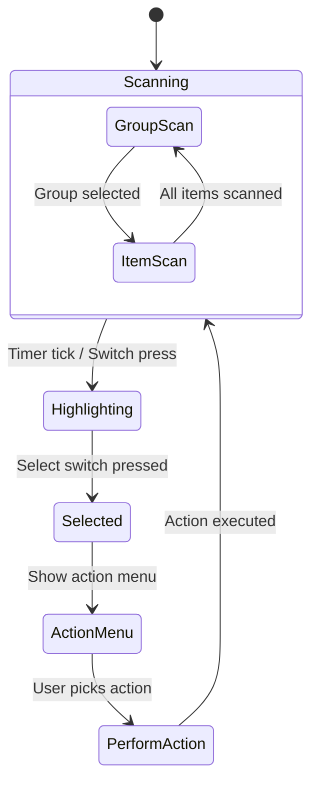

### 46.4.2 Implementation Architecture

Switch Access runs as an `AccessibilityService` and leverages the same APIs
as TalkBack. Its unique behavior centers on:

1. **Key Event Interception**: Switch Access requests `flagRequestFilterKeyEvents`
   to capture switch presses (which appear as key events from external input
   devices).

2. **Overlay Drawing**: It uses `TYPE_ACCESSIBILITY_OVERLAY` windows to draw
   highlight rectangles around scannable elements. This window type is
   exclusive to accessibility services.

3. **Node Scanning**: It traverses the accessibility tree to build a flat list
   of actionable nodes, then iterates through them in the configured scan
   order.

4. **Action Menus**: When an element is selected, Switch Access shows a menu
   of available actions (click, long click, scroll, etc.) derived from the
   node's `AccessibilityAction` list.

### 46.4.3 KeyEvent Filtering

The key event filtering mechanism is central to Switch Access. When a service
requests key event filtering, AMS routes key events through
`KeyEventDispatcher`:

```
frameworks/base/services/accessibility/java/com/android/server/accessibility/
    KeyEventDispatcher.java
```

The dispatcher sends each key event to all services that requested filtering.
Services have 500ms to respond:

```java
// KeyEventDispatcher.java, line 52
private static final long ON_KEY_EVENT_TIMEOUT_MILLIS = 500;
```

If a service reports the event as handled, it is consumed and not passed to
the rest of the input pipeline. If the service does not respond within the
timeout, the event is passed through.

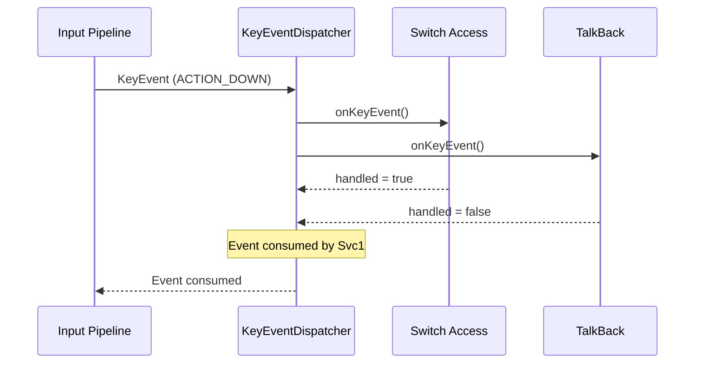

### 46.4.4 Accessibility Overlays

Accessibility services can create overlay windows using
`TYPE_ACCESSIBILITY_OVERLAY`. These windows:

- Sit at window layer 31 -- above system alert, drag, and navigation-bar
  windows, but below the accessibility magnification overlay, secure system
  overlay, boot progress, and pointer layers
- Are created through the service's `WindowManager`
- Are automatically removed when the service disconnects
- Are reported to accessibility services in the window list as
  `AccessibilityWindowInfo` entries of type `TYPE_ACCESSIBILITY_OVERLAY`

Switch Access uses overlays to draw highlight borders, action menus, and the
scanning cursor. This is a privileged capability -- only services with
`BIND_ACCESSIBILITY_SERVICE` permission can create these overlays.

### 46.4.5 AutoclickController

The autoclick feature, while distinct from Switch Access, serves a similar
population of users with motor impairments. It automatically clicks when the
mouse cursor stops moving:

```
frameworks/base/services/accessibility/java/com/android/server/accessibility/
    autoclick/AutoclickController.java
```

The click-type constants live in `AutoclickTypePanel` (in the same
`autoclick/` package), which `AutoclickController` static-imports:

| Type | Description |
|------|-------------|
| `AUTOCLICK_TYPE_LEFT_CLICK` | Standard left click (default) |
| `AUTOCLICK_TYPE_RIGHT_CLICK` | Right click |
| `AUTOCLICK_TYPE_DOUBLE_CLICK` | Double click |
| `AUTOCLICK_TYPE_LONG_PRESS` | Long press |
| `AUTOCLICK_TYPE_DRAG` | Drag (hold and move) |
| `AUTOCLICK_TYPE_SCROLL` | Scroll |

The autoclick delay is configurable and defaults to a value that balances
responsiveness with accidental activation. The defaults the controller
static-imports from `AccessibilityManager` are:

```java
// AutoclickController imports
AccessibilityManager.AUTOCLICK_DELAY_WITH_INDICATOR_DEFAULT  // 1000 ms
AccessibilityManager.AUTOCLICK_CURSOR_AREA_SIZE_DEFAULT
AccessibilityManager.AUTOCLICK_IGNORE_MINOR_CURSOR_MOVEMENT_DEFAULT
AccessibilityManager.AUTOCLICK_REVERT_TO_LEFT_CLICK_DEFAULT
```

Movement detection includes jitter tolerance to handle involuntary cursor
movement from poor motor control. This prevents both:

- Unwanted clicks when there is no intentional mouse movement
- Autoclick never triggering because minor tremors are detected as movement

The `AutoclickController` implements `EventStreamTransformation`, placing it
in the same input pipeline as touch exploration and magnification. It
observes mouse motion events and injects click event sequences when the
cursor has been stationary for the configured delay period.

### 46.4.6 MouseKeysInterceptor

The `MouseKeysInterceptor` enables keyboard-based cursor control, allowing
users who cannot use a mouse to control the mouse pointer with keyboard
keys:

```
frameworks/base/services/accessibility/java/com/android/server/accessibility/
    MouseKeysInterceptor.java
```

It is a `BaseEventStreamTransformation` that also listens for input-device
changes:

```java
// MouseKeysInterceptor.java, line 73
public class MouseKeysInterceptor extends BaseEventStreamTransformation
        implements Handler.Callback, InputManager.InputDeviceListener {
```

In Android 17 the interceptor does not synthesize pointer motion directly into
the input pipeline. Instead it owns a `VirtualMouse` -- the same virtual-input
abstraction used by virtual displays -- and drives the cursor through it:

```java
// MouseKeysInterceptor.java
import android.hardware.input.VirtualMouse;
import android.hardware.input.VirtualMouseButtonEvent;
import android.hardware.input.VirtualMouseRelativeEvent;
import android.hardware.input.VirtualMouseScrollEvent;
// A new VirtualMouse is created whenever mouse keys is turned on in Settings.
private VirtualMouse mVirtualMouse = null;
```

Routing through `VirtualMouse` (rather than the older bespoke
`MouseEventHandler`, which was deleted in 17) means mouse-keys motion goes
through the standard virtual-device path and gets a unique device name, so it
coexists cleanly with real pointing devices.

When enabled, designated keys move the cursor and simulate clicks. The
interceptor supports both a primary key layout and the numeric keypad, but the
numpad mapping only takes effect when Num Lock is on:

```java
// MouseKeysInterceptor.java, lines 716-718
// If we are using numpad keys, they only work if Num Lock is on.
boolean isNumLockOn = (event.getMetaState() & KeyEvent.META_NUM_LOCK_ON) != 0;
if (keyCode == mouseKeyEvent.getNumpadKeyCode(inputDevice) && !isNumLockOn) {
    // ignore numpad mouse key when Num Lock is off
}
```

A per-device capability cache (`mDeviceNumpadCapabilityCache`) records whether
each connected keyboard actually has the required numpad keys, so the feature
degrades gracefully on keyboards without a numeric keypad. Mouse keys is
registered as a shortcut target through:

```java
// AccessibilityShortcutController.java, line 98
public static final ComponentName MOUSE_KEYS_COMPONENT_NAME =
    new ComponentName("com.android.server.accessibility", "MouseKeys");
```

---

## 46.5 Magnification

Android provides two complementary magnification modes for users with low
vision: **full-screen magnification** and **window magnification**. The
implementation spans the accessibility service infrastructure and the window
manager.

### 46.5.1 Magnification Architecture

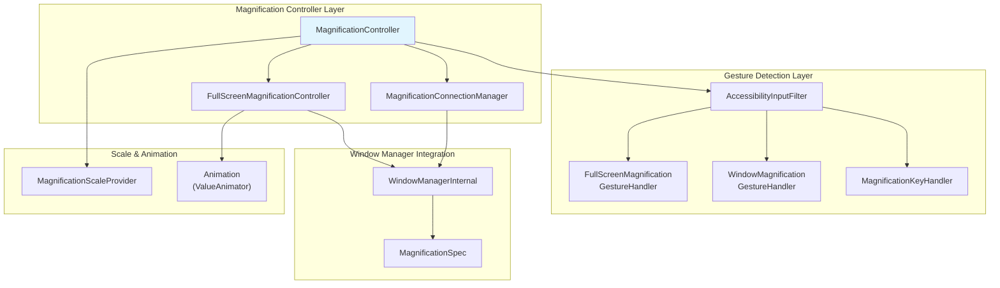

The magnification subsystem lives under:
```
frameworks/base/services/accessibility/java/com/android/server/accessibility/
    magnification/
```

Key source files:

| File | Lines | Role |
|------|-------|------|
| `MagnificationController.java` | ~1500 | Orchestrates mode transitions and UI |
| `FullScreenMagnificationController.java` | ~2600 | Full-screen zoom via MagnificationSpec |
| `MagnificationConnectionManager.java` | ~1400 | Window magnification via SystemUI |
| `FullScreenMagnificationGestureHandler.java` | ~1900 | Triple-tap and pinch gesture detection |
| `WindowMagnificationGestureHandler.java` | ~600 | Window magnification gesture handling |
| `MagnificationKeyHandler.java` | ~170 | Keyboard shortcut handling |
| `MagnificationScaleProvider.java` | ~140 | Scale bounds and persistence |
| `MagnificationGestureHandler.java` | ~250 | Base class for gesture handlers |

### 46.5.2 Full-Screen Magnification

Full-screen magnification scales the entire display content around a center
point. It operates by modifying the `MagnificationSpec` that
WindowManagerService applies to the display:

```java
// FullScreenMagnificationController.java, line 90
public class FullScreenMagnificationController implements
    WindowManagerInternal.AccessibilityControllerInternal
        .UiChangesForAccessibilityCallbacks {
```

The `MagnificationSpec` contains a scale factor and x/y offsets:

```java
// frameworks/base/core/java/android/view/MagnificationSpec.java
public class MagnificationSpec implements Parcelable {
    public float scale = 1.0f;
    public float offsetX = 0.0f;
    public float offsetY = 0.0f;
}
```

When magnification is active, every window on the display is transformed by
this spec, effectively zooming in on a region of the screen.

The controller maintains per-display state:

```java
// FullScreenMagnificationController.java, line 116
private final SparseArray<DisplayMagnification> mDisplays = new SparseArray<>(0);
```

### 46.5.3 Full-Screen Magnification Gestures

The `FullScreenMagnificationGestureHandler` implements a sophisticated state
machine to detect magnification gestures. The primary interaction model:

1. **Triple tap** toggles magnification on/off at the tap location.
2. **Triple tap and hold** temporarily magnifies and enters viewport dragging
   mode -- the magnified region follows the finger. Releasing the finger
   returns to the previous state.
3. **Two-finger pinch** while magnified adjusts the zoom level.
4. **Two-finger scroll** while magnified pans the viewport.

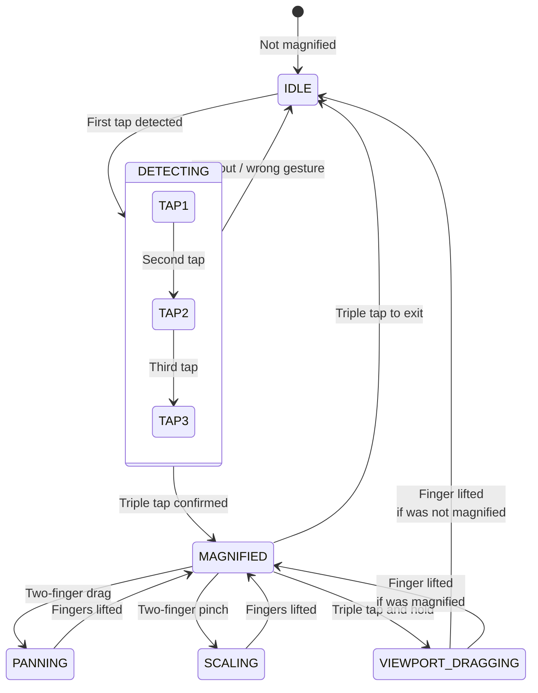

The gesture handler is installed as part of the `EventStreamTransformation`
pipeline in `AccessibilityInputFilter`:

```java
// AccessibilityInputFilter.java, line 96
static final int FLAG_FEATURE_MAGNIFICATION_SINGLE_FINGER_TRIPLE_TAP
    = 0x00000001;
```

### 46.5.4 Window Magnification

Window magnification displays a movable, resizable magnifying glass window
over the content. Unlike full-screen magnification, only a portion of the
screen is magnified, allowing the user to see both magnified and unmagnified
content simultaneously.

Window magnification is implemented through a cooperation between the
accessibility service and SystemUI. The `MagnificationConnectionManager`
manages the connection to the SystemUI-side component:

```
frameworks/base/services/accessibility/java/com/android/server/accessibility/
    magnification/MagnificationConnectionManager.java
```

The `WindowMagnificationGestureHandler` handles gestures specific to window
magnification:

```java
// WindowMagnificationGestureHandler.java, line 68
public class WindowMagnificationGestureHandler
    extends MagnificationGestureHandler {
```

Its gestures include:

- Triple tap to toggle the magnification window
- Pinch (with at least one finger inside the window) to adjust scale
- Two-finger drag to move the magnification window

### 46.5.5 MagnificationController: Mode Coordination

The top-level `MagnificationController` coordinates between full-screen and
window magnification modes and manages the magnification switch UI:

```java
// MagnificationController.java, line 93 (Android 17)
public class MagnificationController implements
    MagnificationConnectionManager.Callback,
    MagnificationGestureHandler.Callback,
    MagnificationKeyHandler.Callback,
    FullScreenMagnificationController.MagnificationInfoChangedCallback,
    WindowManagerInternal.AccessibilityControllerInternal
        .UiChangesForAccessibilityCallbacks {
```

The magnification capabilities setting determines available modes:

| Setting Value | Modes Available |
|---------------|-----------------|
| `ACCESSIBILITY_MAGNIFICATION_MODE_FULLSCREEN` | Full-screen only |
| `ACCESSIBILITY_MAGNIFICATION_MODE_WINDOW` | Window only |
| `ACCESSIBILITY_MAGNIFICATION_MODE_ALL` | Both (user can switch) |

When both modes are available, a floating switch button appears, allowing the
user to toggle between full-screen and window magnification.

### 46.5.6 Scale Constraints

The `MagnificationScaleProvider` enforces scale bounds. In Android 17 the
bounds are no longer hardcoded literals; they are pulled from
`MagnificationConstants`, and the maximum is a system property so OEMs can
raise the ceiling:

```java
// MagnificationScaleProvider.java
public static final float MIN_SCALE = SCALE_MIN_VALUE; // 1.0f
public static final float MAX_SCALE = SCALE_MAX_VALUE; // ro.config.max_magnification_scale, default 8.0

// MagnificationConstants.java
public static final float SCALE_MIN_VALUE = 1.0f;
public static final float SCALE_MAX_VALUE = Float.parseFloat(
    SystemProperties.get("ro.config.max_magnification_scale", "8.0"));
public static final float PERSISTED_SCALE_MIN_VALUE = 1.3f;
```

`PERSISTED_SCALE_MIN_VALUE` (1.3x) is the smallest scale that gets remembered
across sessions, so that re-enabling magnification does not snap to a barely
useful 1.0x. The provider also handles per-user scale persistence through
`Settings.Secure`:

```java
Settings.Secure.ACCESSIBILITY_DISPLAY_MAGNIFICATION_SCALE
```

### 46.5.7 Keyboard Magnification Control

The `MagnificationKeyHandler` enables magnification control through keyboard
shortcuts, supporting users who use external keyboards:

```
frameworks/base/services/accessibility/java/com/android/server/accessibility/
    magnification/MagnificationKeyHandler.java
```

The shortcuts require Alt+Meta held together (and explicitly neither Ctrl
nor Shift): Alt+Meta+`=` zooms in, Alt+Meta+`-` zooms out, and
Alt+Meta+arrow keys pan while magnified. The handler implements repeat key behavior with a
configurable initial delay and a repeat interval of 60ms:

```java
// MagnificationController.java, line 140
public static final int KEYBOARD_REPEAT_INTERVAL_MS = 60;
```

Android 17's desktop and connected-display work touches magnification only at
the flag level so far. The `desktop_magnification_settings_polish` flag
(`packages/apps/Settings/aconfig/accessibility/accessibility_flags.aconfig`,
namespace `accessibility`, marked `PURPOSE_BUGFIX`) polishes the magnification
settings UI for touch and keyboard input form factors rather than adding a new
magnification mode, and `enable_autoclick_for_connected_displays`
(`frameworks/base/services/accessibility/accessibility.aconfig`, also a bugfix
flag) fixes autoclick on external displays. There is no separate desktop
magnification engine; the same `FullScreenMagnificationController`, which already
tracks per-display state in its `mDisplays` array, drives magnification on
connected displays.

### 46.5.8 Always-On Magnification

Always-on magnification keeps magnification active at 1.0x scale, ready to
zoom in without the activation gesture. This reduces interaction latency for
frequent magnification users. The feature is controlled by the
`Settings.Secure.ACCESSIBILITY_MAGNIFICATION_ALWAYS_ON_ENABLED` secure
setting, read by `AccessibilityManagerService.readAlwaysOnMagnificationLocked()`
and gated on the
`com.android.internal.R.bool.config_magnification_always_on_enabled` config
resource.

When enabled, `FullScreenMagnificationController.setAlwaysOnMagnificationEnabled()`
records the state, and on user context changes (`onUserContextChanged()`) the
controller zooms back to 100% instead of resetting magnification entirely, so
it can be immediately re-adjusted without the triple-tap activation gesture.

### 46.5.9 Magnification and Window Manager Integration

The magnification system's interaction with WindowManager is critical to
understanding how the visual effect is achieved.

**Full-screen magnification** works by having WindowManager apply a
`MagnificationSpec` transformation to the entire display. This transformation
is applied at the SurfaceFlinger composition level, meaning it affects all
windows on the display uniformly. The flow is:

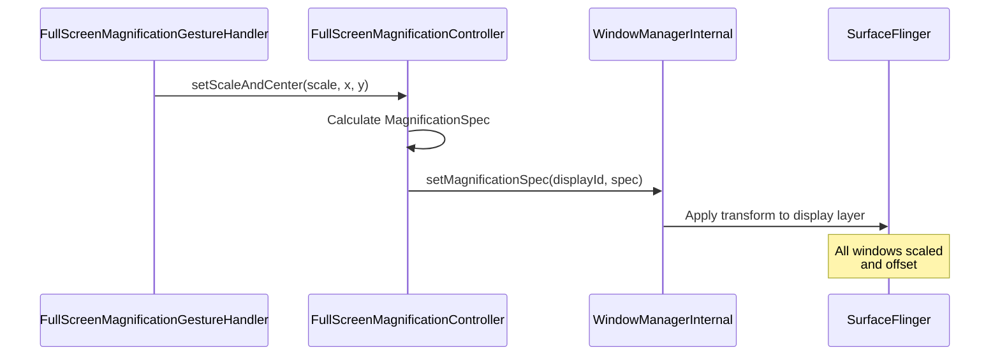

**Window magnification** takes a fundamentally different approach. Instead of
transforming the entire display, it renders a secondary viewport that captures
and magnifies a region of the screen. This is implemented through SystemUI's
magnification window, which:

1. Captures screen content from the magnification region
2. Renders it scaled in a movable overlay window
3. Allows pinch-to-zoom and drag-to-pan within the window

The coordination between AMS and SystemUI for window magnification happens
through the `IMagnificationConnection` AIDL interface:

```
frameworks/base/core/java/android/view/accessibility/
    IMagnificationConnection.aidl
    IMagnificationConnectionCallback.aidl
    IRemoteMagnificationAnimationCallback.aidl
```

### 46.5.10 Cursor Following and Input Focus Tracking

The magnification system can follow text cursor movement and keyboard focus
changes. Two feature settings control this:

```java
// FullScreenMagnificationController.java, lines 120-122
private boolean mMagnificationFollowTypingEnabled = true;
private boolean mMagnificationFollowKeyboardEnabled = false;
```

When `mMagnificationFollowTypingEnabled` is true and the user is typing in a
text field, the magnification viewport automatically pans to keep the cursor
visible. The companion `mMagnificationFollowKeyboardEnabled` flag controls
whether the viewport also follows keyboard focus changes; its settings
default is conditional -- follow-keyboard defaults on only when the
`enable_magnification_viewport_prioritization` aconfig flag is enabled (to
avoid viewport jitter), and off otherwise. The cursor
following mode is configured through:

```java
Settings.Secure.ACCESSIBILITY_MAGNIFICATION_CURSOR_FOLLOWING_MODE
```

This is essential for low-vision users who use magnification while typing --
without cursor following, the text insertion point would quickly leave the
magnified viewport. Android 17 expands this from a simple on/off into a
three-way mode that governs how the magnified viewport tracks a moving mouse
pointer:

```java
// android.provider.Settings.Secure
ACCESSIBILITY_MAGNIFICATION_CURSOR_FOLLOWING_MODE_CONTINUOUS = 0;
ACCESSIBILITY_MAGNIFICATION_CURSOR_FOLLOWING_MODE_CENTER     = 1;
ACCESSIBILITY_MAGNIFICATION_CURSOR_FOLLOWING_MODE_EDGE       = 2;
```

`AccessibilityInputFilter` reads this mode
(`getMagnificationCursorFollowingMode()`) and applies it through the
`FullScreenMagnificationPointerMotionEventFilter`, which decides whether the
viewport pans continuously with the pointer, recenters on it, or only nudges
when the pointer reaches the viewport edge.

### 46.5.11 Magnification Thumbnail

The `MagnificationThumbnail` provides a minimap-style overview showing which
portion of the screen is currently magnified:

```
frameworks/base/services/accessibility/java/com/android/server/accessibility/
    magnification/MagnificationThumbnail.java
```

This gives users spatial awareness of their magnified viewport's position
relative to the full screen, particularly useful at high zoom levels where
the visible portion is a small fraction of the total screen area.

### 46.5.12 Pointer Motion Event Filtering

The `FullScreenMagnificationPointerMotionEventFilter` adjusts pointer events
to account for the magnification transformation:

```
frameworks/base/services/accessibility/java/com/android/server/accessibility/
    magnification/FullScreenMagnificationPointerMotionEventFilter.java
```

When the screen is magnified, raw touch coordinates must be transformed to
screen coordinates. This filter ensures that pointer events are correctly
mapped to the magnified coordinate space, so that tapping on a magnified
button hits the correct target.

### 46.5.13 Vibration Feedback

The `FullScreenMagnificationVibrationHelper` provides haptic feedback during
magnification interactions:

```
frameworks/base/services/accessibility/java/com/android/server/accessibility/
    magnification/FullScreenMagnificationVibrationHelper.java
```

Vibration fires when the magnified viewport reaches the screen's left or
right edge while panning, and only when the
`ACCESSIBILITY_DISPLAY_MAGNIFICATION_EDGE_HAPTIC_ENABLED` secure setting is
on. This gives non-visual confirmation that the viewport has hit the edge of
the screen for users who may not perceive it visually.

---

## 46.6 Accessibility Events

Accessibility events are the primary communication mechanism between
applications and accessibility services. Every meaningful UI change can
produce an event that services observe.

### 46.6.1 Event Types

`AccessibilityEvent` defines a comprehensive set of event types. Each type
is a power-of-two constant, enabling efficient bitmask filtering:

```java
// AccessibilityEvent.java
public static final int TYPE_VIEW_CLICKED                          = 1;
public static final int TYPE_VIEW_LONG_CLICKED                     = 1 << 1;
public static final int TYPE_VIEW_SELECTED                         = 1 << 2;
public static final int TYPE_VIEW_FOCUSED                          = 1 << 3;
public static final int TYPE_VIEW_TEXT_CHANGED                     = 1 << 4;
public static final int TYPE_WINDOW_STATE_CHANGED                  = 1 << 5;
public static final int TYPE_NOTIFICATION_STATE_CHANGED            = 1 << 6;
public static final int TYPE_VIEW_HOVER_ENTER                      = 1 << 7;
public static final int TYPE_VIEW_HOVER_EXIT                       = 1 << 8;
public static final int TYPE_TOUCH_EXPLORATION_GESTURE_START       = 1 << 9;
public static final int TYPE_TOUCH_EXPLORATION_GESTURE_END         = 1 << 10;
public static final int TYPE_WINDOW_CONTENT_CHANGED                = 1 << 11;
public static final int TYPE_VIEW_SCROLLED                         = 1 << 12;
public static final int TYPE_VIEW_TEXT_SELECTION_CHANGED            = 1 << 13;
public static final int TYPE_ANNOUNCEMENT                          = 1 << 14;
public static final int TYPE_VIEW_ACCESSIBILITY_FOCUSED            = 1 << 15;
public static final int TYPE_VIEW_ACCESSIBILITY_FOCUS_CLEARED      = 1 << 16;
public static final int TYPE_VIEW_TEXT_TRAVERSED_AT_MOVEMENT_GRANULARITY
                                                                    = 1 << 17;
public static final int TYPE_GESTURE_DETECTION_START               = 1 << 18;
public static final int TYPE_GESTURE_DETECTION_END                 = 1 << 19;
public static final int TYPE_TOUCH_INTERACTION_START               = 1 << 20;
public static final int TYPE_TOUCH_INTERACTION_END                 = 1 << 21;
public static final int TYPE_WINDOWS_CHANGED                       = 1 << 22;
public static final int TYPE_VIEW_CONTEXT_CLICKED                  = 1 << 23;
public static final int TYPE_ASSIST_READING_CONTEXT                = 1 << 24;
public static final int TYPE_SPEECH_STATE_CHANGE                   = 1 << 25;
public static final int TYPE_VIEW_TARGETED_BY_SCROLL               = 1 << 26;
```

### 46.6.2 Event Properties by Type

Each event type carries a different set of properties. The following table
summarizes the key properties for commonly handled events:

| Event Type | Key Properties |
|------------|---------------|
| `TYPE_VIEW_CLICKED` | source, className, packageName, eventTime |
| `TYPE_VIEW_FOCUSED` | source, className, packageName, eventTime |
| `TYPE_VIEW_TEXT_CHANGED` | text, beforeText, fromIndex, addedCount, removedCount |
| `TYPE_WINDOW_STATE_CHANGED` | className, windowChanges, contentChangeTypes |
| `TYPE_VIEW_SCROLLED` | scrollDeltaX, scrollDeltaY, maxScrollX, maxScrollY |
| `TYPE_NOTIFICATION_STATE_CHANGED` | text, parcelableData (Notification) |
| `TYPE_WINDOWS_CHANGED` | windowChanges bitmask |
| `TYPE_VIEW_TEXT_SELECTION_CHANGED` | fromIndex, toIndex, itemCount |
| `TYPE_VIEW_TEXT_TRAVERSED_AT_MOVEMENT_GRANULARITY` | movementGranularity, fromIndex, toIndex, action |

### 46.6.3 Event Origination in the View System

Events originate in the View system through two paths:

**Path 1: Automatic events** -- The framework fires events automatically for
standard state changes. For example, when a `View` gains focus:

```java
// View.java (simplified)
protected void onFocusChanged(boolean gainFocus, int direction,
        Rect previouslyFocusedRect) {
    if (gainFocus) {
        sendAccessibilityEvent(AccessibilityEvent.TYPE_VIEW_FOCUSED);
    }
}
```

**Path 2: Custom events** -- Custom views or app code can fire events
manually:

```java
view.sendAccessibilityEvent(AccessibilityEvent.TYPE_ANNOUNCEMENT);
// or with more control:
AccessibilityEvent event = AccessibilityEvent.obtain(
    AccessibilityEvent.TYPE_WINDOW_STATE_CHANGED);
event.setContentDescription("Loading complete");
view.sendAccessibilityEventUnchecked(event);
```

### 46.6.4 Event Propagation Through the View Hierarchy

When a View fires an accessibility event, it propagates upward through the
view hierarchy before being sent to AMS:

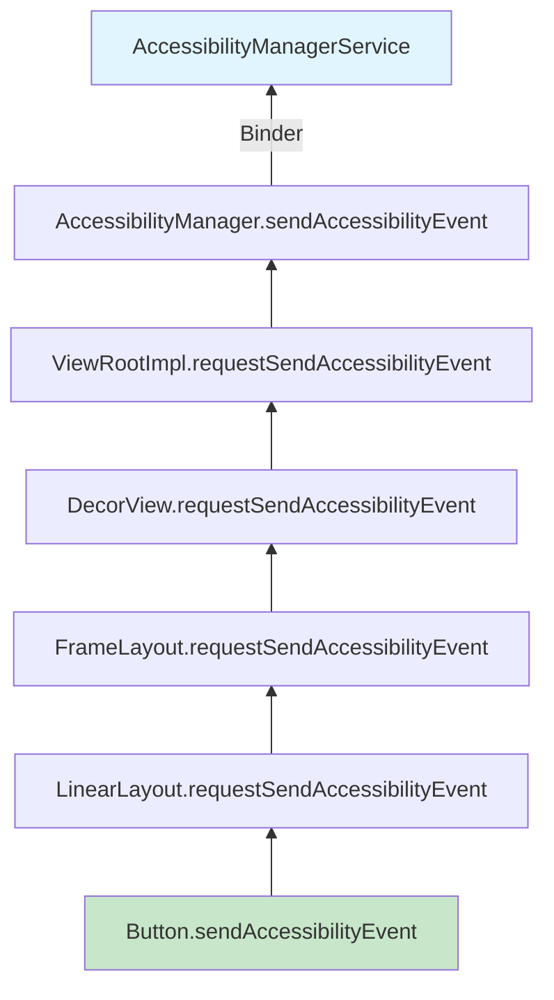

Each parent in the chain has the opportunity to modify the event via
`onRequestSendAccessibilityEvent()`. This is how, for example, a `RecyclerView`
adds scroll position information to events from its children.

### 46.6.5 Windows Changed Sub-Types

`TYPE_WINDOWS_CHANGED` carries additional information through the
`WINDOWS_CHANGE_*` sub-types, exposed via
`AccessibilityEvent.getWindowChanges()`:

```java
// AccessibilityEvent.java
// Change type for TYPE_WINDOWS_CHANGED:
public static final int WINDOWS_CHANGE_ADDED    = 1;       // Window appeared
public static final int WINDOWS_CHANGE_REMOVED  = 1 << 1;  // Window disappeared
public static final int WINDOWS_CHANGE_TITLE    = 1 << 2;  // Title changed
public static final int WINDOWS_CHANGE_FOCUSED  = 1 << 6;  // Focus changed
```

These sub-types allow services to react differently to window additions versus
title changes versus focus transitions. The separate
`TYPE_WINDOW_STATE_CHANGED` event uses the `CONTENT_CHANGE_TYPE_*` constants
instead, read via `getContentChangeTypes()`.

### 46.6.6 Event Throttling and Coalescing

AMS applies event throttling to prevent services from being overwhelmed by
high-frequency events (e.g., `TYPE_VIEW_SCROLLED` during a fling). Each
service has a `notificationTimeout` configured in its metadata:

```xml
android:notificationTimeout="100"
```

Events of the same type from the same source within this timeout window are
coalesced -- only the most recent one is delivered.

### 46.6.7 Sensitive Event Data

Views can be marked as having sensitive accessibility data through:

```java
view.setAccessibilityDataSensitive(
    View.ACCESSIBILITY_DATA_SENSITIVE_YES);
```

Marking a view accessibility-data-sensitive restricts the view and all of its
descendants to accessibility services whose
`AccessibilityServiceInfo.isAccessibilityTool` is true; non-tool services see
neither its nodes nor its events. The flag propagates down the hierarchy and
is also inferred from `filterTouchesWhenObscured`. This keeps sensitive data
(such as password field content) away from services that are not declared
accessibility tools.

### 46.6.8 The AccessibilityRecord Base Class

`AccessibilityEvent` extends `AccessibilityRecord`, which provides the base
data fields shared by all event types:

```java
// AccessibilityRecord.java (simplified fields)
private int mBooleanProperties;       // Bit-packed boolean states
private int mCurrentItemIndex;        // Current index in scrollable
private int mItemCount;               // Total items in scrollable
private int mScrollX;                 // Horizontal scroll position
private int mScrollY;                 // Vertical scroll position
private int mScrollDeltaX;            // Horizontal scroll delta
private int mScrollDeltaY;            // Vertical scroll delta
private int mMaxScrollX;              // Max horizontal scroll
private int mMaxScrollY;              // Max vertical scroll
private int mAddedCount;              // Chars added (text change)
private int mRemovedCount;            // Chars removed (text change)
private int mFromIndex;               // Start index
private int mToIndex;                 // End index
private CharSequence mClassName;      // Source class name
private CharSequence mContentDescription;
private CharSequence mBeforeText;     // Text before change
private Parcelable mParcelableData;   // Extra parcelable data
private List<CharSequence> mText;     // Text list
private int mSourceWindowId;          // Source window ID
private long mSourceNodeId;           // Source node ID
private int mSourceDisplayId;         // Source display ID
private int mConnectionId;            // Connection for queries
```

An event can also contain multiple records. For example, a window with
multiple changed children might produce a single event with multiple
`AccessibilityRecord` entries, each describing a different change.

### 46.6.9 Event Recycling and Pooling

`AccessibilityEvent` objects were historically pooled to reduce garbage
collection pressure, but object pooling has been discontinued:
`AccessibilityEvent.obtain()` is deprecated and now simply allocates a new
instance, and `recycle()` is a deprecated no-op (the same is true of
`AccessibilityNodeInfo`):

```java
// AccessibilityEvent.java (pooling discontinued)
@Deprecated
public static AccessibilityEvent obtain() {
    return new AccessibilityEvent();
}

@Deprecated
public void recycle() {}
```

Calls like `event.recycle()` that remain in AMS are vestigial -- they compile
and run but do nothing. New code should construct events directly with
`new AccessibilityEvent(eventType)`.

### 46.6.10 Event Dispatch Timing

The timing guarantees of the accessibility event system are:

1. **In-process**: Events from `View.sendAccessibilityEvent()` to
   `AccessibilityManager.sendAccessibilityEvent()` are synchronous.

2. **Binder crossing**: The call from `AccessibilityManager` to AMS is
   a one-way Binder transaction, meaning the caller does not block waiting
   for AMS to process the event.

3. **AMS processing**: AMS processes events on its main handler, which
   provides ordering guarantees. Events from the same source are processed
   in order.

4. **Service delivery**: Events are delivered to services through one-way
   Binder calls. Each service receives events independently, and a slow
   service cannot block event delivery to other services.

5. **End-to-end latency**: Typical end-to-end latency from View event to
   service callback is 5-15ms on modern hardware. The `notificationTimeout`
   configured by the service may add additional delay for coalesced events.

### 46.6.11 Event Type String Representation

For debugging, each event type has a string representation:

```java
// AccessibilityEvent.java, singleEventTypeToString(), line ~1970
case TYPE_VIEW_CLICKED:    return "TYPE_VIEW_CLICKED";
case TYPE_VIEW_FOCUSED:    return "TYPE_VIEW_FOCUSED";
case TYPE_VIEW_TEXT_CHANGED: return "TYPE_VIEW_TEXT_CHANGED";
case TYPE_WINDOW_STATE_CHANGED: return "TYPE_WINDOW_STATE_CHANGED";
case TYPE_NOTIFICATION_STATE_CHANGED:
                           return "TYPE_NOTIFICATION_STATE_CHANGED";
case TYPE_TOUCH_EXPLORATION_GESTURE_START:
                           return "TYPE_TOUCH_EXPLORATION_GESTURE_START";
case TYPE_TOUCH_EXPLORATION_GESTURE_END:
                           return "TYPE_TOUCH_EXPLORATION_GESTURE_END";
```

These are used extensively in `dumpsys` output and trace logs.

---

## 46.7 Content Descriptions and Semantics

Content descriptions are the most fundamental accessibility mechanism in
Android. They provide text labels for UI elements that do not have inherent
text content, enabling screen readers to describe the element to the user.

### 46.7.1 contentDescription vs. text vs. labeledBy

There are three primary mechanisms for providing semantic text to accessibility
services:

**contentDescription**: Set on any `View` to provide a brief, human-readable
description of its purpose. This is the primary accessibility label for
non-text views:

```java
imageButton.setContentDescription("Send message");
```

**text**: Automatically exposed by `TextView` subclasses. Screen readers
preferentially read the `text` property for text-containing views.

**labeledBy / labelFor**: Establishes a labeling relationship between two
views. Commonly used for form fields:

```xml
<TextView
    android:id="@+id/username_label"
    android:text="Username"
    android:labelFor="@id/username_input" />
<EditText
    android:id="@+id/username_input" />
```

In the accessibility tree, the `EditText` node's `labeledBy` property points
to the `TextView` node, so screen readers can announce "Username, edit text"
when the field gains focus.

### 46.7.2 Semantic Properties in AccessibilityNodeInfo

`AccessibilityNodeInfo` exposes a rich set of semantic properties:

```mermaid
graph TB
    Node["AccessibilityNodeInfo"]

    Node --> Text["Text Properties"]
    Text --> T1["text"]
    Text --> T2["contentDescription"]
    Text --> T3["hintText"]
    Text --> T4["tooltipText"]
    Text --> T5["stateDescription"]
    Text --> T6["roleDescription<br/>(extras-bundle key)"]
    Text --> T7["error"]

    Node --> State["State Properties"]
    State --> S1["isChecked"]
    State --> S2["isEnabled"]
    State --> S3["isSelected"]
    State --> S4["isPassword"]
    State --> S5["isFocusable"]
    State --> S6["isFocused"]
    State --> S7["isClickable"]
    State --> S8["isScrollable"]
    State --> S9["isEditable"]
    State --> S10["isVisibleToUser"]
    State --> S11["isImportantForAccessibility"]

    Node --> Structure["Structural Properties"]
    Structure --> R1["className"]
    Structure --> R2["packageName"]
    Structure --> R3["viewIdResourceName"]
    Structure --> R4["uniqueId"]

    Node --> Collection["Collection Properties"]
    Collection --> C1["CollectionInfo"]
    Collection --> C2["CollectionItemInfo"]
    Collection --> C3["RangeInfo"]
```

### 46.7.3 stateDescription

`stateDescription` (introduced in Android 11) provides a textual description
of the current state of a node, separate from its label. For example, a
toggle switch might have:

```java
node.setContentDescription("Wi-Fi");
node.setStateDescription("On");
```

Screen readers announce: "Wi-Fi, switch, On". This is preferred over changing
`contentDescription` to "Wi-Fi enabled" because it separates identity from
state.

### 46.7.4 roleDescription

`roleDescription` overrides the default role announced by screen readers.
A button might have `className = "android.widget.Button"`, which TalkBack
announces as "button". It is not a first-class `AccessibilityNodeInfo`
property -- there is no `setRoleDescription()` on the platform class.
Instead it travels as an extras-bundle key, which AndroidX's
`AccessibilityNodeInfoCompat.setRoleDescription()` writes for you:

```java
node.getExtras().putCharSequence(
    "AccessibilityNodeInfo.roleDescription", "link");
```

Use this sparingly -- overuse confuses users who expect standard role names.

### 46.7.5 Collection and Range Semantics

For lists, grids, and tabular data, `AccessibilityNodeInfo` provides
collection semantics:

**CollectionInfo** on the container node:
```java
AccessibilityNodeInfo.CollectionInfo.obtain(
    rowCount,    // number of rows
    columnCount, // number of columns
    hierarchical // whether the collection is hierarchical
);
```

**CollectionItemInfo** on each item node:
```java
AccessibilityNodeInfo.CollectionItemInfo.obtain(
    rowIndex, rowSpan,
    columnIndex, columnSpan,
    heading // whether this item is a heading
);
```

**RangeInfo** for continuous value controls:
```java
AccessibilityNodeInfo.RangeInfo.obtain(
    RangeInfo.RANGE_TYPE_INT,
    min,     // minimum value
    max,     // maximum value
    current  // current value
);
```

These semantics enable screen readers to announce "Item 3 of 15" or
"Volume, 50%, slider" -- providing spatial and quantitative context.

### 46.7.6 Custom Actions

Views can expose custom actions through `AccessibilityNodeInfo`:

```java
@Override
public void onInitializeAccessibilityNodeInfo(AccessibilityNodeInfo info) {
    super.onInitializeAccessibilityNodeInfo(info);
    info.addAction(new AccessibilityNodeInfo.AccessibilityAction(
        R.id.action_archive,
        "Archive"
    ));
}
```

When a screen reader user activates this node's action menu, "Archive" appears
as an option alongside the standard actions.

### 46.7.7 AccessibilityNodeProvider for Virtual Views

Custom views that draw multiple interactive elements (e.g., a calendar
widget, a chart) should implement `AccessibilityNodeProvider`:

```java
public class CalendarView extends View {
    @Override
    public AccessibilityNodeProvider getAccessibilityNodeProvider() {
        return new AccessibilityNodeProvider() {
            @Override
            public AccessibilityNodeInfo createAccessibilityNodeInfo(
                    int virtualViewId) {
                if (virtualViewId == HOST_VIEW_ID) {
                    return createNodeForHost();
                }
                return createNodeForDay(virtualViewId);
            }

            @Override
            public boolean performAction(int virtualViewId, int action,
                    Bundle arguments) {
                // Handle actions on virtual nodes
            }

            @Override
            public List<AccessibilityNodeInfo> findAccessibilityNodeInfosByText(
                    String searched, int virtualViewId) {
                // Text search within virtual tree
            }
        };
    }
}
```

Each virtual node gets a unique ID within the view, and the system uses the
`makeNodeId(viewId, virtualDescendantId)` scheme to create globally unique
64-bit node IDs.

### 46.7.8 Traversal Order

By default, accessibility traversal follows the View tree order. Applications
can customize this using:

```java
// Set explicit traversal order
viewA.setAccessibilityTraversalBefore(R.id.viewB);
viewB.setAccessibilityTraversalAfter(R.id.viewA);
```

Or by using `android:accessibilityTraversalBefore` and
`android:accessibilityTraversalAfter` attributes in layout XML.

### 46.7.9 importantForAccessibility

Not every View should be individually focusable by accessibility services. The
`importantForAccessibility` property controls whether a View appears in the
accessibility tree:

```java
// Values for importantForAccessibility
View.IMPORTANT_FOR_ACCESSIBILITY_AUTO             // System decides
View.IMPORTANT_FOR_ACCESSIBILITY_YES              // Always included
View.IMPORTANT_FOR_ACCESSIBILITY_NO               // Excluded
View.IMPORTANT_FOR_ACCESSIBILITY_NO_HIDE_DESCENDANTS // Excluded with children
```

The `AUTO` mode (default) uses heuristics: a View is considered important if
it is actionable (clickable, long-clickable, or focusable), has input
listeners or a touch delegate, has an `AccessibilityNodeProvider` or
`AccessibilityDelegate`, is a live region, is an accessibility pane, or is a
heading. A content description alone does not make a View important. The
`NO_HIDE_DESCENDANTS` option is useful for container views that should be
treated as a single accessible unit -- for example, a card view where the
entire card is clickable and individual children should not be independently
focusable.

### 46.7.10 Live Regions

Live regions announce content changes without requiring focus. They are
essential for dynamic content like timers, notification badges, and loading
indicators:

```java
// Set a view as a live region
view.setAccessibilityLiveRegion(View.ACCESSIBILITY_LIVE_REGION_POLITE);
```

| Live Region Mode | Behavior |
|-----------------|----------|
| `NONE` | Changes are not announced (default) |
| `POLITE` | Changes are announced when the screen reader is idle |
| `ASSERTIVE` | Changes interrupt current speech to announce immediately |

When a live region's content changes, a `TYPE_WINDOW_CONTENT_CHANGED` event is
fired. The screen reader checks the live region mode and either queues the
announcement (polite) or interrupts current speech (assertive).

### 46.7.11 Heading Navigation

Views can be marked as headings to enable heading-level navigation, similar
to heading navigation in web screen readers:

```java
node.setHeading(true);
```

When heading navigation is active in TalkBack, users can swipe up/down to
jump between headings, enabling rapid navigation through long, structured
content.

### 46.7.12 Pane Titles

Pane titles provide labels for major UI regions, announced when focus enters
a new pane:

```java
view.setAccessibilityPaneTitle("Search results");
```

When the content of a pane changes, the screen reader announces the pane
title to give context. This is particularly useful for fragments, tabs, and
other container-level navigation patterns.

### 46.7.13 The ExtraRenderingInfo API

For views that render text, `AccessibilityNodeInfo.ExtraRenderingInfo` provides
additional rendering details:

```java
ExtraRenderingInfo info = node.getExtraRenderingInfo();
if (info != null) {
    float textSize = info.getTextSizeInPx();
    int textSizeUnit = info.getTextSizeUnit();
    Size layoutSize = info.getLayoutSize();
}
```

This enables accessibility services to detect small text, poor contrast
ratios, and other visual accessibility issues beyond just missing labels.

The `AccessibilityNodeInfo` carries these relationships through
`traversalBefore` and `traversalAfter` properties, allowing screen readers to
navigate in the application's intended order rather than the default tree
traversal order.

---

## 46.8 Touch Exploration

Touch exploration is the mechanism by which blind and low-vision users
navigate the screen by touch. When touch exploration is enabled, touching
the screen does not activate controls -- instead, it describes them. The user
receives spoken feedback about whatever element is under their finger, and
activates elements through double-tapping.

### 46.8.1 The TouchExplorer Class

Touch exploration is implemented by:
```
frameworks/base/services/accessibility/java/com/android/server/accessibility/
    gestures/TouchExplorer.java
```

The class JavaDoc describes the interaction model:

```
1. One finger moving slow around performs touch exploration.
2. One finger moving fast around performs gestures.
3. Two close fingers moving in the same direction perform a drag.
4. Multi-finger gestures are delivered to view hierarchy.
5. Two fingers moving in different directions are considered a
   multi-finger gesture.
6. Double tapping performs a click action on the accessibility
   focused rectangle.
7. Tapping and holding for a while performs a long press in a
   similar fashion as the click above.
```

### 46.8.2 Touch State Machine

`TouchExplorer` implements an `EventStreamTransformation` that intercepts
all touch events and re-interprets them. It works closely with `TouchState`,
which tracks the current state:

```java
// TouchState.java
public static final int STATE_CLEAR = 0;
public static final int STATE_TOUCH_INTERACTING = 1;
public static final int STATE_TOUCH_EXPLORING = 2;
public static final int STATE_DRAGGING = 3;
public static final int STATE_DELEGATING = 4;
public static final int STATE_GESTURE_DETECTING = 5;
```

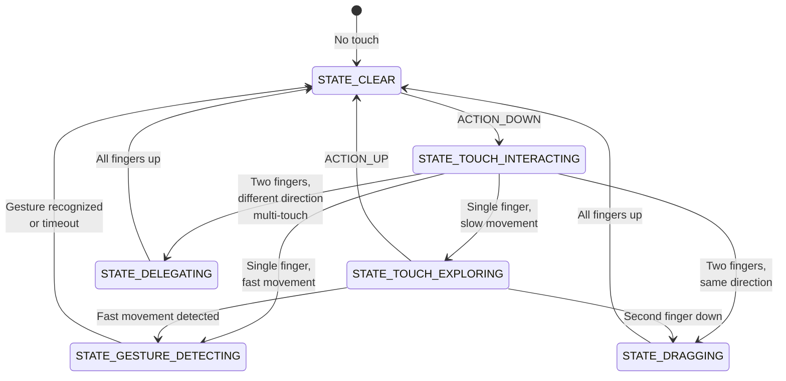

### 46.8.3 How Touch Exploration Transforms Events

When touch exploration is active, `TouchExplorer` transforms the event stream
as follows:

| User Action | Raw Event | Transformed Event |
|------------|-----------|-------------------|
| Finger down | `ACTION_DOWN` | `ACTION_HOVER_ENTER` |
| Finger moves slowly | `ACTION_MOVE` | `ACTION_HOVER_MOVE` |
| Finger up | `ACTION_UP` | `ACTION_HOVER_EXIT` |
| Double tap | Two `ACTION_DOWN`/`ACTION_UP` pairs | `ACTION_CLICK` on focused node |
| Double tap and hold | `ACTION_DOWN`/hold | `ACTION_LONG_CLICK` on focused node |
| Two-finger drag | Two-pointer `ACTION_MOVE` | Single-pointer `ACTION_MOVE` injected into the view hierarchy (the app scrolls normally) |
| Swipe gesture | Fast `ACTION_MOVE` | Gesture event to service |

This transformation is the key insight: touch events are converted to hover
events so that the accessibility service can announce what is under the finger
without activating it.

### 46.8.4 Hover Events and Accessibility Focus

When the system sends `ACTION_HOVER_ENTER` to a View, the View does not
itself take focus -- it sends a `TYPE_VIEW_HOVER_ENTER` accessibility event
to the service. The service (TalkBack) then performs
`ACTION_ACCESSIBILITY_FOCUS` on the node, and that action is what actually
moves **accessibility focus** (distinct from input focus) and produces
`TYPE_VIEW_ACCESSIBILITY_FOCUSED`. The currently accessibility-focused view
is highlighted with a green rectangle (by default) and its content is spoken
by the screen reader.

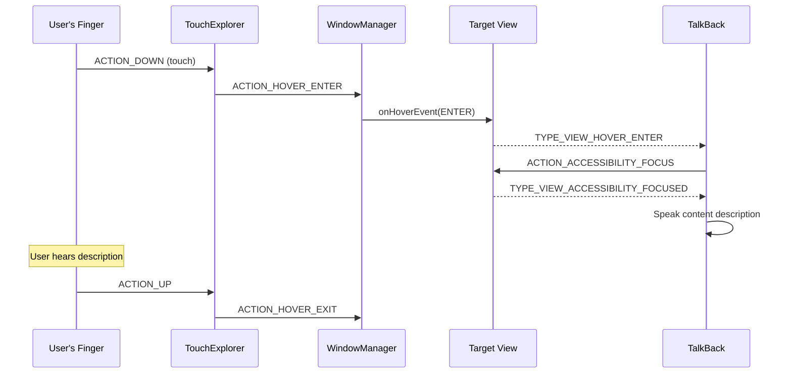

### 46.8.5 The EventStreamTransformation Pipeline

`TouchExplorer` is part of a chain of `EventStreamTransformation` objects
installed in `AccessibilityInputFilter`:

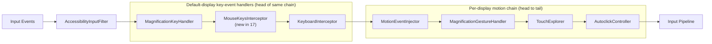

Each transformation in the chain can consume, modify, or pass through events.
`AccessibilityInputFilter` builds the per-display motion chain with
`addFirstEventHandler` (`enableFeaturesForDisplay`), which prepends each enabled
feature, so the order of `addFirstEventHandler` calls -- autoclick, touch
exploration, generic-motion, magnification, then motion-event injection --
reverses into a head-to-tail order of motion-event injection, then
magnification gesture detection, then touch exploration, then autoclick. The
order matters: magnification gestures are detected before touch exploration, so
a triple-tap for magnification is not misinterpreted as a touch exploration
gesture. Key-event handlers are installed by `enableDisplayIndependentFeatures`
with the same `addFirstEventHandler` method, which prepends them to the front
of the *same* default-display chain, ahead of `MotionEventInjector`:
`MagnificationKeyHandler`, `MouseKeysInterceptor` (new in 17), and
`KeyboardInterceptor` all extend `BaseEventStreamTransformation`, so they
handle key events and simply pass motion events through into the motion chain
behind them.

The chain is configured based on feature flags:

```java
// AccessibilityInputFilter.java
static final int FLAG_FEATURE_MAGNIFICATION_SINGLE_FINGER_TRIPLE_TAP
    = 0x00000001;
static final int FLAG_FEATURE_TOUCH_EXPLORATION    = 0x00000002;
static final int FLAG_FEATURE_FILTER_KEY_EVENTS    = 0x00000004;
static final int FLAG_FEATURE_AUTOCLICK            = 0x00000008;
static final int FLAG_FEATURE_INJECT_MOTION_EVENTS = 0x00000010;
static final int FLAG_FEATURE_CONTROL_SCREEN_MAGNIFIER = 0x00000020;
static final int FLAG_FEATURE_TRIGGERED_SCREEN_MAGNIFIER = 0x00000040;
static final int FLAG_SERVICE_HANDLES_DOUBLE_TAP   = 0x00000080;
// ...
static final int FLAG_FEATURE_MOUSE_KEYS           = 0x00002000;
```

The `FLAG_FEATURE_MOUSE_KEYS` bit drives the `MouseKeysInterceptor`
(section 46.4.6). When set, `AccessibilityInputFilter` installs that
transformation in the same chain as touch exploration and autoclick.

### 46.8.6 Gesture Detection

`TouchExplorer` delegates gesture detection to `GestureManifold`:

```
frameworks/base/services/accessibility/java/com/android/server/accessibility/
    gestures/GestureManifold.java
```

`GestureManifold` registers a rich set of gesture matchers covering:

- **Single-finger swipes**: Up, down, left, right, and L-shaped combinations
  (e.g., up-then-left, right-then-down)
- **Multi-finger taps**: 2-finger single/double/triple tap, 3-finger
  single/double/triple tap, 4-finger taps
- **Multi-finger swipes**: 2/3/4-finger swipes in all directions
- **Tap-and-hold**: Single-finger double-tap-and-hold, multi-finger variants

The gesture constants reveal the full vocabulary:

```java
// GestureManifold imports from AccessibilityService
GESTURE_SWIPE_UP, GESTURE_SWIPE_DOWN,
GESTURE_SWIPE_LEFT, GESTURE_SWIPE_RIGHT,
GESTURE_SWIPE_UP_AND_DOWN, GESTURE_SWIPE_DOWN_AND_UP,
GESTURE_SWIPE_LEFT_AND_RIGHT, GESTURE_SWIPE_RIGHT_AND_LEFT,
GESTURE_SWIPE_UP_AND_LEFT, GESTURE_SWIPE_UP_AND_RIGHT,
GESTURE_SWIPE_DOWN_AND_LEFT, GESTURE_SWIPE_DOWN_AND_RIGHT,
GESTURE_SWIPE_LEFT_AND_UP, GESTURE_SWIPE_LEFT_AND_DOWN,
GESTURE_SWIPE_RIGHT_AND_UP, GESTURE_SWIPE_RIGHT_AND_DOWN,
GESTURE_DOUBLE_TAP, GESTURE_DOUBLE_TAP_AND_HOLD,
GESTURE_2_FINGER_SINGLE_TAP, GESTURE_2_FINGER_DOUBLE_TAP,
GESTURE_2_FINGER_TRIPLE_TAP, ...
GESTURE_3_FINGER_SINGLE_TAP, GESTURE_3_FINGER_DOUBLE_TAP,
GESTURE_3_FINGER_TRIPLE_TAP, ...
GESTURE_4_FINGER_SINGLE_TAP, GESTURE_4_FINGER_DOUBLE_TAP,
GESTURE_4_FINGER_TRIPLE_TAP, ...
```

Each gesture matcher extends `GestureMatcher` and implements a state machine
for detecting its specific gesture pattern.

### 46.8.7 Edge Swipes

`TouchExplorer` defines an edge region at the top and bottom of the screen:

```java
// TouchExplorer.java, line 101
private static final float EDGE_SWIPE_HEIGHT_CM = 0.25f;
```

Three-finger swipes starting from the bottom edge are treated differently,
enabling system navigation gestures even during touch exploration.

### 46.8.8 Dragging

When two close fingers move in the same direction during touch exploration,
`TouchExplorer` enters `STATE_DRAGGING`. This allows two-finger scrolling
of lists and other scrollable content. The direction similarity is determined
by a cosine threshold:

```java
// TouchExplorer.java, line 94
private static final float MAX_DRAGGING_ANGLE_COS = 0.525321989f; // cos(pi/4)
```

If two pointers move with an angle greater than 45 degrees between their
vectors, they are not considered a drag and the state transitions to
`STATE_DELEGATING` instead.

### 46.8.9 The SendHoverEnterAndMoveDelayed Pattern

`TouchExplorer` uses delayed handler messages to distinguish between touch
exploration and gestures. When a finger touches down, it does not immediately
send a hover event. Instead, it starts a delayed message:

```java
// TouchExplorer.java (fields, line 124 onward)
private final SendHoverEnterAndMoveDelayed mSendHoverEnterAndMoveDelayed;
private final SendHoverExitDelayed mSendHoverExitDelayed;
private final SendAccessibilityEventDelayed mSendTouchExplorationEndDelayed;
private final SendAccessibilityEventDelayed mSendTouchInteractionEndDelayed;
private final ExitGestureDetectionModeDelayed mExitGestureDetectionModeDelayed;
```

The delay period (`mDetermineUserIntentTimeout`) allows the system to
distinguish between:

- A finger placed for exploration (slow, deliberate placement)
- A finger placed for a gesture (fast, directional movement)
- A finger placed for a double-tap (quick tap-tap pattern)

If the finger moves quickly before the timeout, the system transitions to
gesture detection mode. If it stays still or moves slowly, hover events are
sent and touch exploration begins.

### 46.8.10 Accessibility Events During Touch Exploration

Touch exploration generates a specific sequence of accessibility events:

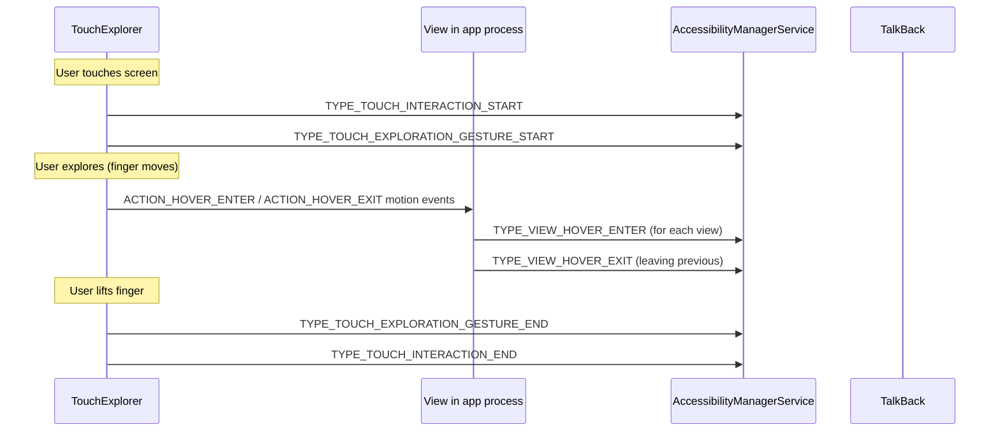

These events bracket the exploration session, allowing services to track
when exploration starts and ends. For example, a screen reader might clear
its speech queue when a new exploration session starts.

### 46.8.11 Gesture Detection Timeout

If no gesture is detected within 2 seconds, the gesture detection state exits
automatically:

```java
// TouchExplorer.java, line 97
private static final int EXIT_GESTURE_DETECTION_TIMEOUT = 2000;
```

This prevents the system from remaining in gesture detection mode indefinitely
if the user's movement does not match any recognized gesture pattern.

### 46.8.12 The ReceivedPointerTracker

The `ReceivedPointerTracker` (an inner class of `TouchState`) tracks the state
of all received pointers:

```java
// TouchState.java, line 44
public static final int MAX_POINTER_COUNT = 32;
public static final int ALL_POINTER_ID_BITS = 0xFFFFFFFF;
```

It maintains a bitmask of active pointer IDs, the last received event for each
pointer, and timing information used for gesture detection. The 32-pointer limit
covers pointer IDs 0 through `MAX_POINTER_ID` (31, defined in the native input
system at `frameworks/native/include/input/Input.h`), i.e. `MAX_POINTER_ID + 1`
distinct IDs.

### 46.8.13 Touch Exploration and Multi-Display

Touch exploration supports multi-display devices. Each display can have its
own touch exploration state, and the `AccessibilityInputFilter` maintains
per-display `TouchExplorer` instances. This means that on a device with
multiple screens (such as an automotive device with a center console and
rear-seat displays), touch exploration operates independently on each display.

---

## 46.9 Accessibility Shortcuts

Android provides multiple shortcut mechanisms for quickly activating
accessibility features. These shortcuts are managed by the
`AccessibilityShortcutController`:

```
frameworks/base/core/java/com/android/internal/accessibility/
    AccessibilityShortcutController.java
```

### 46.9.1 Shortcut Types

The shortcut types are defined as a bitmask `@IntDef` named `UserShortcutType`.
In Android 17 the set grew to eight active types, and the numeric values are
not contiguous (some bit positions were retired as the design evolved):

```java
// ShortcutConstants.java -- UserShortcutType
int DEFAULT        = 0;
int SOFTWARE       = 1 << 0; // Floating button / nav bar
int HARDWARE       = 1 << 1; // Volume keys shortcut
int TRIPLETAP      = 1 << 2; // Triple-tap on screen
int QUICK_SETTINGS = 1 << 4; // Quick Settings tile
int GESTURE        = 1 << 5; // Two-finger swipe / triple-tap
int KEY_GESTURE    = 1 << 6; // Keyboard key gesture
int TOP_ROW_KEY    = 1 << 7; // Dedicated top-row accessibility key (new in 17)
int QUICK_ACCESS   = 1 << 8; // Quick-access target (new in 17)
int ALL = SOFTWARE | HARDWARE | TRIPLETAP | QUICK_SETTINGS | GESTURE
        | KEY_GESTURE | TOP_ROW_KEY | QUICK_ACCESS;
```

Two of these, `TOP_ROW_KEY` and `QUICK_ACCESS`, are new in Android 17. The
older `TWOFINGER_DOUBLETAP` bit that appeared in earlier drafts is gone; the
two-finger gesture activation now folds into `GESTURE`. The top-row key
corresponds to a dedicated accessibility key on the keyboard's function row
(see section 46.10).

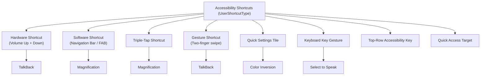

### 46.9.2 The Hardware Shortcut (Volume Keys)

The hardware shortcut is triggered by pressing and holding both volume up and
volume down keys simultaneously for approximately 3 seconds. This is
configured through:

```
Settings.Secure.ACCESSIBILITY_SHORTCUT_TARGET_SERVICE
```

The shortcut is handled in the input pipeline by
`AccessibilityShortcutController`, which registers a `ContentObserver` on the
settings value to track the assigned target service. On first use, the
controller raises a warning dialog (`createShortcutWarningDialog()`) shown
with the `TYPE_KEYGUARD_DIALOG` window type so it appears even over the
keyguard.

### 46.9.3 The Software Shortcut (Accessibility Button)

The accessibility button appears either as an icon in the navigation bar (in
3-button navigation mode) or as a floating action button (in gesture
navigation mode). Its mode is controlled by:

```java
// Settings.Secure
ACCESSIBILITY_BUTTON_MODE_NAVIGATION_BAR  // In nav bar
ACCESSIBILITY_BUTTON_MODE_FLOATING_MENU   // Floating button
ACCESSIBILITY_BUTTON_MODE_GESTURE         // Two-finger swipe up
```

When tapped, the button activates the assigned accessibility feature. If
multiple features are assigned, a chooser dialog appears:

```
com.android.internal.accessibility.dialog.AccessibilityButtonChooserActivity
```

### 46.9.4 Framework Feature Shortcuts

Several framework features can be assigned to shortcuts without requiring an
accessibility service:

```java
// AccessibilityShortcutController.java
public static final ComponentName COLOR_INVERSION_COMPONENT_NAME =
    new ComponentName("com.android.server.accessibility", "ColorInversion");
public static final ComponentName DALTONIZER_COMPONENT_NAME =
    new ComponentName("com.android.server.accessibility", "Daltonizer");
public static final ComponentName MAGNIFICATION_COMPONENT_NAME =
    new ComponentName("com.android.server.accessibility", "Magnification");
public static final ComponentName ONE_HANDED_COMPONENT_NAME =
    new ComponentName("com.android.server.accessibility", "OneHandedMode");
public static final ComponentName REDUCE_BRIGHT_COLORS_COMPONENT_NAME =
    new ComponentName("com.android.server.accessibility", "ReduceBrightColors");
public static final ComponentName FONT_SIZE_COMPONENT_NAME =
    new ComponentName("com.android.server.accessibility", "FontSize");
public static final ComponentName AUTOCLICK_COMPONENT_NAME =
    new ComponentName("com.android.server.accessibility", "Autoclick");
public static final ComponentName MOUSE_KEYS_COMPONENT_NAME =
    new ComponentName("com.android.server.accessibility", "MouseKeys");
```

These are pseudo-component-names that AMS recognizes and handles internally
rather than binding to an external service.

### 46.9.5 Quick Settings Tiles

Accessibility features can expose Quick Settings tiles, allowing one-tap
activation from the notification shade. The tile component names follow a
parallel naming convention:

```java
public static final ComponentName COLOR_INVERSION_TILE_COMPONENT_NAME =
    new ComponentName("com.android.server.accessibility", "ColorInversionTile");
public static final ComponentName DALTONIZER_TILE_COMPONENT_NAME =
    new ComponentName("com.android.server.accessibility", "ColorCorrectionTile");
public static final ComponentName ACCESSIBILITY_HEARING_AIDS_TILE_COMPONENT_NAME =
    new ComponentName("com.android.server.accessibility", "HearingDevicesTile");
```

### 46.9.6 Keyboard Gesture Shortcuts

Modern Android supports keyboard-based accessibility activation through
key gesture events, registered with `InputManager` in AMS `init()`
(section 46.2.4). By Android 17 several of these have shipped and are no
longer flag-gated. The remaining flags gate newer additions:

```java
// AccessibilityManagerService.java imports
import static com.android.hardware.input.Flags.enableSelectToSpeakKeyGestures;
import static com.android.hardware.input.Flags.enableTalkbackKeyGestures;
// enableColorInversionKeyGestures() and enableA11yTopRowShortcut()
// gate the color-inversion key gesture and the top-row accessibility key.
```

The `enableTalkbackAndMagnifierKeyGestures` and `enableVoiceAccessKeyGestures`
flags used in earlier releases were removed once toggling magnification and
Voice Access by keyboard became unconditional. These gestures let users with
physical keyboards (including external keyboards connected to tablets) toggle
TalkBack, magnification, Select to Speak, Voice Access, and color inversion
without touching the screen.

### 46.9.7 Shortcut Configuration and Persistence

Each shortcut type maintains its target assignments in `Settings.Secure`.
The `GENERAL_SHORTCUT_SETTINGS` list in `ShortcutConstants` enumerates them,
and Android 17 added three keys (`ACCESSIBILITY_TOP_ROW_KEY_TARGETS`,
`ACCESSIBILITY_QUICK_ACCESS_TARGETS`, and `ACCESSIBILITY_KEY_GESTURE_TARGETS`)
to match the new shortcut types:

```
Settings.Secure.ACCESSIBILITY_BUTTON_TARGETS          // Software shortcut
Settings.Secure.ACCESSIBILITY_SHORTCUT_TARGET_SERVICE // Hardware shortcut
Settings.Secure.ACCESSIBILITY_QS_TARGETS              // Quick Settings
Settings.Secure.ACCESSIBILITY_GESTURE_TARGETS         // Gesture
Settings.Secure.ACCESSIBILITY_TOP_ROW_KEY_TARGETS     // Top-row key (new in 17)
Settings.Secure.ACCESSIBILITY_QUICK_ACCESS_TARGETS    // Quick access (new in 17)
Settings.Secure.ACCESSIBILITY_KEY_GESTURE_TARGETS     // Key gesture (new in 17)
```

The triple-tap magnification key,
`Settings.Secure.ACCESSIBILITY_DISPLAY_MAGNIFICATION_ENABLED`, is not part of
`GENERAL_SHORTCUT_SETTINGS`; it lives in the separate
`MAGNIFICATION_SHORTCUT_SETTINGS` list.

The `AccessibilityUserState` class tracks the complete mapping of shortcut
types to target services per user, and `ShortcutUtils` provides helper
methods for reading and writing these assignments.

### 46.9.8 Shortcut Activation Flow

When a shortcut is activated, the following flow executes:

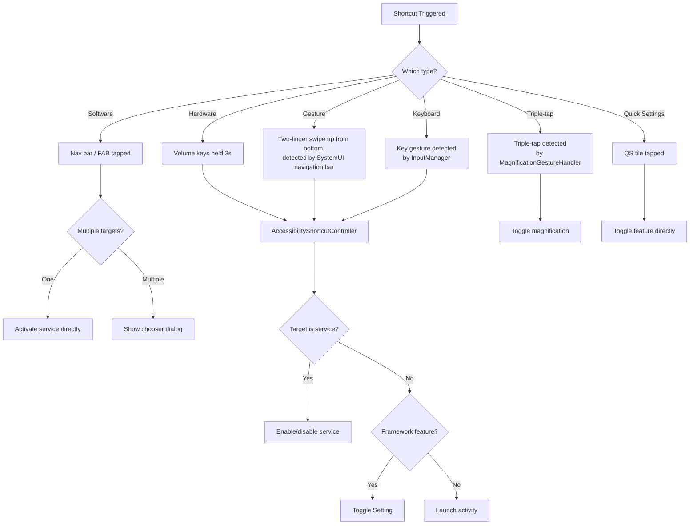

### 46.9.9 The Accessibility Button Chooser

When multiple services are assigned to the software shortcut, tapping the
accessibility button shows a chooser:

```
com.android.internal.accessibility.dialog.AccessibilityButtonChooserActivity
com.android.internal.accessibility.dialog.AccessibilityShortcutChooserActivity
```

The chooser displays all assigned targets with their icons and labels. It also
provides an "Edit shortcuts" button that switches the same dialog into an
in-place edit mode where targets can be checked and unchecked, with a "Done"
button to return -- it does not link out to Settings. (The
`TYPE_KEYGUARD_DIALOG` window type is used elsewhere, by the hardware
shortcut's first-use warning dialog raised by `AccessibilityShortcutController`
-- see section 46.9.2.)

### 46.9.10 Shortcut State Logging

Shortcut activations are tracked through logging metrics for usage analysis:

```java
// AccessibilityManagerService.java
static final String METRIC_ID_QS_SHORTCUT_ADD =
    "accessibility.value_qs_shortcut_add";
static final String METRIC_ID_QS_SHORTCUT_REMOVE =
    "accessibility.value_qs_shortcut_remove";
```

The `AccessibilityStatsLogUtils.logAccessibilityShortcutActivated()` method
records each shortcut activation with the shortcut type, target service, and
the resulting enabled/disabled service status. This data helps the Android team understand which shortcuts are
most used and guide future UX improvements.

### 46.9.11 Hearing Aids Integration

The accessibility shortcut system includes special handling for hearing
devices:

```java
public static final ComponentName ACCESSIBILITY_HEARING_AIDS_COMPONENT_NAME =
    new ComponentName("com.android.server.accessibility", "HearingAids");
```

When the hearing aids shortcut is activated, it launches a dedicated hearing
devices dialog:

```java
static final String ACTION_LAUNCH_HEARING_DEVICES_DIALOG =
    "com.android.systemui.action.LAUNCH_HEARING_DEVICES_DIALOG";
```

This allows users with hearing aids to quickly access their device settings,
volume adjustments, and routing preferences without navigating through the
full settings hierarchy.

In Android 17 the hearing-device story gained a small but useful piece of
glue: a `HearingDevicePhoneCallNotificationController` that AMS constructs when
the `hearingDevicesInputRoutingControl` settings-lib flag is set, and starts
listening for call state in `init()`:

```
frameworks/base/services/accessibility/java/com/android/server/accessibility/
    HearingDevicePhoneCallNotificationController.java
```

It surfaces a notification during phone calls so a hearing-aid user can route
the call audio to (or away from) their hearing devices without digging through
settings mid-call.

## 46.10 Keyboard Key Gestures and the Top-Row Accessibility Key

Android 17 substantially matures the keyboard-driven accessibility story that
began in earlier releases. Two things changed: a number of key gestures that
used to be feature-flagged became always-on, and a new dedicated
**top-row accessibility key** shortcut type was introduced for keyboards that
ship a physical accessibility key on the function row.

### 46.10.1 Key Gestures Registered by AMS

As shown in section 46.2.4, AMS builds a list of `KeyGestureEvent` types in
`init()` and registers them with `InputManager`. In Android 17 the registered
set is:

| Key gesture | Gated by |
|-------------|----------|
| `KEY_GESTURE_TYPE_TOGGLE_DISPLAY_COLOR_INVERSION` | `enableColorInversionKeyGestures()` |
| `KEY_GESTURE_TYPE_ACTIVATE_SELECT_TO_SPEAK` | `enableSelectToSpeakKeyGestures()` |
| `KEY_GESTURE_TYPE_TOGGLE_MAGNIFICATION` | always registered |
| `KEY_GESTURE_TYPE_TOGGLE_SCREEN_READER` | `enableTalkbackKeyGestures()` |
| `KEY_GESTURE_TYPE_TOGGLE_VOICE_ACCESS` | always registered |
| `KEY_GESTURE_TYPE_TOGGLE_TOP_ROW_ACCESSIBILITY_KEY` | `enableA11yTopRowShortcut()` |

The constants live in:

```
frameworks/base/core/java/android/hardware/input/KeyGestureEvent.java
```

where `KEY_GESTURE_TYPE_TOGGLE_TOP_ROW_ACCESSIBILITY_KEY` is value 88. When the
input subsystem detects one of these gestures, it calls back into AMS's
`mKeyGestureEventHandler`, which dispatches to the matching feature.

### 46.10.2 The Top-Row Accessibility Key

Some keyboards expose a dedicated accessibility key in the function (top) row.
Android 17 models this as its own shortcut type, `UserShortcutType.TOP_ROW_KEY`
(value `1 << 7`, section 46.9.1), with its own persisted target list in
`Settings.Secure.ACCESSIBILITY_TOP_ROW_KEY_TARGETS`. When the key is pressed,
the input pipeline raises `KEY_GESTURE_TYPE_TOGGLE_TOP_ROW_ACCESSIBILITY_KEY`,
and AMS routes it to the generic shortcut activation path:

```java
// AccessibilityManagerService.java, line 822
if (gestureType
        == KeyGestureEvent.KEY_GESTURE_TYPE_TOGGLE_TOP_ROW_ACCESSIBILITY_KEY) {
    performAccessibilityShortcutInternal(displayId, TOP_ROW_KEY,
            /* targetName= */ null);
    ...
}
```

The whole feature is gated by `android.view.accessibility.Flags`
`enableA11yTopRowShortcut()`. When that flag is off, AMS skips both the gesture
registration and the per-user reads/writes of the top-row target list
(`AccessibilityManagerService.java`, lines 711, 3786, and 4065), so a device
that does not ship the key sees no behavioral change.

```mermaid
flowchart TD
    A["Top-row accessibility key pressed"] --> B["InputManager raises<br/>KEY_GESTURE_TYPE_TOGGLE_TOP_ROW_ACCESSIBILITY_KEY"]
    B --> C["AMS mKeyGestureEventHandler"]
    C --> D["performAccessibilityShortcutInternal(TOP_ROW_KEY)"]
    D --> E{"Targets for<br/>TOP_ROW_KEY?"}
    E -->|"One"| F["Toggle that feature/service"]
    E -->|"Multiple"| G["Show shortcut chooser"]
    E -->|"None"| H["No-op"]
```

### 46.10.3 The Quick-Access Shortcut Type

Alongside the top-row key, Android 17 adds `UserShortcutType.QUICK_ACCESS`
(value `1 << 8`), persisted in
`Settings.Secure.ACCESSIBILITY_QUICK_ACCESS_TARGETS`. AMS reads and writes its
targets through the same `readAccessibilityShortcutTargetsLocked` /
`updateAccessibilityShortcutTargetsLocked` machinery used by every other
shortcut type (`AccessibilityManagerService.java`, lines 3790 and 3923),
keeping the shortcut model uniform as new entry points are added.

## 46.11 Mouse Keys and Virtual Pointer Control

Section 46.4.6 introduced `MouseKeysInterceptor`. Android 17 reworks it in two
important ways, both worth calling out because they change how the feature
integrates with the rest of the platform.

### 46.11.1 Driving the Cursor Through VirtualMouse

In earlier releases, mouse-keys motion was produced by a bespoke handler. In
Android 17 that handler (`MouseEventHandler`) was deleted, and the interceptor
instead owns an `android.hardware.input.VirtualMouse` -- the same virtual-input
device abstraction used for virtual displays:

```java
// MouseKeysInterceptor.java
import android.hardware.input.VirtualMouse;
import android.hardware.input.VirtualMouseButtonEvent;
import android.hardware.input.VirtualMouseRelativeEvent;
import android.hardware.input.VirtualMouseScrollEvent;
```

A fresh `VirtualMouse` is created whenever the mouse-keys feature is turned on
in Settings and is given a unique device name. Sending relative-motion, button,
and scroll events through it means the synthesized pointer flows through the
standard input path and is indistinguishable, downstream, from a real mouse --
which fixes a class of bugs where the bespoke path diverged from real-mouse
behavior.

### 46.11.2 Numpad Keys Require Num Lock

The interceptor accepts both a primary key layout and the numeric keypad. The
numpad mapping is conditional on Num Lock being engaged, so that numpad keys
keep their normal digit-entry behavior when Num Lock is off:

```java
// MouseKeysInterceptor.java, lines 716-718
// If we are using numpad keys, they only work if Num Lock is on.
boolean isNumLockOn = (event.getMetaState() & KeyEvent.META_NUM_LOCK_ON) != 0;
if (keyCode == mouseKeyEvent.getNumpadKeyCode(inputDevice) && !isNumLockOn) {
    // skip: treat as a normal numpad key
}
```

A per-device capability cache (`mDeviceNumpadCapabilityCache`) records whether
each connected keyboard has the full set of numpad keys, so the numpad mapping
is only offered on keyboards that actually have a numeric keypad.

## 46.12 Advanced Protection Mode for Accessibility Services

The most security-significant accessibility change in Android 17 is the
integration of the accessibility framework with **Advanced Protection Mode**
(APM, also written AAPM in the source). Advanced Protection Mode is a
device-wide high-security posture; when the user turns it on, a set of
registered "features" tighten various subsystems. One of those features,
`FEATURE_ID_RESTRICT_NON_TOOL_A11Y_SERVICES`, restricts which accessibility
services may run.

### 46.12.1 Why Restrict Accessibility Services

Accessibility services are among the most powerful things a user can grant on
Android: they can read screen content, observe input, and inject actions. That
power is exactly what malware abuses. Advanced Protection Mode addresses this
by allowing only services that genuinely declare themselves as accessibility
tools (`isAccessibilityTool="true"` in their metadata) to run, shutting down
everything else.

### 46.12.2 The Feature Registration

A small provider exposes the accessibility feature to the Advanced Protection
service:

```
frameworks/base/services/core/java/com/android/server/accessibility/
    AccessibilityServiceAdvancedProtectionProvider.java
```

```java
public class AccessibilityServiceAdvancedProtectionProvider
        extends AdvancedProtectionProvider {
    @Override
    public @NonNull List<Integer> getFeatureIds(@NonNull Context context) {
        return List.of(FEATURE_ID_RESTRICT_NON_TOOL_A11Y_SERVICES);
    }
}
```

`FEATURE_ID_RESTRICT_NON_TOOL_A11Y_SERVICES` is defined as id `6` in
`frameworks/base/core/java/android/security/advancedprotection/AdvancedProtectionManager.java`.

### 46.12.3 How AMS Wires Itself In

AMS registers for APM state changes at boot, but only after
`PHASE_BOOT_COMPLETED` (so that the Device Policy and Advanced Protection
services are available) and only when the `extendAapmToA11yServices()` flag is
set:

```java
// AccessibilityManagerService.java, line 1021
if (phase == SystemService.PHASE_BOOT_COMPLETED) {
    mDevicePolicyManager = mContext.getSystemService(DevicePolicyManager.class);
    if (android.security.Flags.extendAapmToA11yServices()) {
        mAdvancedProtectionManager =
            mContext.getSystemService(AdvancedProtectionManager.class);
        if (mAdvancedProtectionManager != null) {
            mAdvancedProtectionManager.registerAdvancedProtectionFeatureCallback(
                new int[]{FEATURE_ID_RESTRICT_NON_TOOL_A11Y_SERVICES},
                new HandlerExecutor(BackgroundThread.getHandler()),
                this::handleAdvancedProtectionModeStateChanged);
        }
    }
}
```

### 46.12.4 Enforcement via a Global User Restriction

When APM toggles, `handleAdvancedProtectionModeStateChanged()` translates the
feature state into a global Device Policy user restriction,
`UserManager.DISALLOW_NON_TOOL_ACCESSIBILITY_SERVICE` (string value
`"no_non_tool_accessibility_service"`):

```java
// AccessibilityManagerService.java, line 1415
void handleAdvancedProtectionModeStateChanged(
        List<AdvancedProtectionFeature> features) {
    ...
    if (apmOn) {
        mDevicePolicyManager.addUserRestrictionGlobally(
            ADVANCED_PROTECTION_SYSTEM_ENTITY,
            UserManager.DISALLOW_NON_TOOL_ACCESSIBILITY_SERVICE);
    } else {
        mDevicePolicyManager.clearUserRestrictionGlobally(
            ADVANCED_PROTECTION_SYSTEM_ENTITY,
            UserManager.DISALLOW_NON_TOOL_ACCESSIBILITY_SERVICE);
    }
    ...
}
```

Routing through a Device Policy restriction (rather than a bespoke check) lets
the rest of the framework treat APM-driven blocking the same way it already
treats enterprise-managed accessibility allowlists.

### 46.12.5 Computing the Permitted Set

The actual decision about which services may run lives in
`getPermittedAccessibilityServicePackages()`. Its precedence rules are precise:

```java
// AccessibilityManagerService.java, line 7486
Set<String> getPermittedAccessibilityServicePackages(
        @Nullable List<String> adminPermittedServices, int userId) {
    if (!android.security.Flags.extendAapmToA11yServices()) {
        return getPermittedServicesLegacy(adminPermittedServices, userId);
    }
    // If an Enterprise Admin explicitly set an allowlist, Admin intent overrides AAPM.
    if (adminPermittedServices != null) {
        return getPermittedServicesLegacy(adminPermittedServices, userId);
    }
    final boolean apmOn = mUmi.hasUserRestriction(
            UserManager.DISALLOW_NON_TOOL_ACCESSIBILITY_SERVICE, userId);
    if (!apmOn) {
        return getPermittedServicesLegacy(adminPermittedServices, userId);
    }
    return getPermittedServicesStrictApm(userId);
}
```

```mermaid
flowchart TD
    A["getPermittedAccessibilityServicePackages"] --> B{"extendAapmToA11yServices flag on?"}
    B -->|No| L["Legacy: admin allowlist + system services"]
    B -->|Yes| C{"Enterprise admin allowlist set?"}
    C -->|Yes| L
    C -->|No| D{"APM user restriction active?"}
    D -->|No| L
    D -->|Yes| S["Strict APM: only packages with a tool service"]
```

The key precedence: an explicit **enterprise admin allowlist wins over APM**.
Only when there is no admin allowlist and APM is active does AMS switch to
`getPermittedServicesStrictApm()`, which scans installed services and permits
only packages that contain at least one service marked as an accessibility
tool, filtering out everything that declares itself a non-tool service.

### 46.12.6 Logging Before Enforcement

`AdvancedProtectionService` logs how many services and shortcuts *would* be
disabled before APM actually flips on, so the platform can understand the
impact. AMS exposes the counts through:

```java
// AccessibilityManagerService.java, line 1365
AccessibilityManagerInternal.AccessibilityFeatureRestrictedCounts
        getA11yFeatureRestrictedCounts(int userId) { ... }
```

This returns the number of currently enabled services and assigned shortcuts
whose packages are not in the final permitted set, computed with the same
legacy-versus-strict logic as the enforcement path.

## 46.13 The EyeDropper App

EyeDropper (`packages/apps/EyeDropper/`, package `com.android.eyedropper`) is a
small system app that lets the user pick a single pixel on the display and
returns that pixel's color to the caller. It is a general-purpose color picker:
any app can invoke it through the public `OPEN_EYE_DROPPER` intent and get back the
ARGB value of the chosen pixel. Its on-screen reticle has accessibility roots:
the dimensions and drawing were adapted from the Accessibility Scanner color
picker (`res/values/dimens.xml` notes the reticle is "copied from Accessibility
Scanner Color Picker," and `ui/touchscreen/TouchscreenReticle.kt` cites the
accessibility auditor's picker UI). That lineage is where it sits in this
chapter, but the intent itself is framed for any caller, not tied to a specific
low-vision or color-vision feature.

### 46.13.1 What It Does and How It Is Invoked

The app exposes one activity, `MainActivity`, with an intent filter for
`android.intent.action.OPEN_EYE_DROPPER`. The action and its result extra are
declared in the framework so callers do not depend on the app package directly:

```java
// frameworks/base/core/java/android/content/Intent.java:4754
// Activity Action: Launch an eye dropper. It allows the user to pick a pixel
// on the display. The color of the selected pixel is returned to the
// requesting activity as an activity result. Pixels from secure windows and
// protected buffers are blacked out.
// Output: EXTRA_COLOR is the color of the selected pixel in ARGB (0xFFRRGGBB).
public static final String ACTION_OPEN_EYE_DROPPER =
        "android.intent.action.OPEN_EYE_DROPPER";
```

A caller starts the activity for a result; on selection the activity sets
`RESULT_OK` with `Intent.EXTRA_COLOR` holding the ARGB integer, and on
cancellation it sets `RESULT_CANCELED`
(`MainActivity.sendColor`/`onAbort`). The action is gated by the
`enable_eye_dropper_api` aconfig flag (`packages/apps/EyeDropper/flags/`), and
the activity is themed transparent so it overlays whatever is on screen.

### 46.13.2 How a Color Gets Picked

`MainActivity` does not draw the picker itself. On first window focus it
captures a screenshot of every connected display and binds to
`EyeDropperControllerService`, handing it the per-display screenshots through a
local binder (`EyeDropperServiceConnection`). The capture goes through
`IWindowManager.screenCapture` with both the secure-content and
protected-content policies set to `REDACT`, so protected surfaces come back
blacked out rather than readable (`util/ScreenCaptureHelper.kt`). The captured
hardware bitmap is copied to a software `ARGB_8888` bitmap so individual pixels
can be read with `getPixel()`.

The service renders a transparent overlay per display and runs one of two input
modes: a pointer/reticle mode for desktop windowing (cursor driven) and a
touchscreen reticle mode (`ui/touchscreen/`). When the user commits a pixel, the
overlay reports the coordinate, the service reads the color from that display's
screenshot, removes every overlay, and the activity returns the color to the
caller. Input-device or display changes, a configuration change, or the escape
key route through the same abort path, so the request always ends in a result
or a cancel.

```mermaid
sequenceDiagram
    participant Caller as "Caller activity"
    participant MA as "MainActivity"
    participant WM as "IWindowManager"
    participant Svc as "EyeDropperControllerService"
    participant User as "User"
    Caller->>MA: "startActivityForResult(OPEN_EYE_DROPPER)"
    MA->>WM: "screenCapture(REDACT secure/protected)"
    WM-->>MA: "per-display screenshots"
    MA->>Svc: "bind + showUiOverlay()"
    Svc->>User: "transparent reticle overlay"
    User->>Svc: "pick pixel (or abort)"
    Svc->>MA: "onSelectColor(argb) / onAbort()"
    MA-->>Caller: "RESULT_OK + EXTRA_COLOR (or RESULT_CANCELED)"
```

The app holds three privileged permissions to do this work:
`INTERNAL_SYSTEM_WINDOW` to add the overlay, `READ_FRAME_BUFFER` for the screen
capture, and `INJECT_EVENTS` to read the cursor position
(`AndroidManifest.xml`).

## 46.14 Try It

This section provides hands-on exercises for exploring the accessibility
framework.

### 46.14.1 Exercise: Inspect the Accessibility Tree

Use `uiautomator` to dump the accessibility tree and compare it with the
View hierarchy:

```bash
# Dump the accessibility tree
adb shell uiautomator dump /sdcard/a11y-tree.xml
adb pull /sdcard/a11y-tree.xml

# Alternatively, use the accessibility dump command
adb shell dumpsys accessibility
```

Open `a11y-tree.xml` and identify:

1. Which views have `content-desc` attributes?
2. Which views are marked `clickable="true"` but have no `content-desc`?
3. Do any `ImageView` elements lack content descriptions?

### 46.14.2 Exercise: Write a Minimal AccessibilityService

Create a minimal accessibility service that logs all events to logcat:

**Step 1: Create the service class.**

```java
package com.example.a11ydemo;

import android.accessibilityservice.AccessibilityService;
import android.util.Log;
import android.view.accessibility.AccessibilityEvent;

public class LoggingAccessibilityService extends AccessibilityService {
    private static final String TAG = "A11yDemo";

    @Override
    public void onAccessibilityEvent(AccessibilityEvent event) {
        Log.d(TAG, "Event: " + event.getEventType()
            + " pkg=" + event.getPackageName()
            + " cls=" + event.getClassName()
            + " text=" + event.getText());
    }

    @Override
    public void onInterrupt() {
        Log.d(TAG, "Service interrupted");
    }

    @Override
    protected void onServiceConnected() {
        Log.d(TAG, "Service connected");
    }
}
```

**Step 2: Create the configuration XML (`res/xml/a11y_config.xml`).**

```xml
<?xml version="1.0" encoding="utf-8"?>
<accessibility-service
    xmlns:android="http://schemas.android.com/apk/res/android"
    android:accessibilityEventTypes="typeAllMask"
    android:accessibilityFeedbackType="feedbackGeneric"
    android:accessibilityFlags="flagReportViewIds"
    android:canRetrieveWindowContent="true"
    android:notificationTimeout="100"
    android:isAccessibilityTool="true"
    android:description="@string/a11y_service_description" />
```

**Step 3: Declare in AndroidManifest.xml.**

```xml
<service
    android:name=".LoggingAccessibilityService"
    android:exported="true"
    android:permission="android.permission.BIND_ACCESSIBILITY_SERVICE">
    <intent-filter>
        <action android:name=
            "android.accessibilityservice.AccessibilityService" />
    </intent-filter>
    <meta-data
        android:name="android.accessibilityservice"
        android:resource="@xml/a11y_config" />
</service>
```

**Step 4: Enable the service** through Settings > Accessibility > Downloaded
services, then observe logcat:

```bash
adb logcat -s A11yDemo
```

Navigate through any app and observe the event stream. Note the frequency
of events and the information each carries.

### 46.14.3 Exercise: Explore Touch Exploration State Transitions

Enable TalkBack, then observe the touch exploration states by enabling debug
logging:

```bash
# Enable TouchExplorer debug logging
adb shell setprop log.tag.TouchExplorer DEBUG
```

Perform these interactions and observe the state transitions in logcat:

1. **Single finger slow drag**: Touch and slowly move across the screen.
   Observe hover events and accessibility focus changes.

2. **Double tap**: Touch an element, then double-tap. Observe the click
   action on the accessibility-focused node.

3. **Two-finger drag**: Place two fingers and scroll. Observe the transition
   to `STATE_DRAGGING`.

4. **Swipe gestures**: Perform a right swipe to move to the next element,
   then a left swipe to move to the previous element.

5. **Two-finger triple-tap**: Observe the shortcut activation.

### 46.14.4 Exercise: Test Magnification Gestures

Enable magnification through Settings > Accessibility > Magnification.

1. **Triple-tap** anywhere on the screen. Observe the zoom animation and the
   magnified state.

2. **While magnified**, use two fingers to pan the viewport. Observe how the
   magnification center moves.

3. **While magnified**, use a pinch gesture to adjust the zoom level.

4. **Triple-tap and hold** to temporarily magnify. Move your finger while
   holding. Release and observe the return to the original state.

5. **Dump magnification state**:
   ```bash
   adb shell dumpsys accessibility | grep -A 20 "Magnification"
   ```

### 46.14.5 Exercise: Audit Content Descriptions

Use the Accessibility Scanner app (available from Google Play) or write a
script to audit missing content descriptions:

```bash
# Dump the accessibility tree and find elements without descriptions
adb shell uiautomator dump /sdcard/a11y.xml
adb pull /sdcard/a11y.xml
```

Then search for clickable or focusable elements without content descriptions:

```python
import xml.etree.ElementTree as ET

tree = ET.parse('a11y.xml')
root = tree.getroot()

for node in root.iter('node'):
    clickable = node.get('clickable') == 'true'
    content_desc = node.get('content-desc', '')
    text = node.get('text', '')
    class_name = node.get('class', '')

    if clickable and not content_desc and not text:
        bounds = node.get('bounds', '')
        print(f"MISSING: {class_name} at {bounds}")
```

### 46.14.6 Exercise: Monitor AccessibilityManagerService Event Dispatch

Use the accessibility tracing facility to observe event dispatch in detail:

```bash
# Enable accessibility tracing
adb shell cmd accessibility
# (lists available commands)

# Dump full accessibility state
adb shell dumpsys accessibility
```

The dump output includes:

- Current user accessibility state
- Enabled services and their configurations
- Bound services and their capabilities
- Window list with accessibility window IDs
- Magnification state
- Input filter configuration

### 46.14.7 Exercise: Implement a Switch Access-like Scanner

Build a simplified version of Switch Access that highlights elements one at
a time:

```java
public class SimpleScannerService extends AccessibilityService {
    private List<AccessibilityNodeInfo> mScanTargets = new ArrayList<>();
    private int mCurrentIndex = 0;

    @Override
    protected void onServiceConnected() {
        // Collect all actionable nodes
        refreshScanTargets();
    }

    @Override
    public void onAccessibilityEvent(AccessibilityEvent event) {
        if (event.getEventType() ==
                AccessibilityEvent.TYPE_WINDOW_STATE_CHANGED) {
            refreshScanTargets();
        }
    }

    @Override
    protected boolean onKeyEvent(KeyEvent event) {
        if (event.getKeyCode() == KeyEvent.KEYCODE_SPACE
                && event.getAction() == KeyEvent.ACTION_UP) {
            // Space = advance to next element
            advanceScan();
            return true;
        }
        if (event.getKeyCode() == KeyEvent.KEYCODE_ENTER
                && event.getAction() == KeyEvent.ACTION_UP) {
            // Enter = activate current element
            activateCurrent();
            return true;
        }
        return false;
    }

    private void refreshScanTargets() {
        mScanTargets.clear();
        mCurrentIndex = 0;
        AccessibilityNodeInfo root = getRootInActiveWindow();
        if (root != null) {
            collectActionableNodes(root, mScanTargets);
            root.recycle();
        }
    }

    private void collectActionableNodes(
            AccessibilityNodeInfo node,
            List<AccessibilityNodeInfo> targets) {
        if (node.isClickable() && node.isVisibleToUser()) {
            targets.add(AccessibilityNodeInfo.obtain(node));
        }
        for (int i = 0; i < node.getChildCount(); i++) {
            AccessibilityNodeInfo child = node.getChild(i);
            if (child != null) {
                collectActionableNodes(child, targets);
                child.recycle();
            }
        }
    }

    private void advanceScan() {
        if (mScanTargets.isEmpty()) return;
        // Clear previous focus
        if (mCurrentIndex < mScanTargets.size()) {
            mScanTargets.get(mCurrentIndex).performAction(
                AccessibilityNodeInfo.ACTION_CLEAR_ACCESSIBILITY_FOCUS);
        }
        // Advance
        mCurrentIndex = (mCurrentIndex + 1) % mScanTargets.size();
        // Set new focus
        mScanTargets.get(mCurrentIndex).performAction(
            AccessibilityNodeInfo.ACTION_ACCESSIBILITY_FOCUS);
    }

    private void activateCurrent() {
        if (mCurrentIndex < mScanTargets.size()) {
            mScanTargets.get(mCurrentIndex).performAction(
                AccessibilityNodeInfo.ACTION_CLICK);
        }
    }

    @Override
    public void onInterrupt() { }
}
```

This exercise demonstrates the core principles of Switch Access:
tree traversal, node filtering, accessibility focus management, and action
execution.

### 46.14.8 Exercise: Trace an AccessibilityEvent End-to-End

Set a breakpoint or add logging at each stage of the event pipeline and
click a button in any app. Trace the event through:

1. `View.sendAccessibilityEvent()` in the app process
2. `ViewRootImpl.requestSendAccessibilityEvent()` in the app process
3. `AccessibilityManager.sendAccessibilityEvent()` crossing the Binder
4. `AccessibilityManagerService.sendAccessibilityEvent()` in system_server
5. `AccessibilitySecurityPolicy.canDispatchAccessibilityEventLocked()` check
6. `dispatchAccessibilityEventLocked()` to bound services
7. `AccessibilityServiceConnection.notifyAccessibilityEvent()` crossing Binder
8. `AccessibilityService.onAccessibilityEvent()` in the service process

Document the timing at each stage. On a typical device, the end-to-end
latency from View event to service callback is 5-15ms.

### 46.14.9 Exercise: Examine Magnification Internals

Explore the magnification implementation by examining the display
magnification state through WindowManager:

```bash
# Check current magnification spec
adb shell dumpsys window displays | grep -A 5 "MagnificationSpec"

# Enable magnification via settings
adb shell settings put secure accessibility_display_magnification_enabled 1

# Set magnification scale
adb shell settings put secure accessibility_display_magnification_scale 3.0

# Check magnification mode
adb shell settings get secure accessibility_magnification_mode
```

After enabling magnification and triple-tapping to zoom:

```bash
# Observe the magnification spec change
adb shell dumpsys accessibility | grep -i magnif
```

Note how the `MagnificationSpec` values change as you pan and zoom.

### 46.14.10 Exercise: Build an Accessibility Audit Tool

Combine the knowledge from this chapter to build a comprehensive accessibility
auditing tool:

```java
public class AuditService extends AccessibilityService {
    private static final String TAG = "A11yAudit";

    @Override
    protected void onServiceConnected() {
        auditCurrentScreen();
    }

    @Override
    public void onAccessibilityEvent(AccessibilityEvent event) {
        if (event.getEventType() ==
                AccessibilityEvent.TYPE_WINDOW_STATE_CHANGED) {
            auditCurrentScreen();
        }
    }

    private void auditCurrentScreen() {
        AccessibilityNodeInfo root = getRootInActiveWindow();
        if (root == null) return;

        int totalNodes = 0;
        int clickableWithoutLabel = 0;
        int imagesWithoutDescription = 0;
        int smallTouchTargets = 0;

        List<AccessibilityNodeInfo> queue = new ArrayList<>();
        queue.add(root);

        while (!queue.isEmpty()) {
            AccessibilityNodeInfo node = queue.remove(0);
            totalNodes++;

            // Check: clickable without label
            if (node.isClickable() && TextUtils.isEmpty(
                    node.getContentDescription())
                    && TextUtils.isEmpty(node.getText())) {
                clickableWithoutLabel++;
                Log.w(TAG, "Unlabeled clickable: "
                    + node.getClassName() + " "
                    + node.getViewIdResourceName());
            }

            // Check: ImageView without description
            if ("android.widget.ImageView".equals(
                    node.getClassName().toString())
                    && TextUtils.isEmpty(
                        node.getContentDescription())) {
                imagesWithoutDescription++;
            }

            // Check: touch target size (48dp minimum)
            Rect bounds = new Rect();
            node.getBoundsInScreen(bounds);
            float density = getResources()
                .getDisplayMetrics().density;
            float widthDp = bounds.width() / density;
            float heightDp = bounds.height() / density;
            if (node.isClickable()
                    && (widthDp < 48 || heightDp < 48)) {
                smallTouchTargets++;
            }

            // Recurse into children
            for (int i = 0; i < node.getChildCount(); i++) {
                AccessibilityNodeInfo child = node.getChild(i);
                if (child != null) {
                    queue.add(child);
                }
            }
        }

        Log.i(TAG, "=== Accessibility Audit ===");
        Log.i(TAG, "Total nodes: " + totalNodes);
        Log.i(TAG, "Clickable without label: "
            + clickableWithoutLabel);
        Log.i(TAG, "Images without description: "
            + imagesWithoutDescription);
        Log.i(TAG, "Small touch targets (<48dp): "
            + smallTouchTargets);
    }

    @Override
    public void onInterrupt() { }
}
```

Run this tool against several apps and compare the results. Common issues
include:

- `ImageButton` elements without `contentDescription`
- Custom views that do not implement `onInitializeAccessibilityNodeInfo()`
- Touch targets smaller than the recommended 48dp minimum
- Lists that do not provide `CollectionInfo` / `CollectionItemInfo`
- Decorative images that should be marked as not important for accessibility

### 46.14.11 Exercise: Explore the Accessibility Settings Database

The accessibility framework stores its configuration in `Settings.Secure`.
Explore these settings to understand how the system persists state:

```bash
# List all accessibility-related settings
adb shell settings list secure | grep -i access

# Key settings and their meanings
adb shell settings get secure enabled_accessibility_services
# Returns: colon-separated list of ComponentName strings

adb shell settings get secure touch_exploration_enabled
# Returns: 0 or 1

adb shell settings get secure accessibility_display_magnification_enabled
# Returns: 0 or 1

adb shell settings get secure accessibility_display_magnification_scale
# Returns: float (e.g., 2.0)

adb shell settings get secure accessibility_magnification_mode
# Returns: 1 (fullscreen), 2 (window), or 3 (all)

adb shell settings get secure accessibility_button_targets
# Returns: colon-separated list of ComponentName strings

adb shell settings get secure accessibility_shortcut_target_service
# Returns: ComponentName of hardware shortcut target

adb shell settings get secure accessibility_button_mode
# Returns: 0 (nav bar), 1 (floating menu), 2 (gesture)

adb shell settings get secure high_text_contrast_enabled
# Returns: 0 or 1

adb shell settings get secure accessibility_captioning_enabled
# Returns: 0 or 1
```

Modify these settings directly to toggle accessibility features without
using the Settings UI. This is particularly useful for automated testing.

### 46.14.12 Exercise: UiAutomation for Testing

The `UiAutomation` framework provides programmatic accessibility service
access for testing. It uses the same infrastructure as regular accessibility
services but is managed by the `UiAutomationManager`:

```java
// In an instrumentation test
UiAutomation uiAutomation = getInstrumentation().getUiAutomation();

// Get the root accessibility node
AccessibilityNodeInfo root =
    uiAutomation.getRootInActiveWindow();

// Perform a click on a button found by text
List<AccessibilityNodeInfo> nodes =
    root.findAccessibilityNodeInfosByText("Submit");
if (!nodes.isEmpty()) {
    nodes.get(0).performAction(AccessibilityNodeInfo.ACTION_CLICK);
}

// Wait for and check events
AccessibilityEvent event = uiAutomation.executeAndWaitForEvent(
    () -> {
        // Perform some action
        device.pressBack();
    },
    (e) -> e.getEventType() ==
        AccessibilityEvent.TYPE_WINDOW_STATE_CHANGED,
    5000 // timeout ms
);
```

`UiAutomation` connects to AMS through a special
`UiAutomationManager.sendAccessibilityEventLocked()` pathway that ensures
test events are always dispatched regardless of normal filtering rules.

### 46.14.13 Exercise: Observe the EventStreamTransformation Pipeline

Construct a mental model of the input transformation pipeline by observing
its behavior with different features enabled:

```bash
# Scenario 1: Touch exploration only
adb shell settings put secure touch_exploration_enabled 1
# Pipeline: InputFilter -> TouchExplorer -> (output)

# Scenario 2: Magnification only
adb shell settings put secure \
    accessibility_display_magnification_enabled 1
# Pipeline: InputFilter -> MagnificationGestureHandler -> (output)

# Scenario 3: Both enabled
# Pipeline: InputFilter -> MagnificationGestureHandler
#           -> TouchExplorer -> (output)

# Scenario 4: With autoclick
# Pipeline: InputFilter -> MagnificationGestureHandler
#           -> TouchExplorer -> AutoclickController -> (output)
```

The order of transformations matters. Magnification gesture detection runs
before touch exploration, so a triple-tap for magnification is intercepted
before TouchExplorer can interpret it as double-tap-plus-single-tap.

### 46.14.14 Exercise: Performance Profiling

Measure the performance impact of accessibility services on your application:

```bash
# Enable method tracing while using accessibility
adb shell am profile start <package> /sdcard/a11y-trace.trace
# Interact with the app using TalkBack
adb shell am profile stop <package>
adb pull /sdcard/a11y-trace.trace
```

Open the trace in Android Studio's profiler and look for:

- Time spent in `onInitializeAccessibilityNodeInfo()` -- this is called for
  every node the service queries
- Time spent in `sendAccessibilityEvent()` -- overhead per event
- Binder transaction time for node queries
- View hierarchy traversal overhead

Common performance pitfalls:

- Creating expensive `AccessibilityNodeInfo` objects in frequently-called
  code paths
- Performing heavy computation in `onPopulateAccessibilityEvent()`
- Not recycling `AccessibilityNodeInfo` objects, causing GC pressure
- Large view hierarchies that produce deep accessibility trees

---

## Summary

This chapter explored Android's accessibility framework from the lowest levels
of the system service through to the user-facing features that make the
platform usable for people with disabilities.

The key architectural insights are:

1. **Centralized coordination**: `AccessibilityManagerService` is the single
   point of coordination for all accessibility functionality. At roughly 7,600
   lines in Android 17, it manages event dispatch, service binding, security
   enforcement, window tracking, input filtering, and magnification, and it now
   also enforces Advanced Protection Mode restrictions on accessibility
   services.

2. **Event-driven observation**: The accessibility event system allows services
   to passively observe UI changes without modifying app behavior. The event
   type bitmask system enables efficient filtering.

3. **Content introspection**: The `AccessibilityNodeInfo` tree provides a
   complete, serializable snapshot of UI state that can be queried across
   process boundaries. The prefetch system and `AccessibilityCache` mitigate
   the performance cost of Binder IPC.

4. **Action injection**: Services can perform actions on behalf of the user
   through the `performAction()` API, enabling click, scroll, text entry,
   and custom actions.

5. **Input transformation**: The `EventStreamTransformation` pipeline enables
   touch exploration, magnification gestures, and switch access to reinterpret
   the input event stream without modifying the input driver layer.

6. **Layered security**: The framework's security model balances the need for
   powerful capabilities with user protection through permission requirements,
   explicit consent, event filtering, source stripping, and non-tool warnings.

The accessibility framework demonstrates one of AOSP's most elegant design
patterns: a centralized service that mediates between producers (applications)
and consumers (accessibility services) through a rich event and node protocol,
all while maintaining strong security boundaries. Understanding this
architecture is essential for anyone building custom accessibility services,
auditing applications for accessibility compliance, or working on AOSP
platform features that interact with the accessibility subsystem.

## Key Source Files Reference

| File | Purpose |
|------|---------|
| `frameworks/base/services/accessibility/.../AccessibilityManagerService.java` | Central system service (~7,600 lines) |
| `frameworks/base/core/.../accessibility/AccessibilityEvent.java` | Event definitions (~2,000 lines) |
| `frameworks/base/core/.../accessibility/AccessibilityNodeInfo.java` | Node info (~9,200 lines) |
| `frameworks/base/core/.../accessibility/AccessibilityManager.java` | Client-side manager |
| `frameworks/base/core/.../accessibilityservice/AccessibilityService.java` | Service base class |
| `frameworks/base/services/accessibility/.../AccessibilitySecurityPolicy.java` | Security enforcement |
| `frameworks/base/services/accessibility/.../AccessibilityServiceConnection.java` | Service binding |
| `frameworks/base/services/accessibility/.../AbstractAccessibilityServiceConnection.java` | Service connection base |
| `frameworks/base/services/accessibility/.../AccessibilityWindowManager.java` | Window tracking |
| `frameworks/base/services/accessibility/.../AccessibilityUserState.java` | Per-user state |
| `frameworks/base/services/accessibility/.../AccessibilityInputFilter.java` | Input pipeline integration |
| `frameworks/base/services/accessibility/.../KeyEventDispatcher.java` | Key event routing |
| `frameworks/base/services/accessibility/.../gestures/TouchExplorer.java` | Touch exploration |
| `frameworks/base/services/accessibility/.../gestures/TouchState.java` | Touch state tracking |
| `frameworks/base/services/accessibility/.../gestures/GestureManifold.java` | Gesture detection |
| `frameworks/base/services/accessibility/.../magnification/MagnificationController.java` | Magnification orchestration |
| `frameworks/base/services/accessibility/.../magnification/FullScreenMagnificationController.java` | Full-screen zoom |
| `frameworks/base/services/accessibility/.../magnification/FullScreenMagnificationGestureHandler.java` | Magnification gestures |
| `frameworks/base/services/accessibility/.../magnification/WindowMagnificationGestureHandler.java` | Window magnification |
| `frameworks/base/services/accessibility/.../magnification/MagnificationKeyHandler.java` | Keyboard magnification |
| `frameworks/base/services/accessibility/.../magnification/MagnificationScaleProvider.java` | Scale constraints |
| `frameworks/base/services/accessibility/.../autoclick/AutoclickController.java` | Auto-click feature |
| `frameworks/base/core/.../internal/accessibility/AccessibilityShortcutController.java` | Shortcut management |
| `frameworks/base/services/accessibility/.../EventStreamTransformation.java` | Input pipeline interface |
| `frameworks/base/services/accessibility/.../SystemActionPerformer.java` | System action execution |
| `frameworks/base/services/accessibility/.../BrailleDisplayConnection.java` | Braille display support |
| `frameworks/base/services/accessibility/.../MouseKeysInterceptor.java` | Keyboard-driven mouse pointer (VirtualMouse, Num Lock) |
| `frameworks/base/services/accessibility/.../HearingDevicePhoneCallNotificationController.java` | Hearing-device call routing notification |
| `frameworks/base/services/accessibility/.../magnification/FullScreenMagnificationPointerMotionEventFilter.java` | Cursor-following pointer transform |
| `frameworks/base/services/core/.../accessibility/AccessibilityServiceAdvancedProtectionProvider.java` | Advanced Protection Mode feature provider |
| `frameworks/base/core/.../security/advancedprotection/AdvancedProtectionManager.java` | APM feature IDs and entity |
| `frameworks/base/core/.../internal/accessibility/common/ShortcutConstants.java` | Shortcut type bitmask (UserShortcutType) |

---

