# Chapter 50: AI, AppFunctions, and Computer Control

Android has evolved from a platform that merely _runs_ apps into one that
_understands_ them. A constellation of on-device intelligence services now
connects user intent to app behavior: the **AppFunctions** framework lets
assistants invoke arbitrary app functionality through a typed RPC contract;
**Computer Control** gives AI agents a virtual display they can tap, swipe,
and screenshot; **OnDeviceIntelligence** runs large ML models -- LLMs and other
generative or large inference workloads -- in an isolated sandbox; and
**NNAPI** exposes hardware accelerators to any native workload. Together with AppSearch, Content Capture, AdServices, and Federated
Learning, these subsystems form Android's AI nervous system.

This chapter traces every layer -- from the public SDK class down through AIDL
interfaces, into the system\_server service implementation, and out to the
sandboxed or HAL process on the far side. Every code path is backed by real
source files in the current AOSP tree.

---

## 50.1 AOSP AI Landscape

Before examining any single framework in detail, it helps to see the entire
AI / ML surface of AOSP at a glance. The following diagram maps the major
subsystems, the process boundaries they cross, and the data flows that connect
them.

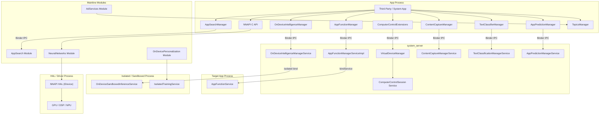
```mermaid
graph TB
    subgraph "App Process"
        APP[Third-Party / System App]
        AFM[AppFunctionManager]
        ODIM[OnDeviceIntelligenceManager]
        NNAPI_C["NNAPI C API"]
        CCExt[ComputerControlExtensions]
        ASM[AppSearchManager]
        TCM[TextClassifierManager]
        CCM[ContentCaptureManager]
        APM[AppPredictionManager]
        TM[TopicsManager]
    end

    subgraph "system_server"
        AFMS[AppFunctionManagerServiceImpl]
        ODIMS[OnDeviceIntelligenceManagerService]
        VDM[VirtualDeviceManager]
        CCS_SVC[ComputerControlSession Service]
        CCAS[ContentCaptureManagerService]
        TCMS[TextClassificationManagerService]
        APMS[AppPredictionManagerService]
    end

    subgraph "Target App Process"
        AFS[AppFunctionService]
    end

    subgraph "Isolated / Sandboxed Process"
        ODSIS[OnDeviceSandboxedInferenceService]
        ITS[IsolatedTrainingService]
    end

    subgraph "HAL / Driver Process"
        NNHAL["NNAPI HAL (IDevice)"]
        ACCEL["GPU / DSP / NPU"]
    end

    subgraph "Mainline Modules"
        APS["AppSearch Module"]
        NNM["NeuralNetworks Module"]
        ODP["OnDevicePersonalization Module"]
        ADS["AdServices Module"]
    end

    APP --> AFM
    APP --> ODIM
    APP --> NNAPI_C
    APP --> CCExt
    APP --> ASM
    APP --> TCM
    APP --> CCM
    APP --> APM
    APP --> TM

    AFM -- "Binder IPC" --> AFMS
    AFMS -- "bindService" --> AFS
    ODIM -- "Binder IPC" --> ODIMS
    ODIMS -- "isolated bind" --> ODSIS
    CCExt -- "Binder IPC" --> VDM
    VDM --> CCS_SVC
    CCM -- "Binder IPC" --> CCAS
    TCM -- "Binder IPC" --> TCMS
    APM -- "Binder IPC" --> APMS
    ASM -- "Binder IPC" --> APS

    NNAPI_C --> NNM
    NNM --> NNHAL
    NNHAL --> ACCEL

    ODP --> ITS
    ADS --> TM
```

### 50.1.1 Taxonomy of AOSP Intelligence Subsystems

| Subsystem | API Level | Module? | Purpose |
|-----------|-----------|---------|---------|
| **AppFunctions** | 16 (introduced), matured in Android 17 | No (framework) | Typed cross-app function invocation, runtime registration, observation |
| **Computer Control** | 16 (Android 16) | No (framework + extensions lib) | AI-driven UI automation via virtual display |
| **OnDeviceIntelligence** | 15+ | NeuralNetworks module | Sandboxed LLM / ML inference |
| **NNAPI** | 8.1+ | NeuralNetworks module | Hardware-accelerated neural network inference |
| **AppSearch** | 12+ | AppSearch module | On-device full-text search and indexing |
| **Content Capture** | 10+ | No (framework) | Real-time UI structure capture for intelligence |
| **TextClassifier** | 8.0+ | No (framework) | Entity recognition, language detection |
| **AppPrediction** | 10+ | No (framework) | Usage-based app ranking |
| **OnDevicePersonalization** | 14+ | ODP module | Federated compute, isolated training |
| **AdServices** | 13+ | AdServices module | Privacy-preserving ad targeting (Topics, FLEDGE) |

### 50.1.2 Cross-Cutting Design Themes

Several architectural themes recur across every AI subsystem:

1. **Process isolation.** Intelligence services run in isolated or sandboxed
   processes. `OnDeviceSandboxedInferenceService` declares
   `android:isolatedProcess="true"`. `IsolatedTrainingService` loads TFLite in
   a separate process. Even `ComputerControlSession` operates through a virtual
   display that is separated from the default display.

2. **Typed contracts over open-ended Bundles.** AppFunctions uses
   `GenericDocument` (from AppSearch) as its parameter wire format. ODI uses
   `PersistableBundle` for feature/request metadata. Both encourage
   SDK-level typed wrappers.

3. **AppSearch as the universal metadata store.** App function metadata, app
   prediction data, and content capture intelligence all converge on AppSearch
   for indexing and discovery.

4. **Permission-gated access with allowlisting.** AppFunctions gates execution
   behind `EXECUTE_APP_FUNCTIONS` (or `EXECUTE_APP_FUNCTIONS_SYSTEM`) plus a
   signed agent allowlist served by the platform `AllowlistManager`
   (`frameworks/base/core/java/android/os/allowlist/AllowlistManager.java`).
   Computer Control requires `ACCESS_COMPUTER_CONTROL`. ODI requires
   `USE_ON_DEVICE_INTELLIGENCE`. AdServices requires
   `ACCESS_ADSERVICES_TOPICS`.

5. **Cancellation propagation.** Nearly every asynchronous API passes an
   `ICancellationSignal` transport across the Binder boundary, allowing the
   caller to abort long-running inference or function execution.

---

## 50.2 AppFunctions Framework

The AppFunctions framework, introduced as a beta feature in Android 16, reaches
broad availability in Android 17. It provides a standardized mechanism for AI
assistants (agents) to discover and invoke functionality exposed by arbitrary
apps (targets). An assistant can say "save XYZ into my notes" and the framework
routes the request to the appropriate `AppFunctionService` implementation
without the assistant needing any compile-time dependency on the note-taking
app.

Android 17 grows the framework well beyond the original static, manifest-only
model. The headline additions, each detailed later in this chapter, are:

- **Runtime (dynamic) function registration**: an app can register an
  `AppFunction` callback at runtime from an `Activity` or `Service` instead of
  declaring a separate `AppFunctionService` component (`registerAppFunction`,
  guarded by `FLAG_ENABLE_DYNAMIC_APP_FUNCTIONS`).
- **First-class discovery, state, and observation APIs** moved onto
  `AppFunctionManager`: `searchAppFunctions`, `getAppFunctionStates`,
  `getAppFunctionActivityStates`, and `observeAppFunctions`.
- **An access-management framework**: per (agent, target) access state and
  flags, a user-facing management UI, and a signed agent allowlist served by the
  platform `AllowlistManager` rather than a `DeviceConfig` string.
- **New permissions**: `DISCOVER_APP_FUNCTIONS` (discovery without execution)
  and `EXECUTE_APP_FUNCTIONS_SYSTEM` (privileged system agents that bypass the
  allowlist), alongside the original `EXECUTE_APP_FUNCTIONS`.

**Source tree overview (Android 17):**

```
frameworks/base/core/java/android/app/appfunctions/
    AppFunctionManager.java              -- Client-side system service
    AppFunctionService.java              -- Abstract base for static target apps
    AppFunction.java                     -- Runtime function callback interface
    RegisterAppFunctionRequest.java      -- Runtime registration request
    ExecuteAppFunctionRequest.java       -- Request parcelable
    ExecuteAppFunctionResponse.java      -- Response parcelable
    AppFunctionException.java            -- Typed error hierarchy
    AppFunctionMetadata.java             -- Static + runtime function metadata
    AppFunctionName.java                 -- (package, identifier) function name
    AppFunctionState.java                -- Runtime enabled/visibility state
    AppFunctionActivityId.java           -- Activity-scoped function key
    AppFunctionSearchSpec.java           -- Discovery query spec
    AppFunctionObserver.java             -- Change-observation callback
    AppFunctionAccessServiceInterface.java -- LocalService for access checks
    IAppFunctionManager.aidl             -- System server AIDL
    IAppFunctionService.aidl             -- Static target app AIDL (oneway)
    IAppFunctionExecutor.aidl            -- Runtime executor AIDL
    IExecuteAppFunctionCallback.aidl     -- Async result callback
    ICancellationCallback.aidl           -- Cancellation transport
    ...
frameworks/base/services/appfunctions/
    java/com/android/server/appfunctions/
        AppFunctionManagerService.java                -- SystemService wrapper
        AppFunctionManagerServiceImpl.java            -- IAppFunctionManager.Stub
        RemoteServiceCallerImpl.java                  -- Service binding logic
        CallerValidatorImpl.java                      -- Permission + allowlist enforcement
        MetadataSyncAdapter.java                      -- AppSearch metadata sync
        AppFunctionsLoggerWrapper.java                -- Statsd interaction logging
        allowlist/SystemAppFunctionAllowlistReader.java  -- AllowlistManager-backed reader
        dynamic/MultiUserDynamicAppFunctionRegistry.java -- Runtime registrations
        reader/AppFunctionMetadataReader.java         -- Static + dynamic metadata reads
        observer/AppFunctionMetadataObserver.java     -- AppSearch change observers
        ...
frameworks/base/services/permission/java/com/android/server/permission/access/appfunction/
    AppFunctionAccessService.kt                       -- Persists (agent, target) access state
```

### 50.2.1 Architecture Overview

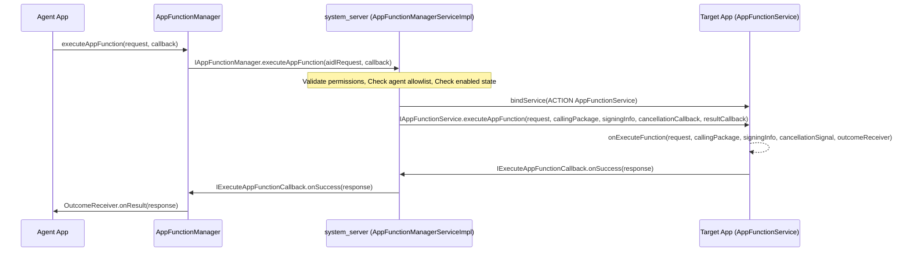
```mermaid
sequenceDiagram
    participant Agent as Agent App
    participant AFM as AppFunctionManager
    participant SS as system_server (AppFunctionManagerServiceImpl)
    participant AFS as Target App (AppFunctionService)

    Agent->>AFM: executeAppFunction(request, callback)
    AFM->>SS: IAppFunctionManager.executeAppFunction(aidlRequest, callback)
    Note over SS: Validate permissions, Check agent allowlist, Check enabled state
    SS->>AFS: bindService(ACTION AppFunctionService)
    SS->>AFS: IAppFunctionService.executeAppFunction(request, callingPackage, signingInfo, cancellationCallback, resultCallback)
    AFS-->>AFS: onExecuteFunction(request, callingPackage, signingInfo, cancellationSignal, outcomeReceiver)
    AFS->>SS: IExecuteAppFunctionCallback.onSuccess(response)
    SS->>AFM: IExecuteAppFunctionCallback.onSuccess(response)
    AFM->>Agent: OutcomeReceiver.onResult(response)
```

### 50.2.2 The Client: AppFunctionManager

`AppFunctionManager` is registered as a system service under
`Context.APP_FUNCTION_SERVICE`:

```
// frameworks/base/core/java/android/app/appfunctions/AppFunctionManager.java

@FlaggedApi(FLAG_ENABLE_APP_FUNCTION_MANAGER)
@SystemService(Context.APP_FUNCTION_SERVICE)
public final class AppFunctionManager {
```

The primary API is `executeAppFunction()`, which takes four parameters. In
Android 17 the permission requirement is `anyOf` the two execution permissions
(an app may also execute its own functions with no permission):

```java
// frameworks/base/core/java/android/app/appfunctions/AppFunctionManager.java

@FlaggedApi(FLAG_ENABLE_APP_FUNCTION_PERMISSION_V2)
@RequiresPermission(
        anyOf = {
            Manifest.permission.EXECUTE_APP_FUNCTIONS,
            Manifest.permission.EXECUTE_APP_FUNCTIONS_SYSTEM
        },
        conditional = true)
@UserHandleAware
public void executeAppFunction(
        @NonNull ExecuteAppFunctionRequest request,
        @NonNull @CallbackExecutor Executor executor,
        @NonNull CancellationSignal cancellationSignal,
        @NonNull OutcomeReceiver<ExecuteAppFunctionResponse, AppFunctionException> callback) {
```

Internally, the manager wraps the public request into an
`ExecuteAppFunctionAidlRequest` that adds caller identity and timing:

```java
ExecuteAppFunctionAidlRequest aidlRequest =
        new ExecuteAppFunctionAidlRequest(
                request,
                mContext.getUser(),
                mContext.getPackageName(),
                /* requestTime= */ SystemClock.elapsedRealtime(),
                /* requestWallTime= */ System.currentTimeMillis());
```

The Binder call returns an `ICancellationSignal` transport that is
wired back to the caller's `CancellationSignal`:

```java
ICancellationSignal cancellationTransport =
        mService.executeAppFunction(
                aidlRequest,
                new IExecuteAppFunctionCallback.Stub() {
                    @Override
                    public void onSuccess(ExecuteAppFunctionResponse result) {
                        executor.execute(() -> callback.onResult(result));
                    }
                    @Override
                    public void onError(AppFunctionException exception) {
                        executor.execute(() -> callback.onError(exception));
                    }
                });
if (cancellationTransport != null) {
    cancellationSignal.setRemote(cancellationTransport);
}
```

### 50.2.3 Enabled State Management

Each app function has a tri-state lifecycle:

| Constant | Value | Meaning |
|----------|-------|---------|
| `APP_FUNCTION_STATE_DEFAULT` | 0 | Reset to the default (typically enabled) |
| `APP_FUNCTION_STATE_ENABLED` | 1 | Explicitly enabled |
| `APP_FUNCTION_STATE_DISABLED` | 2 | Explicitly disabled |

Apps control their own functions via `setAppFunctionEnabled()`:

```java
// frameworks/base/core/java/android/app/appfunctions/AppFunctionManager.java

@UserHandleAware
public void setAppFunctionEnabled(
        @NonNull String functionIdentifier,
        @EnabledState int newEnabledState,
        @NonNull Executor executor,
        @NonNull OutcomeReceiver<Void, Exception> callback) {
```

The enabled state is persisted in AppSearch as an
`AppFunctionRuntimeMetadata` document, which is separate from the
`AppFunctionStaticMetadata` that describes the function's schema.

`setAppFunctionEnabled` applies **only** to functions backed by a static
`AppFunctionService` component. Runtime functions registered via
`registerAppFunction` (50.2.x) are enabled exactly while their registration is
live, so their enabled state is governed by `registerAppFunction` /
`AppFunctionRegistration.unregister` rather than this method; calling it for a
runtime-registered function throws `IllegalArgumentException`.

Android 17 also exposes the full runtime state, not just the enabled bit. The
`AppFunctionState` parcelable
(`frameworks/base/core/java/android/app/appfunctions/AppFunctionState.java`)
carries the function's `AppFunctionName`, `isEnabled`, and visibility, and is
read in bulk through `AppFunctionManager.getAppFunctionStates(...)` (see 50.2.x).

### 50.2.4 Access Control Model

The AppFunctions access model operates on three levels:

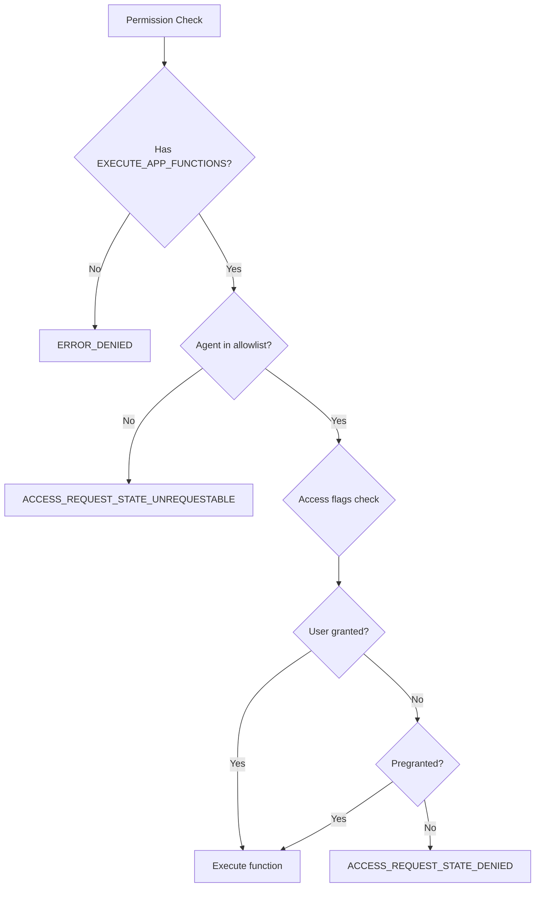
```mermaid
graph TD
    A[Permission Check] --> B{Has EXECUTE_APP_FUNCTIONS?}
    B -->|No| C[ERROR_DENIED]
    B -->|Yes| D{Agent in allowlist?}
    D -->|No| E[ACCESS_REQUEST_STATE_UNREQUESTABLE]
    D -->|Yes| F{Access flags check}
    F --> G{User granted?}
    G -->|Yes| H[Execute function]
    G -->|No| I{Pregranted?}
    I -->|Yes| H
    I -->|No| J[ACCESS_REQUEST_STATE_DENIED]
```

Access flags are a bitmask stored per (agent, target) pair. The constants are
defined in `AppFunctionManager` (`ACCESS_FLAG_*`):

| Flag | Value | Meaning |
|------|-------|---------|
| `ACCESS_FLAG_PREGRANTED` | `1` | System pre-granted the access |
| `ACCESS_FLAG_UPGRADE_GRANTED` | `1 << 1` | Granted as part of a system upgrade |
| `ACCESS_FLAG_USER_GRANTED` | `1 << 2` | User explicitly granted via UI |
| `ACCESS_FLAG_USER_DENIED` | `1 << 3` | User explicitly denied via UI (overrides `PREGRANTED`) |
| `ACCESS_FLAG_OTHER_GRANTED` | `1 << 4` | Granted via ADB or another mechanism |
| `ACCESS_FLAG_OTHER_DENIED` | `1 << 5` | Denied via ADB or self-revoke |

In Android 17 the agent allowlist is no longer a `DeviceConfig` string. It is
served by the platform `AllowlistManager`
(`frameworks/base/core/java/android/os/allowlist/AllowlistManager.java`), which
maps a signed agent package to the set of target packages it may access (a
`SignedPackage` keyed by package name plus certificate digest, with a wildcard
target for "all targets"). The AppFunctions service reads it through
`SystemAppFunctionAllowlistReader`
(`frameworks/base/services/appfunctions/.../allowlist/SystemAppFunctionAllowlistReader.java`),
which caches per-agent results in an `LruCache`:

```java
// frameworks/base/services/appfunctions/.../allowlist/SystemAppFunctionAllowlistReader.java

public class SystemAppFunctionAllowlistReader implements AppFunctionAllowlistReader {
    private final LruCache<SignedPackage, ArraySet<String>> mCache;
    private final AllowlistManager mAllowlistManager;

    @Override
    public CompletableFuture<Boolean> isAllowlisted(
            String agentPackage, String targetPackageName, int userId) { ... }
}
```

`CallerValidatorImpl` checks both the runtime permission and this allowlist
before any execution proceeds. An agent holding `EXECUTE_APP_FUNCTIONS_SYSTEM`
is treated as a privileged system agent and skips the allowlist entirely;
agents holding only `EXECUTE_APP_FUNCTIONS` must be allowlisted for the target.

### 50.2.5 The AIDL Interfaces

The framework defines two AIDL interfaces -- one facing the client, one facing
the target app.

**IAppFunctionManager** (client-to-system\_server). The interface grew
substantially in Android 17 to carry the discovery, observation, runtime
registration, and access-management surface:

```
// frameworks/base/core/java/android/app/appfunctions/IAppFunctionManager.aidl

interface IAppFunctionManager {
    ICancellationSignal executeAppFunction(
        in ExecuteAppFunctionAidlRequest request,
        in IExecuteAppFunctionCallback callback);

    // Discovery and observation
    void observeAppFunctions(
        in AppFunctionAidlSearchSpec aidlSearchSpec,
        in IObserveAppFunctionChangesCallback callback);
    void unregisterAppFunctionObserver(
        in String callingPackage, in UserHandle userHandle,
        in IObserveAppFunctionChangesCallback callback);
    void getAppFunctionStates(
        in List<AppFunctionName> appFunctionNames,
        in String callingPackageName, int targetUserId,
        in IGetAppFunctionStatesCallback callback);
    void getAppFunctionActivityStates(
        in List<AppFunctionActivityId> activityIds,
        in String callingPackageName, int targetUserId,
        in IGetAppFunctionActivityStatesCallback callback);

    // Enabled-state lifecycle
    void isAppFunctionEnabled(
        in String callingPackage, in String targetPackage,
        in String functionIdentifier, in UserHandle userHandle,
        in IIsAppFunctionEnabledCallback callback);
    void setAppFunctionEnabled(
        in String callingPackage, in String functionIdentifier,
        in UserHandle userHandle, int enabledState,
        in ISetAppFunctionEnabledCallback callback);

    // Runtime (dynamic) registration
    void registerAppFunctions(in String packageName, in List<String> functionIds,
        in IAppFunctionExecutor executor, in IBinder activityToken);
    void unregisterAppFunctions(in String packageName, in List<String> functionIds,
        in IAppFunctionExecutor executor);

    // Access management
    int getAccessRequestState(in String agentPackageName, int agentUserId,
        in String targetPackageName, int targetUserId);
    int getAccessFlags(in String agentPackageName, int agentUserId,
        in String targetPackageName, int targetUserId);
    boolean updateAccessFlags(in String agentPackageName, int agentUserId,
        in String targetPackageName, int targetUserId, int flagMask, int flags);
    void revokeSelfAccess(in String targetPackageName);
    List<String> getValidAgents(int userId);
    List<String> getValidTargets(int targetUserId);
    Intent createRequestAccessIntent(in String targetPackageName);
    void addOnAccessChangedListener(IOnAppFunctionAccessChangeListener listener, int userId);
    void removeOnAccessChangedListener(IOnAppFunctionAccessChangeListener listener, int userId);
}
```

Note the distinct enabled-state callbacks: `IIsAppFunctionEnabledCallback` for
the query path and `ISetAppFunctionEnabledCallback` for the mutation path. The
runtime-registration path passes an `IAppFunctionExecutor` (the in-process
callback the system invokes for dynamically registered functions) rather than
binding a separate component.

**IAppFunctionService** (system\_server-to-target app, `oneway`):

```
// frameworks/base/core/java/android/app/appfunctions/IAppFunctionService.aidl

oneway interface IAppFunctionService {
    void executeAppFunction(
        in ExecuteAppFunctionRequest request,
        in String callingPackage,
        in android.content.pm.SigningInfo callingPackageSigningInfo,
        in ICancellationCallback cancellationCallback,
        in IExecuteAppFunctionCallback callback);
}
```

The `oneway` modifier is critical: the system\_server does not block waiting
for the target app to finish. Results flow back through the
`IExecuteAppFunctionCallback`.

### 50.2.6 The Target: AppFunctionService

Target apps extend `AppFunctionService` and implement a single abstract method:

```java
// frameworks/base/core/java/android/app/appfunctions/AppFunctionService.java

@MainThread
public abstract void onExecuteFunction(
        @NonNull ExecuteAppFunctionRequest request,
        @NonNull String callingPackage,
        @NonNull SigningInfo callingPackageSigningInfo,
        @NonNull CancellationSignal cancellationSignal,
        @NonNull OutcomeReceiver<ExecuteAppFunctionResponse, AppFunctionException> callback);
```

The service enforces that only system\_server (which holds
`BIND_APP_FUNCTION_SERVICE`) can call it:

```java
// frameworks/base/core/java/android/app/appfunctions/AppFunctionService.java

if (context.checkCallingPermission(BIND_APP_FUNCTION_SERVICE)
        == PERMISSION_DENIED) {
    throw new SecurityException("Can only be called by the system server.");
}
```

The manifest declaration requires the binding permission:

```xml
<service android:name=".YourService"
       android:permission="android.permission.BIND_APP_FUNCTION_SERVICE">
    <intent-filter>
      <action android:name="android.app.appfunctions.AppFunctionService" />
    </intent-filter>
</service>
```

### 50.2.7 Request and Response Wire Format

Both `ExecuteAppFunctionRequest` and `ExecuteAppFunctionResponse` use
AppSearch's `GenericDocument` as their parameter wire format. This is not
arbitrary -- it ensures that function parameters can be described by a schema
that AppSearch already knows how to index and query.

**Request:**

```java
// frameworks/base/core/java/android/app/appfunctions/ExecuteAppFunctionRequest.java

public final class ExecuteAppFunctionRequest implements Parcelable {
    @NonNull private final String mTargetPackageName;
    @NonNull private final String mFunctionIdentifier;
    @NonNull private final Bundle mExtras;
    @NonNull private final GenericDocumentWrapper mParameters;
    @Nullable private final AppInteractionAttribution mAttribution;
```

**Response:**

```java
// frameworks/base/core/java/android/app/appfunctions/ExecuteAppFunctionResponse.java

public final class ExecuteAppFunctionResponse implements Parcelable {
    public static final String PROPERTY_RETURN_VALUE = "androidAppfunctionsReturnValue";
    @NonNull private final GenericDocumentWrapper mResultDocumentWrapper;
    @NonNull private final Bundle mExtras;
    @NonNull private final List<AppFunctionUriGrant> mUriGrants;
```

The return value lives at the key `PROPERTY_RETURN_VALUE` inside the result
`GenericDocument`. The `AppFunction SDK` (a separate Jetpack library) provides
typed wrappers that pack/unpack these documents.

### 50.2.8 Attribution and Interaction Logging

Every execution can carry an `AppInteractionAttribution` describing the
interaction that triggered it. In Android 17 this attribution type was promoted
out of the appfunctions package into `android.app` so it can be shared with the
broader App Interaction API, and it is gated by `FLAG_ENABLE_APP_INTERACTION_API`:

```java
// frameworks/base/core/java/android/app/AppInteractionAttribution.java

public static final int INTERACTION_TYPE_OTHER = 0;        // custom string required
public static final int INTERACTION_TYPE_USER_QUERY = 1;
public static final int INTERACTION_TYPE_USER_SCHEDULED = 2;
```

An attribution carries the interaction type, an optional custom-type string
(when the type is `INTERACTION_TYPE_OTHER`), and an optional interaction `Uri`
that links back to the originating context. The privacy UI uses it to explain to
the user *why* a function ran.

Rather than persisting a per-call history database, Android 17 records each
execution to the platform metrics pipeline (statsd). The system server's
`AppFunctionsLoggerWrapper`
(`frameworks/base/services/appfunctions/.../AppFunctionsLoggerWrapper.java`)
runs on a shared background executor and emits a structured event for every
success or error, normalizing the public attribution constants and tagging the
function's type:

```java
// frameworks/base/services/appfunctions/.../AppFunctionsLoggerWrapper.java

static final int FUNCTION_TYPE_UNSPECIFIED = 0;
static final int FUNCTION_TYPE_STATIC = 1;          // AppFunctionService-backed
static final int FUNCTION_TYPE_DYNAMIC_GLOBAL = 2;  // registerAppFunction (Service/global)
static final int FUNCTION_TYPE_DYNAMIC_ACTIVITY = 3;// registerAppFunction (Activity-scoped)

void logAppFunctionSuccess(
        ExecuteAppFunctionAidlRequest request,
        ExecuteAppFunctionResponse response,
        int callingUid,
        long executionStartTimeMillis,
        @AppFunctionMetadata.AppFunctionType int appFunctionType) { ... }
```

The logged event captures the calling UID, target, the interaction type derived
from the request's `AppInteractionAttribution`, the function type (static vs.
dynamic, global vs. activity-scoped), the response code, and the execution
latency measured from after the service bind completed.

### 50.2.9 Error Handling

`AppFunctionException` defines a categorized error code scheme:

```java
// frameworks/base/core/java/android/app/appfunctions/AppFunctionException.java

// Request errors (1000-1999)
public static final int ERROR_DENIED = 1000;
public static final int ERROR_INVALID_ARGUMENT = 1001;
public static final int ERROR_DISABLED = 1002;
public static final int ERROR_FUNCTION_NOT_FOUND = 1003;

// System errors (2000-2999)
public static final int ERROR_SYSTEM_ERROR = 2000;
public static final int ERROR_CANCELLED = 2001;
public static final int ERROR_ENTERPRISE_POLICY_DISALLOWED = 2002;

// App errors (3000-3999)
public static final int ERROR_APP_UNKNOWN_ERROR = 3000;
```

The `getErrorCategory()` method maps ranges to categories:

```java
public int getErrorCategory() {
    if (mErrorCode >= 1000 && mErrorCode < 2000) return ERROR_CATEGORY_REQUEST_ERROR;
    if (mErrorCode >= 2000 && mErrorCode < 3000) return ERROR_CATEGORY_SYSTEM;
    if (mErrorCode >= 3000 && mErrorCode < 4000) return ERROR_CATEGORY_APP;
    return ERROR_CATEGORY_UNKNOWN;
}
```

### 50.2.10 System Server Implementation

A thin `SystemService`,
`frameworks/base/services/appfunctions/java/com/android/server/appfunctions/AppFunctionManagerService.java`,
constructs and publishes the binder under `Context.APP_FUNCTION_SERVICE` and
forwards the user lifecycle. The real logic lives in
`AppFunctionManagerServiceImpl`, which extends `IAppFunctionManager.Stub` and
coordinates the collaborators wired up by the `SystemService`:

```java
// frameworks/base/services/appfunctions/.../AppFunctionManagerServiceImpl.java

public class AppFunctionManagerServiceImpl extends IAppFunctionManager.Stub {
    private final RemoteServiceCaller<IAppFunctionService> mRemoteServiceCaller;
    private final CallerValidator mCallerValidator;
    private final AppFunctionsLoggerWrapper mLoggerWrapper;
    private final IUriGrantsManager mUriGrantsManager;
    private final UriGrantsManagerInternal mUriGrantsManagerInternal;
    private final MultiUserDynamicAppFunctionRegistry mDynamicAppFunctionRegistry;
    private final AppFunctionMetadataReader mAppFunctionMetadataReader;
    private final AppFunctionMetadataObserver mAppFunctionMetadataObserver;
    private final VisibilityHelper mVisibilityHelper;
    private final ActivityTaskManagerInternal mActivityTaskManagerInternal;
    // Access checks delegate to the permission subsystem, when enabled:
    private final AppFunctionAccessServiceInterface mAppFunctionAccessService;
    ...
```

Key supporting classes:

| Class | Responsibility |
|-------|---------------|
| `RemoteServiceCallerImpl` | Binds to target `AppFunctionService`, manages connection lifecycle |
| `CallerValidatorImpl` | Enforces `EXECUTE_APP_FUNCTIONS` / `EXECUTE_APP_FUNCTIONS_SYSTEM`, checks the allowlist |
| `MetadataSyncAdapter` | Syncs static function metadata to AppSearch on package changes |
| `AppFunctionPackageMonitor` | Watches for package install/update/remove |
| `MultiUserDynamicAppFunctionRegistry` | Holds runtime (`registerAppFunction`) registrations per user |
| `AppFunctionMetadataReader` | Reads static (AppSearch) and dynamic metadata for discovery/state |
| `AppFunctionMetadataObserver` | Drives `observeAppFunctions` from AppSearch change observers |
| `SystemAppFunctionAllowlistReader` | Resolves the signed agent allowlist via `AllowlistManager` |
| `AppFunctionsLoggerWrapper` | Emits statsd interaction events for each execution |
| `AppFunctionAccessService` (permission subsystem) | Persists per (agent, target) access state and flags |

### 50.2.11 Function Discovery via AppSearch

When a package is installed, updated, or the device boots, the
`MetadataSyncAdapter` extracts app function metadata from the target app's
`AppFunctionService` and indexes it as `AppFunctionStaticMetadata` documents
in AppSearch. Agents discover functions by querying AppSearch:

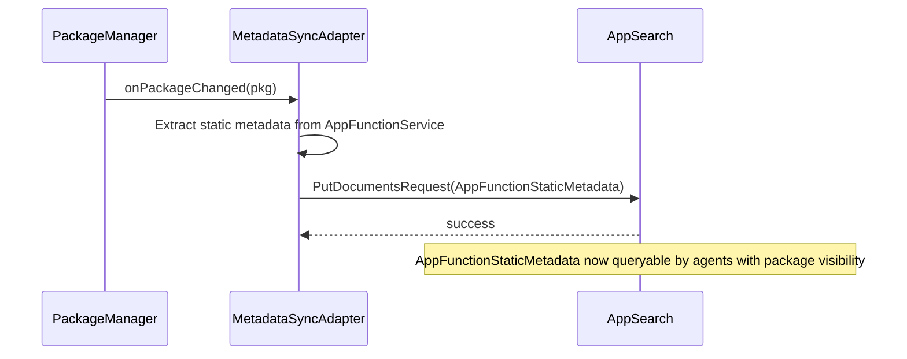
```mermaid
sequenceDiagram
    participant PM as PackageManager
    participant MSync as MetadataSyncAdapter
    participant AS as AppSearch

    PM->>MSync: onPackageChanged(pkg)
    MSync->>MSync: Extract static metadata from AppFunctionService
    MSync->>AS: PutDocumentsRequest(AppFunctionStaticMetadata)
    AS-->>MSync: success

    Note over AS: AppFunctionStaticMetadata now queryable by agents with package visibility
```

### 50.2.12 SafeOneTimeExecuteAppFunctionCallback

A critical defensive wrapper ensures exactly-once delivery:

```java
// frameworks/base/core/java/android/app/appfunctions/SafeOneTimeExecuteAppFunctionCallback.java

public class SafeOneTimeExecuteAppFunctionCallback {
    private final AtomicBoolean mOnResultCalled = new AtomicBoolean(false);
    @NonNull private final IExecuteAppFunctionCallback mCallback;
    @Nullable private final CompletionCallback mCompletionCallback;
    @Nullable private final BeforeCompletionCallback mBeforeCompletionCallback;
    private final AtomicLong mExecutionStartTimeAfterBindMillis = new AtomicLong();

    public void onResult(@NonNull ExecuteAppFunctionResponse result) {
        if (!mOnResultCalled.compareAndSet(false, true)) {
            Log.w(TAG, "Ignore subsequent calls to onResult/onError()");
            return;
        }
        try {
            if (mBeforeCompletionCallback != null) {
                mBeforeCompletionCallback.beforeOnSuccess(result);
            }
            mCallback.onSuccess(result);
            if (mCompletionCallback != null) {
                mCompletionCallback.finalizeOnSuccess(
                        result, mExecutionStartTimeAfterBindMillis.get());
            }
        } catch (RemoteException ex) {
            Log.w(TAG, "Failed to invoke the callback", ex);
        }
    }

    public void onError(@NonNull AppFunctionException error) {
        if (!mOnResultCalled.compareAndSet(false, true)) {
            Log.w(TAG, "Ignore subsequent calls to onResult/onError()");
            return;
        }
        try {
            mCallback.onError(error);
            if (mCompletionCallback != null) {
                mCompletionCallback.finalizeOnError(
                        error, mExecutionStartTimeAfterBindMillis.get());
            }
        } catch (RemoteException ex) {
            Log.w(TAG, "Failed to invoke the callback", ex);
        }
    }
```

This design pattern is essential because:

1. **Target apps might call back multiple times** -- The `AppFunctionService`
   is third-party code that might erroneously invoke the callback twice.
   The `AtomicBoolean.compareAndSet()` ensures only the first call succeeds.

2. **RemoteException swallowing** -- If the calling process has died by the
   time the result arrives, the `RemoteException` is logged and swallowed
   rather than crashing the system server.

3. **Completion hooks** -- The `BeforeCompletionCallback` and
   `CompletionCallback` allow the system server to perform actions (like
   logging, URI grants, and access history recording) around the callback
   delivery:

```java
    public interface CompletionCallback {
        void finalizeOnSuccess(
                ExecuteAppFunctionResponse result, long executionStartTimeMillis);
        void finalizeOnError(
                AppFunctionException error, long executionStartTimeMillis);
    }

    public interface BeforeCompletionCallback {
        void beforeOnSuccess(ExecuteAppFunctionResponse result);
    }
```

4. **Latency tracking** -- The `mExecutionStartTimeAfterBindMillis` field
   records when execution began after service binding completed, allowing
   the system to distinguish binding overhead from execution time.

5. **Disable mechanism** -- The `disable()` method can prevent any further
   callback delivery, used when the request is cancelled or timed out.

### 50.2.13 The executeAppFunction Implementation Deep Dive

The system server's `executeAppFunction` method is the most critical path in
the entire framework. Let us trace it line by line from the AIDL entry point
through to the target service binding.

**Step 1: Entry and initial validation.**

```java
// frameworks/base/services/appfunctions/.../AppFunctionManagerServiceImpl.java

@Override
public ICancellationSignal executeAppFunction(
        @NonNull ExecuteAppFunctionAidlRequest requestInternal,
        @NonNull IExecuteAppFunctionCallback executeAppFunctionCallback) {

    int callingUid = Binder.getCallingUid();
    int callingPid = Binder.getCallingPid();

    final SafeOneTimeExecuteAppFunctionCallback safeExecuteAppFunctionCallback =
            initializeSafeExecuteAppFunctionCallback(
                    requestInternal, executeAppFunctionCallback, callingUid);

    String validatedCallingPackage;
    try {
        validatedCallingPackage =
                mCallerValidator.validateCallingPackage(requestInternal.getCallingPackage());
        mCallerValidator.verifyTargetUserHandle(
                requestInternal.getUserHandle(), validatedCallingPackage);
    } catch (SecurityException exception) {
        safeExecuteAppFunctionCallback.onError(
                new AppFunctionException(
                        AppFunctionException.ERROR_DENIED, exception.getMessage()));
        return null;
    }
```

The `SafeOneTimeExecuteAppFunctionCallback` wrapper ensures that exactly one
response (success or error) is delivered, even if the target app sends multiple
replies or crashes before responding.

**Step 2: Asynchronous execution on the thread pool.**

```java
    ICancellationSignal localCancelTransport = CancellationSignal.createTransport();

    THREAD_POOL_EXECUTOR.execute(
            () -> {
                try {
                    executeAppFunctionInternal(
                            requestInternal,
                            callingUid, callingPid,
                            localCancelTransport,
                            safeExecuteAppFunctionCallback,
                            executeAppFunctionCallback.asBinder());
                } catch (Exception e) {
                    safeExecuteAppFunctionCallback.onError(
                            mapExceptionToExecuteAppFunctionResponse(e));
                }
            });
    return localCancelTransport;
}
```

The work is dispatched to `THREAD_POOL_EXECUTOR` (defined in
`AppFunctionExecutors`) to avoid blocking the Binder thread pool.

**Step 3: Permission and state validation.**

```java
@WorkerThread
private void executeAppFunctionInternal(...) {
    // Enterprise policy check
    if (!mCallerValidator.verifyEnterprisePolicyIsAllowed(callingUser, targetUser)) {
        safeExecuteAppFunctionCallback.onError(
                new AppFunctionException(
                        AppFunctionException.ERROR_ENTERPRISE_POLICY_DISALLOWED, ...));
        return;
    }

    // Empty target package check
    if (TextUtils.isEmpty(targetPackageName)) {
        safeExecuteAppFunctionCallback.onError(
                new AppFunctionException(
                        AppFunctionException.ERROR_INVALID_ARGUMENT, ...));
        return;
    }
```

**Step 4: Future-chained permission and enabled-state checks.**

The implementation uses `AndroidFuture.thenCompose()` for non-blocking
permission verification followed by AppSearch-backed enabled-state lookup:

```java
    mCallerValidator
            .verifyCallerCanExecuteAppFunction(
                    callingUid, callingPid, targetUser,
                    requestInternal.getCallingPackage(),
                    targetPackageName,
                    requestInternal.getClientRequest().getFunctionIdentifier())
            .thenCompose(canExecuteResult -> {
                if (canExecuteResult == CAN_EXECUTE_APP_FUNCTIONS_DENIED) {
                    return AndroidFuture.failedFuture(
                            new SecurityException("Caller does not have permission"));
                }
                return isAppFunctionEnabled(
                        functionIdentifier, targetPackageName,
                        getAppSearchManagerAsUser(userHandle), THREAD_POOL_EXECUTOR)
                    .thenApply(isEnabled -> {
                        if (!isEnabled) {
                            throw new DisabledAppFunctionException("Disabled");
                        }
                        return canExecuteResult;
                    });
            })
```

**Step 5: Service resolution and binding.**

```java
            .thenAccept(canExecuteResult -> {
                int bindFlags = Context.BIND_AUTO_CREATE;
                if (canExecuteResult
                        == CAN_EXECUTE_APP_FUNCTIONS_ALLOWED_HAS_PERMISSION) {
                    bindFlags |= Context.BIND_FOREGROUND_SERVICE;
                }
                Intent serviceIntent =
                        mInternalServiceHelper.resolveAppFunctionService(
                                targetPackageName, targetUser);
                // Grant implicit visibility to allow target to see caller
                mPackageManagerInternal.grantImplicitAccess(
                        grantRecipientUserId, serviceIntent,
                        grantRecipientAppId, callingUid, /* direct= */ true);
                bindAppFunctionServiceUnchecked(
                        requestInternal, serviceIntent, targetUser,
                        localCancelTransport, safeExecuteAppFunctionCallback,
                        bindFlags, callerBinder, callingUid);
            })
```

This reveals an important detail: when the caller has
`EXECUTE_APP_FUNCTIONS`, the system uses `BIND_FOREGROUND_SERVICE` to elevate
the target service's process priority. Self-calls (same package) do not get
this elevation.

### 50.2.14 The RemoteServiceCaller Pattern

`RemoteServiceCallerImpl` implements the one-shot service binding pattern:

```java
// frameworks/base/services/appfunctions/.../RemoteServiceCallerImpl.java

public class RemoteServiceCallerImpl<T> implements RemoteServiceCaller<T> {
    public boolean runServiceCall(
            Intent intent, int bindFlags, UserHandle userHandle,
            long cancellationTimeoutMillis, CancellationSignal cancellationSignal,
            RunServiceCallCallback<T> callback, IBinder callerBinder) {

        OneOffServiceConnection serviceConnection =
                new OneOffServiceConnection(intent, bindFlags, userHandle,
                        cancellationTimeoutMillis, cancellationSignal,
                        callback, callerBinder);
        return serviceConnection.bindAndRun();
    }
```

The `OneOffServiceConnection` is a `ServiceConnection` that:

1. Calls `Context.bindServiceAsUser()` to connect to the target
2. Sets a cancellation listener that triggers unbinding after a timeout
3. Links to the caller's binder death to cancel if the caller dies
4. Unbinds automatically after the callback completes

```java
private class OneOffServiceConnection
        implements ServiceConnection, ServiceUsageCompleteListener {

    public boolean bindAndRun() {
        boolean bindServiceResult =
                mContext.bindServiceAsUser(mIntent, this, mFlags, mUserHandle);

        if (bindServiceResult) {
            mCancellationSignal.setOnCancelListener(() -> {
                mCallback.onCancelled();
                mHandler.postDelayed(mCancellationTimeoutRunnable,
                        mCancellationTimeoutMillis);
            });
            mDirectServiceVulture = () -> {
                Slog.w(TAG, "Caller process onDeath signal received");
                mCancellationSignal.cancel();
            };
            mCallerBinder.linkToDeath(mDirectServiceVulture, 0);
        }
        return bindServiceResult;
    }
```

This pattern ensures that the service connection is always cleaned up,
even if the caller crashes, the target crashes, or the user cancels.

### 50.2.15 Multi-User Support

The service implementation is multi-user aware. Each user has:

- Their own AppSearch database for static function metadata
- Their own `PackageMonitor` for tracking package changes
- Their own slice of the `MultiUserDynamicAppFunctionRegistry` for runtime
  registrations
- Separate access state and flags per (agent, target) pair, persisted by the
  permission subsystem

```java
// AppFunctionManagerServiceImpl.java

public void onUserUnlocked(TargetUser user) {
    if (enableDynamicAppFunctions()) {
        mAppFunctionMetadataObserver.registerAppSearchObserverForUser(user);
    } else {
        registerAppSearchObserver(user);
    }
    trySyncRuntimeMetadata(user.getUserHandle(), ...);
    PackageMonitor pkgMonitorForUser =
            AppFunctionPackageMonitor.registerPackageMonitorForUser(
                    mContext, user, mAppFunctionMetadataObserver);
    mPackageMonitors.append(user.getUserIdentifier(), pkgMonitorForUser);
    mDynamicAppFunctionRegistry.onUserUnlocked(user, ...);
}

public void onUserStopping(@NonNull TargetUser user) {
    if (enableDynamicAppFunctions()) {
        mAppFunctionMetadataObserver.unregisterAppSearchObserverForUser(user);
    } else {
        MetadataSyncPerUser.removeUserSyncAdapter(user.getUserHandle());
    }
    mPackageMonitors.get(user.getUserIdentifier()).unregister();
    mPackageMonitors.delete(user.getUserIdentifier());
}

public void onUserStopped(@NonNull TargetUser user) {
    mDynamicAppFunctionRegistry.onUserStopped(user);
}
```

When the dynamic-functions flag is on, the per-user AppSearch observer is owned
by `AppFunctionMetadataObserver` (which fans changes out both to internal
metadata caches and to client `observeAppFunctions` callbacks). The runtime
registry is keyed by user so that registrations made by one user's processes are
torn down when that user stops.

### 50.2.16 Agent Allowlist Architecture

In Android 17 the agent allowlist is no longer a merge of `DeviceConfig` and
`Settings.Secure` strings. It is served by the platform `AllowlistManager`
(allowlist id `ALLOWLIST_ID_APP_FUNCTION`), which returns, for a *signed* agent
package, the set of target packages it may access. The AppFunctions service
consumes it through `SystemAppFunctionAllowlistReader`:

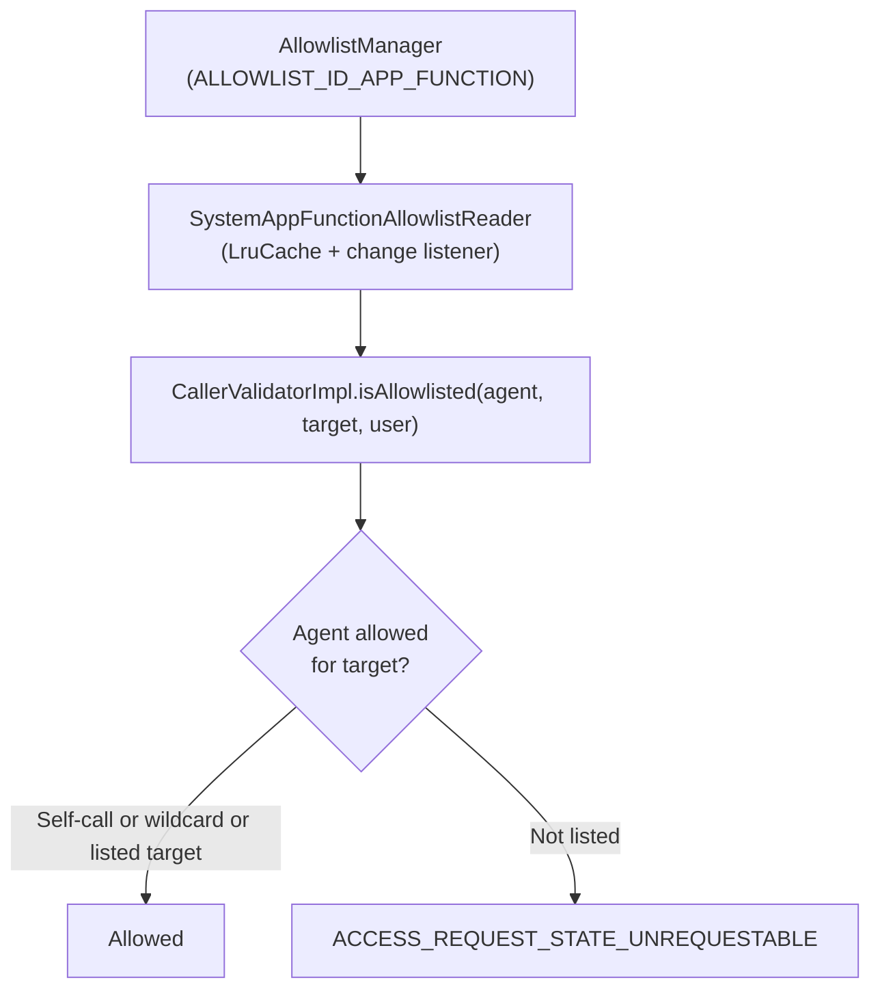
```mermaid
graph TD
    A["AllowlistManager<br/>(ALLOWLIST_ID_APP_FUNCTION)"] --> B["SystemAppFunctionAllowlistReader<br/>(LruCache + change listener)"]
    B --> C["CallerValidatorImpl.isAllowlisted(agent, target, user)"]
    C --> E{"Agent allowed<br/>for target?"}
    E -->|"Self-call or wildcard or listed target"| F[Allowed]
    E -->|Not listed| G[ACCESS_REQUEST_STATE_UNREQUESTABLE]
```

The reader hashes the agent's latest signing certificate into a `SignedPackage`
and asks `AllowlistManager` for that agent's valid targets, caching the result
in an `LruCache` so repeated executions by the same agent skip the IPC:

```java
// frameworks/base/services/appfunctions/.../allowlist/SystemAppFunctionAllowlistReader.java

@Override
public CompletableFuture<Boolean> isAllowlisted(
        String agentPackageName, String targetPackageName, int userId) {
    if (agentPackageName.equals(targetPackageName)) {
        return AndroidFuture.completedFuture(true);   // own functions always allowed
    }
    SignedPackage agentSignedPackage =
            new SignedPackage(agentPackageName, /* certificate digest */ ...);
    maybeStartAllowlistListener();
    return getValidTargetPackages(agentSignedPackage)
            .thenApply(allowlistTargets ->
                    allowlistTargets.contains(WILDCARD_PACKAGE_NAME)
                            || allowlistTargets.contains(targetPackageName));
}
```

Three behaviors are worth noting:

- **Self-access** (`agent == target`) is implicitly allowed, so an app can
  always invoke its own functions.
- **Wildcard targets**: an agent allowlisted with the wildcard package may
  access any target.
- **Change listening**: on first use the reader registers an
  `OnAllowlistChangedListener` (request id `ALLOWLIST_ID_APP_FUNCTION`) so cache
  entries are invalidated when the platform allowlist updates, rather than being
  reloaded from a config string at boot.

### 50.2.17 URI Grants for AppFunction Responses

When a target app returns content URIs in its response, the framework can
grant temporary URI permissions to the calling agent:

```java
// AppFunctionManagerServiceImpl.java

private final IUriGrantsManager mUriGrantsManager;
private final UriGrantsManagerInternal mUriGrantsManagerInternal;
private final IBinder mPermissionOwner;

// In constructor:
mPermissionOwner = mUriGrantsManagerInternal.newUriPermissionOwner("appfunctions");
```

The `AppFunctionUriGrant` objects in the response specify which URIs should be
granted to the agent. The grant is issued through
`mUriGrantsManager.grantUriPermissionFromOwner(mPermissionOwner, ...)`, tying it
to the AppFunctions permission owner so the system can revoke it later; the
grants live until the owner releases them or the device reboots.

### 50.2.18 Shell Command Support

The service implements `onShellCommand()` for developer debugging:

```java
// AppFunctionManagerServiceImpl.java

@Override
public void onShellCommand(
        FileDescriptor in, FileDescriptor out, FileDescriptor err,
        @NonNull String[] args, ShellCallback callback,
        @NonNull ResultReceiver resultReceiver) {
    new AppFunctionManagerServiceShellCommand(mContext, this)
            .exec(this, in, out, err, args, callback, resultReceiver);
}
```

Available via `adb shell cmd app_function`.

### 50.2.19 Service Startup and Lifecycle

The framework is a `SystemService`. `AppFunctionManagerService.onStart()`
publishes the binder under `Context.APP_FUNCTION_SERVICE` (only when
`AppFunctionManagerConfiguration.isSupported(context)` is true) and optionally
publishes the `AppInteractionService` local service when the App Interaction
API flag is on:

```java
// frameworks/base/services/appfunctions/.../AppFunctionManagerService.java

@Override
public void onStart() {
    if (AppFunctionManagerConfiguration.isSupported(getContext())) {
        publishBinderService(Context.APP_FUNCTION_SERVICE, mServiceImpl);
    }
    if (Flags.enableAppInteractionApi()) {
        publishLocalService(AppInteractionService.class, mAppInteractionService);
    }
}
```

Per-user state is set up and torn down through `onUserStarting`,
`onUserUnlocked`, `onUserStopping`, and `onUserStopped` (50.2.15). The agent
allowlist is no longer primed at a boot phase; it is fetched lazily from
`AllowlistManager` on first use and kept fresh by a change listener (50.2.16).

---

## 50.3 Computer Control

Computer Control, introduced in Android 16, is the framework that lets AI agents
programmatically interact with applications through a virtual display. Instead
of requiring apps to implement specific APIs, an agent can launch any app on a
headless virtual display, observe the screen via screenshots, inject tap/swipe
events, and read accessibility trees -- the same paradigm used by "computer
use" AI agents. Because it is built on top of `VirtualDeviceManager`, Computer
Control's virtual-display, input, and lifecycle machinery is covered in depth in
Chapter 51 (CompanionDeviceManager and Virtual Devices); this section focuses on
the agent-facing session API and how it complements AppFunctions.

**Source tree (Android 17):**

```
frameworks/base/core/java/android/companion/virtual/computercontrol/
    ComputerControlSession.java                  -- Core session API
    ComputerControlSessionParams.java            -- Session configuration
    InteractiveMirror.java                       -- Mirror display for user view
    ComputerControlConsentManager.java           -- Per-session consent flow
    ComputerControlAccessibilityProxy.java       -- Accessibility tree access
    LifecycleState.java / LifecycleStateTracker.java -- Session lifecycle states
    AutomatedPackageListener.java                -- Package change notifications
    IComputerControlSession.aidl                 -- Session Binder interface
    IComputerControlSessionCallback.aidl         -- Creation lifecycle callback
    IComputerControlLifecycleCallback.aidl       -- Lifecycle-state callback
    IComputerControlConsentManager.aidl          -- Consent Binder interface
    IInteractiveMirror.aidl                      -- Mirror display interface
    IAutomatedPackageListener.aidl               -- Package listener interface

frameworks/base/libs/computercontrol/              -- Extension library (sidecar APIs)
    src/com/android/extensions/computercontrol/
        ComputerControlExtensions.java           -- Entry point
        ComputerControlSession.java              -- Extension session wrapper
        AutomatedPackageListener.java            -- Extension listener
        view/MirrorView.java                     -- Mirror display view
```

### 50.3.1 Architecture

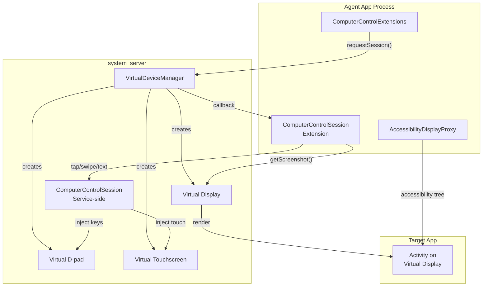
```mermaid
graph TB
    subgraph "Agent App Process"
        CCE[ComputerControlExtensions]
        CCS_EXT["ComputerControlSession<br/>Extension"]
        AP[AccessibilityDisplayProxy]
    end

    subgraph "system_server"
        VDM[VirtualDeviceManager]
        CCS_SVC["ComputerControlSession<br/>Service-side"]
        VD[Virtual Display]
        VDP[Virtual D-pad]
        VTS[Virtual Touchscreen]
    end

    subgraph "Target App"
        ACTIVITY["Activity on<br/>Virtual Display"]
    end

    CCE -- "requestSession()" --> VDM
    VDM -- "creates" --> VD
    VDM -- "creates" --> VDP
    VDM -- "creates" --> VTS
    VDM -- "callback" --> CCS_EXT
    CCS_EXT -- "tap/swipe/text" --> CCS_SVC
    CCS_SVC -- "inject touch" --> VTS
    CCS_SVC -- "inject keys" --> VDP
    VD -- "render" --> ACTIVITY
    CCS_EXT -- "getScreenshot()" --> VD
    AP -- "accessibility tree" --> ACTIVITY
```

### 50.3.2 Session Lifecycle

The entry point is `ComputerControlExtensions.getInstance()`, which checks for
`FEATURE_ACTIVITIES_ON_SECONDARY_DISPLAYS` and `VirtualDeviceManager`
availability:

```java
// frameworks/base/libs/computercontrol/.../ComputerControlExtensions.java

private static boolean isAvailable(Context context) {
    if (!context.getPackageManager().hasSystemFeature(
                PackageManager.FEATURE_ACTIVITIES_ON_SECONDARY_DISPLAYS)) {
        return false;
    }
    return context.getSystemService(VirtualDeviceManager.class) != null;
}
```

Session creation flows through `requestSession()` which requires
`ACCESS_COMPUTER_CONTROL`:

```java
// frameworks/base/libs/computercontrol/.../ComputerControlExtensions.java

@RequiresPermission(Manifest.permission.ACCESS_COMPUTER_CONTROL)
public void requestSession(@NonNull ComputerControlSession.Params params,
        @NonNull Executor executor, @NonNull ComputerControlSession.Callback callback) {
    // Build platform params
    ComputerControlSessionParams sessionParams =
            new ComputerControlSessionParams.Builder()
                    .setName(params.getName())
                    .setTargetPackageNames(params.getTargetPackageNames())
                    .setDisplayWidthPx(params.getDisplayWidthPx())
                    .setDisplayHeightPx(params.getDisplayHeightPx())
                    .setDisplayDpi(params.getDisplayDpi())
                    .setDisplaySurface(params.getDisplaySurface())
                    .setDisplayAlwaysUnlocked(params.isDisplayAlwaysUnlocked())
                    .build();

    VirtualDeviceManager vdm = params.getContext().getSystemService(VirtualDeviceManager.class);
    vdm.requestComputerControlSession(sessionParams, executor, sessionCallback);
}
```

The callback lifecycle mirrors VirtualDeviceManager session creation:

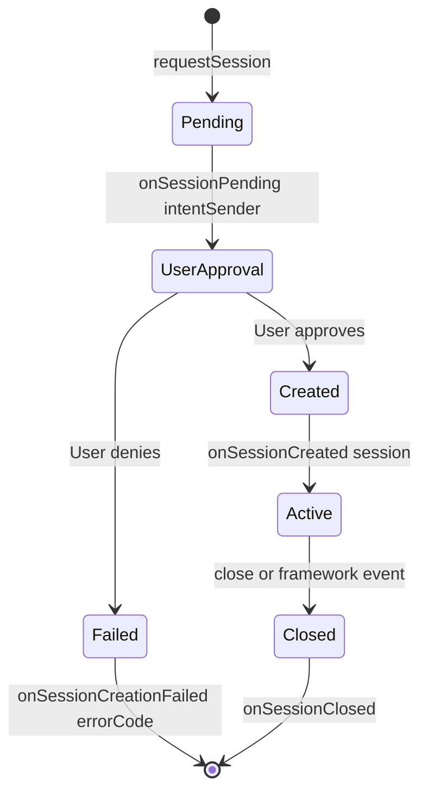
```mermaid
stateDiagram-v2
    [*] --> Pending: requestSession
    Pending --> UserApproval: onSessionPending intentSender
    UserApproval --> Created: User approves
    UserApproval --> Failed: User denies
    Created --> Active: onSessionCreated session
    Active --> Closed: close or framework event
    Failed --> [*]: onSessionCreationFailed errorCode
    Closed --> [*]: onSessionClosed
```

Error codes for session creation:

```java
// frameworks/base/core/java/android/companion/virtual/computercontrol/ComputerControlSession.java

public static final int ERROR_SESSION_LIMIT_REACHED = 1;
public static final int ERROR_DEVICE_LOCKED = 2;
public static final int ERROR_PERMISSION_DENIED = 3;
```

### 50.3.3 The Core Session API

Once created, `ComputerControlSession` exposes a high-level input API:

```java
// frameworks/base/core/java/android/companion/virtual/computercontrol/ComputerControlSession.java

// Launch an app
public void launchApplication(@NonNull String packageName);
public void launchApplication(@NonNull ComponentName component);

// Hand over to user
public void handOverApplications();

// Screenshot
@Nullable public Image getScreenshot();

// Gesture-level input (no public low-level send*Event in Android 17)
public void tap(int x, int y);
public void swipe(int fromX, int fromY, int toX, int toY, ...);
public void longPress(int x, int y);
public void insertText(@NonNull String text, boolean replaceExisting, boolean commit);
public void performAction(@Action int actionCode);

// Mirror display
@Nullable public InteractiveMirror createInteractiveMirror(
        IResultReceiver a11yEmbeddedConnectionReceiver);

// UI stability
public void setStabilityListener(
        @NonNull Duration duration, @NonNull Executor executor,
        @NonNull StabilityListener listener);
public void clearStabilityListener();
```

Note that in Android 17 the platform session no longer exposes public
low-level `sendKeyEvent` / `sendTouchEvent` methods: agents drive the UI through
the gesture API (`tap`, `swipe`, `longPress`, `performAction`) and `insertText`,
and the session translates these to the underlying `VirtualTouchscreen` /
`VirtualDpad`.

Screenshots are captured through an `ImageReader` that is attached to the
virtual display surface:

```java
// frameworks/base/core/java/android/companion/virtual/computercontrol/ComputerControlSession.java

mImageReader = ImageReader.newInstance(displayInfo.logicalWidth,
        displayInfo.logicalHeight, PixelFormat.RGBA_8888, /* maxImages= */ 2);
displayManagerGlobal.setVirtualDisplaySurface(displayToken, mImageReader.getSurface());

public Image getScreenshot() {
    synchronized (mLock) {
        return mImageReader == null ? null : mImageReader.acquireLatestImage();
    }
}
```

### 50.3.4 Session Parameters

`ComputerControlSessionParams` configures the virtual display:

```java
// frameworks/base/core/java/android/companion/virtual/computercontrol/ComputerControlSessionParams.java

public final class ComputerControlSessionParams implements Parcelable {
    private final String mName;
    private final List<String> mTargetPackageNames;
    private final int mDisplayWidthPx;
    private final int mDisplayHeightPx;
    private final int mDisplayDpi;
    private final Surface mDisplaySurface;
    private final boolean mIsDisplayAlwaysUnlocked;
```

The `targetPackageNames` field restricts which apps can be launched in the
session. Each package must have a valid launcher intent and cannot be the
device permission controller.

### 50.3.5 Interactive Mirror

The `InteractiveMirror` (created via `ComputerControlSession.createInteractiveMirror`)
mirrors the session's virtual display onto a caller-supplied `Surface` and
allows a human user to observe and interact simultaneously:

```java
// frameworks/base/core/java/android/companion/virtual/computercontrol/InteractiveMirror.java

public final class InteractiveMirror implements AutoCloseable {
    public void setInteractive(boolean interactive);
    public void resize(int width, int height);
    public void updateInsets(@Nullable Insets insets);
    public void close();
}
```

This enables a "co-pilot" pattern where an AI agent drives the automation
while a human watches and, when `setInteractive(true)`, can intervene.

### 50.3.6 UI Stability Detection

Knowing when an app's UI has "settled" is critical for AI agents that need
to screenshot and analyze before acting. The `StabilityListener` interface
provides this signal:

```java
// frameworks/base/core/java/android/companion/virtual/computercontrol/ComputerControlSession.java

public interface StabilityListener {
    void onSessionStable();
    default void onSessionUnstable(@UnstableReason int reason) {}
}
```

The platform `ComputerControlAccessibilityProxy` (50.3.27) watches accessibility
events and a first-frame signal to decide when the display content has settled,
then invokes the registered `StabilityListener`.

### 50.3.7 Accessibility Integration

The platform `ComputerControlSession` owns a
`ComputerControlAccessibilityProxy`, which extends `AccessibilityDisplayProxy`
and is registered for the session's virtual display, letting the agent query
the accessibility tree:

```java
// frameworks/base/core/java/android/companion/virtual/computercontrol/ComputerControlAccessibilityProxy.java

final class ComputerControlAccessibilityProxy extends AccessibilityDisplayProxy {
    // registered for the session's virtual display
}
```

This gives the agent structured information about the UI (view hierarchy,
content descriptions, bounding boxes) without relying solely on pixel-level
screenshot analysis, and it doubles as the source of the stability signal
(50.3.27).

### 50.3.8 Automated Package Listener

Launcher apps can register to be notified when apps are being automated:

```java
// frameworks/base/libs/computercontrol/.../ComputerControlExtensions.java

public void registerAutomatedPackageListener(
        @NonNull Context context,
        @NonNull @CallbackExecutor Executor executor,
        @NonNull AutomatedPackageListener listener) {
    VirtualDeviceManager vdm = context.getSystemService(VirtualDeviceManager.class);
    vdm.registerAutomatedPackageListener(executor, platformListener);
}
```

This allows the launcher to display an indicator that an app is currently
under AI control.

### 50.3.9 Integration with VirtualDeviceManager

Computer Control builds on top of the VirtualDeviceManager framework
(Chapter 51). The relationship is:

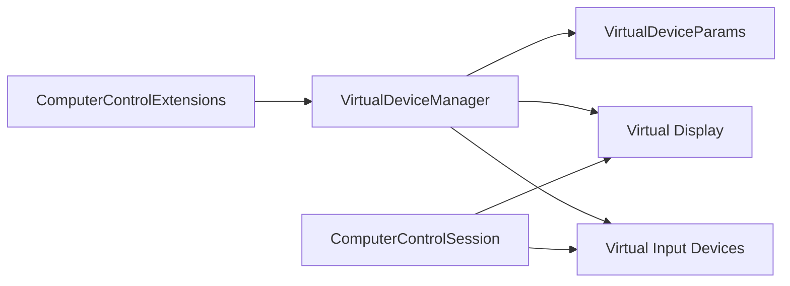
```mermaid
graph LR
    CCE[ComputerControlExtensions] --> VDM[VirtualDeviceManager]
    VDM --> VDD[VirtualDeviceParams]
    VDM --> VDisplay[Virtual Display]
    VDM --> VInput[Virtual Input Devices]
    CCS[ComputerControlSession] --> VDisplay
    CCS --> VInput
```

The key difference from general VirtualDevice usage is that Computer Control
sessions create a **trusted** virtual display with input injection
capabilities. The system server enforces that only the session owner can
inject input events.

### 50.3.10 Extension-Layer Action API

In Android 17 the extension library exposes a high-level, gesture-oriented API
rather than low-level event wrappers. The earlier `TouchEvent` / `KeyEvent`
wrapper classes and a `sendTouchEvent` path are gone; an agent works in screen
coordinates and lets the extension translate to platform input:

```java
// frameworks/base/libs/computercontrol/.../ComputerControlSession.java

public void tap(int x, int y);
public void swipe(int fromX, int fromY, int toX, int toY, ...);
public void longPress(int x, int y);
public void performAction(@Action int actionCode);  // e.g. BACK, HOME, RECENTS
```

Each call forwards to the platform `ComputerControlSession`, which routes the
gesture to the session's `VirtualTouchscreen` or `VirtualDpad` and resets the
stability state so the agent's `StabilityListener` can detect when the UI has
re-settled (50.3.27).

### 50.3.11 Text Insertion API

For text fields, the extension session provides a high-level `insertText()`
that avoids the complexity of individual key events:

```java
// frameworks/base/libs/computercontrol/.../ComputerControlSession.java

public void insertText(@NonNull String text, boolean replaceExisting, boolean commit);
```

On the server side this prefers the `InputConnection` path (50.3.29) to
manipulate the focused text field directly. The `commit` parameter triggers an
IME action (like pressing "Done" or "Send"); `replaceExisting` clears the
field's current contents before inserting.

### 50.3.12 Screenshots and the Perceive-Act Loop

Beyond input, the extension session exposes `getScreenshot()`, returning an
`Image` captured from the trusted virtual display:

```java
// frameworks/base/libs/computercontrol/.../ComputerControlSession.java

public Image getScreenshot();
```

Together with the accessibility tree (50.3.7) and the stability signal
(50.3.27), this completes the perceive-act loop: an agent screenshots, reasons
about the pixels (and/or the accessibility nodes), acts via `tap`/`swipe`/
`insertText`, waits for `onSessionStable()`, then screenshots again.

### 50.3.13 Interactive Mirror and Co-Pilot Pattern

In Android 17 the extension-layer `ComputerControlSession` returns the platform
`InteractiveMirror` directly rather than wrapping it in a separate type, and the
extension library ships a `MirrorView` (a `FrameLayout`) that hosts the mirror
inside an agent's own UI:

```java
// frameworks/base/libs/computercontrol/.../ComputerControlSession.java

public InteractiveMirror createInteractiveMirror(
        AccessibilityEmbeddedConnectionReceiver a11yEmbeddedConnectionReceiver) {
    return mSession.createInteractiveMirror(a11yEmbeddedConnectionReceiver);
}
```

The `MirrorView` (`frameworks/base/libs/computercontrol/.../view/MirrorView.java`)
may only be attached to secure, trusted displays.

This enables several important use cases:

1. **Debugging**: Developers can watch AI automation in real-time
2. **Human-in-the-loop**: A user can observe the AI's actions and intervene
3. **Streaming**: The mirror can be used to broadcast automation sessions
4. **Multi-agent**: One agent controls, another observes via the mirror

### 50.3.14 Session Close and Resource Cleanup

```java
// frameworks/base/libs/computercontrol/.../ComputerControlSession.java

@Override
public void close() {
    synchronized (mIsValid) {
        if (!mIsValid.get()) {
            return;
        }
        mAccessibilityManager.unregisterDisplayProxy(mAccessibilityProxy);
        mSession.close();
        mIsValid.set(false);
    }
}
```

Close is idempotent (protected by `AtomicBoolean mIsValid`) and properly
unregisters the accessibility proxy before closing the platform session.

### 50.3.15 Stability Detection Architecture

In Android 17 stability detection lives in the platform
`ComputerControlAccessibilityProxy`, driven by a `StabilitySignalTracker`. The
flow is:

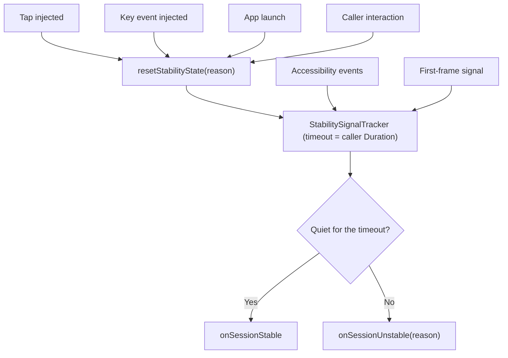
```mermaid
graph TB
    A[Tap injected] --> B["resetStabilityState(reason)"]
    C[Key event injected] --> B
    D[App launch] --> B
    E[Caller interaction] --> B
    B --> T["StabilitySignalTracker (timeout = caller Duration)"]

    F[Accessibility events] --> T
    G[First-frame signal] --> T

    T --> J{Quiet for the timeout?}
    J -->|Yes| K["onSessionStable"]
    J -->|No| L["onSessionUnstable(reason)"]
```

The agent registers a `StabilityListener` with a chosen timeout `Duration`; the
tracker fires `onSessionStable()` once accessibility events and first-frame
signals stay quiet for that long, and reports `onSessionUnstable(reason)` while
the screen is still churning (50.3.27).

### 50.3.16 Extension Library File Inventory (Android 17)

The extension library was slimmed down in Android 17; the low-level input
wrappers and the separate idle/stability trackers were removed in favor of the
platform stability proxy and a gesture-level API:

| File | Purpose |
|------|---------|
| `ComputerControlExtensions.java` | Entry point, session factory, automated-package listener registration |
| `ComputerControlSession.java` | Extension session wrapper (gesture API, screenshots, accessibility, stability) |
| `AutomatedPackageListener.java` | Package automation notifications |
| `view/MirrorView.java` | Mirror display view widget (secure/trusted displays only) |

### 50.3.17 Permission Model

Computer Control uses a layered permission model:

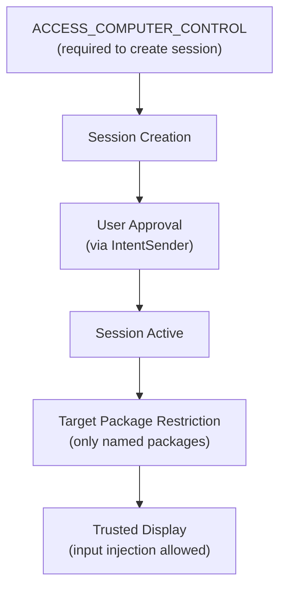
```mermaid
graph TD
    A["ACCESS_COMPUTER_CONTROL<br/>(required to create session)"] --> B[Session Creation]
    B --> C["User Approval<br/>(via IntentSender)"]
    C --> D["Session Active"]
    D --> E["Target Package Restriction<br/>(only named packages)"]
    E --> F["Trusted Display<br/>(input injection allowed)"]
```

1. The app must hold `ACCESS_COMPUTER_CONTROL`
2. The system presents a user approval dialog via `IntentSender`
3. Only packages listed in `targetPackageNames` can be launched
4. The virtual display is trusted, enabling input injection
5. The permission controller package is always excluded from automation

### 50.3.18 System-Server Implementation Overview

The extension library described in subsections 50.3.1–50.3.16 is the
**agent-side** API: the client an agent app links and calls. The
**system-server side** of Computer Control lives in a sibling package inside
the VirtualDeviceManager (VDM) service tree and contains the actual session
state, the policy gates, the binder objects the extension stubs talk to, and
the integration with the input, display, and accessibility stacks.

**Source tree:**

```
frameworks/base/services/companion/java/com/android/server/companion/virtual/computercontrol/
    ComputerControlSessionProcessor.java          -- Session creation and policy gate
    ComputerControlSessionImpl.java               -- Core session binder
    ComputerControlAllowlistController.java        -- Per-session package allowlist policy
    InteractiveMirrorImpl.java                    -- Mirror display + virtual touchscreen
    AutomatedPackagesRepository.java              -- Tracks automated packages for launchers
    ComputerControlDataStore.java                 -- Persisted session/consent state
    SessionLifecycle.java                         -- Session lifecycle state machine
    ComputerControlStatsController.java           -- Metrics
```

In Android 17 UI-stability detection moved out of a dedicated server-side
calculator and into the agent-side `ComputerControlAccessibilityProxy`, which
tracks accessibility events and fires the session's `StabilityListener`
(50.3.6). The diagram below shows how the extension-side session relates to its
system-server counterparts.

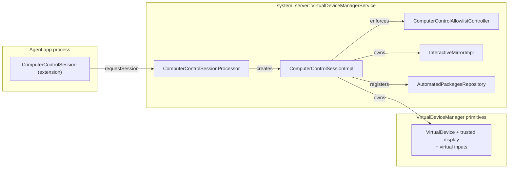
```mermaid
graph LR
    subgraph Agent["Agent app process"]
        EXT["ComputerControlSession (extension)"]
    end
    subgraph SS["system_server: VirtualDeviceManagerService"]
        SP["ComputerControlSessionProcessor"]
        IMPL["ComputerControlSessionImpl"]
        ALLOW["ComputerControlAllowlistController"]
        MIRROR["InteractiveMirrorImpl"]
        APR["AutomatedPackagesRepository"]
    end
    subgraph VDM["VirtualDeviceManager primitives"]
        VD["VirtualDevice + trusted display<br/>+ virtual inputs"]
    end
    EXT -- "requestSession" --> SP
    SP -- "creates" --> IMPL
    IMPL -- "owns" --> VD
    IMPL -- "enforces" --> ALLOW
    IMPL -- "owns" --> MIRROR
    IMPL -- "registers" --> APR
```

The package sits inside `services/companion/`, not inside `services/core/`,
because Computer Control is part of the VDM subsystem. Chapter 51 walks the
general VDM machinery — VirtualDevice creation, virtual display surfaces,
virtual input dispatch — that Computer Control composes on top of.

### 50.3.19 ComputerControlSessionProcessor: Session Creation and Limits

`ComputerControlSessionProcessor` owns the entry-point logic for creating
sessions. The policy flow runs in this order — note that AppOps short-
circuits the rest when it returns `MODE_ALLOWED`:

1. **AppOps consent check.** The processor calls
   `noteOpNoThrow(OP_COMPUTER_CONTROL, request.attributionSource(), ...)`
   (`frameworks/base/services/companion/java/com/android/server/companion/virtual/computercontrol/ComputerControlSessionProcessor.java`).
   If the result is `MODE_ALLOWED` — meaning the user previously chose
   "Always Allow" for this agent package — the processor proceeds directly
   to session creation, bypassing the precondition checks and the consent
   dialog. Any other mode means consent is required, and the flow
   continues.
2. **Device-locked gate.** The processor checks the keyguard first. If the
   device is locked, it rejects with `ERROR_DEVICE_LOCKED` and the flow ends.
3. **Concurrent-session cap.** The constant `MAXIMUM_CONCURRENT_SESSIONS`
   (`ComputerControlSessionProcessor.java`, currently `1` in Android 17) bounds
   how many Computer Control sessions can be live system-wide at once.
   Exceeding it returns `ERROR_SESSION_LIMIT_REACHED`.
4. **Consent dialog.** If preconditions pass and consent is required, the
   processor launches `RequestComputerControlAccessActivity` via an
   `IntentSender` returned to the agent.

The class header documents the role explicitly: *"This class enforces session
creation policies, such as limiting the number of concurrent..."*
(`ComputerControlSessionProcessor.java`).

Once the policy flow completes successfully, the processor allocates the
underlying `VirtualDevice`,
the trusted `VirtualDisplay`, and the session's virtual input devices, then
constructs a `ComputerControlSessionImpl` and hands its binder back to the
caller through the original `ComputerControlSession.Callback`.

The session limit is global, not per-agent. In Android 17 it is `1`, so the
framework admits a single Computer Control session at a time. The limit is a
defensive bound, not a tuning knob — hitting it indicates either an agent-side
leak (failure to close sessions) or a second agent racing for control that the
system declines to admit without a deliberate policy change.

### 50.3.20 ComputerControlSessionImpl: The Session Binder

`ComputerControlSessionImpl` is the actual binder object that backs
`IComputerControlSession.aidl`
(`frameworks/base/services/companion/java/com/android/server/companion/virtual/computercontrol/ComputerControlSessionImpl.java`).
It is the largest single file in the Computer Control system-server package,
but its size is dominated by input routing, parameter validation, and
lifecycle teardown — not by business logic.

Its responsibilities, ordered by lifecycle:

- **Construction.** Receives the trusted `VirtualDevice`, the `VirtualDisplay`,
  the session's virtual input devices, the calling agent's `AttributionSource`,
  and the requested `targetPackageNames` allowlist from the processor.
- **Input dispatch.** Implements `tap`, `swipe`, `longPress`, `insertText`, and
  `performAction` by routing to the appropriate virtual input device or to
  the IME-integration path (50.3.29).
- **Screenshot.** Implements `getScreenshot()` via the trusted display's
  surface-capture path; the trusted flag is what makes capture permissible
  without holding `READ_FRAME_BUFFER`.
- **Application launch.** Implements `launchApplication(packageName)` after
  checking the package against the session's allowlist; rejected launches
  surface as `NotifyComputerControlBlockedActivity` (50.3.24).
- **Stability.** Every input dispatch and app launch resets the session's
  stability state; the stability signal itself is computed agent-side by
  `ComputerControlAccessibilityProxy` (50.3.27).
- **Mirror display.** Optionally owns an `InteractiveMirrorImpl` when
  the session requested a live view (50.3.5).
- **Lifecycle teardown.** Calls `Binder.linkToDeath()` on the agent's callback
  so an agent process crash auto-closes the session, releases the
  VirtualDevice, and clears the session's row in the
  `AutomatedPackagesRepository`.

The binder-on-binder structure — agent holds an `IComputerControlSession`
stub, system server holds an `IComputerControlSessionCallback` stub — is the
standard AOSP pattern; the death-link runs both ways so neither side can
hold the other's resources after a process exit.

### 50.3.21 Virtual Input Devices: Product IDs and Trusted Display

In Android 17 a Computer Control session owns two virtual input devices, each
constructed with a fixed product ID in a Computer-Control-reserved product-ID
range so the input system can distinguish them from physical inputs and from
other virtual-display sessions:

| Device | Product ID | Constant | Purpose |
|--------|-----------|----------|---------|
| Virtual D-pad | `0xCC01` | `PRODUCT_ID_DPAD` | Key events (directional and character keys) |
| Virtual touchscreen | `0xCC03` | `PRODUCT_ID_TOUCHSCREEN` | Tap, swipe, long-press gestures |

The constants are declared in `ComputerControlSessionImpl` (with a fixed
`VENDOR_ID` of `0x0000`). Note there is no separate virtual keyboard device:
key events flow through the `VirtualDpad` (`sendKeyEvent`), and rich text entry
routes through the IME integration path (50.3.29). The `0xCC` prefix carves out
a Computer-Control-reserved block inside the broader VDM virtual-input
product-ID space; see Chapter 51 for the generic `VirtualInputDevice` scheme
that hosts Computer Control's inputs.

The session's display is a **trusted** `VirtualDisplay`. The trust flag has
three observable consequences that distinguish it from a stock virtual
display:

1. **Animations disabled.** System and app animations are suppressed on this
   display so the agent's per-action stability detection does not have to wait
   for animation completion before reading the next state.
2. **IME hidden.** Soft keyboards do not auto-show on the display; text input
   either uses `VirtualDpad` key events or routes through the IME
   integration path in 50.3.29.
3. **Focus-stealing disabled.** Child windows on the display cannot steal
   focus from the agent's target activity, so a pop-up cannot redirect the
   agent's subsequent inputs to an unrelated surface.

Together these turn the display into a deterministic surface the agent can
drive without the user's UX-pleasantness layer adding noise.

### 50.3.22 Session Creation Flow End-to-End

This is what happens from the agent's `requestSession()` call to a
ready-to-drive session.

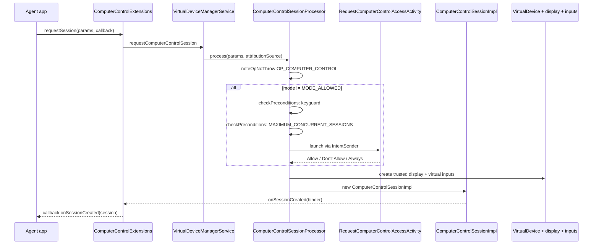
```mermaid
sequenceDiagram
    participant Agent as Agent app
    participant Ext as ComputerControlExtensions
    participant VDMS as VirtualDeviceManagerService
    participant SP as ComputerControlSessionProcessor
    participant Consent as RequestComputerControlAccessActivity
    participant Impl as ComputerControlSessionImpl
    participant VD as VirtualDevice + display + inputs

    Agent->>Ext: requestSession(params, callback)
    Ext->>VDMS: requestComputerControlSession
    VDMS->>SP: process(params, attributionSource)
    SP->>SP: noteOpNoThrow OP_COMPUTER_CONTROL
    alt mode != MODE_ALLOWED
        SP->>SP: checkPreconditions: keyguard
        SP->>SP: checkPreconditions: MAXIMUM_CONCURRENT_SESSIONS
        SP->>Consent: launch via IntentSender
        Consent-->>SP: Allow / Don't Allow / Always
    end
    SP->>VD: create trusted display + virtual inputs
    SP->>Impl: new ComputerControlSessionImpl
    Impl-->>Ext: onSessionCreated(binder)
    Ext-->>Agent: callback.onSessionCreated(session)
```

The consent step is conditional: an agent that has been granted **Always
Allow** in a prior session skips the dialog because the AppOps record carries
that decision forward. The AppOps record is per-package and per-user, so
revoking via Settings sends the next request back through the dialog path
without the agent noticing on the request itself — the agent simply observes
the dialog appear or not.

Once `onSessionCreated` fires, the agent owns a binder it can call repeatedly
without round-tripping through the processor. Each input call goes
agent → `ComputerControlSessionImpl` directly; the processor is only
consulted at session creation.

### 50.3.23 Error Codes and Session Constraints

Session creation returns one of three error codes when it fails. The
constants live in the public extension API at
`frameworks/base/core/java/android/companion/virtual/computercontrol/ComputerControlSession.java`:

| Code | Value | Condition |
|------|-------|-----------|
| `ERROR_SESSION_LIMIT_REACHED` | 1 | Too many active Computer Control sessions system-wide |
| `ERROR_DEVICE_LOCKED` | 2 | Keyguard is up at session-creation time |
| `ERROR_PERMISSION_DENIED` | 3 | Per-session consent denied by the user |

These are defined alongside `ERROR_UNKNOWN` (0) in `ComputerControlSession.java`.

The three errors map cleanly to the three policy checks in
`ComputerControlSessionProcessor` (50.3.19): one error per policy. An agent
implementing robust retry logic distinguishes them by behavior:

- `ERROR_SESSION_LIMIT_REACHED` is transient — wait and retry.
- `ERROR_DEVICE_LOCKED` is user-blocked — prompt the user to unlock; retry
  on screen-on.
- `ERROR_PERMISSION_DENIED` is durable for the request — escalate to the user
  through the agent's own UX before requesting again, and consider that
  re-requesting too aggressively will surface to the user as harassment.

The device-locked gate is checked at creation, not maintained for the session
lifetime. An agent with a session open before the screen locks keeps the
session; the agent simply cannot perform actions on the locked screen until
unlock. Tearing the session down on lock would race with foreground-app
behavior and break agents that legitimately span a brief screen-off.

### 50.3.24 The Consent Activity Flow

The per-session consent dialog is `RequestComputerControlAccessActivity`
(`frameworks/base/packages/VirtualDeviceManager/src/com/android/virtualdevicemanager/RequestComputerControlAccessActivity.java`).
It is a platform-signed activity inside the VDM platform package that the
agent cannot launch directly; it is launched only via the `IntentSender`
returned by the processor when consent is missing.

The dialog presents three choices:

- **Allow** — grant consent for the duration of this session only. AppOps
  records the grant scoped to the session.
- **Don't Allow** — deny. Processor returns `ERROR_PERMISSION_DENIED` to the
  caller.
- **Always Allow** — record a persistent AppOps grant for the agent package.
  Future `requestSession()` calls from the same package skip the dialog
  entirely.

The activity carries `android:filterTouchesWhenObscured="true"` — the same
anti-tapjacking flag used by `RequestPermissionActivity` — so that an overlay
window cannot pass touches through to the consent buttons. This matters
because a Computer Control consent grant is particularly attractive to a
tapjacking adversary: a successful grant gives the adversary's agent the
ability to drive the user's other apps from inside a sanctioned session.

When Computer Control blocks an action mid-session — for example, a `launchApplication()`
call for a package not in the session's `targetPackageNames` — the system
surfaces `NotifyComputerControlBlockedActivity`
(`frameworks/base/packages/VirtualDeviceManager/src/com/android/virtualdevicemanager/NotifyComputerControlBlockedActivity.java`)
to make the block visible to the user rather than silently dropping the
action. Silent drops would leave the user wondering why the agent stopped
responding; the visible block tells both user and agent which boundary was
hit.

### 50.3.25 AppOps and Per-Session Tracking

Computer Control uses the AppOps system to track per-package consent state.
The relevant op is `OP_COMPUTER_CONTROL` in
`frameworks/base/core/java/android/app/AppOpsManager.java`, defined alongside
its op string `OPSTR_COMPUTER_CONTROL` and tied to the
`ACCESS_COMPUTER_CONTROL` permission:

```java
public static final int OP_COMPUTER_CONTROL = AppOpEnums.APP_OP_COMPUTER_CONTROL;
```

AppOps records grants with a mode (`MODE_ALLOWED`, `MODE_IGNORED`,
`MODE_ERRORED`, `MODE_DEFAULT`) scoped by package + attribution. Each
session creation calls
`noteOpNoThrow(OP_COMPUTER_CONTROL, request.attributionSource(), ...)`
in `ComputerControlSessionProcessor`. The result determines the
next step: `MODE_ALLOWED` short-circuits straight to session creation
(skipping both preconditions and the consent dialog); any other mode means
the processor advances to the keyguard and concurrent-cap precondition
checks, and on success launches the consent activity. The no-throw variant
returns the mode as an int instead of throwing `SecurityException`, which
is the right shape for a router that branches on the result rather than
bailing out.

This is the same machinery used for sensitive ops like `OP_CAMERA`,
`OP_RECORD_AUDIO`, and `OP_FINE_LOCATION`. Treating Computer Control as an
AppOp rather than a one-shot permission has two implications worth pulling
out:

- **Revocability.** A user can revoke Computer Control for a specific agent
  in Settings without uninstalling the agent. Subsequent `requestSession()`
  calls from that agent route back through the dialog.
- **Auditability.** AppOps records every `noteOp` invocation, so a privacy
  dashboard can show which agents have requested Computer Control and when,
  even after the sessions have ended.

The matching permission `android.permission.ACCESS_COMPUTER_CONTROL`
(`frameworks/base/core/res/AndroidManifest.xml`) has protection level
`internal|privileged` and is itself gated by the
`android.companion.virtualdevice.flags.computer_control_access` feature flag,
meaning only privileged (preinstalled) agents can *request* a Computer Control
session in the first place. The AppOps layer adds the per-grant user-facing
control on top of that platform-level gate; the two together implement defense
in depth: a non-privileged third-party app cannot even ask, and a privileged
agent cannot grant itself.

### 50.3.26 Anti-Tampering Mechanisms

The threat model around Computer Control assumes a malicious app could
attempt to (a) trick a user into granting Computer Control consent, (b)
hijack an already-granted session, or (c) ride a granted session into apps
the user did not intend to expose. The framework defends each with a
distinct mechanism:

1. **FilterTouches on consent activities.** Both
   `RequestComputerControlAccessActivity` and
   `NotifyComputerControlBlockedActivity` apply
   `android:filterTouchesWhenObscured="true"` so an overlay window cannot
   pass touches through to the consent buttons. This blocks the classic
   tapjacking attack against permission dialogs — the same pattern that
   surfaced through `SYSTEM_ALERT_WINDOW` abuse in earlier Android releases.
2. **Per-session package allowlist.** `ComputerControlAllowlistController`
   rejects an agent's `launchApplication(packageName)` unless `packageName`
   was declared in `targetPackageNames` at session creation. A Computer
   Control session that opened a messaging app cannot subsequently launch a
   banking app inside the same session.
3. **Visible blocked-launch notice.** When a launch is blocked, the system
   surfaces `NotifyComputerControlBlockedActivity` (50.3.24) rather than
   silently dropping the action, making the agent's blocked intent visible at
   the moment it would otherwise be invisible to the user.
4. **Binder death monitoring.** `ComputerControlSessionImpl` calls
   `Binder.linkToDeath()` on the agent's callback binder. If the agent
   process is killed — by oom-killer, by the user swiping it from Recents,
   by a crash — the system auto-closes the session and releases the
   `VirtualDevice`. This prevents a long-lived orphan session from
   continuing to drive the device after its operator has gone away.

The mechanisms compose. An attacker who somehow bypassed tapjacking
protection on the consent activity (mechanism 1) and obtained a session
would still be blocked by the activity allowlist (mechanism 2) from
expanding the session's reach; an attacker who got past both (mechanism 3)
would still surface a launch warning to the user; an attacker whose
implant process died would release the session immediately (mechanism 4).

### 50.3.27 Stability Detection via the Accessibility Proxy

In Android 17 stability detection is computed agent-side, not by a dedicated
server-side calculator. `ComputerControlAccessibilityProxy`
(`frameworks/base/core/java/android/companion/virtual/computercontrol/ComputerControlAccessibilityProxy.java`)
owns a `StabilitySignalTracker` that decides when the UI has *settled* after an
injected event and invokes the session's `StabilityListener`.

The decision is timeout-based. The agent registers a listener with a caller
chosen `Duration`:

```java
// frameworks/base/core/java/android/companion/virtual/computercontrol/ComputerControlSession.java

public interface StabilityListener {
    void onSessionStable();
    default void onSessionUnstable(@UnstableReason int reason) {}
}

public void setStabilityListener(
        @NonNull Duration duration, @NonNull Executor executor,
        @NonNull StabilityListener listener);
public void clearStabilityListener();
```

The tracker watches two streams of evidence: accessibility events flowing from
the controlled apps (`onAccessibilityEvent`) and a first-frame signal
(`onFirstFrameReceived`). Each input dispatch, app launch, or caller
interaction calls `resetStabilityState(reason)` with an `@UnstableReason`,
restarting the quiet period; when no further events arrive for the configured
`duration`, the tracker fires `onSessionStable()`. While the UI is churning it
reports `onSessionUnstable(reason)` so the agent knows *why* the screen is not
yet settled (for example, a caller interaction or an in-flight launch).

Because the timeout is caller-supplied rather than a fixed per-event-class
constant, an agent can tune it: short for snappy single-tap flows, longer for
cold-start app launches. The framework merely emits the signal; the agent
chooses whether to wait for `onSessionStable()` (for instance, before capturing
a post-action screenshot) or to proceed immediately.

### 50.3.28 AutomatedPackagesRepository and Launcher Indicators

`AutomatedPackagesRepository`
(`frameworks/base/services/companion/java/com/android/server/companion/virtual/computercontrol/AutomatedPackagesRepository.java`)
maintains the system-wide set of packages currently being driven by a
Computer Control session. It serves two consumers:

1. **Launchers** register an `IAutomatedPackageListener` to learn which
   app icons should display an "agent is driving this app" indicator.
   The indicator is a UI affordance, not a security boundary; it tells the
   user *which* app the agent is currently controlling at a glance.
2. **System UI** uses the same data to render the global "agent active"
   status icon and to route notifications about automated activity.

The repository fires `onAutomatedPackagesChanged(Set<String>)` whenever the
set transitions. Each `ComputerControlSessionImpl` registers its
allowlisted packages on session start and unregisters them on session close.
The repository reference-counts each package, so it only exits the "automated"
state when the last referring session closes — robust to a future increase in
`MAXIMUM_CONCURRENT_SESSIONS` above its current value of `1`.

This is the user-transparency contract the framework commits to. An
automated app is always visually distinguishable from a user-driven one,
even when the agent and user are interleaving control through the
interactive mirror (50.3.13). The user is never left guessing whether
something happening on screen was their tap or the agent's.

### 50.3.29 IME Integration: IRemoteComputerControlInputConnection

When the typing path is enabled, `insertText()` must route text into the
focused input field through the standard IME pipeline so that input
validation, autocorrect, password masking, and accessibility events all
fire the same way they would for a soft-keyboard tap. The mechanism is
`IRemoteComputerControlInputConnection.aidl`
(`frameworks/base/core/java/com/android/internal/inputmethod/IRemoteComputerControlInputConnection.aidl`).

The flow:

- The agent calls `ComputerControlSession.insertText(text, replaceExisting, commit)`.
- The call arrives at `ComputerControlSessionImpl` on the system-server side.
- The impl looks up the `IRemoteComputerControlInputConnection` for the
  session's display in
  `InputMethodManagerService.UserData.mComputerControlInputConnectionMap`
  (`frameworks/base/services/core/java/com/android/server/inputmethod/InputMethodManagerService.java`),
  keyed by the client's self-reported display ID.
- The remote connection wraps the focused window's `InputConnection` and
  forwards the text through `commitText()`, `setComposingText()`, and
  `deleteSurroundingText()` — the same methods a soft keyboard would use.
- The target app sees text arrive through its normal `InputConnection`
  callback, indistinguishable in shape from a soft-keyboard caller.

Keying the map by display ID matters because each Computer Control session
owns its own trusted display. In Android 17 `MAXIMUM_CONCURRENT_SESSIONS` is
`1`, so a single session is live at a time; the display ID still disambiguates
which session's text routes where and keeps the design ready for a larger cap.

When the `InputConnection` path is unavailable, `insertText()` falls back to
injecting key events via the `VirtualDpad` device. The fallback is
functional but loses the IME's text-shaping behavior — autocorrect does not
run, password fields are not masked at input time, and a target app that
filters input in `onTextChanged` sees character-at-a-time events rather than a
batched commit.

### 50.3.30 Feature Flag Set

Computer Control ships gated behind a set of aconfig flags in the
`virtual_devices` namespace
(`frameworks/base/core/java/android/companion/virtual/flags/flags.aconfig`).
They cleanly separate the rollout of independent features. In Android 17 the
flags are:

| Flag | Gates |
|------|-------|
| `computer_control_access` | Core feature: the `ACCESS_COMPUTER_CONTROL` permission and the session API |
| `computer_control_per_app_consent` | The per-app consent model for sessions (50.3.24) |
| `computer_control_role_assistant_requirement` | Requires the `ASSISTANT` role to create a session |
| `computer_control_managed_profiles` | Computer Control support inside managed (work) profiles |
| `computer_control_cross_device` | Cross-device Computer Control sessions |
| `computer_control_support_v5` | The Computer Control "v5" API surface |

A device can ship Computer Control's core surface (`computer_control_access`
on) without committing to every policy layer — useful for staged rollout, where
the per-app consent model and the assistant-role requirement land
incrementally. Conversely, a device can ship with all flags on for a full
posture from day one.

The flag set is also useful as a roadmap reading: a reader who finds Computer
Control at an unfamiliar stage of evolution can inspect which flags are on
(`adb shell device_config get virtual_devices <flag_name>`) to determine which
features the running device actually supports, independent of what the API
surface advertises.

### 50.3.31 Companion-Device-Subsystem Anchoring

Computer Control is implemented as a subsystem **of** VirtualDeviceManager,
not alongside it. Three architectural consequences follow:

1. **Code location.** The server-side classes live under
   `frameworks/base/services/companion/` (the VDM service tree), not under
   `frameworks/base/services/core/`. The package path embeds
   `virtual/computercontrol/` to make the subordination explicit at the
   filesystem level.
2. **Lifecycle owner.** `VirtualDeviceManagerService` owns the
   `ComputerControlSessionProcessor` instance and the
   `AutomatedPackagesRepository`. When VDM tears down — for example, when
   the last virtual device is released and VDM enters its idle path —
   Computer Control state tears down with it. Computer Control cannot
   outlive its parent.
3. **Reuse of VDM primitives.** Computer Control does not invent its own
   display, input, or surface-capture stack. It composes the existing VDM
   primitives (`VirtualDevice`, `VirtualDisplay`, `VirtualDpad`,
   `VirtualTouchscreen`) under a Computer-Control-specific session policy. The
   Computer Control additions are narrow: the trust-flag combination on the
   display, the fixed product IDs on the inputs (50.3.21), the session-scoped
   consent and AppOps tracking (50.3.24–50.3.25), and the
   accessibility-proxy stability detector (50.3.27).

Chapter 51 walks the general VDM machinery: how a `VirtualDevice` is
constructed and registered, how virtual displays surface into
WindowManager, how virtual input events dispatch through `InputDispatcher`,
and how the broader companion-device ecosystem (BLE associations, remote
device authentication) sits alongside VDM. A reader interested in *how*
the trusted `VirtualDisplay` is wired into WindowManager and *what*
WindowManager does differently on it should follow that cross-reference.
A reader interested in *why* Computer Control composes those primitives the
way it does, and what user-transparency contracts the composition enforces,
stays in this chapter.

### 50.3.32 Known Consumers

The first widely-shipped consumer of Computer Control is the **Gemini in
Android** assistant. The internal codename for the agent loop is **Bonobo**
(the log prefix `#bnb#` appears in app traces); the agent runs in the AGSA
process (`com.google.android.googlequicksearchbox`) and consumes the
AOSP-public Computer Control API documented in this chapter. AOSP itself
does not ship a Computer Control agent —
`frameworks/base/libs/computercontrol/` and the system-server package
described above are framework code, not application code. The agent is
GMS-side and is not part of this checkout, but its existence as the first
production Computer Control consumer is what shaped the API's current
surface.

Two patterns observable in the Gemini consumer are worth surfacing for any
new Computer Control agent:

- **Dual-path fallback with AppFunctions.** The agent declares two
  `<uses-library>` entries in its manifest:
  `com.android.extensions.appfunctions` and
  `com.android.extensions.computercontrol`. It prefers AppFunctions
  (the structured-API path of section 50.2) for apps that publish
  `AppFunctionService`-backed functions, and falls back to Computer Control
  for apps that don't. The same agent can drive both because the two
  frameworks compose at the SDK extension level: an agent links both,
  queries `AppFunctionManager` first, and uses Computer Control for the
  apps where the function discovery returns empty.
- **Live mirror as the user-trust surface.** The agent renders the
  `InteractiveMirror` (50.3.5) inside its chat UI so the user
  watches the actions in real time and can hand control back at any
  moment via the touch-forwarding path. This matches the framework's
  intent: Computer Control does not make the live view *optional*, it
  makes the absence of one the unusual case. An agent that runs Computer
  Control without a visible mirror is one the user is right to be
  suspicious of.

How the Bonobo agent loop composes with the Computer Control API
documented in this chapter. The agent itself is GMS-side; the framework
on the right is AOSP.

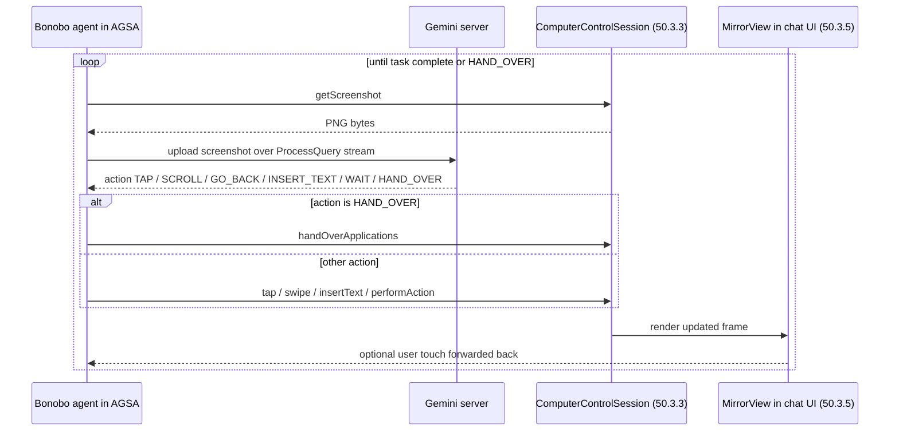
```mermaid
sequenceDiagram
    participant Bonobo as Bonobo agent in AGSA
    participant Server as Gemini server
    participant Session as ComputerControlSession (50.3.3)
    participant Mirror as MirrorView in chat UI (50.3.5)

    loop until task complete or HAND_OVER
        Bonobo->>Session: getScreenshot
        Session-->>Bonobo: PNG bytes
        Bonobo->>Server: upload screenshot over ProcessQuery stream
        Server-->>Bonobo: action TAP / SCROLL / GO_BACK / INSERT_TEXT / WAIT / HAND_OVER
        alt action is HAND_OVER
            Bonobo->>Session: handOverApplications
        else other action
            Bonobo->>Session: tap / swipe / insertText / performAction
        end
        Session->>Mirror: render updated frame
        Mirror-->>Bonobo: optional user touch forwarded back
    end
```

The loop terminates when the server responds with `HAND_OVER` or when the
user takes manual control via the mirror. The action vocabulary
(`TAP`, `SCROLL`, `GO_BACK`, `INSERT_TEXT`, `WAIT`, `HAND_OVER`) maps
one-to-one onto the `ComputerControlSession` methods documented in 50.3.3
and the navigation `performAction` codes — the agent does not synthesize
inputs the framework does not expose, and every action the framework
accepts can be issued by the agent. The bidirectional `ProcessQuery`
stream is the gRPC channel the agent uses to upload screenshots and
receive actions; that stream is GMS-side and not part of this checkout,
but its shape matters because it explains the **server-driven** nature of
the loop: the agent is a thin executor that asks the server what to do
next after every observation.

Beyond Gemini, Computer Control is shipping first on the highest-end Pixel
and Galaxy devices and broadening as the feature flags above ramp. New
consumers adopting Computer Control should expect the API surface to
remain stable along the lines described in this chapter while the policy
layer (which flags are on by default) continues to tighten.

---

## 50.4 OnDeviceIntelligence

The OnDeviceIntelligence (ODI) framework provides a system-level API for
running large ML models (including LLMs) in a sandboxed process. It is
designed around the principle that model weights and inference logic should
never be directly accessible to the calling app.

**Source tree:**

```
frameworks/base/packages/NeuralNetworks/
    framework/platform/java/android/app/ondeviceintelligence/
        OnDeviceIntelligenceManager.java        -- Client API
        Feature.java                            -- Model feature descriptor
        FeatureDetails.java                     -- Feature metadata
        InferenceInfo.java                      -- Inference statistics
        ProcessingCallback.java                 -- Non-streaming result callback
        StreamingProcessingCallback.java        -- Streaming result callback
        OnDeviceIntelligenceException.java      -- Typed errors
        TokenInfo.java                          -- Token-level information
        ...
    framework/platform/java/android/service/ondeviceintelligence/
        OnDeviceSandboxedInferenceService.java  -- Isolated inference service
        OnDeviceIntelligenceService.java        -- Non-isolated counterpart
        ...
    service/platform/java/com/android/server/ondeviceintelligence/
        OnDeviceIntelligenceManagerService.java -- SystemService
        RemoteOnDeviceSandboxedInferenceService.java
        RemoteOnDeviceIntelligenceService.java
        ServiceConnector.java
        InferenceInfoStore.java
        ...
```

### 50.4.1 Architecture

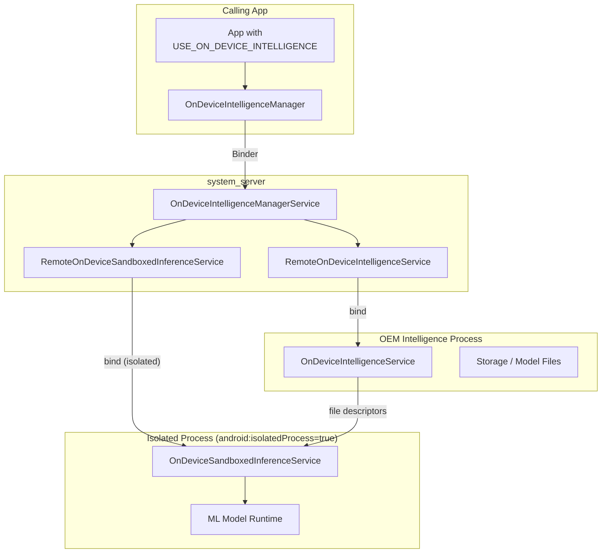
```mermaid
graph TB
    subgraph "Calling App"
        APP["App with<br/>USE_ON_DEVICE_INTELLIGENCE"]
        ODIM[OnDeviceIntelligenceManager]
    end

    subgraph "system_server"
        ODIMS[OnDeviceIntelligenceManagerService]
        RODI[RemoteOnDeviceIntelligenceService]
        RODSI[RemoteOnDeviceSandboxedInferenceService]
    end

    subgraph "OEM Intelligence Process"
        ODIS[OnDeviceIntelligenceService]
        STORAGE[Storage / Model Files]
    end

    subgraph "Isolated Process (android:isolatedProcess=true)"
        ODSIS[OnDeviceSandboxedInferenceService]
        MODEL[ML Model Runtime]
    end

    APP --> ODIM
    ODIM -- "Binder" --> ODIMS
    ODIMS --> RODI
    ODIMS --> RODSI
    RODI -- "bind" --> ODIS
    RODSI -- "bind (isolated)" --> ODSIS
    ODIS -- "file descriptors" --> ODSIS
    ODSIS --> MODEL
```

### 50.4.2 The Client: OnDeviceIntelligenceManager

The manager is a `@SystemApi` service requiring `USE_ON_DEVICE_INTELLIGENCE`:

```java
// frameworks/base/packages/NeuralNetworks/framework/platform/java/
//   android/app/ondeviceintelligence/OnDeviceIntelligenceManager.java

@SystemApi
@SystemService(Context.ON_DEVICE_INTELLIGENCE_SERVICE)
public final class OnDeviceIntelligenceManager {
```

Key operations:

| Method | Purpose |
|--------|---------|
| `getVersion()` | Query remote implementation version |
| `getRemoteServicePackageName()` | Get the OEM package providing inference |
| `listFeatures()` | List available ML features/models |
| `getFeature()` | Get details of a specific feature |
| `requestFeatureDownload()` | Trigger model download |
| `processRequest()` | Non-streaming inference request |
| `processRequestStreaming()` | Streaming (token-by-token) inference |
| `getTokenInfo()` | Token counting/analysis |
| `registerLifecycleListener()` | Model load/unload notifications |

### 50.4.3 The Sandboxed Inference Service

The actual inference runs in an isolated process:

```java
// frameworks/base/packages/NeuralNetworks/framework/platform/java/
//   android/service/ondeviceintelligence/OnDeviceSandboxedInferenceService.java

@SystemApi
public abstract class OnDeviceSandboxedInferenceService extends Service {
    public static final String SERVICE_INTERFACE =
            "android.service.ondeviceintelligence.OnDeviceSandboxedInferenceService";
```

The manifest declares:
```xml
<service android:name=".SampleSandboxedInferenceService"
         android:permission="android.permission.BIND_ONDEVICE_SANDBOXED_INFERENCE_SERVICE"
         android:isolatedProcess="true">
</service>
```

The `isolatedProcess="true"` flag means the service:

- Has no network access
- Has no access to the app's data directory
- Cannot access content providers
- Can only receive file descriptors passed explicitly by the system

Model weights reach the isolated process through `ParcelFileDescriptor`
objects passed by the `OnDeviceIntelligenceService` (the non-isolated
companion).

### 50.4.4 Dual-Service Architecture

ODI employs a two-service architecture:

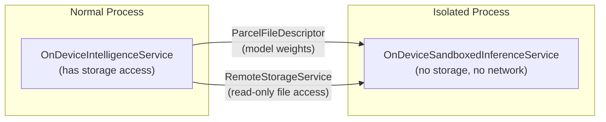
```mermaid
graph LR
    subgraph "Normal Process"
        ODIS["OnDeviceIntelligenceService<br/>(has storage access)"]
    end
    subgraph "Isolated Process"
        ODSIS["OnDeviceSandboxedInferenceService<br/>(no storage, no network)"]
    end
    ODIS -- "ParcelFileDescriptor<br/>(model weights)" --> ODSIS
    ODIS -- "RemoteStorageService<br/>(read-only file access)" --> ODSIS
```

1. **OnDeviceIntelligenceService** -- runs in the OEM's normal process with
   full storage access. Handles model management, downloads, and serves model
   files to the isolated process.

2. **OnDeviceSandboxedInferenceService** -- runs in an isolated process.
   Performs actual inference. Receives model weights only through file
   descriptors. This design ensures that even a compromised inference engine
   cannot exfiltrate model weights or user data.

### 50.4.5 Model Lifecycle Events

The framework supports model load/unload broadcast notifications:

```java
// OnDeviceSandboxedInferenceService.java

public static final String MODEL_LOADED_BROADCAST_INTENT =
    "android.service.ondeviceintelligence.MODEL_LOADED";
public static final String MODEL_UNLOADED_BROADCAST_INTENT =
    "android.service.ondeviceintelligence.MODEL_UNLOADED";
```

### 50.4.6 The System Service

`OnDeviceIntelligenceManagerService` extends `SystemService` and runs under
the SYSTEM user (not per-user), since ML models may have high memory
footprint:

```java
// frameworks/base/packages/NeuralNetworks/service/platform/java/
//   com/android/server/ondeviceintelligence/OnDeviceIntelligenceManagerService.java

public class OnDeviceIntelligenceManagerService extends SystemService {
    private static final String NAMESPACE_ON_DEVICE_INTELLIGENCE = "ondeviceintelligence";
    private static final long MAX_AGE_MS = TimeUnit.HOURS.toMillis(3);
    ...
```

The service maintains connection state to both remote services and handles:

- Permission enforcement (only apps with `USE_ON_DEVICE_INTELLIGENCE`)
- Configuration via `DeviceConfig` namespace `ondeviceintelligence`
- `InferenceInfoStore` for tracking inference statistics
- Temporary service overrides for testing

### 50.4.7 InferenceInfo

The framework introduces `InferenceInfo` for providing performance metadata:

```java
// OnDeviceIntelligenceManager.java

public static final String KEY_REQUEST_INFERENCE_INFO = "request_inference_info";
```

When requested, the callback receives `InferenceInfo` containing timing and
throughput metrics from the inference run.

### 50.4.8 Feature Discovery and Download

The feature lifecycle follows a discover-download-use pattern:

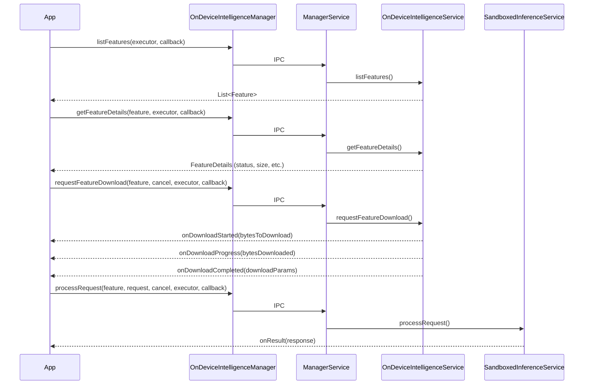
```mermaid
sequenceDiagram
    participant App
    participant Manager as OnDeviceIntelligenceManager
    participant Service as ManagerService
    participant OEM as OnDeviceIntelligenceService
    participant Sandbox as SandboxedInferenceService

    App->>Manager: listFeatures(executor, callback)
    Manager->>Service: IPC
    Service->>OEM: listFeatures()
    OEM-->>App: List<Feature>

    App->>Manager: getFeatureDetails(feature, executor, callback)
    Manager->>Service: IPC
    Service->>OEM: getFeatureDetails()
    OEM-->>App: FeatureDetails (status, size, etc.)

    App->>Manager: requestFeatureDownload(feature, cancel, executor, callback)
    Manager->>Service: IPC
    Service->>OEM: requestFeatureDownload()
    OEM-->>App: onDownloadStarted(bytesToDownload)
    OEM-->>App: onDownloadProgress(bytesDownloaded)
    OEM-->>App: onDownloadCompleted(downloadParams)

    App->>Manager: processRequest(feature, request, cancel, executor, callback)
    Manager->>Service: IPC
    Service->>Sandbox: processRequest()
    Sandbox-->>App: onResult(response)
```

The `DownloadCallback` interface provides fine-grained progress:

```java
// OnDeviceIntelligenceManager.java

public void requestFeatureDownload(@NonNull Feature feature,
        @Nullable CancellationSignal cancellationSignal,
        @NonNull @CallbackExecutor Executor callbackExecutor,
        @NonNull DownloadCallback callback) {
```

Download failure reasons include:

- `DOWNLOAD_FAILURE_STATUS_DOWNLOADING` -- Already downloading
- `DOWNLOAD_FAILURE_STATUS_NOT_ENOUGH_DISK_SPACE`
- `DOWNLOAD_FAILURE_STATUS_NETWORK_FAILURE`

### 50.4.9 Processing Modes

ODI supports two processing modes:

**Non-streaming (request/response):**

```java
@RequiresPermission(Manifest.permission.USE_ON_DEVICE_INTELLIGENCE)
public void processRequest(@NonNull Feature feature,
        @NonNull @InferenceParams Bundle request,
        @Nullable CancellationSignal cancellationSignal,
        @NonNull @CallbackExecutor Executor callbackExecutor,
        @NonNull ProcessingCallback callback);
```

**Streaming (token-by-token):**

```java
@RequiresPermission(Manifest.permission.USE_ON_DEVICE_INTELLIGENCE)
public void processRequestStreaming(@NonNull Feature feature,
        @NonNull @InferenceParams Bundle request,
        @Nullable CancellationSignal cancellationSignal,
        @NonNull @CallbackExecutor Executor callbackExecutor,
        @NonNull StreamingProcessingCallback callback);
```

The streaming mode is essential for LLM inference, where generating a full
response may take seconds but individual tokens arrive much faster.

### 50.4.10 Token Information

The `requestTokenInfo()` API computes token-level metadata without performing
full inference:

```java
@RequiresPermission(Manifest.permission.USE_ON_DEVICE_INTELLIGENCE)
public void requestTokenInfo(@NonNull Feature feature,
        @NonNull @InferenceParams Bundle request,
        @Nullable CancellationSignal cancellationSignal,
        @NonNull @CallbackExecutor Executor callbackExecutor,
        @NonNull OutcomeReceiver<TokenInfo, OnDeviceIntelligenceException> outcomeReceiver);
```

This is useful for:

- Counting tokens before inference (to check context limits)
- Estimating inference cost/time
- Token-level analysis without full generation

### 50.4.11 Lifecycle Listeners

Apps can register to be notified when models are loaded or unloaded:

```java
// OnDeviceIntelligenceManager.java

private final Map<OnDeviceSandboxedInferenceService.LifecycleListener,
        ILifecycleListener.Stub> mLifecycleListeners = new ConcurrentHashMap<>();
```

This allows apps to:

- Show loading indicators when a model is being loaded
- Adapt UI based on model availability
- Pre-warm by triggering model loading before the user needs it

### 50.4.12 Processing State Updates

The sandboxed service can update its processing state:

```java
// OnDeviceSandboxedInferenceService.java

public static final String PROCESSING_STATE_BUNDLE_KEY = "processing_state";
```

State updates allow the system to track:

- Whether the service is actively processing
- How much memory the model is using
- Whether the service is in a degraded state

### 50.4.13 Configuration and DeviceConfig

The system service is controlled through the `ondeviceintelligence`
DeviceConfig namespace:

```java
// OnDeviceIntelligenceManagerService.java

private static final String NAMESPACE_ON_DEVICE_INTELLIGENCE = "ondeviceintelligence";
private static final String KEY_SERVICE_ENABLED = "service_enabled";
private static final boolean DEFAULT_SERVICE_ENABLED = true;
```

OEMs configure the implementation package through system resources. The
service can be temporarily overridden for testing via shell commands.

### 50.4.14 Streaming Inference Protocol Detail

The streaming API delivers partial inference results incrementally, which suits LLM token-by-token output well but is not LLM-specific:

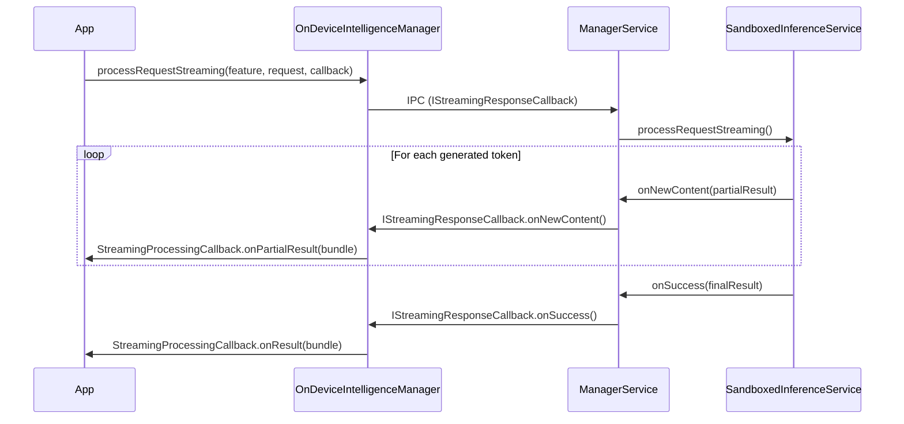
```mermaid
sequenceDiagram
    participant App
    participant Manager as OnDeviceIntelligenceManager
    participant Service as ManagerService
    participant Sandbox as SandboxedInferenceService

    App->>Manager: processRequestStreaming(feature, request, callback)
    Manager->>Service: IPC (IStreamingResponseCallback)
    Service->>Sandbox: processRequestStreaming()

    loop For each generated token
        Sandbox->>Service: onNewContent(partialResult)
        Service->>Manager: IStreamingResponseCallback.onNewContent()
        Manager->>App: StreamingProcessingCallback.onPartialResult(bundle)
    end

    Sandbox->>Service: onSuccess(finalResult)
    Service->>Manager: IStreamingResponseCallback.onSuccess()
    Manager->>App: StreamingProcessingCallback.onResult(bundle)
```

The `IStreamingResponseCallback` defines the wire protocol:

```java
// OnDeviceIntelligenceManager.java (processRequestStreaming)

IStreamingResponseCallback callback = new IStreamingResponseCallback.Stub() {
    @Override
    public void onNewContent(@InferenceParams Bundle result) {
        Binder.withCleanCallingIdentity(() -> {
            callbackExecutor.execute(
                    () -> streamingProcessingCallback.onPartialResult(result));
        });
    }

    @Override
    public void onSuccess(@InferenceParams Bundle result) {
        Binder.withCleanCallingIdentity(() -> {
            callbackExecutor.execute(
                    () -> streamingProcessingCallback.onResult(result));
        });
    }

    @Override
    public void onFailure(int errorCode, String errorMessage,
            PersistableBundle errorParams) {
        Binder.withCleanCallingIdentity(() -> {
            callbackExecutor.execute(
                    () -> streamingProcessingCallback.onError(
                            new OnDeviceIntelligenceException(
                                    errorCode, errorMessage, errorParams)));
        });
    }
```

### 50.4.15 Data Augmentation Protocol

A unique feature of ODI is the data augmentation callback, which allows the
sandboxed inference service to request additional data from the calling app
mid-inference:

```java
// OnDeviceIntelligenceManager.java

@Override
public void onDataAugmentRequest(@NonNull @InferenceParams Bundle request,
        @NonNull RemoteCallback contentCallback) {
    Binder.withCleanCallingIdentity(() -> callbackExecutor.execute(
            () -> processingCallback.onDataAugmentRequest(request, result -> {
                Bundle bundle = new Bundle();
                bundle.putParcelable(AUGMENT_REQUEST_CONTENT_BUNDLE_KEY, result);
                callbackExecutor.execute(() -> contentCallback.sendResult(bundle));
            })));
}
```

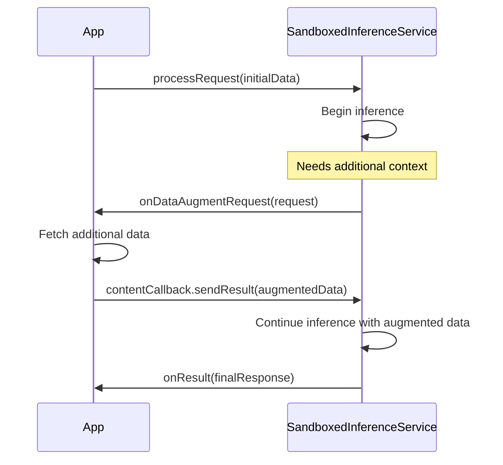
```mermaid
sequenceDiagram
    participant App
    participant Sandbox as SandboxedInferenceService

    App->>Sandbox: processRequest(initialData)
    Sandbox->>Sandbox: Begin inference
    Note over Sandbox: Needs additional context
    Sandbox->>App: onDataAugmentRequest(request)
    App->>App: Fetch additional data
    App->>Sandbox: contentCallback.sendResult(augmentedData)
    Sandbox->>Sandbox: Continue inference with augmented data
    Sandbox->>App: onResult(finalResponse)
```

This pattern enables retrieval-augmented generation (RAG) where the model
can request relevant documents mid-generation.

### 50.4.16 ProcessingSignal

Beyond `CancellationSignal`, ODI provides a `ProcessingSignal` for
sending custom control signals to the inference service during processing:

```java
// OnDeviceIntelligenceManager.java

public void processRequest(@NonNull Feature feature,
        @NonNull @InferenceParams Bundle request,
        @RequestType int requestType,
        @Nullable CancellationSignal cancellationSignal,
        @Nullable ProcessingSignal processingSignal,
        @NonNull @CallbackExecutor Executor callbackExecutor,
        @NonNull ProcessingCallback processingCallback) {
```

This allows apps to:

- Adjust generation parameters mid-stream (e.g., change temperature)
- Signal context updates
- Provide real-time feedback to the model

### 50.4.17 Power Attribution

ODI tracks inference power usage for attribution:

```java
// OnDeviceIntelligenceManager.java

@RequiresPermission(Manifest.permission.DUMP)
@FlaggedApi(FLAG_ON_DEVICE_INTELLIGENCE_25Q4)
public @NonNull List<InferenceInfo> getLatestInferenceInfo(
        @CurrentTimeMillisLong long startTimeEpochMillis) {
    return mService.getLatestInferenceInfo(startTimeEpochMillis);
}
```

This allows the system to correctly attribute battery usage to the app that
triggered the inference rather than blaming the inference service itself.

### 50.4.18 Security Boundaries

The ODI framework enforces several security boundaries:

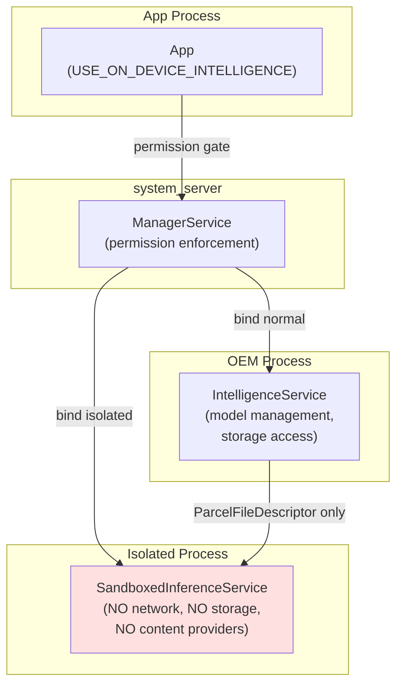
```mermaid
graph TB
    subgraph "App Process"
        A["App<br/>(USE_ON_DEVICE_INTELLIGENCE)"]
    end

    subgraph "system_server"
        B["ManagerService<br/>(permission enforcement)"]
    end

    subgraph "OEM Process"
        C["IntelligenceService<br/>(model management,<br/>storage access)"]
    end

    subgraph "Isolated Process"
        D["SandboxedInferenceService<br/>(NO network, NO storage,<br/>NO content providers)"]
    end

    A -->|"permission gate"| B
    B -->|"bind normal"| C
    B -->|"bind isolated"| D
    C -->|"ParcelFileDescriptor only"| D

    style D fill:#ffe0e0
```

**Key restrictions on the isolated process:**

- No network access (android:isolatedProcess=true)
- No access to app data directory
- No access to content providers
- Can only receive explicitly passed file descriptors
- Memory limits enforced by the system
- Process can be killed by the system at any time

This design means that even if an attacker compromises the inference engine
(e.g., through a model weight poisoning attack), they cannot exfiltrate
data from the device.

---

## 50.5 NeuralNetworks (NNAPI)

The Neural Networks API (NNAPI) is AOSP's hardware abstraction for
accelerated ML inference. It has been part of AOSP since Android 8.1 and is
now delivered as a Mainline module.

Android 17 also introduces a new, higher-level NPU access surface seeded under
`frameworks/base/core/java/android/npumanager/`. That subsystem (NpuManager) is
covered in its own chapter (Chapter 67); this section stays focused on NNAPI,
the long-standing C-level accelerator path that today's native ML workloads
still target.

**Source tree:**

```
packages/modules/NeuralNetworks/          (104 MB)
    runtime/                              -- C++ runtime library
        NeuralNetworks.cpp                -- C API entry points
        Manager.cpp                       (1376 lines) -- Device management
        CompilationBuilder.cpp            -- Model compilation
        ExecutionBuilder.cpp              -- Inference execution
        ExecutionPlan.cpp                 -- Multi-device partitioning
        ...
    common/types/include/nnapi/
        IDevice.h                         -- HAL device interface
        Types.h                           -- Shared type definitions
    driver/                               -- Reference CPU driver
    framework/                            -- Java/AIDL framework
    service/                              -- NNAPI service
    extensions/                           -- Vendor extensions
    shim_and_sl/                          -- Support library / shim
```

### 50.5.1 Architecture

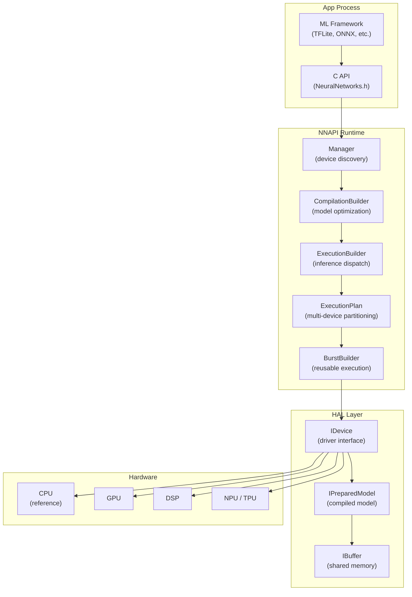
```mermaid
graph TB
    subgraph "App Process"
        APP["ML Framework<br/>(TFLite, ONNX, etc.)"]
        CAPI["C API<br/>(NeuralNetworks.h)"]
    end

    subgraph "NNAPI Runtime"
        MGR["Manager<br/>(device discovery)"]
        COMP["CompilationBuilder<br/>(model optimization)"]
        EXEC["ExecutionBuilder<br/>(inference dispatch)"]
        PLAN["ExecutionPlan<br/>(multi-device partitioning)"]
        BURST["BurstBuilder<br/>(reusable execution)"]
    end

    subgraph "HAL Layer"
        IDEV["IDevice<br/>(driver interface)"]
        IPM["IPreparedModel<br/>(compiled model)"]
        IBUF["IBuffer<br/>(shared memory)"]
    end

    subgraph "Hardware"
        CPU["CPU<br/>(reference)"]
        GPU["GPU"]
        DSP["DSP"]
        NPU["NPU / TPU"]
    end

    APP --> CAPI
    CAPI --> MGR
    MGR --> COMP
    COMP --> EXEC
    EXEC --> PLAN
    PLAN --> BURST
    BURST --> IDEV
    IDEV --> IPM
    IPM --> IBUF
    IDEV --> CPU
    IDEV --> GPU
    IDEV --> DSP
    IDEV --> NPU
```

### 50.5.2 The C API

The public API is a C interface defined in `NeuralNetworks.h`. The
implementation in `NeuralNetworks.cpp` validates parameters and delegates to
C++ builder classes:

```cpp
// packages/modules/NeuralNetworks/runtime/NeuralNetworks.cpp

// Contains all the entry points to the C Neural Networks API.
// We do basic validation of the operands and then call the class
// that implements the functionality.
```

Key data types verified at compile time:

```cpp
static_assert(ANEURALNETWORKS_FLOAT32 == 0, "...");
static_assert(ANEURALNETWORKS_INT32 == 1, "...");
static_assert(ANEURALNETWORKS_UINT32 == 2, "...");
static_assert(ANEURALNETWORKS_TENSOR_FLOAT32 == 3, "...");
static_assert(ANEURALNETWORKS_TENSOR_INT32 == 4, "...");
static_assert(ANEURALNETWORKS_TENSOR_QUANT8_ASYMM == 5, "...");
```

### 50.5.3 The Runtime Pipeline

The NNAPI execution pipeline has four stages:

```mermaid
graph LR
    A["1. Model<br/>Definition"] --> B["2. Compilation"]
    B --> C["3. Execution"]
    C --> D["4. Result<br/>Retrieval"]

    A2["ANeuralNetworksModel_create()"] --> A
    B2["ANeuralNetworksCompilation_create()"] --> B
    C2["ANeuralNetworksExecution_create()"] --> C
    D2["ANeuralNetworksExecution_getOutput*()"] --> D
```

1. **Model Definition** -- Build a computation graph with operands and
   operations. Each operation maps to a standardized neural network operator
   (convolution, pooling, activation, etc.).

2. **Compilation** -- The `CompilationBuilder` selects devices, partitions the
   model across multiple accelerators if beneficial, and generates
   device-specific code.

3. **Execution** -- The `ExecutionBuilder` dispatches work to devices. Can be
   synchronous, asynchronous, or fenced.

4. **Result Retrieval** -- Output tensors are read from shared memory buffers.

### 50.5.4 The HAL: IDevice

The `IDevice` interface represents a hardware accelerator driver:

```cpp
// packages/modules/NeuralNetworks/common/types/include/nnapi/IDevice.h

class IDevice {
   public:
    virtual const std::string& getName() const = 0;
    virtual const std::string& getVersionString() const = 0;
    virtual Version getFeatureLevel() const = 0;
    virtual DeviceType getType() const = 0;
    // Model compilation
    virtual GeneralResult<SharedPreparedModel> prepareModel(...) const = 0;
    // Memory allocation
    virtual GeneralResult<SharedBuffer> allocate(...) const = 0;
    ...
```

Device types include:

| Type | Description |
|------|-------------|
| `DeviceType::CPU` | Reference CPU implementation |
| `DeviceType::GPU` | Graphics processing unit |
| `DeviceType::ACCELERATOR` | Dedicated ML accelerator (NPU/TPU) |
| `DeviceType::OTHER` | Other hardware |

### 50.5.5 Multi-Device Partitioning

The `ExecutionPlan` handles model partitioning across multiple devices.
If a model contains operations that different accelerators handle best,
NNAPI can split the model:

```mermaid
graph TB
    subgraph "Model Graph"
        OP1[Conv2D] --> OP2[ReLU]
        OP2 --> OP3[MaxPool]
        OP3 --> OP4[FullyConnected]
        OP4 --> OP5[Softmax]
    end

    subgraph "Partitioned"
        P1["Partition 1: GPU<br/>Conv2D + ReLU + MaxPool"]
        P2["Partition 2: NPU<br/>FullyConnected + Softmax"]
    end

    OP3 --> P1
    OP5 --> P2
    P1 -- "shared memory" --> P2
```

### 50.5.6 Burst Execution

The `BurstBuilder` creates a reusable execution context for repeated
inferences with different input data but the same model. This amortizes
compilation and setup costs:

```cpp
// packages/modules/NeuralNetworks/runtime/Manager.h

class RuntimeExecution {
   public:
    virtual std::tuple<int, std::vector<OutputShape>, Timing> compute(
            const SharedBurst& burstController,
            const OptionalTimePoint& deadline) const = 0;

    virtual std::tuple<int, int, ExecuteFencedInfoCallback, Timing> computeFenced(
            const std::vector<int>& waitFor,
            const OptionalTimePoint& deadline,
            const OptionalDuration& timeoutDurationAfterFence) const = 0;
};
```

### 50.5.7 Vendor Extensions

The `extensions/` directory allows vendors to define custom operations and
data types beyond the standard NNAPI specification. Extensions use a
namespaced identifier to avoid conflicts:

```
vendor.google.custom_op = 0x0001
```

### 50.5.8 Support Library and Shim

The `shim_and_sl/` directory provides:

- **Support Library (SL):** A standalone library that apps can bundle for
  consistent NNAPI behavior across Android versions.

- **Shim:** Bridges between AIDL and HIDL HAL versions for backward
  compatibility.

### 50.5.9 The RuntimePreparedModel Abstraction

The `RuntimePreparedModel` provides a unified interface for both hardware
accelerated and CPU-based execution:

```cpp
// packages/modules/NeuralNetworks/runtime/Manager.h

class RuntimePreparedModel {
   public:
    virtual const Device* getDevice() const = 0;
    virtual SharedPreparedModel getInterface() const = 0;

    virtual std::tuple<int, std::vector<OutputShape>, Timing> execute(
            const std::vector<ModelArgumentInfo>& inputs,
            const std::vector<ModelArgumentInfo>& outputs,
            const std::vector<const RuntimeMemory*>& memories,
            const SharedBurst& burstController,
            MeasureTiming measure,
            const OptionalTimePoint& deadline,
            const OptionalDuration& loopTimeoutDuration,
            const std::vector<TokenValuePair>& metaData) const = 0;

    virtual std::tuple<int, int, ExecuteFencedInfoCallback, Timing> executeFenced(
            const std::vector<ModelArgumentInfo>& inputs,
            const std::vector<ModelArgumentInfo>& outputs,
            const std::vector<const RuntimeMemory*>& memories,
            const std::vector<int>& waitFor,
            MeasureTiming measure,
            const OptionalTimePoint& deadline,
            const OptionalDuration& loopTimeoutDuration,
            const OptionalDuration& timeoutDurationAfterFence,
            const std::vector<TokenValuePair>& metaData) const = 0;
```

The `executeFenced` variant supports:

- **Wait-for fences**: Synchronize with other GPU/DSP work
- **Timeout after fence**: Set a deadline relative to fence signaling
- **Timing measurement**: Optionally collect execution timing

### 50.5.10 NNAPI Data Types

The C API defines a rich set of tensor and scalar types:

```cpp
// packages/modules/NeuralNetworks/runtime/NeuralNetworks.cpp

static_assert(ANEURALNETWORKS_FLOAT32 == 0);
static_assert(ANEURALNETWORKS_INT32 == 1);
static_assert(ANEURALNETWORKS_UINT32 == 2);
static_assert(ANEURALNETWORKS_TENSOR_FLOAT32 == 3);
static_assert(ANEURALNETWORKS_TENSOR_INT32 == 4);
static_assert(ANEURALNETWORKS_TENSOR_QUANT8_ASYMM == 5);
static_assert(ANEURALNETWORKS_BOOL == 6);
static_assert(ANEURALNETWORKS_TENSOR_QUANT16_SYMM == 7);
static_assert(ANEURALNETWORKS_TENSOR_FLOAT16 == 8);
static_assert(ANEURALNETWORKS_TENSOR_BOOL8 == 9);
static_assert(ANEURALNETWORKS_FLOAT16 == 10);
static_assert(ANEURALNETWORKS_TENSOR_QUANT8_SYMM_PER_CHANNEL == 11);
static_assert(ANEURALNETWORKS_TENSOR_QUANT16_ASYMM == 12);
static_assert(ANEURALNETWORKS_TENSOR_QUANT8_SYMM == 13);
```

The `static_assert` checks guarantee ABI stability -- if any constant changes,
compilation fails.

### 50.5.11 Device Discovery

The `Manager` class discovers available accelerators at runtime:

```mermaid
graph TB
    MGR["Manager::getDevices()"]
    MGR --> REG["Device Registry"]
    REG --> HAL_DEV1["HAL Device 1<br/>(GPU via AIDL)"]
    REG --> HAL_DEV2["HAL Device 2<br/>(NPU via AIDL)"]
    REG --> HAL_DEV3["HAL Device 3<br/>(DSP via HIDL shim)"]
    REG --> CPU_DEV["CPU Reference<br/>(built-in)"]
```

The Manager:

1. Queries the `IDevice` service manager for registered accelerators
2. Reads their capabilities (supported operations, performance info)
3. Maintains a device list for model compilation and execution
4. Falls back to the CPU reference implementation if no accelerators match

### 50.5.12 Memory Management

NNAPI uses shared memory for zero-copy data transfer between the app and
accelerators:

```mermaid
graph LR
    APP["App Memory<br/>(AHardwareBuffer)"] --> SHARED["Shared Memory<br/>(ashmem / ion)"]
    SHARED --> ACCEL["Accelerator<br/>DMA"]
```

The `RuntimeMemory` class manages memory pools:

- **AHardwareBuffer**: For GPU-accessible memory
- **Ashmem**: For CPU-to-accelerator sharing
- **Ion/DMA-buf**: For direct hardware DMA access

### 50.5.13 NNAPI Feature Levels

NNAPI has evolved through several feature levels, each adding new operations
and capabilities:

| Feature Level | Android Version | Key Additions |
|---------------|-----------------|---------------|
| 1 | 8.1 (API 27) | Basic ops: Conv2D, MaxPool, ReLU |
| 2 | 9 (API 28) | BatchNorm, LSTM, more quantized ops |
| 3 | 10 (API 29) | Control flow (IF, WHILE), fenced execution |
| 4 | 11 (API 30) | Quality of service, model priority |
| 5 | 12 (API 31) | Signed 8-bit quantization |
| 6 | 13 (API 33) | AIDL HAL interface |
| 7 | 14 (API 34) | Vendor extensions |
| 8 | 15 (API 35) | Flatbuffer model format |

### 50.5.14 Telemetry

The runtime includes a `Telemetry` module that collects anonymized performance
metrics:

```cpp
// packages/modules/NeuralNetworks/runtime/NeuralNetworks.cpp

#include "Telemetry.h"
```

Metrics include:

- Compilation time per device
- Execution latency
- Error rates
- Device selection outcomes
- Memory allocation patterns

### 50.5.15 The NNAPI C API Lifecycle

A complete NNAPI workflow involves these API calls in order:

```mermaid
graph TD
    A["ANeuralNetworksModel_create()"] --> B["ANeuralNetworksModel_addOperand()<br/>(repeat for each tensor)"]
    B --> C["ANeuralNetworksModel_setOperandValue()<br/>(for constants)"]
    C --> D["ANeuralNetworksModel_addOperation()<br/>(repeat for each op)"]
    D --> E["ANeuralNetworksModel_identifyInputsAndOutputs()"]
    E --> F["ANeuralNetworksModel_finish()"]
    F --> G["ANeuralNetworksCompilation_create()"]
    G --> H["ANeuralNetworksCompilation_setPreference()"]
    H --> I["ANeuralNetworksCompilation_finish()"]
    I --> J["ANeuralNetworksExecution_create()"]
    J --> K["ANeuralNetworksExecution_setInput()<br/>(bind input buffers)"]
    K --> L["ANeuralNetworksExecution_setOutput()<br/>(bind output buffers)"]
    L --> M["ANeuralNetworksExecution_compute()<br/>or startCompute()"]
    M --> N["Read output buffers"]
    N --> O["ANeuralNetworksExecution_free()"]
    O --> P["ANeuralNetworksCompilation_free()"]
    P --> Q["ANeuralNetworksModel_free()"]
```

### 50.5.16 Compilation Preferences

```c
// ANeuralNetworksCompilation_setPreference() options:
ANEURALNETWORKS_PREFER_LOW_POWER       // Battery efficient
ANEURALNETWORKS_PREFER_FAST_SINGLE_ANSWER  // Minimum latency
ANEURALNETWORKS_PREFER_SUSTAINED_SPEED    // Sustained throughput
```

These preferences guide device selection:

- `LOW_POWER` may prefer a DSP over a GPU
- `FAST_SINGLE_ANSWER` may prefer GPU with highest peak performance
- `SUSTAINED_SPEED` may prefer a device with thermal headroom

### 50.5.17 Error Handling

NNAPI uses integer error codes for all operations:

| Code | Name | Meaning |
|------|------|---------|
| 0 | `ANEURALNETWORKS_NO_ERROR` | Success |
| 1 | `ANEURALNETWORKS_OUT_OF_MEMORY` | Memory allocation failed |
| 2 | `ANEURALNETWORKS_INCOMPLETE` | Operation not yet completed |
| 3 | `ANEURALNETWORKS_UNEXPECTED_NULL` | Null pointer where non-null expected |
| 4 | `ANEURALNETWORKS_BAD_DATA` | Invalid model or data |
| 5 | `ANEURALNETWORKS_OP_FAILED` | Hardware execution failure |
| 6 | `ANEURALNETWORKS_BAD_STATE` | Invalid state for this operation |
| 7 | `ANEURALNETWORKS_UNMAPPABLE` | Cannot map to this device |
| 8 | `ANEURALNETWORKS_OUTPUT_INSUFFICIENT_SIZE` | Output buffer too small |
| 9 | `ANEURALNETWORKS_UNAVAILABLE_DEVICE` | Device unavailable |
| 10 | `ANEURALNETWORKS_MISSED_DEADLINE_TRANSIENT` | Temporary deadline miss |
| 11 | `ANEURALNETWORKS_MISSED_DEADLINE_PERSISTENT` | Persistent deadline miss |
| 12 | `ANEURALNETWORKS_RESOURCE_EXHAUSTED_TRANSIENT` | Temporary resource exhaustion |
| 13 | `ANEURALNETWORKS_RESOURCE_EXHAUSTED_PERSISTENT` | Persistent resource exhaustion |
| 14 | `ANEURALNETWORKS_DEAD_OBJECT` | Driver process died |

### 50.5.18 Supported Operations

NNAPI supports over 100 neural network operations including:

**Activation functions:**

- RELU, RELU1, RELU6
- LOGISTIC (sigmoid)
- TANH
- ELU, HARD_SWISH

**Convolution:**

- CONV_2D, DEPTHWISE_CONV_2D
- TRANSPOSE_CONV_2D
- GROUPED_CONV_2D

**Pooling:**

- AVERAGE_POOL_2D, MAX_POOL_2D
- L2_POOL_2D

**Normalization:**

- BATCH_NORMALIZATION
- L2_NORMALIZATION
- LOCAL_RESPONSE_NORMALIZATION
- INSTANCE_NORMALIZATION

**Recurrent:**

- LSTM, UNIDIRECTIONAL_SEQUENCE_LSTM
- BIDIRECTIONAL_SEQUENCE_LSTM
- UNIDIRECTIONAL_SEQUENCE_RNN
- BIDIRECTIONAL_SEQUENCE_RNN

**Element-wise:**

- ADD, SUB, MUL, DIV
- FLOOR, CEIL, ABS, NEG
- POW, SQRT, RSQRT, EXP, LOG
- SIN, MINIMUM, MAXIMUM
- LESS, LESS_EQUAL, EQUAL, NOT_EQUAL

**Shape manipulation:**

- RESHAPE, SQUEEZE, EXPAND_DIMS
- CONCATENATION, SPLIT
- TRANSPOSE, GATHER, SELECT
- SLICE, STRIDED_SLICE, PAD
- TILE, REVERSE, BATCH_TO_SPACE_ND

**Control flow:**

- IF, WHILE (added in Feature Level 3)

### 50.5.19 Module Delivery and Updates

NNAPI is delivered as part of the NeuralNetworks Mainline module
(`com.android.neuralnetworks`), which allows:

- Security patches without full OS update
- New operation support for existing devices
- Bug fixes independent of OEM update cycles
- Consistent behavior across devices

The module is built from:
```
packages/modules/NeuralNetworks/apex/
```

---

## 50.6 OnDevicePersonalization and Federated Learning

The OnDevicePersonalization (ODP) Mainline module provides infrastructure for
privacy-preserving machine learning that keeps raw data on-device while
producing useful aggregate models.

**Source tree:**

```
packages/modules/OnDevicePersonalization/     (642 files)
    framework/                                -- Public API
    federatedcompute/                         -- Federated learning engine
        src/com/android/federatedcompute/services/
            training/
                IsolatedTrainingService.java  -- Isolated TFLite runtime
                IsolatedTrainingServiceImpl.java
            examplestore/                     -- Training data management
            scheduling/                       -- Job scheduling
            common/                           -- Shared utilities
    systemservice/                            -- System service
    pluginlib/                                -- Plugin interface for OEMs
    samples/                                  -- Sample implementations
```

### 50.6.1 Architecture

```mermaid
graph TB
    subgraph "App Process"
        APP_DATA[App Data]
        ODP_CLIENT[ODP Client API]
    end

    subgraph "ODP Module Process"
        ODP_SVC["OnDevicePersonalization<br/>Service"]
        FC_SCHED["Federated Compute<br/>Scheduler"]
        EXAMPLE_STORE[Example Store]
    end

    subgraph "Isolated Process"
        ITS[IsolatedTrainingService]
        TFLITE[TFLite Runtime]
    end

    subgraph "Remote Server"
        FC_SERVER["Federated Compute<br/>Server"]
    end

    APP_DATA --> ODP_CLIENT
    ODP_CLIENT --> ODP_SVC
    ODP_SVC --> FC_SCHED
    FC_SCHED --> EXAMPLE_STORE
    EXAMPLE_STORE --> ITS
    ITS --> TFLITE
    FC_SCHED -- "aggregated updates<br/>(differential privacy)" --> FC_SERVER
    FC_SERVER -- "global model<br/>updates" --> FC_SCHED
```

### 50.6.2 Federated Learning Concepts

Federated learning trains a shared model across many devices without
centralizing the training data:

```mermaid
sequenceDiagram
    participant Server as Federated Compute Server
    participant Device1 as Device A
    participant Device2 as Device B
    participant Device3 as Device C

    Server->>Device1: Send global model v1
    Server->>Device2: Send global model v1
    Server->>Device3: Send global model v1

    Device1->>Device1: Train on local data
    Device2->>Device2: Train on local data
    Device3->>Device3: Train on local data

    Device1->>Server: Send gradient update (+ noise)
    Device2->>Server: Send gradient update (+ noise)
    Device3->>Server: Send gradient update (+ noise)

    Server->>Server: Aggregate updates, Apply differential privacy
    Server->>Device1: Send global model v2
```

### 50.6.3 IsolatedTrainingService

The actual TFLite training runs in an isolated process:

```java
// packages/modules/OnDevicePersonalization/federatedcompute/
//   src/.../training/IsolatedTrainingService.java

public class IsolatedTrainingService extends Service {
    private IIsolatedTrainingService.Stub mBinder;

    @Override
    public void onCreate() {
        mBinder = new IsolatedTrainingServiceImpl(this);
    }

    @Override
    public IBinder onBind(Intent intent) {
        return mBinder;
    }
}
```

The `IsolatedTrainingServiceImpl` loads the TFLite runtime and executes
training rounds. Training data is provided through an `ExampleStore`
abstraction that iterates over the device's local examples without exposing
raw data to the network-connected scheduling process.

### 50.6.4 Example Store

The example store provides training data to the isolated process:

```
federatedcompute/src/.../examplestore/
    ExampleIterator.java              -- Iterator interface
    FederatedExampleIterator.java     -- Federated compute iterator
    ExampleConsumptionRecorder.java   -- Tracks data usage
    ExampleStoreServiceProvider.java  -- Service binding
```

### 50.6.5 Scheduling and Conditions

Federated compute jobs are scheduled through Android's `JobScheduler`
with conditions that protect user experience:

```
federatedcompute/src/.../scheduling/
    FederatedComputeJobManager.java
```

Training runs only when the device is:

- Charging (or above a battery threshold)
- Connected to unmetered network (Wi-Fi)
- Idle

These conditions are tracked by `BatteryInfo` and `NetworkStats` in the
`common/` package.

### 50.6.6 Privacy Protections

The federated compute protocol applies multiple privacy layers:

1. **Isolated process**: Training data never leaves the isolated process
2. **Secure aggregation**: Individual updates are encrypted before sending
3. **Differential privacy**: Noise is added to gradient updates
4. **Minimum cohort size**: Updates are only accepted from groups above
   a threshold, preventing single-device fingerprinting

### 50.6.7 Federated Compute Module Structure

```
packages/modules/OnDevicePersonalization/federatedcompute/
    src/com/android/federatedcompute/services/
        training/
            IsolatedTrainingService.java          -- Isolated service entry
            IsolatedTrainingServiceImpl.java      -- Training logic
        examplestore/
            ExampleIterator.java                  -- Training data iterator
            FederatedExampleIterator.java         -- Federated-specific iterator
            ExampleConsumptionRecorder.java       -- Usage tracking
            ExampleStoreServiceProvider.java      -- Service binding
        scheduling/
            FederatedComputeJobManager.java       -- Job scheduling
        common/
            Flags.java                            -- Feature flags
            PhFlags.java                          -- Phone-home flags
            Constants.java                        -- Shared constants
            FederatedComputeExecutors.java        -- Thread pools
            BatteryInfo.java                      -- Battery state
            NetworkStats.java                     -- Network conditions
            TrainingEventLogger.java              -- Metrics
            TrainingResult.java                   -- Training outcome
```

### 50.6.8 Training Protocol

The federated training protocol follows these steps on each device:

```mermaid
graph TB
    A["Scheduler triggers<br/>training job"] --> B{Check conditions}
    B -->|Charging + WiFi + Idle| C["Download global model<br/>from server"]
    B -->|Conditions not met| Z[Skip this round]
    C --> D["Load model in<br/>IsolatedTrainingService"]
    D --> E["Iterate over<br/>local examples"]
    E --> F["Compute local<br/>gradient update"]
    F --> G["Clip gradient<br/>to bounded norm"]
    G --> H["Add calibrated<br/>noise"]
    H --> I["Encrypt with<br/>secure aggregation key"]
    I --> J["Upload encrypted<br/>update to server"]
    J --> K["Server aggregates<br/>once cohort is complete"]
    K --> L["New global model<br/>available"]
```

### 50.6.9 Example Store Architecture

The example store provides a clean abstraction for training data:

```mermaid
graph TB
    subgraph "App Process"
        APP_DATA[App-Specific Data]
    end

    subgraph "ODP Module"
        ESP[ExampleStoreServiceProvider]
        EI[ExampleIterator]
    end

    subgraph "Isolated Training Process"
        FEI[FederatedExampleIterator]
        TF[TFLite Training]
    end

    APP_DATA --> ESP
    ESP --> EI
    EI --> FEI
    FEI --> TF
```

The `ExampleConsumptionRecorder` tracks which training examples have been
used, preventing over-representation of frequently available data.

### 50.6.10 Plugin Architecture

OEMs can extend ODP through the plugin library:

```
packages/modules/OnDevicePersonalization/pluginlib/
```

Plugins allow OEMs to:

- Provide custom example stores
- Implement device-specific training optimizations
- Add custom metrics collection
- Define custom scheduling policies

---

## 50.7 Content Capture and Intelligence

Three framework services work together to capture UI state, classify text
entities, and predict app usage. These services form the "passive
intelligence" layer that powers features like Smart Linkify, Smart Copy,
and app usage predictions.

### 50.7.1 ContentCaptureManager

The Content Capture subsystem silently captures the structure and content of
activities as the user interacts with them:

```java
// frameworks/base/core/java/android/view/contentcapture/ContentCaptureManager.java

@SystemService(Context.CONTENT_CAPTURE_MANAGER_SERVICE)
public final class ContentCaptureManager {
```

**Source:**
`frameworks/base/core/java/android/view/contentcapture/ContentCaptureManager.java`
(1221 lines)

From the Javadoc:

> Content capture provides real-time, continuous capture of application
> activity, display and events to an intelligence service that is provided by
> the Android system. The intelligence service then uses that info to mediate
> and speed user journey through different apps.

**Design principles:**

| Concern | Mechanism |
|---------|-----------|
| **Privacy** | Intelligence service is a trusted system component; cannot be changed by user; data used only for on-device ML; enforced by process isolation and CDD |
| **Performance** | Only enabled for allowlisted apps/activities; events are buffered and sent in batches |

### 50.7.2 ContentCaptureService

The service side receives captured content:

```
frameworks/base/core/java/android/service/contentcapture/
    ContentCaptureService.java           -- Abstract service base
    ContentCaptureServiceInfo.java       -- Service metadata
    IContentCaptureService.aidl          -- Binder interface
    ActivityEvent.java                   -- Activity lifecycle events
    FlushMetrics.java                    -- Batching metrics
    DataShareCallback.java               -- Data export
```

```mermaid
sequenceDiagram
    participant Activity
    participant CCSession as ContentCaptureSession
    participant CCM as ContentCaptureManager
    participant CCMS as ContentCaptureManagerService
    participant CCS as ContentCaptureService (OEM implementation)

    Activity->>CCSession: onStart/onResume
    CCSession->>CCSession: Capture view structure
    CCSession->>CCM: Buffer events
    CCM->>CCMS: Flush batch
    CCMS->>CCS: onContentCaptureEvents(sessionId, events)
    CCS->>CCS: ML analysis (entity detection, context building)
```

### 50.7.3 TextClassifierService

The `TextClassifierService` provides entity classification for text:

```
frameworks/base/core/java/android/service/textclassifier/
    TextClassifierService.java          (513 lines)
```

Capabilities:

| API | Function |
|-----|----------|
| `onSuggestSelection()` | Expand a text selection to cover a complete entity |
| `onClassifyText()` | Classify selected text (phone, email, address, etc.) |
| `onGenerateLinks()` | Generate clickable links for entities in text |
| `onDetectLanguage()` | Detect the language of a text span |
| `onSuggestConversationActions()` | Suggest actions for conversation messages |

```mermaid
graph LR
    A[User selects text] --> B[TextClassifierManager]
    B --> C[TextClassifierService]
    C --> D{Entity Type}
    D -->|Phone| E[Dial action]
    D -->|Address| F[Map action]
    D -->|Email| G[Compose action]
    D -->|URL| H[Browse action]
    D -->|DateTime| I[Calendar action]
```

### 50.7.4 AppPredictionManager

The App Prediction service predicts which apps the user will use next:

```java
// frameworks/base/core/java/android/app/prediction/AppPredictionManager.java

@SystemApi
public final class AppPredictionManager {
    public AppPredictor createAppPredictionSession(
            @NonNull AppPredictionContext predictionContext) {
        return new AppPredictor(mContext, predictionContext);
    }
}
```

The `AppPredictor` provides ranked lists of apps based on context (time of
day, location, recent usage patterns). Launchers use this to order the app
drawer and populate suggestions.

### 50.7.5 TextClassifierService Manifest and Interface

```java
// frameworks/base/core/java/android/service/textclassifier/TextClassifierService.java

@SystemApi
public abstract class TextClassifierService extends Service {
    public static final String SERVICE_INTERFACE =
            "android.service.textclassifier.TextClassifierService";
```

Manifest registration:

```xml
<service android:name=".YourTextClassifierService"
         android:permission="android.permission.BIND_TEXTCLASSIFIER_SERVICE">
    <intent-filter>
        <action android:name="android.service.textclassifier.TextClassifierService" />
    </intent-filter>
</service>
```

The system's default implementation is configured via
`config_defaultTextClassifierPackage`. If unset, a local
`TextClassifierImpl` runs in the calling app's process.

### 50.7.6 Text Classification Flow

```mermaid
sequenceDiagram
    participant App
    participant TCManager as TextClassificationManager
    participant TCMS as TextClassificationManagerService
    participant TCSvc as TextClassifierService

    App->>TCManager: classifyText(text, options)
    TCManager->>TCMS: Binder IPC
    TCMS->>TCSvc: onClassifyText(sessionId, request, callback)
    TCSvc->>TCSvc: Run ML model (entity recognition)
    TCSvc-->>TCMS: TextClassification result
    TCMS-->>TCManager: TextClassification result
    TCManager-->>App: TextClassification (entities, actions, confidence)
```

The `TextClassification` result includes:

- Entity type (phone, email, address, URL, datetime, flight number)
- Confidence score
- Suggested `RemoteAction` objects for each entity
- Language detection results

### 50.7.7 Content Capture Event Batching

The Content Capture system optimizes for performance through event batching:

```mermaid
graph LR
    A["View Change<br/>Event"] --> B["Buffer<br/>(per session)"]
    C["View Change<br/>Event"] --> B
    D["View Change<br/>Event"] --> B
    B -->|"Buffer full<br/>or timeout"| E["Flush"]
    E --> F["ContentCaptureManagerService"]
    F --> G["ContentCaptureService"]
```

Events are buffered per `ContentCaptureSession` and flushed:

- When the buffer reaches capacity
- When a timeout expires
- When the session ends
- When the activity pauses or stops

`FlushMetrics` provides statistics about the batching:

```
frameworks/base/core/java/android/service/contentcapture/FlushMetrics.java
```

### 50.7.8 Content Capture and Data Sharing

The `DataShareCallback` and `DataShareReadAdapter` support sharing captured
content with external analytics while preserving privacy:

```
frameworks/base/core/java/android/service/contentcapture/
    DataShareCallback.java
    DataShareReadAdapter.java
    IDataShareCallback.aidl
    IDataShareReadAdapter.aidl
```

Data sharing uses file descriptors and pipe-based transfer to avoid copying
sensitive content through shared memory.

### 50.7.9 Content Protection

A separate `IContentProtectionService` interface supports content protection
use cases (detecting and redacting sensitive content):

```
frameworks/base/core/java/android/service/contentcapture/
    IContentProtectionService.aidl
    IContentProtectionAllowlistCallback.aidl
```

### 50.7.10 The Intelligence Pipeline

These three services form a coherent pipeline:

```mermaid
graph TB
    subgraph "Capture Layer"
        CC[ContentCaptureService]
    end

    subgraph "Understanding Layer"
        TC[TextClassifierService]
        NER[Named Entity Recognition]
    end

    subgraph "Prediction Layer"
        AP[AppPredictionService]
        RANKING[Usage Ranking Model]
    end

    subgraph "Consumer Layer"
        LAUNCHER[Launcher]
        AUTOFILL[Autofill]
        SHARE[Share Sheet]
        SMARTLINK[Smart Linkify]
    end

    CC --> TC
    CC --> AP
    TC --> NER
    AP --> RANKING
    NER --> SMARTLINK
    NER --> AUTOFILL
    RANKING --> LAUNCHER
    RANKING --> SHARE
```

### 50.7.11 AppPrediction Context

The `AppPredictionContext` configures what kind of predictions are requested:

```java
// frameworks/base/core/java/android/app/prediction/AppPredictionManager.java

@SystemApi
public final class AppPredictionManager {
    @NonNull
    public AppPredictor createAppPredictionSession(
            @NonNull AppPredictionContext predictionContext) {
        return new AppPredictor(mContext, predictionContext);
    }
}
```

The prediction context specifies:

- **UI surface**: Where predictions will be displayed (launcher, share sheet)
- **Prediction count**: How many predictions to return
- **Package name**: The app requesting predictions
- **Extras**: Additional context-specific parameters

### 50.7.12 Privacy Architecture for Intelligence Services

All three services share a common privacy model:

```mermaid
graph TB
    subgraph "Privacy Guarantees"
        A["Trusted System Component<br/>(cannot be changed by user)"]
        B["Process Isolation<br/>(separate process)"]
        C["CDD Requirements<br/>(OEM attestation)"]
        D["On-Device Only<br/>(no cloud upload)"]
        E["User Control<br/>(global disable via Settings)"]
    end

    A --> F["Intelligence Service"]
    B --> F
    C --> F
    D --> F
    E --> F
```

The CDD (Compatibility Definition Document) requires that:

- The intelligence service cannot transmit captured data off-device
- The service must respect user's privacy settings
- The service must be declared by the device manufacturer
- Third-party apps cannot replace the intelligence service

---

## 50.8 AppSearch

AppSearch is AOSP's on-device full-text search engine, delivered as a Mainline
module. It underpins the AppFunctions discovery mechanism and provides
structured data indexing for any app.

**Source tree:**

```
packages/modules/AppSearch/
    framework/java/android/app/appsearch/
        AppSearchManager.java                -- System service entry point
        AppSearchSession.java                -- Per-database session
        GenericDocument.java                 -- Base document type
        SearchSpec.java                      -- Query specification
        SetSchemaRequest.java                -- Schema definition
        ...
    service/java/com/android/server/appsearch/
        AppSearchManagerService.java         -- System server
        external/localstorage/
            AppSearchImpl.java               -- Local storage engine
```

### 50.8.1 Architecture

```mermaid
graph TB
    subgraph "App Process"
        APP[Application]
        ASM[AppSearchManager]
        SESS[AppSearchSession]
    end

    subgraph "AppSearch Module"
        ASMS[AppSearchManagerService]
        IMPL["AppSearchImpl<br/>IcingSearchEngine"]
        INDEX[Full-Text Index]
        SCHEMA[Schema Store]
    end

    APP --> ASM
    ASM -- "Binder IPC" --> ASMS
    ASM --> SESS
    SESS -- "CRUD operations" --> ASMS
    ASMS --> IMPL
    IMPL --> INDEX
    IMPL --> SCHEMA
```

### 50.8.2 Core Concepts

From the `AppSearchManager` Javadoc:

```java
// packages/modules/AppSearch/framework/java/android/app/appsearch/AppSearchManager.java

// AppSearch is an offline, on-device search library for managing structured
// data featuring:
// - APIs to index and retrieve data via full-text search
// - An API for applications to explicitly grant read-access permission of
//   their data to other applications
// - An API for applications to opt into or out of having their data displayed
//   on System UI surfaces
```

**Key abstractions:**

| Concept | Description |
|---------|-------------|
| **Database** | Isolated per-app search namespace, created via `SearchContext` |
| **Schema** | Defines document types and their properties (like SQL DDL) |
| **GenericDocument** | A document instance with namespace, ID, properties, and score |
| **SearchSpec** | Query parameters: text query, filters, ranking strategy |
| **Visibility** | Per-schema access control for cross-app search |

### 50.8.3 Schema Definition

```java
AppSearchSchema emailSchemaType = new AppSearchSchema.Builder("Email")
    .addProperty(new StringPropertyConfig.Builder("subject")
       .setCardinality(PropertyConfig.CARDINALITY_OPTIONAL)
       .setIndexingType(PropertyConfig.INDEXING_TYPE_PREFIXES)
       .setTokenizerType(PropertyConfig.TOKENIZER_TYPE_PLAIN)
   .build()
).build();
```

### 50.8.4 Document Indexing

```java
GenericDocument email = new GenericDocument.Builder<>(NAMESPACE, ID, "Email")
    .setPropertyString("subject", EMAIL_SUBJECT)
    .setScore(EMAIL_SCORE)
    .build();

PutDocumentsRequest request = new PutDocumentsRequest.Builder()
    .addGenericDocuments(email)
    .build();
session.put(request, executor, callback);
```

### 50.8.5 Search

```java
SearchSpec spec = new SearchSpec.Builder()
    .addFilterSchemas("Email")
    .setRankingStrategy(SearchSpec.RANKING_STRATEGY_RELEVANCE_SCORE)
    .build();

SearchResults results = session.search("important meeting", spec);
```

### 50.8.6 The IcingSearchEngine

Under the hood, AppSearch is backed by the IcingSearchEngine, a C++ library
that provides:

- Full-text indexing with BM25F scoring
- Prefix matching
- Namespace-based isolation
- Integer and document-level indexing
- Query syntax with boolean operators

### 50.8.7 Visibility and Access Control

AppSearch enforces visibility at the schema level:

```java
SetSchemaRequest.Builder builder = new SetSchemaRequest.Builder();
builder.addSchemas(emailSchemaType);
builder.setSchemaTypeVisibilityForPackage(
        "Email",
        /* visible= */ true,
        new PackageIdentifier("com.example.reader", sigDigest));
builder.setSchemaTypeDisplayedBySystem("Email", /* displayed= */ true);
```

Three visibility levels:

- **Package visibility**: Specific packages can read documents of a type
- **System visibility**: System-designated querier can access for system UI
- **Self-only**: Default, only the indexing app can query

### 50.8.8 Global Search

Apps with the `READ_GLOBAL_APP_SEARCH_DATA` permission (typically system apps)
can search across all packages' visible data:

```mermaid
graph TB
    subgraph "App A Database"
        A_EMAILS[Email documents]
        A_CONTACTS[Contact documents]
    end

    subgraph "App B Database"
        B_NOTES[Note documents]
        B_TASKS[Task documents]
    end

    subgraph "AppSearch Service"
        INDEX["Unified Index<br/>(IcingSearchEngine)"]
        VIS[Visibility Filter]
    end

    subgraph "System App"
        QUERIER["Global Search<br/>Querier"]
    end

    A_EMAILS --> INDEX
    A_CONTACTS --> INDEX
    B_NOTES --> INDEX
    B_TASKS --> INDEX
    QUERIER --> VIS
    VIS --> INDEX
```

### 50.8.9 AppSearch and AppFunctions Integration

When AppFunctions indexes function metadata, it creates documents of type
`AppFunctionStaticMetadata` in AppSearch. Agents discover functions by:

1. Opening a global search session
2. Querying for `AppFunctionStaticMetadata` documents
3. Extracting `functionIdentifier` and schema information
4. Using these to construct `ExecuteAppFunctionRequest`

```mermaid
sequenceDiagram
    participant Agent as AI Agent
    participant AS as AppSearch
    participant AFM as AppFunctionManager

    Agent->>AS: search("CreateNote", AppFunctionStaticMetadata)
    AS-->>Agent: doc with functionId and schema
    Agent->>AFM: executeAppFunction(targetPkg, functionId)
    AFM-->>Agent: ExecuteAppFunctionResponse
```

### 50.8.10 AppSearch Query Syntax

AppSearch supports a rich query language:

| Feature | Example | Description |
|---------|---------|-------------|
| Full-text | `"important meeting"` | Match documents containing these terms |
| Boolean AND | `term1 AND term2` | Both terms must match |
| Boolean OR | `term1 OR term2` | Either term matches |
| Negation | `NOT term` | Exclude documents with term |
| Prefix | `meet*` | Prefix matching |
| Property restrict | `subject:meeting` | Match in specific property |
| Semantic search | `semanticSearch(...)` | Vector similarity search |

The AST (Abstract Syntax Tree) for queries is represented by node classes:

```
packages/modules/AppSearch/framework/java/external/android/app/appsearch/ast/
    FunctionNode.java
    NegationNode.java
    query/SearchNode.java
    query/SemanticSearchNode.java
    query/HasPropertyNode.java
    operators/ComparatorNode.java
    operators/PropertyRestrictNode.java
```

### 50.8.11 GenericDocument Deep Dive

The `GenericDocument` is the foundational data type shared between AppSearch
and AppFunctions:

```java
// packages/modules/AppSearch/framework/java/external/android/app/appsearch/GenericDocument.java

GenericDocument doc = new GenericDocument.Builder<>(namespace, id, schemaType)
    .setPropertyString("name", "John")
    .setPropertyLong("age", 30)
    .setPropertyDouble("score", 0.95)
    .setPropertyBoolean("active", true)
    .setPropertyBytes("avatar", imageBytes)
    .setPropertyDocument("address", addressDoc)
    .setScore(100)
    .setTtlMillis(TimeUnit.DAYS.toMillis(30))
    .setCreationTimestampMillis(System.currentTimeMillis())
    .build();
```

Properties support multiple cardinalities:

- `CARDINALITY_REQUIRED` -- Exactly one value
- `CARDINALITY_OPTIONAL` -- Zero or one value
- `CARDINALITY_REPEATED` -- Zero or more values

### 50.8.12 AppSearchImpl and IcingSearchEngine

The `AppSearchImpl` class wraps the native IcingSearchEngine:

```
packages/modules/AppSearch/service/java/com/android/server/appsearch/
    external/localstorage/AppSearchImpl.java
```

IcingSearchEngine provides:

- BM25F scoring for relevance ranking
- Inverted index for fast full-text search
- Forward index for property retrieval
- Namespace-based isolation
- TTL-based automatic document expiry
- Schema migration support

### 50.8.13 Observer API

Apps can register observers to be notified of changes:

```java
// AppSearchManager observer
appSearchManager.registerObserverCallback(
        "com.example.app",
        new ObserverSpec.Builder().addFilterSchemas("Email").build(),
        executor,
        new ObserverCallback() {
            @Override
            public void onSchemaChanged(SchemaChangeInfo info) { ... }
            @Override
            public void onDocumentChanged(DocumentChangeInfo info) { ... }
        });
```

This is how the AppFunctions system monitors for metadata changes -- the
service registers an observer in AppSearch and reacts to
`AppFunctionStaticMetadata` document changes.

### 50.8.14 IcingSearchEngine Internals

`AppSearchImpl` wraps the native IcingSearchEngine through a JNI boundary.
The engine provides a complete search stack implemented in C++:

```java
// packages/modules/AppSearch/service/java/com/android/server/appsearch/
//   external/localstorage/AppSearchImpl.java
@WorkerThread
public final class AppSearchImpl implements Closeable {
    @GuardedBy("mReadWriteLock")
    IcingSearchEngineInterface mIcingSearchEngineLocked;

    // Thread safety: ReadWriteLock separating query (READ) from mutation (WRITE)
    private final ReadWriteLock mReadWriteLock = new ReentrantReadWriteLock();

    // Caches for performance
    private final SchemaCache mSchemaCacheLocked = new SchemaCache();
    private final NamespaceCache mNamespaceCacheLocked = new NamespaceCache();
    private volatile DocumentLimiter mDocumentLimiterLocked;
}
```

**Prefix-Based Isolation:**

`AppSearchImpl` achieves per-package, per-database isolation within a single
IcingSearchEngine instance by prefixing all schema types, namespaces, and
document IDs:

```mermaid
graph TB
    subgraph "App A, Database 'mail'"
        A_TYPE["Schema: Email"]
        A_NS["Namespace: inbox"]
        A_DOC["Doc ID: msg123"]
    end

    subgraph "IcingSearchEngine (physical storage)"
        I_TYPE["Schema: com.app.a$mail/Email"]
        I_NS["Namespace: com.app.a$mail/inbox"]
        I_DOC["Doc ID: com.app.a$mail/inbox#msg123"]
    end

    subgraph "App B, Database 'notes'"
        B_TYPE["Schema: Note"]
        B_NS["Namespace: personal"]
        B_DOC["Doc ID: note456"]
    end

    subgraph "IcingSearchEngine (same instance)"
        J_TYPE["Schema: com.app.b$notes/Note"]
        J_NS["Namespace: com.app.b$notes/personal"]
        J_DOC["Doc ID: com.app.b$notes/personal#note456"]
    end

    A_TYPE -->|"addPrefix()"| I_TYPE
    A_NS -->|"addPrefix()"| I_NS
    A_DOC -->|"addPrefix()"| I_DOC
    B_TYPE -->|"addPrefix()"| J_TYPE
    B_NS -->|"addPrefix()"| J_NS
    B_DOC -->|"addPrefix()"| J_DOC
```

When retrieving results, `removePrefix()` and `removePrefixesFromDocument()`
strip the prefix so callers never see the internal naming.

**Converter Layer:**

A set of converter classes translate between the Java AppSearch API types and
Icing protobuf types:

| Converter | Direction |
|---|---|
| `GenericDocumentToProtoConverter` | `GenericDocument` <-> `DocumentProto` |
| `SchemaToProtoConverter` | `AppSearchSchema` <-> `SchemaTypeConfigProto` |
| `SearchSpecToProtoConverter` | `SearchSpec` <-> `SearchSpecProto` + `ScoringSpecProto` + `ResultSpecProto` |
| `SearchResultToProtoConverter` | `SearchResultProto` -> `SearchResult` |
| `SetSchemaResponseToProtoConverter` | `SetSchemaResultProto` -> `SetSchemaResponse` |
| `BlobHandleToProtoConverter` | `AppSearchBlobHandle` <-> `BlobProto` |

**Scoring and Ranking:**

IcingSearchEngine supports multiple ranking strategies:

| Strategy | Description |
|---|---|
| `RANKING_STRATEGY_RELEVANCE_SCORE` | BM25F text relevance |
| `RANKING_STRATEGY_CREATION_TIMESTAMP` | Newest first |
| `RANKING_STRATEGY_DOCUMENT_SCORE` | App-provided score |
| `RANKING_STRATEGY_USAGE_COUNT` | Number of usage reports |
| `RANKING_STRATEGY_USAGE_LAST_USED_TIMESTAMP` | Most recently used |
| `RANKING_STRATEGY_JOIN_AGGREGATE_SCORE` | Score from joined docs |

BM25F (Best Matching 25 with Field weighting) is the default relevance
algorithm.  It considers term frequency, inverse document frequency, and
document length normalisation across indexed properties with configurable
field weights.

**Optimization:**

`AppSearchImpl` periodically optimises the Icing index:

```java
@VisibleForTesting static final int CHECK_OPTIMIZE_INTERVAL = 100;
// After every 100 mutations, check GetOptimizeInfoResult
// If significant space can be reclaimed, run optimize()
```

Optimisation compacts the index, removing tombstoned documents and
rebuilding internal data structures.

### 50.8.15 Schema Management Deep Dive

Schema management is a critical concern because schema changes can break
existing documents.  `AppSearchImpl.setSchema()` handles migrations:

```mermaid
sequenceDiagram
    participant App
    participant ASMS as AppSearchManagerService
    participant Impl as AppSearchImpl
    participant Icing as IcingSearchEngine

    App->>ASMS: setSchema(SetSchemaRequest)
    ASMS->>Impl: setSchema(prefix, schemas, visibilityConfigs)
    Impl->>Impl: Add prefix to all schema types
    Impl->>Icing: setSchema(SchemaProto, forceOverride?)

    alt Compatible change (add optional property)
        Icing-->>Impl: SUCCESS
        Impl->>Impl: Update SchemaCache
    else Incompatible change (remove required property)
        Icing-->>Impl: SetSchemaResult with incompatibleTypes
        Impl-->>App: SetSchemaResponse with migrationTypes
        Note over App: App provides Migrator to transform docs
    end
```

Incompatible schema changes include:

- Removing a property
- Changing cardinality from OPTIONAL to REQUIRED
- Changing property data type
- Changing indexing type on an existing property

For each incompatible type, the app can provide a `Migrator` that transforms
documents from the old schema to the new one.

### 50.8.16 Visibility Store Architecture

The `VisibilityStore` manages per-schema access control within
`AppSearchImpl`:

```
packages/modules/AppSearch/service/java/com/android/server/appsearch/
  external/localstorage/visibilitystore/
    VisibilityStore.java                  -- Stores visibility configs
    VisibilityChecker.java                -- Interface for permission checks
    VisibilityUtil.java                   -- Resolution logic
    CallerAccess.java                     -- Encapsulates caller identity
    VisibilityToDocumentConverter.java    -- Persists configs as documents
    VisibilityStoreMigrationHelperFromV0.java  -- V0 -> V1 migration
    VisibilityStoreMigrationHelperFromV1.java  -- V1 -> V2 migration
```

Visibility is stored as AppSearch documents themselves, using a special
internal database.  When a global search query is executed, `VisibilityUtil`
filters results by checking:

1. **Package visibility** -- Is the querying package in the schema's allowed
   package list, verified by signature digest?

2. **System visibility** -- Does the querier hold the role/permission
   designated for system UI access?

3. **Self-access** -- Is the querier the same package that indexed the
   schema?

```mermaid
graph TB
    Q["Global Search Query"]
    Q --> VU["VisibilityUtil.isSchemaSearchableByCaller()"]

    VU --> C1{"Same package?"}
    C1 -->|"Yes"| ALLOW["Allow"]
    C1 -->|"No"| C2{"Package in<br/>visibility list?"}
    C2 -->|"Yes, signature matches"| ALLOW
    C2 -->|"No"| C3{"System querier<br/>with permission?"}
    C3 -->|"Yes"| C4{"Schema displayed<br/>by system?"}
    C4 -->|"Yes"| ALLOW
    C4 -->|"No"| DENY["Deny"]
    C3 -->|"No"| DENY
```

### 50.8.17 Blob Storage

AppSearch supports storing binary large objects (BLOBs) alongside documents
through `AppSearchBlobHandle`:

```java
// AppSearchImpl wraps IcingSearchEngine's blob support:
// - BlobProto for storage
// - BlobHandleToProtoConverter for conversion
// - NamespaceBlobStorageInfoProto for storage statistics
```

BLOBs are stored in a dedicated directory (`mBlobFilesDir`) separate from
the index, with `ParcelFileDescriptor` used for efficient transfer across
process boundaries.

### 50.8.18 Thread Safety and Locking Model

`AppSearchImpl` uses a `ReentrantReadWriteLock` to achieve high query
throughput while maintaining data consistency:

```mermaid
graph TB
    subgraph "READ Lock (concurrent)"
        Q1["search()"]
        Q2["getDocument()"]
        Q3["getSchema()"]
        Q4["getStorageInfo()"]
        Q5["getNamespaces()"]
    end

    subgraph "WRITE Lock (exclusive)"
        W1["setSchema()"]
        W2["putDocument()"]
        W3["remove()"]
        W4["removeByQuery()"]
        W5["optimize()"]
        W6["reset()"]
        W7["close()"]
    end

    RWL["ReentrantReadWriteLock"]
    Q1 --> RWL
    Q2 --> RWL
    Q3 --> RWL
    W1 --> RWL
    W2 --> RWL
    W5 --> RWL
```

All read operations (queries, document retrieval, schema inspection) run
concurrently under the READ lock.  All mutating operations (schema changes,
document puts/deletes, optimisation) require the exclusive WRITE lock.  The
`@WorkerThread` annotation enforces that no AppSearch operations run on the
main thread.

### 50.8.19 Document Lifecycle and TTL

Documents in AppSearch have a configurable time-to-live:

```java
GenericDocument doc = new GenericDocument.Builder<>(namespace, id, schemaType)
    .setTtlMillis(TimeUnit.DAYS.toMillis(30))  // Expire after 30 days
    .setCreationTimestampMillis(System.currentTimeMillis())
    .build();
```

IcingSearchEngine enforces TTL by:

1. Recording `creationTimestampMillis` + `ttlMillis` as the expiry time
2. During `optimize()`, deleting documents past their expiry
3. Excluding expired documents from search results even before optimisation

A TTL of 0 means the document never expires (default).

### 50.8.20 Join Queries

AppSearch supports join queries that combine results from two schema types:

```java
JoinSpec joinSpec = new JoinSpec.Builder("referencedPropertyName")
    .setNestedSearch("childQuery", new SearchSpec.Builder().build())
    .setAggregationScoringStrategy(
        JoinSpec.AGGREGATION_SCORING_RESULT_COUNT)
    .build();

SearchSpec spec = new SearchSpec.Builder()
    .setJoinSpec(joinSpec)
    .build();
```

Join queries enable patterns like "find emails with the most attachments"
or "find contacts with recent messages":

```mermaid
graph LR
    subgraph "Parent Documents"
        P1["Email {id: e1}"]
        P2["Email {id: e2}"]
    end

    subgraph "Child Documents"
        C1["Attachment {emailRef: e1}"]
        C2["Attachment {emailRef: e1}"]
        C3["Attachment {emailRef: e2}"]
    end

    C1 -->|"referencedPropertyName"| P1
    C2 -->|"referencedPropertyName"| P1
    C3 -->|"referencedPropertyName"| P2

    subgraph "Join Result"
        R1["Email e1 (score: 2 attachments)"]
        R2["Email e2 (score: 1 attachment)"]
    end
```

### 50.8.21 AppSearchManagerService -- The System Server Layer

`AppSearchManagerService` is the system\_server component that mediates all
AppSearch access:

```java
// packages/modules/AppSearch/service/java/com/android/server/appsearch/
//   AppSearchManagerService.java
```

It handles:

- **Per-user instances**: Maintains separate `AppSearchImpl` instances per
  user profile

- **Permission enforcement**: Validates caller identity and permissions
  before delegating to `AppSearchImpl`

- **Rate limiting**: Enforces API call quotas per-package
- **Statistics collection**: Gathers `InitializeStats`, `PutDocumentStats`,
  `QueryStats`, `SetSchemaStats`, `RemoveStats`, `OptimizeStats` for
  performance monitoring

The statistics pipeline tracks:

| Stat Class | Measures |
|---|---|
| `InitializeStats` | Engine initialisation time, document count |
| `PutDocumentStats` | Indexing latency, document size |
| `QueryStats` | Query latency, result count, ranking time |
| `SetSchemaStats` | Schema migration time, incompatible changes |
| `RemoveStats` | Deletion latency |
| `OptimizeStats` | Optimisation duration, space reclaimed |
| `PersistToDiskStats` | Flush latency |

---

## 50.9 AdServices

The AdServices Mainline module provides privacy-preserving advertising APIs
as part of the Privacy Sandbox initiative. While primarily advertising-focused,
the underlying technology demonstrates key on-device ML patterns.

**Source tree:**

```
packages/modules/AdServices/
    adservices/
        framework/java/android/adservices/
            topics/TopicsManager.java           -- Topics API
            customaudience/CustomAudienceManager.java -- FLEDGE/Protected Audiences
        service-core/java/com/android/adservices/service/
            topics/TopicsWorker.java            -- On-device topic classification
        service/                                -- Main service
    sdksandbox/                                 -- SDK Runtime sandbox
```

### 50.9.1 Architecture

```mermaid
graph TB
    subgraph "App / SDK"
        APP[App or Ad SDK]
        TM[TopicsManager]
        CAM[CustomAudienceManager]
    end

    subgraph "AdServices Module"
        TS[Topics Service]
        TW[TopicsWorker]
        CLASSIFIER[On-Device Classifier]
        PA["Protected Audiences<br/>FLEDGE"]
        MODEL["ML Model<br/>App-to-Topic mapping"]
    end

    subgraph "SDK Sandbox"
        SDK[Sandboxed SDK Runtime]
    end

    APP --> TM
    APP --> CAM
    TM -- "Binder" --> TS
    CAM -- "Binder" --> PA
    TS --> TW
    TW --> CLASSIFIER
    CLASSIFIER --> MODEL
    APP --> SDK
```

### 50.9.2 Topics API

The Topics API classifies apps into interest categories using an on-device
ML classifier:

```java
// packages/modules/AdServices/adservices/framework/java/
//   android/adservices/topics/TopicsManager.java

@RequiresApi(Build.VERSION_CODES.S)
public final class TopicsManager {
    @RequiresPermission(ACCESS_ADSERVICES_TOPICS)
    public void getTopics(
            @NonNull GetTopicsRequest getTopicsRequest,
            @NonNull @CallbackExecutor Executor executor,
            @NonNull OutcomeReceiver<GetTopicsResponse, Exception> callback) {
```

The classifier runs entirely on-device:

1. The system downloads a taxonomy of ~470 topics
2. An ML model maps app package names to topic categories
3. Each epoch (~1 week), the system records which topics the user's apps map to
4. When an SDK calls `getTopics()`, it receives a privacy-safe selection of
   topics with noise added

### 50.9.3 Protected Audiences (FLEDGE)

Protected Audiences runs ad auctions on-device:

```mermaid
sequenceDiagram
    participant Buyer as Ad Buyer SDK
    participant CAM as CustomAudienceManager
    participant Service as AdServices
    participant Seller as Ad Seller

    Buyer->>CAM: joinCustomAudience(audience)
    Note over Service: Audience stored on-device

    Seller->>Service: selectAds(adSelectionConfig)
    Service->>Service: Run bidding logic (JavaScript in sandbox)
    Service->>Service: Run scoring logic
    Service-->>Seller: AdSelectionOutcome
```

### 50.9.4 SDK Sandbox

AdServices introduced the SDK Runtime sandbox:

```
packages/modules/AdServices/sdksandbox/
    framework/    -- SDK sandbox framework
    SdkSandbox/   -- Sandbox process
    service/      -- Sandbox service
```

Third-party SDKs run in a separate process with restricted permissions,
preventing unauthorized data collection.

### 50.9.5 Topics Classification Pipeline

The on-device topics classifier follows this pipeline:

```mermaid
graph TB
    A[App Usage Data] --> B["Epoch Computation<br/>Weekly"]
    B --> C{"For each app used<br/>this epoch"}
    C --> D["ML Classifier<br/>App -> Topics mapping"]
    D --> E["User Interest Topics<br/>for this epoch"]
    E --> F["Store Top Topics<br/>Last 3 epochs"]

    G["getTopics() API call"] --> H{Random selection}
    H --> I["Return 1 topic<br/>from past epoch"]
    H --> J["Return random topic<br/>(5% noise)"]
```

The classifier uses a pre-trained ML model that maps app package names to
a fixed taxonomy of approximately 470 topics. The model is downloaded and
updated through the AdServices module.

Privacy mechanisms:

- **Epoch-based**: Topics are computed weekly, not per-access
- **Top-K selection**: Only the top topics per epoch are stored
- **Random noise**: 5% of returned topics are random
- **Per-caller isolation**: Different SDKs see different topic selections
- **User controls**: Users can view and remove topics in Settings

### 50.9.6 Protected Audiences (FLEDGE) Deep Dive

The Protected Audiences API runs a full ad auction on-device:

```mermaid
graph TB
    subgraph "Buyer Phase"
        B1["Custom Audience 1<br/>from Buyer A"]
        B2["Custom Audience 2<br/>from Buyer B"]
        BID1["generateBid.js<br/>Buyer A"]
        BID2["generateBid.js<br/>Buyer B"]
    end

    subgraph "Seller Phase"
        SCORE["scoreAd.js<br/>Seller"]
        REPORT["reportResult.js<br/>Reporting"]
    end

    subgraph "On-Device Auction"
        AUCTION[Ad Selection Engine]
    end

    B1 --> BID1
    B2 --> BID2
    BID1 --> AUCTION
    BID2 --> AUCTION
    AUCTION --> SCORE
    SCORE --> REPORT
    REPORT --> WINNER[Winning Ad]
```

Key components:

- **Custom Audience**: User interest group, stored on-device
- **Bidding Logic**: JavaScript functions that run in a sandboxed environment
- **Scoring Logic**: Seller-provided JavaScript that ranks bids
- **Reporting**: Privacy-preserving impression reporting

All JavaScript execution happens in a sandboxed environment with no network
access during the auction. This prevents information leakage between the
bidding and scoring phases.

### 50.9.7 Attribution Reporting

AdServices includes attribution reporting that links ad impressions to
conversions while preserving privacy:

```mermaid
sequenceDiagram
    participant Publisher as Publisher App
    participant AdServices as AdServices Module
    participant Advertiser as Advertiser App

    Publisher->>AdServices: registerSource(impression)
    Note over AdServices: Store impression locally

    Advertiser->>AdServices: registerTrigger(conversion)
    Note over AdServices: Match with stored impression

    AdServices->>AdServices: Apply privacy noise
    AdServices->>AdServices: Schedule delayed report
    AdServices-->>Publisher: Aggregated report (after delay)
```

### 50.9.8 AdServices Module Structure

```
packages/modules/AdServices/
    adservices/
        framework/         -- Public APIs (Topics, FLEDGE, Attribution)
        service-core/      -- Core service logic
        service/           -- System service
        libraries/         -- Shared libraries
        clients/           -- Client libraries for callers
        flags/             -- Feature flags
    sdksandbox/
        framework/         -- SDK Runtime APIs
        SdkSandbox/        -- Sandbox implementation
        service/           -- Sandbox system service
    apex/                  -- APEX module packaging
```

---

### 50.9.9 Comparison of AI Privacy Mechanisms

A comparison of privacy approaches across AOSP AI subsystems:

```mermaid
graph TB
    subgraph "Process Isolation"
        ODI["OnDeviceIntelligence<br/>isolatedProcess=true"]
        FC["Federated Compute<br/>IsolatedTrainingService"]
        SDK["SDK Sandbox<br/>SdkSandbox"]
    end

    subgraph "Data Minimization"
        TOPICS["Topics API<br/>K-anonymity + noise"]
        FLEDGE["FLEDGE<br/>On-device auction"]
        ATTR["Attribution<br/>Aggregation + delay"]
    end

    subgraph "Access Control"
        AF["AppFunctions<br/>Allowlist + permissions"]
        CC["Computer Control<br/>User approval + target restriction"]
        CAP["Content Capture<br/>System-only + allowlist"]
    end
```

| Subsystem | Isolation | Encryption | Noise | User Consent |
|-----------|-----------|------------|-------|-------------|
| OnDeviceIntelligence | Process | N/A | N/A | Permission |
| Federated Compute | Process | Secure aggregation | Differential privacy | N/A |
| Topics API | N/A | N/A | 5% random | Settings |
| FLEDGE | JavaScript sandbox | N/A | N/A | Opt-out |
| AppFunctions | N/A | N/A | N/A | Permission + allowlist |
| Computer Control | Virtual display | N/A | N/A | Per-session user approval |
| Content Capture | Process | N/A | N/A | Global toggle |

### 50.9.10 Topics API Classification Pipeline Deep Dive

The Topics classification pipeline is orchestrated by `EpochManager`, which
runs epoch computation as a scheduled job.  The complete data flow from app
usage to topic delivery involves several key classes:

```
packages/modules/AdServices/adservices/service-core/java/com/android/adservices/service/topics/
  TopicsWorker.java          -- API implementation, thread-safe singleton
  EpochManager.java          -- Epoch computation orchestrator
  CacheManager.java          -- In-memory topic cache
  BlockedTopicsManager.java  -- User-blocked topics
  AppUpdateManager.java      -- App install/uninstall handling
  EncryptionManager.java     -- Topic encryption for transport
  classifier/
    Classifier.java          -- Classification interface
    ClassifierManager.java   -- Classifier selection
    OnDeviceClassifier.java  -- TFLite BERT-based classifier
    PrecomputedClassifier.java -- Lookup-table classifier
    ModelManager.java        -- ML model lifecycle
    ClassifierInputManager.java -- Input preprocessing
    Preprocessor.java        -- Text preprocessing
```

**EpochManager -- The Computation Engine:**

`EpochManager` maintains a database of per-epoch computations:

```java
// packages/modules/AdServices/adservices/service-core/java/com/android/adservices/service/topics/
//   EpochManager.java
public class EpochManager {
    // Tables tracked for garbage collection:
    // - AppClassificationTopicsContract  -- app -> topics mapping per epoch
    // - TopTopicsContract                -- top topics per epoch
    // - ReturnedTopicContract            -- topics returned to callers
    // - UsageHistoryContract             -- SDK usage per epoch
    // - AppUsageHistoryContract          -- app usage per epoch
    // - TopicContributorsContract        -- which apps contributed to each topic
}
```

**Epoch Computation Flow:**

```mermaid
sequenceDiagram
    participant JM as EpochJobService
    participant EM as EpochManager
    participant CM as ClassifierManager
    participant OD as OnDeviceClassifier
    participant DB as TopicsDao

    JM->>EM: processEpoch()
    EM->>DB: getAppsUsedInEpoch(currentEpoch)
    DB-->>EM: Set<AppInfo>

    EM->>CM: classify(appPackageNames)
    CM->>OD: classify(apps)
    Note over OD: BertNLClassifier.classify()<br/>Maps package name -> topic IDs
    OD-->>CM: Map<App, List<Topic>>
    CM-->>EM: appClassificationTopics

    EM->>EM: computeTopTopics(appTopics, numTopTopics=5, numRandom=1)
    Note over EM: Count topic frequency across apps<br/>Select top-5 by frequency<br/>Add 1 random topic as noise

    EM->>DB: persistTopTopics(epoch, topTopics)
    EM->>DB: persistAppClassificationTopics(epoch, appTopics)
    EM->>DB: persistTopicContributors(epoch, contributorMap)

    EM->>EM: garbageCollectOldEpochs()
    Note over EM: Remove data older than<br/>lookBackEpochs (default: 3)
```

**Dual Classifier Strategy:**

The `ClassifierManager` supports two classifiers and selects based on
configuration:

```mermaid
graph TB
    CM["ClassifierManager"]

    CM -->|"Flag: ON_DEVICE"| OD["OnDeviceClassifier<br/>TFLite BERT model"]
    CM -->|"Flag: PRECOMPUTED"| PC["PrecomputedClassifier<br/>Server-side lookup table"]
    CM -->|"Flag: BOTH"| BOTH["Run both,<br/>merge results"]

    OD --> BERT["BertNLClassifier<br/>(TFLite Task Library)"]
    BERT --> MODEL["Downloaded TFLite Model"]

    PC --> TABLE["Precomputed<br/>App -> Topic Map"]
    TABLE --> ASSET["Downloaded from server"]
```

The on-device classifier uses TensorFlow Lite's `BertNLClassifier`:

```java
// packages/modules/AdServices/adservices/service-core/java/com/android/adservices/service/topics/
//   classifier/OnDeviceClassifier.java
public class OnDeviceClassifier implements Classifier {
    private BertNLClassifier mBertNLClassifier;  // TFLite BERT model
    private ImmutableList<Integer> mLabels;       // Topic ID label set

    // classify() preprocesses app info, runs inference,
    // maps output categories to Topic IDs
}
```

The model and labels are managed by `ModelManager`, which downloads assets
from the server and tracks version information.  The `ClassifierInputManager`
and `Preprocessor` prepare app metadata (package name, app title,
description) as input text for the BERT model.

**Topic Delivery with Privacy:**

When `TopicsManager.getTopics()` is called:

```mermaid
sequenceDiagram
    participant SDK as Ad SDK
    participant TW as TopicsWorker
    participant CM as CacheManager
    participant BM as BlockedTopicsManager
    participant EM as EncryptionManager

    SDK->>TW: getTopics(request)
    TW->>TW: Acquire READ lock
    TW->>CM: getTopicsForCaller(sdkName, epoch-1..epoch-3)

    CM->>CM: For each past epoch:<br/>1. Get top topics<br/>2. Select topic assigned to this SDK<br/>3. Apply 5% random substitution

    CM-->>TW: List<CombinedTopic>

    TW->>BM: filterBlockedTopics(topics)
    BM-->>TW: filteredTopics

    TW->>EM: encryptTopics(filteredTopics)
    Note over EM: HpkeEncrypter encrypts<br/>each topic for transport
    EM-->>TW: List<EncryptedTopic>

    TW-->>SDK: GetTopicsResult(topics, encryptedTopics)
```

**TopicsWorker Thread Safety:**

`TopicsWorker` uses a `ReentrantReadWriteLock` to allow concurrent reads
while serialising writes:

| Operation | Lock |
|---|---|
| `getTopics()` | READ |
| `processEpoch()` | WRITE |
| `handleAppUninstallation()` | WRITE |
| `loadCache()` | WRITE |

### 50.9.11 Protected Audiences Auction Architecture

The Protected Audiences (FLEDGE) auction is implemented through a multi-phase
pipeline that executes JavaScript in a sandboxed environment:

```mermaid
graph TB
    subgraph "Phase 1: Custom Audience Management"
        JOIN["joinCustomAudience()"]
        STORE["On-Device Storage"]
        FETCH["BackgroundFetchRunner<br/>Daily update"]
    end

    subgraph "Phase 2: Auction Preparation"
        SEL["selectAds(AdSelectionConfig)"]
        BUYERS["Fetch buyer bidding signals"]
        SELLER_S["Fetch seller scoring signals"]
    end

    subgraph "Phase 3: Bidding (per buyer)"
        GEN_BID["generateBid.js<br/>JavaScript in sandbox"]
        CA_DATA["Custom Audience data"]
        BID_SIG["Buyer signals"]
    end

    subgraph "Phase 4: Scoring"
        SCORE_AD["scoreAd.js<br/>JavaScript in sandbox"]
        SELLER_SIG["Seller signals"]
    end

    subgraph "Phase 5: Reporting"
        REPORT_WIN["reportWin.js<br/>Winner notification"]
        REPORT_RES["reportResult.js<br/>Seller notification"]
    end

    JOIN --> STORE
    STORE --> FETCH
    FETCH -->|"Update bidding logic,<br/>ads, signals"| STORE

    SEL --> BUYERS
    SEL --> SELLER_S
    BUYERS --> GEN_BID
    STORE --> CA_DATA
    CA_DATA --> GEN_BID
    BID_SIG --> GEN_BID
    GEN_BID -->|"Bid + ad"| SCORE_AD
    SELLER_S --> SELLER_SIG
    SELLER_SIG --> SCORE_AD
    SCORE_AD -->|"Winning ad"| REPORT_WIN
    SCORE_AD --> REPORT_RES
```

Key service classes:

```
packages/modules/AdServices/adservices/service-core/java/com/android/adservices/service/
  customaudience/
    CustomAudienceServiceImpl.java       -- joinCustomAudience / leaveCustomAudience
    CustomAudienceImpl.java              -- Core logic
    BackgroundFetchRunner.java           -- Daily update fetch
    BackgroundFetchWorker.java           -- Work scheduling
    CustomAudienceValidator.java         -- Input validation
    CustomAudienceQuantityChecker.java   -- Per-app audience limits
    FetchCustomAudienceImpl.java         -- Server-initiated audiences
```

**Custom Audience Validation:**

Before a custom audience is stored, it passes through a chain of validators:

| Validator | Check |
|---|---|
| `CustomAudienceNameValidator` | Name length and format |
| `CustomAudienceActivationTimeValidator` | Activation not in far future |
| `CustomAudienceExpirationTimeValidator` | Expiration within allowed range |
| `CustomAudienceBiddingLogicUriValidator` | HTTPS URI, correct authority |
| `CustomAudienceDailyUpdateUriValidator` | HTTPS URI for daily refresh |
| `CustomAudienceAdsValidator` | Ad render URIs and metadata |
| `CustomAudienceFieldSizeValidator` | Total size within limits |
| `CustomAudienceUserBiddingSignalsValidator` | Signal data format |
| `CustomAudienceQuantityChecker` | Per-app audience count limit |

**Background Fetch Pipeline:**

`BackgroundFetchRunner` periodically updates custom audience data:

```mermaid
sequenceDiagram
    participant BFS as BackgroundFetchJobService
    participant BFW as BackgroundFetchWorker
    participant BFR as BackgroundFetchRunner
    participant NET as Network

    BFS->>BFW: Schedule daily job
    BFW->>BFR: runBackgroundFetch()

    loop For each Custom Audience
        BFR->>NET: GET dailyUpdateUri
        NET-->>BFR: Updated bidding logic, ads, signals
        BFR->>BFR: Validate updated data
        BFR->>BFR: Store updated Custom Audience
    end

    Note over BFR: Remove expired audiences
```

### 50.9.12 SDK Sandbox Architecture

The SDK Runtime sandbox isolates third-party advertising SDKs in a separate
process:

```
packages/modules/AdServices/sdksandbox/
  framework/java/android/app/sdksandbox/
    SdkSandboxManager.java              -- Public API for loading SDKs
    SandboxedSdkProvider.java           -- Base class for sandboxed SDKs
    SandboxedSdkContext.java            -- Restricted Context for SDK process
    SandboxedSdk.java                   -- Handle to loaded SDK
    LoadSdkException.java               -- Error reporting
    SharedPreferencesSyncManager.java   -- App->SDK shared prefs sync
  SdkSandbox/                           -- Sandbox process implementation
  service/                              -- System service
```

**SDK Loading Flow:**

```mermaid
sequenceDiagram
    participant App
    participant SSM as SdkSandboxManager
    participant SSS as SdkSandboxService
    participant SBP as SandboxProcess

    App->>SSM: loadSdk(sdkName, params)
    SSM->>SSS: loadSdk(callingPackage, sdkName, params)
    SSS->>SSS: Verify SDK is declared<br/>in app manifest
    SSS->>SBP: Start/bind sandbox process
    SBP->>SBP: Load SDK in isolated ClassLoader
    SBP->>SBP: Create SandboxedSdkContext<br/>(restricted permissions)
    SBP->>SBP: Call SandboxedSdkProvider.onLoadSdk()
    SBP-->>SSS: SandboxedSdk handle
    SSS-->>App: SandboxedSdk (via callback)

    App->>SSM: requestSurfacePackage(sdk)
    SSM->>SBP: Render UI in sandbox
    SBP-->>App: SurfacePackage for embedding
```

**SDK Sandbox Restrictions:**

The `SandboxedSdkContext` imposes strict limits:

| Capability | Allowed |
|---|---|
| Network access | Limited (through AdServices APIs only) |
| Storage access | Isolated per-SDK directory |
| Content providers | Blocked |
| Broadcast receivers | Blocked |
| StartActivity | Blocked (no direct UI) |
| Shared preferences | Read-only sync from host app |
| UI rendering | Via SurfacePackage only |

This ensures that advertising SDKs cannot:

- Exfiltrate user data through side channels
- Access the host app's storage or databases
- Launch activities or services independently
- Fingerprint users through system APIs

### 50.9.13 AdServices Module Structure Deep Dive

```mermaid
graph TB
    subgraph "APEX Module (com.android.adservices)"
        subgraph "Framework Layer"
            TM_F["TopicsManager"]
            CAM_F["CustomAudienceManager"]
            ATR_F["MeasurementManager<br/>(Attribution)"]
            SSM_F["SdkSandboxManager"]
        end

        subgraph "Service Layer"
            TS_S["TopicsServiceImpl"]
            CAS_S["CustomAudienceServiceImpl"]
            ADS_S["AdSelectionServiceImpl"]
            MS_S["MeasurementServiceImpl"]
        end

        subgraph "Data Layer"
            TD["TopicsDao<br/>(SQLite)"]
            CAD["CustomAudienceDao"]
            ASD["AdSelectionDatabase"]
            MD["MeasurementDatabase"]
        end

        subgraph "ML / Classification"
            CM_C["ClassifierManager"]
            OD_C["OnDeviceClassifier<br/>(TFLite BERT)"]
            PC_C["PrecomputedClassifier"]
            MM_C["ModelManager"]
        end

        subgraph "SDK Sandbox"
            SSS["SdkSandboxServiceImpl"]
            SBP_S["SandboxProcess"]
            SSP["SandboxedSdkProvider"]
        end
    end

    TM_F --> TS_S
    CAM_F --> CAS_S
    ATR_F --> MS_S
    SSM_F --> SSS
    TS_S --> CM_C
    CM_C --> OD_C
    CM_C --> PC_C
    OD_C --> MM_C
    TS_S --> TD
    CAS_S --> CAD
    ADS_S --> ASD
    MS_S --> MD
    SSS --> SBP_S
    SBP_S --> SSP
```

**Feature Flags:**

AdServices uses extensive feature flagging to control rollout:

```
packages/modules/AdServices/adservices/flags/  -- Feature flag definitions
```

Key flags control:

- Classifier type (on-device vs precomputed vs both)
- Encryption mode for topic transport
- Background fetch intervals for custom audiences
- SDK sandbox enforcement mode
- Attribution reporting windowing parameters

---

## 50.10 Cross-Subsystem Architecture Patterns

### 50.10.1 The Manager-AIDL-Service Pattern

Every AI subsystem in AOSP follows the same three-layer pattern:

```mermaid
graph LR
    subgraph "App Process"
        MGR["*Manager<br/>(@SystemService)"]
    end
    subgraph "system_server"
        STUB["I*Manager.Stub<br/>(AIDL impl)"]
    end
    subgraph "Remote Process"
        SVC["*Service<br/>(abstract base)"]
    end

    MGR -- "Binder IPC" --> STUB
    STUB -- "bindService" --> SVC
```

| Component | AppFunctions | Computer Control | ODI | NNAPI | Content Capture |
|-----------|-------------|-----------------|-----|-------|-----------------|
| Manager | `AppFunctionManager` | `ComputerControlExtensions` | `OnDeviceIntelligenceManager` | C API (no Java manager) | `ContentCaptureManager` |
| AIDL | `IAppFunctionManager` | `IComputerControlSession` | `IOnDeviceIntelligenceManager` | N/A (native) | `IContentCaptureManager` |
| system_server | `AppFunctionManagerServiceImpl` | In VDM service | `OnDeviceIntelligenceManagerService` | `NeuralNetworksService` | `ContentCaptureManagerService` |
| Remote Service | `AppFunctionService` | Activity on VDisplay | `OnDeviceSandboxedInferenceService` | `IDevice` (HAL) | `ContentCaptureService` |

### 50.10.2 Permission Model Comparison

```mermaid
graph TB
    subgraph "Runtime Permissions"
        P1["EXECUTE_APP_FUNCTIONS<br/>(AppFunctions)"]
        P2["ACCESS_COMPUTER_CONTROL<br/>(Computer Control)"]
        P3["USE_ON_DEVICE_INTELLIGENCE<br/>(ODI)"]
        P4["ACCESS_ADSERVICES_TOPICS<br/>(Topics)"]
    end

    subgraph "Binding Permissions"
        B1["BIND_APP_FUNCTION_SERVICE"]
        B2["BIND_TEXTCLASSIFIER_SERVICE"]
        B3["BIND_ONDEVICE_SANDBOXED_INFERENCE_SERVICE"]
        B4["BIND_CONTENT_CAPTURE_SERVICE"]
    end

    subgraph "Management Permissions"
        M1["MANAGE_APP_FUNCTION_ACCESS"]
    end
```

### 50.10.3 Data Wire Formats

| Subsystem | Wire Format | Serialization |
|-----------|------------|---------------|
| AppFunctions | `GenericDocument` (AppSearch) | Parcelable |
| Computer Control | `Image` / `VirtualTouchEvent` | Raw pixels / Parcelable |
| ODI | `Bundle` / `PersistableBundle` | Parcelable |
| NNAPI | Shared memory buffers | Native (ashmem/ion) |
| Content Capture | `ContentCaptureEvent` | Parcelable (batched) |
| AppSearch | `GenericDocument` | Parcelable / Icing protobuf |
| Topics | `Topic` | Parcelable |

### 50.10.4 Thread and Executor Patterns

Most AI subsystems dispatch work off the Binder thread pool:

```mermaid
graph TD
    A[Binder Thread Pool] --> B{Dispatch}
    B --> C["THREAD_POOL_EXECUTOR<br/>AppFunctions"]
    B --> D["Executors.newCachedThreadPool<br/>ODI"]
    B --> E["Background Thread<br/>Content Capture"]
    B --> F["Main Executor<br/>AppFunctionService callback"]
```

AppFunctions uses its own `THREAD_POOL_EXECUTOR`:
```java
// frameworks/base/services/appfunctions/.../AppFunctionExecutors.java
static final Executor THREAD_POOL_EXECUTOR = ...;
```

ODI uses multiple cached thread pools for different purposes:
```java
// OnDeviceIntelligenceManagerService.java
private final Executor resourceClosingExecutor = Executors.newCachedThreadPool();
private final Executor callbackExecutor = Executors.newCachedThreadPool();
private final Executor broadcastExecutor = Executors.newCachedThreadPool();
private final Executor mLifecycleExecutor = Executors.newSingleThreadExecutor(
        r -> new Thread(r, "odi-lifecycle-broadcast"));
```

### 50.10.5 Cancellation Pattern

All asynchronous AI APIs support cancellation through the same mechanism:

```mermaid
sequenceDiagram
    participant App
    participant SystemServer
    participant RemoteService

    App->>SystemServer: request(... cancelSignal)
    SystemServer->>RemoteService: execute(... cancelTransport)
    Note over SystemServer: cancelSignal.setRemote(cancelTransport)

    App->>App: cancellationSignal.cancel()
    App->>SystemServer: ICancellationSignal.cancel()
    SystemServer->>RemoteService: CancellationSignal fires
    RemoteService->>RemoteService: Stop processing
```

The `ICancellationSignal` transport crosses the Binder boundary so that
cancellation in the app process propagates to the remote service.

---

## 50.11 Evolution and Future Direction

### 50.11.1 Historical Timeline

```mermaid
gantt
    title AOSP AI Feature Timeline
    dateFormat  YYYY
    section Core ML
    NNAPI (8.1)                    :2017, 2026
    NpuManager (17, Chapter 67)    :2025, 2026
    section Intelligence
    TextClassifier (8.0)           :2017, 2026
    Content Capture (10)           :2019, 2026
    AppPrediction (10)             :2019, 2026
    section Privacy
    AdServices (13)                :2022, 2026
    OnDevicePersonalization (14)   :2023, 2026
    section Agents
    OnDeviceIntelligence (15)      :2024, 2026
    AppFunctions (16, matured 17)  :2024, 2026
    Computer Control (16)          :2025, 2026
```

The trend is clear: Android is evolving from passive intelligence (capturing
and classifying) toward active agent capabilities (executing functions,
controlling apps). Android 17 deepens the agent layer in particular: AppFunctions
gains runtime registration, observation, and an access-management framework, and
a dedicated NPU access surface (NpuManager, Chapter 67) begins to take shape
beside NNAPI.

### 50.11.2 The Agent Architecture Stack

Looking at all the pieces together, a modern AI agent on Android uses
multiple layers:

```mermaid
graph TB
    subgraph "Agent Intelligence"
        LLM["LLM / Generative Model<br/>(running on OnDeviceIntelligence)"]
    end

    subgraph "Agent Actions"
        AF["Structured Actions<br/>(AppFunctions)"]
        CC["UI Actions<br/>(Computer Control)"]
    end

    subgraph "Agent Perception"
        AS["Function Discovery<br/>(AppSearch)"]
        CCap["Context Understanding<br/>(Content Capture)"]
        TC["Text Understanding<br/>(TextClassifier)"]
        Screenshot["Visual Understanding<br/>(Computer Control screenshots)"]
    end

    subgraph "Agent Memory"
        AH["Interaction Logging<br/>(statsd attribution)"]
        AP["Usage Patterns<br/>(AppPrediction)"]
    end

    LLM --> AF
    LLM --> CC
    AS --> LLM
    CCap --> LLM
    TC --> LLM
    Screenshot --> LLM
    AH --> LLM
    AP --> LLM
```

**AppFunctions** is the "clean path" -- when apps expose structured functions,
the agent can invoke them directly with typed parameters and receive typed
responses.

**Computer Control** is the "universal fallback" -- when an app does not
expose AppFunctions, the agent can fall back to UI automation, launching the
app on a virtual display and controlling it through tap, swipe, and text
injection guided by screenshot analysis.

### 50.11.3 AppFunctions vs Computer Control: When to Use Each

| Criterion | AppFunctions | Computer Control |
|-----------|-------------|-----------------|
| **App cooperation required** | Yes (must implement service) | No |
| **Reliability** | High (typed contract) | Medium (UI can change) |
| **Speed** | Fast (direct RPC) | Slow (screenshot + analysis loop) |
| **Coverage** | Only participating apps | Any app with launcher activity |
| **Privacy** | Parameters visible to target app | Screenshots visible to agent |
| **User visibility** | Invisible to user | Can show mirror display |
| **Complexity** | Low (implement one method) | High (vision model needed) |
| **Error handling** | Typed error codes | Heuristic (check if UI changed) |

---

## 50.12 What Android 17 Changes in AppFunctions

The earlier sections already fold most of the Android 17 changes into the
running narrative. This section gathers the framework's 17-era maturation in one
place so the delta from the original Android 16 beta is explicit. Every claim
below is grounded in the framework source under
`frameworks/base/core/java/android/app/appfunctions/` and
`frameworks/base/services/appfunctions/`.

### 50.12.1 Runtime (Dynamic) Function Registration

In Android 16 a target app could only expose functions statically: declare an
`AppFunctionService` component and ship a metadata XML. Android 17 adds runtime
registration behind `FLAG_ENABLE_DYNAMIC_APP_FUNCTIONS`. An app implements the
`AppFunction` interface and registers it from an `Activity` or `Service`:

```java
// frameworks/base/core/java/android/app/appfunctions/AppFunction.java

public interface AppFunction {
    void onExecuteAppFunction(
            @NonNull ExecuteAppFunctionRequest request,
            @NonNull CancellationSignal cancellationSignal,
            @NonNull OutcomeReceiver<ExecuteAppFunctionResponse, AppFunctionException> callback);
}
```

```java
// frameworks/base/core/java/android/app/appfunctions/AppFunctionManager.java

AppFunctionRegistration registration =
        appFunctionManager.registerAppFunction(functionId, executor, appFunction);
// ... later, when the function should no longer be available:
registration.unregister();
```

The registration's lifetime is bounded by the registering `Context`. The
function is executable only while the registering process is unfrozen and the
`Context` is alive; the system holds a strong reference to the `AppFunction` and
logs a leak warning if the app forgets to `unregister()`. The
`functionIdentifier` must still match an entry in the app's application-level
`android.app.appfunctions` XML property, and the metadata's *scope* governs
whether a function is global (`SCOPE_GLOBAL`) or tied to a specific activity
(`SCOPE_ACTIVITY`). Activity-scoped functions can only be registered from an
`Activity` context. Server-side, runtime registrations live in
`MultiUserDynamicAppFunctionRegistry`, keyed per user; the system server invokes
them through the `IAppFunctionExecutor` the app passed at registration rather
than by binding a separate component.

### 50.12.2 Discovery, State, and Observation on AppFunctionManager

Android 17 moves discovery and state queries directly onto
`AppFunctionManager`, replacing ad-hoc AppSearch queries with typed APIs (all
guarded by `FLAG_ENABLE_DYNAMIC_APP_FUNCTIONS` and the discovery/execution
permissions):

| Method | Returns | Purpose |
|--------|---------|---------|
| `searchAppFunctions(spec, ...)` | `List<AppFunctionMetadata>` | Find functions matching an `AppFunctionSearchSpec` |
| `getAppFunctionStates(names, ...)` | `List<AppFunctionState>` | Runtime state (enabled, visibility) by `AppFunctionName` |
| `getAppFunctionActivityStates(ids, ...)` | `List<AppFunctionActivityState>` | Functions registered for given `AppFunctionActivityId`s |
| `observeAppFunctions(executor, observer)` | `AppFunctionObservation` | Watch for metadata/state changes |

An `AppFunctionName` is the (package, identifier) pair that uniquely names a
function. `observeAppFunctions` returns an `AppFunctionObservation` the caller
cancels when done; the `AppFunctionObserver` receives two callbacks:

```java
// frameworks/base/core/java/android/app/appfunctions/AppFunctionObserver.java

public interface AppFunctionObserver {
    void onAppFunctionMetadataChanged(@NonNull Set<String> changedPackageNames);
    void onAppFunctionStatesChanged(@NonNull Set<AppFunctionName> changedFunctionNames);
}
```

The intended flow is: register an observer, then call `searchAppFunctions` /
`getAppFunctionStates` to get the initial snapshot; thereafter, re-query only the
packages or function names the observer reports as changed. Server-side this is
driven by `AppFunctionMetadataObserver`, which fans AppSearch change
notifications out to both internal caches and client callbacks.

### 50.12.3 The Access-Management Framework

Android 17 turns ad-hoc allowlisting into a first-class access-management
surface with three new permissions:

| Permission | Granted to | Effect |
|-----------|-----------|--------|
| `EXECUTE_APP_FUNCTIONS` | Allowlisted agents | Execute functions in allowlisted targets |
| `EXECUTE_APP_FUNCTIONS_SYSTEM` | Privileged system agents | Execute in any target; bypasses the allowlist |
| `DISCOVER_APP_FUNCTIONS` | Agents | Discover/observe functions without executing them |

On top of permissions, the framework tracks a per (agent, target) **access
state** (`ACCESS_REQUEST_STATE_GRANTED` / `DENIED` / `UNREQUESTABLE`) and a set
of **access flags** (50.2.4). These are persisted not by AppFunctions itself but
by the permission subsystem's `AppFunctionAccessService`
(`frameworks/base/services/permission/java/com/android/server/permission/access/appfunction/AppFunctionAccessService.kt`),
which the AppFunctions service obtains as a `LocalService`. Apps and system UI
interact with it through `AppFunctionManager`:

- `getAccessRequestState(target)` / `getAccessFlags(...)` / `updateAccessFlags(...)`
- `revokeSelfAccess(target)` for an agent to drop its own access
- `getValidAgents()` / `getValidTargets()` for the management UI
- `createRequestAccessIntent(target)` to drive the request flow

The management UI is reachable through new activity actions on
`AppFunctionManager`
(`ACTION_MANAGE_APP_FUNCTION_ACCESS`, `ACTION_MANAGE_AGENT_APP_FUNCTION_ACCESS`,
`ACTION_MANAGE_TARGET_APP_FUNCTION_ACCESS`, and the `@SystemApi`
`ACTION_REQUEST_APP_FUNCTION_ACCESS`), all gated by
`FLAG_APP_FUNCTION_ACCESS_UI_ENABLED`. The signed agent allowlist itself is
served by the platform `AllowlistManager` and read through
`SystemAppFunctionAllowlistReader` (50.2.16), replacing the Android 16-era
`DeviceConfig` + `Settings.Secure` model.

### 50.12.4 The App Interaction API

Android 17 also factors interaction provenance out of AppFunctions into a shared
App Interaction API (`FLAG_ENABLE_APP_INTERACTION_API`). The attribution type
moved from the appfunctions package to `android.app.AppInteractionAttribution`
(50.2.8), and `AppFunctionManagerService` optionally publishes an
`AppInteractionService` local service when the flag is on. This positions
attribution to be reused by interaction surfaces beyond AppFunctions while
keeping the same interaction-type vocabulary (`USER_QUERY`, `USER_SCHEDULED`,
`OTHER`).

---

## 50.13 AiSeal: Sealed On-Device AI Compute

The intelligence subsystems covered so far run on the host OS: the system server
mediates them, but the model weights, the inference code, and the personal data
they touch all live in ordinary Android processes that a sufficiently privileged
host component could observe. Android 17 introduces **AiSeal**, a system service
that closes that gap by hosting on-device AI payloads inside a *protected*
virtual machine whose memory the host kernel cannot read. AiSeal is the platform
plumbing that lets an app reach an AI agent, an inference engine, or a personal
AppSearch database that the rest of the device is sealed out of.

The protected-VM machinery itself -- the Android Virtualization Framework (AVF),
microdroid, `VirtualizationService`, instance images, and protected-VM firmware
verification -- is the subject of Chapter 54 (Virtualization); this section
covers only the AiSeal host service that sits on top of it and the connect flow
an app uses to talk into the VM.

**Source tree (Android 17):**

```
frameworks/base/core/java/android/aiseal/
    AiSealManager.java           -- @SystemApi host-side client
    AiSealException.java         -- Checked failure type
    IAiSealHostService.aidl      -- Host service: connectService(name)
    aiseal.aconfig               -- Flag android.aiseal.aiseal_host_apis
frameworks/base/services/aiseal/java/com/android/server/aiseal/
    AiSealSystemService.java     -- SystemService, bridges per-user lifecycle into the VM
frameworks/native/services/aisealhostservice/
    src/main.rs                  -- Native Rust host service (runs inside the AVF VM)
    src/config.rs                -- AiSeal config + protected_vm flag parsing
    src/payload.rs               -- Payload (tenant APK) loading
    src/package_manager.rs       -- Calling-package resolution for ownership checks
    src/instance_data.rs         -- VM storage directory and image files
    src/vsock_selinux.rs         -- vsock connect with per-tenant SELinux MLS level
    aidl/com/android/internal/aiseal/IAiSealInternalService.aidl
                                 -- Per-user lifecycle (onUserUnlocking/Stopped/Removed)
    aisealhostservice.rc         -- init service definition
```

### 50.13.1 What AiSeal Is

AiSeal hosts a single protected virtual machine that runs several AI-related
payloads behind a sealed boundary. `AiSealManager`'s own documentation describes
the VM's tenants as an AppSearch database for personal data that should *not* be
accessible from the host OS, an on-device AI inference service for processing
that data with large models, and AI agents that resolve user requests using it
(`frameworks/base/core/java/android/aiseal/AiSealManager.java`). In other words,
AiSeal is confidential on-device compute: it is where Android 17 can run an
assistant's reasoning over a user's private data with a hardware-enforced
guarantee that the host platform cannot inspect the computation.

Two terms recur. A **tenant** is a package whose code and configuration are
loaded into the VM as a payload. An **exported service** is a vsock endpoint a
tenant publishes inside the VM (via `AVmPayload_runVsockRpcServer`) and names in
the AiSeal configuration file; the matching *host* application -- the package
that owns the tenant -- reaches that service from outside the VM through
`AiSealManager.connectService(name)`.

AiSeal is gated three ways. It is a `@SystemApi` guarded by the flag
`android.aiseal.aiseal_host_apis` (`aiseal.aconfig`); it requires the system
feature `PackageManager.FEATURE_AISEAL` (`"android.software.aiseal"`); and the
device property `service.aiseal.enable` must be set. `AiSealManager.isEnabled()`
checks the feature and the property together before any connection is attempted.
Because the VM does not model Android's profile separation, `AiSealManager` is
documented as accessible only by the primary user; secondary-user requests must
be routed through the primary user.

### 50.13.2 The Connect Flow

A host application connects to a sealed service through one method,
`AiSealManager.connectService(String name)`, which is annotated `@WorkerThread`
(it may block) and requires `android.permission.MANAGE_AISEAL_VIRTUAL_MACHINE`.
The request crosses three boundaries: from the app into the system-published
`aiseal_host` binder, then over a vsock connection into the native host service
running *inside* the VM, and finally to the tenant's own vsock service.

The following diagram shows the connect path and the two services the in-VM
native host service registers.

```mermaid
graph TB
    subgraph host["Host OS"]
        APP["Host App<br/>(tenant owner)"]
        ASM["AiSealManager<br/>(@SystemApi, connectService name)"]
        SS["AiSealSystemService<br/>(system_server)"]
        SM["ServiceManager<br/>(aiseal_host / aiseal_internal)"]
    end

    subgraph avf["AVF (see Chapter 54)"]
        VS["VirtualizationService"]
    end

    subgraph vm["Protected VM (microdroid)"]
        HOST["aisealhostservice<br/>(Rust, IAiSealHostService)"]
        INT["aiseal_internal<br/>(IAiSealInternalService)"]
        GA["Guest agent<br/>(unlocks CE storage)"]
        TEN["Tenant vsock service<br/>(exported by name)"]
    end

    APP --> ASM
    ASM -->|"connectService(name) via aiseal_host binder"| HOST
    HOST -->|"vsock connect to tenant port"| TEN
    HOST -. "ParcelFileDescriptor (vsock fd)" .-> ASM
    SS -->|"per-user lifecycle over aiseal_internal"| INT
    INT --> GA
    VS -->|"hosts / verifies"| vm
    HOST -. "add_service" .-> SM
    INT -. "add_service" .-> SM
```

Inside `connectService`, `AiSealManager` resolves the `aiseal_host` binder
(`Context.AISEAL_HOST_SERVICE == "aiseal_host"`, via
`ServiceManager.waitForService`) and calls its single AIDL method,
`IAiSealHostService.connectService(name)`, which returns a
`ParcelFileDescriptor` wrapping the vsock connection. The manager wraps the call
in `VirtualMachine.binderFromPreconnectedClient(...)` so the returned descriptor
is adopted as an RPC-binder client to the in-VM service. On the VM side, the
native host service (`frameworks/native/services/aisealhostservice/src/main.rs`)
implements `connectService` by: enforcing `MANAGE_AISEAL_VIRTUAL_MACHINE`;
looking the requested name up in the service-to-owner map built from the AiSeal
config; checking that the calling package *owns* that tenant (system\_server and
root may call any service); and finally opening a vsock connection to the
tenant's declared port with a derived SELinux context. The ownership check is
the key isolation property: a host app can connect only to services exported by
the tenant it owns, never to another tenant's.

The native service is launched by init only when sealing is on -- the
`aisealhostservice.rc` file declares the service `disabled` and enables it on
`property:sys.boot_completed=1 && property:service.aiseal.enable=1`, stopping it
again if `service.aiseal.enable` goes to `0`. At startup `main.rs` reads
`service.aiseal.enable`, waits for boot completion, connects to
`VirtualizationService`, loads the tenant payload, starts the VM, and only then
registers the `aiseal_host` and `aiseal_internal` binders with `add_service`.

### 50.13.3 Per-User CE-Key (kekFile) Handling

AiSeal stores per-user personal data in an encrypted database inside the VM, and
that storage must be locked and unlocked in lockstep with Android's
credential-encrypted (CE) storage on the host. The bridge is
`AiSealSystemService`
(`frameworks/base/services/aiseal/java/com/android/server/aiseal/AiSealSystemService.java`),
a `SystemService` registered in `SystemServer.java` (guarded by both the system
feature `PackageManager.FEATURE_AISEAL` and the flag
`android.aiseal.Flags.aisealHostApis()`). It connects to the `aiseal_internal`
binder and forwards three user-lifecycle events over
`IAiSealInternalService`:

| Host callback | Forwarded call | In-VM effect |
|---------------|----------------|--------------|
| `onUserUnlocking(user)` | `onUserUnlocking(userId, kekFile)` | Guest agent unlocks that user's CE storage in the VM |
| `onUserStopped(user)` | `onUserStopped(userId)` | Guest agent locks that user's CE storage |
| `onUserRemoved (broadcast)` | `onUserRemoved(userId)` | Guest agent destroys that user's CE storage |

The unlocking path is where the key-encryption key (KEK) crosses the boundary.
On `onUserUnlocking`, `AiSealSystemService` computes a per-user file path under
the host's CE system directory -- `Environment.buildPath(getDataSystemCeDirectory(userId), "AiSeal", "kek")` -- creates the directory, runs `SELinux.restorecon`
on it, and passes the *path* (not the key bytes) to the VM via
`IAiSealInternalService.onUserUnlocking(userId, kekFilePath)`. Inside the VM the
internal service wraps that path in an `ICEStoreKEK` binder and hands it to the
guest agent's `userUnlocked(userId, kek)`. The guest agent calls back through
`ICEStoreKEK.getKEK()` to read the key from the (host-side, CE-protected) file,
or `onKEKCreated(key)` to write a freshly generated key back. Because the KEK
file lives under the user's CE directory, it is only readable while that user is
unlocked on the host -- so the VM's per-user encrypted storage is cryptographically
tied to the same lock state as the rest of the user's data. If the connection to
`aiseal_internal` is not yet established when a user unlocks, the service records
the user in an `mUnlockedUsers` set and replays the unlock once the VM service
connects.

### 50.13.4 Protected VM vs Nonprotected Fallback

Whether the AiSeal VM is a *protected* VM is governed by the device property
`service.aiseal.protected_vm`, read in `config.rs`
(`AISEAL_PROTECTED_VM_FLAG`). The default is `true`: a protected VM whose guest
memory is inaccessible to the host kernel and hypervisor, which is the entire
point of "sealing." Setting the property to `false` requests a *nonprotected*
VM -- the same payload and the same connect flow, but without the
memory-confidentiality guarantee. The flag is plumbed straight through to AVF as
the `protectedVm` field of `VirtualMachineAppConfig` when `main.rs` starts the
VM. The nonprotected mode exists chiefly for development and for devices whose
hardware lacks protected-VM support; production sealing relies on the protected
default. The deeper question of how a protected VM actually keeps its memory
private from the host -- pKVM, stage-2 page protection, and protected-VM firmware
attestation -- is covered in Chapter 54.

## 50.14 PersonalContext: On-Device Personal Context in the PCC

Where AiSeal seals AI compute inside a VM, **PersonalContext** seals a different
asset -- a structured, on-device store of the user's personal context -- inside
Android's *Private Compute Core* (PCC) sandbox. PersonalContext
(`packages/apps/PersonalContext/`, package `com.android.personalcontext`) is a
privileged, platform-signed app introduced in Android 17 that builds an
on-device personal-context surface: it observes signals the user already sees
(conversations, notifications, contacts), distills them into searchable
"memories," and serves context back to assistant and intelligence features --
all while keeping the raw data inside the PCC boundary.

### 50.14.1 What PersonalContext Is

PersonalContext is the reference implementation of the personal-context
framework whose SystemApi surface lives under
`frameworks/base/core/java/android/service/personalcontext/`. It registers three
`ContextUnderstanderService` subclasses
(`packages/apps/PersonalContext/src/com/android/personalcontext/understander/`):

| Service | Hint it consumes |
|---------|------------------|
| `ChatUnderstanderService` | Conversation hints (chat content captured from messaging UIs) |
| `NotificationUnderstanderService` | Posted-notification hints |
| `ContextMenuUnderstanderService` | Context-menu / selection hints |

Each extends the platform base
`android.service.personalcontext.understander.ContextUnderstanderService`,
declares the action `android.service.personalcontext.UnderstanderService`, and is
protected by `BIND_CONTEXT_COMPONENT_SERVICE` so only the platform may bind it.
An understander overrides `onInitializeFilter()` to declare which hint types it
needs (for example, `ChatUnderstanderService` requires
`ContentCaptureConversationHint`) and `onUnderstand(hints)` to turn those hints
into `ContextInsight` objects -- displayable recalls or actionable suggestions.

The whole feature is gated by the product-container flag `enable_osi`
("on-device system intelligence"), the master flag in
`packages/apps/PersonalContext/aconfig/personal_context.aconfig`, alongside the
platform feature flag `enable_personal_context_service` that guards the
framework permissions.

### 50.14.2 Where It Sits in the PCC / On-Device-Intelligence Model

PersonalContext is a Private Compute Core app. Every one of its components --
the understander services, the WorkManager plumbing, the initialization
receiver -- carries `android:privateComputeCore="@bool/enable_personal_context_pcc"`
in its manifest, and the platform default product overlay sets that boolean to
`true`. The `privateComputeCore` manifest attribute
(`frameworks/base/core/res/res/values/attrs_manifest.xml`) marks a component as
running inside the PCC sandbox, where it is denied general network egress; data
leaves only through the narrow, audited PCC egress APIs.

The permissions PersonalContext holds are all signature-level
(`signature|privileged`, with `PERSONAL_CONTEXT_READ_SETTINGS` additionally
`recents`) and carry the `allowedInPrivateComputeCore` permission flag
(`frameworks/base/core/res/AndroidManifest.xml`):

| Permission | Role |
|-----------|------|
| `PERSONAL_CONTEXT_RECEIVE_HINTS` | Receive hints delivered to understander/refiner services |
| `PERSONAL_CONTEXT_PUBLISH_INSIGHTS` | Publish the insights an understander produces |
| `PERSONAL_CONTEXT_READ_SETTINGS` | Read personal-context settings |
| `USE_ON_DEVICE_INTELLIGENCE` | Drive the on-device inference path (see 50.4) |

That last permission is the link back to the rest of this chapter:
PersonalContext is a *consumer* of OnDeviceIntelligence (50.4). It uses the
sandboxed inference path to run the language models that summarize a
conversation or rank a recall, and it indexes the results -- not the raw source
data -- for retrieval. The hint inputs themselves originate from the same
passive-intelligence layer described in 50.7: a `ContentCaptureConversationHint`,
for instance, is built from Content Capture of a messaging surface. PersonalContext
thus stitches together three subsystems this chapter already covered -- Content
Capture as the source, OnDeviceIntelligence as the reasoning engine, and
AppSearch as the store -- into one personal-context pipeline.

The store is AppSearch-backed. PersonalContext converts understood data into
AppSearch `GenericDocument`s and indexes them through its `MemoryIndexManager`
(`packages/apps/PersonalContext/src/com/android/personalcontext/storage/appsearch/MemoryIndexManager.kt`),
then retrieves them at query time through a `MemorySearchAgent`
(`.../search/MemorySearchAgentImpl.kt`) that combines keyword and embedding-based
semantic search. The following diagram shows data flowing into and out of the
context store.

```mermaid
graph LR
    subgraph sources["Passive sources (50.7)"]
        CC["Content Capture<br/>(conversations)"]
        NOTIF["Notifications"]
    end

    subgraph pcc["PersonalContext (PCC sandbox)"]
        US["ContextUnderstanderService<br/>(Chat / Notification / ContextMenu)"]
        ODI["OnDeviceIntelligence<br/>(USE_ON_DEVICE_INTELLIGENCE, 50.4)"]
        MIM["MemoryIndexManager"]
        MSA["MemorySearchAgent<br/>(keyword + semantic)"]
        STORE["AppSearch memory store"]
    end

    CONS["Assistant / intelligence<br/>feature (ContextInsight)"]

    CC -->|"hints"| US
    NOTIF -->|"hints"| US
    US -->|"summarize / rank"| ODI
    ODI --> MIM
    MIM -->|"GenericDocument"| STORE
    STORE --> MSA
    MSA -->|"recalls / actions"| US
    US -->|"publish insights"| CONS
```

### 50.14.3 Privacy Posture

PersonalContext's privacy model is the PCC model, applied to a deliberately
sensitive data set. Three properties hold it together. First, **sandbox
confinement**: because its components are `privateComputeCore`, the app cannot
reach the network with the raw context it has gathered; the only sanctioned way
out is the PCC egress path, and the only thing it publishes are
derived `ContextInsight`s, not source content. Second, **on-device reasoning**:
all summarization and ranking run through OnDeviceIntelligence's sandboxed
inference (50.4), so the personal data is processed locally rather than shipped
to a server. Third, **access gating**: every hint, insight, and settings
permission is `signature|privileged` and additionally flagged
`allowedInPrivateComputeCore`, so only platform-signed components participate,
and the whole surface can be disabled by clearing `enable_osi`. The data store
is the user's own AppSearch database, subject to the same per-user visibility
and access controls described in 50.8. The net effect mirrors AiSeal's goal from
the other direction: AiSeal seals *compute* in a VM, while PersonalContext seals
*data and its processing* in the PCC sandbox, and the two represent Android 17's
two complementary answers to running intelligence over private data without
leaking it.

## 50.15 Try It

### Exercise 50-1: Inspect AppFunction Metadata in AppSearch

Use the AppSearch shell command to dump indexed app function metadata:

```bash
# List all AppSearch databases for a package
adb shell cmd appsearch list-databases --package com.example.app

# Search for AppFunctionStaticMetadata documents
adb shell cmd appsearch query \
    --database "appfunctions-static-metadata" \
    --query "" \
    --schema "AppFunctionStaticMetadata"
```

### Exercise 50-2: AppFunctionManagerService Shell Commands

The `AppFunctionManagerServiceImpl` supports shell commands for testing:

```bash
# Check AppFunctions service status
adb shell dumpsys app_function

# List valid agents
adb shell cmd app_function list-agents

# List valid targets for a user
adb shell cmd app_function list-targets --user 0

# Check access state
adb shell cmd app_function get-access-state \
    --agent com.example.agent \
    --target com.example.target
```

### Exercise 50-3: Implement a Minimal AppFunctionService

Create a service that exposes a "createNote" function:

```java
public class NoteAppFunctionService extends AppFunctionService {

    @Override
    public void onExecuteFunction(
            ExecuteAppFunctionRequest request,
            String callingPackage,
            SigningInfo callingPackageSigningInfo,
            CancellationSignal cancellationSignal,
            OutcomeReceiver<ExecuteAppFunctionResponse, AppFunctionException> callback) {

        String functionId = request.getFunctionIdentifier();

        if ("createNote".equals(functionId)) {
            GenericDocument params = request.getParameters();
            String title = params.getPropertyString("title");
            String body = params.getPropertyString("body");

            // Create the note in your app's database
            long noteId = createNoteInDb(title, body);

            // Build response
            GenericDocument result = new GenericDocument.Builder<>("", "", "NoteResult")
                    .setPropertyLong(
                            ExecuteAppFunctionResponse.PROPERTY_RETURN_VALUE, noteId)
                    .build();

            callback.onResult(new ExecuteAppFunctionResponse(result));
        } else {
            callback.onError(new AppFunctionException(
                    AppFunctionException.ERROR_FUNCTION_NOT_FOUND,
                    "Unknown function: " + functionId));
        }
    }
}
```

Register in `AndroidManifest.xml`:

```xml
<service android:name=".NoteAppFunctionService"
         android:permission="android.permission.BIND_APP_FUNCTION_SERVICE"
         android:exported="true">
    <intent-filter>
        <action android:name="android.app.appfunctions.AppFunctionService" />
    </intent-filter>
</service>
```

### Exercise 50-4: Call an AppFunction

```java
AppFunctionManager afm = context.getSystemService(AppFunctionManager.class);

GenericDocument params = new GenericDocument.Builder<>("", "", "CreateNoteParams")
        .setPropertyString("title", "Meeting Notes")
        .setPropertyString("body", "Discuss Q3 roadmap")
        .build();

ExecuteAppFunctionRequest request = new ExecuteAppFunctionRequest.Builder(
        "com.example.noteapp", "createNote")
        .setParameters(params)
        .build();

CancellationSignal cancellation = new CancellationSignal();

afm.executeAppFunction(request, executor, cancellation,
        new OutcomeReceiver<>() {
            @Override
            public void onResult(ExecuteAppFunctionResponse response) {
                GenericDocument result = response.getResultDocument();
                long noteId = result.getPropertyLong(
                        ExecuteAppFunctionResponse.PROPERTY_RETURN_VALUE);
                Log.d(TAG, "Created note with ID: " + noteId);
            }

            @Override
            public void onError(AppFunctionException error) {
                Log.e(TAG, "Error: " + error.getErrorCode()
                        + " (" + error.getErrorCategory() + ")");
            }
        });
```

### Exercise 50-5: Computer Control Session

Request a computer control session and take a screenshot:

```java
ComputerControlExtensions extensions =
        ComputerControlExtensions.getInstance(context);
if (extensions == null) {
    Log.w(TAG, "Computer Control not available on this device");
    return;
}

ComputerControlSession.Params params = new ComputerControlSession.Params.Builder()
        .setName("my-automation-session")
        .setTargetPackageNames(List.of("com.example.target"))
        .setDisplayWidthPx(1080)
        .setDisplayHeightPx(2400)
        .setDisplayDpi(420)
        .setDisplaySurface(mySurface)
        .build();

extensions.requestSession(params, executor,
        new ComputerControlSession.Callback() {
            @Override
            public void onSessionPending(IntentSender intentSender) {
                // Show user approval UI
                startIntentSenderForResult(intentSender, REQUEST_CODE, ...);
            }

            @Override
            public void onSessionCreated(ComputerControlSession session) {
                // Launch an app
                session.launchApplication("com.example.target");

                // Set up stability listener
                session.setStabilityListener(executor, () -> {
                    // UI is stable, take a screenshot
                    Image screenshot = session.getScreenshot();
                    if (screenshot != null) {
                        // Process the screenshot with your AI model
                        processScreenshot(screenshot);
                        screenshot.close();
                    }
                });
            }

            @Override
            public void onSessionCreationFailed(int errorCode) {
                Log.e(TAG, "Session creation failed: " + errorCode);
            }

            @Override
            public void onSessionClosed() {
                Log.d(TAG, "Session closed");
            }
        });
```

### Exercise 50-6: Inspect NNAPI Devices

```bash
# List available NNAPI accelerators
adb shell dumpsys neuralnetworks

# Run the NNAPI sample test
adb shell /data/local/tmp/NeuralNetworksTest_static \
    --gtest_filter=*TrivialModel*
```

### Exercise 50-7: OnDeviceIntelligence Shell Commands

```bash
# Check OnDeviceIntelligence service status
adb shell dumpsys on_device_intelligence

# Query the configured remote service package
adb shell cmd on_device_intelligence get-service-package

# Override the service temporarily (for testing)
adb shell cmd on_device_intelligence set-temporary-service \
    --component com.example.test/.TestInferenceService \
    --duration 60000
```

### Exercise 50-8: Explore Content Capture

```bash
# Check Content Capture status
adb shell dumpsys content_capture

# Enable content capture debugging
adb shell settings put secure content_capture_enabled 1

# View captured content for a specific package
adb shell dumpsys content_capture --verbose --package com.example.app
```

### Exercise 50-9: Topics API Debugging

```bash
# Check AdServices status
adb shell dumpsys adservices

# Force epoch computation (normally weekly)
adb shell device_config put adservices topics_epoch_job_period_ms 60000

# View classified topics
adb shell cmd adservices topics list
```

### Exercise 50-10: Build and Test AppFunctions

```bash
# Build the AppFunctions framework module
cd $AOSP_ROOT
m AppFunctionManagerService

# Run unit tests
atest AppFunctionManagerServiceImplTest

# Run CTS tests for AppFunctions
atest CtsAppFunctionTestCases
```

### Exercise 50-11: Implement a ComputerControlSession Callback

```java
public class AutomationCallback implements ComputerControlSession.Callback {

    private ComputerControlSession mSession;

    @Override
    public void onSessionPending(IntentSender intentSender) {
        // In a real app, present this to the user for approval
        Log.d(TAG, "Session pending user approval");
        try {
            startIntentSenderForResult(intentSender, REQUEST_CODE,
                    null, 0, 0, 0);
        } catch (IntentSender.SendIntentException e) {
            Log.e(TAG, "Failed to start approval UI", e);
        }
    }

    @Override
    public void onSessionCreated(ComputerControlSession session) {
        mSession = session;
        Log.d(TAG, "Session created with display ID: "
                + session.getParams().getDisplayWidthPx() + "x"
                + session.getParams().getDisplayHeightPx());

        // Launch the target app
        session.launchApplication("com.example.target");

        // Wait for stability before taking action
        session.setStabilityListener(Runnable::run, () -> {
            Image screenshot = session.getScreenshot();
            if (screenshot != null) {
                // Analyze with AI model
                analyzeAndAct(session, screenshot);
                screenshot.close();
            }
        });
    }

    private void analyzeAndAct(ComputerControlSession session, Image image) {
        // Example: tap the center of the screen
        int centerX = image.getWidth() / 2;
        int centerY = image.getHeight() / 2;
        session.tap(centerX, centerY);

        // Example: type text into a field
        session.insertText("Hello from AI", /* replaceExisting= */ true,
                /* commit= */ false);

        // Example: swipe down
        session.swipe(centerX, 200, centerX, 800);
    }

    @Override
    public void onSessionCreationFailed(int errorCode) {
        switch (errorCode) {
            case ComputerControlSession.ERROR_SESSION_LIMIT_REACHED:
                Log.w(TAG, "Too many sessions");
                break;
            case ComputerControlSession.ERROR_DEVICE_LOCKED:
                Log.w(TAG, "Device is locked");
                break;
            case ComputerControlSession.ERROR_PERMISSION_DENIED:
                Log.w(TAG, "User denied permission");
                break;
        }
    }

    @Override
    public void onSessionClosed() {
        Log.d(TAG, "Session closed");
        mSession = null;
    }
}
```

### Exercise 50-12: Query OnDeviceIntelligence Features

```java
OnDeviceIntelligenceManager odim =
        context.getSystemService(OnDeviceIntelligenceManager.class);
if (odim == null) {
    Log.w(TAG, "OnDeviceIntelligence not available");
    return;
}

// Check implementation version
odim.getVersion(executor, version -> {
    Log.d(TAG, "ODI version: " + version);
});

// List available features
odim.listFeatures(executor, new OutcomeReceiver<>() {
    @Override
    public void onResult(List<Feature> features) {
        for (Feature feature : features) {
            Log.d(TAG, "Feature: " + feature.getId()
                    + " params: " + feature.getFeatureParams());

            // Get feature details
            odim.getFeatureDetails(feature, executor, new OutcomeReceiver<>() {
                @Override
                public void onResult(FeatureDetails details) {
                    Log.d(TAG, "Feature details: " + details);
                }
                @Override
                public void onError(OnDeviceIntelligenceException e) {
                    Log.e(TAG, "Failed: " + e.getErrorCode());
                }
            });
        }
    }

    @Override
    public void onError(OnDeviceIntelligenceException e) {
        Log.e(TAG, "Failed to list features: " + e.getErrorCode());
    }
});
```

### Exercise 50-13: Use AppSearch for Function Discovery

```java
AppSearchManager appSearchManager =
        context.getSystemService(AppSearchManager.class);

// Create a global search session to find app functions
AppSearchManager.SearchContext searchContext =
        new AppSearchManager.SearchContext.Builder()
                .setDatabaseName("appfunctions-static-metadata")
                .build();

appSearchManager.createSearchSession(searchContext, executor, result -> {
    AppSearchSession session = result.getResultValue();

    // Search for functions that handle "CreateNote"
    SearchSpec searchSpec = new SearchSpec.Builder()
            .addFilterSchemas("AppFunctionStaticMetadata")
            .setRankingStrategy(SearchSpec.RANKING_STRATEGY_RELEVANCE_SCORE)
            .build();

    SearchResults results = session.search("CreateNote", searchSpec);
    results.getNextPage(executor, page -> {
        for (SearchResult searchResult : page.getResultValue()) {
            GenericDocument doc = searchResult.getGenericDocument();
            String functionId = doc.getPropertyString("functionIdentifier");
            String packageName = doc.getNamespace();
            Log.d(TAG, "Found function: " + functionId
                    + " in package: " + packageName);
        }
    });
});
```

### Exercise 50-14: AppFunction Access Management

```java
AppFunctionManager afm = context.getSystemService(AppFunctionManager.class);

// Check access state before execution
String targetPackage = "com.example.noteapp";
int accessState = afm.getAccessRequestState(targetPackage);

switch (accessState) {
    case AppFunctionManager.ACCESS_REQUEST_STATE_GRANTED:
        Log.d(TAG, "Access granted, can execute functions");
        break;
    case AppFunctionManager.ACCESS_REQUEST_STATE_DENIED:
        Log.d(TAG, "Access denied, request via UI");
        // Create and launch access request intent
        Intent requestIntent = afm.createRequestAccessIntent(targetPackage);
        startActivityForResult(requestIntent, ACCESS_REQUEST_CODE);
        break;
    case AppFunctionManager.ACCESS_REQUEST_STATE_UNREQUESTABLE:
        Log.w(TAG, "Cannot request access (not in allowlist, "
                + "or target has no AppFunctionService)");
        break;
}

// Check function enabled state
afm.isAppFunctionEnabled("createNote", targetPackage, executor,
        new OutcomeReceiver<>() {
            @Override
            public void onResult(Boolean isEnabled) {
                Log.d(TAG, "Function enabled: " + isEnabled);
            }
            @Override
            public void onError(Exception e) {
                Log.e(TAG, "Function not found", e);
            }
        });
```

### Exercise 50-15: NNAPI Model Building (C API)

```c
#include <NeuralNetworks.h>

// Create a model
ANeuralNetworksModel* model;
ANeuralNetworksModel_create(&model);

// Add input operand (1x3x3x1 float tensor)
uint32_t inputDims[] = {1, 3, 3, 1};
ANeuralNetworksOperandType inputType = {
    .type = ANEURALNETWORKS_TENSOR_FLOAT32,
    .dimensionCount = 4,
    .dimensions = inputDims,
    .scale = 0.0f,
    .zeroPoint = 0
};
ANeuralNetworksModel_addOperand(model, &inputType);

// Add filter operand (1x2x2x1 float tensor)
uint32_t filterDims[] = {1, 2, 2, 1};
ANeuralNetworksOperandType filterType = {
    .type = ANEURALNETWORKS_TENSOR_FLOAT32,
    .dimensionCount = 4,
    .dimensions = filterDims
};
ANeuralNetworksModel_addOperand(model, &filterType);

// Add bias operand
uint32_t biasDims[] = {1};
ANeuralNetworksOperandType biasType = {
    .type = ANEURALNETWORKS_TENSOR_FLOAT32,
    .dimensionCount = 1,
    .dimensions = biasDims
};
ANeuralNetworksModel_addOperand(model, &biasType);

// Add scalar operands for padding, stride, activation
ANeuralNetworksOperandType scalarType = {
    .type = ANEURALNETWORKS_INT32
};
for (int i = 0; i < 4; i++) {
    ANeuralNetworksModel_addOperand(model, &scalarType);
}

// Add output operand (1x2x2x1 float tensor)
uint32_t outputDims[] = {1, 2, 2, 1};
ANeuralNetworksOperandType outputType = {
    .type = ANEURALNETWORKS_TENSOR_FLOAT32,
    .dimensionCount = 4,
    .dimensions = outputDims
};
ANeuralNetworksModel_addOperand(model, &outputType);

// Add CONV_2D operation
uint32_t inputIndexes[] = {0, 1, 2, 3, 4, 5, 6};
uint32_t outputIndexes[] = {7};
ANeuralNetworksModel_addOperation(model,
    ANEURALNETWORKS_CONV_2D,
    7, inputIndexes,
    1, outputIndexes);

// Mark inputs/outputs and finish
uint32_t modelInputs[] = {0};
uint32_t modelOutputs[] = {7};
ANeuralNetworksModel_identifyInputsAndOutputs(model,
    1, modelInputs, 1, modelOutputs);
ANeuralNetworksModel_finish(model);

// Compile
ANeuralNetworksCompilation* compilation;
ANeuralNetworksCompilation_create(model, &compilation);
ANeuralNetworksCompilation_setPreference(compilation,
    ANEURALNETWORKS_PREFER_FAST_SINGLE_ANSWER);
ANeuralNetworksCompilation_finish(compilation);

// Execute
ANeuralNetworksExecution* execution;
ANeuralNetworksExecution_create(compilation, &execution);
// ... set inputs, run, get outputs

// Cleanup
ANeuralNetworksExecution_free(execution);
ANeuralNetworksCompilation_free(compilation);
ANeuralNetworksModel_free(model);
```

### Exercise 50-16: AppFunction Access Management via ADB

In Android 17 the AppFunctions shell command exposes the access-management
surface directly (subcommands defined in `AppFunctionManagerServiceShellCommand`):

```bash
# Add agents to the additional (test) allowlist, on top of the device allowlist
adb shell cmd app_function set-additional-allowlisted-agents \
    com.example.agent

# List the agents and targets the framework currently considers valid
adb shell cmd app_function list-valid-agents
adb shell cmd app_function list-valid-targets

# Grant an agent access to a target's functions
adb shell cmd app_function grant-app-function-access \
    --agent-package com.example.agent \
    --target-package com.example.noteapp

# Revoke that access
adb shell cmd app_function revoke-app-function-access \
    --agent-package com.example.agent \
    --target-package com.example.noteapp

# Enable or disable a specific function on the target
adb shell cmd app_function set-enabled \
    --package com.example.noteapp --function createNote --state enable

# Drop cached allowlist decisions, and clear the additional agents
adb shell cmd app_function purge-allowlist-cache
adb shell cmd app_function clear-additional-allowlisted-agents
```

There is no longer a `Settings.Secure` allowlist string or an access-history
content provider; agent eligibility comes from the platform `AllowlistManager`
(50.2.16) and interactions are recorded to statsd (50.2.8).

### Exercise 50-17: Implement AppFunction with Attribution

```java
// Caller side: include attribution in request
AppInteractionAttribution attribution =
        new AppInteractionAttribution.Builder(
                AppInteractionAttribution.INTERACTION_TYPE_USER_QUERY)
        .setInteractionUri(Uri.parse("myapp://conversation/123"))
        .build();

ExecuteAppFunctionRequest request = new ExecuteAppFunctionRequest.Builder(
        "com.example.noteapp", "createNote")
        .setParameters(params)
        .setAttribution(attribution)
        .build();
```

```java
// Target side: read attribution
@Override
public void onExecuteFunction(
        ExecuteAppFunctionRequest request,
        String callingPackage,
        SigningInfo callingPackageSigningInfo,
        CancellationSignal cancellationSignal,
        OutcomeReceiver<ExecuteAppFunctionResponse, AppFunctionException> callback) {

    // Check who is calling
    Log.d(TAG, "Called by: " + callingPackage);

    // Read attribution if present
    AppInteractionAttribution attribution = request.getAttribution();
    if (attribution != null) {
        Log.d(TAG, "Interaction type: " + attribution.getInteractionType());
        Log.d(TAG, "Interaction URI: " + attribution.getInteractionUri());
    }

    // Handle cancellation
    cancellationSignal.setOnCancelListener(() -> {
        Log.d(TAG, "Request cancelled");
        callback.onError(new AppFunctionException(
                AppFunctionException.ERROR_CANCELLED,
                "User cancelled the request"));
    });

    // Execute function on background thread
    executor.execute(() -> {
        try {
            GenericDocument result = executeFunction(request);
            callback.onResult(new ExecuteAppFunctionResponse(result));
        } catch (Exception e) {
            callback.onError(new AppFunctionException(
                    AppFunctionException.ERROR_APP_UNKNOWN_ERROR,
                    e.getMessage()));
        }
    });
}
```

### Exercise 50-18: AppFunction with URI Grants

```java
// Target side: return a URI grant in the response
@Override
public void onExecuteFunction(
        ExecuteAppFunctionRequest request,
        String callingPackage,
        SigningInfo callingPackageSigningInfo,
        CancellationSignal cancellationSignal,
        OutcomeReceiver<ExecuteAppFunctionResponse, AppFunctionException> callback) {

    // Create the document
    Uri documentUri = createDocument(request.getParameters());

    // Build response with URI grant
    GenericDocument result = new GenericDocument.Builder<>("", "", "DocumentResult")
            .setPropertyString(
                    ExecuteAppFunctionResponse.PROPERTY_RETURN_VALUE,
                    documentUri.toString())
            .build();

    // Create URI grant for the caller
    AppFunctionUriGrant uriGrant = new AppFunctionUriGrant.Builder(documentUri)
            .setModeFlags(Intent.FLAG_GRANT_READ_URI_PERMISSION)
            .build();

    callback.onResult(new ExecuteAppFunctionResponse(
            result, Bundle.EMPTY, List.of(uriGrant)));
}
```

### Exercise 50-19: Computer Control with Mirror Display

```java
// Create a session with a mirror for human observation
ComputerControlSession session = ...; // from callback

// The extension library's MirrorView hosts the mirror inside the agent's own UI
// (it may only be attached to a secure, trusted display).
MirrorView mirrorView = findViewById(R.id.agent_mirror);

// Obtain a platform InteractiveMirror for the session and attach it to the view.
InteractiveMirror mirror = session.createInteractiveMirror(
        a11yEmbeddedConnectionReceiver);

// Let the human take over interactively while the agent watches:
mirror.setInteractive(true);
mirror.resize(720, 1280);

// When done, clean up
mirror.close();
session.close();
```

The Android 17 `InteractiveMirror` exposes `setInteractive`, `resize`,
`updateInsets`, and `close`; there is no `sendTouchEvent` on the mirror. User
touches flow through the mirror surface when it is interactive; agent actions
still go through `tap`/`swipe`/`insertText` on the session.

### Exercise 50-20: Debugging Common AppFunction Issues

**Problem: Function not found**
```bash
# Check if the target has an AppFunctionService
adb shell dumpsys package com.example.noteapp | grep -A5 "AppFunctionService"

# Check if metadata is indexed
adb shell cmd appsearch query \
    --database "appfunctions-static-metadata" \
    --query "" \
    --namespace "com.example.noteapp"
```

**Problem: Permission denied**
```bash
# Check if agent has EXECUTE_APP_FUNCTIONS
adb shell dumpsys package com.example.agent | grep EXECUTE_APP_FUNCTIONS

# Check if agent is in allowlist
adb shell cmd app_function list-agents

# Check access state
adb shell cmd app_function get-access-state \
    --agent com.example.agent \
    --target com.example.noteapp
```

**Problem: Function is disabled**
```bash
# Check function enabled state in AppSearch
adb shell cmd appsearch query \
    --database "appfunctions-runtime-metadata" \
    --query "" \
    --schema "AppFunctionRuntimeMetadata"

# Re-enable a function
adb shell cmd app_function set-enabled \
    --package com.example.noteapp \
    --function "createNote" \
    --state enabled
```

**Problem: Service binding timeout**
```bash
# Check if the service is running
adb shell dumpsys activity services | grep AppFunctionService

# Check for ANR issues
adb shell dumpsys activity anr | grep appfunction

# Enable verbose logging
adb shell setprop log.tag.AppFunctionsServiceCall VERBOSE
adb logcat -s AppFunctionsServiceCall
```

### Exercise 50-21: Trace an AppFunction Execution End-to-End

Use systrace/perfetto to observe the complete flow:

```bash
# Start a perfetto trace capturing binder transactions
adb shell perfetto \
    -c - --txt \
    -o /data/misc/perfetto-traces/appfunctions.perfetto-trace \
    <<EOF
buffers: {
    size_kb: 63488
    fill_policy: RING_BUFFER
}
data_sources: {
    config {
        name: "linux.ftrace"
        ftrace_config {
            ftrace_events: "binder/binder_transaction"
            ftrace_events: "binder/binder_transaction_received"
            atrace_categories: "am"
            atrace_categories: "wm"
        }
    }
}
duration_ms: 10000
EOF

# Trigger an app function execution during the trace
# Then pull and analyze the trace
adb pull /data/misc/perfetto-traces/appfunctions.perfetto-trace .
```

---

## Summary

This chapter traced Android's AI infrastructure from high-level SDK APIs
through system services to hardware accelerators and isolated processes.

**AppFunctions** introduced a standardized mechanism for AI agents to invoke
app functionality, and matured substantially in Android 17 with runtime
function registration, discovery/state/observation APIs, and an
access-management framework. The framework uses `GenericDocument` (from
AppSearch) as its wire format, enforces access through a layered
permission/allowlist model (now served by the platform `AllowlistManager`), and
logs each agent-to-app interaction to statsd. The architecture follows the
classic Android pattern: client manager, AIDL interface, system\_server
implementation, and remote service binding.

**Computer Control** enables AI agents to interact with arbitrary apps through
a virtual display -- launching activities, injecting touch/key events, capturing
screenshots, and reading accessibility trees. It builds on VirtualDeviceManager
infrastructure and adds stability detection so agents know when to act.

**OnDeviceIntelligence** provides a dual-service architecture where an OEM
intelligence service manages model weights while a sandboxed isolated process
performs actual inference. The isolation guarantees that even compromised
inference code cannot access the network or filesystem.

**NNAPI** remains the foundation for hardware-accelerated inference, providing
a C API that partitions models across GPU, DSP, and NPU accelerators through
the `IDevice` HAL interface.

**OnDevicePersonalization** implements federated learning with TFLite in an
isolated process, keeping training data on-device while producing
privacy-preserving aggregate models through differential privacy and secure
aggregation.

**Content Capture, TextClassifier, and AppPrediction** form the passive
intelligence layer -- capturing UI state, classifying text entities, and
predicting app usage to power smart features across the system.

**AppSearch** provides the on-device indexing engine that underpins function
discovery, content search, and metadata management.

**AdServices** demonstrates the Privacy Sandbox pattern: on-device ML
classifiers, sandboxed SDK runtimes, and auction logic that keeps user data
local while still enabling advertising functionality.

**AiSeal** (new in Android 17) hosts on-device AI payloads -- an inference
service, AI agents, and a personal AppSearch database -- inside a protected
virtual machine the host cannot inspect, exposing a host-side
`AiSealManager.connectService()` over vsock and tying the VM's per-user
encrypted storage to host CE-key lock state (the protected-VM machinery lives in
Chapter 54).

**PersonalContext** (new in Android 17) is a Private Compute Core app that turns
captured conversations, notifications, and selections into searchable on-device
"memories" via `ContextUnderstanderService`s, reasoning with OnDeviceIntelligence
and storing results in AppSearch while the PCC sandbox keeps the raw data from
leaving the device.

The common thread across all these subsystems is Android's commitment to
**on-device intelligence with process isolation**. Every subsystem that touches
user data does so within carefully bounded processes, with explicit permission
gates, and with the system server mediating all cross-boundary communication.

### Key Source Files

| File | Path |
|------|------|
| AppFunctionManager | `frameworks/base/core/java/android/app/appfunctions/AppFunctionManager.java` |
| AppFunctionService | `frameworks/base/core/java/android/app/appfunctions/AppFunctionService.java` |
| AppFunctionManagerServiceImpl | `frameworks/base/services/appfunctions/java/com/android/server/appfunctions/AppFunctionManagerServiceImpl.java` |
| IAppFunctionManager.aidl | `frameworks/base/core/java/android/app/appfunctions/IAppFunctionManager.aidl` |
| IAppFunctionService.aidl | `frameworks/base/core/java/android/app/appfunctions/IAppFunctionService.aidl` |
| ComputerControlSession | `frameworks/base/core/java/android/companion/virtual/computercontrol/ComputerControlSession.java` |
| ComputerControlExtensions | `frameworks/base/libs/computercontrol/src/com/android/extensions/computercontrol/ComputerControlExtensions.java` |
| OnDeviceIntelligenceManager | `frameworks/base/packages/NeuralNetworks/framework/platform/java/android/app/ondeviceintelligence/OnDeviceIntelligenceManager.java` |
| OnDeviceSandboxedInferenceService | `frameworks/base/packages/NeuralNetworks/framework/platform/java/android/service/ondeviceintelligence/OnDeviceSandboxedInferenceService.java` |
| OnDeviceIntelligenceManagerService | `frameworks/base/packages/NeuralNetworks/service/platform/java/com/android/server/ondeviceintelligence/OnDeviceIntelligenceManagerService.java` |
| NNAPI IDevice | `packages/modules/NeuralNetworks/common/types/include/nnapi/IDevice.h` |
| NeuralNetworks.cpp | `packages/modules/NeuralNetworks/runtime/NeuralNetworks.cpp` |
| Manager.cpp (NNAPI) | `packages/modules/NeuralNetworks/runtime/Manager.cpp` |
| IsolatedTrainingService | `packages/modules/OnDevicePersonalization/federatedcompute/src/com/android/federatedcompute/services/training/IsolatedTrainingService.java` |
| ContentCaptureManager | `frameworks/base/core/java/android/view/contentcapture/ContentCaptureManager.java` |
| TextClassifierService | `frameworks/base/core/java/android/service/textclassifier/TextClassifierService.java` |
| AppPredictionManager | `frameworks/base/core/java/android/app/prediction/AppPredictionManager.java` |
| AppSearchManager | `packages/modules/AppSearch/framework/java/android/app/appsearch/AppSearchManager.java` |
| TopicsManager | `packages/modules/AdServices/adservices/framework/java/android/adservices/topics/TopicsManager.java` |
| ComputerControlSessionParams | `frameworks/base/core/java/android/companion/virtual/computercontrol/ComputerControlSessionParams.java` |
| InteractiveMirror | `frameworks/base/core/java/android/companion/virtual/computercontrol/InteractiveMirror.java` |
| ComputerControlSessionImpl | `frameworks/base/services/companion/java/com/android/server/companion/virtual/computercontrol/ComputerControlSessionImpl.java` |
| AppFunctionException | `frameworks/base/core/java/android/app/appfunctions/AppFunctionException.java` |
| AppInteractionAttribution | `frameworks/base/core/java/android/app/AppInteractionAttribution.java` |
| AppFunction (runtime) | `frameworks/base/core/java/android/app/appfunctions/AppFunction.java` |
| AppFunctionManagerService | `frameworks/base/services/appfunctions/java/com/android/server/appfunctions/AppFunctionManagerService.java` |
| SystemAppFunctionAllowlistReader | `frameworks/base/services/appfunctions/java/com/android/server/appfunctions/allowlist/SystemAppFunctionAllowlistReader.java` |
| MultiUserDynamicAppFunctionRegistry | `frameworks/base/services/appfunctions/java/com/android/server/appfunctions/dynamic/MultiUserDynamicAppFunctionRegistry.java` |
| AppFunctionAccessService | `frameworks/base/services/permission/java/com/android/server/permission/access/appfunction/AppFunctionAccessService.kt` |
| AllowlistManager | `frameworks/base/core/java/android/os/allowlist/AllowlistManager.java` |
| ExecuteAppFunctionRequest | `frameworks/base/core/java/android/app/appfunctions/ExecuteAppFunctionRequest.java` |
| ExecuteAppFunctionResponse | `frameworks/base/core/java/android/app/appfunctions/ExecuteAppFunctionResponse.java` |
| SafeOneTimeCallback | `frameworks/base/core/java/android/app/appfunctions/SafeOneTimeExecuteAppFunctionCallback.java` |
| RemoteServiceCallerImpl | `frameworks/base/services/appfunctions/java/com/android/server/appfunctions/RemoteServiceCallerImpl.java` |
| CallerValidatorImpl | `frameworks/base/services/appfunctions/java/com/android/server/appfunctions/CallerValidatorImpl.java` |
| MetadataSyncAdapter | `frameworks/base/services/appfunctions/java/com/android/server/appfunctions/MetadataSyncAdapter.java` |
| Extension ComputerControlSession | `frameworks/base/libs/computercontrol/src/com/android/extensions/computercontrol/ComputerControlSession.java` |
| Extension AutomatedPackageListener | `frameworks/base/libs/computercontrol/src/com/android/extensions/computercontrol/AutomatedPackageListener.java` |
| GenericDocument | `packages/modules/AppSearch/framework/java/external/android/app/appsearch/GenericDocument.java` |
| AppSearchImpl | `packages/modules/AppSearch/service/java/com/android/server/appsearch/external/localstorage/AppSearchImpl.java` |
| ContentCaptureService | `frameworks/base/core/java/android/service/contentcapture/ContentCaptureService.java` |
| CustomAudienceManager | `packages/modules/AdServices/adservices/framework/java/android/adservices/customaudience/CustomAudienceManager.java` |
| TopicsWorker | `packages/modules/AdServices/adservices/service-core/java/com/android/adservices/service/topics/TopicsWorker.java` |
| Manager.h (NNAPI) | `packages/modules/NeuralNetworks/runtime/Manager.h` |
| IDevice.h (NNAPI HAL) | `packages/modules/NeuralNetworks/common/types/include/nnapi/IDevice.h` |
| FederatedComputeJobManager | `packages/modules/OnDevicePersonalization/federatedcompute/src/com/android/federatedcompute/services/scheduling/` |
| AiSealManager | `frameworks/base/core/java/android/aiseal/AiSealManager.java` |
| IAiSealHostService.aidl | `frameworks/base/core/java/android/aiseal/IAiSealHostService.aidl` |
| AiSealException | `frameworks/base/core/java/android/aiseal/AiSealException.java` |
| aiseal.aconfig | `frameworks/base/core/java/android/aiseal/aiseal.aconfig` |
| AiSealSystemService | `frameworks/base/services/aiseal/java/com/android/server/aiseal/AiSealSystemService.java` |
| AiSeal host service (Rust) | `frameworks/native/services/aisealhostservice/src/main.rs` |
| AiSeal config (protected_vm) | `frameworks/native/services/aisealhostservice/src/config.rs` |
| IAiSealInternalService.aidl | `frameworks/native/services/aisealhostservice/aidl/com/android/internal/aiseal/IAiSealInternalService.aidl` |
| aisealhostservice.rc | `frameworks/native/services/aisealhostservice/aisealhostservice.rc` |
| PersonalContext AndroidManifest | `packages/apps/PersonalContext/AndroidManifest.xml` |
| ChatUnderstanderService | `packages/apps/PersonalContext/src/com/android/personalcontext/understander/ChatUnderstanderService.kt` |
| ContextUnderstanderService (framework) | `frameworks/base/core/java/android/service/personalcontext/understander/ContextUnderstanderService.java` |
| MemoryIndexManager | `packages/apps/PersonalContext/src/com/android/personalcontext/storage/appsearch/MemoryIndexManager.kt` |
| MemorySearchAgentImpl | `packages/apps/PersonalContext/src/com/android/personalcontext/search/MemorySearchAgentImpl.kt` |
| personal_context.aconfig | `packages/apps/PersonalContext/aconfig/personal_context.aconfig` |

### Glossary of Key Terms

| Term | Definition |
|------|-----------|
| **Agent** | An AI-powered app that orchestrates other apps (e.g., an assistant) |
| **Target** | An app that exposes functionality via AppFunctionService |
| **Function Identifier** | A unique string identifying an app function within a package |
| **GenericDocument** | AppSearch's universal document type, used as wire format for AppFunctions |
| **Feature** | An ML model capability in OnDeviceIntelligence (e.g., text generation) |
| **Epoch** | A time period in the Topics API (~1 week) during which topic data is collected |
| **Custom Audience** | A user interest group in FLEDGE/Protected Audiences |
| **Trusted Display** | A virtual display that allows input injection (Computer Control) |
| **Isolated Process** | An Android process with no network, storage, or content provider access |
| **Feature Level** | NNAPI version identifier indicating supported operations |
| **Burst Execution** | NNAPI mechanism for repeated inference with the same compiled model |
| **Stability Signal** | Computer Control notification that the UI has settled |
| **Access Flags** | Bitmask tracking how AppFunction access was granted/denied |
| **Allowlist** | Set of signed packages permitted to be AppFunction agents, served by the platform `AllowlistManager` |
| **Secure Aggregation** | Cryptographic protocol that aggregates updates without revealing individuals |
| **Differential Privacy** | Mathematical guarantee that individual contributions are obscured by noise |
