# Chapter 52: CompanionDeviceManager and Virtual Devices

Android's CompanionDeviceManager (CDM) and VirtualDeviceManager (VDM) form a
layered infrastructure that enables phones to pair with external hardware --
smartwatches, tablets, automotive head-units, PCs, even AR glasses -- and present
them as first-class computing surfaces. CDM manages the lifecycle of device
associations, presence detection, secure transport channels, and cross-device
data synchronization. VDM, built on top of CDM associations, lets a remote
companion device host virtual displays, virtual input devices, virtual sensors,
virtual cameras, and virtual audio pipelines -- effectively projecting an entire
Android experience onto external hardware.

This chapter walks through the full server-side implementation of both systems,
from the initial BLE/Bluetooth discovery handshake through to a running
virtual display with injected touch events and re-routed audio streams.

All source paths are relative to the AOSP source tree root.

---

## 52.1 CompanionDeviceManager Architecture

### 52.1.1 Service Overview

The server-side entry point is `CompanionDeviceManagerService`, located at:

```
frameworks/base/services/companion/java/com/android/server/companion/
    CompanionDeviceManagerService.java
```

This file (~1,154 lines in Android 17) serves as the orchestrator. It does not
implement all functionality itself; instead it delegates to a set of specialized
processors and managers, each living in its own sub-package:

| Sub-package        | Key Class                          | Responsibility                                |
|--------------------|------------------------------------|-----------------------------------------------|
| `association/`     | `AssociationRequestsProcessor`     | Handle incoming association requests          |
| `association/`     | `AssociationStore`                 | CRUD for association records                  |
| `association/`     | `DisassociationProcessor`          | Disassociation and role cleanup               |
| `devicepresence/`  | `DevicePresenceProcessor`          | BLE/BT presence monitoring                    |
| `transport/`       | `CompanionTransportManager`        | Attach/detach data transports                 |
| `securechannel/`   | `SecureChannel`                    | UKEY2-based encrypted channel                 |
| `datatransfer/`    | `SystemDataTransferProcessor`      | Permission sync across devices                |
| `datatransfer/contextsync/` | `CrossDeviceSyncController` | Call metadata sync                       |
| `datatransfer/continuity/`  | `TaskContinuityManagerService` | Task handoff between devices            |
| `datasync/`        | `DataSyncProcessor`                | Generic metadata synchronization              |
| `actionrequest/`   | `ActionRequestProcessor`           | App-driven action requests                    |
| `devicetrust/`     | `TrustedDeviceProcessor`           | Trusted-device key exchange (Android 17)      |
| `powerexemption/`  | `CompanionExemptionProcessor`      | Power and auto-revoke exemptions (Android 17) |
| `virtual/`         | `VirtualDeviceManagerService`      | Virtual device creation & management          |

The `devicetrust/` and `powerexemption/` packages are new in
Android 17 and are covered in section 52.7; the `actionrequest/` package
already shipped in Android 16 and gained additional result constants in 17. `CompanionDeviceManagerService` also
holds a top-level `BackupRestoreProcessor` that backs up and restores
associations across device migration.

The class diagram below shows how `CompanionDeviceManagerService` coordinates
its delegates:

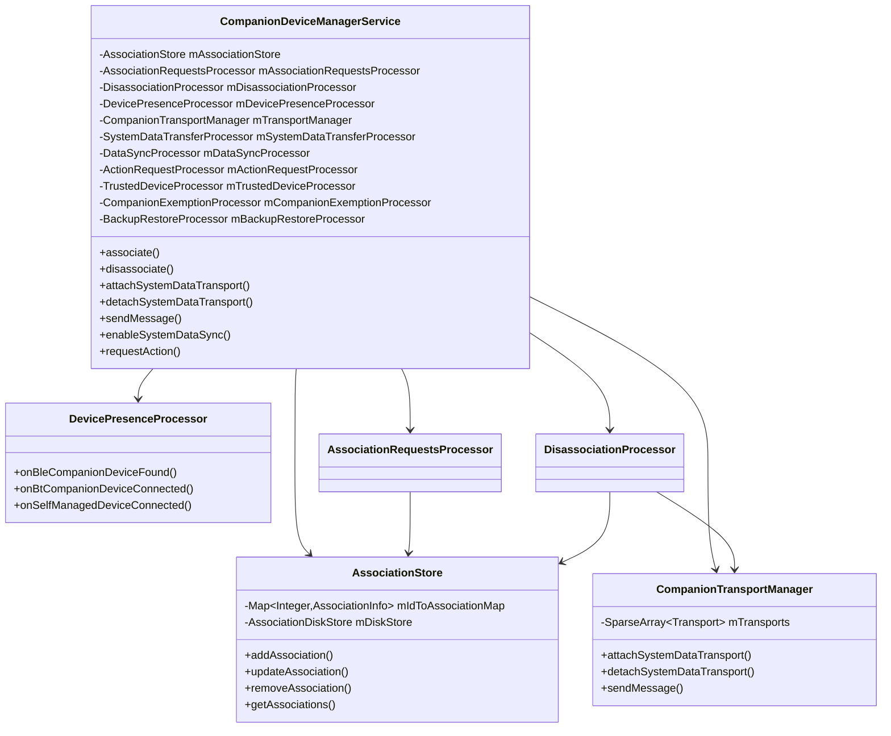
```mermaid
classDiagram
    class CompanionDeviceManagerService {
        -AssociationStore mAssociationStore
        -AssociationRequestsProcessor mAssociationRequestsProcessor
        -DisassociationProcessor mDisassociationProcessor
        -DevicePresenceProcessor mDevicePresenceProcessor
        -CompanionTransportManager mTransportManager
        -SystemDataTransferProcessor mSystemDataTransferProcessor
        -DataSyncProcessor mDataSyncProcessor
        -ActionRequestProcessor mActionRequestProcessor
        -TrustedDeviceProcessor mTrustedDeviceProcessor
        -CompanionExemptionProcessor mCompanionExemptionProcessor
        -BackupRestoreProcessor mBackupRestoreProcessor
        +associate()
        +disassociate()
        +attachSystemDataTransport()
        +detachSystemDataTransport()
        +sendMessage()
        +enableSystemDataSync()
        +requestAction()
    }

    class AssociationStore {
        -Map~Integer,AssociationInfo~ mIdToAssociationMap
        -AssociationDiskStore mDiskStore
        +addAssociation()
        +updateAssociation()
        +removeAssociation()
        +getAssociations()
    }

    class CompanionTransportManager {
        -SparseArray~Transport~ mTransports
        +attachSystemDataTransport()
        +detachSystemDataTransport()
        +sendMessage()
    }

    class DevicePresenceProcessor {
        +onBleCompanionDeviceFound()
        +onBtCompanionDeviceConnected()
        +onSelfManagedDeviceConnected()
    }

    CompanionDeviceManagerService --> AssociationStore
    CompanionDeviceManagerService --> CompanionTransportManager
    CompanionDeviceManagerService --> DevicePresenceProcessor
    CompanionDeviceManagerService --> AssociationRequestsProcessor
    CompanionDeviceManagerService --> DisassociationProcessor
    AssociationRequestsProcessor --> AssociationStore
    DisassociationProcessor --> AssociationStore
    DisassociationProcessor --> CompanionTransportManager
```

The processor fields are declared together in `CompanionDeviceManagerService`
(see `frameworks/base/services/companion/java/com/android/server/companion/CompanionDeviceManagerService.java`,
lines 154-170) and wired up in the constructor (lines 200-236), where each
processor receives the shared `AssociationStore` and `CompanionTransportManager`
so that all of them observe the same association set and the same transport
channels.

### 52.1.2 Permission Model

CDM enforces a strict permission model. The key permissions are declared as
static imports at the top of `CompanionDeviceManagerService.java`:

```java
import static android.Manifest.permission.ACCESS_COMPANION_INFO;
import static android.Manifest.permission.ACCESS_COMPANION_MESSAGE_PCC;
import static android.Manifest.permission.ASSOCIATE_COMPANION_DEVICES;
import static android.Manifest.permission.BLUETOOTH_CONNECT;
import static android.Manifest.permission.DELIVER_COMPANION_MESSAGES;
import static android.Manifest.permission.MANAGE_COMPANION_DEVICES;
import static android.Manifest.permission.REQUEST_COMPANION_SELF_MANAGED;
import static android.Manifest.permission.REQUEST_OBSERVE_COMPANION_DEVICE_PRESENCE;
import static android.Manifest.permission.USE_COMPANION_TRANSPORTS;
```

Source:
`frameworks/base/services/companion/java/com/android/server/companion/CompanionDeviceManagerService.java`, lines 20-28.

These map to distinct capabilities:

- **ASSOCIATE_COMPANION_DEVICES** -- required to create any new association.
- **REQUEST_COMPANION_SELF_MANAGED** -- required for self-managed associations
  (where the app manages transport rather than relying on MAC-address-based
  presence).

- **REQUEST_OBSERVE_COMPANION_DEVICE_PRESENCE** -- required to register for
  presence callbacks (BLE/BT notifications when the companion device appears
  or disappears).

- **USE_COMPANION_TRANSPORTS** -- required to attach a system data transport
  (file descriptor) for cross-device messaging.

- **DELIVER_COMPANION_MESSAGES** -- required to send messages through CDM
  transports.

- **MANAGE_COMPANION_DEVICES** -- system-level permission for shell commands
  and administrative operations.

- **ACCESS_COMPANION_INFO** -- required to query companion information for
  other users.

- **ACCESS_COMPANION_MESSAGE_PCC** -- added in Android 17; gates access to the
  Private Compute Core message path used by trusted-device and AI-agent flows.

### 52.1.3 Boot Sequence

`CompanionDeviceManagerService` is a `SystemService` that participates in the
standard server boot lifecycle. During `onBootPhase()`, the service:

1. Reads persisted association data from disk via `AssociationStore.refreshCache()`.
2. Initializes the `DevicePresenceProcessor` to start monitoring BLE/BT
   connections.

3. Registers with `CompanionTransportManager` for transport lifecycle events.
4. Sets up the `CrossDeviceSyncController` for call metadata sync.
5. Initializes the `SystemDataTransferProcessor` for permission sync.

The association data is stored in Device Encrypted (DE) storage, so it is
available before the user unlocks the device. This is explicit in the
`AssociationStore.refreshCache()` implementation:

```java
// The data is stored in DE directories, so we can read the data for all users now
// (which would not be possible if the data was stored to CE directories).
Map<Integer, Associations> userToAssociationsMap =
        mDiskStore.readAssociationsByUsers(userIds);
```

Source:
`frameworks/base/services/companion/java/com/android/server/companion/association/AssociationStore.java`, lines 177-180 (inside `refreshCache()` at line 164).

### 52.1.4 The Inner Binder Stub

The actual IPC endpoint is an inner class `CompanionDeviceManagerImpl` inside
`CompanionDeviceManagerService`. This class extends `ICompanionDeviceManager.Stub`
and routes each Binder call to the appropriate processor. For example, the
`associate()` call:

1. Validates the caller's identity and permissions.
2. Delegates to `AssociationRequestsProcessor.processNewAssociationRequest()`.

Similarly, `disassociate()` routes to `DisassociationProcessor.disassociate()`.

The service also publishes internal APIs via
`CompanionDeviceManagerServiceInternal`, which other system services can access
via `LocalServices`:

```
frameworks/base/services/companion/java/com/android/server/companion/
    CompanionDeviceManagerServiceInternal.java
```

### 52.1.5 Shell Command Interface

For debugging and testing, CDM exposes shell commands via:

```
frameworks/base/services/companion/java/com/android/server/companion/
    CompanionDeviceShellCommand.java
```

This enables operations like:

```bash
adb shell cmd companiondevice list 0
adb shell cmd companiondevice associate --userId 0 --package com.example.app \
    --mac AA:BB:CC:DD:EE:FF
adb shell cmd companiondevice disassociate 0 com.example.app AA:BB:CC:DD:EE:FF
```

---

## 52.2 Device Association and Discovery

### 52.2.1 Association Data Model

Every companion device relationship is represented by an `AssociationInfo` object.
The `AssociationInfo.Builder` reveals its fields (from
`AssociationRequestsProcessor.createAssociation()`):

```java
final AssociationInfo association =
        new AssociationInfo.Builder(id, userId, packageName)
                .setDeviceMacAddress(macAddress)
                .setDisplayName(displayName)
                .setDeviceProfile(deviceProfile)
                .setAssociatedDevice(associatedDevice)
                .setSelfManaged(selfManaged)
                .setNotifyOnDeviceNearby(false)
                .setRevoked(false)
                .setPending(false)
                .setTimeApproved(timestamp)
                .setLastTimeConnected(Long.MAX_VALUE)
                .setSystemDataSyncFlags(0)
                .setTransportFlags(transportFlags)
                .setDeviceIcon(deviceIcon)
                .setDeviceId(null)
                .setPackagesToNotify(null)
                .setMetadata(new PersistableBundle())
                .setExtraPermissions(extraPermissions)
                .setRemoteAiAgentSupported(isRemoteAiAgentSupported)
                .build();
```

Source:
`frameworks/base/services/companion/java/com/android/server/companion/association/AssociationRequestsProcessor.java`, lines 335-355.

The last two setters are new in Android 17: `setExtraPermissions()` carries an
optional set of permissions tied to the association, and
`setRemoteAiAgentSupported()` records whether the companion can host a remote AI
agent (used by the Computer Control flow in section 52.8). The value flows in
from `AssociationRequest.isRemoteAiAgentSupported()`.

Key fields:

| Field                  | Purpose                                                       |
|------------------------|---------------------------------------------------------------|
| `id`                   | Unique integer identifier, monotonically increasing           |
| `userId`               | The Android user who owns this association                    |
| `packageName`          | The companion app's package name                              |
| `deviceMacAddress`     | MAC address for hardware-based presence detection             |
| `displayName`          | Human-readable name for the companion device                  |
| `deviceProfile`        | Role-based profile (watch, glasses, app streaming, etc.)      |
| `selfManaged`          | If true, the app manages transport; no MAC-based monitoring   |
| `revoked`              | If true, the association is pending final cleanup              |
| `systemDataSyncFlags`  | Bitmask controlling what system data is synced                |
| `transportFlags`       | Flags controlling transport behavior                          |
| `deviceId`             | Optional `DeviceId` with custom ID and MAC                    |
| `extraPermissions`     | Android 17: extra permissions associated with the device      |
| `remoteAiAgentSupported` | Android 17: whether the companion can host a remote AI agent |

### 52.2.2 Device Profiles

Device profiles determine what permissions and roles are granted to the
companion app. The profiles with required user confirmation are defined in
`AssociationRequestsProcessor`:

```java
private static final Set<String> DEVICE_PROFILES_WITH_REQUIRED_CONFIRMATION = new ArraySet<>(
        Arrays.asList(
                AssociationRequest.DEVICE_PROFILE_APP_STREAMING,
                AssociationRequest.DEVICE_PROFILE_NEARBY_DEVICE_STREAMING));
```

Source:
`frameworks/base/services/companion/java/com/android/server/companion/association/AssociationRequestsProcessor.java`, lines 144-147.

The full set of device profiles includes:

- **DEVICE_PROFILE_WATCH** -- smartwatch companion
- **DEVICE_PROFILE_GLASSES** -- AR/VR glasses
- **DEVICE_PROFILE_APP_STREAMING** -- remote display/app streaming
- **DEVICE_PROFILE_NEARBY_DEVICE_STREAMING** -- nearby device projection
- **DEVICE_PROFILE_AUTOMOTIVE_PROJECTION** -- car head-unit projection
- **DEVICE_PROFILE_COMPUTER** -- desktop/laptop companion
- **DEVICE_PROFILE_WEARABLE_SENSING** -- wearable health/sensor devices
- **DEVICE_PROFILE_VIRTUAL_DEVICE** -- limited virtual-device role
  (`android.app.role.COMPANION_DEVICE_VIRTUAL_DEVICE`)
- **DEVICE_PROFILE_FITNESS_TRACKER** -- fitness band / tracker
  companion (flag `FLAG_BAND_DEVICE_PROFILE`)
- **DEVICE_PROFILE_MEDICAL** -- medical device companion (flag
  `FLAG_ENABLE_MEDICAL_PROFILE`)

The last two are flag-gated profiles present in both Android 16 and 17; they
stay behind their aconfig flags rather than being a 17 addition. Both are declared in
`frameworks/base/core/java/android/companion/AssociationRequest.java`,
each guarded by a `@FlaggedApi` annotation pointing at an aconfig flag in
`frameworks/base/core/java/android/companion/flags.aconfig`:
`DEVICE_PROFILE_FITNESS_TRACKER` maps to the role string
`android.app.role.COMPANION_DEVICE_FITNESS_TRACKER`, and `DEVICE_PROFILE_MEDICAL`
maps to `android.app.role.COMPANION_DEVICE_MEDICAL`.

Each profile maps to an Android Role. When an association is created, the
companion app is automatically granted the corresponding role (if it does not
already hold it):

```java
addRoleHolderForAssociation(mContext, association, success -> {
    if (success) {
        Slog.i(TAG, "Added " + deviceProfile + " role to userId="
                + association.getUserId() + ", packageName="
                + association.getPackageName());
        mAssociationStore.addAssociation(association);
        sendCallbackAndFinish(association, callback, resultReceiver);
    } else {
        Slog.e(TAG, "Failed to add u" + association.getUserId()
                + "\\" + association.getPackageName()
                + " to the list of " + deviceProfile + " holders.");
        sendCallbackAndFinish(null, callback, resultReceiver);
    }
});
```

Source:
`AssociationRequestsProcessor.java`, lines 390-403.

The role-to-permission mapping for each profile lives in
`frameworks/base/services/companion/java/com/android/server/companion/utils/RolesUtils.java`.
The two Android 17 profiles are handled differently there.
`DEVICE_PROFILE_FITNESS_TRACKER` is a *role alias*: a `ROLE_ALIASES` map points
it at `DEVICE_PROFILE_WATCH`, so a fitness tracker reuses the watch role and its
permission set (notifications, phone, call logs, SMS, contacts, calendar, nearby
devices, media output) rather than defining a separate role.
`DEVICE_PROFILE_MEDICAL` is its own role with a narrower set in
`PROFILE_PERMISSION_SETS`: post-notifications, nearby devices, schedule-exact-alarm,
and bypass-Do-Not-Disturb, reflecting that a medical companion needs to deliver
time-critical alerts but not the broad messaging access a watch gets.

### 52.2.3 The Association Flow

The association process has two variants: the **full flow** (with UI) and
the **No-UI flow** (for self-managed associations). The `AssociationRequestsProcessor`
Javadoc explains both:

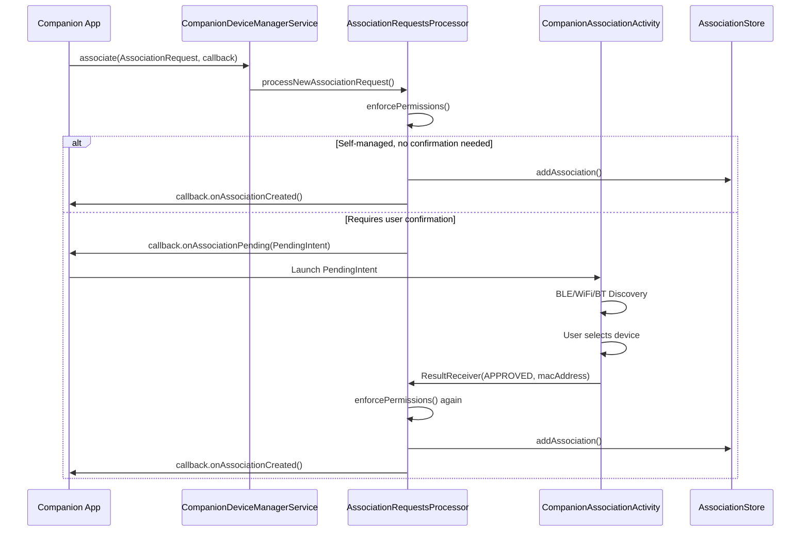
```mermaid
sequenceDiagram
    participant App as Companion App
    participant CDM as CompanionDeviceManagerService
    participant ARP as AssociationRequestsProcessor
    participant UI as CompanionAssociationActivity
    participant Store as AssociationStore

    App->>CDM: associate(AssociationRequest, callback)
    CDM->>ARP: processNewAssociationRequest()
    ARP->>ARP: enforcePermissions()

    alt Self-managed, no confirmation needed
        ARP->>Store: addAssociation()
        ARP->>App: callback.onAssociationCreated()
    else Requires user confirmation
        ARP->>App: callback.onAssociationPending(PendingIntent)
        App->>UI: Launch PendingIntent
        UI->>UI: BLE/WiFi/BT Discovery
        UI->>UI: User selects device
        UI->>ARP: ResultReceiver(APPROVED, macAddress)
        ARP->>ARP: enforcePermissions() again
        ARP->>Store: addAssociation()
        ARP->>App: callback.onAssociationCreated()
    end
```

The full flow implementation in `processNewAssociationRequest()`:

```java
public void processNewAssociationRequest(@NonNull AssociationRequest request,
        @NonNull String packageName, @UserIdInt int userId,
        @NonNull IAssociationRequestCallback callback) {
    // 1. Enforce permissions and other requirements.
    enforcePermissionForCreatingAssociation(mContext, request, packageUid);
    enforceUsesCompanionDeviceFeature(mContext, userId, packageName);

    // 2a. Check if association can be created without launching UI
    if (request.isSelfManaged() && !request.isForceConfirmation()
            && !DEVICE_PROFILES_WITH_REQUIRED_CONFIRMATION.contains(request.getDeviceProfile())
            && !willAddRoleHolder(request, packageName, userId)) {
        createAssociationAndNotifyApplication(request, packageName, userId,
                /* macAddress */ null, callback, /* resultReceiver */ null);
        return;
    }
    // ...
    // 2b. Build a PendingIntent for launching the confirmation UI
    request.setSkipPrompt(mayAssociateWithoutPrompt(packageName, userId));
    // ...
}
```

Source:
`AssociationRequestsProcessor.java`, lines 171-249 (the permission helpers
`enforcePermissionForCreatingAssociation` and `enforceUsesCompanionDeviceFeature`
are static imports from `com.android.server.companion.utils.PermissionsUtils`
and `PackageUtils`, a refactor introduced in Android 17).

### 52.2.4 Rate Limiting

The No-UI association path has built-in rate limiting to prevent abuse:

```java
private static final int ASSOCIATE_WITHOUT_PROMPT_MAX_PER_TIME_WINDOW = 5;
private static final long ASSOCIATE_WITHOUT_PROMPT_WINDOW_MS = 60 * 60 * 1000; // 60 min
```

The `mayAssociateWithoutPrompt()` method checks how many associations the
package has created within the last 60 minutes. If the count exceeds 5,
the prompt is enforced:

```java
if (++recent >= ASSOCIATE_WITHOUT_PROMPT_MAX_PER_TIME_WINDOW) {
    Slog.w(TAG, "Too many associations: " + packageName + " already "
            + "associated " + recent + " devices within the last "
            + ASSOCIATE_WITHOUT_PROMPT_WINDOW_MS + "ms");
    return false;
}
```

Source:
`AssociationRequestsProcessor.java`, lines 534-555 (the constants are declared at
lines 140-141).

### 52.2.5 AssociationStore -- Persistence and Change Notification

The `AssociationStore` is the central CRUD interface for association records.
It maintains an in-memory cache (`mIdToAssociationMap`) backed by disk storage
via `AssociationDiskStore`.

```
frameworks/base/services/companion/java/com/android/server/companion/association/
    AssociationStore.java
    AssociationDiskStore.java
    Associations.java
```

The store supports two types of change listeners:

1. **Local listeners** (`OnChangeListener`) -- used by other server-side
   components (DevicePresenceProcessor, TransportManager, etc.).

2. **Remote listeners** (`IOnAssociationsChangedListener`) -- used by apps
   via Binder.

Change types are enumerated:

```java
public static final int CHANGE_TYPE_ADDED = 0;
public static final int CHANGE_TYPE_REMOVED = 1;
public static final int CHANGE_TYPE_UPDATED_ADDRESS_CHANGED = 2;
public static final int CHANGE_TYPE_UPDATED_ADDRESS_UNCHANGED = 3;
public static final int CHANGE_TYPE_UPDATED_DATA_SYNC_TYPES = 4;
```

Source:
`AssociationStore.java`, lines 77-81. Android 17 adds
`CHANGE_TYPE_UPDATED_DATA_SYNC_TYPES`, fired when the per-association system
data sync flags change (see `DataSyncProcessor` in section 52.3.6).

The notification logic distinguishes between address-changing and non-changing
updates. Remote listeners are only notified for significant changes (add,
remove, address change) -- not for minor config tweaks:

```java
// Do NOT notify when UPDATED_ADDRESS_UNCHANGED, which means a minor tweak in
// association's configs, which "listeners" won't (and shouldn't) be able to see.
if (changeType != CHANGE_TYPE_UPDATED_ADDRESS_UNCHANGED) {
    mRemoteListeners.broadcast((listener, callbackUserId) -> { ... });
}
```

Source:
`AssociationStore.java`, lines 601-608.

Write operations are dispatched to a single-threaded executor to avoid blocking
the caller:

```java
private void writeCacheToDisk(@UserIdInt int userId) {
    mExecutor.execute(() -> {
        Associations associations = new Associations();
        synchronized (mLock) {
            associations.setMaxId(mMaxId);
            associations.setAssociations(
                    CollectionUtils.filter(mIdToAssociationMap.values().stream().toList(),
                            a -> a.getUserId() == userId));
        }
        mDiskStore.writeAssociationsForUser(userId, associations);
    });
}
```

Source:
`AssociationStore.java`, lines 325-336.

### 52.2.6 Disassociation

The `DisassociationProcessor` handles both user-initiated disassociation (via
the API) and automatic cleanup of idle self-managed associations.

```
frameworks/base/services/companion/java/com/android/server/companion/association/
    DisassociationProcessor.java
```

Disassociation reasons are tracked for debugging:

```java
public static final String REASON_REVOKED = "revoked";
public static final String REASON_SELF_IDLE = "self-idle";
public static final String REASON_SHELL = "shell";
public static final String REASON_LEGACY = "legacy";
public static final String REASON_API = "api";
public static final String REASON_PKG_DATA_CLEARED = "pkg-data-cleared";
```

Source:
`DisassociationProcessor.java`, lines 71-76.

A critical design aspect: if the companion app process is in the foreground
when disassociation is triggered, the actual removal is deferred. The
association is marked as "revoked" and an `OnUidImportanceListener` is
registered. When the process moves to the background, the cleanup completes:

```java
if (packageProcessImportance <= IMPORTANCE_FOREGROUND && deviceProfile != null
        && !isRoleInUseByOtherAssociations) {
    AssociationInfo revokedAssociation = (new AssociationInfo.Builder(
            association)).setRevoked(true).build();
    mAssociationStore.updateAssociation(revokedAssociation);
    startListening();
    return;
}
```

Source:
`DisassociationProcessor.java`, lines 160-174.

Self-managed associations are automatically removed after 90 days of inactivity:

```java
private static final long ASSOCIATION_REMOVAL_TIME_WINDOW_DEFAULT = DAYS.toMillis(90);
```

Source:
`DisassociationProcessor.java`, line 82.

The `InactiveAssociationsRemovalService` (a `JobService`) periodically invokes
`removeIdleSelfManagedAssociations()` to clean up stale entries.

### 52.2.7 Device Presence Monitoring

The `DevicePresenceProcessor` tracks whether companion devices are nearby or
connected:

```
frameworks/base/services/companion/java/com/android/server/companion/devicepresence/
    DevicePresenceProcessor.java
    BleDeviceProcessor.java
    BluetoothDeviceProcessor.java
    CompanionAppBinder.java
    CompanionServiceConnector.java
    ObservableUuid.java
    ObservableUuidStore.java
```

The processor handles multiple presence event types:

```java
EVENT_BLE_APPEARED
EVENT_BLE_DISAPPEARED
EVENT_BT_CONNECTED
EVENT_BT_DISCONNECTED
EVENT_SELF_MANAGED_APPEARED
EVENT_SELF_MANAGED_DISAPPEARED
EVENT_SELF_MANAGED_NEARBY
EVENT_SELF_MANAGED_NOT_NEARBY
EVENT_ASSOCIATION_REMOVED
```

When a companion device appears (via BLE scan or BT connection),
`DevicePresenceProcessor` can bind to the companion app's
`CompanionDeviceService`. This binding is managed by `CompanionAppBinder`
and `CompanionServiceConnector`, which handle the lifecycle of the
service connection across device presence changes.

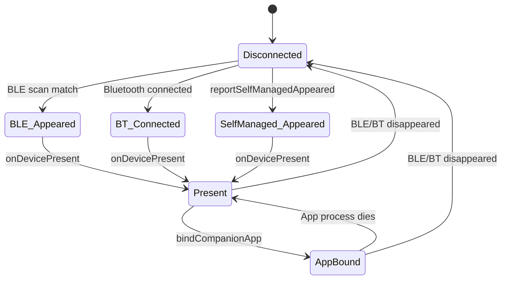
```mermaid
stateDiagram-v2
    [*] --> Disconnected
    Disconnected --> BLE_Appeared : BLE scan match
    Disconnected --> BT_Connected : Bluetooth connected
    BLE_Appeared --> Present : onDevicePresent
    BT_Connected --> Present : onDevicePresent
    Present --> AppBound : bindCompanionApp
    AppBound --> Present : App process dies
    Present --> Disconnected : BLE/BT disappeared
    AppBound --> Disconnected : BLE/BT disappeared
    Disconnected --> SelfManaged_Appeared : reportSelfManagedAppeared
    SelfManaged_Appeared --> Present : onDevicePresent
```

---

## 52.3 Data Transfer and Context Sync

### 52.3.1 Transport Architecture

The transport subsystem provides a bidirectional message channel between a local
Android device and its companion. The architecture is layered:

```
frameworks/base/services/companion/java/com/android/server/companion/transport/
    Transport.java              -- abstract base class
    RawTransport.java           -- unencrypted transport
    SecureTransport.java        -- UKEY2-encrypted transport
    CompanionTransportManager.java  -- lifecycle manager
    CryptoManager.java          -- cryptographic utilities
```

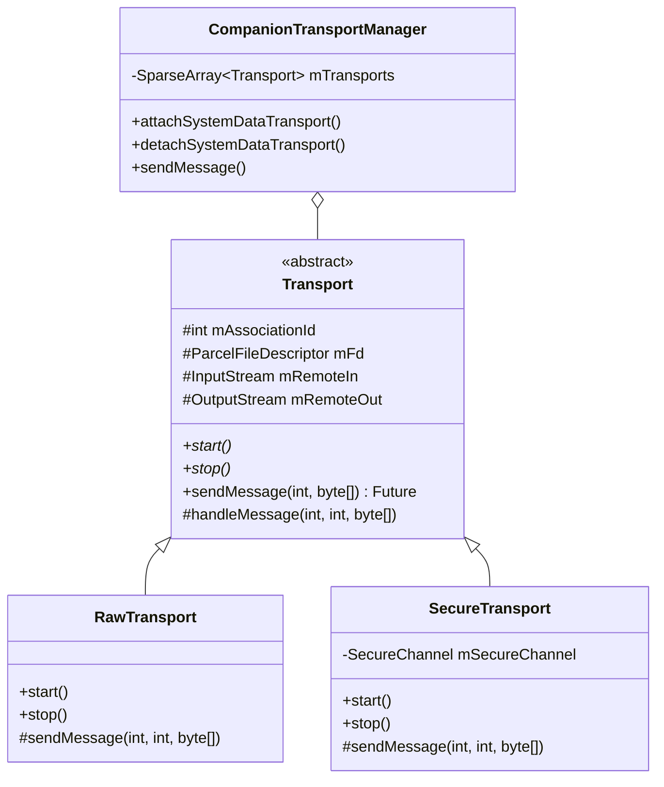
```mermaid
classDiagram
    class Transport {
        <<abstract>>
        #int mAssociationId
        #ParcelFileDescriptor mFd
        #InputStream mRemoteIn
        #OutputStream mRemoteOut
        +start()*
        +stop()*
        +sendMessage(int, byte[]) Future
        #handleMessage(int, int, byte[])
    }

    class RawTransport {
        +start()
        +stop()
        #sendMessage(int, int, byte[])
    }

    class SecureTransport {
        -SecureChannel mSecureChannel
        +start()
        +stop()
        #sendMessage(int, int, byte[])
    }

    class CompanionTransportManager {
        -SparseArray~Transport~ mTransports
        +attachSystemDataTransport()
        +detachSystemDataTransport()
        +sendMessage()
    }

    Transport <|-- RawTransport
    Transport <|-- SecureTransport
    CompanionTransportManager o-- Transport
```

### 52.3.2 Transport Protocol

The `Transport` base class defines a message protocol with a 12-byte header:

```java
protected static final int HEADER_LENGTH = 12;
```

Messages are classified by their top byte:

```java
private static boolean isRequest(int message) {
    return (message & 0xFF000000) == 0x63000000;
}

private static boolean isResponse(int message) {
    return (message & 0xFF000000) == 0x33000000;
}

private static boolean isOneway(int message) {
    return (message & 0xFF000000) == 0x43000000;
}
```

Source:
`Transport.java`, lines 133-143 (`HEADER_LENGTH = 12` is declared at line 77).

This classification determines message handling:

- **Request messages** (`0x63xxxxxx`) -- wait for a response from the remote.
  The sender gets a `CompletableFuture<byte[]>` that resolves when the response
  arrives.

- **Oneway messages** (`0x43xxxxxx`) -- fire-and-forget; the future resolves
  immediately upon sending.

- **Response messages** (`0x33xxxxxx`) -- complete a pending request's future.

The standard message types include:

```java
static final int MESSAGE_RESPONSE_SUCCESS = 0x33838567; // !SUC
static final int MESSAGE_RESPONSE_FAILURE = 0x33706573; // !FAI
```

And from `CompanionDeviceManager`:

| Constant                               | Type    | Purpose                            |
|----------------------------------------|---------|------------------------------------|
| `MESSAGE_REQUEST_PING`                 | Request | Connectivity check                 |
| `MESSAGE_REQUEST_PERMISSION_RESTORE`   | Request | Permission sync payload            |
| `MESSAGE_REQUEST_CONTEXT_SYNC`         | Request | Call metadata sync                 |
| `MESSAGE_REQUEST_REMOTE_AUTHENTICATION`| Request | Remote authentication exchange     |
| `MESSAGE_REQUEST_METADATA_UPDATE`      | Request | Metadata update                    |
| `MESSAGE_ONEWAY_PING`                 | Oneway  | Lightweight ping                   |
| `MESSAGE_ONEWAY_FROM_WEARABLE`        | Oneway  | Wearable-originated data           |
| `MESSAGE_ONEWAY_TO_WEARABLE`          | Oneway  | Data destined for wearable         |
| `MESSAGE_ONEWAY_TASK_CONTINUITY`      | Oneway  | Task handoff data                  |

The message handling pipeline in `Transport.handleMessage()`:

```java
protected final void handleMessage(int message, int sequence, @NonNull byte[] data)
        throws IOException {
    if (isOneway(message)) {
        processOneway(message, data);
    } else if (isRequest(message)) {
        try {
            processRequest(message, sequence, data);
        } catch (IOException e) {
            Slog.w(TAG, "Failed to respond to 0x" + Integer.toHexString(message), e);
        }
    } else if (isResponse(message)) {
        processResponse(message, sequence, data);
    } else {
        Slog.w(TAG, "Unknown message 0x" + Integer.toHexString(message));
    }
}
```

Source:
`Transport.java`, lines 335-356.

### 52.3.3 Transport Lifecycle

The `CompanionTransportManager` manages the lifecycle of transports per
association:

```java
/** Association id -> Transport */
@GuardedBy("mTransports")
private final SparseArray<Transport> mTransports = new SparseArray<>();
```

When a companion app calls `attachSystemDataTransport()`, the manager creates
the appropriate transport type based on build type and configuration:

```java
private Transport createTransport(AssociationInfo association,
        ParcelFileDescriptor fd, byte[] preSharedKey, int flags) {
    // If device is debug build, use hardcoded test key for authentication
    if (Build.isDebuggable()) {
        final byte[] testKey = "CDM".getBytes(StandardCharsets.UTF_8);
        return new SecureTransport(associationId, fd, mContext, testKey, null, 0);
    }

    // If either device is not Android, then use app-specific pre-shared key
    if (preSharedKey != null) {
        return new SecureTransport(associationId, fd, mContext, preSharedKey, null, 0);
    }

    // If none of the above applies, then use secure channel with attestation verification
    return new SecureTransport(associationId, fd, mContext, flags);
}
```

Source:
`CompanionTransportManager.java`, lines 322-356.

The transport type selection follows a priority:

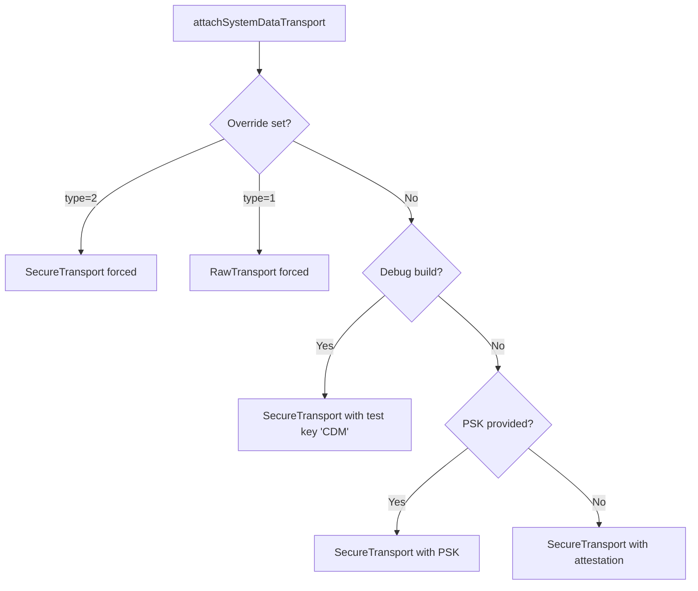
```mermaid
flowchart TD
    A[attachSystemDataTransport] --> B{Override set?}
    B -->|type=2| C[SecureTransport forced]
    B -->|type=1| D[RawTransport forced]
    B -->|No| E{Debug build?}
    E -->|Yes| F[SecureTransport with test key 'CDM']
    E -->|No| G{PSK provided?}
    G -->|Yes| H[SecureTransport with PSK]
    G -->|No| I[SecureTransport with attestation]
```

The manager also supports three categories of listeners:

1. **Message listeners** (`IOnMessageReceivedListener`) -- per message type.
2. **Event listeners** (`IOnTransportEventListener`) -- per association.
3. **Transports-changed listeners** (`IOnTransportsChangedListener`) -- for
   any transport attach/detach.

### 52.3.4 Secure Channel (UKEY2)

The `SecureChannel` class implements the encrypted communication layer using
Google's UKEY2 protocol:

```
frameworks/base/services/companion/java/com/android/server/companion/securechannel/
    SecureChannel.java
    AttestationVerifier.java
    AttestationVerificationException.java
    KeyStoreUtils.java
    SecureChannelException.java
```

The channel establishes security in three phases:

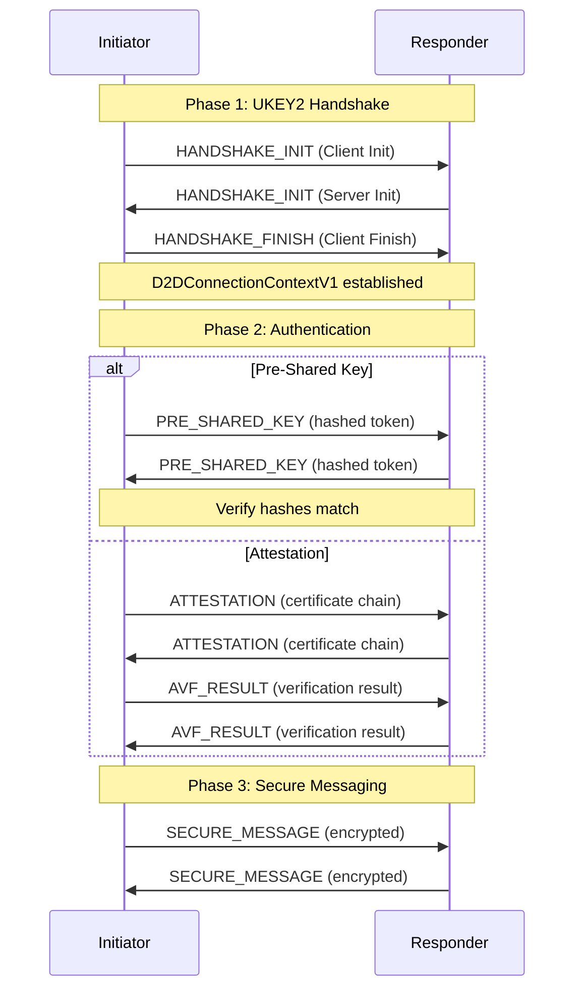
```mermaid
sequenceDiagram
    participant I as Initiator
    participant R as Responder

    Note over I,R: Phase 1: UKEY2 Handshake
    I->>R: HANDSHAKE_INIT (Client Init)
    R->>I: HANDSHAKE_INIT (Server Init)
    I->>R: HANDSHAKE_FINISH (Client Finish)
    Note over I,R: D2DConnectionContextV1 established

    Note over I,R: Phase 2: Authentication
    alt Pre-Shared Key
        I->>R: PRE_SHARED_KEY (hashed token)
        R->>I: PRE_SHARED_KEY (hashed token)
        Note over I,R: Verify hashes match
    else Attestation
        I->>R: ATTESTATION (certificate chain)
        R->>I: ATTESTATION (certificate chain)
        I->>R: AVF_RESULT (verification result)
        R->>I: AVF_RESULT (verification result)
    end

    Note over I,R: Phase 3: Secure Messaging
    I->>R: SECURE_MESSAGE (encrypted)
    R->>I: SECURE_MESSAGE (encrypted)
```

The message types are encoded as 2-byte values:

```java
private enum MessageType {
    HANDSHAKE_INIT(0x4849),   // HI
    HANDSHAKE_FINISH(0x4846), // HF
    PRE_SHARED_KEY(0x504b),   // PK
    ATTESTATION(0x4154),      // AT
    AVF_RESULT(0x5652),       // VR
    SECURE_MESSAGE(0x534d),   // SM
    UNKNOWN(0);               // X
}
```

Source:
`SecureChannel.java`, lines 652-659.

The channel handles a potential collision where both sides try to initiate
simultaneously. The resolution uses byte-level comparison of the Client Init
messages:

```java
// if received message is "larger" than the sent message, then reset the handshake context.
if (compareByteArray(mClientInit, handshakeMessage) < 0) {
    Slog.d(TAG, "Assigned: Responder");
    mHandshakeContext = null;
    return handshakeMessage;
} else {
    Slog.d(TAG, "Assigned: Initiator; Discarding received Client Init");
    // ...
}
```

Source:
`SecureChannel.java`, lines 416-437.

Pre-shared key authentication constructs a role-specific token by hashing the
role name concatenated with the key:

```java
private byte[] constructToken(D2DHandshakeContext.Role role, byte[] authValue)
        throws GeneralSecurityException {
    MessageDigest hash = MessageDigest.getInstance("SHA-256");
    String roleName = role == Role.INITIATOR ? "Initiator" : "Responder";
    byte[] roleUtf8 = roleName.getBytes(StandardCharsets.UTF_8);
    int tokenLength = roleUtf8.length + authValue.length;
    return hash.digest(ByteBuffer.allocate(tokenLength)
            .put(roleUtf8)
            .put(authValue)
            .array());
}
```

Source:
`SecureChannel.java`, lines 616-626.

### 52.3.5 Permission Sync

The `SystemDataTransferProcessor` manages the synchronization of runtime
permissions between paired devices:

```
frameworks/base/services/companion/java/com/android/server/companion/datatransfer/
    SystemDataTransferProcessor.java
    SystemDataTransferRequestStore.java
```

The permission sync flow:

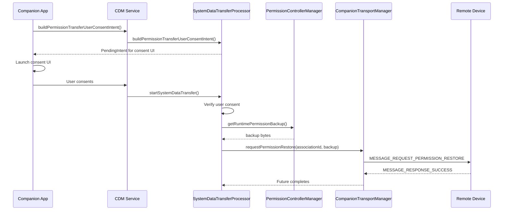
```mermaid
sequenceDiagram
    participant App as Companion App
    participant CDM as CDM Service
    participant SDTP as SystemDataTransferProcessor
    participant PC as PermissionControllerManager
    participant Transport as CompanionTransportManager
    participant Remote as Remote Device

    App->>CDM: buildPermissionTransferUserConsentIntent()
    CDM->>SDTP: buildPermissionTransferUserConsentIntent()
    SDTP-->>App: PendingIntent for consent UI

    App->>App: Launch consent UI
    App->>CDM: User consents
    CDM->>SDTP: startSystemDataTransfer()

    SDTP->>SDTP: Verify user consent
    SDTP->>PC: getRuntimePermissionBackup()
    PC-->>SDTP: backup bytes
    SDTP->>Transport: requestPermissionRestore(associationId, backup)
    Transport->>Remote: MESSAGE_REQUEST_PERMISSION_RESTORE
    Remote-->>Transport: MESSAGE_RESPONSE_SUCCESS
    Transport-->>SDTP: Future completes
```

The processor registers a message listener for incoming permission restore
requests:

```java
mTransportManager.addListener(MESSAGE_REQUEST_PERMISSION_RESTORE, messageListener);
```

When a permission restore message arrives on the receiving device, it applies
the permissions:

```java
private void onReceivePermissionRestore(byte[] message) {
    if (!Build.isDebuggable() && !mContext.getPackageManager().hasSystemFeature(
            FEATURE_WATCH)) {
        Slog.e(LOG_TAG, "Permissions restore is only available on watch.");
        return;
    }
    mPermissionControllerManager.stageAndApplyRuntimePermissionsBackup(
            message, user);
}
```

Source:
`SystemDataTransferProcessor.java`, lines 273-290.

Note the current restriction: permission restore is only available on watch
devices in production builds. This is a security measure to prevent unauthorized
permission escalation.

### 52.3.6 Metadata Synchronization (DataSync)

The `DataSyncProcessor` (copyright 2025) enables device metadata synchronization
between paired devices. Unlike permission sync (which transfers runtime
permissions), metadata sync exchanges arbitrary feature-keyed `PersistableBundle`
data:

```
frameworks/base/services/companion/java/com/android/server/companion/datasync/
    DataSyncProcessor.java
    LocalMetadataStore.java
```

The processor registers two listeners at construction time:

```java
public DataSyncProcessor(
        AssociationStore associationStore,
        LocalMetadataStore localMetadataStore,
        CompanionTransportManager transportManager) {
    // ...
    mTransportManager.addListener(MESSAGE_REQUEST_METADATA_UPDATE,
            new IOnMessageReceivedListener.Stub() {
                @Override
                public void onMessageReceived(int associationId, byte[] data) {
                    onReceiveMetadataUpdate(associationId, data);
                }
            });
    mTransportManager.addListener(
            new IOnTransportsChangedListener.Stub() {
                @Override
                public void onTransportsChanged(List<AssociationInfo> associations) {
                    broadcastMetadata(associations);
                }
            });
}
```

Source:
`DataSyncProcessor.java`, lines 62-86.

When a transport connects, the processor automatically broadcasts the local
device's metadata to all newly connected associations. The metadata is grouped
by user ID to ensure privacy:

```java
private void broadcastMetadata(List<AssociationInfo> associations) {
    SparseArray<List<AssociationInfo>> newAssociations = new SparseArray<>();
    synchronized (mAssociationsWithTransport) {
        // Isolate newly attached associations and group by user.
        for (AssociationInfo association : associations) {
            if (!mAssociationsWithTransport.contains(association.getId())) {
                int userId = association.getUserId();
                // ... add association to newAssociations.get(userId) ...
            }
        }
        // Update the set of associations with transport.
        mAssociationsWithTransport.clear();
        for (AssociationInfo association : associations) {
            mAssociationsWithTransport.add(association.getId());
        }
    }
    for (int i = 0; i < newAssociations.size(); i++) {
        sendMetadataUpdate(newAssociations.keyAt(i), newAssociations.valueAt(i));
    }
}
```

Source:
`DataSyncProcessor.java`, lines 183-209. (Android 17 rewrote this method to use
an explicit `SparseArray` grouping rather than the older stream-based collector.)

When metadata is received from a remote device, the payload is parsed and handed
to `setRemoteMetadata()`, which adds a timestamp and updates the association
record:

```java
private void onReceiveMetadataUpdate(int associationId, byte[] data) {
    PersistableBundle metadata;
    try {
        metadata = PersistableBundle.readFromStream(new ByteArrayInputStream(data));
    } catch (IOException e) {
        throw new RuntimeException("Failed to parse received metadata", e);
    }
    setRemoteMetadata(associationId, metadata);
}
```

Source:
`DataSyncProcessor.java`, lines 211-222. `setRemoteMetadata()` stamps the bundle
with `AssociationInfo.METADATA_TIMESTAMP` (line 149) before calling
`mAssociationStore.updateAssociation()`.

In Android 17 the `LocalMetadataStore` was reduced to a thin subclass of a shared
`PersistableBundleStore` helper in the `utils/` package. It only supplies the log
tag and the on-disk file name:

```java
public class LocalMetadataStore extends PersistableBundleStore {

    private static final String TAG = "CDM_LocalMetadataStore";
    // A binary file w/o file extension
    private static final String FILE_NAME = "cdm_local_metadata";

    public String getTag() { return TAG; }
    public String getFileName() { return FILE_NAME; }
}
```

Source:
`LocalMetadataStore.java` (the whole file is 46 lines). The cache-first read,
disk timeout, and per-user `SparseArray` caching now live in
`frameworks/base/services/companion/java/com/android/server/companion/utils/PersistableBundleStore.java`,
which both `LocalMetadataStore` and other CDM stores reuse.

The metadata sync architecture:

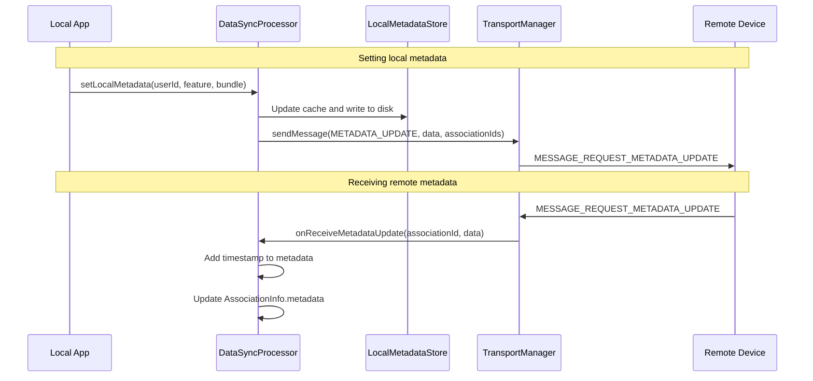
```mermaid
sequenceDiagram
    participant App as Local App
    participant DSP as DataSyncProcessor
    participant LMS as LocalMetadataStore
    participant TM as TransportManager
    participant Remote as Remote Device

    Note over App,Remote: Setting local metadata
    App->>DSP: setLocalMetadata(userId, feature, bundle)
    DSP->>LMS: Update cache and write to disk
    DSP->>TM: sendMessage(METADATA_UPDATE, data, associationIds)
    TM->>Remote: MESSAGE_REQUEST_METADATA_UPDATE

    Note over App,Remote: Receiving remote metadata
    Remote->>TM: MESSAGE_REQUEST_METADATA_UPDATE
    TM->>DSP: onReceiveMetadataUpdate(associationId, data)
    DSP->>DSP: Add timestamp to metadata
    DSP->>DSP: Update AssociationInfo.metadata
```

### 52.3.7 Cross-Device Call Sync

The `CrossDeviceSyncController` enables call metadata to be synchronized
between paired devices. This allows a smartwatch to show incoming calls from the
phone, or a phone to display calls from a wearable:

```
frameworks/base/services/companion/java/com/android/server/companion/datatransfer/contextsync/
    CrossDeviceSyncController.java
    CallMetadataSyncData.java
    CallMetadataSyncConnectionService.java
    CallMetadataSyncInCallService.java
    CrossDeviceCall.java
    CrossDeviceSyncControllerCallback.java
```

The controller manages:

- **Phone account registration** -- creating virtual phone accounts for
  remote devices.

- **Call metadata exchange** -- syncing call state, caller info, and
  facilitator data via `MESSAGE_REQUEST_CONTEXT_SYNC`.

- **Bidirectional call control** -- allowing either device to answer, reject,
  or end calls.

### 52.3.8 Task Continuity

The `TaskContinuityManagerService` enables seamless task handoff between paired
devices. It was restructured in Android 17 around a per-user `HandoffController`:

```
frameworks/base/services/companion/java/com/android/server/companion/datatransfer/continuity/
    TaskContinuityManagerService.java
    FeatureController.java
    MultiUserResourceCache.java
    connectivity/
    handoff/      -- HandoffController, In/OutboundHandoffRequestHandler
    messages/     -- HandoffRequestMessage, HandoffRequestResultMessage, etc.
    settings/     -- HandoffPreferenceStore, HandoffSettingsManager
    tasks/        -- TaskBroadcaster, RemoteTaskFactory, RemoteTaskListenerHolder
```

The service is a plain `SystemService`. Its handoff state is kept in a
`MultiUserResourceCache<HandoffController>`, with per-user enablement preferences
in a `HandoffPreferenceStore`/`HandoffSettingsManager`:

```java
public final class TaskContinuityManagerService extends SystemService {

    private final MultiUserResourceCache<HandoffController> mHandoffControllerCache;
    private HandoffPreferenceStore mHandoffPreferenceStore;
    private HandoffSettingsManager mHandoffSettingsManager;
    private TaskContinuityManagerServiceImpl mTaskContinuityManagerService;
    // ...
}
```

Source:
`TaskContinuityManagerService.java`, lines 45-60. (Android 17 replaced the older
single-instance `InboundHandoffRequestController`/`OutboundHandoffRequestController`
fields with per-association handlers owned by each `HandoffController`, and the
`UniversalClipboardService` was removed from this package.)

In `onStart()` the service publishes a binder service under
`Context.TASK_CONTINUITY_SERVICE` and provides APIs for:

- **Registering remote task listeners** (requires `READ_REMOTE_TASKS`, enforced
  via `@EnforcePermission(READ_REMOTE_TASKS)` on the inner stub).

- **Requesting task handoff** (requires `REQUEST_TASK_HANDOFF`).

Task continuity messages flow through the CDM transport using
`MESSAGE_ONEWAY_TASK_CONTINUITY`. The concrete message types live under
`messages/` and include `HandoffRequestMessage` / `HandoffRequestResultMessage`
(request/response for a task transfer), `HandoffActivityDataMessage` (the activity
payload to resume), `TaskStackBroadcastMessage` (remote task-stack
synchronization), and `RemoteTaskInfo` (a single remote task descriptor). The
per-association request flow is driven by `InboundHandoffRequestHandler` and
`OutboundHandoffRequestHandler` in `handoff/`.

---

## 52.4 VirtualDeviceManager

### 52.4.1 Service Architecture

The `VirtualDeviceManagerService` is the system service that manages virtual
devices. It lives alongside CDM but serves a different purpose: while CDM
manages the _association_ with companion hardware, VDM manages the _virtual
representation_ of that hardware within the Android framework.

```
frameworks/base/services/companion/java/com/android/server/companion/virtual/
    VirtualDeviceManagerService.java   (~1334 lines)
    VirtualDeviceImpl.java             (~2087 lines)
    VirtualDeviceShellCommand.java
    GenericWindowPolicyController.java (~587 lines)
    InputController.java               (~272 lines)
    SensorController.java              (~392 lines)
    CameraAccessController.java        (~345 lines)
    VirtualDeviceLog.java
    PermissionUtils.java
    ViewConfigurationController.java
    audio/
    camera/
    computercontrol/   -- Computer Control sessions (covered in section 52.8)
```

The service architecture:

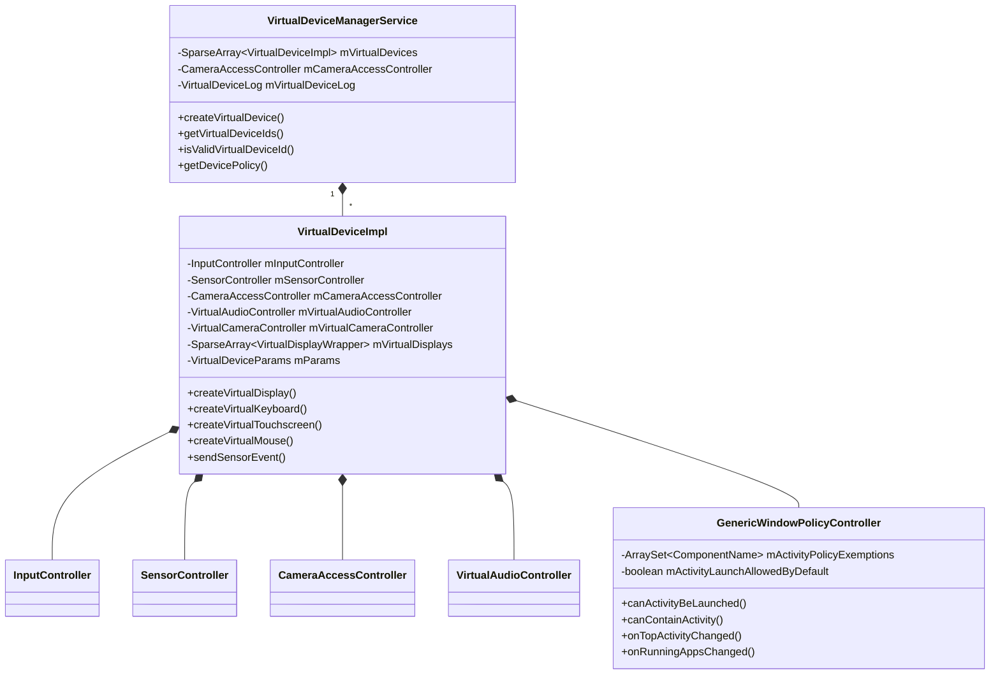
```mermaid
classDiagram
    class VirtualDeviceManagerService {
        -SparseArray~VirtualDeviceImpl~ mVirtualDevices
        -CameraAccessController mCameraAccessController
        -VirtualDeviceLog mVirtualDeviceLog
        +createVirtualDevice()
        +getVirtualDeviceIds()
        +isValidVirtualDeviceId()
        +getDevicePolicy()
    }

    class VirtualDeviceImpl {
        -InputController mInputController
        -SensorController mSensorController
        -CameraAccessController mCameraAccessController
        -VirtualAudioController mVirtualAudioController
        -VirtualCameraController mVirtualCameraController
        -SparseArray~VirtualDisplayWrapper~ mVirtualDisplays
        -VirtualDeviceParams mParams
        +createVirtualDisplay()
        +createVirtualKeyboard()
        +createVirtualTouchscreen()
        +createVirtualMouse()
        +sendSensorEvent()
    }

    class GenericWindowPolicyController {
        -ArraySet~ComponentName~ mActivityPolicyExemptions
        -boolean mActivityLaunchAllowedByDefault
        +canActivityBeLaunched()
        +canContainActivity()
        +onTopActivityChanged()
        +onRunningAppsChanged()
    }

    VirtualDeviceManagerService "1" *-- "*" VirtualDeviceImpl
    VirtualDeviceImpl *-- InputController
    VirtualDeviceImpl *-- SensorController
    VirtualDeviceImpl *-- CameraAccessController
    VirtualDeviceImpl *-- VirtualAudioController
    VirtualDeviceImpl *-- GenericWindowPolicyController
```

### 52.4.2 Virtual Device Creation

Creating a virtual device requires an existing CDM association. The
`VirtualDeviceManagerService` validates this relationship during creation.

The service exposes its Binder interface via an inner `LocalService` class and
a public Binder stub. The creation flow:

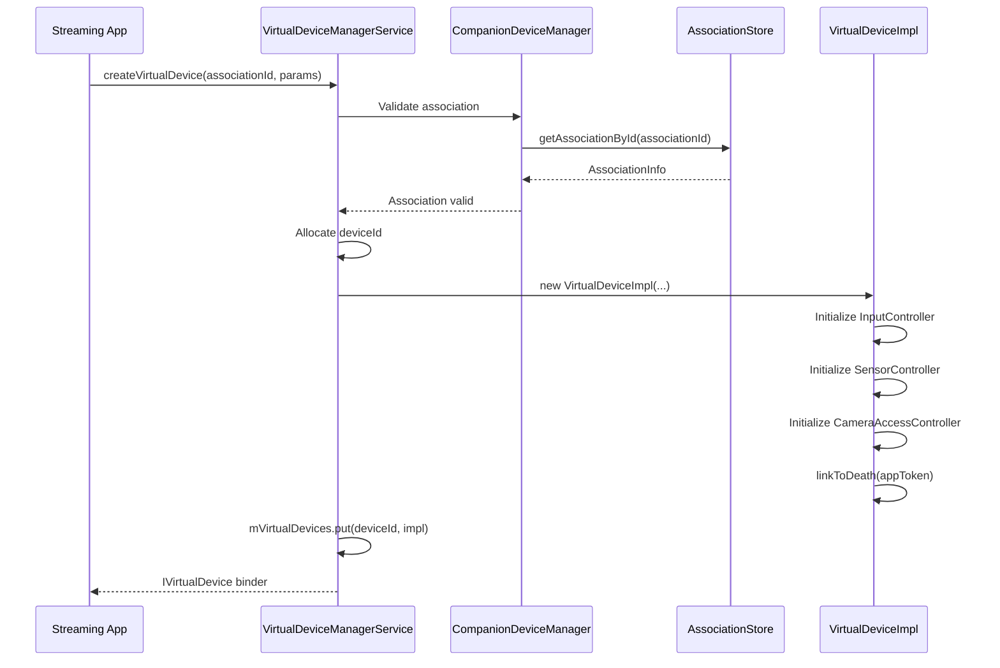
```mermaid
sequenceDiagram
    participant App as Streaming App
    participant VDM as VirtualDeviceManagerService
    participant CDM as CompanionDeviceManager
    participant Store as AssociationStore
    participant Impl as VirtualDeviceImpl

    App->>VDM: createVirtualDevice(associationId, params)
    VDM->>CDM: Validate association
    CDM->>Store: getAssociationById(associationId)
    Store-->>CDM: AssociationInfo
    CDM-->>VDM: Association valid

    VDM->>VDM: Allocate deviceId
    VDM->>Impl: new VirtualDeviceImpl(...)
    Impl->>Impl: Initialize InputController
    Impl->>Impl: Initialize SensorController
    Impl->>Impl: Initialize CameraAccessController
    Impl->>Impl: linkToDeath(appToken)

    VDM->>VDM: mVirtualDevices.put(deviceId, impl)
    VDM-->>App: IVirtualDevice binder
```

### 52.4.3 VirtualDeviceImpl -- The Device Instance

`VirtualDeviceImpl` (~2,087 lines in Android 17) is the concrete implementation
of a single virtual device. It extends `IVirtualDevice.Stub` and implements
`IBinder.DeathRecipient` to auto-cleanup when the owning app dies.

The constructor initializes all subsystem controllers:

```java
VirtualDeviceImpl(
        @NonNull Context context,
        @Nullable AssociationInfo associationInfo,
        @NonNull VirtualDeviceManagerService service,
        @NonNull VirtualDeviceLog virtualDeviceLog,
        @NonNull IBinder token,
        @NonNull AttributionSource attributionSource,
        int deviceId,
        @DeviceProfile int deviceProfile,
        @Nullable CameraAccessController cameraAccessController,
        @NonNull PendingTrampolineCallback pendingTrampolineCallback,
        @NonNull IVirtualDeviceActivityListener activityListener,
        @Nullable IVirtualDeviceSoundEffectListener soundEffectListener,
        @NonNull VirtualDeviceParams params) {
```

Source:
`VirtualDeviceImpl.java`, lines 489-502. In Android 17 `associationInfo` is now
`@Nullable` (a virtual device can be created without a CDM association under the
right permissions) and a `@DeviceProfile int deviceProfile` parameter was added.

Key initialization details:

1. **Default display flags** for all virtual displays on this device:

    ```java
    private static final int DEFAULT_VIRTUAL_DISPLAY_FLAGS =
            DisplayManager.VIRTUAL_DISPLAY_FLAG_TOUCH_FEEDBACK_DISABLED
                    | DisplayManager.VIRTUAL_DISPLAY_FLAG_DESTROY_CONTENT_ON_REMOVAL
                    | DisplayManager.VIRTUAL_DISPLAY_FLAG_SUPPORTS_TOUCH
                    | DisplayManager.VIRTUAL_DISPLAY_FLAG_OWN_FOCUS;
    ```

    Source:
    `VirtualDeviceImpl.java`, lines 176-180.

2. **Persistent device ID** is derived from the CDM association:

    ```java
    static String createPersistentDeviceId(int associationId) {
        return PERSISTENT_ID_PREFIX_CDM_ASSOCIATION + associationId;
    }
    ```

    Source:
    `VirtualDeviceImpl.java`, lines 680-682.

3. **Device policies** are copied from `VirtualDeviceParams`:

    ```java
    mDevicePolicies = params.getDevicePolicies();
    ```

    These policies control behavior across multiple dimensions:

    - `POLICY_TYPE_ACTIVITY` -- which activities can launch
    - `POLICY_TYPE_AUDIO` -- audio routing behavior
    - `POLICY_TYPE_CAMERA` -- camera access policy
    - `POLICY_TYPE_CLIPBOARD` -- clipboard isolation
    - `POLICY_TYPE_RECENTS` -- whether tasks appear in recents
    - `POLICY_TYPE_BLOCKED_ACTIVITY` -- explicitly blocked activities

### 52.4.4 Device Policy Engine

The `VirtualDeviceParams` defines two policy modes:

- `DEVICE_POLICY_DEFAULT` -- framework default behavior applies.
- `DEVICE_POLICY_CUSTOM` -- the app specifies an allowlist or blocklist.

For activity launching, the policy is enforced by the
`GenericWindowPolicyController`. The VDM owner can dynamically update policies:

```java
void setActivityLaunchDefaultAllowed(boolean activityLaunchDefaultAllowed) {
    synchronized (mGenericWindowPolicyControllerLock) {
        if (mActivityLaunchAllowedByDefault != activityLaunchDefaultAllowed) {
            mActivityPolicyExemptions.clear();
            mActivityPolicyPackageExemptions.clear();
        }
        mActivityLaunchAllowedByDefault = activityLaunchDefaultAllowed;
    }
}
```

### 52.4.5 Activity Listening and Intent Interception

The `VirtualDeviceImpl` sets up a `GwpcActivityListener` that bridges
between the `GenericWindowPolicyController`'s callbacks and the client app:

```java
private class GwpcActivityListener implements GenericWindowPolicyController.ActivityListener {

    @Override
    public void onTopActivityChanged(int displayId, @NonNull ComponentName topActivity,
            @UserIdInt int userId) {
        try {
            mActivityListener.onTopActivityChanged(displayId, topActivity, userId);
        } catch (RemoteException e) {
            Slog.w(TAG, "Unable to call mActivityListener for display: " + displayId, e);
        }
    }

    @Override
    public void onDisplayEmpty(int displayId) {
        try {
            mActivityListener.onDisplayEmpty(displayId);
        } catch (RemoteException e) {
            Slog.w(TAG, "Unable to call mActivityListener for display: " + displayId, e);
        }
    }
    // ...
}
```

Source:
`VirtualDeviceImpl.java`, lines 310-330.

The intent interception mechanism allows the VDM owner to intercept specific
intents launched on virtual displays:

```java
@GuardedBy("mIntentInterceptors")
private final Map<IBinder, IntentFilter> mIntentInterceptors = new ArrayMap<>();
```

When an activity launch matches a registered filter, the launch is aborted
and the `IVirtualDeviceIntentInterceptor` callback fires with a sanitized
intent (containing only action and data, for privacy):

```java
IVirtualDeviceIntentInterceptor.Stub.asInterface(interceptor.getKey())
        .onIntentIntercepted(
                new Intent(intent.getAction(), intent.getData()));
```

Source:
`VirtualDeviceImpl.java`, lines 423-425.

### 52.4.6 Running Apps Tracking

The `GwpcActivityListener.onRunningAppsChanged()` callback maintains a
per-display and aggregate set of running UID/package pairs:

```java
@GuardedBy("mVirtualDeviceLock")
private final SparseArray<ArraySet<Pair<Integer, String>>> mRunningUidPackagePairsPerDisplay =
        new SparseArray<>();
@GuardedBy("mVirtualDeviceLock")
private ArraySet<Pair<Integer, String>> mAllRunningUidPackagePairs = new ArraySet<>();
```

Source:
`VirtualDeviceImpl.java`, lines 281-284.

When the set changes, it notifies multiple subsystems:

```java
mService.onRunningAppsChanged(
        mDeviceId, mOwnerPackageName, runningUids, newAllRunningUidPackagePairs);
if (mVirtualAudioController != null) {
    mVirtualAudioController.onRunningAppsChanged(runningUids);
}
if (mCameraAccessController != null) {
    mCameraAccessController.blockCameraAccessIfNeeded(runningUids);
}
```

Source:
`VirtualDeviceImpl.java`, lines 467-474.

### 52.4.7 Power Management

Virtual devices have their own power state, independent of the physical device.
The implementation handles lockdown (when the physical device is locked) and
explicit wake/sleep requests:

```java
void onLockdownChanged(boolean lockdownActive) {
    synchronized (mPowerLock) {
        if (lockdownActive != mLockdownActive) {
            mLockdownActive = lockdownActive;
            if (mLockdownActive) {
                goToSleepInternal(PowerManager.GO_TO_SLEEP_REASON_DISPLAY_GROUPS_TURNED_OFF);
            } else if (mRequestedToBeAwake) {
                wakeUpInternal(PowerManager.WAKE_REASON_DISPLAY_GROUP_TURNED_ON,
                        "android.server.companion.virtual:LOCKDOWN_ENDED");
            }
        }
    }
}
```

Source:
`VirtualDeviceImpl.java`, lines 647-659.

The `LOCK_STATE_ALWAYS_UNLOCKED` option requires the
`ADD_ALWAYS_UNLOCKED_DISPLAY` permission and sets the
`VIRTUAL_DISPLAY_FLAG_ALWAYS_UNLOCKED` flag on all displays.

### 52.4.8 Mirror Displays

VDM supports mirror displays for screen sharing use cases. Creating mirror
displays requires specific device profiles and permissions:

```java
private static final List<Integer> DEVICE_PROFILES_ALLOWING_MIRROR_DISPLAYS = List.of(
        VirtualDevice.DEVICE_PROFILE_APP_STREAMING);
```

Source:
`VirtualDeviceImpl.java`, lines 184-185. (In Android 17 the list is keyed by the
integer `VirtualDevice.DEVICE_PROFILE_*` constants rather than the string
`AssociationRequest.DEVICE_PROFILE_*` names.)

After Android Baklava, the `ADD_MIRROR_DISPLAY` permission is required instead
of relying on the app streaming role:

```java
@ChangeId
@EnabledAfter(targetSdkVersion = Build.VERSION_CODES.BAKLAVA)
public static final long CHECK_ADD_MIRROR_DISPLAY_PERMISSION = 378605160L;
```

Source:
`VirtualDeviceImpl.java`, lines 172-174.

### 52.4.9 Death Handling and Cleanup

Since `VirtualDeviceImpl` implements `IBinder.DeathRecipient`, it is notified
when the owning app process dies:

```java
try {
    token.linkToDeath(this, 0);
} catch (RemoteException e) {
    throw e.rethrowFromSystemServer();
}
```

Source:
`VirtualDeviceImpl.java`, lines 615-619.

When the death callback fires, the device performs a comprehensive cleanup:
closing all virtual displays, releasing all input devices, stopping the audio
controller, removing sensors, closing camera injection sessions, and
unregistering from the service's device map.

---

## 52.5 Virtual Device Subsystems

### 52.5.1 InputController

The `InputController` manages the lifecycle of virtual input devices on a
virtual device:

```
frameworks/base/services/companion/java/com/android/server/companion/virtual/
    InputController.java
```

It creates and tracks virtual input devices via `InputManagerInternal`:

```java
final class InputController {
    @GuardedBy("mLock")
    private final ArrayMap<IBinder, VirtualInputDevice> mInputDevices = new ArrayMap<>();

    private final InputManagerInternal mInputManagerInternal;
    private final InputManager mInputManager;
    private final WindowManager mWindowManager;
```

Source:
`InputController.java`, lines 55-65.

The controller supports seven types of virtual input devices:

| Method                      | Device Type              | Metrics Counter Key                                      |
|-----------------------------|--------------------------|----------------------------------------------------------|
| `createDpad()`              | Virtual D-pad            | `virtual_devices.value_virtual_dpad_created_count`       |
| `createKeyboard()`          | Virtual Keyboard         | `virtual_devices.value_virtual_keyboard_created_count`   |
| `createMouse()`             | Virtual Mouse            | `virtual_devices.value_virtual_mouse_created_count`      |
| `createTouchscreen()`       | Virtual Touchscreen      | `virtual_devices.value_virtual_touchscreen_created_count`|
| `createNavigationTouchpad()`| Navigation Touchpad      | `virtual_devices.value_virtual_navigationtouchpad_created_count` |
| `createStylus()`            | Virtual Stylus           | `virtual_devices.value_virtual_stylus_created_count`     |
| `createRotaryEncoder()`     | Rotary Encoder           | `virtual_devices.value_virtual_rotary_created_count`     |

Each creation follows the same pattern:

```java
IVirtualKeyboard createKeyboard(@NonNull IBinder token, @NonNull VirtualKeyboardConfig config)
        throws RemoteException {
    IVirtualKeyboard device = mInputManagerInternal.createVirtualKeyboard(token, config);
    Counter.logIncrementWithUid("virtual_devices.value_virtual_keyboard_created_count",
            mAttributionSource.getUid());
    addDevice(token, device.getInputDeviceId(), config);
    return device;
}
```

Source:
`InputController.java`, lines 102-109.

The `close()` method iterates over all tracked devices and closes them via
`InputManagerInternal`:

```java
void close() {
    mInputManager.unregisterInputDeviceListener(mInputDeviceListener);
    synchronized (mLock) {
        final Iterator<Map.Entry<IBinder, VirtualInputDevice>> iterator =
                mInputDevices.entrySet().iterator();
        while (iterator.hasNext()) {
            final Map.Entry<IBinder, VirtualInputDevice> entry = iterator.next();
            final IBinder token = entry.getKey();
            iterator.remove();
            mInputManagerInternal.closeVirtualInputDevice(token);
        }
    }
}
```

Source:
`InputController.java`, lines 79-91.

Additional display-level settings are managed through the controller:

```java
void setShowPointerIcon(boolean visible, int displayId);
void setMouseScalingEnabled(boolean enabled, int displayId);
void setDisplayEligibilityForPointerCapture(boolean isEligible, int displayId);
void setDisplayImePolicy(int displayId, @WindowManager.DisplayImePolicy int policy);
```

Android 17 ships a concrete consumer of this virtual-input machinery as a
platform app. `packages/apps/VirtualGamepad/` is a platform-signed Jetpack
Compose app that draws an on-screen gamepad and synthesizes gamepad input for a
game running on the same display. Rather than going through a `VirtualDevice`,
it talks to the input stack directly via the public
`InputManager.createVirtualGamepad(VirtualGamepadConfig)` entry point (declared
in `frameworks/base/core/java/android/hardware/input/InputManager.java`), which
backs onto the same `createVirtual*` device family this section describes. Its
`LocalGamepadBackend` builds the `VirtualGamepadConfig` with the activity's
`displayId` as `associatedDisplayId`, then pushes `VirtualGamepadMotionEvent`
and `VirtualKeyEvent` objects through the returned `VirtualGamepad` handle (see
`packages/apps/VirtualGamepad/java/com/android/virtualgamepad/backend/LocalGamepadBackend.kt`).
The app holds `INJECT_EVENTS` and `ASSOCIATE_INPUT_DEVICE_TO_DISPLAY`, and
finishes itself when a physical gamepad is connected. It is a thin client of the
virtual-input APIs covered here, not a separate subsystem.

### 52.5.2 SensorController

The `SensorController` manages virtual sensors that can feed sensor data from
a companion device into the Android sensor framework:

```
frameworks/base/services/companion/java/com/android/server/companion/virtual/
    SensorController.java
```

The controller creates "runtime sensors" via `SensorManagerInternal`:

```java
final int handle = mSensorManagerInternal.createRuntimeSensor(mVirtualDeviceId,
        config.getType(), config.getName(),
        config.getVendor() == null ? "" : config.getVendor(), config.getMaximumRange(),
        config.getResolution(), config.getPower(), config.getMinDelay(),
        config.getMaxDelay(), config.getFlags(), mRuntimeSensorCallback);
```

Source:
`SensorController.java`, lines 132-136.

Each sensor is tracked by two data structures:

```java
@GuardedBy("mLock")
private final ArrayMap<IBinder, SensorDescriptor> mSensorDescriptors = new ArrayMap<>();

@GuardedBy("mLock")
private SparseArray<VirtualSensor> mVirtualSensors = new SparseArray<>();
```

The `SensorDescriptor` is a simple value class:

```java
static final class SensorDescriptor {
    private final int mHandle;
    private final int mType;
    private final String mName;
}
```

Source:
`SensorController.java`, lines 356-365.

Sending sensor events goes through the native sensor infrastructure:

```java
boolean sendSensorEvent(@NonNull IBinder token, @NonNull VirtualSensorEvent event) {
    synchronized (mLock) {
        final SensorDescriptor sensorDescriptor = mSensorDescriptors.get(token);
        return mSensorManagerInternal.sendSensorEvent(
                sensorDescriptor.getHandle(), sensorDescriptor.getType(),
                event.getTimestampNanos(), event.getValues());
    }
}
```

Source:
`SensorController.java`, lines 157-169.

The controller also supports sensor additional info (e.g., calibration data):

```java
boolean sendSensorAdditionalInfo(@NonNull IBinder token,
        @NonNull VirtualSensorAdditionalInfo info) {
    // Wraps additional info in FRAME_BEGIN / data / FRAME_END
    mSensorManagerInternal.sendSensorAdditionalInfo(
            sensorDescriptor.getHandle(), SensorAdditionalInfo.TYPE_FRAME_BEGIN, ...);
    for (int i = 0; i < info.getValues().size(); ++i) {
        mSensorManagerInternal.sendSensorAdditionalInfo(
                sensorDescriptor.getHandle(), info.getType(), /* serial= */ i, ...);
    }
    mSensorManagerInternal.sendSensorAdditionalInfo(
            sensorDescriptor.getHandle(), SensorAdditionalInfo.TYPE_FRAME_END, ...);
}
```

Source:
`SensorController.java`, lines 171-200.

The `RuntimeSensorCallbackWrapper` bridges framework sensor configuration
requests back to the VDM client:

```java
private final class RuntimeSensorCallbackWrapper
        implements SensorManagerInternal.RuntimeSensorCallback {

    @Override
    public int onConfigurationChanged(int handle, boolean enabled,
            int samplingPeriodMicros, int batchReportLatencyMicros) {
        VirtualSensor sensor = mVdmInternal.getVirtualSensor(mVirtualDeviceId, handle);
        mCallback.onConfigurationChanged(sensor, enabled, samplingPeriodMicros,
                batchReportLatencyMicros);
        return OK;
    }
}
```

Source:
`SensorController.java`, lines 247-281.

Direct sensor channels are also supported, allowing high-rate sensor data to
be shared via shared memory:

```java
@Override
public int onDirectChannelCreated(ParcelFileDescriptor fd) {
    SharedMemory sharedMemory = SharedMemory.fromFileDescriptor(fd);
    final int channelHandle = sNextDirectChannelHandle.getAndIncrement();
    mCallback.onDirectChannelCreated(channelHandle, sharedMemory);
    return channelHandle;
}
```

Source:
`SensorController.java`, lines 284-307.

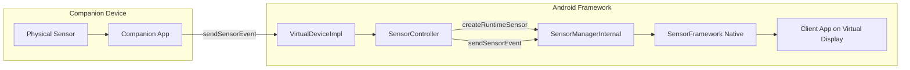
```mermaid
flowchart LR
    subgraph "Companion Device"
        HW[Physical Sensor]
        App[Companion App]
    end

    subgraph "Android Framework"
        VDM[VirtualDeviceImpl]
        SC[SensorController]
        SMI[SensorManagerInternal]
        SF[SensorFramework Native]
        ClientApp[Client App on Virtual Display]
    end

    HW --> App
    App -->|sendSensorEvent| VDM
    VDM --> SC
    SC -->|createRuntimeSensor| SMI
    SC -->|sendSensorEvent| SMI
    SMI --> SF
    SF --> ClientApp
```

### 52.5.3 CameraAccessController

The `CameraAccessController` enforces camera access policies for apps running
on virtual displays. It blocks camera access using the camera injection
framework:

```
frameworks/base/services/companion/java/com/android/server/companion/virtual/
    CameraAccessController.java
```

The controller extends `CameraManager.AvailabilityCallback`:

```java
final class CameraAccessController extends CameraManager.AvailabilityCallback
        implements AutoCloseable {
```

Source:
`CameraAccessController.java`, lines 45-46.

It uses a reference-counting mechanism for observers:

```java
public void startObservingIfNeeded() {
    synchronized (mObserverLock) {
        if (mObserverCount == 0) {
            mCameraManager.registerAvailabilityCallback(mContext.getMainExecutor(), this);
        }
        mObserverCount++;
    }
}
```

Source:
`CameraAccessController.java`, lines 129-136.

When a camera is opened (`onCameraOpened`), the controller checks if the
opening app is running on any virtual device:

```java
@Override
public void onCameraOpened(@NonNull String cameraId, @NonNull String packageName) {
    synchronized (mLock) {
        // ...
        if (mVirtualDeviceManagerInternal != null
                && mVirtualDeviceManagerInternal.isAppRunningOnAnyVirtualDevice(appUid)) {
            startBlocking(packageName, cameraId);
            return;
        }
        // Track for future blocking if app moves to virtual display
        OpenCameraInfo openCameraInfo = new OpenCameraInfo();
        openCameraInfo.packageName = packageName;
        openCameraInfo.packageUids = packageUids;
        mAppsToBlockOnVirtualDevice.put(cameraId, openCameraInfo);
    }
}
```

Source:
`CameraAccessController.java`, lines 204-246.

Blocking is implemented through camera injection -- injecting a non-existent
external camera ID, which effectively disconnects the app from the real camera:

```java
private void startBlocking(String packageName, String cameraId) {
    mCameraManager.injectCamera(packageName, cameraId, /* externalCamId */ "",
            mContext.getMainExecutor(),
            new CameraInjectionSession.InjectionStatusCallback() {
                @Override
                public void onInjectionSucceeded(@NonNull CameraInjectionSession session) {
                    CameraAccessController.this.onInjectionSucceeded(cameraId, packageName,
                            session);
                }
                @Override
                public void onInjectionError(@NonNull int errorCode) {
                    CameraAccessController.this.onInjectionError(cameraId, packageName,
                            errorCode);
                }
            });
}
```

Source:
`CameraAccessController.java`, lines 270-296.

The `ERROR_INJECTION_UNSUPPORTED` error is expected and means the camera was
successfully blocked (no external camera to map to). A callback notifies the
VDM owner:

```java
if (errorCode != ERROR_INJECTION_UNSUPPORTED) {
    Slog.e(TAG, "Unexpected injection error code:" + errorCode);
    return;
}
synchronized (mLock) {
    InjectionSessionData data = mPackageToSessionData.get(packageName);
    if (data != null) {
        mBlockedCallback.onCameraAccessBlocked(data.appUid);
    }
}
```

Source:
`CameraAccessController.java`, lines 318-332.

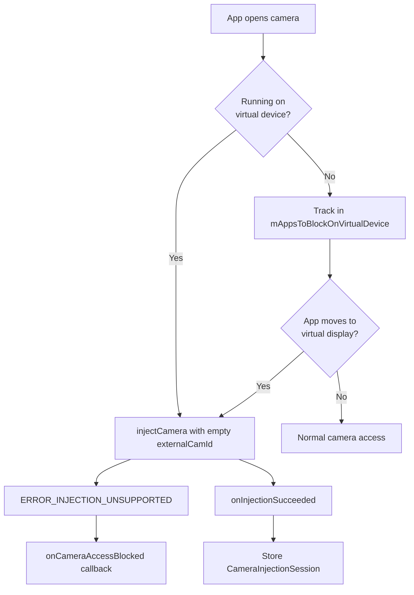
```mermaid
flowchart TD
    A[App opens camera] --> B{"Running on<br/>virtual device?"}
    B -->|Yes| C[injectCamera with empty externalCamId]
    B -->|No| D[Track in mAppsToBlockOnVirtualDevice]
    D --> E{"App moves to<br/>virtual display?"}
    E -->|Yes| C
    E -->|No| F[Normal camera access]
    C --> G[ERROR_INJECTION_UNSUPPORTED]
    G --> H[onCameraAccessBlocked callback]
    C --> I[onInjectionSucceeded]
    I --> J[Store CameraInjectionSession]
```

### 52.5.4 VirtualAudioController

The `VirtualAudioController` manages audio routing for apps running on virtual
displays:

```
frameworks/base/services/companion/java/com/android/server/companion/virtual/audio/
    VirtualAudioController.java
    AudioPlaybackDetector.java
    AudioRecordingDetector.java
```

The controller implements both audio playback and recording callbacks:

```java
public final class VirtualAudioController
        implements AudioPlaybackCallback, AudioRecordingCallback {
```

Source:
`VirtualAudioController.java`, line 52.

The key challenge is avoiding audio leaks during transitions. When an app moves
to or from a virtual display, its audio must be re-routed without any sound
leaking through the physical speaker. The controller uses a delay mechanism:

```java
private static final int UPDATE_REROUTING_APPS_DELAY_MS = 2000;

public void onRunningAppsChanged(@NonNull ArraySet<Integer> runningUids) {
    synchronized (mLock) {
        // ...
        // Do not change rerouted applications while any application is playing
        if (!mPlayingAppUids.isEmpty()) {
            Slog.i(TAG, "Audio is playing, do not change rerouted apps");
            return;
        }

        // An application previously playing audio was removed from the display.
        if (!oldPlayingAppUids.isEmpty()) {
            Slog.i(TAG, "The last playing app removed, delay change rerouted apps");
            mHandler.postDelayed(mUpdateAudioRoutingRunnable, UPDATE_REROUTING_APPS_DELAY_MS);
            return;
        }
    }

    notifyAppsNeedingAudioRoutingChanged();
}
```

Source:
`VirtualAudioController.java`, lines 131-177 (`UPDATE_REROUTING_APPS_DELAY_MS`
is declared at line 54).

The routing notification sends the list of UIDs that need audio re-routing
to the client via `IAudioRoutingCallback`:

```java
private void notifyAppsNeedingAudioRoutingChanged() {
    int[] runningUids;
    synchronized (mLock) {
        runningUids = new int[mRunningAppUids.size()];
        for (int i = 0; i < mRunningAppUids.size(); i++) {
            runningUids[i] = mRunningAppUids.valueAt(i);
        }
    }
    synchronized (mCallbackLock) {
        if (mRoutingCallback != null) {
            mRoutingCallback.onAppsNeedingAudioRoutingChanged(runningUids);
        }
    }
}
```

Source:
`VirtualAudioController.java`, lines 233-255.

The controller also forwards playback and recording configuration changes
to the client via `IAudioConfigChangedCallback`:

```java
@Override
public void onPlaybackConfigChanged(List<AudioPlaybackConfiguration> configs) {
    updatePlayingApplications(configs);
    List<AudioPlaybackConfiguration> audioPlaybackConfigurations;
    synchronized (mLock) {
        audioPlaybackConfigurations = findPlaybackConfigurations(configs, mRunningAppUids);
    }
    synchronized (mCallbackLock) {
        if (mConfigChangedCallback != null) {
            mConfigChangedCallback.onPlaybackConfigChanged(audioPlaybackConfigurations);
        }
    }
}
```

Source:
`VirtualAudioController.java`, lines 180-197.

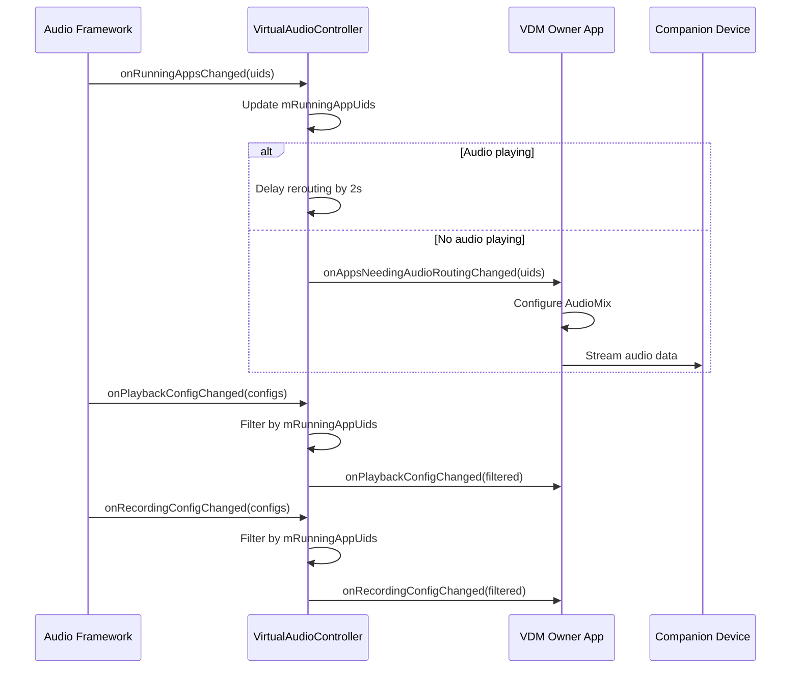
```mermaid
sequenceDiagram
    participant FW as Audio Framework
    participant VAC as VirtualAudioController
    participant App as VDM Owner App
    participant Remote as Companion Device

    FW->>VAC: onRunningAppsChanged(uids)
    VAC->>VAC: Update mRunningAppUids
    alt Audio playing
        VAC->>VAC: Delay rerouting by 2s
    else No audio playing
        VAC->>App: onAppsNeedingAudioRoutingChanged(uids)
        App->>App: Configure AudioMix
        App->>Remote: Stream audio data
    end

    FW->>VAC: onPlaybackConfigChanged(configs)
    VAC->>VAC: Filter by mRunningAppUids
    VAC->>App: onPlaybackConfigChanged(filtered)

    FW->>VAC: onRecordingConfigChanged(configs)
    VAC->>VAC: Filter by mRunningAppUids
    VAC->>App: onRecordingConfigChanged(filtered)
```

---

## 52.6 Virtual Device and Display Integration

### 52.6.1 Virtual Display Creation

Virtual displays are created through `VirtualDeviceImpl` and wrapped in a
`VirtualDisplayWrapper` that tracks the associated
`GenericWindowPolicyController`:

```java
@GuardedBy("mVirtualDeviceLock")
private final SparseArray<VirtualDisplayWrapper> mVirtualDisplays = new SparseArray<>();
```

The display creation process:

1. The VDM owner calls `createVirtualDisplay()` on their `IVirtualDevice`.
2. `VirtualDeviceImpl` constructs a `VirtualDisplayConfig` with the base flags
   plus any additional flags from the request.

3. A new `GenericWindowPolicyController` is created for this display.
4. The display is created via `DisplayManagerGlobal`.
5. The policy controller is registered with the display via
   `setDisplayId()`.

The default flags ensure the virtual display:

- Does **not** provide touch feedback (haptics).
- Destroys content when the display is removed.
- Supports touch input.
- Has its own focus (independent of the default display).

### 52.6.2 GenericWindowPolicyController -- Activity Policy Enforcement

The `GenericWindowPolicyController` is the gatekeeper that decides which
activities can launch on a virtual display. It extends
`DisplayWindowPolicyController` and is consulted by WindowManager for every
activity launch:

```
frameworks/base/services/companion/java/com/android/server/companion/virtual/
    GenericWindowPolicyController.java
```

The policy enforcement chain for `canContainActivity()`:

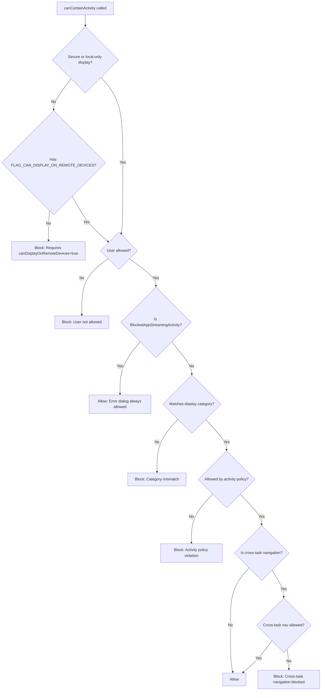
```mermaid
flowchart TD
    A[canContainActivity called] --> C{"Secure or local-only display?"}
    C -->|No| D{Has FLAG_CAN_DISPLAY_ON_REMOTE_DEVICES?}
    D -->|No| BLOCK2[Block: Requires canDisplayOnRemoteDevices=true]
    D -->|Yes| E{User allowed?}
    C -->|Yes| E
    E -->|No| BLOCK3[Block: User not allowed]
    E -->|Yes| F{Is BlockedAppStreamingActivity?}
    F -->|Yes| ALLOW1[Allow: Error dialog always allowed]
    F -->|No| G{Matches display category?}
    G -->|No| BLOCK4[Block: Category mismatch]
    G -->|Yes| H{Allowed by activity policy?}
    H -->|No| BLOCK5[Block: Activity policy violation]
    H -->|Yes| I{Is cross-task navigation?}
    I -->|No| ALLOW2[Allow]
    I -->|Yes| J{Cross-task nav allowed?}
    J -->|No| BLOCK6[Block: Cross-task navigation blocked]
    J -->|Yes| ALLOW2
```

Implementation:

```java
@Override
public boolean canContainActivity(@NonNull ActivityInfo activityInfo,
        @WindowConfiguration.WindowingMode int windowingMode, int launchingFromDisplayId,
        boolean isNewTask) {
    if (!mIsSecureDisplay && (activityInfo.flags & FLAG_CAN_DISPLAY_ON_REMOTE_DEVICES) == 0
            && !mLocalDeviceOnly) {
        logActivityLaunchBlocked("Display requires android:canDisplayOnRemoteDevices=true");
        return false;
    }
    final UserHandle activityUser =
            UserHandle.getUserHandleForUid(activityInfo.applicationInfo.uid);
    if (!activityUser.isSystem() && !mAllowedUsers.contains(activityUser)) {
        return false;
    }
    // ...
    if (!isAllowedByPolicy(activityComponent)) {
        return false;
    }
    if (isNewTask && launchingFromDisplayId != DEFAULT_DISPLAY
            && !isAllowedByPolicy(mCrossTaskNavigationAllowedByDefault,
                    mCrossTaskNavigationExemptions, activityComponent)) {
        return false;
    }
    return true;
}
```

Source:
`GenericWindowPolicyController.java`, lines 316-356. In Android 17 the
`FLAG_CAN_DISPLAY_ON_REMOTE_DEVICES` gate is skipped for displays created with the
new `mLocalDeviceOnly` flag (local virtual displays that never leave the host),
and the standalone mirror-display short-circuit was dropped from this method.

The policy logic is an XOR pattern:

```java
private boolean isAllowedByPolicy(ComponentName component) {
    synchronized (mGenericWindowPolicyControllerLock) {
        if (mActivityPolicyExemptions.contains(component)
                || mActivityPolicyPackageExemptions.contains(component.getPackageName())) {
            return !mActivityLaunchAllowedByDefault;
        }
        return mActivityLaunchAllowedByDefault;
    }
}
```

Source:
`GenericWindowPolicyController.java`, lines 493-501.

When `mActivityLaunchAllowedByDefault` is `true`, the exemptions list acts as
a **blocklist**. When `false`, the exemptions act as an **allowlist**.

### 52.6.3 Secure Window Handling

When a window with `FLAG_SECURE` appears on a virtual display, the policy
controller notifies the VDM owner and optionally blocks the window:

```java
@Override
public boolean keepActivityOnWindowFlagsChanged(ActivityInfo activityInfo, int windowFlags,
        int systemWindowFlags) {
    final int displayId = waitAndGetDisplayId();
    if (displayId != INVALID_DISPLAY) {
        final ComponentName componentName = activityInfo.getComponentName();
        // ... track per-component window flags via mWindowFlagsTracker ...
        if (Objects.equals(componentName, topComponentName)) {
            detectSecureWindowStatusChange(windowFlags, currentWindowFlags, componentName,
                    activityInfo.applicationInfo.uid, displayId);
        }
    }

    if (!CompatChanges.isChangeEnabled(ALLOW_SECURE_ACTIVITY_DISPLAY_ON_REMOTE_DEVICE,
            activityInfo.packageName,
            UserHandle.getUserHandleForUid(activityInfo.applicationInfo.uid))) {
        if (isSecureContent(windowFlags)
                || (systemWindowFlags & SYSTEM_FLAG_HIDE_NON_SYSTEM_OVERLAY_WINDOWS) != 0) {
            notifyActivityBlocked(activityInfo, /* intentSender= */ null);
            return false;
        }
    }
    return true;
}
```

Source:
`GenericWindowPolicyController.java`, lines 365-399. Android 17 refactored the
secure-window bookkeeping into a per-component `mWindowFlagsTracker` and a
`detectSecureWindowStatusChange()` helper, which is what now fires the
`onSecureWindowShown`/`onSecureWindowHidden` activity-listener callbacks; the
`ALLOW_SECURE_ACTIVITY_DISPLAY_ON_REMOTE_DEVICE` compatibility change is declared
at line 126.

For apps targeting Tiramisu or later, the `FLAG_SECURE` check can be opted
into via the `ALLOW_SECURE_ACTIVITY_DISPLAY_ON_REMOTE_DEVICE` compatibility
change (ID `201712607`).

### 52.6.4 Display Categories

Virtual displays can be tagged with categories, and activities can declare
required display categories. The matching logic:

```java
private boolean activityMatchesDisplayCategory(ActivityInfo activityInfo) {
    if (mDisplayCategories.isEmpty()) {
        return activityInfo.requiredDisplayCategory == null;
    }
    return activityInfo.requiredDisplayCategory != null
                && mDisplayCategories.contains(activityInfo.requiredDisplayCategory);
}
```

Source:
`GenericWindowPolicyController.java`, lines 473-479.

This enables specialized displays (e.g., a "AUTOMOTIVE" category display
that only shows automotive-flagged activities).

### 52.6.5 Recents Integration

The `showTasksInHostDeviceRecents` parameter controls whether activities
running on virtual displays appear in the host device's recent apps:

```java
@Override
public boolean canShowTasksInHostDeviceRecents() {
    synchronized (mGenericWindowPolicyControllerLock) {
        return mShowTasksInHostDeviceRecents;
    }
}
```

Source:
`GenericWindowPolicyController.java`, lines 447-451.

This can be dynamically updated:

```java
public void setShowInHostDeviceRecents(boolean showInHostDeviceRecents) {
    synchronized (mGenericWindowPolicyControllerLock) {
        mShowTasksInHostDeviceRecents = showInHostDeviceRecents;
    }
}
```

### 52.6.6 Custom Home Activity

Virtual displays can specify a custom home activity component:

```java
@Override
public @Nullable ComponentName getCustomHomeComponent() {
    return mCustomHomeComponent;
}
```

Source:
`GenericWindowPolicyController.java`, lines 454-456.

This is applicable only to displays that support home activities (created with
the relevant virtual display flags). If null, the system-default secondary
home activity is used.

### 52.6.7 App Streaming Architecture

Putting it all together, app streaming from a phone to a companion device
follows this architecture:

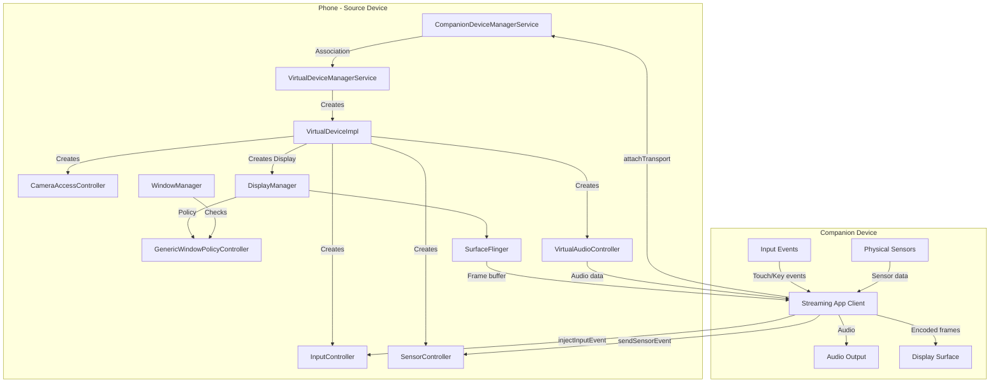
```mermaid
flowchart TB
    subgraph Phone[Phone - Source Device]
        CDM_S[CompanionDeviceManagerService]
        VDM_S[VirtualDeviceManagerService]
        VDI[VirtualDeviceImpl]
        GWPC[GenericWindowPolicyController]
        IC[InputController]
        AC[VirtualAudioController]
        CAC[CameraAccessController]
        SC[SensorController]
        DM[DisplayManager]
        WM[WindowManager]
        SF[SurfaceFlinger]

        CDM_S -->|Association| VDM_S
        VDM_S -->|Creates| VDI
        VDI -->|Creates| IC
        VDI -->|Creates| AC
        VDI -->|Creates| CAC
        VDI -->|Creates| SC
        VDI -->|Creates Display| DM
        DM -->|Policy| GWPC
        WM -->|Checks| GWPC
        DM --> SF
    end

    subgraph Companion[Companion Device]
        StreamApp[Streaming App Client]
        Input[Input Events]
        Audio[Audio Output]
        Display[Display Surface]
        Sensors[Physical Sensors]
    end

    StreamApp -->|attachTransport| CDM_S
    SF -->|Frame buffer| StreamApp
    StreamApp -->|Encoded frames| Display
    Input -->|Touch/Key events| StreamApp
    StreamApp -->|injectInputEvent| IC
    AC -->|Audio data| StreamApp
    StreamApp -->|Audio| Audio
    Sensors -->|Sensor data| StreamApp
    StreamApp -->|sendSensorEvent| SC
```

### 52.6.8 The Complete Lifecycle

The complete lifecycle of a virtual device session:

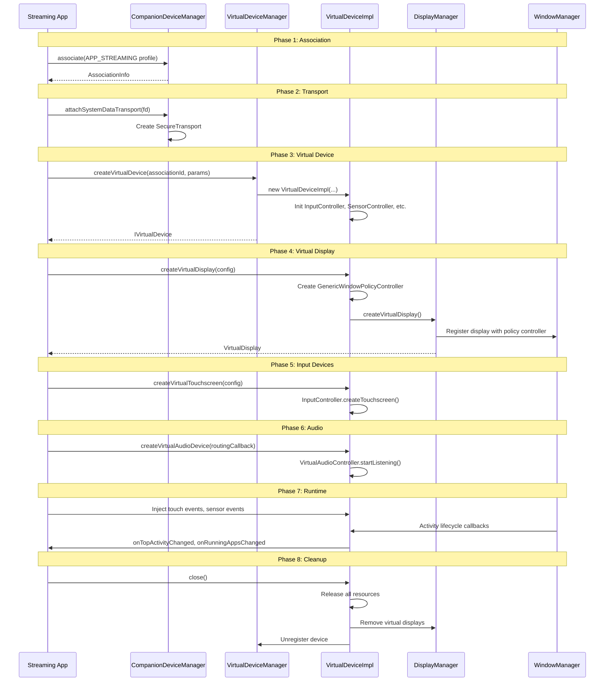
```mermaid
sequenceDiagram
    participant App as Streaming App
    participant CDM as CompanionDeviceManager
    participant VDM as VirtualDeviceManager
    participant VDI as VirtualDeviceImpl
    participant DM as DisplayManager
    participant WM as WindowManager

    Note over App,WM: Phase 1: Association
    App->>CDM: associate(APP_STREAMING profile)
    CDM-->>App: AssociationInfo

    Note over App,WM: Phase 2: Transport
    App->>CDM: attachSystemDataTransport(fd)
    CDM->>CDM: Create SecureTransport

    Note over App,WM: Phase 3: Virtual Device
    App->>VDM: createVirtualDevice(associationId, params)
    VDM->>VDI: new VirtualDeviceImpl(...)
    VDI->>VDI: Init InputController, SensorController, etc.
    VDM-->>App: IVirtualDevice

    Note over App,WM: Phase 4: Virtual Display
    App->>VDI: createVirtualDisplay(config)
    VDI->>VDI: Create GenericWindowPolicyController
    VDI->>DM: createVirtualDisplay()
    DM->>WM: Register display with policy controller
    DM-->>App: VirtualDisplay

    Note over App,WM: Phase 5: Input Devices
    App->>VDI: createVirtualTouchscreen(config)
    VDI->>VDI: InputController.createTouchscreen()

    Note over App,WM: Phase 6: Audio
    App->>VDI: createVirtualAudioDevice(routingCallback)
    VDI->>VDI: VirtualAudioController.startListening()

    Note over App,WM: Phase 7: Runtime
    App->>VDI: Inject touch events, sensor events
    WM->>VDI: Activity lifecycle callbacks
    VDI->>App: onTopActivityChanged, onRunningAppsChanged

    Note over App,WM: Phase 8: Cleanup
    App->>VDI: close()
    VDI->>VDI: Release all resources
    VDI->>DM: Remove virtual displays
    VDI->>VDM: Unregister device
```

---

## 52.7 New CDM Subsystems in Android 17

This section walks three sibling packages under
`frameworks/base/services/companion/java/com/android/server/companion/`, all wired
into `CompanionDeviceManagerService` next to the existing processors. The
`devicetrust/` and `powerexemption/` packages are new in Android 17; the
`actionrequest/` package already shipped in Android 16 and is grouped here for
context (it picked up extra result constants in 17). They share
the same `AssociationStore` and `CompanionTransportManager` as everything else,
so they observe the same association set and the same transport channels.

### 52.7.1 Action Requests

The `actionrequest/` package lets a companion app ask its paired devices to
activate or deactivate a stateful capability and report back the result. The
`ActionRequestProcessor` implements the `requestAction -> notifyActionRequestResult`
loop and tracks which actions are currently active per association:

```
frameworks/base/services/companion/java/com/android/server/companion/actionrequest/
    ActionRequestProcessor.java
```

The supported actions are a small fixed set, declared as `STATEFUL_ACTIONS`:

```java
import static android.companion.ActionRequest.REQUEST_NEARBY_ADVERTISING;
import static android.companion.ActionRequest.REQUEST_NEARBY_SCANNING;
import static android.companion.ActionRequest.REQUEST_TRANSPORT;
// ...
private static final Set<Integer> STATEFUL_ACTIONS = Set.of(
        REQUEST_NEARBY_SCANNING,
        REQUEST_NEARBY_ADVERTISING,
        REQUEST_TRANSPORT);
```

Source:
`ActionRequestProcessor.java`, lines 82-86.

`requestAction()` validates the action against `STATEFUL_ACTIONS`, then dispatches
to each named association (skipping any that no longer exist). The companion app
later reports `RESULT_ACTIVATED`, `RESULT_DEACTIVATED`, or
`RESULT_FAILED_TO_ACTIVATE` through `processActionResult()`, which updates the
processor's per-association state and fans the result out to registered
`IOnActionResultListener` callbacks:

```java
public void requestAction(@NonNull ActionRequest request,
        @NonNull String serviceName, int[] associationIds) {
    // ...
    if (!STATEFUL_ACTIONS.contains(action)) {
        Slog.w(TAG, "Action " + action + " is not a supported action.");
        return;
    }
    Binder.withCleanCallingIdentity(() -> {
        for (int id : associationIds) {
            final AssociationInfo association = mAssociationStore.getAssociationById(id);
            if (association == null) { continue; }
            handleActionRequest(association, request, serviceName);
        }
    });
}
```

Source:
`ActionRequestProcessor.java`, lines 151-184. `CompanionDeviceManagerService`
exposes this as `requestAction()` and `setRequestActionAllowList()` on the Binder
interface (see `CompanionDeviceManagerService.java`, lines 799 and 807).

### 52.7.2 Trusted Devices

The `devicetrust/` package establishes and stores per-association session keys so
two paired devices can recognize each other as trusted without re-running the
full UKEY2 attestation handshake every time. `TrustedDeviceProcessor` registers
for `MESSAGE_REQUEST_TRUSTED_DEVICE` on the transport manager and runs a
key-exchange when a transport connects:

```
frameworks/base/services/companion/java/com/android/server/companion/devicetrust/
    TrustedDeviceProcessor.java
    PskProvider.java               -- pre-shared-key provider interface
    BluetoothPasskeyProvider.java  -- "BT_PASSKEY" provider
    RandomKeyProvider.java         -- "RANDOM_KEY" provider
    TrustedDeviceStore.java        -- persisted session keys
```

```java
public class TrustedDeviceProcessor {
    private final SparseArray<Transport> mCurrentSessions = new SparseArray<>();
    private final Set<PskProvider> mPskProviders = new HashSet<>();
    // ...
    mTransportManager.addListener(MESSAGE_REQUEST_TRUSTED_DEVICE, mOnMessageReceivedListener);
    mTransportManager.addListener(mOnTransportChangedListener);
}
```

Source:
`TrustedDeviceProcessor.java`, lines 59-87.

Keys are derived with HKDF (`hkdfExtract`/`hkdfExpand` from the new `utils/`
`CryptoUtils`). The set of available keys is supplied by pluggable `PskProvider`
implementations, each identified by a `NAME`: `BluetoothPasskeyProvider`
(`"BT_PASSKEY"`) and `RandomKeyProvider` (`"RANDOM_KEY"`). `CompanionDeviceManagerService`
registers and removes providers dynamically:

```java
mTrustedDeviceProcessor.addPskProvider(new RandomKeyProvider());
// ...
mTrustedDeviceProcessor.removePskProvider(RandomKeyProvider.NAME);
```

Source:
`CompanionDeviceManagerService.java`, lines 718-720. The `PskProvider` interface
exposes a single `byte[] getKey(int userId, int associationId)` method
(`PskProvider.java`, lines 27-43), and `loadKeysForUser()` snapshots the available
keys when a user is unlocked (`TrustedDeviceProcessor.java`, line 111).

### 52.7.3 Power Exemptions

The `powerexemption/` package consolidates the power and background-execution
exemptions that companion apps receive while a device is associated. Previously
scattered, these are now managed by `CompanionExemptionProcessor`:

```
frameworks/base/services/companion/java/com/android/server/companion/powerexemption/
    CompanionExemptionProcessor.java
    CompanionExemptionStore.java
```

The processor listens for association changes and, when a companion device is
present, places the app on the power-save permanent allowlist via
`PowerExemptionManager`. When the device disconnects or the association is
removed, the exemption is withdrawn:

```java
public void exemptPackage(int userId, String packageName, boolean hasPresentDevices) {
    // ... resolve PackageInfo, then run as system ...
}
```

Source:
`CompanionExemptionProcessor.java`, line 127. The processor also keeps the
companion app exempt from permission auto-revoke
(`updateAutoRevokeExemptions()`, line 212) and updates the
`ActivityTaskManagerInternal` view of associations (`updateAtm()`, line 107).
`CompanionDeviceManagerService` drives these on user unlock and package events
(see `CompanionDeviceManagerService.java`, lines 209-211, 303, 327, and 335).

### 52.7.4 Backup and Restore of Associations

A top-level `BackupRestoreProcessor` lets associations survive a device migration
or a backup-and-restore cycle. It serializes the association disk store and the
system-data-transfer request store into a versioned payload, and reconstitutes
them on restore, holding "pending" associations until the owning app is
reinstalled:

```java
class BackupRestoreProcessor {
    private static final int BACKUP_AND_RESTORE_VERSION = 0;

    byte[] getBackupPayload(int userId) { /* ... */ }
    void applyRestoredPayload(byte[] payload, int userId) { /* ... */ }
    public void restorePendingAssociations(int userId, String packageName) { /* ... */ }
}
```

Source:
`BackupRestoreProcessor.java`, lines 48-209. When a package is added,
`CompanionDeviceManagerService` calls
`mBackupRestoreProcessor.restorePendingAssociations(userId, packageName)` to finish
binding any associations that were waiting for that app
(`CompanionDeviceManagerService.java`, line 340).

### 52.7.5 Health Connect Data Types

Android 17 also adds new Health Connect record types such as
`MenstrualCyclePhaseRecord`. These are not part of CompanionDeviceManager or
VirtualDeviceManager: they live entirely in the Health Connect (HealthFitness)
mainline module under
`packages/modules/HealthFitness/framework/java/android/health/connect/datatypes/MenstrualCyclePhaseRecord.java`,
with the server-side helper at
`packages/modules/HealthFitness/service/java/com/android/server/healthconnect/fitness/recordhelpers/MenstrualCyclePhaseRecordHelper.java`.
A companion app (for example a wearable) reaches that data through the normal
Health Connect permission and API surface, not through a CDM transport, so it is
covered by the Health Connect material rather than this chapter.

---

## 52.8 Computer Control Sessions

The `virtual/computercontrol/` package is the largest new addition to VDM in
Android 17. It implements **Computer Control**: a controlled, on-device automation
surface where an approved agent (such as a remote AI agent advertised via the
association's `remoteAiAgentSupported` flag from section 52.2.1) drives a virtual
display, injects input, and reads back UI state, under explicit user consent and a
per-agent allowlist.

```
frameworks/base/services/companion/java/com/android/server/companion/virtual/computercontrol/
    ComputerControlSessionProcessor.java   -- session lifecycle orchestrator
    ComputerControlSessionImpl.java        -- a single active session
    ComputerControlSessionRequest.java
    ComputerControlAllowlistController.java -- per-agent app allowlist + consent
    AutomatedPackagesRepository.java       -- which packages an agent may automate
    ComputerControlAudioCapture.java
    ComputerControlAudioInjector.java
    ComputerControlDataStore.java
    ComputerControlStatsController.java
    InteractiveMirrorImpl.java
    SessionLifecycle.java
    PausableTimer.java
```

### 52.8.1 Service Integration

`VirtualDeviceManagerService` owns a single `ComputerControlSessionProcessor` and
an `IComputerControlConsentManager`, both created at construction time:

```java
private final ComputerControlSessionProcessor mComputerControlSessionProcessor;
private final IComputerControlConsentManager mComputerControlConsentManager;
// ...
mComputerControlSessionProcessor =
        new ComputerControlSessionProcessor(context, mLocalService, /* factory */ ...);
```

Source:
`VirtualDeviceManagerService.java`, lines 166-167 and 218-219. The processor is
initialized (`initialize()`) and registered for monitoring during the service's
boot phase (lines 284 and 319).

### 52.8.2 Requesting a Session

A client requests automation through the VDM Binder interface, which forwards to
`processNewSessionRequest()`. The processor first checks availability and the
caller's `ACCESS_COMPUTER_CONTROL` permission, then posts session creation onto
its handler:

```java
public void processNewSessionRequest(@NonNull ComputerControlSessionRequest request) {
    // ... validate ...
    mHandler.post(() -> createSession(request));
}
```

Source:
`ComputerControlSessionProcessor.java`, line 177. Availability is gated by
`isComputerControlAvailable()` (line 290), which is reached from
`VirtualDeviceManagerService.java`, line 757.

The relationship between the VDM service, the session processor, the allowlist
controller, and a live session:

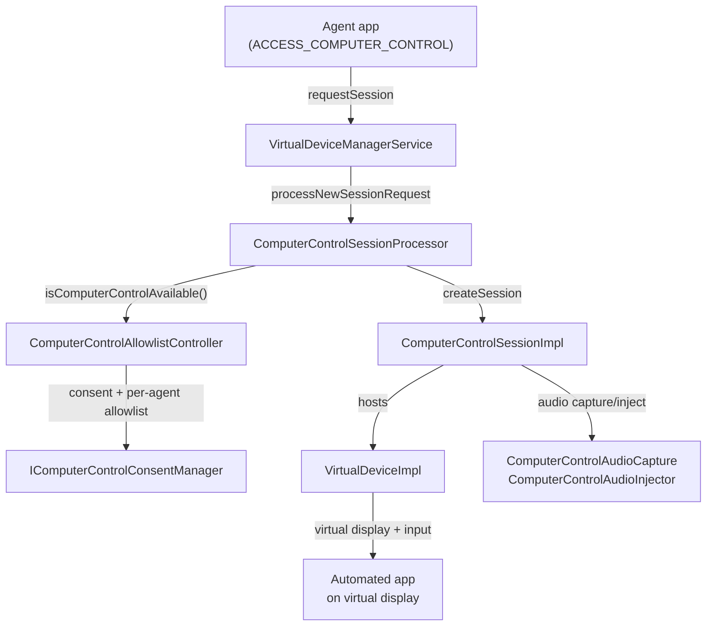
```mermaid
flowchart TD
    Client["Agent app<br/>(ACCESS_COMPUTER_CONTROL)"] -->|requestSession| VDMS[VirtualDeviceManagerService]
    VDMS -->|processNewSessionRequest| CCP[ComputerControlSessionProcessor]
    CCP -->|"isComputerControlAvailable()"| ALC[ComputerControlAllowlistController]
    ALC -->|consent + per-agent allowlist| Consent[IComputerControlConsentManager]
    CCP -->|createSession| Session[ComputerControlSessionImpl]
    Session -->|hosts| VD[VirtualDeviceImpl]
    VD -->|virtual display + input| Target["Automated app<br/>on virtual display"]
    Session -->|"audio capture/inject"| Audio["ComputerControlAudioCapture<br/>ComputerControlAudioInjector"]
```

### 52.8.3 The Per-Agent Allowlist and Consent

`ComputerControlAllowlistController` enforces which packages a given agent is
allowed to automate. The processor exposes per-agent allowlist management that an
agent uses to declare its targets:

```java
public void addAppToAutomatableAppListForAgent(int agentUid, String agentPackageName, ...);
public void removeAppFromAutomatableAppListForAgent(int agentUid, ...);
public void clearAutomatableAppListForAgent(int agentUid, String agentPackageName);
public String[] getAutomatableAppListForAgent(int agentUid, String agentPackageName);
```

Source:
`ComputerControlSessionProcessor.java`, lines 346-392. Before a target can be
automated, the controller checks both that the agent is approved
(`isPackageApprovedToRunAutomation()`, line 399) and that the target is
automatable (`isPackageTargetableForAutomation()`, line 407). The
`ACCESS_COMPUTER_CONTROL` permission itself is enforced inside
`ComputerControlAllowlistController` (see
`ComputerControlAllowlistController.java`, line 234).

### 52.8.4 Session Lifecycle

A Computer Control session runs on a virtual display. `createSession()` builds a
`VirtualDeviceImpl` through the injected factory, attaches the agent's input and
audio paths, and tracks the session so the VDM service can answer
`isComputerControlSession(deviceId)` and `isComputerControlDisplay(displayId)`.
Sessions can be closed by user intent (`closeSessionByUserIntent()`, line 473) and
support a handover where one mirror display takes over from another. The companion
audio paths (`ComputerControlAudioCapture` / `ComputerControlAudioInjector`) let
the agent hear and speak through the session, while `InteractiveMirrorImpl`
provides the interactive mirror surface the agent drives.

Source:
`ComputerControlSessionProcessor.java`, lines 424-473;
`VirtualDeviceManagerService.java`, lines 395 and 599.

---

## 52.9 The CrossDeviceSync Service

Everything covered so far lives inside `system_server`: the
`CrossDeviceSyncController` in section 52.3.7 is a framework component that
brokers *call* metadata over the CDM transport. Android 17 also ships a
*separate*, much larger app-layer service that is the primary production
consumer of the CDM association/transport machinery for general data sync. It
lives outside the framework, as its own platform app:

```
packages/services/CrossDeviceSync/
```

Despite the similar name, this is not the framework-side controller. It is a
privileged, platform-signed application (`com.android.crossdevicesync`) whose
job is to keep arbitrary feature state -- airplane mode, contextual "modes", and
similar device settings -- in sync between a phone and its wearable, riding
entirely on the CDM secure transport that sections 52.2 and 52.3 build. None of
its code runs in `system_server`; it talks to CDM through the public
`CompanionDeviceManager` SDK like any other companion app, just with elevated
permissions.

### 52.9.1 What It Is and How It Is Packaged

`CrossDeviceSync` is declared as a privileged, platform-certificate
`android_app`, not a `system_server` jar:

```
android_app {
    name: "CrossDeviceSync",
    defaults: ["platform_app_defaults"],
    certificate: "platform",
    privileged: true,
    // ...
}
```

Source:
`packages/services/CrossDeviceSync/Android.bp` (the `android_app` block; the
whole project carries a 2025 copyright and `default_team:
trendy_team_wear_wear_frameworks`, marking it a new-in-Android-17 wearable
component).

Its manifest declares the app `persistent`, `directBootAware`, and gated behind
a feature flag, and -- crucially -- it requests the same companion permissions
this chapter has been describing from the framework side:

```xml
<uses-permission android:name="android.permission.MANAGE_COMPANION_DEVICES" />
<uses-permission android:name="android.permission.USE_COMPANION_TRANSPORTS" />
<uses-permission android:name="android.permission.INTERACT_ACROSS_USERS" />
<uses-permission android:name="android.permission.NETWORK_AIRPLANE_MODE" />
```

Source:
`packages/services/CrossDeviceSync/AndroidManifest.xml`. `USE_COMPANION_TRANSPORTS`
is exactly the permission section 52.1.2 lists as the gate for attaching a
system data transport, and `MANAGE_COMPANION_DEVICES` is the administrative
permission for querying associations across users. The manifest also registers
two components: the `SyncService` and a `BootReceiver`.

`BootReceiver` listens for `LOCKED_BOOT_COMPLETED` (so it can start before the
user unlocks, since association data lives in Device Encrypted storage as
section 52.1.3 explains) and starts the service only for the system user,
disabling itself on every other user:

```java
if (context.getUser().equals(UserHandle.SYSTEM)) {
    context.startService(new Intent(context, SyncService.class));
} else {
    // disable the boot receiver for non-system users
}
```

Source:
`packages/services/CrossDeviceSync/src/com/android/crossdevicesync/BootReceiver.java`,
lines 42-61.

### 52.9.2 SyncService and the Component Graph

`SyncService` is a plain `android.app.Service` -- it is not bindable in
production (`onBind()` returns `null` outside instrumentation tests). All of its
work happens in `onCreate()`, which constructs a fixed set of collaborators
through a `SyncServiceInjector` and initializes each in turn:

```java
mNetworkManager.init();
mMetadataPublisher.init();
mNotificationHelper.init();
for (var entry : mFeatureManagerSuppliers.entrySet()) {
    FeatureManager featureManager = entry.getValue().get();
    featureManager.init();
    mFeatureManagers.add(featureManager);
}
```

Source:
`packages/services/CrossDeviceSync/src/com/android/crossdevicesync/services/SyncService.java`,
lines 79-97 (teardown is the mirror image in `onDestroy()`, lines 100-114).

The `SyncServiceInjectorImpl` wires the whole graph. The pieces, and how each
maps onto material already covered in this chapter:

| Component | Role | CDM hook (covered in) |
|-----------|------|------------------------|
| `NetworkManager` | Tracks associations/transports/presence, owns per-feature "networks" | associations + transport + presence (52.2, 52.3) |
| `Messenger` | Reliable batched message delivery over the transport | `CompanionDeviceManager.sendMessage` (52.3.2) |
| `CompanionActionController` | Asks the companion app to scan/advertise/attach transport | action requests (52.7.1) |
| `Advertiser` / `Scanner` | Drive `REQUEST_NEARBY_ADVERTISING` / `REQUEST_NEARBY_SCANNING` | action requests (52.7.1) |
| `MetadataPublisher` | Writes per-user CDM metadata for discovery | DataSync metadata (52.3.6) |
| `FeatureManager` (x2) | Per-feature sync logic on top of the network | n/a (app-layer) |
| `SharedDataStore` | Eventually-consistent, Submerge-backed per-feature store | n/a (app-layer) |

Source:
`packages/services/CrossDeviceSync/src/com/android/crossdevicesync/services/SyncServiceInjectorImpl.java`,
lines 110-204.

### 52.9.3 Riding on the CDM Transport

The service never opens its own socket. Every collaborator that touches a remote
device goes through a single `CompanionDeviceManagerProxy`, a thin testable
wrapper around the public `android.companion.CompanionDeviceManager`. Its method
list reads like an index of the CDM surface this chapter has walked through:
`getAllAssociations`, `addOnAssociationsChangedListener`,
`addOnTransportsChangedListener`, `setOnDevicePresenceEventListener`,
`sendMessage` / `addOnMessageReceivedListener`, `requestAction` /
`setOnActionResultListener`, and `setLocalMetadata` / `getLocalMetadata`.

Source:
`packages/services/CrossDeviceSync/src/com/android/crossdevicesync/common/CompanionDeviceManagerProxy.java`,
lines 33-110.

`NetworkManager.init()` is where it latches onto the framework: it seeds itself
with the current associations, then subscribes to association changes, transport
changes, and registers the messenger's message listener:

```java
processAssociationsAndMessagesLocked(
        mCompanionDeviceManager.getAllAssociations(UserHandle.USER_ALL));
mCompanionDeviceManager.addOnAssociationsChangedListener(
        mMainExecutor, mOnAssociationsChanged, UserHandle.USER_ALL);
mCompanionDeviceManager.addOnTransportsChangedListener(
        mMainExecutor, mOnTransportChanged);
mMessenger.init();
mMessenger.registerMessageListener(mMainExecutor, mOnMessage);
mCompanionActionController.init();
```

Source:
`packages/services/CrossDeviceSync/src/com/android/crossdevicesync/network/NetworkManagerImpl.java`,
lines 137-152.

The actual bytes travel on a single CDM message type. `MessengerImpl` registers
for, and sends with, `CompanionDeviceManager.MESSAGE_ONEWAY_CROSS_DEVICE_SYNC`:

```java
mCompanionDeviceManager.addOnMessageReceivedListener(
        mMainExecutor,
        CompanionDeviceManager.MESSAGE_ONEWAY_CROSS_DEVICE_SYNC,
        mMessageListener);
// ... and on the send path:
mCompanionDeviceManager.sendMessage(
        CompanionDeviceManager.MESSAGE_ONEWAY_CROSS_DEVICE_SYNC,
        encodedMessage,
        new int[] {associationId});
```

Source:
`packages/services/CrossDeviceSync/src/com/android/crossdevicesync/network/messenger/MessengerImpl.java`,
lines 109-112 and 658-661. That constant is defined in the framework as
`MESSAGE_ONEWAY_CROSS_DEVICE_SYNC = 0x43676883` (the `+CDS` tag) in
`frameworks/base/core/java/android/companion/CompanionDeviceManager.java`,
line 405. Its top byte `0x43` makes it a *oneway* message under the
classification in section 52.3.2, so CDM fires it across the
secure transport without expecting a response.

Because the underlying CDM message is fire-and-forget, the messenger layers its
own reliability on top: it batches outbound messages and ACKs into a single
`BatchedMessage`, retries on a timer, and uses a remote instance id to drop
duplicates after a reconnect. The relevant timeouts (`RETRY_DELAY_MS`,
`WAITING_FOR_TRANSPORT_TIMEOUT`, `WAITING_FOR_ACK_TIMEOUT`) are declared at
`MessengerImpl.java`, lines 59-61.

Before any transport exists, the service must coax the companion side into
existence. `CompanionActionController` uses the Android 17 action-request
mechanism from section 52.7.1 -- it issues `REQUEST_TRANSPORT`,
`REQUEST_NEARBY_SCANNING`, and `REQUEST_NEARBY_ADVERTISING` action requests to
its associations and watches the results:

```java
mCompanionDeviceManager.requestAction(
        new ActionRequest.Builder(
                        ActionRequest.REQUEST_TRANSPORT, ActionRequest.OP_DEACTIVATE)
                .build(),
        mPackageName,
        associationIds);
```

Source:
`packages/services/CrossDeviceSync/src/com/android/crossdevicesync/network/companion/CompanionActionControllerImpl.java`,
lines 112-130. So the service is also the canonical client of the new
`actionrequest/` processor: section 52.7.1 describes the framework half
(`ActionRequestProcessor` validating `STATEFUL_ACTIONS`), and this is the app
half that drives it.

The end-to-end data flow, from a local feature change down to the CDM transport
and back:

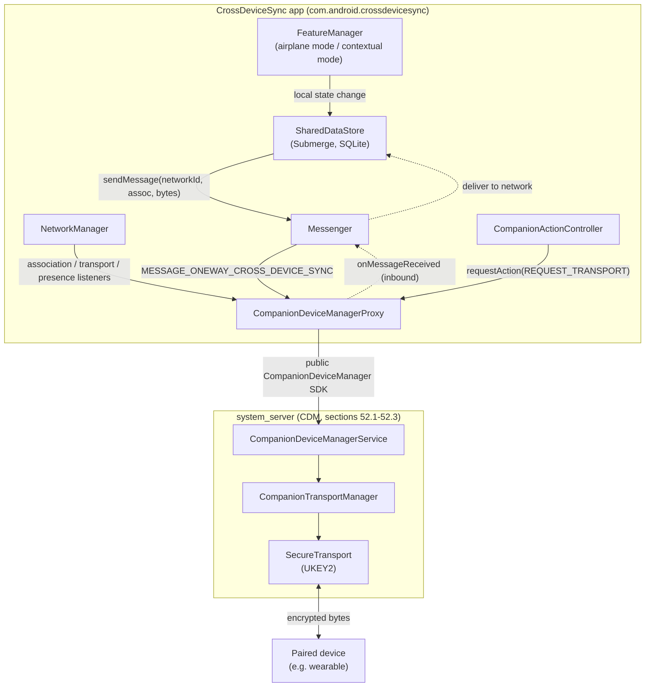
```mermaid
flowchart TD
    subgraph App["CrossDeviceSync app (com.android.crossdevicesync)"]
        FM["FeatureManager<br/>(airplane mode / contextual mode)"]
        SDS["SharedDataStore<br/>(Submerge, SQLite)"]
        NM[NetworkManager]
        MSG[Messenger]
        CAC[CompanionActionController]
        PROXY[CompanionDeviceManagerProxy]
    end

    subgraph FW["system_server (CDM, sections 52.1-52.3)"]
        CDMS[CompanionDeviceManagerService]
        TM[CompanionTransportManager]
        ST["SecureTransport<br/>(UKEY2)"]
    end

    Remote["Paired device<br/>(e.g. wearable)"]

    FM -->|"local state change"| SDS
    SDS -->|"sendMessage(networkId, assoc, bytes)"| MSG
    CAC -->|"requestAction(REQUEST_TRANSPORT)"| PROXY
    MSG -->|"MESSAGE_ONEWAY_CROSS_DEVICE_SYNC"| PROXY
    NM -->|"association / transport / presence listeners"| PROXY
    PROXY -->|"public CompanionDeviceManager SDK"| CDMS
    CDMS --> TM
    TM --> ST
    ST <-->|"encrypted bytes"| Remote
    PROXY -.->|"onMessageReceived (inbound)"| MSG
    MSG -.->|"deliver to network"| SDS
```

### 52.9.4 Feature Managers and the Shared Data Store

The sync logic is split into independent `FeatureManager` plugins. Android 17
ships two, registered by name in the injector:

- `AirplaneModeSyncManager` ("ApmSyncManager") -- mirrors airplane mode between
  phone and watch.

- `ContextualModeSyncManager` ("CtxModeSyncManager") -- syncs contextual
  "modes" (a per-user setting state).

Source:
`SyncServiceInjectorImpl.java`, lines 183-204. Each feature creates a named
`Network` on the `NetworkManager` (for example the airplane-mode feature uses
`NETWORK_ID = "apm_sync_network"`) and stores its state in a `SharedDataStore`,
described as "a data store that is in sync with remote devices ... eventually
synced across other authorized devices" (`SharedDataStore.java`, lines 30-37).
The concrete implementation, `SubmergeSharedDataStore`, layers Google's
*Submerge* eventually-consistent sync library over a per-feature SQLite database;
the global database is `cross_device_sync_global_db`
(`SyncServiceInjectorImpl.java`, line 77).

The airplane-mode feature also ties back to the per-association
`systemDataSyncFlags` from section 52.2.1: it keys off
`CompanionDeviceManager.FEATURE_CROSS_DEVICE_SYNC` and
`CompanionDeviceManager.FLAG_AIRPLANE_MODE` to decide whether sync is enabled for
a given association (`AirplaneModeSyncManager.java`, imports at lines 19-23).
That is the same flag bitmask that the framework-side `DataSyncProcessor`
(section 52.3.6) and `CHANGE_TYPE_UPDATED_DATA_SYNC_TYPES` (section 52.2.5)
manage -- the app and the framework agree on which features are active through it.

Finally, `MetadataPublisher` writes per-user CDM metadata
(`putBooleanMetaData` / `putIntMetaData` / `putStringMetaData`) so the remote
device can discover what this device supports. That metadata travels on the
DataSync path from section 52.3.6, via the proxy's `setLocalMetadata` /
`getLocalMetadata` (`MetadataPublisher.java`, lines 20-37).

### 52.9.5 Debug Surface

`SyncService.dump()` doubles as a shell-command entry point on debuggable
builds. `SyncServiceShellCommand` supports a single maintenance command,
`reset notifications`, which clears the rate-limited sync notifications:

```bash
adb shell dumpsys activity service com.android.crossdevicesync/.services.SyncService \
    reset notifications
```

On non-debuggable builds the same `dump()` falls through to printing the
`NetworkManager`, `MetadataPublisher`, and per-feature state. Source:
`SyncService.java`, lines 125-140;
`packages/services/CrossDeviceSync/src/com/android/crossdevicesync/services/SyncServiceShellCommand.java`,
lines 33-67.

In short, `CrossDeviceSync` is the productized, app-layer counterpart to the
in-process controllers of sections 52.3.6 and 52.3.7: a privileged wearable
companion app that turns the raw CDM association, transport, presence, action,
and metadata primitives into an eventually-consistent, multi-feature sync fabric,
without adding anything to `system_server` itself.

---

## 52.10 Try It

### 52.10.1 Inspect Companion Device Associations

List all associations for user 0:

```bash
adb shell cmd companiondevice list 0
```

Sample output:

```
Association{id=1,
  userId=0,
  packageName=com.google.android.gms,
  deviceMacAddress=AA:BB:CC:DD:EE:FF,
  displayName=Pixel Watch,
  deviceProfile=android.app.role.COMPANION_DEVICE_WATCH,
  selfManaged=false,
  notifyOnDeviceNearby=true,
  revoked=false,
  pending=false,
  timeApproved=1710000000000,
  lastTimeConnected=1710100000000}
```

### 52.10.2 Create a Test Association via Shell

Create a self-managed association for testing:

```bash
adb shell cmd companiondevice associate \
    --userId 0 \
    --package com.example.myapp \
    --self-managed \
    --display-name "Test Device"
```

### 52.10.3 Inspect Virtual Devices

Dump the state of all virtual devices:

```bash
adb shell dumpsys companion_device_manager
```

This outputs the full state including:

- Active associations
- Active transports
- Virtual devices and their displays
- Input devices per virtual device
- Sensor controllers

For virtual device-specific information:

```bash
adb shell dumpsys companion_device_manager virtual_devices
```

### 52.10.4 Using the VirtualDeviceManager API

To create a virtual device programmatically, an app needs:

1. A CDM association with an appropriate device profile.
2. The `CREATE_VIRTUAL_DEVICE` permission (normal permission).
3. For certain features, additional permissions:
   - `ADD_TRUSTED_DISPLAY` for clipboard policy customization.
   - `ADD_ALWAYS_UNLOCKED_DISPLAY` for always-unlocked displays.
   - `ADD_MIRROR_DISPLAY` for mirror displays.
   - `ACCESS_COMPUTER_CONTROL` for computer control features.

Example code flow:

```java
// Step 1: Create a CompanionDeviceManager association
CompanionDeviceManager cdm = getSystemService(CompanionDeviceManager.class);
AssociationRequest request = new AssociationRequest.Builder()
        .setDeviceProfile(AssociationRequest.DEVICE_PROFILE_APP_STREAMING)
        .setDisplayName("My Companion")
        .setSelfManaged(true)
        .build();
cdm.associate(request, callback, handler);

// Step 2: In the callback, create a virtual device
VirtualDeviceManager vdm = getSystemService(VirtualDeviceManager.class);
VirtualDeviceParams params = new VirtualDeviceParams.Builder()
        .setDevicePolicy(VirtualDeviceParams.POLICY_TYPE_AUDIO,
                VirtualDeviceParams.DEVICE_POLICY_CUSTOM)
        .setName("Streaming Device")
        .build();
VirtualDevice device = vdm.createVirtualDevice(associationInfo.getId(), params);

// Step 3: Create a virtual display
VirtualDisplay display = device.createVirtualDisplay(
        new VirtualDisplayConfig.Builder("MyDisplay", 1920, 1080, 240)
                .build(),
        callback, handler);

// Step 4: Create input devices
VirtualTouchscreenConfig touchConfig = new VirtualTouchscreenConfig.Builder(1920, 1080)
        .setAssociatedDisplayId(display.getDisplay().getDisplayId())
        .build();
device.createVirtualTouchscreen(touchConfig);
```

### 52.10.5 Debugging Transport Issues

To inspect active transports:

```bash
adb shell dumpsys companion_device_manager transports
```

To override the transport type for testing:

```bash
# Force raw (unencrypted) transport
adb shell cmd companiondevice override-transport-type 1

# Force secure transport
adb shell cmd companiondevice override-transport-type 2

# Reset to default
adb shell cmd companiondevice override-transport-type 0
```

### 52.10.6 Inspecting Window Policy

To see which activities are blocked on virtual displays:

```bash
adb logcat -s GenericWindowPolicyController
```

Look for log messages like:

```
D GenericWindowPolicyController: Virtual device activity launch disallowed
    on display 2, reason: Activity launch disallowed by policy: com.example/.SecretActivity
```

### 52.10.7 Testing Sensor Injection

Virtual sensors appear in the standard sensor list. To verify:

```bash
adb shell dumpsys sensorservice
```

Virtual sensors created through VDM will show up with the device ID and
name specified in the `VirtualSensorConfig`.

### 52.10.8 Monitoring Audio Routing

To monitor audio routing changes for virtual devices:

```bash
adb logcat -s VirtualAudioController
```

Key messages to watch for:

```
I VirtualAudioController: Audio is playing, do not change rerouted apps
I VirtualAudioController: The last playing app removed, delay change rerouted apps
```

### 52.10.9 Camera Access Blocking

To monitor camera blocking on virtual devices:

```bash
adb logcat -s CameraAccessController
```

Look for:

```
D CameraAccessController: startBlocking() cameraId: 0 packageName: com.example.camera
```

### 52.10.10 Key Source Files Reference

For quick reference, here are all the key source files discussed in this
chapter, organized by subsystem:

**CompanionDeviceManager Core:**

| File | Path |
|------|------|
| Service entry point | `frameworks/base/services/companion/java/com/android/server/companion/CompanionDeviceManagerService.java` |
| Internal API | `frameworks/base/services/companion/java/com/android/server/companion/CompanionDeviceManagerServiceInternal.java` |
| Shell commands | `frameworks/base/services/companion/java/com/android/server/companion/CompanionDeviceShellCommand.java` |
| Configuration | `frameworks/base/services/companion/java/com/android/server/companion/CompanionDeviceConfig.java` |

**Association:**

| File | Path |
|------|------|
| Request processing | `frameworks/base/services/companion/java/com/android/server/companion/association/AssociationRequestsProcessor.java` |
| CRUD store | `frameworks/base/services/companion/java/com/android/server/companion/association/AssociationStore.java` |
| Disk persistence | `frameworks/base/services/companion/java/com/android/server/companion/association/AssociationDiskStore.java` |
| Disassociation | `frameworks/base/services/companion/java/com/android/server/companion/association/DisassociationProcessor.java` |
| Idle cleanup | `frameworks/base/services/companion/java/com/android/server/companion/association/InactiveAssociationsRemovalService.java` |

**Transport and Security:**

| File | Path |
|------|------|
| Transport base | `frameworks/base/services/companion/java/com/android/server/companion/transport/Transport.java` |
| Raw transport | `frameworks/base/services/companion/java/com/android/server/companion/transport/RawTransport.java` |
| Secure transport | `frameworks/base/services/companion/java/com/android/server/companion/transport/SecureTransport.java` |
| Transport manager | `frameworks/base/services/companion/java/com/android/server/companion/transport/CompanionTransportManager.java` |
| Secure channel | `frameworks/base/services/companion/java/com/android/server/companion/securechannel/SecureChannel.java` |
| Attestation verifier | `frameworks/base/services/companion/java/com/android/server/companion/securechannel/AttestationVerifier.java` |

**Device Presence:**

| File | Path |
|------|------|
| Presence processor | `frameworks/base/services/companion/java/com/android/server/companion/devicepresence/DevicePresenceProcessor.java` |
| BLE processor | `frameworks/base/services/companion/java/com/android/server/companion/devicepresence/BleDeviceProcessor.java` |
| Bluetooth processor | `frameworks/base/services/companion/java/com/android/server/companion/devicepresence/BluetoothDeviceProcessor.java` |
| App binder | `frameworks/base/services/companion/java/com/android/server/companion/devicepresence/CompanionAppBinder.java` |

**Data Transfer:**

| File | Path |
|------|------|
| Permission sync | `frameworks/base/services/companion/java/com/android/server/companion/datatransfer/SystemDataTransferProcessor.java` |
| Context sync | `frameworks/base/services/companion/java/com/android/server/companion/datatransfer/contextsync/CrossDeviceSyncController.java` |
| Task continuity | `frameworks/base/services/companion/java/com/android/server/companion/datatransfer/continuity/TaskContinuityManagerService.java` |

**Android 17 CDM Subsystems:**

| File | Path |
|------|------|
| Action requests | `frameworks/base/services/companion/java/com/android/server/companion/actionrequest/ActionRequestProcessor.java` |
| Trusted devices | `frameworks/base/services/companion/java/com/android/server/companion/devicetrust/TrustedDeviceProcessor.java` |
| Power exemptions | `frameworks/base/services/companion/java/com/android/server/companion/powerexemption/CompanionExemptionProcessor.java` |
| Backup/restore | `frameworks/base/services/companion/java/com/android/server/companion/BackupRestoreProcessor.java` |
| Shared bundle store | `frameworks/base/services/companion/java/com/android/server/companion/utils/PersistableBundleStore.java` |

**VirtualDeviceManager:**

| File | Path |
|------|------|
| VDM service | `frameworks/base/services/companion/java/com/android/server/companion/virtual/VirtualDeviceManagerService.java` |
| Device impl | `frameworks/base/services/companion/java/com/android/server/companion/virtual/VirtualDeviceImpl.java` |
| Window policy | `frameworks/base/services/companion/java/com/android/server/companion/virtual/GenericWindowPolicyController.java` |
| Input controller | `frameworks/base/services/companion/java/com/android/server/companion/virtual/InputController.java` |
| Sensor controller | `frameworks/base/services/companion/java/com/android/server/companion/virtual/SensorController.java` |
| Camera controller | `frameworks/base/services/companion/java/com/android/server/companion/virtual/CameraAccessController.java` |
| Audio controller | `frameworks/base/services/companion/java/com/android/server/companion/virtual/audio/VirtualAudioController.java` |
| Computer Control (Android 17) | `frameworks/base/services/companion/java/com/android/server/companion/virtual/computercontrol/ComputerControlSessionProcessor.java` |

---

## Summary

The CompanionDeviceManager and VirtualDeviceManager together form a
comprehensive framework for multi-device Android experiences:

- **CDM** handles the trust relationship: discovery, user consent, association
  persistence, presence detection, secure transport, and data synchronization.
  Its modular processor architecture keeps each concern isolated while the
  `AssociationStore` provides a unified data layer with change notification.

- **VDM** handles the virtual representation: creating virtual displays with
  fine-grained activity policies, injecting input from remote hardware, routing
  audio to/from companion devices, providing virtual sensors, and controlling
  camera access. The `GenericWindowPolicyController` enforces security at the
  WindowManager level, ensuring that only authorized activities can appear on
  virtual surfaces.

- The **transport layer** ties them together: UKEY2-encrypted channels with
  attestation verification carry permission sync data, call metadata, task
  handoff messages, and custom application data between paired devices.

- The **security model** is layered: CDM permissions gate association creation,
  device profiles control role grants, transport encryption protects data
  in transit, camera injection blocks unauthorized hardware access, and window
  policies prevent sensitive activities from leaking to remote displays.

- **Android 17 additions** broaden the framework: CDM gains persisted
  trusted-device keys (`devicetrust/`) and consolidated
  power exemptions (`powerexemption/`), extends the existing action-request
  path (`actionrequest/`, carried over from Android 16) with new result
  constants, and keeps association backup/restore, while VDM
  gains Computer Control sessions (`virtual/computercontrol/`) that let an approved
  agent automate apps on a virtual display under explicit per-agent consent.

This architecture enables use cases ranging from smartwatch pairing to full
desktop-class app streaming, all built on the same foundational infrastructure.
