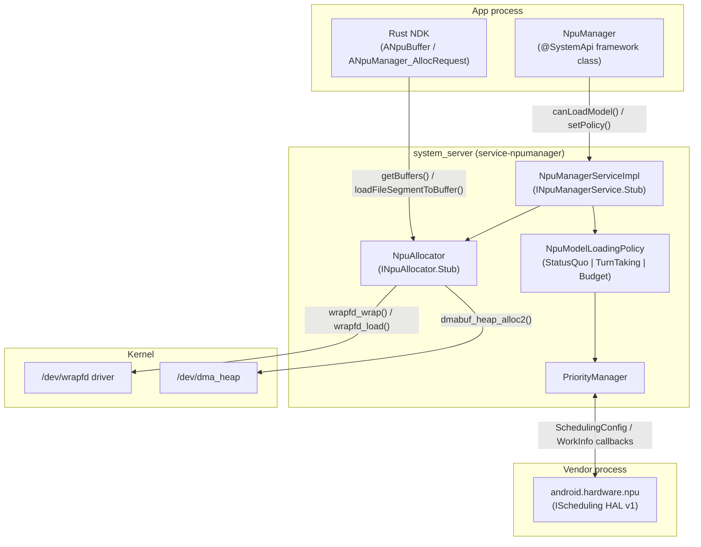
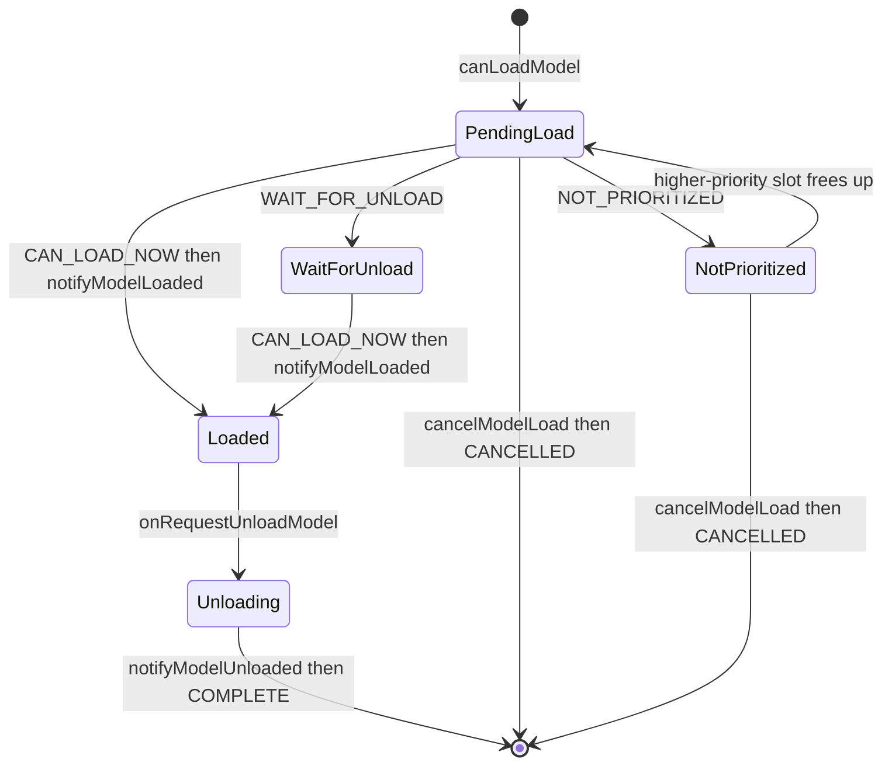
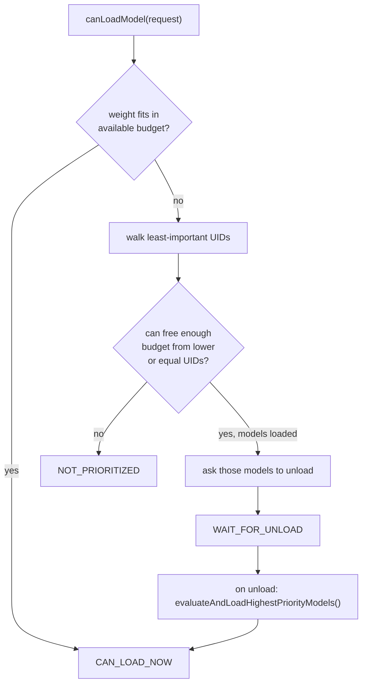
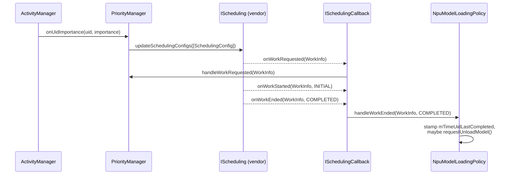
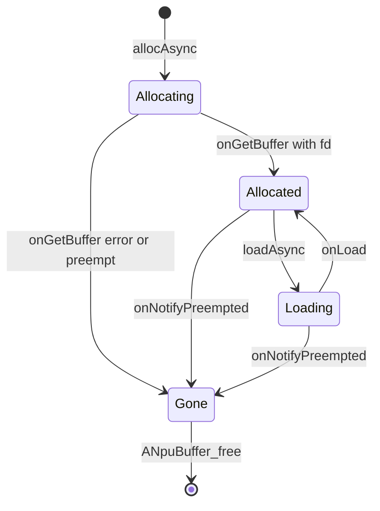
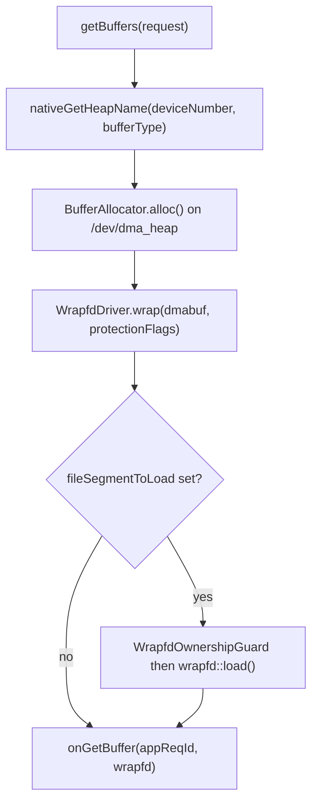

# Chapter 53: NPU Manager

Modern phones ship a neural processing unit (NPU): a fixed-function accelerator
that runs the matrix multiplications behind on-device speech, vision, and
generative models far more efficiently than the CPU or GPU. Until Android 17 the
platform had no opinion about who got to use it. An app loaded its model, mapped
its weights, and handed work to the vendor's NPU driver directly. When two apps
each wanted a multi-gigabyte model resident at the same time, they simply
collided in a fixed memory pool, and the loser got an out-of-memory error or a
silent eviction. There was no priority, no admission control, and no shared
notion of "this buffer holds model weights, protect it."

Android 17 introduces the **NPU Manager**: a new mainline APEX module
(`com.android.npumanager`) plus a paired vendor HAL (`android.hardware.npu`) that
together turn the NPU into a managed, multi-tenant resource. Apps no longer load
models whenever they please; they *ask* the NPU Manager whether it is advisable,
and the service answers based on a pluggable policy, the requesting app's
priority, and a memory budget. A new Rust NDK gives native AI runtimes a way to
allocate protected NPU buffers, and a new kernel primitive, `/dev/wrapfd`, backs
those buffers so their memory-protection state can be enforced by the kernel even
as file descriptors move between processes.

This chapter walks the module top to bottom: why it is new in 17, how the APEX
and its module SDK are structured, the model-load admission-control state machine
and its three policies, the priority model shared with the HAL, the Rust NDK
buffer surface, the `android.hardware.npu` v1 contract, and how `libwrapfd`
enforces buffer protection.

---

## 53.1 Why a Manager, and Why a Module

### 53.1.1 The problem: an unmanaged shared accelerator

An NPU has a small amount of dedicated (or carved-out) memory and a single
command queue. A large language model's weights alone can be 1-2 GB. If a
foreground assistant app and a background photo-categorizer both try to keep
their models resident, the device runs out of NPU-accessible memory and the
vendor driver fails one of them in whatever order it happens to see the requests.
Nothing in the platform expresses that the foreground assistant should win, or
that the background job should be asked to release its model first and politely.

The NPU Manager adds exactly that missing layer. It does **not** run inferences
itself and it does not replace the vendor NPU driver. It is an arbitration and
bookkeeping service that sits between apps and the hardware: it decides *when*
a model may be loaded, *whose* model is evicted under pressure, and *how* the
buffers holding those models are allocated and protected.

### 53.1.2 Why ship it as a mainline module

Packaging the manager as an updatable APEX rather than baking it into the
platform image lets Google iterate on admission-control policy independently of
the yearly OS release: the loading policies, the budget heuristics, and the NDK
can all change through a module update. The APEX is defined in
`packages/modules/NpuManager/apex/Android.bp` as `com.android.npumanager` with
`min_sdk_version: "36"`, and it is gated twice over:

- A build-time release flag, `RELEASE_NPUMANAGER_MODULE`, selects whether the
  APEX, its bootclasspath fragment, its systemserver fragment, and its module SDK
  are even built. Every Soong module in the APEX wraps its `enabled:` field in
  `select(release_flag("RELEASE_NPUMANAGER_MODULE"), ...)`.
- A runtime aconfig flag, `npumanager_enabled` (namespace `machine_learning`,
  declared in `packages/modules/NpuManager/flags/npumanager_flags.aconfig`),
  gates the framework API surface via `@FlaggedApi` and decides whether the
  service connects to the HAL at all.

The APEX contributes code at two classpath levels, both visible in the
`apex/Android.bp`: a `bootclasspath_fragment`
(`com.android.npumanager-bootclasspath-fragment`) carrying the framework library
`framework-npumanager`, and a `systemserverclasspath_fragment` carrying the
service `service-npumanager`. This is the standard split for a module that
exposes a framework-side `@SystemApi` *and* runs logic inside `system_server`.

### 53.1.3 Its own module SDK

Because vendor and other-module code needs to build against the manager's
interfaces, the same `apex/Android.bp` defines a module SDK:

```
// Source: packages/modules/NpuManager/apex/Android.bp
sdk {
    enabled: select(release_flag("RELEASE_NPUMANAGER_MODULE"), {
        true: true,
        false: false,
    }),
    name: "npumanager-module-sdk",
    apexes: [
        "com.android.npumanager",
    ],
}
```

Shipping `npumanager-module-sdk` is what makes `com.android.npumanager` a
self-contained, separately buildable module: consumers snapshot the SDK and
compile against the exported classpath fragments rather than against the live
source tree.

### 53.1.4 The pieces and how they connect

The following diagram shows the major components of the NPU Manager and the
boundary each lives behind.



## 53.2 The Framework Surface

### 53.2.1 The NpuManager system service

Apps reach the manager through the `NpuManager` class
(`packages/modules/NpuManager/framework/java/android/npumanager/NpuManager.java`),
a `@SystemApi` registered under `Context.NPU_SERVICE` (the string `"npu"`). The
whole class is gated by `@FlaggedApi(Flags.FLAG_NPUMANAGER_ENABLED)`. It is a thin
client over the binder interface `INpuManagerService`; the framework registers it
in `NpuManagerFrameworkInitializer.registerServiceWrappers()` via
`SystemServiceRegistry.registerContextAwareService(Context.NPU_SERVICE, ...)`.

The binder contract is small and is, deliberately, *not* a "run my model"
interface. From
`packages/modules/NpuManager/framework/java/android/npumanager/INpuManagerService.aidl`:

```java
// Source: framework/java/android/npumanager/INpuManagerService.aidl
interface INpuManagerService {
    void canLoadModel(in ModelLoadRequestParcelable request, in IModelLoadCallback callback);
    void cancelModelLoad(in ModelLoadRequestParcelable request);
    void notifyModelLoaded(in ModelLoadRequestParcelable request);
    void notifyModelUnloaded(in ModelLoadRequestParcelable request);
    void setPolicy(int policy, in PersistableBundle policyParams);

    /** For memory management. */
    INpuAllocator createAllocator(INpuAllocatorCallback callback);
}
```

Three of these are *admission control* (`canLoadModel`, `cancelModelLoad`,
`setPolicy`), two are *honesty* notifications the app must send back
(`notifyModelLoaded`, `notifyModelUnloaded`), and one returns the *memory
management* allocator (`createAllocator`). The model-management calls require the
`android.Manifest.permission.ACCESS_NPU_MODEL_MANAGER_API` permission: the
framework-side `NpuManager` methods are annotated
`@RequiresPermission(ACCESS_NPU_MODEL_MANAGER_API)`, and on the service side
`NpuManagerServiceImpl.enforceModelManagerPermissions()` is currently invoked
only from `setPolicy()` — the other entry points are marked
`@PermissionManuallyEnforced` but perform no check of their own yet.

### 53.2.2 The request, sizes, and priorities

An app describes a model with `ModelLoadRequest`
(`framework/java/android/npumanager/ModelLoadRequest.java`), built with an id, a
coarse size bucket, and a priority. The size is not a byte count but one of three
buckets. The `NpuModelSize` enum
(`framework/java/android/npumanager/NpuModelSize.aidl`) defines them with bare,
unprefixed names (`LESS_THAN_1GB`, `BETWEEN_1GB_AND_2GB`, `GREATER_THAN_2G`);
`NpuManager` re-exports them as prefixed constants:

- `NPU_MODEL_SIZE_LESS_THAN_1GB` (`NpuModelSize.LESS_THAN_1GB`)
- `NPU_MODEL_SIZE_BETWEEN_1GB_AND_2GB` (`NpuModelSize.BETWEEN_1GB_AND_2GB`)
- `NPU_MODEL_SIZE_GREATER_THAN_2G` (`NpuModelSize.GREATER_THAN_2G`)

The model priority is a two-value bucket on the request itself,
`NPU_MODEL_PRIORITY_NORMAL` versus `NPU_MODEL_PRIORITY_BACKGROUND`. This is
distinct from the fine-grained 0-1000 UID priority the service derives from
`ActivityManager` importance (covered in 53.4) and from the buffer priority on
the NDK side. Three different priority notions live in this module; keeping them
separate matters when reading the code.

### 53.2.3 The asynchronous admission protocol

`canLoadModel()` does not return a yes/no. The app passes a callback and the
service answers later, possibly more than once, through `IModelLoadCallback`,
wrapped on the framework side by `NpuManager.ModelLoadCallbackWrapper`. The
status values are defined on `NpuManager`:

- `NPU_MODEL_LOAD_STATUS_CAN_LOAD_NOW` (0): load it now.
- `NPU_MODEL_LOAD_STATUS_WAIT_FOR_UNLOAD` (1): the service is freeing memory for
  you; wait for a follow-up.
- `NPU_MODEL_LOAD_STATUS_NOT_PRIORITIZED` (2): you are outranked; do not load.

After loading, the app is on its honour to call `notifyModelLoaded()`, and when
done (or when asked via the callback's `onRequestUnloadModel()`) to call
`notifyModelUnloaded()`. The terminal callback `onModelLoadRequestComplete()`
delivers either `NPU_MODEL_LOAD_REQUEST_STATUS_CANCELLED` (3) or
`NPU_MODEL_LOAD_REQUEST_STATUS_COMPLETE` (4), after which no further updates
arrive for that request.

The state machine an app's request moves through, as driven by the policy:



## 53.3 Admission Control and the Three Policies

The service implementation
(`packages/modules/NpuManager/service/java/com/android/server/npumanager/NpuManagerServiceImpl.java`)
holds a single `NpuModelLoadingPolicy` and forwards every `canLoadModel`,
`notifyModelLoaded`, `notifyModelUnloaded`, and `cancelModelLoad` straight to it.
`setPolicy()` swaps the policy object at runtime via a switch over the three
policy constants. `NpuModelLoadingPolicy` is the abstract base; there are three
concrete implementations.

### 53.3.1 StatusQuo: no arbitration

`StatusQuoModelLoadingPolicy`
(`service/java/com/android/server/npumanager/StatusQuoModelLoadingPolicy.java`) is
the default and "mimics the behavior prior to the introduction of the
NpuModelManager." Its `canLoadModel()` immediately answers `CAN_LOAD_NOW` for everyone
and tracks callbacks only so it can fire `onModelLoadRequestComplete()` on
cancel/unload. It is the bypass that preserves pre-17 behaviour when the policy
has not been changed.

### 53.3.2 Budget: multiple models within a weighted cap

`BudgetModelLoadingPolicy`
(`service/java/com/android/server/npumanager/BudgetModelLoadingPolicy.java`) is
the real arbiter. It assigns each model size a **weight** and allows concurrent
loads as long as the summed weight of loaded-and-pending models stays within a
maximum budget. The default weights map small/medium/large models to 1/2/4:

```java
// Source: service/java/com/android/server/npumanager/BudgetModelLoadingPolicy.java
private static final Map<Integer, Integer> DEFAULT_MODEL_WEIGHTS =
        Map.of(
                NPU_MODEL_SIZE_LESS_THAN_1GB, 1,
                NPU_MODEL_SIZE_BETWEEN_1GB_AND_2GB, 2,
                NPU_MODEL_SIZE_GREATER_THAN_2G, 4);
```

Both the per-size weights and the cap are configurable through the
`PersistableBundle` passed to `setPolicy()`, keyed by
`NpuManager.KEY_MODEL_SIZE_WEIGHTS` and `NpuManager.KEY_MAX_BUDGET`. When a new
request would exceed the budget, the policy walks the *least important* UIDs
first (`getLeastImportantUids()`), and for any UID no more important than the
caller it asks those models to unload (if loaded) or cancels them (if still
pending), until enough budget is freed. If the caller cannot win that contest it
gets `NOT_PRIORITIZED`; if models are being unloaded for it, it gets
`WAIT_FOR_UNLOAD`. When a model finally unloads, `evaluateAndLoadHighestPriorityModels()`
re-runs the whole ranking and notifies the next winners.

Two tie-breakers are worth noting because they shape fairness. When two UIDs have
equal importance, the one that has *not* completed work recently is preferred
(tracked in `mTimeUidLastCompleted`, stamped from `handleWorkEnded()`), and the
policy registers a binder death recipient per calling UID so that a crashed
client's models are reclaimed and the budget re-evaluated.

### 53.3.3 TurnTaking: exactly one model at a time

`TurnTakingModelLoadingPolicy`
(`service/java/com/android/server/npumanager/TurnTakingModelLoadingPolicy.java`)
is a thin subclass of the budget policy that is the clearest demonstration of how
general the budget mechanism is: it sets every size weight to 1 and the maximum
budget to 1.

```java
// Source: service/java/com/android/server/npumanager/TurnTakingModelLoadingPolicy.java
super(
        priorityManager,
        Map.of(
                NPU_MODEL_SIZE_LESS_THAN_1GB, 1,
                NPU_MODEL_SIZE_BETWEEN_1GB_AND_2GB, 1,
                NPU_MODEL_SIZE_GREATER_THAN_2G, 1),
        1);
```

With a budget of 1 and every model costing 1, only a single model can be resident
at a time; the highest-priority UID holds the slot and a higher-importance UID
preempts it. The budget policy's eviction and re-evaluation logic does all the
work.

The admission decision for the budget/turn-taking case, end to end:



## 53.4 Priorities and the HAL Bridge

### 53.4.1 PriorityManager and the 0-1000 scale

The policies rank UIDs, but the raw priority numbers come from `PriorityManager`
(`service/java/com/android/server/npumanager/PriorityManager.java`). It listens to
`ActivityManager.OnUidImportanceListener` and maps process importance onto a
per-UID priority on the scale defined by the HAL parcelable `SchedulingConfig`:
`MIN_PRIORITY = 0` is the **highest** priority and `MAX_PRIORITY = 1000` the
lowest. System and root UIDs are pinned to a static priority of 100. An unknown
UID is treated as `MAX_PRIORITY`.

The same scale is what the NDK buffer priority (0-1000, default 500) and the HAL
`WorkInfo.jobPriority` use, so the entire module speaks one priority language
where 0 means "most important."

### 53.4.2 Feature-gating apps

`PriorityManager` also enforces a new platform requirement: an app must declare
the `PackageManager.FEATURE_NEURAL_PROCESSING_UNIT` feature to get NPU access.
For apps targeting Android 17 (`Build.VERSION_CODES.CINNAMON_BUN`) that omit the
feature, the manager sets `SchedulingConfig.hasDirectAccess = false` when the
`npumanager_block_missing_feature` flag is on (and logs a warning that access
"will soon be blocked" when it is off). This is tracked per package through an
`NpuPackageMonitor` that reacts to install, remove, and modify events.

### 53.4.3 The android.hardware.npu HAL v1 contract

The vendor side is a new AIDL HAL at
`hardware/interfaces/npu/aidl/android/hardware/npu/`, versioned as v1 (the frozen
snapshot lives under `aidl_api/android.hardware.npu/1/`). It is intentionally not
an "execute inference" interface, the HAL `README.md` notes that running work is
still done through the vendor SDK; the HAL is purely about *priority and
observation*.

`IScheduling` (`IScheduling.aidl`) is what `NpuManagerServiceImpl` connects to
(via `ServiceManager.waitForDeclaredService(IScheduling.DESCRIPTOR + "/default")`).
It carries three methods:

- `setSchedulingConfigs(SchedulingConfig[])` replaces the entire priority table.
- `updateSchedulingConfigs(SchedulingConfig[])` incrementally upserts entries.
- `setCallback(ISchedulingCallback)` registers the manager's observer.

`SchedulingConfig` (`SchedulingConfig.aidl`) carries the `uid`, its `priority`,
`hasDirectAccess`, and `canAttributeOtherUid` (whether an intermediary service may
submit work on another app's behalf). The NPU is expected to make a *best effort*
to run lower-numbered priorities first.

The reverse direction is `ISchedulingCallback` (`ISchedulingCallback.aidl`), a
`oneway` interface the HAL calls to report NPU activity:

- `onWorkRequested(WorkInfo)`
- `onWorkStarted(WorkInfo, StartReason)` where `StartReason` is `INITIAL` or
  `RESUMED`
- `onWorkEnded(WorkInfo, EndReason)` where `EndReason` is one of
  `CANCELLED_USER`, `CANCELLED_SYSTEM`, `PAUSED`, `FAILED`, `COMPLETED`

These events are debounced by `DEBOUNCE_DURATION_MS = 50`. `WorkInfo`
(`WorkInfo.aidl`) describes a unit of NPU work: a monotonically increasing `id`,
an optional `groupId` (a `Uuid` linking inferences that belong to one larger
effort), the requesting `uid`, an `originalUid` for attributed work, a
`jobPriority`, and a combined `effectivePriority` (UID priority plus job
priority, ranging up to `MAX_PRIORITY * 2`).

In `NpuManagerServiceImpl`, `onWorkRequested` flows into
`PriorityManager.handleWorkRequested()` (so newly seen UIDs get prioritized), and
`onWorkEnded` flows into the active policy's `handleWorkEnded()` (so the budget
policy can stamp its fairness timestamps and, when a peer of equal priority is
waiting, ask the completed UID to unload; the actual re-evaluation happens later,
when the unload lands via `notifyModelUnloaded`). The connection is
self-healing: the service `linkToDeath`s the HAL binder and reconnects in
`ensureHalService()` if the vendor process dies.

The control and observation loop between the service and the HAL:



## 53.5 The Rust NDK and ANpuBuffer

### 53.5.1 The native allocation surface

Native AI runtimes (the kind that actually map model weights) use the C NDK
declared in `packages/modules/NpuManager/ndk/include/android/npumanager/buffer.h`.
The opaque handle is `ANpuBuffer`; a request to allocate one is built up on an
`ANpuManager_AllocRequest`. The implementation behind this header is **Rust**:
`ndk/Android.bp` builds `libnpumanager_rust` (crate root `buffer_impl.rs`) and
wraps it in the shared library `libcom.android.npumanager.so`, which ships inside
the APEX. Because `libandroid.so` may be loaded before the APEX is ready, the
public entry points are reached through a lazy `dlopen()` shim
(`ndk/npumanager_dlopen.h` / `.cpp`).

A request is parameterized by:

- `ANpuManager_AllocRequest_setDeviceNumber()` — which NPU (vendor-opaque, must
  be non-negative).
- `ANpuManager_AllocRequest_setBufferType()` — one of `ANPUBUFFER_TYPE_*`:
  `MODEL_EXECUTABLE`, `MODEL_WEIGHTS`, `CACHE`, `AUXILIARY` (input/output buffers
  use `AHardwareBuffer` instead).
- `ANpuManager_AllocRequest_setSize()`, `setBufferPriority()` (the 0-1000 scale,
  default `ANPUBUFFER_PRIORITY_DEFAULT = 500`), and
  `setProtectionFlags()` (default `PROT_READ`).
- `ANpuManager_AllocRequest_setFileSegmentToLoad()` — optionally a file fd plus
  offsets so the manager loads weights straight into the buffer.
- `setCookie()`, `setOnAlloc()`, `setOnPreempt()` — the callback wiring.

All entry points are `__INTRODUCED_IN(37)`. Allocation is asynchronous:
`ANpuManager_allocAsync()` takes a batch of requests and the results arrive on the
per-request `ANpuManager_AllocCallback`. Once allocated, the buffer is used with
`ANpuBuffer_map()` / `ANpuBuffer_unmap()` (mmap-like, but the `prot` must be a
subset of the protection flags fixed at allocation), `ANpuBuffer_setPriority()`,
and `ANpuBuffer_loadAsync()` to stream a file segment in after the fact. Every
buffer, even a preempted one, must be released with `ANpuBuffer_free()`.

### 53.5.2 The buffer state machine

The Rust client (`ndk/npu_buffer_state.rs`) tracks each buffer through a small
state machine that mirrors the asynchronous service responses. A buffer starts
**Allocating**, becomes **Allocated** when the service returns its fd (or **Gone**
if allocation fails), moves to **Loading** during `ANpuBuffer_loadAsync()` and
back to **Allocated** on completion, and can be forced to **Gone** at any point
by a preemption. The transitions are encoded directly in `NpuBufferState`:



Preemption is the NDK's eviction signal: the service calls
`INpuAllocatorCallback.onNotifyPreempted()`, the client advances the buffer to
`Gone`, and the optional `ANpuManager_PreemptCallback` fires. After that, any
`ANpuBuffer_map()` fails with `errno == ENOENT`, because the kernel has cleared
the underlying buffer (see 53.6).

### 53.5.3 The allocator binder path

Underneath the C API, the Rust client talks to the service through
`INpuAllocator` (`framework/java/android/npumanager/INpuAllocator.aidl`), obtained
from `INpuManagerService.createAllocator()`. The client side
(`ndk/npu_allocator_client.rs`) batches requests into `getBuffers()`, checks
`isSupported()`, and returns buffers with `putBuffers()`; a buffer's priority is
adjusted with `setPriority()` from `ndk/npu_manager_delegate.rs`, and data is
streamed with `loadFileSegmentToBuffer()` from `ndk/npu_buffer_impl.rs` (reached
via `NpuAllocatorClient::load_async`). Replies come back asynchronously on
`INpuAllocatorCallback` (`onGetBuffer`, `onLoad`, `onNotifyPreempted`). The
service implementation of the allocator is `NpuAllocator`
(`service/java/com/android/server/npumanager/NpuAllocator.java`), an
`INpuAllocator.Stub` that does the real heap allocation and wrapping on a
background thread pool.

## 53.6 libwrapfd and Buffer Protection

### 53.6.1 The /dev/wrapfd primitive

The buffers the NPU Manager hands out are not plain `dma_heap` allocations; they
are *wrapped* so the kernel can enforce how they may be mapped and who owns them.
This is the job of `libwrapfd` (`system/memory/libwrapfd`), a new Rust library and
LLNDK shared library over a new `/dev/wrapfd` kernel driver. It is built as both a
`rust_library` (`libwrapfd_rust`) and a `cc_library_shared` (`libwrapfd`), and is
`apex_available` to `com.android.npumanager` (`system/memory/libwrapfd/rust/Android.bp`).

`libwrapfd` takes an existing fd (a dma-buf, in this case) and returns a new
*wrapfd* that delegates to it but adds protection state. The core operation is
`WrapfdDriver::wrap(fd, prot)`
(`system/memory/libwrapfd/rust/lib.rs`), which pins the wrapped fd to a
protection mask of `PROT_NONE` or a combination of `PROT_READ`/`PROT_WRITE`. From
then on the kernel constrains how the buffer can be mapped. Additional operations
include:

- `acquire_ownership()` / `release_ownership()` — exclusive ownership while the
  owner mutates the buffer; the RAII `WrapfdOwnershipGuard` releases on drop.
- `load(wrapfd, file, file_offset, buf_offset, len)` — DMA a file segment into
  the buffer; requires ownership and page-aligned offsets.
- `rewrap(prot)` — move the underlying buffer into a new wrap with a different
  protection mask.
- `allow_guests()` / `prohibit_guests()` — control whether non-owner processes
  may map the buffer.
- `empty()` — free the wrapped buffer; this is what makes a preempted buffer's
  subsequent maps fail.

The header `system/memory/libwrapfd/rust/include/wrapfd.h` documents the C
surface and the `WrapfdState` enum (`EMPTY`, `RDONLY`, `RDWR`) that
`wrapfd_get_state()` reports.

### 53.6.2 Allocate, wrap, load

`NpuAllocator` ties the dma-buf heap, `libwrapfd`, and the buffer type together in
its JNI layer (`service/jni/com_android_server_npumanager_NpuAllocator.rs`, the
crate `libnpumanager_service_jni`). The sequence for one buffer, named
`allocWrapLoad` on the Java side, is:

1. Pick a DMA-buf heap by `(deviceNumber, bufferType)` from a device DMA-buf heap
   config (`nativeGetHeapName`), so different NPUs and buffer types can map to
   different heaps.
2. Allocate on that heap with `BufferAllocator::alloc()` and name it for
   debugging (`npubuf-<pid>-<appReqId>`).
3. `WrapfdDriver::wrap()` the dma-buf with the request's protection flags.
4. If a file segment was requested, take ownership with `WrapfdOwnershipGuard`,
   call `wrapfd::load()` to DMA the weights in, then release ownership.
5. Return the *wrapfd* (not the raw dma-buf) to the client, which receives it via
   `onGetBuffer`.

Because the wrapfd carries the protection state in the kernel, the app can map the
weights read-only and the manager retains the ability to revoke them by emptying
the wrap on preemption, all without the app and the service trusting each other's
userspace. The allocator probes for the driver at construction time
(`nativeInitWrapfdDriver()`); a device without `/dev/wrapfd` throws
`UnsupportedOperationException`, which is how the manager degrades gracefully on
hardware that does not support wrapped buffers.



## 53.7 Try It

These commands exercise the module on a device or emulator where the
`RELEASE_NPUMANAGER_MODULE` build flag and `npumanager_enabled` aconfig flag are
on. The service is reachable as the `npu` service.

- Confirm the service is registered and the APEX is present:

  ```bash
  adb shell service list | grep npu
  adb shell ls /apex/com.android.npumanager
  ```

- Inspect the live policy, requests, and priority table (this is the `info`
  subcommand wired up in `NpuManagerServiceImpl.handleShellCommand`):

  ```bash
  adb shell cmd npu info
  ```

- Switch admission-control policies at runtime and re-check `info`:

  ```bash
  adb shell cmd npu set-turn-taking-policy
  adb shell cmd npu set-budget-policy
  adb shell cmd npu set-status-quo-policy
  ```

- Temporarily stop the service from pushing priorities to the HAL, then re-enable
  it (root only):

  ```bash
  adb root
  adb shell cmd npu disable
  adb shell cmd npu enable
  ```

- Check whether a device advertises the NPU HAL and feature:

  ```bash
  adb shell dumpsys package | grep android.hardware.npu
  adb shell pm list features | grep android.hardware.npu
  ```

- Read the frozen v1 HAL interface to see exactly what a vendor must implement:

  ```bash
  ls hardware/interfaces/npu/aidl/aidl_api/android.hardware.npu/1/
  ```

## Summary

- Android 17 adds the **NPU Manager**, a mainline APEX
  (`com.android.npumanager`) that arbitrates access to on-device neural
  accelerators. It is gated by the `RELEASE_NPUMANAGER_MODULE` build flag and the
  `npumanager_enabled` aconfig flag, and ships its own module SDK
  (`npumanager-module-sdk`) plus bootclasspath and systemserver fragments.
- Apps use the `@SystemApi` `NpuManager` (`Context.NPU_SERVICE`) to *ask* whether
  a model may load rather than loading directly. The asynchronous protocol answers
  `CAN_LOAD_NOW`, `WAIT_FOR_UNLOAD`, or `NOT_PRIORITIZED`, and apps must honestly
  report `notifyModelLoaded` / `notifyModelUnloaded`.
- Admission control is pluggable: `StatusQuo` (no arbitration, the default),
  `Budget` (weighted concurrent loads under a cap, with priority-based eviction),
  and `TurnTaking` (the budget policy with weight 1 and budget 1, i.e. one model
  at a time).
- `PriorityManager` maps `ActivityManager` importance onto the shared 0-1000
  priority scale (0 = highest) and feeds it to the vendor HAL; it also blocks
  Android 17 apps that omit `FEATURE_NEURAL_PROCESSING_UNIT`.
- The paired `android.hardware.npu` HAL v1 (`IScheduling` /
  `ISchedulingCallback`) carries per-UID `SchedulingConfig` priorities down and
  `WorkInfo` start/end callbacks (`StartReason`, `EndReason`) back up; it does not
  execute inferences itself.
- A Rust NDK (`ANpuBuffer`, `ANpuManager_AllocRequest`, behind
  `libcom.android.npumanager.so`) lets native runtimes allocate, map, load, and
  free protected NPU buffers, with a preemption callback for eviction.
- `libwrapfd` over the new `/dev/wrapfd` kernel driver backs those buffers: the
  service allocates on a DMA-buf heap, `wrap()`s the fd with a protection mask,
  optionally `load()`s weights in, and can `empty()` the wrap on preemption so a
  revoked buffer's maps fail with `ENOENT`.

### Key Source Files Reference

| File | Purpose |
|------|---------|
| `packages/modules/NpuManager/apex/Android.bp` | APEX `com.android.npumanager`, classpath fragments, and `npumanager-module-sdk` |
| `packages/modules/NpuManager/flags/npumanager_flags.aconfig` | `npumanager_enabled` / `npumanager_block_missing_feature` flags |
| `packages/modules/NpuManager/framework/java/android/npumanager/NpuManager.java` | `@SystemApi` client, status/size/priority/policy constants |
| `packages/modules/NpuManager/framework/java/android/npumanager/INpuManagerService.aidl` | Binder admission-control + `createAllocator` contract |
| `packages/modules/NpuManager/framework/java/android/npumanager/INpuAllocator.aidl` | Buffer allocator binder interface |
| `packages/modules/NpuManager/service/java/com/android/server/npumanager/NpuManagerServiceImpl.java` | Service impl, HAL connection, shell commands |
| `packages/modules/NpuManager/service/java/com/android/server/npumanager/BudgetModelLoadingPolicy.java` | Weighted-budget admission and eviction |
| `packages/modules/NpuManager/service/java/com/android/server/npumanager/TurnTakingModelLoadingPolicy.java` | One-model-at-a-time policy (budget 1) |
| `packages/modules/NpuManager/service/java/com/android/server/npumanager/PriorityManager.java` | UID priority mapping and feature gating |
| `packages/modules/NpuManager/service/java/com/android/server/npumanager/NpuAllocator.java` | Heap alloc + wrap + load on the service side |
| `packages/modules/NpuManager/service/jni/com_android_server_npumanager_NpuAllocator.rs` | Rust JNI: dma-buf alloc, `wrapfd::wrap`, `wrapfd::load` |
| `packages/modules/NpuManager/ndk/include/android/npumanager/buffer.h` | C NDK: `ANpuBuffer`, `ANpuManager_AllocRequest` |
| `packages/modules/NpuManager/ndk/npu_buffer_state.rs` | NDK buffer state machine |
| `hardware/interfaces/npu/aidl/android/hardware/npu/IScheduling.aidl` | NPU HAL v1: priority push and callback registration |
| `hardware/interfaces/npu/aidl/android/hardware/npu/WorkInfo.aidl` | HAL work descriptor (priorities, attribution) |
| `system/memory/libwrapfd/rust/lib.rs` | `/dev/wrapfd` wrapper: `wrap`, ownership, `load`, `empty` |
| `system/memory/libwrapfd/rust/include/wrapfd.h` | `libwrapfd` C/LLNDK surface and `WrapfdState` |
