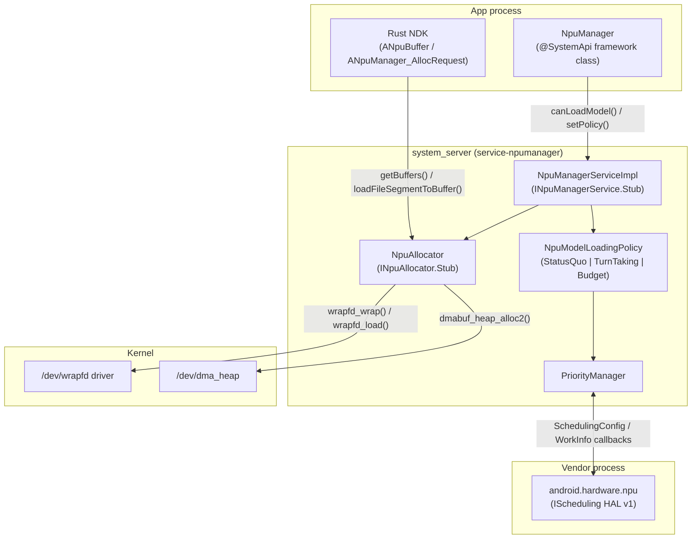
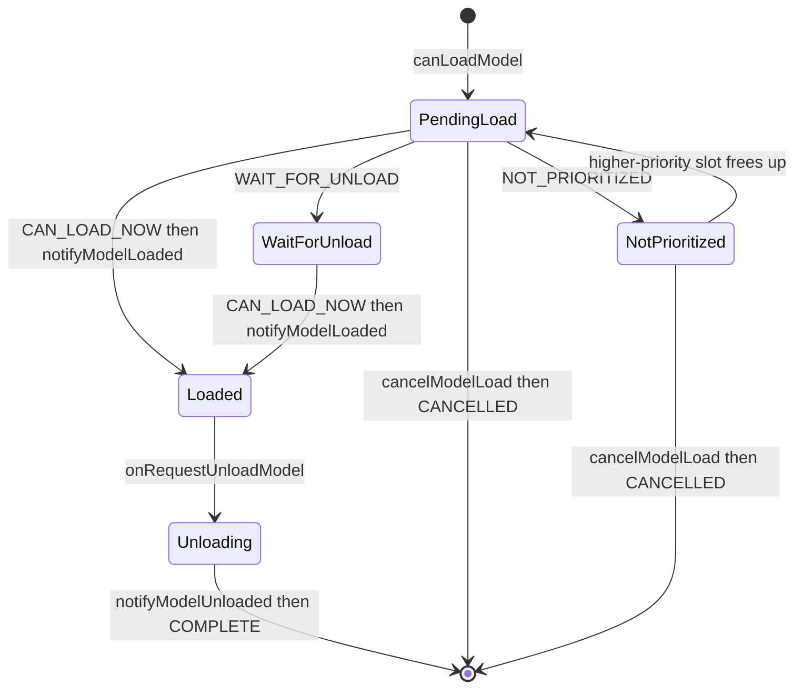
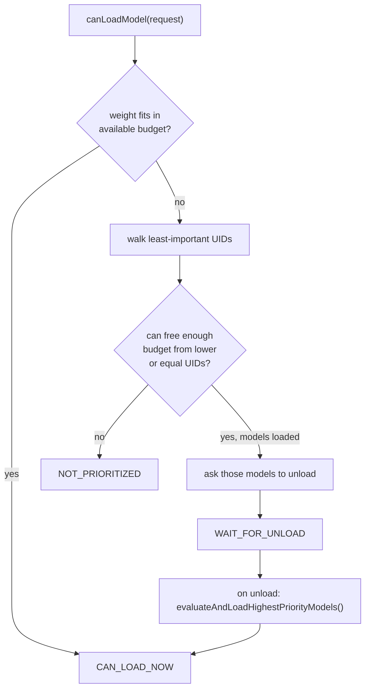
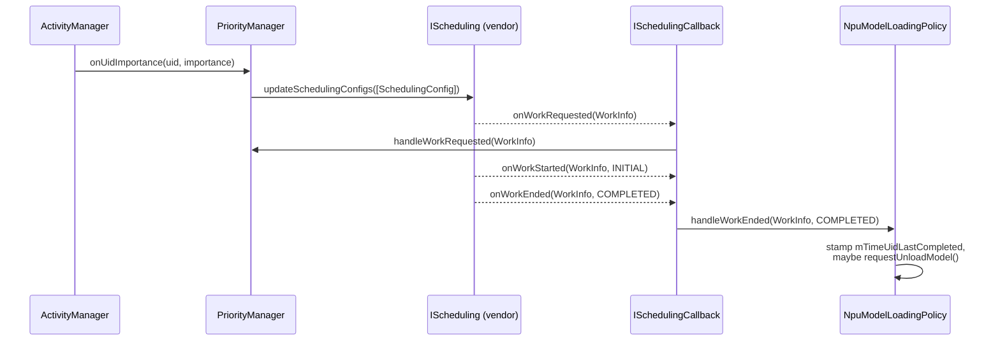
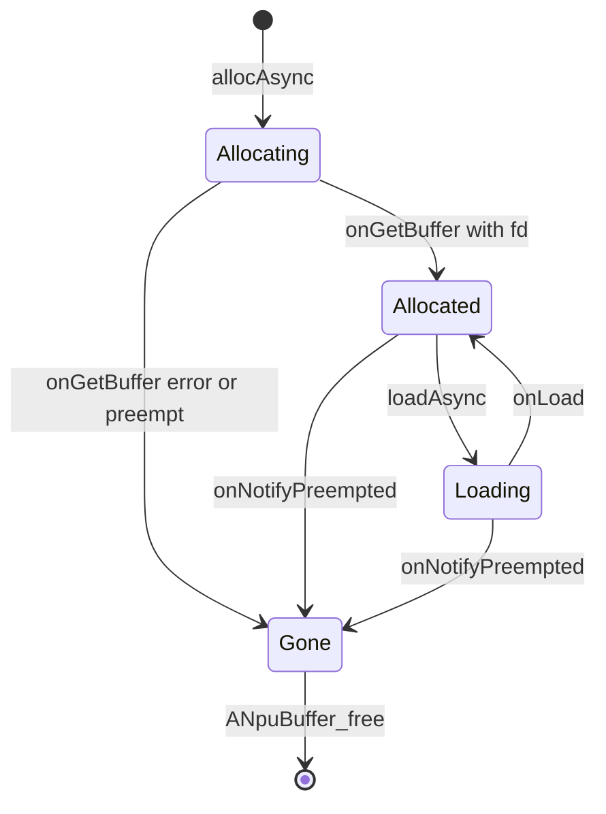
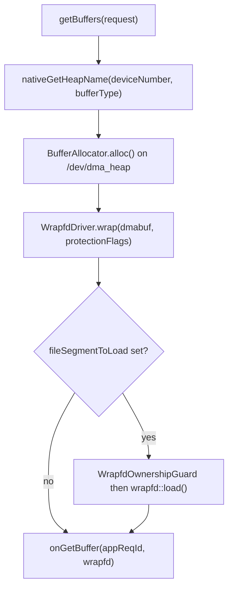

# Chapter 53: NPU Manager

Modern phones ship a neural processing unit (NPU). The NPU is a fixed-function
accelerator. It runs the matrix multiplications behind on-device speech, vision,
and generative models far more efficiently than the CPU or GPU.

Until Android 17, the platform did not control which apps could use the NPU. An
app loaded its model, mapped its weights, and handed work to the vendor's NPU
driver directly. If two apps each wanted a multi-gigabyte model resident at the
same time, they collided in a fixed memory pool. The loser got an out-of-memory
error or a silent eviction. There was no priority, no admission control, and no
shared notion of "this buffer holds model weights, protect it."

Android 17 introduces the **NPU Manager**: a new mainline APEX module
(`com.android.npumanager`) plus a paired vendor HAL (`android.hardware.npu`).
Together they turn the NPU into a managed, multi-tenant resource. Apps no longer
load models whenever they want. They *ask* the NPU Manager whether they should
load a model. The service answers based on a pluggable policy, the priority of
the app that makes the request, and a memory budget.

A new Rust NDK gives native AI runtimes a way to allocate protected NPU buffers.
A new kernel primitive, `/dev/wrapfd`, backs those buffers. The primitive lets
the kernel enforce the memory-protection state of the buffers, even as file
descriptors move between processes.

This chapter explains the module from top to bottom. First, it shows why the
module is new in Android 17 and describes the structure of the APEX and its module
SDK. Then it covers the admission-control state machine for model loads and its
three policies. Next, it describes the priority model that the service and the HAL
share, the buffer surface of the Rust NDK, and the `android.hardware.npu` v1
contract. Last, it shows how `libwrapfd` enforces buffer protection.

---

## 53.1 Why a Manager, and Why a Module

### 53.1.1 The problem: an unmanaged shared accelerator

An NPU has a small amount of dedicated (or carved-out) memory and a single
command queue. A large language model's weights alone can be 1-2 GB. If a
foreground assistant app and a background photo-categorizer both try to keep
their models resident, the device runs out of NPU-accessible memory. The vendor
driver then fails one of them, in whatever order the requests happen to arrive.
Nothing in the platform says that the foreground assistant should win. Nothing
says that the platform should politely ask the background job to release its
model first.

The NPU Manager adds exactly that missing layer. It does **not** run inferences
itself and it does not replace the vendor NPU driver. It is an arbitration and
bookkeeping service that sits between apps and the hardware. It decides *when*
an app may load a model and *whose* model it evicts under pressure. It also
decides *how* to allocate and protect the buffers that hold those models.

### 53.1.2 Why ship it as a mainline module

The manager is an updatable APEX, not part of the platform image. This lets
Google iterate on admission-control policy independently of the yearly OS
release. The loading policies, the budget heuristics, and the NDK can all change
through a module update. The file `packages/modules/NpuManager/apex/Android.bp`
defines the APEX as `com.android.npumanager` with `min_sdk_version: "36"`. Two
flags gate the APEX:

- A build-time release flag, `RELEASE_NPUMANAGER_MODULE`, selects whether the
  build system builds the APEX, its bootclasspath and systemserver fragments, and
  its module SDK. Every Soong module in the APEX wraps its `enabled:` field in
  `select(release_flag("RELEASE_NPUMANAGER_MODULE"), ...)`.
- A runtime aconfig flag, `npumanager_enabled`, gates the framework API surface
  via `@FlaggedApi`. It also decides whether the service connects to the HAL at
  all. The file `packages/modules/NpuManager/flags/npumanager_flags.aconfig`
  declares the flag in the namespace `machine_learning`.

The APEX contributes code at two classpath levels, both visible in the
`apex/Android.bp`. The first level is a `bootclasspath_fragment`
(`com.android.npumanager-bootclasspath-fragment`) that carries the framework
library `framework-npumanager`. The second is a `systemserverclasspath_fragment`
that carries the service `service-npumanager`. This is the standard split for a
module that exposes a framework-side `@SystemApi` *and* runs logic inside
`system_server`.

### 53.1.3 Its own module SDK

Because vendor and other-module code needs to build against the manager's
interfaces, the same `apex/Android.bp` defines a module SDK:

```
// Source: packages/modules/NpuManager/apex/Android.bp
sdk {
    enabled: select(release_flag("RELEASE_NPUMANAGER_MODULE"), {
        true: true,
        false: false,
    }),
    name: "npumanager-module-sdk",
    apexes: [
        "com.android.npumanager",
    ],
}
```

The module ships `npumanager-module-sdk`. This makes `com.android.npumanager` a
self-contained, separately buildable module. Consumers snapshot the SDK and
compile against the exported classpath fragments. They do not compile against
the live source tree.

### 53.1.4 The pieces and how they connect

The following diagram shows the major components of the NPU Manager and the
boundary each lives behind.


```mermaid
flowchart TB
    subgraph App["App process"]
        API["NpuManager<br/>(@SystemApi framework class)"]
        NDK["Rust NDK<br/>(ANpuBuffer / ANpuManager_AllocRequest)"]
    end
    subgraph SS["system_server (service-npumanager)"]
        Svc["NpuManagerServiceImpl<br/>(INpuManagerService.Stub)"]
        Policy["NpuModelLoadingPolicy<br/>(StatusQuo | TurnTaking | Budget)"]
        Prio["PriorityManager"]
        Alloc["NpuAllocator<br/>(INpuAllocator.Stub)"]
    end
    subgraph Kern["Kernel"]
        Wrap["/dev/wrapfd driver"]
        Heap["/dev/dma_heap"]
    end
    subgraph Vendor["Vendor process"]
        HAL["android.hardware.npu<br/>(IScheduling HAL v1)"]
    end

    API -->|"canLoadModel() / setPolicy()"| Svc
    NDK -->|"getBuffers() / loadFileSegmentToBuffer()"| Alloc
    Svc --> Policy
    Policy --> Prio
    Svc --> Alloc
    Prio <-->|"SchedulingConfig / WorkInfo callbacks"| HAL
    Alloc -->|"dmabuf_heap_alloc2()"| Heap
    Alloc -->|"wrapfd_wrap() / wrapfd_load()"| Wrap
```

## 53.2 The Framework Surface

### 53.2.1 The NpuManager system service

Apps reach the manager through the `NpuManager` class
(`packages/modules/NpuManager/framework/java/android/npumanager/NpuManager.java`).
The framework registers this `@SystemApi` class under `Context.NPU_SERVICE` (the
string `"npu"`). The annotation `@FlaggedApi(Flags.FLAG_NPUMANAGER_ENABLED)` gates
the whole class. The class is a thin client over the binder interface
`INpuManagerService`. The registration happens in
`NpuManagerFrameworkInitializer.registerServiceWrappers()` via
`SystemServiceRegistry.registerContextAwareService(Context.NPU_SERVICE, ...)`.

The binder contract is small and is, deliberately, *not* a "run my model"
interface. From
`packages/modules/NpuManager/framework/java/android/npumanager/INpuManagerService.aidl`:

```java
// Source: framework/java/android/npumanager/INpuManagerService.aidl
interface INpuManagerService {
    void canLoadModel(in ModelLoadRequestParcelable request, in IModelLoadCallback callback);
    void cancelModelLoad(in ModelLoadRequestParcelable request);
    void notifyModelLoaded(in ModelLoadRequestParcelable request);
    void notifyModelUnloaded(in ModelLoadRequestParcelable request);
    void setPolicy(int policy, in PersistableBundle policyParams);

    /** For memory management. */
    INpuAllocator createAllocator(INpuAllocatorCallback callback);
}
```

Three of these are *admission control* (`canLoadModel`, `cancelModelLoad`,
`setPolicy`). Two are *honesty* notifications that the app must send back
(`notifyModelLoaded`, `notifyModelUnloaded`). One returns the *memory
management* allocator (`createAllocator`).

The model-management calls require the
`android.Manifest.permission.ACCESS_NPU_MODEL_MANAGER_API` permission. The
framework-side `NpuManager` methods have the annotation
`@RequiresPermission(ACCESS_NPU_MODEL_MANAGER_API)`. On the service side, only
`setPolicy()` currently calls
`NpuManagerServiceImpl.enforceModelManagerPermissions()`. The other entry points
have the annotation `@PermissionManuallyEnforced`, but they perform no check of
their own yet.

### 53.2.2 The request, sizes, and priorities

An app describes a model with `ModelLoadRequest`
(`framework/java/android/npumanager/ModelLoadRequest.java`). The app builds the
request with an id, a coarse size bucket, and a priority. The size is not a byte
count but one of three buckets. The `NpuModelSize` enum
(`framework/java/android/npumanager/NpuModelSize.aidl`) defines them with bare,
unprefixed names (`LESS_THAN_1GB`, `BETWEEN_1GB_AND_2GB`, `GREATER_THAN_2G`).
`NpuManager` re-exports them as prefixed constants:

- `NPU_MODEL_SIZE_LESS_THAN_1GB` (`NpuModelSize.LESS_THAN_1GB`)
- `NPU_MODEL_SIZE_BETWEEN_1GB_AND_2GB` (`NpuModelSize.BETWEEN_1GB_AND_2GB`)
- `NPU_MODEL_SIZE_GREATER_THAN_2G` (`NpuModelSize.GREATER_THAN_2G`)

The model priority is a two-value bucket on the request itself,
`NPU_MODEL_PRIORITY_NORMAL` versus `NPU_MODEL_PRIORITY_BACKGROUND`. This model
priority is different from the fine-grained 0-1000 UID priority that the service
derives from `ActivityManager` importance (see 53.4). The model priority is also
different from the buffer priority on the NDK side. Three different priority
notions live in this module. Keep them separate when you read the code.

### 53.2.3 The asynchronous admission protocol

`canLoadModel()` does not return a yes or no answer. The app passes a callback
and the service answers later, possibly more than once, through
`IModelLoadCallback`. On the framework side,
`NpuManager.ModelLoadCallbackWrapper` wraps that callback. `NpuManager` defines
the status values:

- `NPU_MODEL_LOAD_STATUS_CAN_LOAD_NOW` (0): load it now.
- `NPU_MODEL_LOAD_STATUS_WAIT_FOR_UNLOAD` (1): the service frees memory for you.
  Wait for a follow-up.
- `NPU_MODEL_LOAD_STATUS_NOT_PRIORITIZED` (2): another app outranks you. Do not
  load.

After the app loads the model, it must call `notifyModelLoaded()`. When the app
finishes with the model, or when the service asks through the callback's
`onRequestUnloadModel()`, it must call `notifyModelUnloaded()`. The service
trusts the app to do both. The terminal callback `onModelLoadRequestComplete()`
delivers either `NPU_MODEL_LOAD_REQUEST_STATUS_CANCELLED` (3) or
`NPU_MODEL_LOAD_REQUEST_STATUS_COMPLETE` (4), after which no further updates
arrive for that request.

The policy drives the state machine that an app's request moves through:


```mermaid
stateDiagram-v2
    [*] --> PendingLoad : canLoadModel
    PendingLoad --> Loaded : CAN_LOAD_NOW then notifyModelLoaded
    PendingLoad --> NotPrioritized : NOT_PRIORITIZED
    PendingLoad --> WaitForUnload : WAIT_FOR_UNLOAD
    WaitForUnload --> Loaded : CAN_LOAD_NOW then notifyModelLoaded
    NotPrioritized --> PendingLoad : higher-priority slot frees up
    Loaded --> Unloading : onRequestUnloadModel
    Unloading --> [*] : notifyModelUnloaded then COMPLETE
    PendingLoad --> [*] : cancelModelLoad then CANCELLED
    NotPrioritized --> [*] : cancelModelLoad then CANCELLED
```

## 53.3 Admission Control and the Three Policies

The service implementation
(`packages/modules/NpuManager/service/java/com/android/server/npumanager/NpuManagerServiceImpl.java`)
holds a single `NpuModelLoadingPolicy` and forwards every `canLoadModel`,
`notifyModelLoaded`, `notifyModelUnloaded`, and `cancelModelLoad` directly to it.
`setPolicy()` swaps the policy object at runtime via a switch over the three
policy constants. `NpuModelLoadingPolicy` is the abstract base. There are three
concrete implementations.

### 53.3.1 StatusQuo: no arbitration

`StatusQuoModelLoadingPolicy`
(`service/java/com/android/server/npumanager/StatusQuoModelLoadingPolicy.java`) is
the default. Its `canLoadModel()` immediately answers `CAN_LOAD_NOW` for everyone
and tracks callbacks only so it can fire `onModelLoadRequestComplete()` on
cancel or unload. It is the bypass that preserves pre-17 behavior when nobody
changes the policy. The policy "mimics the behavior prior to the introduction of
the NpuModelManager."

### 53.3.2 Budget: multiple models within a weighted cap

`BudgetModelLoadingPolicy`
(`service/java/com/android/server/npumanager/BudgetModelLoadingPolicy.java`) is
the real arbiter. It assigns each model size a **weight** and allows concurrent
loads as long as the summed weight of loaded-and-pending models stays within a
maximum budget. The default weights map small models to 1, medium models to 2,
and large models to 4:

```java
// Source: service/java/com/android/server/npumanager/BudgetModelLoadingPolicy.java
private static final Map<Integer, Integer> DEFAULT_MODEL_WEIGHTS =
        Map.of(
                NPU_MODEL_SIZE_LESS_THAN_1GB, 1,
                NPU_MODEL_SIZE_BETWEEN_1GB_AND_2GB, 2,
                NPU_MODEL_SIZE_GREATER_THAN_2G, 4);
```

Both the per-size weights and the cap are configurable through the
`PersistableBundle` that the caller passes to `setPolicy()`. The bundle uses the
keys `NpuManager.KEY_MODEL_SIZE_WEIGHTS` and `NpuManager.KEY_MAX_BUDGET`.

When a new request exceeds the budget, the policy walks the *least important*
UIDs first (`getLeastImportantUids()`). For any UID that is no more important
than the caller, the policy asks the models of that UID to unload if they are
loaded. It cancels them if they are still pending. The policy continues until
enough budget is free.

If the caller cannot win that contest, it gets `NOT_PRIORITIZED`. If the policy
asks models to unload for the caller, the caller gets `WAIT_FOR_UNLOAD`. When a
model finally unloads, `evaluateAndLoadHighestPriorityModels()` re-runs the
whole ranking and notifies the next winners.

Two tie-breakers deserve attention because they shape fairness. When two UIDs have
equal importance, the policy prefers the UID that did *not* complete work
recently. It tracks this in `mTimeUidLastCompleted`, and `handleWorkEnded()`
stamps that field. The policy also registers a binder death recipient for each
calling UID. This lets the policy reclaim the models of a crashed client and
re-evaluate the budget.

### 53.3.3 TurnTaking: exactly one model at a time

`TurnTakingModelLoadingPolicy`
(`service/java/com/android/server/npumanager/TurnTakingModelLoadingPolicy.java`)
is a thin subclass of the budget policy. It sets every size weight to 1 and the
maximum budget to 1. This subclass is the clearest demonstration of how general
the budget mechanism is.

```java
// Source: service/java/com/android/server/npumanager/TurnTakingModelLoadingPolicy.java
super(
        priorityManager,
        Map.of(
                NPU_MODEL_SIZE_LESS_THAN_1GB, 1,
                NPU_MODEL_SIZE_BETWEEN_1GB_AND_2GB, 1,
                NPU_MODEL_SIZE_GREATER_THAN_2G, 1),
        1);
```

Because the budget is 1 and every model costs 1, only a single model can be
resident at a time. The highest-priority UID holds the slot, and a
higher-importance UID preempts it. The budget policy's eviction and
re-evaluation logic does all the work.

The following diagram shows the admission decision for the budget and turn-taking
policies, end to end:


```mermaid
flowchart TB
    Req["canLoadModel(request)"] --> Fit{"weight fits in<br/>available budget?"}
    Fit -->|"yes"| Now["CAN_LOAD_NOW"]
    Fit -->|"no"| Scan["walk least-important UIDs"]
    Scan --> Win{"can free enough<br/>budget from lower<br/>or equal UIDs?"}
    Win -->|"no"| NotPrio["NOT_PRIORITIZED"]
    Win -->|"yes, models loaded"| Unload["ask those models to unload"]
    Unload --> Wait["WAIT_FOR_UNLOAD"]
    Wait --> Eval["on unload: evaluateAndLoadHighestPriorityModels()"]
    Eval --> Now
```

## 53.4 Priorities and the HAL Bridge

### 53.4.1 PriorityManager and the 0-1000 scale

The policies rank UIDs, but the raw priority numbers come from `PriorityManager`
(`service/java/com/android/server/npumanager/PriorityManager.java`). It listens to
`ActivityManager.OnUidImportanceListener` and maps process importance onto a
per-UID priority. The HAL parcelable `SchedulingConfig` defines the scale for
this priority. On this scale, `MIN_PRIORITY = 0` is the **highest** priority and
`MAX_PRIORITY = 1000` is the lowest. The class pins system and root UIDs to a
static priority of 100. It treats an unknown UID as `MAX_PRIORITY`.

The NDK buffer priority (0-1000, default 500) and the HAL `WorkInfo.jobPriority`
use the same scale. Because of this, the entire module follows one priority
convention, and 0 means "most important."

### 53.4.2 Feature-gating apps

`PriorityManager` also enforces a new platform requirement: an app must declare
the `PackageManager.FEATURE_NEURAL_PROCESSING_UNIT` feature to get NPU access. An
`NpuPackageMonitor` tracks this per package. It reacts to install, remove, and
modify events.

For an app that targets Android 17 (`Build.VERSION_CODES.CINNAMON_BUN`) and omits
the feature, the manager sets `SchedulingConfig.hasDirectAccess = false` when the
`npumanager_block_missing_feature` flag is on. When the flag is off, the manager
logs a warning. The warning says that access "will soon be blocked."

### 53.4.3 The android.hardware.npu HAL v1 contract

The vendor side is a new AIDL HAL at
`hardware/interfaces/npu/aidl/android/hardware/npu/`, versioned as v1 (the frozen
snapshot lives under `aidl_api/android.hardware.npu/1/`). It is intentionally not
an "execute inference" interface. The HAL `README.md` notes that work still runs
through the vendor SDK. The HAL is purely about *priority and observation*.

`NpuManagerServiceImpl` connects to `IScheduling` (`IScheduling.aidl`) via
`ServiceManager.waitForDeclaredService(IScheduling.DESCRIPTOR + "/default")`. The
interface has three methods:

- `setSchedulingConfigs(SchedulingConfig[])` replaces the entire priority table.
- `updateSchedulingConfigs(SchedulingConfig[])` incrementally adds or updates
  entries.
- `setCallback(ISchedulingCallback)` registers the manager's observer.

`SchedulingConfig` (`SchedulingConfig.aidl`) carries the `uid`, its `priority`,
`hasDirectAccess`, and `canAttributeOtherUid` (whether an intermediary service may
submit work on another app's behalf). The NPU should make a *best effort* to run
lower-numbered priorities first.

The reverse direction is `ISchedulingCallback` (`ISchedulingCallback.aidl`), a
`oneway` interface the HAL calls to report NPU activity:

- `onWorkRequested(WorkInfo)`
- `onWorkStarted(WorkInfo, StartReason)` where `StartReason` is `INITIAL` or
  `RESUMED`
- `onWorkEnded(WorkInfo, EndReason)` where `EndReason` is one of
  `CANCELLED_USER`, `CANCELLED_SYSTEM`, `PAUSED`, `FAILED`, `COMPLETED`

The HAL debounces these events with `DEBOUNCE_DURATION_MS = 50`.

`WorkInfo` (`WorkInfo.aidl`) describes a unit of NPU work. It has an `id` that
increases monotonically. An optional `groupId` (a `Uuid`) links inferences that
belong to one larger effort. The parcelable also has the `uid` of the requester,
an `originalUid` for attributed work, and a `jobPriority`. The combined
`effectivePriority` is the UID priority plus the job priority, and it ranges up
to `MAX_PRIORITY * 2`.

In `NpuManagerServiceImpl`, `onWorkRequested` flows into
`PriorityManager.handleWorkRequested()`. This gives newly seen UIDs a priority.
`onWorkEnded` flows into the active policy's `handleWorkEnded()`. This lets the
budget policy stamp its fairness timestamps. When a peer of equal priority waits,
the policy can also ask the completed UID to unload. The actual
re-evaluation happens later, when the unload arrives through
`notifyModelUnloaded`.

The connection is self-healing. The service calls `linkToDeath` on the HAL binder
and reconnects in `ensureHalService()` if the vendor process dies.

The following diagram shows the control and observation loop between the service
and the HAL:


```mermaid
sequenceDiagram
    participant AM as ActivityManager
    participant PM as PriorityManager
    participant HAL as IScheduling (vendor)
    participant CB as ISchedulingCallback
    participant Pol as NpuModelLoadingPolicy

    AM->>PM: onUidImportance(uid, importance)
    PM->>HAL: updateSchedulingConfigs([SchedulingConfig])
    HAL-->>CB: onWorkRequested(WorkInfo)
    CB->>PM: handleWorkRequested(WorkInfo)
    HAL-->>CB: onWorkStarted(WorkInfo, INITIAL)
    HAL-->>CB: onWorkEnded(WorkInfo, COMPLETED)
    CB->>Pol: handleWorkEnded(WorkInfo, COMPLETED)
    Pol->>Pol: stamp mTimeUidLastCompleted,<br/>maybe requestUnloadModel()
```

## 53.5 The Rust NDK and ANpuBuffer

### 53.5.1 The native allocation surface

Native AI runtimes (the kind that actually map model weights) use the C NDK. The
header `packages/modules/NpuManager/ndk/include/android/npumanager/buffer.h`
declares it. The opaque handle is `ANpuBuffer`. A runtime builds the request to
allocate one with an `ANpuManager_AllocRequest`.

The implementation behind this header is **Rust**. The file `ndk/Android.bp`
builds `libnpumanager_rust` (crate root `buffer_impl.rs`) and wraps it in the
shared library `libcom.android.npumanager.so`. This shared library ships inside
the APEX. Because `libandroid.so` may load before the APEX is ready, callers reach
the public entry points through a lazy `dlopen()` shim
(`ndk/npumanager_dlopen.h` / `.cpp`).

A runtime configures a request with these functions:

- `ANpuManager_AllocRequest_setDeviceNumber()` — which NPU (vendor-opaque, must
  be non-negative).
- `ANpuManager_AllocRequest_setBufferType()` — one of `ANPUBUFFER_TYPE_*`:
  `MODEL_EXECUTABLE`, `MODEL_WEIGHTS`, `CACHE`, `AUXILIARY` (input/output buffers
  use `AHardwareBuffer` instead).
- `ANpuManager_AllocRequest_setSize()`, `setBufferPriority()` (the 0-1000 scale,
  default `ANPUBUFFER_PRIORITY_DEFAULT = 500`), and
  `setProtectionFlags()` (default `PROT_READ`).
- `ANpuManager_AllocRequest_setFileSegmentToLoad()` — optionally a file fd plus
  offsets so the manager loads weights directly into the buffer.
- `setCookie()`, `setOnAlloc()`, `setOnPreempt()` — the callback wiring.

All entry points are `__INTRODUCED_IN(37)`. Allocation is asynchronous:
`ANpuManager_allocAsync()` takes a batch of requests and the results arrive on the
per-request `ANpuManager_AllocCallback`.

After allocation, the runtime uses `ANpuBuffer_map()` and `ANpuBuffer_unmap()` to
map and unmap the buffer. These functions are mmap-like, but the `prot` must be a
subset of the protection flags that stay fixed after allocation. The runtime can
call `ANpuBuffer_setPriority()` to adjust the buffer priority. It can call
`ANpuBuffer_loadAsync()` to stream a file segment in after allocation. The
runtime must release every buffer, even a preempted one, with `ANpuBuffer_free()`.

### 53.5.2 The buffer state machine

The Rust client (`ndk/npu_buffer_state.rs`) tracks each buffer through a small
state machine that mirrors the asynchronous service responses. A buffer starts in
**Allocating**. It becomes **Allocated** when the service returns its fd. It
becomes **Gone** if allocation fails.

The buffer moves to **Loading** during `ANpuBuffer_loadAsync()` and back to
**Allocated** on completion. A preemption can force the buffer to **Gone** at any
point. `NpuBufferState` encodes the transitions directly:


```mermaid
stateDiagram-v2
    [*] --> Allocating : allocAsync
    Allocating --> Allocated : onGetBuffer with fd
    Allocating --> Gone : onGetBuffer error or preempt
    Allocated --> Loading : loadAsync
    Loading --> Allocated : onLoad
    Allocated --> Gone : onNotifyPreempted
    Loading --> Gone : onNotifyPreempted
    Gone --> [*] : ANpuBuffer_free
```

Preemption is the NDK's eviction signal: the service calls
`INpuAllocatorCallback.onNotifyPreempted()`, the client advances the buffer to
`Gone`, and the optional `ANpuManager_PreemptCallback` fires. After that, any
`ANpuBuffer_map()` fails with `errno == ENOENT`, because the kernel cleared the
underlying buffer (see 53.6).

### 53.5.3 The allocator binder path

Underneath the C API, the Rust client talks to the service through
`INpuAllocator` (`framework/java/android/npumanager/INpuAllocator.aidl`). The
client gets this interface from `INpuManagerService.createAllocator()`. The
client side (`ndk/npu_allocator_client.rs`) batches requests into `getBuffers()`,
checks `isSupported()`, and returns buffers with `putBuffers()`. The Rust client
adjusts a buffer's priority with `setPriority()` from
`ndk/npu_manager_delegate.rs`. It streams data with `loadFileSegmentToBuffer()`
from `ndk/npu_buffer_impl.rs`. The call goes through
`NpuAllocatorClient::load_async`.

Replies come back asynchronously on `INpuAllocatorCallback` (`onGetBuffer`,
`onLoad`, `onNotifyPreempted`). The service implementation of the allocator is
`NpuAllocator` (`service/java/com/android/server/npumanager/NpuAllocator.java`),
an `INpuAllocator.Stub` that does the real heap allocation and wrapping on a
background thread pool.

## 53.6 libwrapfd and Buffer Protection

### 53.6.1 The /dev/wrapfd primitive

The buffers that the NPU Manager provides are not plain `dma_heap` allocations.
The NPU Manager *wraps* them so that the kernel can enforce how processes may map
them and who owns them. This is the job of `libwrapfd`
(`system/memory/libwrapfd`), a new Rust library and LLNDK shared library over a
new `/dev/wrapfd` kernel driver. The build file
`system/memory/libwrapfd/rust/Android.bp` defines the library as both a
`rust_library` (`libwrapfd_rust`) and a `cc_library_shared` (`libwrapfd`). The
library is also `apex_available` to `com.android.npumanager`.

`libwrapfd` takes an existing fd (a dma-buf, in this case) and returns a new
*wrapfd* that delegates to it but adds protection state. The core operation is
`WrapfdDriver::wrap(fd, prot)` (`system/memory/libwrapfd/rust/lib.rs`). It pins
the wrapped fd to a protection mask of `PROT_NONE` or a combination of
`PROT_READ` and `PROT_WRITE`. From then on, the kernel constrains how processes
can map the buffer. More operations include:

- `acquire_ownership()` / `release_ownership()` — exclusive ownership while the
  owner mutates the buffer; the RAII `WrapfdOwnershipGuard` releases on drop.
- `load(wrapfd, file, file_offset, buf_offset, len)` — copy a file segment into
  the buffer by DMA; requires ownership and page-aligned offsets.
- `rewrap(prot)` — move the underlying buffer into a new wrap with a different
  protection mask.
- `allow_guests()` / `prohibit_guests()` — control whether non-owner processes
  may map the buffer.
- `empty()` — free the wrapped buffer; this is what makes a preempted buffer's
  subsequent maps fail.

The header `system/memory/libwrapfd/rust/include/wrapfd.h` documents the C
surface and the `WrapfdState` enum (`EMPTY`, `RDONLY`, `RDWR`) that
`wrapfd_get_state()` reports.

### 53.6.2 Allocate, wrap, load

`NpuAllocator` ties the dma-buf heap, `libwrapfd`, and the buffer type together in
its JNI layer (`service/jni/com_android_server_npumanager_NpuAllocator.rs`, the
crate `libnpumanager_service_jni`). The sequence for one buffer, named
`allocWrapLoad` on the Java side, is:

1. Pick a DMA-buf heap by `(deviceNumber, bufferType)` from a DMA-buf heap config
   for each device (`nativeGetHeapName`). This lets different NPUs and buffer
   types map to different heaps.
2. Allocate on that heap with `BufferAllocator::alloc()`. Name the buffer for
   debugging (`npubuf-<pid>-<appReqId>`).
3. Call `WrapfdDriver::wrap()` on the dma-buf with the request's protection flags.
4. If the app requested a file segment, take ownership with
   `WrapfdOwnershipGuard`. Call `wrapfd::load()` to copy the weights in by DMA.
   Then release ownership.
5. Return the *wrapfd* (not the raw dma-buf) to the client, which receives it via
   `onGetBuffer`.

Because the wrapfd carries the protection state in the kernel, the app can map the
weights read-only. The manager can still revoke them: on preemption, it empties
the wrap. The app and the service do not need to trust each other's userspace.

The allocator probes for the driver at construction time
(`nativeInitWrapfdDriver()`). On a device without `/dev/wrapfd`, the allocator
throws `UnsupportedOperationException`. This is how the manager degrades
gracefully on hardware that does not support wrapped buffers.


```mermaid
flowchart TB
    Get["getBuffers(request)"] --> Heap["nativeGetHeapName(deviceNumber, bufferType)"]
    Heap --> AllocBuf["BufferAllocator.alloc() on /dev/dma_heap"]
    AllocBuf --> WrapBuf["WrapfdDriver.wrap(dmabuf, protectionFlags)"]
    WrapBuf --> LoadQ{"fileSegmentToLoad set?"}
    LoadQ -->|"yes"| Own["WrapfdOwnershipGuard then wrapfd::load()"]
    LoadQ -->|"no"| Reply
    Own --> Reply["onGetBuffer(appReqId, wrapfd)"]
```

## 53.7 Try It

These commands exercise the module on a device or emulator. Before you start, make
sure that the `RELEASE_NPUMANAGER_MODULE` build flag and the `npumanager_enabled`
aconfig flag are on. The service is reachable as the `npu` service.

- Confirm that the service appears in the service list. Then confirm that the APEX
  is present:

  ```bash
  adb shell service list | grep npu
  adb shell ls /apex/com.android.npumanager
  ```

- Inspect the live policy, requests, and priority table with the `info`
  subcommand (implemented in `NpuManagerServiceImpl.handleShellCommand`):

  ```bash
  adb shell cmd npu info
  ```

- Switch admission-control policies at runtime. Then re-check `info`:

  ```bash
  adb shell cmd npu set-turn-taking-policy
  adb shell cmd npu set-budget-policy
  adb shell cmd npu set-status-quo-policy
  ```

- Temporarily stop the service's priority updates to the HAL. Then enable the
  updates again. Only root can do this:

  ```bash
  adb root
  adb shell cmd npu disable
  adb shell cmd npu enable
  ```

- Check whether a device advertises the NPU HAL and feature:

  ```bash
  adb shell dumpsys package | grep android.hardware.npu
  adb shell pm list features | grep android.hardware.npu
  ```

- Read the frozen v1 HAL interface to see exactly what a vendor must implement:

  ```bash
  ls hardware/interfaces/npu/aidl/aidl_api/android.hardware.npu/1/
  ```

## Summary

- Android 17 adds the **NPU Manager**, a mainline APEX
  (`com.android.npumanager`) that arbitrates access to on-device neural
  accelerators. Two flags gate it: the `RELEASE_NPUMANAGER_MODULE` build flag and
  the `npumanager_enabled` aconfig flag. It ships its own module SDK
  (`npumanager-module-sdk`) plus bootclasspath and systemserver fragments.
- Apps use the `@SystemApi` `NpuManager` (`Context.NPU_SERVICE`) to *ask* whether
  a model may load. They do not load the model directly. The asynchronous protocol
  answers `CAN_LOAD_NOW`, `WAIT_FOR_UNLOAD`, or `NOT_PRIORITIZED`, and apps must
  honestly report `notifyModelLoaded` and `notifyModelUnloaded`.
- Admission control is pluggable. `StatusQuo` is the default and does no
  arbitration. `Budget` allows weighted concurrent loads under a cap. It evicts
  models by priority. `TurnTaking` is the budget policy with weight 1 and
  budget 1. It allows one model at a time.
- `PriorityManager` maps `ActivityManager` importance onto the shared 0-1000
  priority scale (0 = highest). It sends these priorities to the vendor HAL. It
  also blocks Android 17 apps that omit `FEATURE_NEURAL_PROCESSING_UNIT`.
- The paired `android.hardware.npu` HAL v1 (`IScheduling` and
  `ISchedulingCallback`) carries per-UID `SchedulingConfig` priorities down. It
  carries `WorkInfo` start and end callbacks (`StartReason`, `EndReason`) back up.
  It does not execute inferences itself.
- A Rust NDK (`ANpuBuffer`, `ANpuManager_AllocRequest`, behind
  `libcom.android.npumanager.so`) lets native runtimes allocate, map, load, and
  free protected NPU buffers, with a preemption callback for eviction.
- `libwrapfd` over the new `/dev/wrapfd` kernel driver backs those buffers. The
  service allocates on a DMA-buf heap. It calls `wrap()` on the fd with a
  protection mask. It can call `load()` to copy weights in. On preemption, it can
  call `empty()` on the wrap, so that the maps of the revoked buffer fail with
  `ENOENT`.

### Key Source Files Reference

| File | Purpose |
|------|---------|
| `packages/modules/NpuManager/apex/Android.bp` | APEX `com.android.npumanager`, classpath fragments, and `npumanager-module-sdk` |
| `packages/modules/NpuManager/flags/npumanager_flags.aconfig` | `npumanager_enabled` and `npumanager_block_missing_feature` flags |
| `packages/modules/NpuManager/framework/java/android/npumanager/NpuManager.java` | `@SystemApi` client, and constants for status, size, priority, and policy |
| `packages/modules/NpuManager/framework/java/android/npumanager/INpuManagerService.aidl` | Binder contract for admission control and `createAllocator` |
| `packages/modules/NpuManager/framework/java/android/npumanager/INpuAllocator.aidl` | Binder interface for the buffer allocator |
| `packages/modules/NpuManager/service/java/com/android/server/npumanager/NpuManagerServiceImpl.java` | Service implementation, HAL connection, and shell commands |
| `packages/modules/NpuManager/service/java/com/android/server/npumanager/BudgetModelLoadingPolicy.java` | Weighted-budget admission and eviction |
| `packages/modules/NpuManager/service/java/com/android/server/npumanager/TurnTakingModelLoadingPolicy.java` | One-model-at-a-time policy (budget 1) |
| `packages/modules/NpuManager/service/java/com/android/server/npumanager/PriorityManager.java` | UID priority mapping and feature gating |
| `packages/modules/NpuManager/service/java/com/android/server/npumanager/NpuAllocator.java` | Heap allocation, wrap, and load on the service side |
| `packages/modules/NpuManager/service/jni/com_android_server_npumanager_NpuAllocator.rs` | Rust JNI: dma-buf allocation, `wrapfd::wrap`, `wrapfd::load` |
| `packages/modules/NpuManager/ndk/include/android/npumanager/buffer.h` | C NDK: `ANpuBuffer`, `ANpuManager_AllocRequest` |
| `packages/modules/NpuManager/ndk/npu_buffer_state.rs` | State machine for NDK buffers |
| `hardware/interfaces/npu/aidl/android/hardware/npu/IScheduling.aidl` | NPU HAL v1: priority push and callback registration |
| `hardware/interfaces/npu/aidl/android/hardware/npu/WorkInfo.aidl` | HAL work descriptor (priorities, attribution) |
| `system/memory/libwrapfd/rust/lib.rs` | `/dev/wrapfd` wrapper: `wrap`, ownership, `load`, `empty` |
| `system/memory/libwrapfd/rust/include/wrapfd.h` | `libwrapfd` C and LLNDK surface, and `WrapfdState` |
