# Chapter 62: Device Form Factors

Android is not a single-device operating system. The same platform that powers phones also drives
car dashboards, living-room televisions, wrist-worn wearables, and -- increasingly -- head-worn
XR devices. Each form factor imposes radically different constraints -- an instrument cluster must
never crash, a TV must respond to a D-pad, a watch must survive on a tiny battery for days -- yet
all of them share the core Android framework. This chapter dissects how AOSP adapts itself to its
most divergent device form factors: Android Automotive OS (AAOS), Android TV, Wear OS, and the
emerging Android XR surface. It then turns to the **Software Defined Vehicle (SDV)** platform that
arrives in Android 17 -- a separate, vehicle-spanning stack that runs a headless "Core" VM of
vehicle service bundles beside AAOS, with its own middleware, SOME/IP transport, and gateway into
the AAOS image. We will trace each vertical from the HAL layer through system services, window
management, specialized UI shells, and the SDV service fabric, quoting real source code and
referencing actual file paths throughout.

---

## 62.1 Automotive (AAOS)

Android Automotive OS is the most architecturally ambitious form-factor adaptation in AOSP. Unlike
Android Auto (a phone-projection protocol), AAOS runs as the primary head-unit operating system.
It controls HVAC, reads vehicle telemetry, manages multiple displays for driver and passengers,
handles power states tied to ignition, and enforces driver-distraction restrictions. The core
automotive code lives under:

```
packages/services/Car/           -- CarService and all car-specific system services
packages/apps/Car/               -- Car launcher, SystemUI, Settings, Cluster
hardware/interfaces/automotive/  -- Vehicle HAL, EVS, audio control, CAN
```

### 62.1.1 CarService: The Central Automotive Daemon

CarService is a persistent Android service that bootstraps all car-specific subsystems. Its
lifecycle begins in `CarServiceImpl`, which is the actual `Service` subclass:

```java
// packages/services/Car/service/src/com/android/car/CarServiceImpl.java

@Keep
public class CarServiceImpl extends ProxiedService {
    public static final String CAR_SERVICE_INIT_TIMING_TAG = "CAR.InitTiming";
    public static final int CAR_SERVICE_INIT_TIMING_MIN_DURATION_MS = 5;

    private ICarImpl mICarImpl;
    private VehicleStub mVehicle;

    @Override
    public void onCreate() {
        // ...
        mVehicle = VehicleStub.newVehicleStub();
        mICarImpl = new ICarImpl.Builder()
                .setServiceContext(this)
                .setBuiltInContext(getBuiltinPackageContext())
                .setVehicle(mVehicle)
                .setSystemInterface(
                        SystemInterface.Builder.defaultSystemInterface(this).build())
                .setVehicleInterfaceName(mVehicleInterfaceName)
                .build();
        mICarImpl.init();
        ServiceManagerHelper.addService("car_service", mICarImpl);
        SystemPropertiesHelper.set("boot.car_service_created", "1");
    }
}
```

The key pattern: `CarServiceImpl` creates a `VehicleStub` (the connection to the Vehicle HAL),
then constructs `ICarImpl`, which is the actual `ICar.Stub` binder service that clients connect
to. The `car_service` name is published to ServiceManager, making it globally accessible.

`ICarImpl` is where every individual car subsystem is instantiated. The constructor uses a
`CarServiceCreator` helper that manages dependency injection and tracing:

```java
// packages/services/Car/service/src/com/android/car/ICarImpl.java

public class ICarImpl extends ICar.Stub {
    private final VehicleHal mHal;
    private final CarPowerManagementService mCarPowerManagementService;
    private final CarOccupantZoneService mCarOccupantZoneService;
    private final FixedActivityService mFixedActivityService;
    private final CarAudioService mCarAudioService;
    private final CarPropertyService mCarPropertyService;
    private final CarDrivingStateService mCarDrivingStateService;
    private final CarUxRestrictionsManagerService mCarUXRestrictionsService;
    private final InstrumentClusterService mInstrumentClusterService;
    private final ClusterHomeService mClusterHomeService;
    private final CarEvsService mCarEvsService;
    private final GarageModeService mGarageModeService;
    private final CarBluetoothService mCarBluetoothService;
    private final CarUserService mCarUserService;
    private final CarWatchdogService mCarWatchdogService;
    private final CarTelemetryService mCarTelemetryService;
    private final CarActivityService mCarActivityService;
    private final CarOccupantConnectionService mCarOccupantConnectionService;
    private final CarRemoteDeviceService mCarRemoteDeviceService;
    private final CarRemoteAccessService mCarRemoteAccessService;
    // ... approximately 40 services total
}
```

The initialization ordering is critical. The HAL must be up before property services, which must
be up before driving-state services, which must be up before UX-restrictions. The
`CarServiceCreator.createService()` method ensures each service is added to a global list in
construction order:

```java
// packages/services/Car/service/src/com/android/car/ICarImpl.java

private ICarImpl(Builder builder) {
    // ...
    mHal = constructWithTrace(t, VehicleHal.class,
            () -> new VehicleHal(mContext, builder.mVehicle), allServices);
    mCarPropertyService = carServiceCreator.createService(
            CarPropertyService.class,
            () -> new CarPropertyService.Builder()
                    .setContext(mContext)
                    .setPropertyHalService(mHal.getPropertyHal())
                    .build());
    mCarDrivingStateService = carServiceCreator.createService(
            CarDrivingStateService.class,
            () -> new CarDrivingStateService(mContext, mCarPropertyService));
    mCarOccupantZoneService = carServiceCreator.createService(
            CarOccupantZoneService.class,
            () -> new CarOccupantZoneService(mContext));
    mCarUXRestrictionsService = carServiceCreator.createService(
            CarUxRestrictionsManagerService.class,
            () -> new CarUxRestrictionsManagerService(mContext, mCarDrivingStateService,
                    mCarPropertyService, mCarOccupantZoneService));
    // ...
}
```

The following diagram shows the overall CarService architecture:

```mermaid
graph TB
    subgraph "CarService Process"
        CSI["CarServiceImpl<br/>extends ProxiedService"]
        ICI["ICarImpl<br/>extends ICar.Stub"]

        subgraph "Vehicle Abstraction"
            VS[VehicleStub]
            AVS[AidlVehicleStub]
            HVS[HidlVehicleStub]
            FVS[FakeVehicleStub]
        end

        subgraph "HAL Layer"
            VH[VehicleHal]
            PHal[PowerHalService]
            PropHal[PropertyHalService]
            IHal[InputHalService]
            UHal[UserHalService]
            CHal[ClusterHalService]
            EHal[EvsHalService]
        end

        subgraph "Car Services"
            CPS[CarPropertyService]
            CPMS[CarPowerManagementService]
            COZS[CarOccupantZoneService]
            CDSS[CarDrivingStateService]
            CUXS[CarUxRestrictionsService]
            CAS[CarAudioService]
            CBS[CarBluetoothService]
            CUS[CarUserService]
            FAS[FixedActivityService]
            GMS[GarageModeService]
            ICS[InstrumentClusterService]
            CHS[ClusterHomeService]
            CEVS[CarEvsService]
            CTS[CarTelemetryService]
            CWS[CarWatchdogService]
            CACS[CarActivityService]
        end
    end

    subgraph "Hardware"
        VHAL["Vehicle HAL<br/>hardware/interfaces/automotive/vehicle/"]
        EVS_HAL["EVS HAL<br/>Camera subsystem"]
        AC_HAL[AudioControl HAL]
    end

    CSI --> ICI
    ICI --> VS
    VS --> AVS
    VS --> HVS
    VS --> FVS
    ICI --> VH
    VH --> PHal
    VH --> PropHal
    VH --> IHal
    VH --> UHal
    VH --> CHal
    VH --> EHal
    VH --> VS

    CPS --> PropHal
    CPMS --> PHal
    ICS --> CHal
    CHS --> CHal
    CEVS --> EHal

    AVS --> VHAL
    HVS --> VHAL
    CEVS --> EVS_HAL
    CAS --> AC_HAL
```

### 62.1.2 The Vehicle HAL

The Vehicle HAL is the boundary between Android and the vehicle's electronic control units (ECUs).
It defines a property-based abstraction: every piece of vehicle data (speed, gear, HVAC
temperature, door lock status) is exposed as a `VehicleProperty` with a property ID, area ID,
value type, and change mode.

The AIDL interface is defined at:
`hardware/interfaces/automotive/vehicle/aidl/android/hardware/automotive/vehicle/IVehicle.aidl`

```
@VintfStability
interface IVehicle {
    const long INVALID_MEMORY_ID = 0;
    const int MAX_SHARED_MEMORY_FILES_PER_CLIENT = 3;

    VehiclePropConfigs getAllPropConfigs();
    VehiclePropConfigs getPropConfigs(in int[] props);
    void getValues(IVehicleCallback callback, in GetValueRequests requests);
    void setValues(IVehicleCallback callback, in SetValueRequests requests);
    void subscribe(in IVehicleCallback callback, in SubscribeOptions[] options,
            int maxSharedMemoryFileCount);
    void unsubscribe(in IVehicleCallback callback, in int[] propIds);
    void returnSharedMemory(in IVehicleCallback callback, long sharedMemoryId);
    SupportedValuesListResults getSupportedValuesLists(in List<PropIdAreaId> propIdAreaIds);
    MinMaxSupportedValueResults getMinMaxSupportedValue(in List<PropIdAreaId> propIdAreaIds);
    void registerSupportedValueChangeCallback(
            in IVehicleCallback callback, in List<PropIdAreaId> propIdAreaIds);
    void unregisterSupportedValueChangeCallback(
            in IVehicleCallback callback, in List<PropIdAreaId> propIdAreaIds);
}
```

Key design decisions in the Vehicle HAL:

1. **Asynchronous operations**: `getValues()` and `setValues()` use callbacks, not blocking
   returns. This prevents the car service from stalling on slow ECU communication.

2. **Shared memory for large payloads**: The `returnSharedMemory` mechanism allows efficient
   transfer of bulk sensor data without repeated binder parceling.

3. **Property change modes**: Properties are either `STATIC` (never change, like VIN number),
   `ON_CHANGE` (event-driven, like door state), or `CONTINUOUS` (polled, like vehicle speed).

4. **Area IDs**: Properties can be scoped to vehicle areas. HVAC temperature might have
   different area IDs for driver-side and passenger-side. Seat-related properties use
   `VehicleAreaSeat` bit masks.

On the Java side, `VehicleHal` dispatches incoming property events to specialized
`HalServiceBase` implementations:

```java
// packages/services/Car/service/src/com/android/car/hal/VehicleHal.java

public class VehicleHal implements VehicleHalCallback, CarSystemService {
    private final PowerHalService mPowerHal;
    private final PropertyHalService mPropertyHal;
    private final InputHalService mInputHal;
    private final VmsHalService mVmsHal;
    private final UserHalService mUserHal;
    private final DiagnosticHalService mDiagnosticHal;
    private final ClusterHalService mClusterHalService;
    private final EvsHalService mEvsHal;
    private final TimeHalService mTimeHalService;
    // ...
}
```

Each `HalServiceBase` is responsible for subscribing to the VHAL properties it cares about,
converting raw `HalPropValue` events into higher-level data, and routing that data to the
corresponding `Car*Service`.

The event dispatch mechanism uses specialized `DispatchList` classes that route events
to the correct `HalServiceBase` on its dedicated executor:

```java
// packages/services/Car/service/src/com/android/car/hal/VehicleHal.java

private final class HalEventsDispatchList extends
        DispatchList<HalServiceBase, HalPropValue> {
    @Override
    protected void dispatchToClient(HalServiceBase service,
            List<HalPropValue> events) {
        var eventsCopy = List.copyOf(events);
        var executor = getExecutorForService(service);
        if (executor == null) return;
        executor.execute(() -> {
            service.onHalEvents(eventsCopy);
        });
    }
}

private final class PropertySetErrorDispatchList extends
        DispatchList<HalServiceBase, VehiclePropError> {
    @Override
    protected void dispatchToClient(HalServiceBase service,
            List<VehiclePropError> events) {
        var eventsCopy = List.copyOf(events);
        var executor = getExecutorForService(service);
        if (executor == null) return;
        executor.execute(() -> {
            service.onPropertySetError(eventsCopy);
        });
    }
}
```

The subscription system tracks rates and variable update rate (VUR) settings per
property-area pair:

```java
// packages/services/Car/service/src/com/android/car/hal/VehicleHal.java

/* package */ static final class HalSubscribeOptions {
    private final int mHalPropId;
    private final int[] mAreaIds;
    private final float mUpdateRateHz;
    private final boolean mEnableVariableUpdateRate;
    private final float mResolution;

    HalSubscribeOptions(int halPropId, int[] areaIds, float updateRateHz,
            boolean enableVariableUpdateRate, float resolution) {
        mHalPropId = halPropId;
        mAreaIds = areaIds;
        mUpdateRateHz = updateRateHz;
        mEnableVariableUpdateRate = enableVariableUpdateRate;
        mResolution = resolution;
    }
}
```

Variable Update Rate (VUR) is an important optimization: when enabled, the VHAL only delivers
events when the property value actually changes by more than the specified resolution, even if
the polling rate would trigger more frequent deliveries. This reduces CPU and binder overhead
for high-frequency properties like vehicle speed.

The `VehicleStub` abstraction supports both AIDL and legacy HIDL interfaces:

```java
// packages/services/Car/service/src/com/android/car/VehicleStub.java

public abstract class VehicleStub {
    public interface SubscriptionClient {
        void subscribe(SubscribeOptions[] options)
                throws RemoteException, ServiceSpecificException;
        void unsubscribe(int prop)
                throws RemoteException, ServiceSpecificException;
        void registerSupportedValuesChange(List<PropIdAreaId> propIdAreaIds);
        void unregisterSupportedValuesChange(List<PropIdAreaId> propIdAreaIds);
    }
    // ...
}
```

The concrete implementations `AidlVehicleStub` and `HidlVehicleStub` handle protocol-specific
details. A `FakeVehicleStub` (`SimulationVehicleStub`) exists for testing without real hardware.

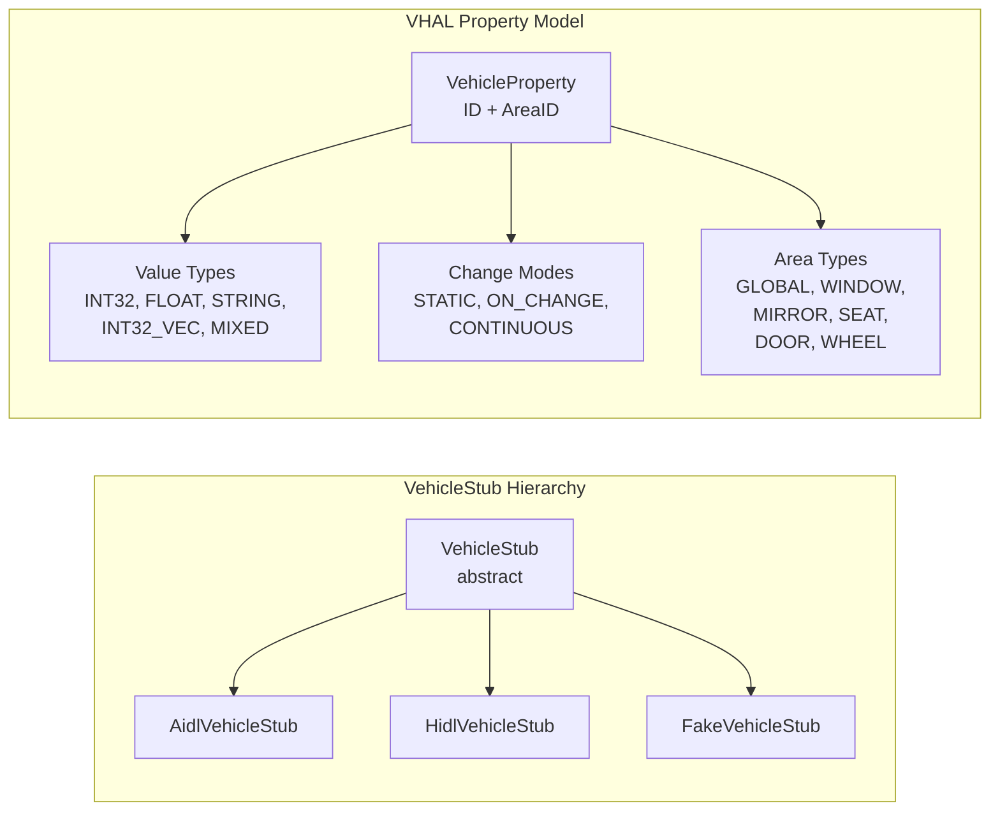

### 62.1.3 Car Property System

The car property system is the primary interface for applications to read and write vehicle data.
`CarPropertyService` exposes properties to apps through `CarPropertyManager`:

```java
// packages/services/Car/service/src/com/android/car/CarPropertyService.java
// (Referenced via ICarImpl constructor)

mCarPropertyService = carServiceCreator.createService(
        CarPropertyService.class,
        () -> new CarPropertyService.Builder()
                .setContext(mContext)
                .setPropertyHalService(mHal.getPropertyHal())
                .build());
```

The property flow from app to hardware:

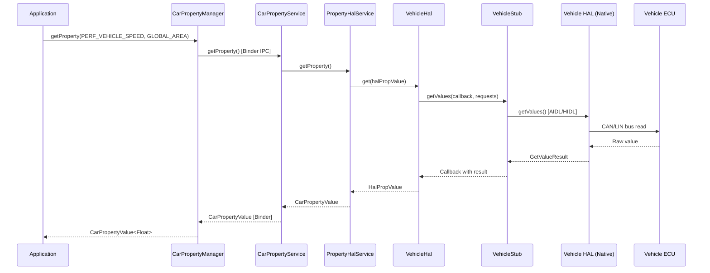

For subscription-based access (event-driven properties like speed or gear), apps register
callbacks that fire when the HAL pushes new values:

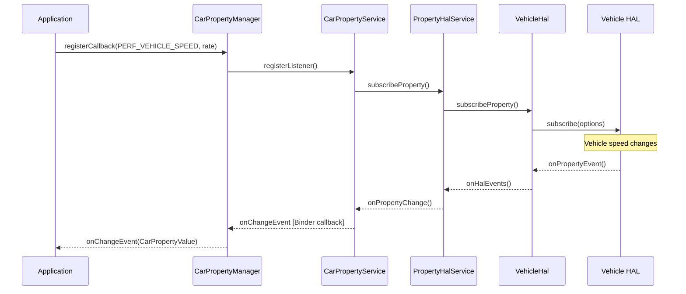

### 62.1.4 Occupant Zones

Multi-zone vehicles have separate displays and user sessions for different seating positions.
`CarOccupantZoneService` manages the mapping between physical seat positions, displays, Android
users, and input devices.

```java
// packages/services/Car/service/src/com/android/car/CarOccupantZoneService.java

public final class CarOccupantZoneService extends ICarOccupantZone.Stub
        implements CarServiceBase {

    public static final class DisplayConfig {
        public final int displayType;
        public final int occupantZoneId;
        public final int[] inputTypes;

        DisplayConfig(int displayType, int occupantZoneId, IntArray inputTypes) {
            this.displayType = displayType;
            this.occupantZoneId = occupantZoneId;
            this.inputTypes = inputTypes == null
                    ? EMPTY_INPUT_SUPPORT_TYPES : inputTypes.toArray();
        }
    }

    @VisibleForTesting
    static class OccupantConfig {
        public int userId = CarOccupantZoneManager.INVALID_USER_ID;
        public final ArrayList<DisplayInfo> displayInfos = new ArrayList<>();
        public int audioZoneId = CarAudioManager.INVALID_AUDIO_ZONE;
    }

    /** key : zoneId */
    @GuardedBy("mLock")
    private final SparseArray<OccupantConfig> mActiveOccupantConfigs = new SparseArray<>();

    @GuardedBy("mLock")
    private int mDriverZoneId = OccupantZoneInfo.INVALID_ZONE_ID;
}
```

The occupant zone model has several key concepts:

- **OccupantZoneInfo**: Represents a physical seating position (driver, front passenger, rear
  left, rear right, etc.), each identified by a unique zone ID.

- **DisplayConfig**: Maps a display type (main, instrument cluster, HUD) to an occupant zone and
  specifies what input types that display supports.

- **OccupantConfig**: The runtime state linking a zone to an Android user ID, a set of displays,
  and an audio zone.

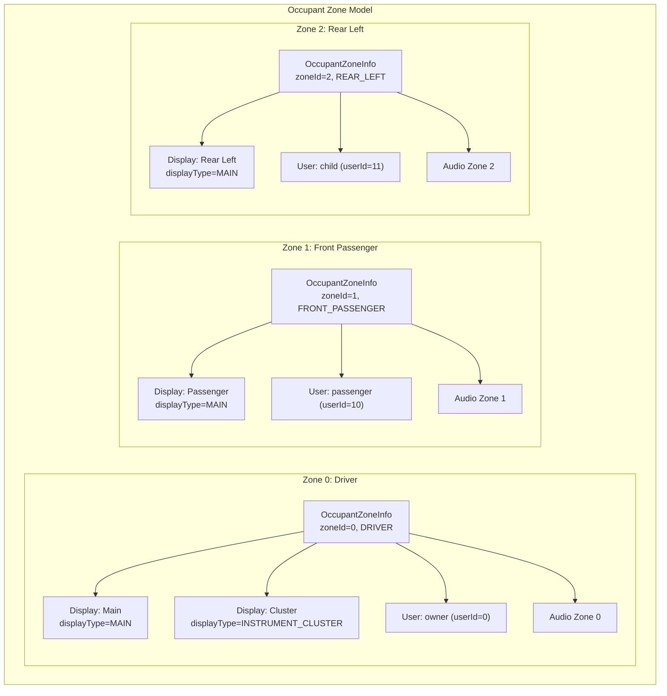

The service listens for display changes and user lifecycle events to dynamically reconfigure
zones:

```java
// packages/services/Car/service/src/com/android/car/CarOccupantZoneService.java

@VisibleForTesting
final UserLifecycleListener mUserLifecycleListener = event -> {
    if (DBG) Slogf.d(TAG, "onEvent(%s)", event);
    boolean isUserSwitching =
            (event.getEventType() == USER_LIFECYCLE_EVENT_TYPE_SWITCHING);
    handleUserChange(isUserSwitching);
};

@VisibleForTesting
final DisplayManager.DisplayListener mDisplayListener =
        new DisplayManager.DisplayListener() {
            @Override
            public void onDisplayAdded(int displayId) {
                handleDisplayChange(displayId);
            }
            @Override
            public void onDisplayRemoved(int displayId) {
                handleDisplayChange(displayId);
            }
            @Override
            public void onDisplayChanged(int displayId) {
                // nothing to do
            }
        };
```

When a display is hotplugged (a rear-seat entertainment screen is connected, for example), the
service re-evaluates the zone-to-display mapping and notifies all registered callbacks.

The `init()` method shows the full initialization sequence:

```java
// packages/services/Car/service/src/com/android/car/CarOccupantZoneService.java

@Override
public void init() {
    Car car = new Car(mContext, /* service= */null, /* handler= */ null);
    CarInfoManager infoManager = new CarInfoManager(car,
            CarLocalServices.getService(CarPropertyService.class));
    int driverSeat = infoManager.getDriverSeat();
    synchronized (mLock) {
        mDriverSeat = driverSeat;
        parseOccupantZoneConfigsLocked();   // Read zone config from RRO
        parseDisplayConfigsLocked();         // Map displays to zones
        handleActiveDisplaysLocked();        // Activate connected displays
        handleAudioZoneChangesLocked();      // Set up audio routing
        handleUserChangesLocked();           // Assign users to zones
    }
    mCarUserService = CarLocalServices.getService(CarUserService.class);
    UserLifecycleEventFilter userEventFilter =
            new UserLifecycleEventFilter.Builder()
                .addEventType(USER_LIFECYCLE_EVENT_TYPE_SWITCHING)
                .addEventType(USER_LIFECYCLE_EVENT_TYPE_STOPPING)
                .build();
    mCarUserService.addUserLifecycleListener(userEventFilter,
            mUserLifecycleListener);
    mDisplayManager.registerDisplayListener(mDisplayListener,
            new Handler(Looper.getMainLooper()));

    CarServiceHelperWrapper.getInstance().runOnConnection(
            () -> doSyncWithCarServiceHelper(
                    /* updateDisplay= */ true, /* updateUser= */ true));
}
```

The occupant zone configuration is read from the RRO config resource
`config_occupant_zones`. If this resource is empty, the service automatically creates a
single driver zone. The configuration specifies seat positions, display types, and input
support for each zone.

The profile user assignment feature (`mEnableProfileUserAssignmentForMultiDisplay`) allows
different Android user profiles to be assigned to different zones. A child profile might
be assigned to the rear-seat display while the primary user controls the driver display.
This requires both the `enableProfileUserAssignmentForMultiDisplay` config boolean and the
`FEATURE_MANAGED_USERS` system feature.

### 62.1.5 Instrument Cluster

The instrument cluster is the display behind the steering wheel. AAOS supports rendering
navigation, phone-call, and media information on this display. The
`InstrumentClusterService` binds to a vendor-provided rendering service:

```java
// packages/services/Car/service/src/com/android/car/cluster/InstrumentClusterService.java

@SystemApi
public class InstrumentClusterService implements CarServiceBase, KeyEventListener,
        ClusterNavigationService.ClusterNavigationServiceCallback {

    private static final long RENDERER_SERVICE_WAIT_TIMEOUT_MS = 5000;
    private static final long RENDERER_WAIT_MAX_RETRY = 2;

    private final Context mContext;
    private final CarInputService mCarInputService;
    private final ClusterNavigationService mClusterNavigationService;
    // ...
    @GuardedBy("mLock")
    private IInstrumentCluster mRendererService;
}
```

The newer `ClusterHomeService` provides a more modern approach where the cluster display runs
a full Android activity (the "Cluster Home" app), and content is rendered via
`ClusterHalService` communicating cluster state through VHAL properties.

The sample cluster application lives at:
`packages/apps/Car/Cluster/ClusterOsDouble/`

This ClusterOsDouble acts as a testing app for the Cluster2 framework, handling Cluster VHAL
properties and performing Cluster OS role functions. It includes:

- `ClusterOsDoubleActivity` -- Main activity displaying cluster information
- `NavStateController` -- Handles navigation state display
- `ClusterViewModel` -- ViewModel for cluster data
- Sensor integration classes for vehicle telemetry visualization

The cluster rendering flow:

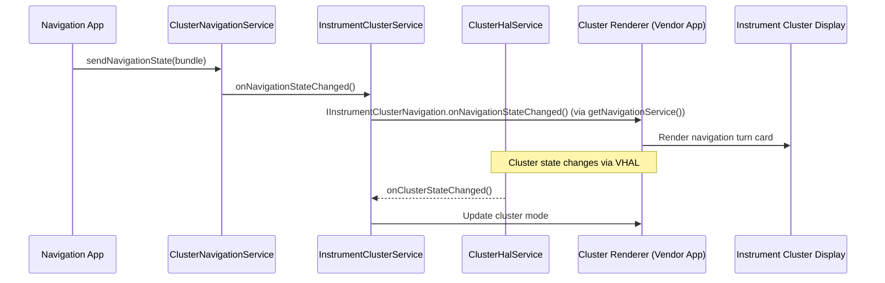

### 62.1.6 FixedActivityService

In automotive, certain displays must always show specific activities. The driver's instrument
cluster must always show the cluster UI; a rear-seat entertainment screen might always show a
media player. `FixedActivityService` guarantees that a designated activity is always in the
foreground on a given display, re-launching it if it crashes or is covered.

The service uses multiple monitoring mechanisms to detect when the fixed activity is no longer
visible and needs to be relaunched:

```java
// packages/services/Car/service/src/com/android/car/am/FixedActivityService.java

/**
 * Monitors top activity for a display and guarantee activity in fixed mode is
 * re-launched if it has crashed or gone to background for whatever reason.
 *
 * This component also monitors the update of the target package and re-launch
 * it once update is complete.
 */
public final class FixedActivityService implements CarServiceBase {

    private static final long RECHECK_INTERVAL_MS = 500;
    private static final int MAX_NUMBER_OF_CONSECUTIVE_CRASH_RETRY = 5;
    private static final long CRASH_FORGET_INTERVAL_MS = 2 * 60 * 1000; // 2 mins

    private static class RunningActivityInfo {
        @NonNull public final Intent intent;
        @NonNull public final Bundle activityOptions;
        @UserIdInt public final int userId;
        public boolean isVisible;
        public boolean isStarted;
        public long lastLaunchTimeMs;
        public int consecutiveRetries;
        public int taskId = INVALID_TASK_ID;
        public int previousTaskId = INVALID_TASK_ID;
        public boolean inBackground;
    }
}
```

The service maintains `RunningActivityInfo` records per display. Every 500ms it rechecks
whether the expected activity is on top. If the activity has crashed more than 5 times
consecutively, it backs off. After 2 minutes without a crash, the consecutive-retry counter
resets.

The monitoring infrastructure is comprehensive. `FixedActivityService` registers four
different event sources to detect when intervention is needed:

```java
// packages/services/Car/service/src/com/android/car/am/FixedActivityService.java

// 1. Process lifecycle monitoring
private final ProcessObserverCallback mProcessObserver = new ProcessObserverCallback() {
    @Override
    public void onForegroundActivitiesChanged(int pid, int uid,
            boolean foregroundActivities) {
        launchIfNecessary();
    }
    @Override
    public void onProcessDied(int pid, int uid) {
        launchIfNecessary();
    }
};

// 2. Package update monitoring
private final BroadcastReceiver mBroadcastReceiver = new BroadcastReceiver() {
    @Override
    public void onReceive(Context context, Intent intent) {
        String action = intent.getAction();
        if (Intent.ACTION_PACKAGE_CHANGED.equals(action)
                || Intent.ACTION_PACKAGE_REPLACED.equals(action)) {
            // Reset crash counter and relaunch
        }
    }
};

// 3. Display state monitoring
private final DisplayListener mDisplayListener = new DisplayListener() {
    @Override
    public void onDisplayChanged(int displayId) {
        launchForDisplay(displayId);
    }
};

// 4. Power state monitoring
private final CarPowerManager.CarPowerStateListener mCarPowerStateListener =
        (state) -> {
    if (state != CarPowerManager.STATE_ON) return;
    // Reset crash counters and relaunch on power on
    launchIfNecessary();
};
```

The `mRunningActivities` `SparseArray` maps display IDs to their `RunningActivityInfo`. The
default capacity is 1, optimized for the common case of a single instrument cluster:

```java
// key: displayId
@GuardedBy("mLock")
private final SparseArray<RunningActivityInfo> mRunningActivities =
        new SparseArray<>(/* capacity= */ 1); // default to one cluster only case
```

When `launchIfNecessary()` fires, it checks each monitored display, compares the current top
activity against the expected activity, and calls `startActivity()` if they differ. The
`activityOptions` Bundle in `RunningActivityInfo` contains the display ID targeting
information.

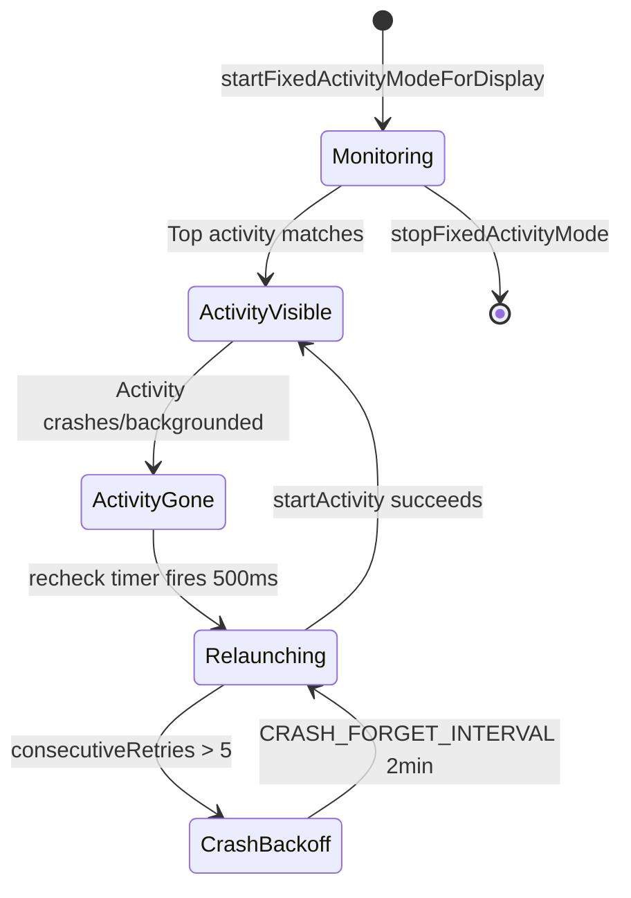

### 62.1.7 CarActivityService

`CarActivityService` manages activity placement across multiple displays, handles launch-on-
display routing, and provides the `CarSystemUIProxy` interface that lets Car SystemUI control
task organization:

```java
// packages/services/Car/service/src/com/android/car/am/CarActivityService.java

public class CarActivityService extends ICarActivityService.Stub
        implements CarServiceBase {
    // Manages per-display task placement, blocking activities for
    // distraction optimization, and SystemUI proxy registration
}
```

This service works closely with `CarPackageManagerService` to enforce which activities are
allowed on which displays based on driving state and UX restrictions.

The `CarActivityService` provides several critical capabilities:

1. **Display-specific activity launching**: When an app targets a specific occupant zone,
   the service routes the activity to the correct display using `ActivityOptions`:

    ```java
    // Usage pattern for launching on a specific display:
    ActivityOptions options = ActivityOptions.makeBasic();
    options.setLaunchDisplayId(targetDisplayId);
    context.startActivity(intent, options.toBundle());
    ```

2. **SystemUI proxy registration**: Car SystemUI registers itself as a proxy through
   `ICarSystemUIProxy`, allowing the service to control task presentation:

    ```java
    // packages/services/Car/service/src/com/android/car/am/CarActivityService.java
    // (field declarations showing the proxy mechanism)
    // Uses ICarSystemUIProxy and ICarSystemUIProxyCallback
    ```

3. **Blocking activity management**: When a non-distraction-optimized activity attempts
   to display while driving, the service intercepts and replaces it with a blocking
   activity that shows a safety message. The display ID is passed via:

    ```java
    // From the import:
    // import static android.car.content.pm.CarPackageManager.BLOCKING_INTENT_EXTRA_DISPLAY_ID;
    ```

4. **Task mirroring and movement**: Tasks can be moved between displays (e.g., moving a
   passenger's navigation session to the driver's display).

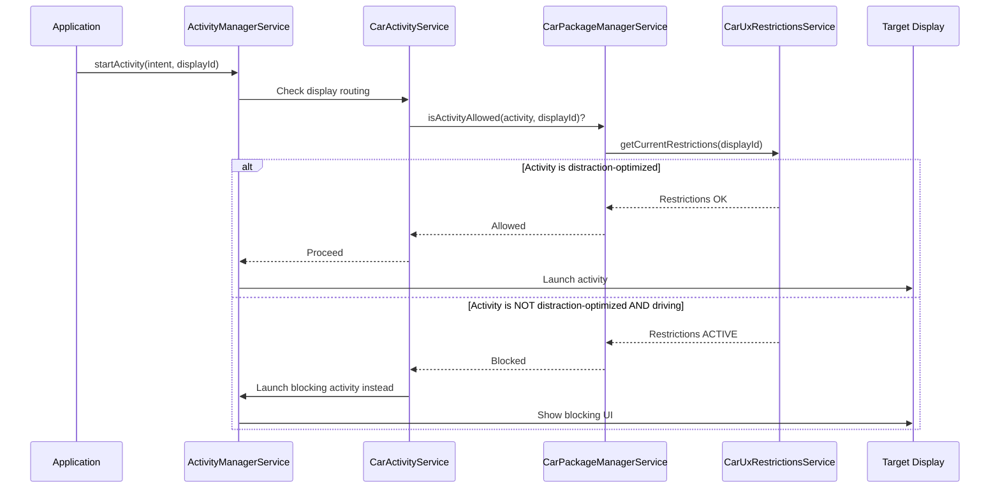

### 62.1.8 Car Power Management

Automotive power management differs fundamentally from mobile. A car's power state is driven
by the vehicle's ignition system, not a user pressing a power button. The
`CarPowerManagementService` manages transitions between power states:

```java
// packages/services/Car/service/src/com/android/car/power/CarPowerManagementService.java

public class CarPowerManagementService extends ICarPower.Stub implements
        CarServiceBase, PowerHalService.PowerEventListener {

    // Power state constants
    private static final int ACTION_ON_FINISH_SHUTDOWN = 0;
    private static final int ACTION_ON_FINISH_DEEP_SLEEP = 1;
    private static final int ACTION_ON_FINISH_HIBERNATION = 2;

    // Suspend retry with exponential backoff
    private static final long INITIAL_SUSPEND_RETRY_INTERVAL_MS = 10;
    private static final long MAX_RETRY_INTERVAL_MS = 100;

    // Garage mode constraints
    private static final int MIN_GARAGE_MODE_DURATION_MS = 15 * 60 * 1000; // 15 min
}
```

The automotive power state machine:

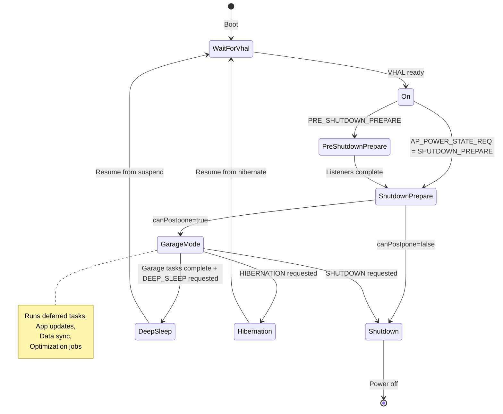

The power policy system controls which hardware components are powered on in each state.
For example, during deep sleep, displays and audio might be off, but the cellular modem
stays on for remote access:

```java
// packages/services/Car/service/src/com/android/car/power/CarPowerManagementService.java

private static final String WIFI_STATE_FILENAME = "wifi_state";
private static final String TETHERING_STATE_FILENAME = "tethering_state";
private static final String COMPONENT_STATE_MODIFIED = "forcibly_disabled";
private static final String COMPONENT_STATE_ORIGINAL = "original";
```

Power policy definitions interact with the native power policy daemon at:
`android.frameworks.automotive.powerpolicy.internal.ICarPowerPolicySystemNotification`

### 62.1.9 Garage Mode

Garage Mode is the period after the driver turns off the ignition but before the vehicle
fully shuts down. During this window, AAOS performs maintenance tasks:

```java
// packages/services/Car/service/src/com/android/car/garagemode/GarageModeService.java

/**
 * Main service container for car Garage Mode.
 * Garage Mode enables idle time in cars.
 */
public class GarageModeService implements CarServiceBase {
    private final GarageModeController mController;
    // ...
}
```

The `GarageModeController` is the brain of garage mode, implementing `ICarPowerStateListener`
to respond to power state transitions:

```java
// packages/services/Car/service/src/com/android/car/garagemode/GarageModeController.java

public class GarageModeController extends ICarPowerStateListener.Stub {
    private final GarageMode mGarageMode;
    private CarPowerManagementService mCarPowerService;

    public void init() {
        mCarPowerService = CarLocalServices.getService(
                CarPowerManagementService.class);
        mCarPowerService.registerInternalListener(GarageModeController.this);
        mGarageMode.init();
    }

    @Override
    public void onStateChanged(int state, long expirationTimeMs) {
        switch (state) {
            case CarPowerManager.STATE_SHUTDOWN_CANCELLED:
                resetGarageMode(null);
                break;
            case CarPowerManager.STATE_SHUTDOWN_ENTER:
            case CarPowerManager.STATE_SUSPEND_ENTER:
            case CarPowerManager.STATE_HIBERNATION_ENTER:
                resetGarageMode(() -> {
                    mCarPowerService.completeHandlingPowerStateChange(state,
                            GarageModeController.this);
                });
                break;
            case CarPowerManager.STATE_SHUTDOWN_PREPARE:
                initiateGarageMode(
                        () -> mCarPowerService.completeHandlingPowerStateChange(
                                state, GarageModeController.this));
                break;
            default:
                break;
        }
    }
}
```

The critical state transition is `STATE_SHUTDOWN_PREPARE`, which triggers
`initiateGarageMode()`. When garage mode completes (either all jobs finish or the timeout
expires), it calls `completeHandlingPowerStateChange()` to signal that the power service
can proceed with the actual shutdown or suspend.

The controller coordinates with `JobScheduler` to run deferred jobs that have
the `REQUIRE_DEVICE_IDLE` constraint. OEMs configure the maximum garage mode duration
through the system property `android.car.garagemodeduration`. The minimum enforced duration
is 15 minutes, ensuring enough time for critical updates.

Garage mode also handles edge cases:

- `STATE_SHUTDOWN_CANCELLED`: If the driver turns the ignition back on during shutdown
  preparation, garage mode is immediately cancelled.

- `STATE_SUSPEND_ENTER` / `STATE_HIBERNATION_ENTER`: Different paths for deep sleep vs.
  hibernate, both requiring garage mode cleanup before proceeding.

- The completion callback pattern ensures the power state machine does not proceed until
  garage mode has properly cleaned up.

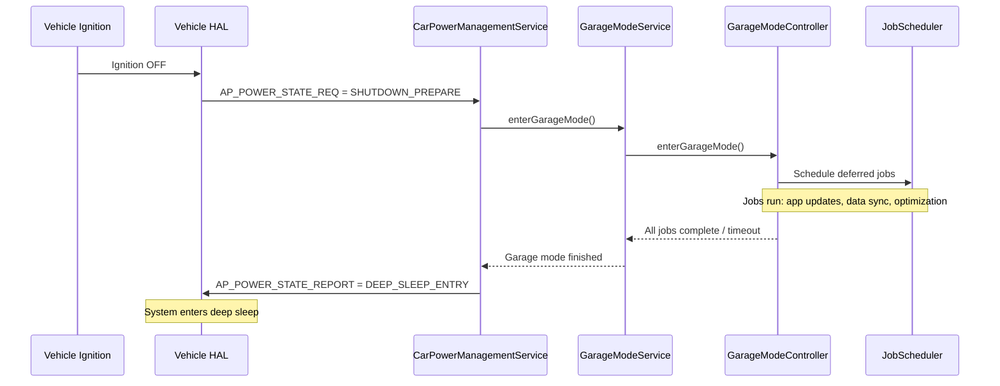

### 62.1.10 Car Audio Multi-Zone Architecture

Automotive audio is fundamentally more complex than phone audio. A car may have separate
speaker zones for driver, passenger, and rear seats, each playing different media. The
`CarAudioService` manages this through audio zone abstraction:

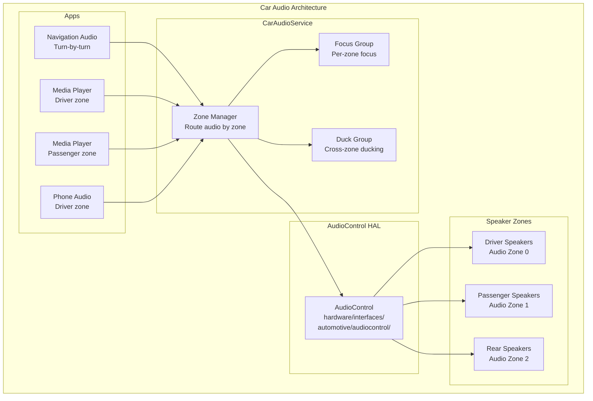

Audio zones are mapped to occupant zones, so each passenger gets independent volume
control and audio focus. Navigation audio in the driver zone can duck the driver's music
without affecting the passenger's audio.

### 62.1.11 Driver Distraction and UX Restrictions

AAOS enforces safety by restricting UI complexity while driving. The
`CarDrivingStateService` monitors vehicle speed and gear to determine whether the car is
parked, idling, or moving. The `CarUxRestrictionsManagerService` translates driving state into
concrete UX restrictions that apps must obey:

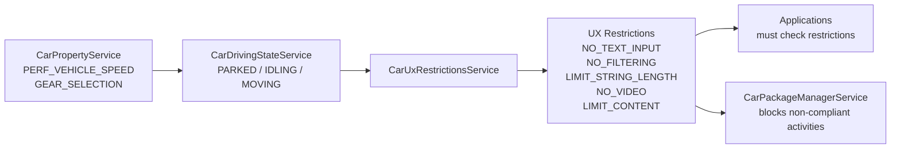

When the driving state is `MOVING`, activities that are not marked as distraction-optimized
are blocked and replaced with a blocking activity that informs the user.

### 62.1.12 Car-Specific SystemUI

AAOS replaces the phone's SystemUI with a car-specific variant located at:
`packages/apps/Car/SystemUI/`

This variant replaces the status bar with a car-specific system bar, adds HVAC controls, volume
controls tailored for multi-zone audio, and a user picker for multi-user vehicles.

```java
// packages/apps/Car/SystemUI/src/com/android/systemui/car/systembar/CarSystemBar.java

@SysUISingleton
public class CarSystemBar implements CoreStartable {
    private final CarSystemBarController mCarSystemBarController;

    @Inject
    public CarSystemBar(CarSystemBarController carSystemBarController) {
        mCarSystemBarController = carSystemBarController;
    }

    @Override
    public void start() {
        mCarSystemBarController.init();
    }
}
```

The Car SystemUI connects to CarService through `CarServiceProvider`:

```java
// packages/apps/Car/SystemUI/src/com/android/systemui/car/CarServiceProvider.java

@Singleton
public class CarServiceProvider {
    @Inject
    public CarServiceProvider(@CarSysUIDumpable Context context) {
        mCar = Car.createCar(mContext, null, Car.CAR_WAIT_TIMEOUT_DO_NOT_WAIT,
                (car, ready) -> {
                    synchronized (mCarLock) {
                        synchronized (mListeners) {
                            mIsCarReady = ready;
                            mCar = car;
                            if (ready) {
                                for (CarServiceOnConnectedListener listener : mListeners) {
                                    listener.onConnected(mCar);
                                }
                            }
                        }
                    }
                });
    }
}
```

Key Car SystemUI components:

| Component | Directory | Purpose |
|-----------|-----------|---------|
| System Bar | `car/systembar/` | Navigation bar replacement with car-specific buttons |
| HVAC Panel | `car/hvac/` | Climate control overlay |
| Volume UI | `car/volume/` | Multi-zone audio volume control |
| User Picker | `car/userpicker/` | Switch between vehicle occupant users |
| Keyguard | `car/keyguard/` | Car-specific lock screen |
| Notifications | `car/notification/` | Automotive notification handling |
| Status Icons | `car/statusicon/` | Vehicle status indicators |

The HVAC module demonstrates how Car SystemUI integrates with vehicle properties:

```
packages/apps/Car/SystemUI/src/com/android/systemui/car/hvac/
  HvacButtonController.java       -- Handles HVAC button interactions
  HvacPanelOverlayViewMediator.java -- Manages HVAC panel visibility
  HvacView.java                    -- Base HVAC view
  HvacPanelView.java               -- Full HVAC panel layout
  TemperatureControlView.java      -- Temperature adjustment widget
  referenceui/
    FanSpeedBar.java               -- Fan speed control
    FanDirectionButtons.java       -- Air direction buttons
```

### 62.1.13 Car Launcher

The automotive launcher is significantly different from the phone launcher. It provides a
home screen designed for large touchscreens with minimal distraction:

```
packages/apps/Car/Launcher/
  libs/
    appgrid/lib/src/com/android/car/carlauncher/
      AppLauncherUtils.java            -- App listing and filtering
      AppItem.java                     -- Data model for launcher items
      LauncherItemDiffCallback.java    -- Efficient list updates
      recyclerview/
        AppGridAdapter.java            -- Grid display adapter
        AppGridLayoutManager.java      -- Car-specific grid layout
  docklib/src/com/android/car/docklib/
    events/DockEventsReceiver.java     -- Dock state handling
    task/DockTaskStackChangeListener.java -- Task stack monitoring
```

The Car Launcher differs from phone Launcher3 in several fundamental ways:

1. **No home screen widgets**: The automotive home screen emphasizes quick app access
   and essential information (maps, media) rather than customizable widget grids.

2. **Dock-based navigation**: The dock at the bottom provides persistent access to
   navigation, phone, media, and app grid.

3. **Task stack awareness**: The `DockTaskStackChangeListener` monitors the task stack
   to keep the dock state synchronized with what is actually running.

4. **Package filtering**: `AppLauncherUtils` filters the app list to show only
   distraction-optimized applications when driving restrictions are active.

5. **Multi-display awareness**: The launcher must account for activities launching on
   different displays (driver vs passenger) and adjust its behavior accordingly.

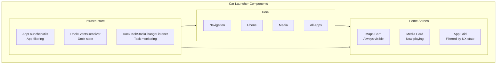

### 62.1.14 External View System (EVS)

The Exterior View System provides camera-based features like rearview, surround view, and
parking assistance. The EVS HAL is defined at:
`hardware/interfaces/automotive/evs/`

It supports both AIDL (current) and HIDL (legacy 1.1) interfaces. The `CarEvsService` in
CarService manages camera lifecycle, display routing, and integrates with the occupant zone
system to determine which display should show the camera feed.

### 62.1.15 Automotive HAL Directory Structure

The full set of automotive HAL interfaces:

```
hardware/interfaces/automotive/
  vehicle/       -- Vehicle property abstraction (AIDL + HIDL 2.0)
  evs/           -- Exterior View System cameras
  audiocontrol/  -- Multi-zone audio routing
  can/           -- CAN bus interface
  ivn_android_device/  -- In-Vehicle Networking
  occupant_awareness/  -- Occupant detection (presence, attention)
  remoteaccess/        -- Remote wake and task execution
```

### 62.1.16 Product Configuration

Automotive product builds are configured through makefiles in:
`packages/services/Car/car_product/build/`

```makefile
# packages/services/Car/car_product/build/car.mk

PRODUCT_PACKAGES += \
    Bluetooth \
    CarActivityResolver \
    CarDeveloperOptions \
    CarSettingsIntelligence \
    CarManagedProvisioning \
    StatementService \
    SystemUpdater

PRODUCT_PROPERTY_OVERRIDES += \
    ro.carrier=unknown \
    ro.hardware.type=automotive
```

The `ro.hardware.type=automotive` property is the fundamental flag that tells the framework
this is an automotive build. Feature flags, SEPolicy, and overlay configurations branch
on this property throughout the system.

Runtime Resource Overlays (RROs) customize the look and feel:

```
packages/services/Car/car_product/rro/
  CarSystemUIRRO/         -- SystemUI visual overrides
  DriveModeSportRRO/      -- Sport driving mode theme
  DriveModeEcoRRO/        -- Eco driving mode theme
  overlay-config/
    androidRRO/           -- Framework resource overrides
    SettingsProviderRRO/  -- Default settings values
    TelecommRRO/          -- Telecom UI adjustments
  oem-design-tokens/
    OEMDesignTokenRRO/    -- OEM visual design tokens
```

---

## 62.2 Android TV

Android TV transforms Android into a 10-foot UI experience. The framework additions focus on
three areas: a TV Input Framework (TIF) for managing broadcast and HDMI sources, HDMI-CEC
control for device coordination, and a specialized windowing system for D-pad navigation
and picture-in-picture.

### 62.2.1 TV Input Framework (TIF) Architecture

The TV Input Framework is the cornerstone of Android TV. It abstracts TV input sources --
built-in tuners, HDMI ports, IP streams, and third-party inputs -- into a uniform model.
The key system service is `TvInputManagerService`:

```java
// frameworks/base/services/core/java/com/android/server/tv/TvInputManagerService.java

public final class TvInputManagerService extends SystemService {
    private static final String TAG = "TvInputManagerService";
    private static final String DVB_DIRECTORY = "/dev/dvb";
    // ...
}
```

The TIF has four layers:

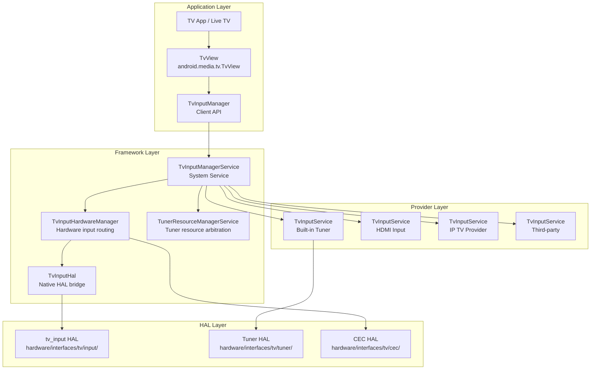

### 62.2.2 TvInputService

`TvInputService` is the abstract base class that all TV input providers must extend. It follows
a pattern similar to `InputMethodService` -- each provider runs as a bound service that creates
sessions on demand:

```java
// frameworks/base/media/java/android/media/tv/TvInputService.java

public abstract class TvInputService extends Service {
    public static final String SERVICE_INTERFACE = "android.media.tv.TvInputService";
    public static final String SERVICE_META_DATA = "android.media.tv.input";

    // Priority hint use case types for tuner resource management
    @IntDef(prefix = "PRIORITY_HINT_USE_CASE_TYPE_",
            value = {PRIORITY_HINT_USE_CASE_TYPE_BACKGROUND,
                     PRIORITY_HINT_USE_CASE_TYPE_SCAN,
                     PRIORITY_HINT_USE_CASE_TYPE_PLAYBACK,
                     PRIORITY_HINT_USE_CASE_TYPE_LIVE,
                     PRIORITY_HINT_USE_CASE_TYPE_RECORD})
    public @interface PriorityHintUseCaseType {}
}
```

Each `TvInputService` creates `Session` objects that handle individual tuning requests.
The session lifecycle:

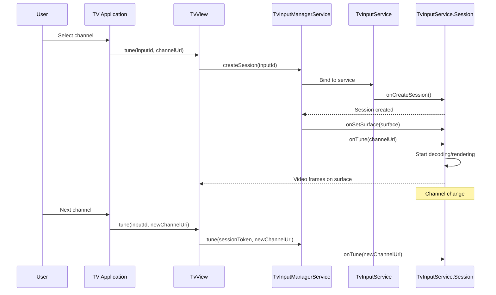

A `TvInputService` declares itself in the manifest with the `BIND_TV_INPUT` permission:

```xml
<service android:name=".MyTvInputService"
    android:permission="android.permission.BIND_TV_INPUT">
    <intent-filter>
        <action android:name="android.media.tv.TvInputService" />
    </intent-filter>
    <meta-data android:name="android.media.tv.input"
        android:resource="@xml/tv_input" />
</service>
```

### 62.2.3 TvInputManagerService Internals

Looking deeper at `TvInputManagerService`, the service manages per-user state and handles
DVB device discovery:

```java
// frameworks/base/services/core/java/com/android/server/tv/TvInputManagerService.java

public final class TvInputManagerService extends SystemService {
    private static final String DVB_DIRECTORY = "/dev/dvb";

    // DVB frontend device patterns:
    // Format 1: /dev/dvb%d.frontend%d
    // Format 2: /dev/dvb/adapter%d/frontend%d
    private static final Pattern sFrontEndDevicePattern =
            Pattern.compile("^dvb([0-9]+)\\.frontend([0-9]+)$");
    private static final Pattern sAdapterDirPattern =
            Pattern.compile("^adapter([0-9]+)$");
    private static final Pattern sFrontEndInAdapterDirPattern =
            Pattern.compile("^frontend([0-9]+)$");

    private final TvInputHardwareManager mTvInputHardwareManager;
    private final UserManager mUserManager;

    @GuardedBy("mLock")
    private int mCurrentUserId = UserHandle.USER_SYSTEM;
    @GuardedBy("mLock")
    private String mOnScreenInputId = null;
    @GuardedBy("mLock")
    private SessionState mOnScreenSessionState = null;

    // Per-user state management
    @GuardedBy("mLock")
    private final SparseArray<UserState> mUserStates = new SparseArray<>();
    @GuardedBy("mLock")
    private final Map<String, SessionState> mSessionIdToSessionStateMap =
            new HashMap<>();

    private HdmiControlManager mHdmiControlManager = null;
    private HdmiTvClient mHdmiTvClient = null;
    private MediaQualityManager mMediaQualityManager = null;
}
```

The service constructor initializes the HDMI-CEC integration:

```java
// frameworks/base/services/core/java/com/android/server/tv/TvInputManagerService.java

public TvInputManagerService(Context context) {
    super(context);
    mTvInputHardwareManager = new TvInputHardwareManager(context,
            new HardwareListener());
    mHdmiControlManager = mContext.getSystemService(HdmiControlManager.class);
    if (mHdmiControlManager != null) {
        mHdmiTvClient = mHdmiControlManager.getTvClient();
    }
    // ...
}

@Override
public void onStart() {
    publishBinderService(Context.TV_INPUT_SERVICE, new BinderService());
    // Register for CEC active source management:
    // Monitors SCREEN_ON/SCREEN_OFF to claim active source status
}
```

When the TV wakes up, the service sends a delayed message to claim CEC active source
status. This message is cancelled if the TV switches inputs or goes back to sleep, preventing
unnecessary CEC traffic.

### 62.2.4 TvInputHardwareManager

`TvInputHardwareManager` bridges the framework with physical TV input hardware. It manages
HDMI port connections, routes audio/video, and tracks hardware-backed TV inputs:

```java
// frameworks/base/services/core/java/com/android/server/tv/TvInputHardwareManager.java

class TvInputHardwareManager implements TvInputHal.Callback {
    private final TvInputHal mHal = new TvInputHal(this);

    @GuardedBy("mLock")
    private final SparseArray<Connection> mConnections = new SparseArray<>();
    @GuardedBy("mLock")
    private final List<TvInputHardwareInfo> mHardwareList = new ArrayList<>();
    @GuardedBy("mLock")
    private final List<HdmiDeviceInfo> mHdmiDeviceList = new ArrayList<>();
    /* A map from a device ID to the matching TV input ID. */
    @GuardedBy("mLock")
    private final SparseArray<String> mHardwareInputIdMap = new SparseArray<>();
    /* A map from a HDMI logical address to the matching TV input ID. */
    @GuardedBy("mLock")
    private final SparseArray<String> mHdmiInputIdMap = new SparseArray<>();
}
```

When an HDMI device is connected or disconnected, the hardware manager receives callbacks
from the HDMI-CEC service and updates the input list accordingly. This enables automatic
input source discovery -- when a user plugs in a Blu-ray player, it appears as a TV input
without manual configuration.

### 62.2.5 Tuner Resource Manager

The `TunerResourceManagerService` arbitrates access to limited hardware tuner resources
(frontends, demuxes, LNBs, CAS sessions) among competing clients:

```java
// frameworks/base/services/core/java/com/android/server/tv/
//   tunerresourcemanager/TunerResourceManagerService.java

public class TunerResourceManagerService extends SystemService
        implements IBinder.DeathRecipient {
    public static final int INVALID_CLIENT_ID = -1;
    private static final int MAX_CLIENT_PRIORITY = 1000;
}
```

The resource manager uses a priority system. Live TV viewing gets higher priority than
background recording. When a higher-priority client needs a tuner that is already in use,
the resource manager can reclaim it from the lower-priority client:

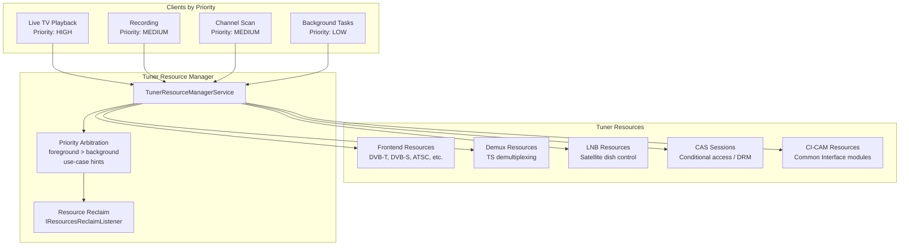

Resource types managed by the service:

```
frameworks/base/services/core/java/com/android/server/tv/tunerresourcemanager/
  FrontendResource.java    -- Tuner frontend (demodulator) resources
  DemuxResource.java       -- Demultiplexer resources
  LnbResource.java         -- Low-noise block (satellite) resources
  CasResource.java         -- Conditional Access System resources
  CiCamResource.java       -- Common Interface CAM resources
  ClientProfile.java       -- Client registration and priority
  UseCasePriorityHints.java -- Use-case to priority mapping
  TunerResourceBasic.java  -- Base resource class
```

### 62.2.6 HDMI-CEC

Consumer Electronics Control (CEC) allows HDMI-connected devices to control each other.
When you turn on a TV, CEC can automatically turn on the connected soundbar and switch
inputs. The CEC HAL is defined at:
`hardware/interfaces/tv/cec/1.0/IHdmiCec.hal`

```
interface IHdmiCec {
    addLogicalAddress(CecLogicalAddress addr) generates (Result result);
    clearLogicalAddress();
    getPhysicalAddress() generates (Result result, uint16_t addr);
    sendMessage(CecMessage message) generates (SendMessageResult result);
    setCallback(IHdmiCecCallback callback);
    getCecVersion() generates (int32_t version);
    getVendorId() generates (uint32_t vendorId);
    getPortInfo() generates (vec<HdmiPortInfo> infos);
    setOption(OptionKey key, bool value);
    setLanguage(string language);
    enableAudioReturnChannel(int32_t portId, bool enable);
    isConnected(int32_t portId) generates (bool status);
};
```

The Java-side CEC implementation lives in the HDMI control service:

```
frameworks/base/services/core/java/com/android/server/hdmi/
  HdmiCecLocalDeviceTv.java      -- TV-type CEC device implementation
  HdmiCecLocalDevice.java        -- Base CEC device
  HdmiCecMessage.java            -- CEC message representation
  HdmiCecMessageBuilder.java     -- Message construction helpers
  HdmiControlService.java        -- Main HDMI control service
  HdmiCecStandbyModeHandler.java -- Standby mode CEC handling
  ActiveSourceHandler.java       -- Active source switching
  DeviceSelectActionFromTv.java  -- Device selection flow
  RoutingControlAction.java      -- Input routing
  ArcInitiationActionFromAvr.java -- Audio Return Channel setup
  NewDeviceAction.java           -- New device discovery
```

The `HdmiCecLocalDeviceTv` represents the TV endpoint in CEC communication:

```java
// frameworks/base/services/core/java/com/android/server/hdmi/HdmiCecLocalDeviceTv.java

public class HdmiCecLocalDeviceTv extends HdmiCecLocalDevice {
    // Whether ARC is available. "true" means ARC is established between
    // TV and AVR as audio receiver.
    @ServiceThreadOnly
    private boolean mArcEstablished = false;

    // Stores whether ARC feature is enabled per port.
    private final SparseBooleanArray mArcFeatureEnabled = new SparseBooleanArray();
}
```

CEC message flow for "one-touch play" (user presses Play on a Blu-ray remote):

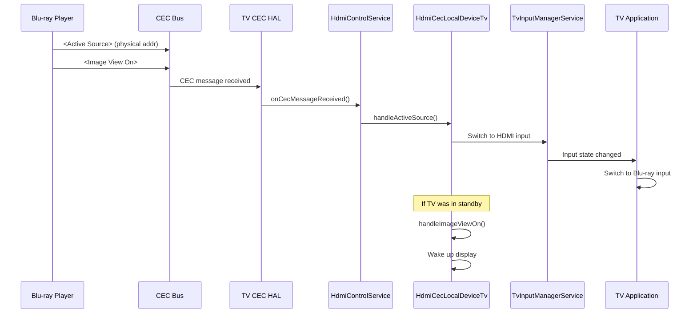

### 62.2.7 TV HAL Interfaces

The complete TV HAL surface:

```
hardware/interfaces/tv/
  input/          -- TV input hardware abstraction
  cec/
    1.0/          -- CEC HAL v1.0 (HIDL)
      IHdmiCec.hal
      IHdmiCecCallback.hal
      types.hal
    1.1/          -- CEC HAL v1.1 (HIDL, adds CEC 2.0)
      IHdmiCec.hal
      IHdmiCecCallback.hal
      types.hal
  hdmi/           -- HDMI connection management
  tuner/          -- Digital TV tuner HAL (AIDL)
    aidl/         -- Frontends, demuxes, filters, DVRs
  mediaquality/   -- Media quality processing HAL
```

The Tuner HAL (AIDL-based) provides a comprehensive digital TV stack:

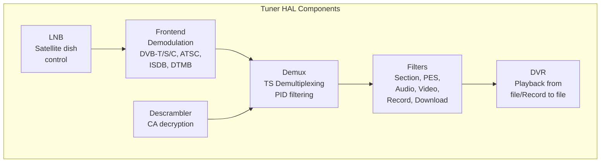

### 62.2.8 TV Picture-in-Picture (PIP)

Android TV has its own PIP implementation tailored for the big-screen experience. Unlike
the phone PIP (which shows a small floating window), TV PIP places the secondary content
in a fixed position appropriate for the lean-back experience:

```java
// frameworks/base/libs/WindowManager/Shell/src/com/android/wm/shell/pip/tv/TvPipController.java

public class TvPipController implements PipTransitionController.PipTransitionCallback,
        TvPipBoundsController.PipBoundsListener, TvPipMenuController.Delegate,
        DisplayController.OnDisplaysChangedListener, ConfigurationChangeListener,
        UserChangeListener {
    private static final String TAG = "TvPipController";
}
```

The TV PIP implementation consists of:

```
frameworks/base/libs/WindowManager/Shell/src/com/android/wm/shell/pip/tv/
  TvPipController.java            -- Main PIP controller for TV
  TvPipBoundsState.java           -- PIP window position/size state
  TvPipBoundsAlgorithm.java       -- Position calculation for TV layout
  TvPipBoundsController.java      -- Coordinates bounds changes
  TvPipMenuController.java        -- PIP overlay menu (play/close/etc.)
  TvPipMenuView.java              -- Menu visual layout
  TvPipNotificationController.java -- Notification when PIP is active
  TvPipTransition.java            -- Animations for PIP enter/exit
  TvPipAction.java                -- PIP action definitions
  TvPipCustomAction.java          -- App-provided custom actions
  TvPipActionsProvider.java       -- Action list management
  TvPipSystemAction.java          -- System-level PIP actions
  TvPipBackgroundView.java        -- Dimmed background behind PIP
  TvPipInterpolators.java         -- Animation curves
  TvPipMenuEduTextDrawer.java     -- Educational tooltip rendering
```

The `TvPipController` maintains a clear state machine for PIP lifecycle:

```java
// frameworks/base/libs/WindowManager/Shell/src/com/android/wm/shell/pip/tv/TvPipController.java

@Retention(RetentionPolicy.SOURCE)
@IntDef(prefix = {"STATE_"}, value = {
        STATE_NO_PIP,
        STATE_PIP,
        STATE_PIP_MENU,
})
public @interface State {}

private static final int STATE_NO_PIP = 0;   // No PIP window
private static final int STATE_PIP = 1;       // PIP at normal position
private static final int STATE_PIP_MENU = 2;  // PIP menu open, window centered

static final String ACTION_SHOW_PIP_MENU =
        "com.android.wm.shell.pip.tv.notification.action.SHOW_PIP_MENU";
static final String ACTION_CLOSE_PIP =
        "com.android.wm.shell.pip.tv.notification.action.CLOSE_PIP";
static final String ACTION_MOVE_PIP =
        "com.android.wm.shell.pip.tv.notification.action.MOVE_PIP";
static final String ACTION_TOGGLE_EXPANDED_PIP =
        "com.android.wm.shell.pip.tv.notification.action.TOGGLE_EXPANDED_PIP";
static final String ACTION_TO_FULLSCREEN =
        "com.android.wm.shell.pip.tv.notification.action.FULLSCREEN";
```

The TV PIP state machine:

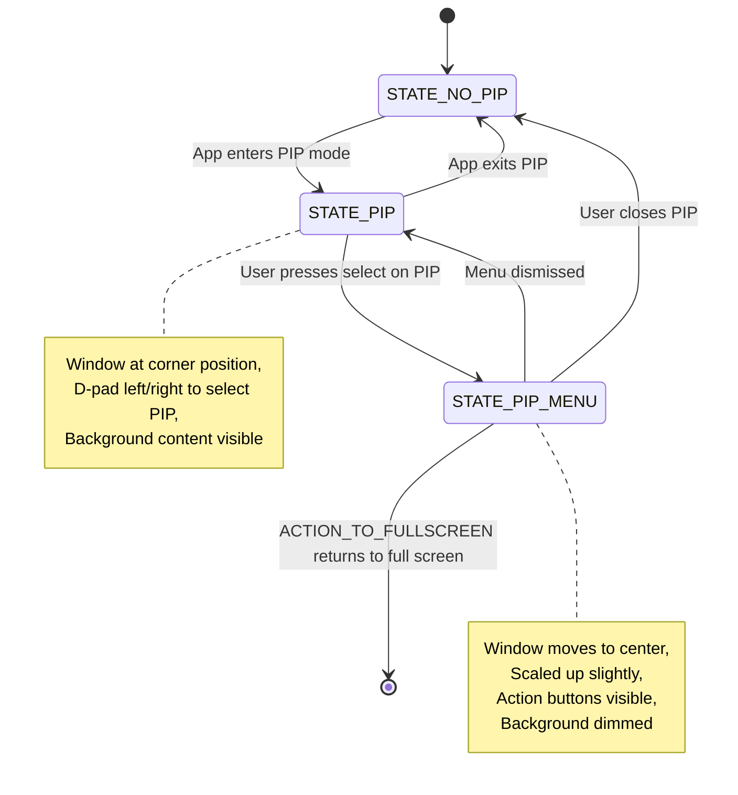

The controller collaborates with an extensive set of components. The constructor takes
over 20 dependencies, demonstrating the complexity of TV PIP management:

```java
// frameworks/base/libs/WindowManager/Shell/src/com/android/wm/shell/pip/tv/TvPipController.java

private TvPipController(
        Context context,
        ShellInit shellInit,
        ShellController shellController,
        TvPipBoundsState tvPipBoundsState,
        PipDisplayLayoutState pipDisplayLayoutState,
        TvPipBoundsAlgorithm tvPipBoundsAlgorithm,
        TvPipBoundsController tvPipBoundsController,
        PipTransitionState pipTransitionState,
        PipAppOpsListener pipAppOpsListener,
        PipTaskOrganizer pipTaskOrganizer,
        PipTransitionController pipTransitionController,
        TvPipMenuController tvPipMenuController,
        PipMediaController pipMediaController,
        TvPipNotificationController pipNotificationController,
        TaskStackListenerImpl taskStackListener,
        PipParamsChangedForwarder pipParamsChangedForwarder,
        DisplayController displayController,
        WindowManagerShellWrapper wmShellWrapper,
        Handler mainHandler,
        ShellExecutor mainExecutor) {
    // ... initialization of all components
}
```

TV PIP key differences from phone PIP:

- Position is typically a fixed corner, not user-draggable
- Menu is accessed via D-pad, not touch gestures
- Background content dims to avoid visual competition
- Actions include media controls (play/pause) prominent in the menu
- Broadcast-based actions (`ACTION_SHOW_PIP_MENU`, `ACTION_CLOSE_PIP`) allow
  the notification system to control PIP remotely

The `TvPipModule` provides Dagger dependency injection:

```java
// frameworks/base/libs/WindowManager/Shell/src/com/android/wm/shell/dagger/pip/TvPipModule.java

@Module(includes = {
        WMShellBaseModule.class,
        Pip1SharedModule.class})
public abstract class TvPipModule {
    @WMSingleton
    @Provides
    static Optional<Pip> providePip(
            Context context,
            ShellInit shellInit,
            ShellController shellController,
            TvPipBoundsState tvPipBoundsState,
            // ... many dependencies
    ) { /* ... */ }
}
```

### 62.2.9 D-pad Navigation

Android TV uses D-pad (directional pad) navigation instead of touch. This fundamentally changes
how focus management works in the framework. The key infrastructure:

1. **Focus search algorithm**: `View.focusSearch()` uses `FocusFinder` to determine which view
   should receive focus when the user presses Up/Down/Left/Right.

2. **Touch mode**: TV devices are always in "non-touch" mode. Views must handle focus state
   drawing (focused rings, highlights) explicitly.

3. **BrowseFragment / Leanback library**: The `androidx.leanback` library provides pre-built
   UI components optimized for D-pad navigation: `BrowseFragment`, `DetailsFragment`,
   `SearchFragment`, `PlaybackFragment`.

4. **Sound feedback**: D-pad presses trigger audible click sounds for spatial feedback.

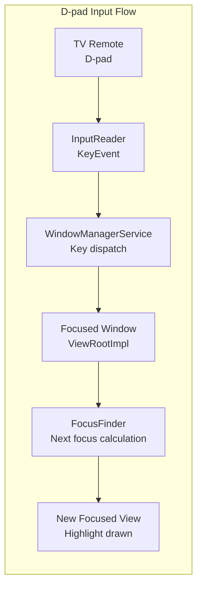

### 62.2.10 TvSettings

Android TV uses a specialized settings application rather than the standard phone Settings app.
The TV Settings app (`packages/apps/TvSettings/` -- typically vendor-specific) provides a
sidebar navigation pattern appropriate for D-pad control, with large text and high-contrast
visual design.

TV-specific settings include:

- **Input management**: HDMI input naming and ordering
- **Display and Sound**: Resolution, HDR, Audio output (HDMI ARC, Bluetooth, etc.)
- **CEC controls**: Enable/disable HDMI-CEC, one-touch play, system audio
- **Screen saver (Daydream)**: Ambient mode displays (photos, clock, etc.)
- **Accessibility**: Large text, high contrast, TalkBack navigation

To let OEM TV apps such as TvSettings and tuner apps reach platform capabilities without
holding full platform-signature access, the TV form factor ships a thin system-API bridge
library, the `java_sdk_library com.android.libraries.tv.tvsystem`
(`frameworks/opt/tv/tvsystem/`), which exposes TV-flavored shims over hidden system APIs
such as `TvUserManager`, `TvAudioManager`, `TvWifiManager`, and `TvPackageInstaller`.

### 62.2.11 TV Interactive App Framework

The TV Interactive App framework extends TIF to support hybrid broadcast/broadband (HBB-TV),
interactive advertisements, and two-screen experiences:

```
frameworks/base/services/core/java/com/android/server/tv/interactive/
  TvInteractiveAppManagerService.java
```

This service manages `TvInteractiveAppService` instances that can overlay interactive content
on top of TV video streams, responding to both broadcast signals and internet data.

### 62.2.12 Media Quality HAL

The Media Quality HAL (`hardware/interfaces/tv/mediaquality/`) enables TV-specific video
processing features:

- Picture mode presets (Standard, Cinema, Vivid, Game)
- Dynamic backlight control
- Content-adaptive processing
- Ambient light backlight adjustment

```java
// frameworks/base/media/java/android/media/quality/AmbientBacklightSettings.java
// -- TV ambient backlight configuration
// frameworks/base/media/java/android/media/quality/AmbientBacklightEvent.java
// -- Ambient backlight event notifications
```

---

## 62.3 Wear OS

Wear OS adapts Android for wrist-worn devices with tiny circular displays, extreme battery
constraints, and a UI paradigm centered on glanceable information. While much of Wear OS's
proprietary implementation lives outside AOSP (in Google Play Services for Wear), the
framework-level adaptations are visible in the base platform.

### 62.3.1 Round Display Support

The most visible Wear adaptation is support for circular displays. The framework provides
several mechanisms:

**Window Insets for Round Screens**

The `WindowInsets` system reports whether the display is round via
`WindowInsets.isRound()`. Apps use this to adjust padding so content is not clipped
by the curved edges:

```mermaid
graph TB
    subgraph "Round Display Handling"
        Display["Round Display<br/>diameter: 390px"]
        Insets["WindowInsets<br/>isRound()=true"]
        WIC["WatchViewStub /<br/>BoxInsetLayout"]
        SafeArea["Safe Content Area<br/>Inscribed square"]
    end

    Display --> Insets
    Insets --> WIC
    WIC --> SafeArea
```

The `BoxInsetLayout` (from the Wear support library) automatically applies insets to child
views, ensuring content stays within the inscribed rectangle of a circular display. Without
this, content at the edges would be clipped or unreadable.

**Configuration Reporting**

The framework reports `Configuration.UI_MODE_TYPE_WATCH` for Wear devices. This allows
apps and the system to branch behavior:

```java
int uiMode = context.getResources().getConfiguration().uiMode;
boolean isWatch = (uiMode & Configuration.UI_MODE_TYPE_MASK)
        == Configuration.UI_MODE_TYPE_WATCH;
```

Resource qualifiers (`-watch`, `-round`, `-notround`) enable dimension, layout, and drawable
overrides per display shape.

### 62.3.2 Ambient Mode and Always-On Display

Wear devices support an ambient mode where the watch face continues to be visible but in a
low-power state. This involves:

1. **Reduced refresh rate**: The display drops to 1 Hz or lower update rate.
2. **Limited color palette**: The screen switches to a grayscale or limited-color mode to
   reduce OLED pixel power consumption.

3. **Simplified rendering**: Watch faces switch from full-color interactive mode to a
   simplified ambient rendering.

The `AmbientModeSupport` class (from the Wear support library) provides the lifecycle
callbacks:

```mermaid
stateDiagram-v2
    [*] --> Interactive: Wrist raise / tap
    Interactive --> Ambient: Timeout / wrist down
    Ambient --> Interactive: Wrist raise / tap
    Ambient --> Off: Extended inactivity
    Off --> Interactive: Button press / wrist raise

    note right of Interactive
        Full color rendering,
        Full frame rate,
        Touch input active,
        Sensor sampling active
    end note

    note right of Ambient
        Simplified rendering,
        1 Hz refresh,
        Grayscale / low color,
        No touch input,
        Reduced sensor sampling
    end note
```

### 62.3.3 Burn-in Protection

OLED displays on watches are susceptible to burn-in if static pixels remain illuminated
continuously. The framework implements burn-in protection through:

1. **Pixel shifting**: In ambient mode, the entire display content shifts by a few pixels
   periodically (every minute or so). This is handled at the WindowManager level.

2. **Outline-only rendering**: Watch faces in ambient mode use outlined digits rather than
   filled shapes, reducing the number of lit pixels.

3. **Low-bit ambient**: Some displays support a true low-bit mode where each pixel is either
   fully on or fully off (no anti-aliasing), further reducing burn-in risk.

The watch face framework exposes burn-in protection information via `WatchFaceService`:

```mermaid
graph LR
    subgraph "Burn-in Protection Strategies"
        PS["Pixel Shift<br/>Content moves<br/>periodically"]
        OL["Outline Rendering<br/>No solid fills<br/>in ambient"]
        LB["Low-bit Mode<br/>1-bit per pixel<br/>no anti-aliasing"]
        TC["Time Limiting<br/>Screen off after<br/>extended ambient"]
    end

    subgraph "Implementation Points"
        WM["WindowManager<br/>Applies pixel offset"]
        WFS["WatchFaceService<br/>Ambient drawing mode"]
        DP["Display Policy<br/>Screen timeout"]
    end

    PS --> WM
    OL --> WFS
    LB --> WFS
    TC --> DP
```

### 62.3.4 Watch Face Framework

Watch faces are the most distinctive Wear UI element. The framework defines a
`WatchFaceService` that extends `WallpaperService` to provide always-visible, continuously
updating face rendering:

The watch face lifecycle:

```mermaid
sequenceDiagram
    participant WFS as WatchFaceService
    participant Engine as Engine (WallpaperService.Engine)
    participant Canvas as Canvas / GL Surface
    participant WM as WindowManager
    participant AMS as AmbientModeSupport

    Note over WFS: Service starts
    WFS->>Engine: onCreateEngine()
    Engine->>Canvas: onSurfaceCreated()
    Engine->>Engine: onDraw() [interactive mode]

    Note over AMS: User lowers wrist
    AMS->>Engine: onEnterAmbient(burnInProtection)
    Engine->>Canvas: Draw simplified face
    Engine->>Engine: Reduce update frequency to 1/min

    Note over AMS: User raises wrist
    AMS->>Engine: onExitAmbient()
    Engine->>Canvas: Draw full interactive face
    Engine->>Engine: Resume normal update frequency

    Note over WM: Burn-in protection active
    WM->>WM: Apply pixel shift offset
```

Watch face complications (small data displays showing weather, steps, battery, etc.) are
provided through the Complication API:

```mermaid
graph TB
    subgraph "Watch Face Complications"
        WF["Watch Face<br/>WatchFaceService"]
        CP1["Complication Provider 1<br/>Weather"]
        CP2["Complication Provider 2<br/>Step Count"]
        CP3["Complication Provider 3<br/>Battery"]
        CP4["Complication Provider 4<br/>Next Calendar Event"]
    end

    subgraph "Complication Types"
        SHORT["SHORT_TEXT<br/>72F"]
        LONG["LONG_TEXT<br/>Meeting at 2:00 PM"]
        ICON["ICON<br/>Small icon"]
        RANGE["RANGED_VALUE<br/>Progress arc"]
        IMG["SMALL_IMAGE<br/>Photo or icon"]
    end

    WF --> CP1
    WF --> CP2
    WF --> CP3
    WF --> CP4

    CP1 --> SHORT
    CP2 --> SHORT
    CP3 --> RANGE
    CP4 --> LONG
```

### 62.3.5 Tiles API

Wear OS Tiles provide glanceable information surfaces that users swipe between from the
watch face. Unlike full activities, Tiles are declaratively defined using a layout DSL and
updated by a `TileService`:

```mermaid
graph LR
    subgraph "Tiles Architecture"
        TS["TileService<br/>Provider app"]
        TR["TileRenderer<br/>Layout rendering"]
        TH["Tile Host<br/>System UI"]
    end

    subgraph "Tile Lifecycle"
        REQ["onTileRequest()"]
        RES["onResourcesRequest()"]
        UPD["Update interval<br/>or user swipe"]
    end

    TH --> REQ
    REQ --> TS
    TS --> RES
    RES --> TR
    TR --> TH
    UPD --> REQ
```

Tiles are built using a protobuf-based layout schema:

- **LayoutElement**: Row, Column, Box, Spacer, Image, Text, Arc
- **TimelineEntry**: Tiles can define time-based layouts that automatically switch
- **Clickable**: Elements can trigger actions (launch activity, send message)

### 62.3.6 Reduced Windowing

Wear OS significantly simplifies the windowing system compared to phone:

1. **Single-task model**: Only one activity is visible at a time. There is no split-screen,
   freeform, or PIP support.

2. **No navigation bar**: The system back gesture is handled by the physical button or a
   swipe gesture, not an on-screen button.

3. **Simplified recent apps**: The recent apps list is either absent or a simple vertical
   scroll, not the full phone-style overview.

4. **Reduced display areas**: No status bar in the traditional sense. Notifications appear
   as cards swiped in from the bottom.

```mermaid
graph TB
    subgraph "Phone Windowing"
        PStatusBar[Status Bar]
        PContent[App Content Area]
        PNavBar[Navigation Bar]
        PSplit[Split Screen Support]
        PPip[PIP Support]
        PFreeform[Freeform Windows]
    end

    subgraph "Wear Windowing"
        WFace["Watch Face<br/>always behind"]
        WContent["Single App<br/>full screen"]
        WNotif["Notification Cards<br/>swipe up"]
        WTiles["Tiles<br/>swipe left/right"]
    end

    subgraph "Simplifications"
        NoSplit[No split screen]
        NoPip[No PIP]
        NoFreeform[No freeform]
        NoNavBar[No navigation bar]
    end
```

### 62.3.7 Battery Optimization for Wearables

Wear OS employs aggressive battery optimization beyond standard Android:

1. **Doze on wrist-down**: When the accelerometer detects the wrist is lowered, the device
   enters a doze-like state much faster than a phone would.

2. **Network efficiency**: Wearable devices preferentially route network requests through a
   connected phone (Bluetooth proxy) rather than using their own Wi-Fi or cellular radio,
   saving significant power.

3. **Sensor batching**: Sensors batch readings and deliver them in bursts rather than
   continuously, allowing the processor to sleep between batches.

4. **Reduced background activity**: `JobScheduler` constraints are tighter on Wear. Fewer
   concurrent background services are allowed.

5. **Bedtime mode**: A special mode that disables always-on display, notifications, and
   tilt-to-wake during sleep hours.

```mermaid
graph TB
    subgraph "Wear Battery Optimization Stack"
        subgraph "Hardware Level"
            OLED["OLED Display<br/>Per-pixel power control"]
            ULP["Ultra-Low-Power<br/>Co-processor"]
            BLE["Bluetooth LE<br/>Low-energy comms"]
        end

        subgraph "Framework Level"
            AOD["Always-On Display<br/>1Hz update, grayscale"]
            BIP["Burn-in Protection<br/>Pixel shifting"]
            DOZE["Aggressive Doze<br/>Wrist-down trigger"]
            BATCH["Sensor Batching<br/>Periodic bulk delivery"]
            PROXY["BT Network Proxy<br/>Route through phone"]
        end

        subgraph "App Level"
            COMP["Complications<br/>Push updates, not poll"]
            TILES["Tiles<br/>Declarative, no Activity"]
            AMBI["Ambient Mode<br/>Simplified rendering"]
        end
    end

    OLED --> AOD
    ULP --> DOZE
    BLE --> PROXY
    AOD --> AMBI
    DOZE --> BATCH
```

### 62.3.8 Wear-Specific Resource Qualifiers and Configuration

Wear devices use a comprehensive set of resource qualifiers for adapting layouts:

| Qualifier | Values | Purpose |
|-----------|--------|---------|
| `-watch` | N/A | Applied to watch devices |
| `-round` | N/A | Round display shape |
| `-notround` | N/A | Square or rectangular display |
| `UI_MODE_TYPE_WATCH` | 6 | Configuration UI mode |
| `smallestScreenWidthDp` | ~180-220dp | Typical watch screen sizes |

The framework reports several watch-specific configuration values:

```java
// Configuration checks in framework code:
boolean isWatch = (config.uiMode & Configuration.UI_MODE_TYPE_MASK)
        == Configuration.UI_MODE_TYPE_WATCH;

// Screen shape check:
boolean isRound = config.isScreenRound();

// Typical watch display metrics:
// 390x390 pixels at ~300+ dpi for round
// 320x320 pixels at ~280 dpi for smaller models
```

Layout adaptations for round displays follow a specific pattern:

```mermaid
graph TB
    subgraph "Round Display Layout Strategy"
        subgraph "Full Circle"
            FC["Total display area<br/>pi * r^2"]
        end
        subgraph "Safe Rectangle"
            SR["Inscribed square<br/>side = diameter / sqrt(2)<br/>~70.7% of diameter"]
        end
        subgraph "Content Zones"
            CZ1["Center: primary content<br/>Full readable area"]
            CZ2["Edges: decorative only<br/>Arc progress, bezels"]
        end
    end

    FC --> SR
    SR --> CZ1
    FC --> CZ2
```

Apps targeting Wear must account for the ~30% of screen area near the edges of a round
display being partially clipped. The `BoxInsetLayout` and curved text APIs help manage
this constraint automatically.

### 62.3.9 Wearable Sensing Framework

AOSP includes a framework for wearable-specific sensing capabilities:

```
frameworks/base/services/core/java/com/android/server/wearable/
  WearableSensingManagerService.java      -- System service
  WearableSensingManagerPerUserService.java -- Per-user management
  RemoteWearableSensingService.java       -- Remote service connection
  WearableSensingSecureChannel.java       -- Secure data channel
  WearableSensingShellCommand.java        -- Debug shell commands
```

```java
// frameworks/base/core/java/android/app/wearable/WearableSensingManager.java
// -- Client API for wearable sensing

// frameworks/base/core/java/android/service/wearable/WearableSensingService.java
// -- Service that processes wearable sensor data
```

The wearable sensing framework provides a secure channel for processing sensitive health
and activity data from wearable sensors. It supports:

- Accelerometer and gyroscope data for activity recognition
- Heart rate and SpO2 monitoring
- Fall detection algorithms
- Context-aware ambient computing

```mermaid
graph TB
    subgraph "Wearable Sensing Architecture"
        Sensors["Wearable Sensors<br/>Accel, Gyro, HR, SpO2"]
        WSS["WearableSensingService<br/>On-device processing"]
        SC["Secure Channel<br/>WearableSensingSecureChannel"]
        WSMS["WearableSensingManagerService<br/>System service"]
        WSM["WearableSensingManager<br/>Client API"]
        App[Health/Fitness App]
    end

    Sensors --> WSS
    WSS --> SC
    SC --> WSMS
    WSMS --> WSM
    WSM --> App
```

---

## 62.4 Form Factor Customization Points

The key architectural insight across all three form factors is that AOSP does not use
compile-time `#ifdef` branching. Instead, customization is achieved through runtime
overlays, Dagger module substitution, product configuration, and abstraction layers. This
section catalogs the specific customization points.

### 62.4.1 SystemUI Variants

SystemUI is the most visibly customized component. AOSP provides three variants:

```
frameworks/base/packages/SystemUI/       -- Phone/tablet SystemUI (default)
packages/apps/Car/SystemUI/              -- Automotive SystemUI
(vendor-specific)/TvSystemUI/            -- TV SystemUI (vendor-provided)
```

The phone SystemUI is the default and most feature-rich. Car SystemUI replaces it entirely
with automotive-specific UI components. TV SystemUI is typically much simpler, focusing on
a minimal notification system and settings access.

The selection is made at build time through product configuration:

```makefile
# For automotive builds:
PRODUCT_PACKAGES += CarSystemUI
# Instead of the default:
# PRODUCT_PACKAGES += SystemUI
```

### 62.4.2 WMShell Module Variants

The Window Manager Shell provides Dagger module variants for different form factors. The
base module is shared, with form-factor-specific modules layered on top:

```
frameworks/base/libs/WindowManager/Shell/src/com/android/wm/shell/dagger/
  WMShellBaseModule.java       -- Shared dependencies (all form factors)
  WMShellModule.java           -- Phone/tablet specific
  TvWMShellModule.java         -- TV specific
  WMShellConcurrencyModule.java -- Thread pool configuration
```

The `TvWMShellModule` substitutes TV-specific implementations:

```java
// frameworks/base/libs/WindowManager/Shell/src/com/android/wm/shell/dagger/
//   TvWMShellModule.java

@Module(includes = {TvPipModule.class})
public class TvWMShellModule {

    @WMSingleton
    @Provides
    @DynamicOverride
    static StartingWindowTypeAlgorithm provideStartingWindowTypeAlgorithm() {
        return new TvStartingWindowTypeAlgorithm();
    }

    @WMSingleton
    @Provides
    @DynamicOverride
    static SplitScreenController provideSplitScreenController(/* ... */) {
        return new TvSplitScreenController(/* ... */);
    }
}
```

Key substitutions made by `TvWMShellModule`:

| Component | Phone | TV |
|-----------|-------|----|
| StartingWindowTypeAlgorithm | Default | TvStartingWindowTypeAlgorithm |
| SplitScreenController | SplitScreenController | TvSplitScreenController |
| PIP | Pip1Module / Pip2Module | TvPipModule |
| PIP Controller | PipController | TvPipController |
| PIP Bounds | PipBoundsAlgorithm | TvPipBoundsAlgorithm |

```mermaid
graph TB
    subgraph "WMShell Module Architecture"
        BASE["WMShellBaseModule<br/>Shared infrastructure"]

        subgraph "Form Factor Modules"
            PHONE["WMShellModule<br/>Phone/Tablet"]
            TV["TvWMShellModule<br/>TV"]
            AUTO["Car uses separate<br/>SystemUI entirely"]
        end

        subgraph "PIP Modules"
            PIP1["Pip1Module<br/>Phone PIP v1"]
            PIP2["Pip2Module<br/>Phone PIP v2"]
            TVPIP["TvPipModule<br/>TV PIP"]
        end
    end

    BASE --> PHONE
    BASE --> TV
    PHONE --> PIP1
    PHONE --> PIP2
    TV --> TVPIP
```

### 62.4.3 Device Overlays (Runtime Resource Overlays)

Runtime Resource Overlays (RROs) are the primary mechanism for visual and behavioral
customization without source code changes. Each form factor uses RROs extensively:

**Automotive RROs:**
```
packages/services/Car/car_product/rro/
  CarSystemUIRRO/             -- SystemUI visual overrides
  DriveModeSportRRO/          -- Sport mode visuals
  DriveModeEcoRRO/            -- Eco mode visuals
  overlay-config/
    androidRRO/               -- Framework defaults
    SettingsProviderRRO/      -- Settings provider defaults
    CertInstallerRRO/         -- Certificate installer
    TelecommRRO/              -- Telecom UI
  oem-design-tokens/
    OEMDesignTokenRRO/        -- OEM design system tokens
    OEMDesignTokenFrameworkResRRO/  -- Framework token overlays
    OEMDesignTokenCarUiPluginRRO/   -- Car UI plugin tokens
```

**Distant Display RROs** (for secondary screens):
```
packages/services/Car/car_product/distant_display/rro/
  distant_display_rro.mk
  MediashellRRO/
  CarServiceRRO/
  DriverUiRRO/
```

RROs work by overlaying resource values at runtime without modifying the target APK. An
overlay package declares which target package and resources it overrides:

```xml
<!-- Example: CarSystemUIRRO/AndroidManifest.xml -->
<manifest>
    <overlay android:targetPackage="com.android.systemui"
             android:isStatic="true"
             android:priority="10" />
</manifest>
```

The overlay can then replace any resource -- colors, dimensions, layouts, strings, booleans --
in the target package. This is how OEMs customize the look and feel of the car UI without
forking SystemUI source code.

### 62.4.4 Product Configuration

Product configuration is where form-factor selection begins. The build system reads makefile
variables to determine which packages, overlays, and properties to include.

**Automotive product configuration:**

```makefile
# packages/services/Car/car_product/build/car_base.mk
# packages/services/Car/car_product/build/car.mk

# Key automotive properties:
PRODUCT_PROPERTY_OVERRIDES += \
    ro.hardware.type=automotive

# Key automotive packages:
PRODUCT_PACKAGES += \
    CarService \
    CarSystemUI \
    CarLauncher \
    CarSettings
```

The `car_product/build/` directory hierarchy:

| File | Purpose |
|------|---------|
| `car.mk` | Common packages for all car builds |
| `car_base.mk` | Base product definition |
| `car_product.mk` | Full product packages |
| `car_system.mk` | System partition packages |
| `car_system_ext.mk` | System extension packages |
| `car_vendor.mk` | Vendor partition packages |
| `car_generic_system.mk` | Generic system image |

**TV product configuration** typically includes:

```makefile
# (vendor-specific or device-specific makefile)
PRODUCT_PROPERTY_OVERRIDES += \
    ro.hardware.type=tv

PRODUCT_PACKAGES += \
    TvSettings \
    TvSystemUI \
    TvProvider \
    TvLauncher
```

**Wear product configuration** typically includes:

```makefile
# (vendor-specific)
PRODUCT_PROPERTY_OVERRIDES += \
    config.override_forced_orient=true \
    config.override_forced_orient_value=0

# Watch-specific features
PRODUCT_PACKAGES += \
    WearSettings \
    ClockworkHome \
    WearSystemUI
```

### 62.4.5 Feature Flags and Configuration

Beyond properties and overlays, form-factor behavior is controlled through:

1. **PackageManager feature flags**: Each form factor declares features in `system/etc/
   permissions/`:

```xml
<!-- Automotive -->
<feature name="android.hardware.type.automotive" />

<!-- TV -->
<feature name="android.software.leanback" />
<feature name="android.hardware.type.television" />

<!-- Wear -->
<feature name="android.hardware.type.watch" />
```

2. **Config resources**: `frameworks/base/core/res/res/values/config.xml` contains hundreds
   of configurable values. Form-factor overlays change these:

```xml
<!-- Example: config_supportsPictureInPicture -->
<!-- Phone: true, Watch: false -->
<!-- config_hasAutomotiveDock: true for automotive -->
```

3. **SELinux policies**: Each form factor has specific SELinux policies:

```
packages/services/Car/car_product/sepolicy/  -- Automotive SEPolicy
```

### 62.4.6 How OEMs Customize Per Form Factor

The OEM customization stack for any form factor follows a layered pattern:

```mermaid
graph TB
    subgraph "Customization Stack (Bottom to Top)"
        AOSP["AOSP Base<br/>frameworks/base, packages/"]
        FF["Form Factor Layer<br/>packages/services/Car/<br/>TV/Wear framework additions"]
        PROD["Product Configuration<br/>device/vendor/product.mk<br/>Package selection, properties"]
        RRO["Runtime Resource Overlays<br/>Visual customization<br/>Default value overrides"]
        OEM_APK["OEM Replacement APKs<br/>Custom Launcher, SystemUI<br/>Custom Settings"]
        VENDOR["Vendor Partition<br/>HAL implementations<br/>Proprietary services"]
    end

    AOSP --> FF
    FF --> PROD
    PROD --> RRO
    RRO --> OEM_APK
    OEM_APK --> VENDOR
```

Specific OEM customization patterns by form factor:

**Automotive OEM Customization:**

- Custom `IVehicle` HAL implementation mapping to their specific ECU protocol
- Custom instrument cluster renderer bound by `InstrumentClusterService`
- Custom HVAC control panel via RRO on Car SystemUI
- Custom car launcher with brand-specific widgets
- OEM design tokens for brand-consistent visual identity
- Custom audio routing through AudioControl HAL

**TV OEM Customization:**

- Custom `TvInputService` implementations for proprietary tuner hardware
- Custom TV launcher with brand-specific content recommendations
- Custom CEC behavior for their specific device ecosystem
- Picture quality processing via Media Quality HAL
- Custom remote control integration

**Wear OEM Customization:**

- Custom watch face packs
- Custom sensor implementations for health features
- Custom tiles for device-specific features
- Battery optimization tuning for specific hardware
- Custom complications providers for device sensors

### 62.4.7 Multi-Display Architecture Across Form Factors

Multi-display support varies dramatically across form factors:

```mermaid
graph TB
    subgraph "Phone"
        PD1[Primary Display]
        PD2[Optional: Cast / External]
    end

    subgraph "Automotive"
        AD1[Driver Main Display]
        AD2[Instrument Cluster]
        AD3[Passenger Display]
        AD4[Rear Seat Left]
        AD5[Rear Seat Right]
        AD6[HUD Display]
    end

    subgraph "TV"
        TD1["Main TV Output<br/>HDMI"]
        TD2["Optional PIP<br/>Same display, separate task"]
    end

    subgraph "Wear"
        WD1["Single Round Display<br/>Always-on capable"]
    end
```

Automotive has the most complex multi-display needs, which is why the occupant zone system
exists exclusively in the Car framework. TV handles multi-content through PIP on a single
display. Wear has the simplest model with a single, small display.

### 62.4.8 Service Registration Differences

Each form factor registers different system services during `SystemServer` startup:

```mermaid
graph TB
    subgraph "Common Services (All Form Factors)"
        AMS[ActivityManagerService]
        WMS[WindowManagerService]
        PMS[PackageManagerService]
        IPMS[InputMethodManagerService]
        NMS[NotificationManagerService]
    end

    subgraph "Automotive Additional Services"
        CS["CarService<br/>~40 internal services"]
        OAS[OccupantAwarenessService]
        VHAL_S[Vehicle HAL Service]
    end

    subgraph "TV Additional Services"
        TIMS2[TvInputManagerService]
        TRMS2[TunerResourceManagerService]
        HDMI[HdmiControlService]
    end

    subgraph "TV Optional Library Services<br/>(com.android.libraries.tv.tvsystem)"
        TVWS["TvWatchdogService<br/>(not started by SystemServer)"]
    end

    subgraph "Wear Additional Services"
        WSMS2[WearableSensingManagerService]
        ACM[AmbientContextManagerService]
    end
```

The services are conditionally started based on device features:

```java
// Automotive: started when ro.hardware.type == automotive
// CarService is started as a persistent service

// TV: started when this is a TV device (isTv = leanback feature) OR
// the FEATURE_LIVE_TV feature is present -- NOT gated on FEATURE_LEANBACK alone
// (frameworks/base/services/java/com/android/server/SystemServer.java)
if (isTv || pm.hasSystemFeature(PackageManager.FEATURE_LIVE_TV)) {
    mSystemServiceManager.startService(TvInputManagerService.class);
}

// HDMI-CEC: started on TV devices
if (pm.hasSystemFeature(PackageManager.FEATURE_HDMI_CEC)) {
    // HdmiControlService starts
}

// TunerResourceManagerService: gated on FEATURE_TUNER
if (pm.hasSystemFeature(PackageManager.FEATURE_TUNER)) {
    // TunerResourceManagerService starts
}
```

### 62.4.9 Input Model Differences

Each form factor has a fundamentally different input model:

```mermaid
graph TB
    subgraph "Phone Input"
        Touch[Multi-touch Screen]
        Gesture["System Gestures<br/>Back, Home, Recents"]
        VoiceP[Voice Assistant]
    end

    subgraph "Automotive Input"
        TouchA["Touchscreen<br/>Driver + Passenger"]
        Rotary["Rotary Controller<br/>Knob input"]
        Steering[Steering Wheel Buttons]
        VoiceA["Voice Assistant<br/>Primary while driving"]
    end

    subgraph "TV Input"
        DPad["D-pad Remote<br/>Up/Down/Left/Right/Select"]
        VoiceT[Voice Remote]
        GamePad[Game Controller]
        Mouse["Air Mouse / Pointer<br/>Optional"]
    end

    subgraph "Wear Input"
        TouchW["Touch Screen<br/>Limited due to size"]
        Crown["Rotary Side Button<br/>Scroll/Navigation"]
        Buttons["Physical Buttons<br/>Back, Home"]
        WristG[Wrist Gestures]
    end
```

For automotive, the `RotaryController` app (`packages/apps/Car/RotaryController/`) handles
rotary knob input, translating it into focus navigation similar to D-pad on TV. The
`CarInputService` in CarService manages input routing across occupant zones:

```java
// Referenced in ICarImpl field declarations:
private final CarInputService mCarInputService;
```

---

## 62.5 Android 17: Automotive Windowing, Visibility Barriers, and the Road to SDV

Android 17 invests heavily in the automotive form factor. Most of the new code in
`packages/services/Car/` for this release is not about new vehicle properties or new HALs --
it is about *windowing*. AAOS head units increasingly run several apps side by side on a single
large display (a map next to a media player next to a climate panel), drive multiple physical
displays for multiple occupants, and present each display through an OEM-authored, fully
configurable layout. The phone WindowManager Shell was never designed for any of this, so 17
ships a dedicated automotive shell library and a declarative panel framework on top of it. This
section walks the three pieces that landed for 17 -- the `Car-WindowManager-Shell` library, the
auto visibility barrier, and the Scalable UI panel framework -- and then points to where the
larger Software Defined Vehicle (SDV) story is told.

### 62.5.1 The Car WindowManager Shell Library

Phone and tablet windowing is built from `frameworks/base/libs/WindowManager/Shell/`
(`WMShellModule`, `WMShellBaseModule`), as Section 62.4.2 described. Automotive needs a different
model: every container is a *multi-window root task* (there is no single fullscreen task that owns
the display), containers must be layered and bounded explicitly by the system UI, and a container
must be hideable without painting an opaque activity on top of it. Android 17 factors this into a
standalone library, `Car-WindowManager-Shell`, declared in
`packages/services/Car/libs/car-wm-shell-lib/Android.bp`. Its public surface is small and lives
under `packages/services/Car/libs/car-wm-shell-lib/src/com/android/wm/shell/automotive/`.

The central abstraction is the `AutoTaskStack` -- a task stack that is *always* in multi-window
mode -- and its concrete form, the `RootTaskStack`:

```kotlin
// packages/services/Car/libs/car-wm-shell-lib/src/com/android/wm/shell/automotive/
//   AutoTaskStack.kt

/**
 * Represents an auto task stack, which is always in multi-window mode.
 */
interface AutoTaskStack {
    val id: Int
    val displayId: Int
    var leash: SurfaceControl
    val name: String
}

data class AutoTaskStackState(
    val bounds: Rect = Rect(),
    val isAboveBarrier: Boolean,
    val layer: Int
)

data class RootTaskStack(
    override val id: Int,
    override val displayId: Int,
    override var leash: SurfaceControl,
    override val name: String,
    var rootTaskInfo: ActivityManager.RunningTaskInfo
) : AutoTaskStack
```

Two fields in `AutoTaskStackState` are the heart of the new model. `layer` gives the system UI
explicit Z-order control over containers (the phone shell mostly relies on activity order).
`isAboveBarrier` ties the container to the visibility barrier described in Section 62.5.2: a
stack below the barrier is hidden by WindowManager without any occluding surface. The `bounds`
field lets the system UI place and resize each container deterministically, which is what makes
fixed multi-pane car layouts possible.

Clients drive the shell through the `AutoTaskStackController` interface:

```kotlin
// packages/services/Car/libs/car-wm-shell-lib/src/com/android/wm/shell/automotive/
//   AutoTaskStackController.kt

interface AutoTaskStackController {
    var autoTransitionHandlerDelegate: AutoTaskStackTransitionHandlerDelegate?

    val taskStackStateMap: Map<Int, AutoTaskStackState>

    fun createRootTaskStack(
        displayId: Int,
        name: String,
        listener: RootTaskStackListener
    ): RootTaskStack?

    fun destroyTaskStack(taskStackId: Int)

    fun setDefaultRootTaskStackOnDisplay(displayId: Int, rootTaskStackId: Int?)

    @ShellMainThread
    fun startTransition(transaction: AutoTaskStackTransaction): IBinder?
}
```

The controller follows a transaction-and-transition discipline rather than imperative window
moves. A caller composes an `AutoTaskStackTransaction` (reparent a task into a stack, change a
stack's `AutoTaskStackState`, send a `PendingIntent` into a stack) and calls `startTransition`;
WindowManager then drives the change through a normal Shell transition, calling back into the
caller's `AutoTaskStackTransitionHandlerDelegate` (`handleRequest`, `startAnimation`,
`onTransitionConsumed`, `mergeAnimation`) so the animation stays in sync with the underlying
window operations. `setDefaultRootTaskStackOnDisplay` registers a stack as the launch root for a
display, so newly started activities are routed into a managed container instead of going
fullscreen.

Container lifecycle is reported through `RootTaskStackListener`, which adapts
`ShellTaskOrganizer.TaskListener` so that callbacks split cleanly between the root container and
its child tasks:

```kotlin
// packages/services/Car/libs/car-wm-shell-lib/src/com/android/wm/shell/automotive/
//   RootTaskStackListener.kt

interface RootTaskStackListener : ShellTaskOrganizer.TaskListener {
    fun onRootTaskStackAppeared(rootTaskStack: RootTaskStack) {}
    fun onRootTaskStackInfoChanged(rootTaskStack: RootTaskStack) {}
    fun onRootTaskStackDestroyed(rootTaskStack: RootTaskStack) {}
}
```

On the CarService side, `CarActivityService` grew its own lightweight `RootTaskListener`
interface plus `registerRootTaskListener`/`unregisterRootTaskListener` so that automotive system
services can observe root-task appear/vanish events without depending on the shell library
directly:

```java
// packages/services/Car/service/src/com/android/car/am/CarActivityService.java

/** Listener for root task callbacks. */
public interface RootTaskListener {
    void onRootTaskVanished(String name);
    void onRootTaskAppeared(String name);
}
```

The library and shell architecture:

```mermaid
graph TB
    subgraph "System UI Process"
        DELEG["AutoTaskStackTransitionHandlerDelegate<br/>(implemented by Car SystemUI)"]
        CTRL["AutoTaskStackController<br/>car-wm-shell-lib"]
        REPO["AutoTaskRepository<br/>tracks stacks + barrier tokens"]
        BAR["AutoVisibilityBarrierController"]
    end

    subgraph "WindowManager / Shell Core"
        STO["ShellTaskOrganizer"]
        TR["Transitions"]
        WM["WindowManagerService"]
    end

    subgraph "Containers on a Display"
        RTS1["RootTaskStack A<br/>isAboveBarrier=true, layer=2"]
        RTS2["RootTaskStack B<br/>isAboveBarrier=true, layer=1"]
        BARRIER["Visibility Barrier Task<br/>(empty, Shell-organized)"]
        RTS3["RootTaskStack C<br/>isAboveBarrier=false (hidden)"]
    end

    DELEG --> CTRL
    CTRL --> STO
    CTRL --> TR
    BAR --> STO
    BAR --> REPO
    CTRL --> REPO
    STO --> WM
    TR --> WM
    CTRL --> RTS1
    CTRL --> RTS2
    BAR --> BARRIER
    CTRL --> RTS3
```

### 62.5.2 The Auto Visibility Barrier

A recurring automotive problem is hiding a container reliably. On phones a task is hidden because
something opaque covers it; in a multi-pane car layout there may be nothing opaque to cover a pane
you want to dismiss, and leaving it visible underneath is both a UX and a driver-distraction
problem. Android 17 solves this with the *visibility barrier*, implemented by
`AutoVisibilityBarrierController` under
`packages/services/Car/libs/car-wm-shell-lib/src/com/android/wm/shell/automotive/visibilitybarrier/`.

The mechanism is deliberately simple. The controller creates one empty, Shell-organized task per
display -- the barrier -- and relies on a WindowManager rule that siblings ordered *below* the
barrier are made invisible. Any container can therefore be hidden by ordering it under the
barrier (its `AutoTaskStackState.isAboveBarrier` becomes `false`) with no occluding activity
required. The class documentation states the contract directly:

```kotlin
// packages/services/Car/libs/car-wm-shell-lib/src/com/android/wm/shell/automotive/
//   visibilitybarrier/AutoVisibilityBarrierController.kt

/**
 * Controller to manage the visibility barrier for each display.
 *
 * The visibility barrier is an empty Shell-organized task. Siblings below the visibility barrier
 * are made invisible by the WindowManager. This provides a reliable mechanism to hide tasks
 * without needing to occlude them with a fullscreen visible activity.
 *
 * Note: A home activity can co-exist with the visibility barrier and either will not affect the
 * other.
 */
@WMSingleton
class AutoVisibilityBarrierController @Inject constructor(/* ... */) :
    DisplayController.OnDisplaysChangedListener, AutoShellInitializable {

    override fun initialize() {
        if (!Flags.enableAutoVisibilityBarrier()) {
            return
        }
        // ...register for display add/remove and create a barrier per display
    }
}
```

The controller listens for displays through `DisplayController.OnDisplaysChangedListener` and
maintains one barrier per display, recording each barrier's token in `AutoTaskRepository` and
dropping it on `onTaskVanished`. Like nearly every new windowing behavior in 17, it is gated by
an aconfig flag so OEMs and the platform can stage the rollout:

```
# packages/services/Car/libs/car-wm-shell-lib/aconfig/flags.aconfig
package: "com.android.wm.shell.automotive"
container: "system_ext"

flag {
    name: "enable_mumd_car_wm_shell"
    namespace: "car_framework"
    description: "Enables proxy and host implementation in MUMD car-wm-shell for automotive"
}

flag {
    name: "enable_auto_visibility_barrier"
    namespace: "car_framework"
    description: "Enables the dedicated auto visibility barrier controller on all displays"
}
```

The `enable_mumd_car_wm_shell` flag is the second half of the story: in a Multi-User
Multi-Display (MUMD) vehicle, the shell runs a proxy-and-host split so that the per-occupant
system UI processes can each drive their own display's containers through the same
`AutoTaskStackController` API.

### 62.5.3 Scalable UI: Declarative Car Panels

The shell library gives Car SystemUI primitives, but OEMs do not want to write transition code.
Android 17 layers a declarative *Scalable UI* framework over the shell so a head-unit layout is
described as a set of configurable **panels** with states, variants, and animations, rather than
imperative window calls. The framework spans two locations: the reusable model and panel library
at `packages/apps/Car/systemlibs/car-scalable-ui-lib/` (package `com.android.car.scalableui`,
providing `Event`, `PanelTransaction`, `Panel`, and the variant/keyframe model), and the
SystemUI wiring at `packages/apps/Car/SystemUI/src/com/android/systemui/car/wm/scalableui/`.

The bridge class is `PanelAutoTaskStackTransitionHandlerDelegate` -- it implements the shell's
`AutoTaskStackTransitionHandlerDelegate` and translates WindowManager transitions into panel
events. Its companion pieces, documented in
`packages/apps/Car/SystemUI/src/com/android/systemui/car/wm/scalableui/README.md`, are:

| Component | Role |
|-----------|------|
| `PanelAutoTaskStackTransitionHandlerDelegate` | Bridge between Shell transitions and Scalable UI |
| `PanelTransitionCoordinator` | Orchestrates panel animations and state changes |
| `EventDispatcher` | Maps system events to `PanelTransaction`s |
| `PanelConfigReader` / `ActionConfigReader` | Read declarative panel and action configuration |
| `TaskPanel` / `DecorPanel` / `SysUIPanel` | The panel container types |

The README draws the distinction that makes the framework efficient: *window state* (visibility,
size, position, Z-order) is heavyweight and goes through WindowManager via an
`AutoTaskStackTransaction`, while *surface* properties (alpha, scale, translation, crop) are
animated cheaply on SurfaceFlinger through `AutoSurfaceTransaction`. A pure surface change (for
example, fading a panel) never round-trips through WindowManager.

```mermaid
sequenceDiagram
    participant Src as App launch / button event
    participant WM as WindowManager / Shell
    participant Delegate as PanelAutoTaskStackTransitionHandlerDelegate
    participant Dispatch as EventDispatcher
    participant Coord as PanelTransitionCoordinator
    participant Surf as SurfaceFlinger

    Src->>WM: Window change initiates transition
    WM->>Delegate: handleRequest(transition, request)
    Delegate->>Dispatch: Event from TransitionRequestInfo
    Dispatch-->>Delegate: PanelTransaction
    Delegate->>Coord: Build AutoTaskStackTransaction
    Coord-->>Delegate: Transaction
    Delegate-->>WM: Return transaction
    WM->>Delegate: startAnimation(...)
    Delegate->>Coord: Reconcile state + animate
    Coord->>Surf: AutoSurfaceTransaction (alpha/scale/crop)
```

Scalable UI is where the secondary-display work also lands. The distant-display and driver/
distant-display ("dewd") system UIs wire the framework in explicitly -- for example
`packages/services/Car/car_product/distant_display/apps/CarDistantDisplaySystemUI/` constructs its
initializer with `setScalableUIWMInitializer(...)` and `setScalableUIEventDispatcher(...)`, and the
`packages/services/Car/car_product/dewd/` product carries its own Scalable UI sample RROs. As with
the shell pieces, Scalable UI is staged behind flags so a given product can opt in per display
(and MUMD products deliberately disable it on the per-occupant path while it matures).

### 62.5.4 Cross-Reference: Software Defined Vehicle

The windowing work above is the part of the 17 automotive story that lives inside CarService and
Car SystemUI. The larger architectural shift in this release is the **Software Defined Vehicle
(SDV)** platform -- a separate, vehicle-spanning stack (under trees such as
`system/software_defined_vehicle/`, `hardware/sdv/`, and `device/google/sdv*`) that decouples
vehicle functions from fixed ECUs, runs services across virtualized domains, and adds a gateway
and middleware layer between Android and the rest of the car. SDV is a subsystem in its own right,
not a CarService feature, so it is covered in its own sections of this chapter: Section 62.7
walks the SDV platform architecture (the headless Core VM, the service-bundle model, and the
control-plane agents that supervise it), and Section 62.8 walks the SDV middleware and vehicle
communication fabric (VSIDL, the three middleware agents, SOME/IP, and the gateway).

For this chapter the takeaway is the boundary: CarService, the Vehicle HAL, occupant zones, and
the new `Car-WindowManager-Shell`/Scalable UI windowing stack remain the Android-side automotive
platform; the SDV sections (§62.7 and §62.8) pick up where the vehicle abstraction leaves off.

---

## 62.6 Android XR

Automotive, TV, and Wear are the form factors AOSP ships and supports as full vertical stacks
today. Android 17 adds the first platform-level groundwork for a fourth one: **Android XR**, the
head-worn headset and glasses form factor built on the Khronos **OpenXR** standard. It is worth
understanding this groundwork precisely, because it is easy to overstate. The blunt version, which
the rest of this section backs up file by file: **Android XR is not merged into AOSP.** Android 17
upstreams only the *API-usage surface XR apps compile against* -- the feature strings, manifest
properties, tracking permissions and AppOps, the vendored OpenXR headers, and a few telemetry atom
definitions -- **not a working XR stack.** There is no XR runtime, no OpenXR loader, no compositor,
no scene/spatial SDK, no XR HAL, and no XR device or emulator target in the AOSP 17 tree. Those
pieces live off-tree: a vendor runtime on the device implements the OpenXR ABI, and the
separately-distributed Jetpack XR SDK gives apps the high-level scene API. The sections below walk
what AOSP 17 actually contains -- and keep insisting on the distinction, because the upstream
footprint is small enough to be mistaken for the whole thing.

### 62.6.1 What "Android XR" Is in AOSP 17 -- and What It Isn't

Almost the entire in-tree XR surface is hidden behind a single aconfig flag. The flag is declared
in `frameworks/base/core/java/android/content/pm/xr.aconfig`:

```
flag {
    namespace: "xr"
    name: "xr_manifest_entries"
    description: "Adds manifest entries used by Android XR"
    bug: "364416355"
    is_exported: true
}
```

The flag is `is_exported`, so the `@FlaggedApi("android.xr.xr_manifest_entries")` annotation can be
applied to public API in `frameworks/base`. Its default value is **disabled**: there is no release
override for `xr_manifest_entries` anywhere under `build/release`, so on a stock AOSP 17 build the
flag stays off and the XR API surface, permissions, and manifest properties it gates are inert. A
device that actually ships XR turns the flag on through its release configuration.

What is *not* in the tree is everything that would make a headset boot:

- **No XR HAL.** There is no `hardware/interfaces/xr/` and no XR HAL AIDL/HIDL package.
- **No XR runtime or OpenXR loader.** The compositor and the loader that resolves the OpenXR ABI to
  a runtime live on the device, supplied by the vendor (see Section 62.6.2).
- **No XR system service.** There is no XR equivalent of `CarService` or `TvInputManagerService`
  under `frameworks/base/services`; nothing implements an `android.xr.*` runtime service.
- **No XR device, lunch target, or emulator.** AOSP 17 has no XR reference device and no XR
  emulator image. (Do not mistake `emu64xr` for one -- that is a RISC-V binary-translation
  emulator target, unrelated to XR; likewise `IDvr` is TV tuner, `VrrConfig` is variable refresh
  rate, `RtcpXr` is VoIP statistics, and `uxr` is an automotive UX-restrictions abbreviation. None
  of these are Android XR.)

The headset context for this groundwork surfaces only in telemetry: the statsd atom file
`frameworks/proto_logging/stats/atoms/xr/recorder/xr_recorder_extension_atoms.proto` logs XR
recorder state changes and, in its logging-source comment, references the "Moohan" headset that
the first Android XR devices are built around. The atom is a logging definition, not a runtime --
it is another instance of the platform reserving vocabulary ahead of the device.

The intended division of labor mirrors how the other form factors handle hardware-specific stacks:
the platform defines the *contract* (the OpenXR ABI via vendored headers, the feature strings apps
declare, the tracking permissions the framework enforces), a *vendor* runtime implements the
OpenXR ABI on the device, and the off-tree Jetpack XR SDK gives apps a high-level scene API on top.
Only the contract lives in AOSP 17. Put plainly: Android 17 upstreams the API-usage surface XR apps
compile against, not a working XR stack.

How small that footprint really is shows up in the 16-to-17 changeset. Across that window AOSP
gains exactly **one** new XR project: `external/openxr-sdk` (the OpenXR SDK pinned to
`release-1.1.50`, covered in Section 62.6.2). The platform commits that mention "spatial,"
"head-tracking," or "passthrough" in the same window are almost all about spatial *audio* -- the
the audio `Spatializer` (`frameworks/av/services/audiopolicy`) and `frameworks/av/media/libheadtracking` (Section 62.6.8) -- not about
XR. In other words, the XR *platform-code* footprint added in 17 is deliberately minimal: a vendored
header package and a flag-gated contract, with the runtime left entirely to the vendor.

### 62.6.2 The OpenXR SDK in the Tree

The one piece of XR *code* vendored into AOSP 17 is the Khronos OpenXR SDK at
`external/openxr-sdk/`. Its `METADATA` pins the version to `release-1.1.50`, and
`external/openxr-sdk/include/openxr/openxr.h` defines the matching API version:

```c
#define XR_MAKE_VERSION(major, minor, patch) \
    ((((major) & 0xffffULL) << 48) | (((minor) & 0xffffULL) << 32) | ((patch) & 0xffffffffULL))

#define XR_CURRENT_API_VERSION XR_MAKE_VERSION(1, 1, 50)
```

What matters for AOSP is what the build exposes. `external/openxr-sdk/Android.bp` declares exactly
one module:

```
cc_library_headers {
    name: "openxr_headers",
    export_include_dirs: ["include"],
}
```

That is the entire built surface -- the OpenXR *headers*, nothing more. The SDK's loader source
under `external/openxr-sdk/src/loader/` is present in the checkout but is **not** built by
`Android.bp`: there is no `cc_library` for it. And grepping the whole AOSP 17 tree for modules that
depend on `openxr_headers` returns zero in-tree consumers -- no platform module compiles against
the OpenXR ABI.

Headers-only is the deliberate shape. The OpenXR ABI is a contract between an application (or a
higher-level SDK) and a *runtime*: on a real headset the runtime and the loader that finds it are
supplied by the vendor, the same way a GPU vendor supplies the Vulkan ICD rather than AOSP shipping
one. Vendoring just the headers makes the standard XR ABI available to native code that opts in,
without committing AOSP to a particular runtime implementation.

### 62.6.3 The Flag-Gated XR API Surface

On top of the headers, Android 17 adds a public Java API surface that lets an app *declare* what XR
capabilities it needs and *describe* how it wants to be presented. All of it is gated by
`@FlaggedApi("android.xr.xr_manifest_entries")` and is therefore inert on a stock build, but it is
present in `frameworks/base/core/api/current.txt`, so it is part of the public SDK contract.

The feature strings live in `frameworks/base/core/java/android/content/pm/PackageManager.java`. An
app names them in `<uses-feature>` to require an XR-capable device:

- `FEATURE_XR_API_OPENXR` (`"android.software.xr.api.openxr"`) -- the device exposes an OpenXR
  runtime. Its declared *version* is encoded as `major << 16 | minor` (major in bits 31-16, minor
  in bits 15-0), so OpenXR 1.1 is `0x00010001`. The same encoding is used by the feature XML in
  Section 62.6.5.
- `FEATURE_XR_API_SPATIAL` (`"android.software.xr.api.spatial"`) -- the device supports the spatial
  (system-composited) presentation model.
- `FEATURE_XR_INPUT_CONTROLLER` (`"android.hardware.xr.input.controller"`),
  `FEATURE_XR_INPUT_HAND_TRACKING` (`"android.hardware.xr.input.hand_tracking"`), and
  `FEATURE_XR_INPUT_EYE_TRACKING` (`"android.hardware.xr.input.eye_tracking"`) -- the available XR
  input modalities.
- `FEATURE_XR_PERIPHERAL` (`"android.hardware.type.xr_peripheral"`) -- this one is gated by a
  *separate* flag, `@FlaggedApi(com.android.microxr.Flags.FLAG_XR_GLASSES_FEATURE)`
  (`"com.android.microxr.xr_glasses_feature"`), reflecting the lighter glasses peripheral form
  factor rather than a full headset.

How an XR activity is presented is described with window properties in
`frameworks/base/core/java/android/view/XrWindowProperties.java`. The central one is
`PROPERTY_XR_ACTIVITY_START_MODE` (`"android.window.PROPERTY_XR_ACTIVITY_START_MODE"`), whose value
selects one of (each a full `XR_ACTIVITY_START_MODE_*` constant, abbreviated here by suffix):

- `FULL_SPACE_UNMANAGED` -- the activity renders its own scene graph and "controls its own scene
  graph," the mode documented for activities that use OpenXR directly to draw their world.
- `FULL_SPACE_MANAGED` -- the system renders the activity from a scene graph it composites.
- `HOME_SPACE` -- the activity sits in the shared home-space environment alongside other windows.
- `UNDEFINED` -- the reset/default value.

Two more properties tune presentation: `PROPERTY_XR_BOUNDARY_TYPE_RECOMMENDED` (the recommended
play-area boundary type) and `PROPERTY_XR_USES_CUSTOM_FULL_SPACE_MANAGED_ANIMATION` (the app draws
its own enter/exit animation in managed full-space mode). Separately,
`DisplayManager.DISPLAY_CATEGORY_XR_PROJECTED`
(`"android.hardware.display.category.XR_PROJECTED"`,
`frameworks/base/core/java/android/hardware/display/DisplayManager.java`) lets a caller enumerate
projected XR displays.

This is purely declarative API. There is no `android.xr.*` runtime service or scene SDK in AOSP 17
to *act* on these declarations -- the runtime that reads the start mode and composites the scene is
the off-tree vendor stack, and the high-level scene API apps write against is the off-tree Jetpack
XR SDK.

The following diagram shows the flag-gated XR contract: what an app declares, the flag that gates
it, the platform's in-tree declarations, and the off-tree pieces (shown dashed) that actually run
the experience.

```mermaid
graph TB
    subgraph App["XR Application (manifest)"]
        UF["&lt;uses-feature&gt;<br/>FEATURE_XR_API_OPENXR / SPATIAL<br/>FEATURE_XR_INPUT_* / XR_PERIPHERAL"]
        PROP["&lt;property&gt;<br/>PROPERTY_XR_ACTIVITY_START_MODE<br/>(FULL_SPACE_UNMANAGED / MANAGED / HOME_SPACE)"]
        PERM["&lt;uses-permission&gt;<br/>EYE/FACE/HAND/HEAD_TRACKING<br/>SCENE_UNDERSTANDING_*"]
    end

    FLAG["aconfig flag<br/>android.xr.xr_manifest_entries<br/>(disabled by default in AOSP)"]

    subgraph Platform["AOSP 17 in-tree (contract only)"]
        PM["PackageManager FEATURE_XR_* strings<br/>(core/api/current.txt)"]
        XWP["XrWindowProperties<br/>start mode / boundary / animation"]
        MAN["AndroidManifest.xml<br/>XR tracking permissions + groups"]
        HDR["external/openxr-sdk<br/>openxr_headers (headers only)"]
    end

    subgraph Vendor["Off-tree (NOT in AOSP)"]
        RT["Vendor OpenXR runtime + loader<br/>compositor"]
        SDK["Jetpack XR SDK<br/>(scene / spatial APIs)"]
    end

    UF --> FLAG
    PROP --> FLAG
    PERM --> FLAG
    FLAG --> PM
    FLAG --> XWP
    FLAG --> MAN
    HDR -.ABI.-> RT
    SDK -.app-facing.-> UF
    RT -.implements contract.-> Platform
```

### 62.6.4 XR Privacy: Tracking Permissions and AppOps

The most concrete and consequential XR surface in AOSP 17 is the privacy machinery. A headset
continuously senses the wearer's body and surroundings -- where the eyes look, the geometry of the
face, the pose of the hands, the orientation of the head, and a reconstructed mesh of the room.
That is a class of data Android had no permissions for, so 17 introduces a dedicated XR
tracking permission family in `frameworks/base/core/res/AndroidManifest.xml`, every entry carrying
`android:featureFlag="android.xr.xr_manifest_entries"`.

The runtime (dangerous) permissions -- the ones an app must request and the user must grant -- are:

| Permission | What it exposes |
| --- | --- |
| `EYE_TRACKING_COARSE` / `EYE_TRACKING_FINE` | gaze direction at two fidelities |
| `FACE_TRACKING` | facial geometry / expression |
| `HAND_TRACKING` | hand and finger pose |
| `HEAD_TRACKING` | head pose and orientation |
| `SCENE_UNDERSTANDING_COARSE` / `SCENE_UNDERSTANDING_FINE` | reconstructed environment geometry |

Alongside these, Android 17 defines XR-specific permission-groups -- `XR_TRACKING`, plus the more
sensitive `XR_EYE_SENSITIVE` and `XR_TRACKING_SENSITIVE` -- intended for the eye and fine-tracking
data, which are especially identifying, so it can be surfaced separately from coarse tracking. (In
the manifest the individual permissions still sit in the `UNDEFINED` group; the XR grouping is
applied at runtime, not via a static `permissionGroup` attribute.) A
second tier of `signature|privileged` permissions is reserved for the system and OEM components:
`EYE_CALIBRATION`, `FACE_TRACKING_CALIBRATION`, `IMPORT_XR_ANCHOR`, and
`XR_TRACKING_IN_BACKGROUND` (the right to keep tracking the wearer while not in the foreground,
which is exactly why it is privileged).

Each runtime tracking permission is paired with an AppOp in
`frameworks/base/core/java/android/app/AppOpsManager.java`, so the framework can audit and revoke
access at runtime, per app, the same way it does for camera and location:

| AppOp constant | Op string |
| --- | --- |
| `OP_EYE_TRACKING_COARSE` / `OP_EYE_TRACKING_FINE` | `android:eye_tracking_coarse` / `android:eye_tracking_fine` |
| `OP_FACE_TRACKING` | `android:face_tracking` |
| `OP_HAND_TRACKING` | `android:hand_tracking` |
| `OP_HEAD_TRACKING` | `android:head_tracking` |
| `OP_SCENE_UNDERSTANDING_COARSE` / `OP_SCENE_UNDERSTANDING_FINE` | `android:scene_understanding_coarse` / `android:scene_understanding_fine` |

The reason XR needs an entirely new permission *class* rather than reusing camera or sensor
permissions is that the data is qualitatively different. Eye gaze is biometric and reveals
attention and intent; face and hand tracking reconstruct the body; scene understanding builds a
persistent 3D map of the user's home. None of these map cleanly onto "take a photo" or "read the
accelerometer," and they carry distinct consent and retention concerns, so the platform models
each as its own permission with its own AppOp. The permissions and AppOps ship in 17 even though no
in-tree runtime produces the data yet -- the privacy contract is deliberately in place before any
device can sense it.

The following diagram shows the body- and environment-tracking permission-to-AppOp model and where
the (off-tree) runtime sits relative to it.

```mermaid
graph LR
    subgraph Sensing["What a headset senses"]
        EYE["Gaze"]
        FACE["Face geometry"]
        HAND["Hand pose"]
        HEAD["Head pose"]
        SCENE["Room mesh"]
    end

    subgraph Perms["Dangerous permissions (AndroidManifest.xml)"]
        PE["EYE_TRACKING_COARSE/FINE"]
        PF["FACE_TRACKING"]
        PH["HAND_TRACKING"]
        PHd["HEAD_TRACKING"]
        PS["SCENE_UNDERSTANDING_COARSE/FINE"]
    end

    subgraph Ops["AppOps (AppOpsManager.java)"]
        OE["OP_EYE_TRACKING_*"]
        OF["OP_FACE_TRACKING"]
        OH["OP_HAND_TRACKING"]
        OHd["OP_HEAD_TRACKING"]
        OS["OP_SCENE_UNDERSTANDING_*"]
    end

    RT["Off-tree vendor OpenXR runtime<br/>(produces the data; NOT in AOSP)"]

    EYE --> PE --> OE
    FACE --> PF --> OF
    HAND --> PH --> OH
    HEAD --> PHd --> OHd
    SCENE --> PS --> OS
    RT -.guarded by.-> Ops
```

### 62.6.5 Feature Declarations and Device Opt-In

For the `<uses-feature>` strings of Section 62.6.3 to mean anything, a device has to *declare* the
matching system features. The declaration XML for that lives in `frameworks/native/data/etc/`:

| File | Feature declared | Version |
| --- | --- | --- |
| `android.software.xr.api.openxr-1_0.xml` | `android.software.xr.api.openxr` | `65536` (= `0x00010000`, OpenXR 1.0) |
| `android.software.xr.api.openxr-1_1.xml` | `android.software.xr.api.openxr` | `65537` (= `0x00010001`, OpenXR 1.1) |
| `android.software.xr.api.openxr-1_2.xml` | `android.software.xr.api.openxr` | `65538` (= `0x00010002`, OpenXR 1.2) |
| `android.software.xr.api.spatial-1.xml` | `android.software.xr.api.spatial` | `1` |
| `android.hardware.xr.input.controller.xml` | `android.hardware.xr.input.controller` | (none) |
| `android.hardware.xr.input.hand_tracking.xml` | `android.hardware.xr.input.hand_tracking` | (none) |
| `android.hardware.xr.input.eye_tracking.xml` | `android.hardware.xr.input.eye_tracking` | (none) |

The OpenXR version attribute is the same `major << 16 | minor` integer encoding used by
`FEATURE_XR_API_OPENXR` -- a device declares the highest OpenXR version its runtime supports, and
`PackageManager` lets an app require at least that version.

Crucially, AOSP installs **none** of these by default. They are not listed in the permission
makefiles that base and handheld products copy; they sit in `frameworks/native/data/etc/` purely as
opt-in fragments. An XR device pulls the ones it supports into its system image with
`PRODUCT_COPY_FILES` in its own device makefile, the same mechanism every optional hardware feature
uses. Because there is no XR HAL, no XR input backing, and no lunch target in AOSP 17, declaring
these features only becomes meaningful on a vendor build that also supplies the runtime; on a stock
build there is nothing to declare them against.

### 62.6.6 MicroXR: The XR Glasses Split

Everything in Sections 62.6.1 through 62.6.5 is the *headset* story, gated by the `android.xr`
flag `xr_manifest_entries`. Android 17 carves out a second, lighter form factor at the flag level:
**XR glasses**, which ride a separate aconfig package, `com.android.microxr`.

The split starts in the flag itself. The glasses flag is declared in a file of its own,
`frameworks/base/core/java/android/content/pm/glasses.aconfig`:

```
package: "com.android.microxr"
container: "system"

flag {
    namespace: "xr"
    name: "xr_glasses_feature"
    description: "Adds features used by Android XR Glasses"
    bug: "430302860"
    is_exported: true
}
```

Like `xr_manifest_entries`, `xr_glasses_feature` is `is_exported` (so it can gate public API) and is
**disabled by default** -- there is no release override for it under `build/release`, so on a stock
AOSP 17 build the glasses surface is inert. The two flags are independent: full XR headsets ride
`android.xr` / `xr_manifest_entries` (Section 62.6.3), and XR glasses ride
`com.android.microxr` / `xr_glasses_feature`. The build wiring sits in
`frameworks/base/AconfigFlags.bp`, under a `// XR - Glasses` comment, which declares
`com.android.microxr.flags-aconfig` from `core/java/android/content/pm/glasses.aconfig` and a
`com.android.microxr.flags-aconfig-java` library whose `apex_available` lists both the platform and
`com.android.permission` -- so the glasses flag is reachable from the permission module, not just
the framework.

The one public API the glasses flag gates is a *device-class* feature string in
`frameworks/base/core/java/android/content/pm/PackageManager.java` (around lines 4596-4604):

```java
/**
 * Feature for {@link #getSystemAvailableFeatures} and
 * {@link #hasSystemFeature}: An XR peripheral is defined as a full stack Android device with
 * or without a display, with or without inputs, and no user-installable apps. XR peripherals
 * are worn on the user's body and likely require a companion device for user interactions.
 */
@FlaggedApi(com.android.microxr.Flags.FLAG_XR_GLASSES_FEATURE)
@SdkConstant(SdkConstantType.FEATURE)
public static final String FEATURE_XR_PERIPHERAL = "android.hardware.type.xr_peripheral";
```

Two things about `FEATURE_XR_PERIPHERAL` matter. First, it is gated by
`com.android.microxr.Flags.FLAG_XR_GLASSES_FEATURE` (`"com.android.microxr.xr_glasses_feature"`),
not by the headset flag. Second, and easy to miss, it is an `android.hardware.type.*` string -- a
**device-class marker**, a peer of `FEATURE_PC` (`android.hardware.type.pc`), `FEATURE_WATCH`, and
`FEATURE_TELEVISION` -- *not* an `android.software.xr.*` / `android.hardware.xr.*` *capability* like
the headset features in Section 62.6.3. It says "this device is an XR peripheral," the way other
features say "this device is a PC" or "a watch." And unlike the headset capability features, it
ships **no opt-in feature XML** in `frameworks/native/data/etc/`: there is no
`android.hardware.type.xr_peripheral.xml` fragment for a device to copy in, so a glasses device
declares the class through its own configuration rather than by pulling a stock fragment.

#### Where in-tree code actually acts on the glasses class

`FEATURE_XR_PERIPHERAL` is almost entirely a contract -- but not *only* a contract. Unlike the
headset feature strings, which nothing in AOSP reads, a handful of modules already branch on the XR
peripheral class, each treating glasses as a constrained device alongside WATCH, TV, and
AUTOMOTIVE:

- **Wi-Fi.** `WifiGlobals` caches the class at construction:
  `mIsXrPeripheral = mContext.getPackageManager().hasSystemFeature(PackageManager.FEATURE_XR_PERIPHERAL)`
  (`packages/modules/Wifi/service/java/com/android/server/wifi/WifiGlobals.java:104`), then consults
  the flag to tune Wi-Fi behavior for the peripheral.
- **Bluetooth.** `Util.isXrDevice()`
  (`packages/modules/Bluetooth/android/app/src/com/android/bluetooth/Util.kt:266`) is defined right
  next to `isTv()` and `isWatch()` and resolves to `hasSystemFeature(FEATURE_XR_PERIPHERAL)`. Its
  consumer, `media_audio/sink/MediaAudioServer.kt:605`, lumps XR devices with IoT and TV devices
  (`if (context.isIotDevice() || context.isTv() || context.isXrDevice())`) when deciding media-audio
  sink behavior.
- **MediaProvider.** `ProcessingUtils`
  (`packages/providers/MediaProvider/src/com/android/providers/media/localsearch/ProcessingUtils.java:112`)
  disables on-device media processing on XR peripherals, listing `FEATURE_XR_PERIPHERAL` alongside
  `FEATURE_WATCH`, `FEATURE_AUTOMOTIVE`, `FEATURE_TELEVISION`, and `FEATURE_EMBEDDED` as device types
  that "can possibly support UI for search services" only on phones, tablets, and PCs.

That is the whole of it: three modules that special-case glasses as a stripped-down device class.
There is no MicroXR *runtime*, *service*, *app*, *HAL*, or *device target* behind the flag -- the
behavior is "do less" gating, the same shape as the existing WATCH/TV/AUTOMOTIVE checks.

#### MicroXR telemetry: the glasses counterpart to the headset recorder atoms

Where the headset groundwork surfaces only as the "Moohan" recorder atoms (Section 62.6.1), the
glasses groundwork surfaces as a parallel statsd atom family under
`frameworks/proto_logging/stats/atoms/microxr/microxr_extension_atoms.proto` (with shared enums in
`frameworks/proto_logging/stats/enums/microxr/enums.proto`). These atoms read as a portrait of the
glasses hardware Google plans to ship:

- **Wear state.** `MicroXrDonDoffStateChanged` logs a `DonDoffState` of `DONNED` (worn), `DOFFED`
  (not worn), or `DISABLED` -- the don/doff detection a body-worn device needs.
- **Capture.** `MicroXrPhotoCaptured` / `MicroXrVideoCaptured` log captures triggered by a button
  press on the glasses or by a voice command (`PhotoOrVideoTrigger` = `BUTTON` / `VOICE`), including
  latency through a **"Darklight"** HDR capture pipeline and an HDR-vs-non-HDR `CaptureMode`.
- **A separate MCU co-processor.** A cluster of atoms reports the glasses' microcontroller as a
  distinct chip from the application processor: `MicroXrMcuCrashOccurred` (crash dump or watchdog
  failure), `MicroXrMcuPowerDeepSleepInfo`, `MicroXrMcuBootTimeReported`, and
  `MicroXrMcuMemorySnapshotReported`.
- **Power and updates.** `MicroXrApWakeupReported` (the MCU waking the application processor) and
  `MicroXrOtaReported` (over-the-air update outcomes) round out the set.

This is Google/vendor *glasses telemetry* living in `proto_logging` -- statsd definitions, not a
public framework API an app can call -- and, exactly as with the headset side, there is **no**
MicroXR module, service, app, HAL, or device target anywhere in AOSP to produce or consume it. The
atoms reserve the logging vocabulary ahead of the hardware, the same pattern the headset XR
contract follows.

### 62.6.7 The Legacy VR Framework Android XR Succeeds

Android XR is not the platform's first attempt at head-worn computing. The earlier **Daydream-era
VR framework** is, by Android 17, almost entirely gone. The `android.hardware.vr@1.0` `IVr` HAL was
removed -- there is no `hardware/interfaces/vr/` tree (only a stale name in a Watchdog HAL-monitor
list remains). The orchestrating `VrManagerService` is gone from `frameworks/base/services`; only
the internal `VrManagerInternal` interface used by ActivityManager/WindowManager survives.

What remains is a set of inert API remnants kept for source compatibility:

- `android.app.VrManager` (`frameworks/base/core/java/android/app/VrManager.java`) -- still a
  `@SystemApi`, but its calls reach a system service that no longer exists.
- `android.service.vr.VrListenerService` -- the abstract service apps once extended.
- `Vr2dDisplay` (`frameworks/base/services/core/java/com/android/server/vr/Vr2dDisplay.java`) --
  the virtual display that hosted 2D apps inside a VR scene.
- `PackageManager.FEATURE_VR_MODE` (`"android.software.vr.mode"`), now `@Deprecated`, plus the
  still-declared `FEATURE_VR_MODE_HIGH_PERFORMANCE` (`"android.hardware.vr.high_performance"`) and
  `FEATURE_VR_HEADTRACKING` (`"android.hardware.vr.headtracking"`), which no AOSP device populates.
- `Activity.setVrModeEnabled(...)` (`frameworks/base/core/java/android/app/Activity.java`) still
  exists, routing through `ActivityClient.setVrMode` and throwing
  `PackageManager.NameNotFoundException` if the requested `VrListenerService` is not installed or
  enabled; with the VR HAL and service removed, the path no longer activates a VR mode.

The contrast is the point. The old VR framework was an Android-side mode toggle layered on a thin
HAL; Android XR is architecturally distinct -- it is built on the cross-vendor OpenXR ABI, defines
a body- and environment-tracking privacy model, and pushes the runtime and compositor entirely to
the vendor side. The 17 tree reflects a clean break: the Daydream-era code is being retired to
inert remnants while the OpenXR-based contract is laid down fresh.

### 62.6.8 Cross-Reference: Head-Tracked Spatial Audio

One subsystem XR builds on does already ship in AOSP, and it predates XR: the audio
**Spatializer**. Chapter 15 (Audio System, Section 15.2.17) covers the `SpatializerThread`, the
specialized `MixerThread` in AudioFlinger that renders spatial audio and drives HAL latency modes
for low-latency **head-tracked** audio. Head-tracked spatialization is exactly the kind of platform
capability an XR runtime composes with -- a headset wants room-anchored sound that stays fixed as
the wearer turns their head -- but it is *not* XR-exclusive: the Spatializer serves regular phones,
tablets, and TVs with spatial-audio output and head-tracking headphones. It is an example of an
adjacent, already-real subsystem that Android XR will lean on, rather than a piece of the XR
groundwork that 17 newly added.

### 62.6.9 What's Next: Predicting Android XR's Path into AOSP

Everything above is what AOSP 17 *contains*. This section is the opposite: it is an **informed
prediction** of how the rest of the stack might land upstream, read off what 17 already stages and
what is conspicuously missing. It is **forward-looking, not a published roadmap** -- Google has not
committed to any of it in the tree, so treat each item as "this is the shape the gaps suggest,"
hedged with *likely* and *would*, not as a statement of plans.

The reasoning is straightforward: 17 lays down a contract with no implementation, and a contract
with no implementation is the kind of thing that usually precedes the implementation. The most
likely next steps, each tied to something already half-present:

- **The flags flip on.** `xr_manifest_entries` (headsets) and `xr_glasses_feature` (glasses) are
  both `is_exported` and default-off with no release override (Sections 62.6.1, 62.6.6). The cheapest
  possible change once devices ship is a release override that flips them on for XR products,
  activating the API surface that is already merged. This needs no new code at all.
- **A loader/runtime built from the vendored SDK.** `external/openxr-sdk` ships the OpenXR
  *headers* only -- the loader source is present in the checkout but not built by `Android.bp`
  (Section 62.6.2). The obvious next move is a `cc_library` (or similar) that actually compiles the
  OpenXR loader from that already-vendored source, giving AOSP an in-tree way to resolve the OpenXR
  ABI to a runtime instead of leaving both to the vendor.
- **An XR HAL under `hardware/interfaces/`.** There is no `hardware/interfaces/xr/` today
  (Section 62.6.1). A device-tracking/compositor HAL contract is the natural place for the
  platform-vendor boundary to be specified, the way every other form factor has one; if XR is to be
  more than a vendor black box, an `xr` (or `microxr`) HAL package would likely appear here.
- **Real compositor support in WindowManager/SurfaceFlinger.** `XrWindowProperties` already lets an
  app declare `FULL_SPACE_UNMANAGED` / `FULL_SPACE_MANAGED` / `HOME_SPACE` start modes
  (Section 62.6.3), but nothing in-tree composites them. Honoring those modes would mean
  WindowManager and SurfaceFlinger gaining genuine full-space / home-space compositor paths behind
  `XrWindowProperties`, rather than the declarations being inert.
- **A scene/spatial system service.** The `android.xr.*` runtime and scene classes live only in the
  off-tree Jetpack XR SDK today; AOSP has no XR system service (Section 62.6.1). If the scene model
  is to be a platform guarantee rather than an app-bundled library, some of that runtime would
  likely move or be mirrored into a system service under `frameworks/base/services`, the role
  `CarService` and `TvInputManagerService` play for their form factors.
- **Feature XMLs installed by default.** The opt-in fragments in `frameworks/native/data/etc/`
  (Section 62.6.5) are copied by no product today. An XR reference product would add them to its
  `PRODUCT_COPY_FILES`, and the glasses class -- which has *no* fragment at all today (Section 62.6.6)
  -- would likely gain one if it is to be declared the stock way.
- **An XR device / emulator (lunch) target.** There is no XR reference device or emulator image in
  17, which means there is nothing to run XR CTS against (Section 62.6.1). A lunch target -- a
  reference device or an emulator image -- is what would let the contract above be tested in CI, so
  it is a plausible precondition for any of the rest to be exercised upstream.

None of this is promised by the 17 tree. The point of cataloguing it is that the absences are
specific and the staged pieces are specific, so the missing layers can be named precisely: a built
loader, a HAL, compositor paths, a system service, default-installed feature XMLs, and a test
target. If and when Android XR lands in AOSP as a vertical stack the way Automotive, TV, and Wear
have, these are the slots it would fill.

---

## 62.7 Software Defined Vehicle: Architecture

Android 17's marquee device-support addition is the **Software Defined Vehicle (SDV)** platform: an entire new top-level source tree (`system/software_defined_vehicle/`), a flagship reference device (`device/google/sdv`), a new HAL/AIDL contract package (`hardware/sdv/interfaces`), and an automotive display-safety service (`packages/services/display_safety`). SDV is not "Android in the dashboard" the way Android Automotive OS (AAOS) is. It is a *headless* vehicle operating system: a "Core" VM runs the vehicle's safety- and power-relevant services with no UI at all, and one or more AAOS In-Vehicle Infotainment (IVI) VMs — plus non-Android automotive ECUs — talk to it over a service fabric. The Core VM has no display, no launcher, and no apps in the AAOS sense; it hosts *service bundles*, units of vehicle functionality described in a new interface language and generated to Rust, supervised by a lifecycle manager and an orchestrator that bring bundles up and down as the vehicle changes power and driving state.

This section is the architecture overview. It walks the headless Core VM, the service-bundle model and the VSIDL-to-Rust toolchain, the four control-plane agents that supervise bundles (orchestration, lifecycle management, the service-bundles registry, and the health monitor), the update manager, the vehicle power-state manager (vpm), the automotive display-safety runtime, and how an AAOS IVI VM integrates through the SDV Gateway. The wire-level transport — the middleware comm stack, SOME/IP, the VSIDL grammar, and the gateway's network plumbing — is the subject of Section 62.8; this section cross-references it rather than duplicating it.

### 62.7.1 What "Software Defined Vehicle" Means Here

#### The Headless Core VM

The defining architectural decision of SDV is that the vehicle's services run in a VM with no user interface. `device/google/sdv/sdv_core_base/sdv_core_base.mk` states it directly in its header comment: "Software-Defined Vehicle (SDV) is a headless vehicle Android OS." The Core VM is Android — it boots `init`, it runs Binder, it uses APEX modules — but it ships none of SystemUI, no launcher, and no AAOS app stack. Its job is to host vehicle *service bundles* and the agents that supervise them.

The Cuttlefish targets make the headlessness concrete. SDV is designed to run as multiple cooperating VMs on one host: a Core VM and one or more IVI VMs. `device/google/sdv/cuttlefish_multi_tenancy/` carries example multi-VM launch configurations that boot several VM instances, each given a distinct `androidboot.sdv.instance_name` via bootconfig and each running with no GPU (`gpu_mode: "none"`) because there is nothing to draw. The VMs reach each other over a virtual network, and SDV-RPC traffic is pinned to a dedicated VLAN named by the `androidboot.sdv.rpc.interface` bootconfig property (default `sdv_rpc`), configured through the `SDV_RPC_INTERFACE` build variable (`device/google/sdv/sdv_core_base/BoardConfig.mk`; `system/software_defined_vehicle/sdv_gateway/README.md`).

#### The Four Trees

SDV is deliberately spread across four locations in the tree, each with a distinct role:

- `system/software_defined_vehicle/` — the platform itself: 16 subrepos holding the agents, the middleware comm stack, the VSIDL toolchain, and shared libraries. This is where the running code lives.
- `device/google/sdv` — the reference device. It composes the platform code into lunch targets (`sdv_core_base`, `sdv_ivi_base`, and friends) and decides which agents and APEXes land in which VM.
- `hardware/sdv/interfaces` — the stable contract package. Every cross-process boundary that needs version stability (the gateway, the registry, the lifecycle internal interface, vpm, telemetry, the RPC agent) has its `@VintfStability` AIDL frozen here under `aidl_api/`.
- `packages/services/display_safety` — the automotive Driver-UI runtime ("HARry") and its safety monitor, which runs on the IVI side.

This section treats `system/software_defined_vehicle/` and the device/HAL composition; Section 62.8 treats the middleware and SOME/IP subrepos in depth.

#### The Layering

The high-level picture is a vehicle-service fabric beneath and beside AAOS. Bundles run in the Core VM; the comm stack carries their traffic; SOME/IP bridges across VMs and ECUs; and an AAOS IVI VM reaches the fabric through the SDV Gateway.

The SDV platform stack and the seam to AAOS

```mermaid
graph TB
    subgraph CoreVM["SDV Core VM (headless, no UI)"]
        ORCH["Orchestration agent<br/>(orch_config.textproto)"]
        LCM["Lifecycle Manager<br/>+ bundle runner"]
        REG["Service Bundles Registry<br/>(IRegistry)"]
        HM["Health Monitor<br/>(heartbeats)"]
        UM["Update Manager"]
        VPM["Vehicle Power Manager<br/>(sdv_vpm_agent)"]
        BUNDLE["Service bundles<br/>(VSIDL-generated Rust)"]
    end

    subgraph Comm["SDV middleware comm stack (Section 62.8)"]
        SD["Service Discovery<br/>(sd_agent)"]
        DT["Data Tunnel<br/>(pub/sub)"]
        RPC["RPC agent<br/>(IRpcAgent)"]
    end

    subgraph Wire["Cross-VM / cross-ECU (Section 62.8)"]
        SOMEIP["SOME/IP stack<br/>+ broker (vsomeip)"]
        ECU["External ECUs<br/>(non-Android)"]
    end

    subgraph IVI["AAOS IVI VM"]
        GW["SDV Gateway<br/>(ISdvGateway + vhal_proxy)"]
        VHAL["Vehicle HAL<br/>(sdv-emulator-service)"]
        CAR["CarService<br/>(packages/services/Car)"]
        DS["Display Safety / HARry<br/>(packages/services/display_safety)"]
    end

    ORCH --> LCM
    LCM --> BUNDLE
    REG --- ORCH
    VPM --> ORCH
    BUNDLE --> SD
    BUNDLE --> DT
    BUNDLE --> RPC
    HM -.heartbeats.-> BUNDLE
    SD --> SOMEIP
    DT --> SOMEIP
    RPC --> SOMEIP
    SOMEIP <--> ECU
    GW --> RPC
    GW --> DT
    VHAL --> GW
    CAR --> VHAL
    DS --> GW
```

### 62.7.2 The Service Bundle Model

#### What a Service Bundle Is

The unit of deployment in the Core VM is the **service bundle**, not the Android app or the standalone daemon. A service bundle is a shared library — VSIDL-generated Rust compiled to a `.so` — that the lifecycle manager loads into a host process and drives through a fixed lifecycle. Bundles ship inside APEX modules; the APEX carries the bundle's native library plus a manifest entry describing where everything lives.

The metadata contract is the `SdvServiceBundleManifest` proto (`system/software_defined_vehicle/service_bundles_registry/proto/sdv_service_bundles_manifest.proto`). Each entry carries the bundle `name`, a `version_number` and `version_name`, the `native_library_path` (relative to the APEX root), and a set of optional config paths: `orchestration_config_path`, `scheduling_config_path`, `health_config_path`, `diagnostics_config_path`, `user_config_path`, `vsidl_schemas_path`, `external_protocol_mapping_path` (the SOME/IP mapping), and `authorization_policy_path` (which superseded the deprecated `access_control_list_policy_path`). The proto reserves three field-number ranges by audience — low numbers for bundle execution, a middle range for the SDV agents, and a high range for OEM custom metadata — so that a bundle's manifest never collides between layers.

#### VSIDL Generates Rust

Service interfaces are not written in AIDL. They are described in `.vsidl` service-bundle definitions plus `.proto` message schemas, and the `vsidlc` compiler (`system/software_defined_vehicle/vsidl/vsidlc`) walks the catalog and emits Rust middleware bindings into `generated_rs/` directories. The companion `someip_translation_generator` emits the SOME/IP-to-proto translation code, and `vsidl_rc_generator` (the "Runtime Configuration generator") emits the runtime-configuration outputs that bundles consume through the VSIDL provider library (`libsdv_config_provider`). All three are host tools installed by the Core target (`device/google/sdv/sdv_core_base/sdv_packages_core_services.mk` lists `vsidlc`, `vsidl_rc_generator`, and `someip_translation_generator` under `SDV_CORE_SERVICES_HOST_PACKAGES`). On-device, the `sdv_vsidl_provider_agent` (APEX `com.android.sdv.vsidl_provider`) serves bundle VSIDL schemas at runtime. This is the SDV equivalent of AIDL stub generation, and the full grammar and transport mapping belong to Section 62.8.

A concrete `.vsidl` makes the shape clear. The vehicle power manager's bundle definition (`system/software_defined_vehicle/vpm/stable/vsidl/vpm.vsidl`) declares a `service_bundle` named `VpmSystemServiceBundle` with three interface slots: a `server` exporting the RPC service `com.android.sdv.vpm.VpmSystemService`, a `client` of `com.android.sdv.vpm.client.PowerNotificationService`, and a Data Tunnel `publisher` of `com.android.sdv.vpm.vehicle.VehicleStateChange`. A bundle therefore declares, in one place, what it serves over RPC, what it consumes, and what it publishes on the pub/sub fabric.

#### Fully Qualified Instance Names

Bundles can run in multiple instances, so SDV identifies a running unit by a **Fully Qualified Instance Name (FQIN)**. In the orchestrator's common crate (`system/software_defined_vehicle/orchestration/common/src/fqin.rs`) an FQIN is three fields — `package_name`, `service_bundle_name`, and `instance_name` — formatted as `package/bundle/instance`. The orchestrator's FQIN converts to the lifecycle manager's `ServiceFqin` representation, which additionally carries a VM name (`local-vm` for the current VM). The FQIN is the key the control-plane agents use everywhere: the lifecycle manager keys its process table by it, the orchestrator keys its desired-state map by it, and the health monitor keys heartbeat tracking by it.

The service-bundle model, from APEX to running instance

```mermaid
flowchart TD
    subgraph Author["Authoring (host)"]
        VSIDL[".vsidl + .proto catalog"]
        VSIDLC["vsidlc / someip_translation_generator"]
        RS["generated_rs/<br/>(Rust bindings)"]
        VSIDL --> VSIDLC --> RS
    end

    subgraph Pkg["Packaging"]
        SO["bundle .so<br/>(native_library_path)"]
        MAN["SdvServiceBundleManifest<br/>(name, version, config paths)"]
        APEX["APEX module"]
        RS --> SO
        SO --> APEX
        MAN --> APEX
    end

    subgraph Run["Core VM runtime"]
        REG2["Service Bundles Registry<br/>scans APEXes -> caches metadata"]
        ORCH2["Orchestrator<br/>desired state per FQIN"]
        LCM2["Lifecycle Manager<br/>launch / start / stop / shutdown"]
        RUNNER["lifecycle_service_bundle_runner<br/>(one process per instance)"]
        APEX --> REG2
        REG2 --> ORCH2
        REG2 --> LCM2
        ORCH2 --> LCM2
        LCM2 --> RUNNER
        RUNNER --> INST["Loaded bundle instance<br/>(FQIN package/bundle/instance)"]
    end
```

### 62.7.3 The Service Bundles Registry

The first control-plane agent in the boot order is the **Service Bundles Registry**. Its README (`system/software_defined_vehicle/service_bundles_registry/README.md`) gives it three jobs: scan, detect, and cache the metadata of locally available SDV service bundles; verify their security restrictions; and provide that cached metadata to a limited set of SDV agents and automotive services. It is the catalog the rest of the control plane reads from — the orchestrator and the lifecycle manager both ask the registry "what bundles exist and where are their config files" before they can do anything.

The registry's public interface is the stable, `@VintfStability` `IRegistry.aidl` (`hardware/sdv/interfaces/service_bundles_registry/google/sdv/service_bundles_registry/IRegistry.aidl`). The frozen contract is small: a single method `getAvailableServiceBundlesMetadata()` returning a `List<ServiceBundleMetadata>`. The interface is currently at frozen API version 3 (the versioned snapshots live under `hardware/sdv/interfaces/service_bundles_registry/aidl_api/google.sdv.service_bundles_registry/`, with `3/` being the current frozen version). The `ServiceBundleMetadata` parcelable mirrors the manifest proto: it carries `name`, `versionNumber`, `versionName`, `packageName`, `nativeLibraryPath`, and the nullable config-path fields (`orchestrationConfigPath`, `healthConfigPath`, `authorizationPolicyPath`, `vsidlSchemasPath`, and the rest), plus a `customMetadata` array of `KeyValuePair`.

The agent binary is `sdv_service_bundles_registry_agent`, installed by the Core target and registered as a system service rather than shipped in its own APEX. When the registry has finished its scan and is ready to serve, it registers the binder service descriptor `google.sdv.service_bundles_registry.IRegistry/default` and sets the system property `ro.sdv.sbr.state.ready` to `true` — a readiness signal the other agents wait on (`system/software_defined_vehicle/service_bundles_registry/src/registry/binder.rs`).

### 62.7.4 Lifecycle Management

#### The Lifecycle Manager's Job

The **Lifecycle Manager** (`system/software_defined_vehicle/lifecycle_management/`) is the agent that actually launches, starts, stops, and kills bundle processes. Its README describes it as the central dispatcher through which SDV agents control service-bundle lifecycles. Other agents — chiefly the orchestrator — drive it through the `ILifecycleManager` AIDL (`system/software_defined_vehicle/lifecycle_management/aidl/google/sdv/lifecycle/ILifecycleManager.aidl`):

- `launchService(ServiceFqin)` — bring a bundle to the CREATED state (loaded, constructed, but not yet running).
- `startService(ServiceFqin)` — transition CREATED to STARTED (running).
- `stopService(ServiceFqin)` — transition STARTED back to CREATED (stopped but still loaded).
- `shutdownService(ServiceFqin)` — gracefully bring a bundle to DESTROYED.
- `killService(ServiceFqin)` — forcefully stop a bundle.
- `getServiceBundleState(ServiceFqin)` — return the current `IServiceBundleState`.

The two persistent states a loaded bundle can hold are defined in `IServiceBundleState.aidl` as an int-backed enum: `CREATED = 1` (reached after `onCreate` or after `onStop`) and `STARTED = 2` (reached after `onStart`). Error returns use the `ResponseCode` enum (`SERVICE_NOT_FOUND`, `PERMISSION_DENIED`, `OPERATION_FAILED`, `VALUE_CORRUPTED`, `INVALID_ARGUMENT`, `INTERNAL_ERROR`).

#### The Bundle Lifecycle and the Runner

A bundle's own code sees the lifecycle through the `IService` interface, which is frozen in the stable HAL package (`hardware/sdv/interfaces/lifecycle_management/aidl/google/sdv/lifecycle/internal/IService.aidl`). It is four callbacks that mirror a native constructor/destructor pair around a start/stop pair: `onCreate()`, `onStart()`, `onStop()`, `onDestroy()`. `onCreate` and `onDestroy` are guaranteed to be called exactly once; `onStart`/`onStop` can cycle. The matching `IServiceManager` (same package) is how a bundle process registers itself back with the manager: `registerService(ServiceFqin, IService)`, `unregisterService(ServiceFqin)`, and `getPid()`.

The mechanism that turns a bundle library into a running process is the `lifecycle_service_bundle_runner`. The lifecycle agent does not load bundle code into its own address space; instead, for each instance it spawns a fresh `lifecycle_service_bundle_runner` process, passing the bundle's native-library path and the FQIN as arguments (`system/software_defined_vehicle/lifecycle_management/service_bundle_runner/src/main.rs`). The runner dynamically loads the bundle `.so` from its APEX, starts a binder thread pool, registers an `IService` back with the manager via `IServiceManager`, and then runs the bundle's executor on its main thread. When the agent launches an instance it allocates a per-bundle user ID, creates the bundle's data directory, applies the SELinux domain, spawns the runner, and waits (with a registration timeout) for the runner to register before considering the launch successful (`system/software_defined_vehicle/lifecycle_management/src/lifecycle_manager/agent.rs`). Isolation is therefore per instance: one process, one UID, one SELinux context per running bundle. The agent binary `sdv_lifecycle_agent` and the `lifecycle_service_bundle_runner` are both system binaries installed by the Core target.

The service-bundle lifecycle state machine

```mermaid
stateDiagram-v2
    [*] --> Destroyed
    Destroyed --> Created : launchService -> onCreate
    Created --> Started : startService -> onStart
    Started --> Created : stopService -> onStop
    Created --> Destroyed : shutdownService -> onDestroy
    Started --> Destroyed : shutdownService -> onStop then onDestroy
    Created --> Destroyed : killService forced
    Started --> Destroyed : killService forced
    Destroyed --> [*]
```

### 62.7.5 Orchestration

#### Desired State, Not Imperative Control

The **Orchestrator** is the brain of the Core VM control plane. Where the lifecycle manager is imperative ("launch this, start that"), the orchestrator is declarative: it holds a *desired* lifecycle state for every bundle instance, recomputes that desired state whenever the vehicle changes mode, and drives the lifecycle manager until reality matches. Its README (`system/software_defined_vehicle/orchestration/README.md`) calls it "an SDV agent responsible for managing the lifecycle of service bundles based on orchestrator configurations." The binary is `sdv_orchestration_agent`, shipped in the APEX `com.android.sdv.orchestrator`.

At startup the orchestrator's `Agent::new()` (`system/software_defined_vehicle/orchestration/engine/src/agent.rs`) reads a VM-level config path from the system property `persist.sdv.orchestrator_config_path`, fetches per-bundle orchestration configs from the registry, builds an `Evaluator` from the combined configuration, restores the previously persisted modes from backup, and constructs the `OrchestratorEngine`. The engine sets `ro.sdv.orchestrator.state.ready` once it is up.

#### Modes, Conditions, and the Evaluator

Orchestration configuration is textproto. The schema lives in `system/software_defined_vehicle/orchestration/distributed_config/src/protos/` as `vm_config.proto`, `service_bundle_config.proto`, and the shared `common.proto`. A `ServiceBundleConfig` lists the bundle's instances and a set of `InstancesStateConfiguration` entries; each entry pairs an optional `condition` with the instance states it wants (`created`, `started`, `destroyed`). The condition is a boolean expression over the system's current modes — `common.proto` defines `Condition` as a oneof of `power_state`, `vehicle_state`, `custom_state`, and the logical operators `not`/`and`/`or`. The Rust side mirrors this with a `Condition` enum (`distributed_config/src/condition.rs`) carrying `State { mode, state }`, `And`, `Or`, `Not`, and `Empty` (always true), evaluated with three-valued logic so partially-undefined conditions behave sanely.

A **mode** is what the orchestrator tracks (`orchestration/common/src/mode.rs`): `Power`, `Vehicle`, and OEM-defined `Custom(String)`. When a mode changes, the `Evaluator` updates its orchestration state (with timestamp validation so stale updates are dropped) and evaluates every bundle's conditions to produce a fresh `HashMap<Fqin, InstanceState>` of what each instance should be. Where several conditions apply to one instance, the states merge by precedence: `Destroyed` beats `Started` beats `Created` (`orchestration/common/src/instance_state.rs`). The "config can live VM-wide or per-bundle" design is why this subtree is named *distributed* config (`orchestration/distributed_config/README.md`): a bundle ships its own slice of orchestration policy in its APEX, and the orchestrator stitches the slices together at startup.

#### Enforcement, Crashes, and Retry

The engine's `enforce_instances_states()` (`orchestration/engine/src/engine.rs`) reconciles desired state against reality, calling the lifecycle manager concurrently across instances up to a thread cap (default 12). Each instance is managed by an `InstanceManager` (`orchestration/engine/src/instance_manager.rs`) that tracks the last known state and classifies failures as transient (retry), persistent (kill, then retry), or permanent (give up). It is bounded by a `RetryConfiguration` (`orchestration/common/src/retry_configuration.rs`) carrying `max_retries`.

The orchestrator publishes instance state outward through `IOrchestrationAgent.aidl`: a subscriber registers an `IServiceBundleInstanceStateChangeListener`, and the orchestrator calls back `onServiceBundleInstanceStateChanged(fqin, newRecoveryState, expectedLifecycleState)`. Two enums carry that state. `ServiceBundleInstanceLifecycleState` is the *intent* — `STARTED`, `CREATED`, or `DESTROYED`. `ServiceBundleInstanceRecoveryState` is the *health* — `OPERATIONAL` (reached its required state), `RETRYING` (recovering from a crash or a failed transition), or `RETRY_FAILED` (the orchestrator has given up). Because the lifecycle manager can itself crash, the orchestrator holds its connection through a `PersistentBinderConnection` (`orchestration/persistent_binder/lib.rs`) that relinks death notifications and reconnects transparently; after a lifecycle-manager crash the engine processes a `Recovery` event (`orchestration/common/src/mode.rs`) to re-enforce every instance.

How the orchestrator reconciles desired state on a mode change

```mermaid
sequenceDiagram
    participant VPM as Vehicle Power Manager
    participant ORCH as Orchestrator engine
    participant EVAL as Evaluator
    participant LCM as Lifecycle Manager
    participant RUN as Bundle instance

    VPM->>ORCH: power / vehicle mode update
    ORCH->>EVAL: update_orchestration_state(mode)
    EVAL-->>ORCH: HashMap FQIN to desired InstanceState
    ORCH->>ORCH: enforce_instances_states (concurrent)
    ORCH->>LCM: launchService / startService / stopService / shutdownService
    LCM->>RUN: onCreate / onStart / onStop / onDestroy
    RUN-->>LCM: state reached
    LCM-->>ORCH: ServiceBundleState
    ORCH-->>ORCH: notify listeners (lifecycle + recovery state)
```

### 62.7.6 Health Monitoring

The **Health Monitor** (`system/software_defined_vehicle/health_monitor/`) is, per its README, "a VM-internal service which is responsible for monitoring heartbeats from critical services and generating VM health report." It is the watchdog tier beneath the orchestrator: the orchestrator decides what *should* run, the health monitor notices when something that is running has gone silent. The binary is `sdv_health_monitor`, shipped in the APEX `com.android.sdv.health`.

Bundles opt into monitoring by registering a heartbeat configuration rather than being watched implicitly. The monitor's registration path (`system/software_defined_vehicle/health_monitor/src/hb_explicit_registration.rs`) takes a `RegisterConfiguration` keyed by FQIN, and the configuration itself (`hb_config.rs`) is four numbers: `initial_delay_ms` (grace period between start and the first expected heartbeat), `period_ms` (how often the bundle should beat), `num_periods` (how many beats may be missed before the bundle is considered unhealthy), and `task_duration_ms` (the expected length of the bundle's work). A bundle is marked unhealthy when no heartbeat has arrived within `period_ms * num_periods + task_duration_ms`. The monitor tracks each bundle through a small state machine (`sb_recovery_monitor.rs`): `Normal` while healthy, `Recovering` once recovery has been triggered, and `FailedRecovery` if recovery did not restore it. The health verdict feeds back into the orchestrator's recovery/retry handling, so a bundle that stops beating is restarted by the same machinery that restarts one that crashed.

### 62.7.7 Vehicle Power-State Manager (vpm)

#### Power and Vehicle States

The **Vehicle Power-state Manager (vpm)** is the agent that owns the VM's relationship to the vehicle's power and driving state, and it is the upstream that drives the orchestrator's `Power` and `Vehicle` modes. The agent binary is `sdv_vpm_agent` (`system/software_defined_vehicle/vpm/android/sdv/vpm/Android.bp`), packaged in the APEX `com.android.sdv.vpm`.

vpm's state vocabulary is defined as VSIDL protos. The power side (`system/software_defined_vehicle/vpm/stable/vsidl/power.proto`) defines `PowerStateReport` with a full suspend/resume lifecycle: `POWER_OFF_EXIT` (cold boot), `SUSPEND_TO_RAM_EXIT` / `SUSPEND_TO_DISK_EXIT` (resume), `ON` (running normally), the `_ENTER` states that begin a shutdown or suspend, `WAIT_FOR_FINISH` (the VM has done initial cleanup and is waiting for the OEM's go/cancel signal), `SHUTDOWN_CANCELLED`, and the `_POST_FINISH` states where SDV agents do their final cleanup before the platform powers off or suspends. The comments are precise about who may rely on whom in each phase — for instance, during `POWER_OFF_ENTER` agents must stay up because OEM applications may still need them, but during `POWER_OFF_POST_FINISH` everyone cleans up.

The vehicle side (`system/software_defined_vehicle/vpm/stable/vsidl/vehicle.proto`) defines `VpmVehicleState` as a ladder of vehicle activity: `LOW_POWER` (car off from the user's view but the power-control unit still sees it), `SOFTWARE_UPDATE`, `PARK` (a few ECUs powered for a specific activity), `LIFE_ON_BOARD` (comfort ECUs, customer present), `VEHICLE_ON` (engine ECUs powered, driving not yet possible), and `TRACTION_ON` (driving possible). These are the values an orchestration `condition` matches against when it gates a bundle by `vehicle_state`.

#### The OEM-Facing and Client-Facing Interfaces

vpm exposes two faces. The OEM-facing RPC service `VpmSystemService` lets the OEM's platform integration set the vehicle state and request power transitions (the requests are `TURN_ON`, `PREPARE_SHUTDOWN`, `CANCEL_SHUTDOWN`, `FINISH_SHUTDOWN`, with a `ShutdownType` of `POWER_OFF`, `SUSPEND_TO_RAM`, or `SUSPEND_TO_DISK`). After a successful vehicle-state change, vpm publishes the new state on the Data Tunnel topic `com.android.sdv.vpm.vehicle.VehicleStateChange` so any bundle can react. The bundle-facing client side is the stable HAL AIDL: `IPowerStateClientApi.aidl` (`hardware/sdv/interfaces/vehicle_power_manager/aidl/google/sdv/vpm/IPowerStateClientApi.aidl`) lets a client `subscribeToPowerStateReport(IPowerStateReportListener)` and receive `PowerStateReport` callbacks. This is the path by which the orchestrator (and any power-aware bundle) learns of power transitions and recomputes desired state.

### 62.7.8 Update Manager

The **Update Manager** (`system/software_defined_vehicle/update_manager/`) handles both system (partition) updates and service-bundle (APEX) updates for the VM. The agent binary is `sdv_update_manager_agent`, shipped in the APEX `com.android.sdv.update_manager`. Its interfaces are VSIDL service definitions (`update_manager/catalog/update_manager_agent.vsidl` and `update_manager_client.vsidl`) exposing an `UpdateManagerService` and a client-side `UpdateManagerListenerService` for status callbacks.

The update model is a small state machine over a payload. The payload proto (`update_manager/catalog/payload.proto`) distinguishes a `SystemUpdatePayload` (a path to an OTA image, with optional offset/size) from a `ServiceBundleUpdatePayload` (one or more APEX paths plus a `boot_attempts` count for retry). The service proto (`update_manager/catalog/update_manager_service.proto`) drives them through `Prepare`, `Activate`, `Commit`, and `Rollback`, with `Suspend`/`Resume` available for system updates and `UninstallApex` for removing a bundle. Crucially, the update path is power-aware: the service proto documents that if the Update Manager is in the `PREPARE` state and vpm signals the VM is suspending or powering off, the update is suspended — the same power modes that gate bundle lifecycles also gate the update flow.

### 62.7.9 The Platform Layer and Shared Common Code

#### platform

The `system/software_defined_vehicle/platform/` tree is the native foundation the agents and bundles build on. Its README describes it as "native libraries and wrappers ... Log & Trace, Time Sync and others," and the subtree carries those wrappers in C, C++, and Rust flavors. The most load-bearing is `platform/status/`, which defines the SDV error/status API: `libsdv_status` (a C ABI-stable core), `libsdv_status_cpp` (the C++ `SdvStatus`/`SdvStatusOr` wrappers), and `libsdv_status_rs` (the Rust `SdvStatus`/`SdvResult` types) — the result type every agent returns. Alongside it the platform tree carries logging and tracing libraries, a `power` library, open-DICE initialization, and `adbd_auth` glue, giving every SDV component the same observability, error-handling, and attestation primitives regardless of which language it is written in.

#### common

The `system/software_defined_vehicle/common/` tree holds shared infrastructure. The piece worth naming is `common/lib_dump/`, a thin wrapper around `libbinder_rust` that exposes the `ISdvAgent.aidl` interface (`common/lib_dump/aidl/google/sdv/agent/ISdvAgent.aidl`) so every agent gets uniform `dumpsys` support — a single, simple interface that the registry, orchestrator, lifecycle manager, and the rest implement so an operator can dump any agent the same way. The tree also carries shared protos, vendored third-party code, and the `performance_image_generator` used to build the SDV "performance" image variants (`sdv_core_perf_cf`).

### 62.7.10 Display Safety: the HARry Driver-UI Runtime

#### What Display Safety Is

On the IVI side, `packages/services/display_safety` implements the automotive Driver-UI runtime and its safety enforcement. It is a large Rust workspace (the root `packages/services/display_safety/Cargo.toml` enumerates dozens of crates) split into three tiers: a `framework/` of reusable rendering, audio, layout, and monitoring crates; a `reference/` implementation (`harry-app`, the `safety-monitor`, and ADAS visualization); and a `service/` layer that bridges the UI to the SDV fabric. The motivation is regulatory: a driver-facing display must not show distracting or non-compliant content while the vehicle is in motion, and the cluster/Driver-UI must render deterministically. The framework's graphics path wraps the Impeller engine (`framework/graphics/impeller`), drives layout through a Taffy-based engine (`framework/har-layout`), and instruments itself with a performance-monitoring crate (`framework/har-monitoring`).

#### The Safety Monitor

The distraction-and-compliance enforcement lives in `packages/services/display_safety/reference/safety-monitor`, which builds the `har_safety_monitor` binary. It captures the rendered screen, takes vehicle data over gRPC, and runs a set of pluggable algorithms over the result — a static-pixel check, a TFLite inference path for ML-based classification, and correlation/computer-vision filters — to decide whether what is on screen is safe for the current vehicle state, issuing verdicts back over a gRPC control interface. It is, in effect, an independent referee watching the Driver-UI's output.

#### The SDV Service Bundle Bridge

The seam between this IVI-side Rust runtime and the SDV fabric is `packages/services/display_safety/service/har-sdv-service`, which builds `libhar_sdv_service_bundle` — an SDV service bundle. Its `Android.bp` depends on the bundle's generated SDV middleware/comms bindings (`libsdv_mw_rs_com_sdv_google_display_safety_har_sdv_service_bundle`, plus the core SDV libraries `libsdv_rs` and `libsdv_log_rust`) on one side and on the gRPC services (`libhar_grpc_services`, generated from `vehicledata.proto` and `driverui.proto`) on the other, so it publishes vehicle data and serves the Driver-UI over gRPC *through* the SDV middleware. Vehicle data flows in from a publisher service bundle (`service/vehicledata/`), through the SDV fabric, into the HARry app and the safety monitor.

The whole runtime ships as APEXes built only for SDV/display-safety products: `com.google.display_safety.har` carries the `harry_app`, the `har_safety_monitor`, and the rendering assets, while `com.sdv.google.display_safety.services_bundle.apex` carries the service-bundle `.so`s and their orchestration/ACL configs. The product wiring lives in `device/google/sdv_display_safety`, whose makefiles (`sdv_harry_common.mk`, `sdv_ivi_cf_ds.mk`, `sdv_ivi_arm64_ds.mk`, `sdv_media_har_cf.mk`) layer the display-safety stack onto the IVI and media products and pull in the AAOS DriverUI app from `packages/services/Car`.

### 62.7.11 Integrating AAOS Through the SDV Gateway

#### The Gateway as the IVI's Door to the Fabric

The AAOS IVI VM is a full Android Automotive image; it is not built from SDV-aware code top to bottom. So how does CarService, or a Vehicle HAL service, reach vehicle data that physically lives in another VM? Through the **SDV Gateway**. The gateway (`system/software_defined_vehicle/sdv_gateway/`, contract in `hardware/sdv/interfaces/sdv_gateway/`) is a `@VintfStability` AIDL service that runs on the IVI VM and gives non-SDV-aware native and Java clients a controlled entry point into the comm stack.

The entry interface `ISdvGateway.aidl` is intentionally tiny — `getVersion()` and `createSession()` — and all the work happens on the returned `ISdvGatewaySession`. A session is per-process and isolated; through it a client calls `initComms(InitCommsParams)` to bring up bidirectional communication with remote SDV services, then `registerRpcServer(...)` / `findRpcServerByName(...)` to expose or locate RPC servers in Service Discovery, and `createPublication(...)` / `subscribeToPublicationByName(...)` to use the Data Tunnel pub/sub. The session also exposes the calling app's `ServiceIdentity`, an authorization service, and handles to the underlying Service Discovery and Data Tunnel agents. In other words, the gateway is the IVI-side adaptor that turns "I am an ordinary Android service" into "I am a participant in the SDV fabric" — without the IVI client linking the full SDV middleware.

#### Gating: the Gateway Config

Because the gateway hands ordinary Android processes the keys to the vehicle fabric, access is allowlisted. The gateway requires a config file installed at `/vendor/etc/sdv_gateway_config.json` that declares, per process UID, which SDV package names (the second element of the FQIN) that UID's native service is permitted to use when calling `initComms` (`system/software_defined_vehicle/sdv_gateway/README.md`). The format maps a UID to an array of allowed package names — for example a UID `2942` allowed to use `com.oemspecific.vhal`; a UID of `-1` grants a package name to all UIDs. The README recommends defining unique AIDs for the gateway's native clients and restricting each to only the package names it needs. An empty config blocks every native application from using the gateway. The reference config (`device/google/sdv/sdv_ivi_base/sdv_gateway_config.json`) ships with only the propagation flags (`propagate_rpc_network_changes_to_data_tunnel`, `propagate_rpc_network_changes_to_service_discovery`, both `false`), meaning the reference image's separate VLANs for RPC, Service Discovery, and Data Tunnel are kept independent.

#### VHAL Proxy: Vehicle Properties Across VMs

The concrete CarService integration is the Vehicle HAL. On the IVI VM the SDV products wire a SDV-specific VHAL — `device/google/sdv/sdv_ivi_cf/sdv_ivi_cf.mk` sets `LOCAL_VHAL_PRODUCT_PACKAGE := android.hardware.automotive.vehicle@V1-sdv-emulator-service`. That VHAL uses the gateway's **vhal_proxy** library (`system/software_defined_vehicle/sdv_gateway/vhal_proxy/libvhal_proxy`). The `VhalProxy` class reads and writes Android `VehiclePropValue`s by translating them to and from SDV proto messages and routing them over the gateway: `ReadMessages`/`WriteMessages` move properties, `Subscribe`/`Unsubscribe` register for incoming updates, and the proxy's config (a JSON of protobuf descriptors and property-to-service-unit mappings) decides which property maps to which SDV publication and whether each is an `ACTION_SUBSCRIBE` or `ACTION_PUBLISH`. CarService, sitting above the VHAL exactly as it does on a normal automotive build, is therefore unaware that the vehicle property it reads originated in a service bundle in the Core VM: the gateway and vhal_proxy make the cross-VM hop invisible.

The IVI's SDV-facing services are installed by `device/google/sdv/sdv_ivi_base/sdv_packages_ivi_services.mk` (the gateway, `libvhal_proxy`, the gateway networking service, and the SDV IVI runtime) and started by `device/google/sdv/sdv_ivi_base/sdv.agents.rc`, which brings up the gateway, Service Discovery, and RPC agents in order once the SDV network is ready. The transport beneath them — RPC, Data Tunnel, SOME/IP across VMs and to external ECUs — is the subject of Section 62.8.

How a CarService VHAL read reaches a Core VM service bundle

```mermaid
flowchart LR
    CAR["CarService<br/>(packages/services/Car)"] --> VHAL["sdv-emulator-service<br/>(Vehicle HAL)"]
    VHAL --> PROXY["libvhal_proxy<br/>(VehiclePropValue to proto)"]
    PROXY --> SESS["ISdvGatewaySession<br/>(initComms / subscribe)"]
    SESS --> GWCFG["sdv_gateway_config.json<br/>(UID to package allowlist)"]
    SESS --> COMM["RPC / Data Tunnel agents"]
    COMM --> XVM["SOME/IP across VMs<br/>(Section 62.8)"]
    XVM --> BUNDLE["Vehicle service bundle<br/>in SDV Core VM"]
```

### 62.7.12 Composing It All: the Reference Device

`device/google/sdv` ties the platform into buildable products. OEM products are meant to inherit one SDV "base" target plus a vendor target (`device/google/sdv/README.md`). The bases are `sdv_base` (comm stack only), `sdv_core_base` (the full set of Core services), `sdv_media_base` (Core plus media APIs), and `sdv_ivi_base` (an AAOS IVI capable of talking to SDV services on other VMs). The canonical "what runs in the Core VM" list is `device/google/sdv/sdv_core_base/sdv_packages_core_services.mk`: the lifecycle client libraries, `orch_config.textproto`, `sdv_lifecycle_agent`, `sdv_orchestration_agent`, `sdv_service_bundles_registry_agent`, `lifecycle_service_bundle_runner`, `sdv_someip_broker_agent_comms`, `sdv_update_manager_agent`, `sdv_health_monitor`, `sdv_vsidl_provider_agent`, the comm-stack agents (`dt_agent`, `rpcagent`, `sdv_sd_agent`), and the matching APEXes (`com.android.sdv.health`, `com.android.sdv.orchestrator`, `com.android.sdv.update_manager`, `com.android.sdv.vsidl_provider`, `com.android.sdv.dt`). The same file demands a SOME/IP broker config and warns if no SOME/IP agent is installed, because a Core VM with no transport agent cannot talk to anything.

The sample lunch targets (`device/google/sdv/AndroidProducts.mk`) are the Cuttlefish and ARM64 instances of these bases: `sdv_core_cf`, `sdv_core_perf_cf`, `sdv_core_tiny_cf`, `sdv_ivi_cf`, `sdv_media_cf`, `sdv_media_har_arm64`, and their `*_arm64`/`*_cf` peers. (The display-safety media-HAR Cuttlefish target `sdv_media_har_cf` lives in a separate device tree, `device/google/sdv_display_safety/`, not in `device/google/sdv/`.) Booting a Core VM plus an IVI VM together — as `device/google/sdv/cuttlefish_multi_tenancy/` configures — is the smallest end-to-end SDV system: a headless Core hosting bundles, an AAOS IVI reaching them through the gateway, and the comm fabric between.

---

## 62.8 SDV Middleware and Vehicle Communication

Section 62.7 introduced the Software Defined Vehicle (SDV) platform that arrives in Android 17: a headless vehicle Android OS where a *Core* VM runs vehicle services with no UI, alongside one or more Android Automotive OS (AAOS) In-Vehicle Infotainment (IVI) VMs and non-Android automotive ECUs. That section covered the architecture overview, the Core VM, and the orchestration that drives bundle lifecycle. This section goes one layer down, into the *communication fabric* that ties all of those pieces together: the VSIDL interface-definition language and its Rust code generator, the three-agent middleware (Service Discovery, Data Tunnel, RPC) with its secure mesh, the SOME/IP stack that carries cross-VM and cross-ECU traffic, the SDV Gateway that lets ordinary AAOS apps and the VHAL reach the fabric, and the automotive-domain service catalog (diagnostics, configuration, calibration, vehicle mode, user profile) layered on top. The source lives almost entirely under `system/software_defined_vehicle/`, with the stable contracts in `hardware/sdv/interfaces/`.

### 62.8.1 The Shape of the Fabric

If Binder is how processes talk *inside* one Android VM (Chapter 9), the SDV middleware is how Service Bundles talk *across* VMs and out to physically separate ECUs. The design borrows Android's idioms — AIDL contracts, a registry, identity-aware calls — but stretches them over a network of mutually distrusting compute nodes inside a single vehicle.

Three concepts recur throughout this section:

- **Service Bundle** — the SDV unit of deployment and the analogue of an Android service. A bundle publishes topics, subscribes to topics, and offers or consumes RPC services. Its interface is described in VSIDL (§62.8.2).
- **FQIN (Fully Qualified Instance Name)** — the vehicle-wide identity of a bundle instance. `ServiceFqin` (`hardware/sdv/interfaces/middleware/service_discovery/google/sdv/identity/ServiceFqin.aidl`) is four strings: `sdvVmName`, `sdvPackageName`, `serviceBundleName`, and `serviceInstanceName` (the last assigned by the Orchestrator at load time). The FQIN is what gets baked into TLS certificates so the mesh can authenticate peers.
- **SID (Service ID)** — a 64-bit numeric identity that fast lookups use at runtime. `ServiceIdentity` (`.../identity/ServiceIdentity.aidl`) pairs the `long sid` with an EC public key and the human-readable FQIN.

#### The three middleware agents

Inside any one VM, a Service Bundle reaches the fabric through three agents, each a Binder service defined in `hardware/sdv/interfaces/middleware/`:

- **Service Discovery** (`service_discovery/`) registers, finds, and watches service units and topics.
- **Data Tunnel** (`data_tunnel/`) carries named-topic publish/subscribe traffic over Android FastMessageQueues (FMQ).
- **RPC** (`rpc/`) carries request/response calls over sockets.

A bundle does not connect to those agents one by one. The Lifecycle Manager (§62.7.4) hands each bundle a single use-once `ContextInitializationToken` (`hardware/sdv/interfaces/middleware/ctx/aidl/google/sdv/comms/ContextInitializationToken.aidl`) that bundles all four Binder connections it needs:

```java
// Source: hardware/sdv/interfaces/middleware/ctx/aidl/google/sdv/comms/ContextInitializationToken.aidl:31
parcelable ContextInitializationToken {
    ServiceIdentity identity;
    IServiceRegistrationAgent sr_agent;
    IServiceDiscoveryAgent sd_agent;
    IAgentService dt_agent;          // Data Tunnel
    IRpcAgent rpc_agent;
}
```

The comment on the token states its lifecycle plainly: it is "the use-once Context initialisation value issued by LifecycleManager to Service Bundles that enables them to create the SDV SDK Context object." From that token the bundle builds its SDK `Context`, and everything else flows from there.

The overall layering, from the bundle down to the wire, looks like this.

How a Service Bundle reaches the fabric, and how the fabric reaches other VMs and ECUs

```mermaid
graph TB
    subgraph App["Service Bundle (Rust, VSIDL generated_rs)"]
        SDK["SDV SDK Context<br/>(from ContextInitializationToken)"]
    end

    subgraph Agents["Per-VM middleware agents (Binder)"]
        SD["Service Discovery<br/>(sd_agent, Rust)"]
        DT["Data Tunnel<br/>(dt_agent, C++, FMQ)"]
        RPC["RPC agent<br/>(IRpcAgent, sockets)"]
    end

    subgraph Sec["Identity and security"]
        ID["Identity Agent<br/>(SID + FQIN)"]
        CA["Certificate Authority<br/>(per-VM, mTLS)"]
        AZ["Authz service<br/>(ACL / permission)"]
    end

    subgraph Wire["Cross-VM and cross-ECU"]
        BROK["SOME/IP broker<br/>(Rust)"]
        STACK["SOME/IP stack agent<br/>(C++, vsomeip)"]
        ECU["External ECUs<br/>(non-Android)"]
    end

    SDK --> SD
    SDK --> DT
    SDK --> RPC
    SD --> ID
    SD --> CA
    SD --> AZ
    SD --> BROK
    DT --> BROK
    RPC --> BROK
    BROK --> STACK
    STACK <--> ECU
```

### 62.8.2 VSIDL: Describing Services and Generating Rust

SDV does not hand-write the marshalling code that moves messages between bundles. It describes services in a *Vehicle Service Interface Definition Language* (VSIDL) and generates the middleware bindings, the same way AIDL generates Binder stubs. The toolchain lives under `system/software_defined_vehicle/vsidl/` and is written in Rust.

#### The .vsidl and .proto catalog

A *catalog* is a directory holding two kinds of files: `.proto` files that define message types, and `.vsidl` files that define service bundles. The compiler README spells out the split: "From `.proto` files it reads message names, rpc interfaces, and type definitions. From `.vsidl` files it reads service bundle definitions" (`system/software_defined_vehicle/vsidl/vsidlc/README.md`).

A `.vsidl` file is itself textproto, conforming to the grammar in `system/software_defined_vehicle/vsidl/language/src/protos/sdv/vsidl/v1/syntax.proto`. A bundle declares the topics it publishes and subscribes to and the RPC services it serves or calls:

```protobuf
// Source: system/software_defined_vehicle/samples/vsidl/complex/catalog/complex_message_publisher.vsidl:18
package: "com.android.sdv.sample.complex"

service_bundle {
    name: "ComplexMessagePublisher"

    publisher {
        message: "ComplexMessage"
        topic: "complex-message"
        capacity: 50
    }

    server {
        service: "ComplexMessageRPC"
        channel: "complex-message-rpc"
    }
}
```

A subscriber/client bundle is the mirror image: a `subscriber` block naming the same topic, and a `client` block naming the same RPC channel. Topics are *named* — `complex-message` here — and that name is the rendezvous point the two halves use without ever knowing each other's FQIN at authoring time.

#### vsidlc and generated_rs

The compiler `vsidlc` (`system/software_defined_vehicle/vsidl/vsidlc/`) walks the catalog recursively and emits Rust middleware bindings into an `output/generated_rs` directory (per its README). Internally it runs a small pipeline of generation steps — service-bundle bindings, RPC bindings, diagnostics bindings, and a generated `Android.bp` — under `system/software_defined_vehicle/vsidl/vsidlc/src/rust/steps/`. The output is the SDV equivalent of an AIDL stub: typed publisher/subscriber/server/client handles the bundle code links against, so application logic never touches the wire format directly.

A companion tool, `vsidl_rc_generator` (`system/software_defined_vehicle/vsidl/vsidl_rc_generator/`), produces the *runtime* configuration the agents load rather than the code the bundle links. Its README lists the outputs: "Schemas of Protobuf messages used in the catalog, SOME/IP mapping files, [and] Diagnostic declarations," serialized as `vsidl-config.binpb`, `someip-config.binpb`, and `diagnostics-config.binpb`.

#### SOME/IP translation modes

Because a topic may have to cross onto a SOME/IP bus to reach a non-Android ECU, message types carry a *translation mode* that decides how the SOME/IP layer treats their bytes. The parser recognizes three modes (`system/software_defined_vehicle/vsidl/language/src/parser/converter.rs`): `INTERPRET_AS_BYTES`, `DYNAMIC_LIBRARY`, and a default `REFLECTION`. The `someip_translation_generator` (`system/software_defined_vehicle/some_ip/someip_translation_generator/`) reads these tags and emits translation code: its README documents a `static-lib` mode that handles messages tagged `INTERPRET_AS_BYTES` (the bytes go on the wire as-is) and a `dyn-lib` mode for messages tagged `DYNAMIC_LIBRARY` (translation code is compiled into a shared library). This is the seam where SDV's protobuf-shaped messages meet SOME/IP's fixed wire layout.

#### The VSIDL provider agent

Catalog metadata also has to be queryable at runtime — sometimes from a different VM. `sdv_vsidl_provider_agent` (`system/software_defined_vehicle/vsidl/provider/agent/sdv/`) is an RPC service that answers descriptor queries: publication descriptors, RPC method descriptors, message descriptors, and diagnostics declarations. Its client library (`system/software_defined_vehicle/vsidl/provider/clientlib/`) can source that metadata three ways — from local config files, from on-device APEXes, or by delegating to another VM's provider agent — so a tool or bundle can introspect a service bundle that lives on a peer VM. There is an `ivi/` variant of the agent for the IVI side as well.

### 62.8.3 The Middleware: Discovery, Data Tunnel, RPC, and the Secure Mesh

With VSIDL covering the contract, the runtime fabric is the three agents plus the identity and security layer beneath them. The implementations live under `system/software_defined_vehicle/middleware/`; the contracts under `hardware/sdv/interfaces/middleware/`.

#### Service Discovery

`IServiceRegistrationAgent` registers a service unit and returns a one-use `RegistrationToken`; `IServiceDiscoveryAgent` finds and watches units. The registration call carries the unit name, its `UnitType`, an ACL, and application metadata (`.../service_discovery/discovery/IServiceRegistrationAgent.aidl`), and discovery offers both type-based and name-based lookups plus topic enumeration:

```java
// Source: hardware/sdv/interfaces/middleware/service_discovery/google/sdv/service_discovery/discovery/IServiceDiscoveryAgent.aidl
ServiceUnitDefinition getServiceUnit(in ServiceFqin fqin, in String unitName);
// ... plus listServiceUnitsByType/ByName, fetchPublishersByTopicName, listTopics
```

A third interface, `ITransportSupportAgent`, lets a transport (such as the SOME/IP broker) redeem a `RegistrationToken` for the full `ServiceUnitDefinition` and attach transport-specific metadata to it. That indirection is how the wire layer learns where to actually send bytes for a logically-registered service. The Service Discovery agent itself, `sdv_sd_agent`, is Rust (`system/software_defined_vehicle/middleware/service_discovery/sdv_sd_agent/srcs/main.rs`).

#### Data Tunnel

Data Tunnel is named-topic pub/sub. `IAgentService` (`hardware/sdv/interfaces/middleware/data_tunnel/aidl/google/sdv/data_tunnel/IAgentService.aidl`) has a publisher register a publication — handing over an `MQDescriptor` for the FastMessageQueue it will write into — and subscribers attach by unit identifier or by topic name:

- `Connect(long sid, out ClientDescriptor)` establishes the per-client channel.
- `RegisterPublication(RegistrationToken, MQDescriptor<byte,...>, out PublicationDescriptor)` registers a topic backed by an FMQ the publisher allocates.
- `SubscribeToPublicationExtended(SubscriptionParams, out SubscriptionResult)` subscribes with a readiness listener.
- `GetLastMessageByTopic(UnitType, String topicName, out byte[])` reads the most recent value of a topic.

Using FMQ means same-VM pub/sub is effectively zero-copy through shared memory; cross-VM topics ride the SOME/IP broker instead. The Data Tunnel agent is C++, and it ships with a companion APEX `com.android.sdv.dt` that carries the ACLs governing inter-VM Data Tunnel communication (`system/software_defined_vehicle/middleware/data_tunnel/apex/Android.bp`).

#### RPC

RPC is socket-based request/response. `IRpcAgent` (`hardware/sdv/interfaces/middleware/rpc/google/sdv/rpc/IRpcAgent.aidl`) is small and pointed: a server redeems a `RegistrationToken` to get a socket to listen on, and a client asks for a connection to a named server:

```java
// Source: hardware/sdv/interfaces/middleware/rpc/google/sdv/rpc/IRpcAgent.aidl:26
interface IRpcAgent {
    ParcelFileDescriptor registerServer(in RegistrationToken token);
    void registerServerPort(in RegistrationToken token, int port);
    ParcelFileDescriptor getFdConnection(in long sid, @utf8InCpp String unitName);
    @utf8InCpp String getAddressConnection(in long sid, @utf8InCpp String unitName);
    @utf8InCpp String getNetworkInterfaceName();
}
```

`getNetworkInterfaceName()` returns the network interface the agent binds to — by default the dedicated SDV-RPC VLAN discussed in §62.8.4.

#### Identity, the certificate mesh, and authorization

The agents above are only safe because of a security layer that runs beneath them. It has three parts, all under `hardware/sdv/interfaces/middleware/service_discovery/google/sdv/`:

- **Identity** (`identity/IIdentityAgent.aidl`) mints and verifies `ServiceIdentity` records: `createIdentity(EcPublicKey, ServiceFqin, ...)`, `verifyIdentity(...)`, and lookups by SID, by FQIN, or by OS process identifier.
- **Certificate Authority** (`ca/ICertificateAuthority.aidl`) issues X.509 certificates for FQINs. `requestCertification(String request)` takes a PEM PKCS#10 request whose subject-alternative DNS name encodes the FQIN; `addAuthoritiesListener(...)` lets a peer learn as VMs join or leave. The CA is gated on boot state — `isEnabled()` returns false in the UNLOCKED boot mode and true when LOCKED.
- **Authorization** (`authz/IAuthzService.aidl`) answers `isAuthorized(subject_fqin, object_fqin, object_service_unit_name)` so the middleware can deny calls between bundles that policy does not permit.

The certificate material is EC (P-256); the helper that builds the self-signed per-VM root encodes the BASE32 FQIN into the certificate subject and subject-alternative name (`system/software_defined_vehicle/middleware/crypto_rpc/src/cert.rs`). The `crypto_rpc` library README states the coupling directly: it "enables TLS for RPC," and "Service Discovery and SDV RPC library depend on each other in terms of X509 certificate signing and usage."

The result is the **secure mesh**: each SDV VM runs its own CA, and the set of CAs is shared across VMs so any node can validate any peer's certificate. `IMeshStatus` (`.../mesh/IMeshStatus.aidl`) reports whether this VM is connected to every other VM declared in the vehicle's `vvmconfig` (`isComplete()`) and the per-peer `PeerConnectionStatus`. Mesh provisioning writes a truststore file `/vvmtruststore/uds_pubs` via `IUdsPubsProvisioner` (`.../mesh/provisioning/IUdsPubsProvisioner.aidl`), and that step is only available in the UNLOCKED boot mode — the device is provisioned, then locked.

The security and identity layer beneath the three agents

```mermaid
graph LR
    BUNDLE["Service Bundle"] -->|register| SR["IServiceRegistrationAgent"]
    SR -->|"createIdentity()"| ID["IIdentityAgent<br/>(SID + FQIN)"]
    SR -->|"requestCertification()"| CA["ICertificateAuthority<br/>(per-VM root, P-256)"]
    BUNDLE -->|"call peer"| AZ["IAuthzService<br/>(isAuthorized)"]
    CA -->|"share roots"| MESH["Secure mesh<br/>(IMeshStatus, uds_pubs)"]
    MESH -->|"mTLS peers"| PEER["Other SDV VMs"]
    AZ -->|"allow / deny"| RPC["RPC / Data Tunnel<br/>over mTLS"]
```

### 62.8.4 SOME/IP: Crossing VM and ECU Boundaries

Same-VM traffic stays in Binder and FMQ. The moment a topic or RPC has to reach another VM or a non-Android ECU, it goes onto **SOME/IP** — the AUTOSAR automotive service protocol — through two cooperating processes under `system/software_defined_vehicle/some_ip/`.

#### The stack agent and vsomeip

`sdv_someip_stack_agent` is C++. It wraps the open-source `vsomeip` library: `StackImpl` constructs `vsomeip::runtime::get()` and creates a vsomeip application (`system/software_defined_vehicle/some_ip/vsomeip_stack/src/stack.cpp`), then exposes a Binder interface, `ISomeIpStack`. The wire configuration — which SOME/IP service IDs and instance IDs this node offers, their TCP/UDP ports, and the service-discovery multicast group — lives in `system/software_defined_vehicle/some_ip/vsomeip_stack/vsomeip_config.json`, the standard vsomeip configuration format.

`ISomeIpStack` (`hardware/sdv/interfaces/some_ip/stack_agent/aidl/google/sdv/someip/ISomeIpStack.aidl`) is the boundary between SDV's world and the SOME/IP wire, and it speaks in raw `byte[]` payloads on both sides:

```java
// Source: hardware/sdv/interfaces/some_ip/stack_agent/aidl/google/sdv/someip/ISomeIpStack.aidl
byte[] rpc_transact(in SomeIpService service, char method_id, in byte[] payload);   // sync RPC
void   rpc_oneway  (in SomeIpService service, char method_id, in byte[] payload);   // fire-and-forget
oneway void monitor_service(in SomeIpService service);                              // track availability
oneway void publish(in SomeIpService service, char event_id, in byte[] payload);    // emit event
void subscribe_eventgroup(in SomeIpService service, char eventgroup, in char[] event_ids);
```

A `SomeIpService` is the SOME/IP triple — a 16-bit `service_id`, a 16-bit `instance_id`, and a `SomeIpServiceVersion` (`byte major`, `int minor`) — defined in `SomeIpService.aidl` and `SomeIpServiceVersion.aidl` in the same directory.

#### The broker

The stack agent only knows SOME/IP. Mapping SDV's topics, RPC channels, and protobuf messages onto SOME/IP services, events, and method IDs is the job of `sdv_someip_broker_agent_comms`, which is Rust. Its module header states its purpose: "This agent is responsible for enabling communication between SOME/IP communication and SDV" (`system/software_defined_vehicle/some_ip/broker_agent_comms/src/main.rs`). The broker has sub-modules for service discovery, pub/sub, and RPC, plus a `translator` that converts between SOME/IP bytes and SDV types using the mappings generated by `vsidl_rc_generator` (§62.8.2). It connects to the stack agent over Binder (`google.sdv.someip.ISomeIpStack/default`) and registers callbacks so SOME/IP events, availability changes, and inbound RPC requests are routed back into the SDV agents.

#### Callbacks: how traffic flows in both directions

`ISomeIpStack` is paired with three callback interfaces the broker registers so the flow is bidirectional:

- `ISomeIpServiceAvailabilityCallback` — the stack tells the broker when a SOME/IP service appears or disappears (SOME/IP service discovery).
- `IEventNotificationCallback` — the stack delivers a subscribed SOME/IP event up to the broker, which fans it out to Data Tunnel subscribers.
- `IRpcRequestCallback` — `byte[] onRpcRequest(SomeIpService, char method_id, byte[] payload)`: the stack hands an inbound SOME/IP RPC request to the broker and sends the returned bytes back as the response.

A separate, tiny interface, `ISomeIpLoadIndicators` (`hardware/sdv/interfaces/some_ip/load_indicators/aidl/.../ISomeIpLoadIndicators.aidl`), reports a single `int pendingSomeIpEventCounter`: zero means idle, a positive value is the depth of the unprocessed SOME/IP event queue, and a negative value signals an error — a cheap real-time backpressure signal the stack agent samples periodically.

The round trip for an outbound RPC and an inbound event

```mermaid
sequenceDiagram
    participant B as Service Bundle
    participant RA as RPC agent / Data Tunnel
    participant BR as SOME/IP broker (Rust)
    participant ST as SOME/IP stack agent (C++)
    participant E as External ECU

    Note over B,E: Outbound RPC (SDV bundle calls an ECU)
    B->>RA: call remote service
    RA->>BR: route by FQIN
    BR->>ST: rpc_transact(service, method_id, bytes)
    ST->>E: SOME/IP request over vsomeip
    E-->>ST: SOME/IP response
    ST-->>BR: response bytes
    BR-->>RA: translated reply
    RA-->>B: result

    Note over B,E: Inbound event (ECU notifies the vehicle)
    E->>ST: SOME/IP event
    ST->>BR: onEvent(service, event_id, bytes)
    BR->>RA: publish to Data Tunnel topic
    RA->>B: deliver to subscriber
```

#### The SDV-RPC VLAN

SDV-RPC traffic rides a dedicated VLAN so it can be isolated and policed separately from ordinary networking. The interface name is set either as a bootconfig variable, `androidboot.sdv.rpc.interface=sdv_rpc`, or via the `SDV_RPC_INTERFACE` build variable, and the reference Cuttlefish targets (`sdv_core_cf`, `sdv_ivi_cf`) default it to `sdv_rpc` (`system/software_defined_vehicle/sdv_gateway/README.md`). At runtime the gateway and networking services read it from the `ro.boot.sdv.rpc.interface` system property (`system/software_defined_vehicle/sdv_gateway/service/cpp/SdvGatewayService.cpp`).

### 62.8.5 The SDV Gateway: Bringing the IVI and the VHAL onto the Fabric

The middleware so far assumes SDV-aware Rust bundles built from VSIDL. But an AAOS IVI VM is full of ordinary Java apps and a Vehicle HAL that know nothing about FQINs, registration tokens, or the secure mesh. The **SDV Gateway** (`system/software_defined_vehicle/sdv_gateway/`) is the adapter that lets those non-SDV-aware clients reach the fabric. It is implemented mainly in C++ (the `service/`, `libsdvgateway`, and `vhal_proxy` pieces) with Java for the networking service and client SDK. Section 62.7.11 introduced the gateway from the AAOS side; this section details its interfaces.

#### The session model

A client first obtains the gateway, then opens a session. `ISdvGateway` (`hardware/sdv/interfaces/sdv_gateway/google/sdv/gateway/ISdvGateway.aidl`) is deliberately minimal — `getVersion()` and `createSession()` — and a process may hold only one session at a time. `ISdvGatewaySession` (`.../ISdvGatewaySession.aidl`) is the substantial interface; it mirrors the three middleware agents but for an untrusted caller:

- `initComms(InitCommsParams)` — establishes the session's comms. `InitCommsParams` (`.../InitCommsParams.aidl`) carries the caller's `PublicKey` plus the three FQIN strings it is asking to use: `sdvPackageName`, `serviceBundleName`, `serviceInstanceName`.
- `registerRpcServer(RegisterRpcServerParams)` / `findRpcServerByName(FindRpcServerByNameParams)` — the gateway side of RPC; the find result returns a `SocketAddress`, a subject-alternative name, and the peer VM name.
- `createPublication(CreatePublicationParams)` returning `IDataTunnelPublication`, and `subscribeToPublicationByName(...)` — the gateway side of Data Tunnel.
- `rpcCredentialsConfig()` returning `RpcCredentialsConfigResult` (a `useInsecureRpc` flag plus the subject-alternative name), `requestCertificateChain(...)`, and `setAuthoritiesListener(...)` — the gateway side of the certificate mesh.

Status comes back as `SdvGatewayStatusCode` (`.../SdvGatewayStatusCode.aidl`), a gRPC-style enum (`OK`, `CANCELLED`, … `UNAUTHENTICATED`).

#### The privileged interfaces

Behind the public session, the gateway also exposes a set of *privileged* interfaces under `hardware/sdv/interfaces/sdv_gateway/google/sdv/privileged/`, reserved for trusted system services rather than arbitrary apps:

- `IPrivilegedGatewayNetworking` (`privileged/gatewaynetworking/`) — used only by the Java `sdv_gatewaynetworking_service`. It supplies `getRpcNetworkInterfaceName()`, `setRpcNetworkHandle(long)`, `onCarPowerStateChanged(CarPowerState)`, and listener registration. `CarPowerState` enumerates the AAOS power states (`WAIT_FOR_VHAL`, `ON`, `SHUTDOWN_PREPARE`, `SUSPEND_ENTER`, `HIBERNATION_ENTER`, …) so the fabric can react to vehicle power transitions.
- `IPrivilegedIdentityAgent`, `IPrivilegedServiceRegistrationAgent`, `IPrivilegedServiceDiscoveryAgent` — the same identity/registration/discovery operations as §62.8.3, but taking an explicit *process identifier* argument so the gateway can act on behalf of a specific client process rather than its own.

The gateway AIDL is versioned and frozen under `hardware/sdv/interfaces/sdv_gateway/aidl_api/`: the public `google.sdv.gateway` package is at API v3 (with v1/v2 snapshots retained), and the privileged packages are at mixed versions — `gatewaynetworking` at v3, `identity` and `service_discovery` at v2 — the same backward-compatibility discipline as any stable AIDL HAL (Chapter 10).

#### The VHAL proxy

The flagship gateway client is the **VHAL proxy** (`system/software_defined_vehicle/sdv_gateway/vhal_proxy/libvhal_proxy/`). It lets a Vehicle HAL service surface vehicle properties as Data Tunnel topics and vice versa. Per its README, `VhalProxy` "handles parsing a VHAL proxy configuration file, subscribing to the services defined via Data Tunnel Publishers, and reading protobuf messages from those services. For every message, this library handles converting the protobuf value for each property ID and area ID pair, and creating a corresponding `VehiclePropValue`." Its API surface is four calls: `ReadMessages`, `WriteMessages`, `Subscribe`, and `Unsubscribe`. The config maps protobuf message types to VHAL property/area pairs and a Data Tunnel action (subscribe or publish) — a sample lives at `system/software_defined_vehicle/samples/vhal_proxy/sdv_emulated_vhal/VhalProxySampleConfig.json`.

This is what makes a stock AAOS CarService (§62.1) work over SDV: CarService reads vehicle properties from the VHAL exactly as on a one-VM device, and the VHAL proxy quietly sources those properties from vehicle services running in the Core VM, through the gateway, over the fabric.

#### The UID allowlist

Because the gateway lets an untrusted process claim an SDV package name (the second FQIN element), it must police which process may claim which name. That is the job of `sdv_gateway_config.json`, installed at `/vendor/etc/sdv_gateway_config.json`. The README is explicit: the file contains "the SDV package names (the second element of the FQIN) that native service (e.g. VHAL) are allowed to use when calling `initComms`," and "an empty config would prevent all native applications from using the SDV Gateway."

The allowlist is keyed by process UID (the same key §62.7.11 uses):

```json
// Source: system/software_defined_vehicle/sdv_gateway/README.md (config example)
{
  "allowed_native_packagename": {
     "2942": [ "com.oemspecific.vhal" ]
  },
  "propagate_rpc_network_changes_to_data_tunnel": false,
  "propagate_rpc_network_changes_to_service_discovery": false
}
```

UID `2942` here may register only the `com.oemspecific.vhal` SDV package name; a UID of `-1` grants a name to all UIDs. The README recommends giving each native gateway client a unique AID and allowlisting only the names it truly needs, "to add another layer of security against the compromise or misuse of service discovery identities." The two `propagate_rpc_network_changes_*` flags, both `false` in the reference `device/google/sdv/sdv_ivi_base/sdv_gateway_config.json`, control whether an SDV-RPC VLAN change is pushed to the Data Tunnel and Service Discovery agents (relevant only when those agents share the RPC interface rather than running on separate VLANs).

### 62.8.6 Automotive Services: the Domain Catalog

The fabric so far is domain-agnostic plumbing. On top of it, `system/software_defined_vehicle/automotive_services/` ships the *automotive-specific* service catalog. The repo README names the five: "Diagnostics, Configuration, Calibration, Vehicle Mode, User Profile." These are defined in VSIDL/proto and implemented in Rust as ordinary service bundles riding the Data Tunnel and RPC agents.

#### Diagnostics (ISO 14229-1 / AUTOSAR)

Diagnostics is the most developed of the five and the one that most clearly shows SDV adopting an automotive standard rather than inventing one. Its README states the lineage outright: "APIs are based on ISO 14229-1:2020 and AUTOSAR Diagnostic Event Manager standards" (`system/software_defined_vehicle/automotive_services/diagnostics/README.md`), and links the ISO 14229-1:2020 (UDS) and AUTOSAR DEM specifications as external references.

The interface set under `system/software_defined_vehicle/automotive_services/diagnostics/vsidl/v1/` maps directly onto UDS:

- `diagnostics_manager_service.proto` — the RPC API a service uses to query connection parameters from the Diagnostics Manager.
- `connection.proto` — `SessionType` (default, programming, extended-diagnostic, safety-system-diagnostic sessions per UDS) and `ConnectionParameters` (source/target address, session type).
- `event.proto` — fault events whose `Status` enum (PASS, FAIL, PRE_PASS, PRE_FAIL) follows the AUTOSAR Diagnostic Event Manager, with an `OperationCycle` (START/STOP/RESTART) and an `EnableCondition` published over Data Tunnel.
- `response_code.proto` — the ISO 14229-1 negative-response codes.
- Per-service interfaces for the standard UDS routines: `routine_control_service.proto`, `io_control_service.proto`, `ecu_reset_service.proto`, `security_access_service.proto`, `authentication_service.proto`, `file_transfer_service.proto`, and `fault_listener_service.proto`.

A reference `sdv_diagnostics_agent` (`system/software_defined_vehicle/automotive_services/diagnostics/tests/agent/src/main.rs`) wires these together and listens for DoIP (Diagnostics over IP, ISO 13400) traffic — the path an external diagnostic tester uses to reach the vehicle.

#### Configuration, Calibration, Vehicle Mode, User Profile

The remaining four follow the same pattern — proto-defined VSIDL services, Rust implementations:

- **Configuration / Calibration (ConCal)** (`automotive_services/concal/`) lets services be reconfigured and calibrated at runtime. `ConCalCalibrationService` (`concal/catalog/concal_calibration_service.proto`) exposes `GetCalibrationConfigIds`, `StartCalibration`, `UpdateConfigForCalibration`, and `FinishCalibration`, with companion registration, update, and notification services.
- **User Profile** (`automotive_services/user_preferences/`) manages per-user settings. `UserPreferencesManagementService` (`user_preferences/vsidl/v1/user_preferences_management_service.proto`) offers `RequestSettingsChange`, `SubscribeToSettingsChangeAndGetSettings`, and `UnsubscribeFromSettingsChange`, alongside admin, registry, and change-notifier services.
- **Vehicle Mode** is named in the catalog README as one of the five automotive services; vehicle power-state handling itself lives in the Vehicle Power Manager (`system/software_defined_vehicle/vpm/`), covered with orchestration in §62.7.7.

### 62.8.7 Samples and Tools

SDV ships an unusually large body of runnable examples and host tooling, because a distributed multi-VM fabric is hard to learn from contracts alone.

#### Samples

`system/software_defined_vehicle/samples/` holds reference bundles, each with its own README:

- **quickstart** (`samples/quickstart/`) packages two bundles (a `Manager` and a `Monitor`) into an APEX, with `vsidlc`-generated Rust middleware, demonstrating the end-to-end flow from `.vsidl` to a deployable, lifecycle-launched bundle.
- **qos_scheduling** (`samples/qos_scheduling/`) shows scheduling profiles affecting CPU-bound bundles.
- **tracing** instruments both C++ (Perfetto SDK) and Rust (the `tracing` crate plus `libatrace_rust`) bundles and shows AIDL calls auto-emitting ATrace events.
- **sdv_gateway** (`samples/sdv_gateway/`) is an IVI app reaching SDV services through the gateway client library, exercising Service Discovery, Data Tunnel, and RPC together with TLS.
- **oem_partition_update_client** demonstrates the OEM A/B partition update flow (prepare, activate, commit, rollback) via an `OemUpdater` crate.
- **cujs** (`samples/cujs/`) is a large set of Critical User Journeys — pub/sub, RPC, pub/sub-with-power-suspend, multi-publisher, and robustness scenarios — that double as integration tests across VMs.

#### Host tools

`system/software_defined_vehicle/tools/` holds the host-side, mostly-Rust tooling that supports the build and provisioning flows:

- **regenerator** (`tools/regenerator/`) re-runs `vsidlc` to refresh generated middleware catalogs, driven by `CATALOG_UPDATE` textproto files that record the output path, dependency catalogs, and generator flags.
- **vvmconfig_generator** (`tools/vvmconfig_generator/`) converts a human-readable JSON vehicle-VM topology into the CBOR `vvmconfig` blob the Service Discovery agent consumes — JSON in git, binary CBOR at build time.
- **sdv_provisioning_tool** (`tools/sdv_provisioning_tool/`) drives secure-mesh provisioning: it waits until the mesh is complete, writes `/vvmtruststore/uds_pubs`, and returns its SHA-256 as the factory trust anchor.
- **vhal_json_generator** (`tools/vhal_json_generator/`) is a Rust host binary that reads VSIDL VHAL mappings and emits the JSON config the VHAL proxy (§62.8.5) loads.
- **test_uds_certs_generator** (`tools/test_uds_certs_generator/`) generates `uds_certs` files for development and testing of the mesh.

---

## 62.9 Try It

### Exercise 62.1: Explore CarService Services

List all services registered by `ICarImpl`:

```bash
# On an automotive emulator or device:
adb shell dumpsys car_service --services

# List all VHAL properties:
adb shell dumpsys car_service --hal

# Check occupant zone configuration:
adb shell dumpsys car_service --occ-zone
```

Examine the CarService initialization timing:

```bash
# View initialization trace:
adb shell dumpsys car_service --print-timing

# Or look at the system property:
adb shell getprop boot.car_service_created
```

### Exercise 62.2: Inspect Vehicle HAL Properties

Query vehicle properties using the car service shell:

```bash
# Get vehicle speed:
adb shell cmd car_service get-property-value PERF_VEHICLE_SPEED

# Get gear selection:
adb shell cmd car_service get-property-value GEAR_SELECTION

# List all property configs (or one config by name/id):
adb shell cmd car_service get-carpropertyconfig

# Set HVAC temperature (on emulator):
# set-property-value <PROPERTY> <areaId> <data>
adb shell cmd car_service set-property-value HVAC_TEMPERATURE_SET 49 22.5
```

### Exercise 62.3: Trace a VHAL Property Event

Use `atrace` to follow a property change through the stack:

```bash
# Start tracing with car_service tag:
adb shell atrace --async_start -c -b 8192 car_service

# Trigger a property change (e.g., change gear on emulator)
# ... interact with the emulator's vehicle controls ...

# Stop tracing:
adb shell atrace --async_stop > car_trace.html

# Look for spans:
# VehicleHal.onPropertyEvent
# PropertyHalService.onHalEvents
# CarPropertyService.onPropertyChange
```

### Exercise 62.4: Examine TV Input Framework

On a TV emulator or device:

```bash
# List registered TV inputs:
adb shell dumpsys tv_input

# List tuner resources:
adb shell dumpsys tv_tuner_resource_mgr

# Check HDMI-CEC state:
adb shell dumpsys hdmi_control

# Send a CEC message (requires root):
adb shell cmd hdmi_control cec_setting set hdmi_cec_enabled 1
```

### Exercise 62.5: Investigate TV PIP Behavior

On a TV emulator:

```bash
# Check PIP state:
adb shell dumpsys activity service SystemUIService | grep -A 20 "PipController"

# Enter PIP mode for current activity:
adb shell input keyevent KEYCODE_WINDOW

# D-pad navigation while in PIP:
adb shell input keyevent KEYCODE_DPAD_LEFT
adb shell input keyevent KEYCODE_DPAD_RIGHT
```

### Exercise 62.6: Check Device Form Factor

Determine the form factor programmatically:

```bash
# Check hardware type:
adb shell getprop ro.hardware.type
# Returns: "automotive", "tv", "watch", or empty (phone)

# Check UI mode:
adb shell dumpsys uimode | grep "mCurUiMode"

# Check features:
adb shell pm list features | grep -E "automotive|leanback|watch"
# android.hardware.type.automotive
# android.software.leanback
# android.hardware.type.watch
```

### Exercise 62.7: Inspect Automotive Power States

On an automotive emulator:

```bash
# Check current power state:
adb shell dumpsys car_service --power

# Simulate garage mode:
adb shell cmd car_service garage-mode on

# Check garage mode status:
adb shell cmd car_service garage-mode query

# Simulate shutdown prepare:
adb shell cmd car_service power-off --skip-garagemode
```

### Exercise 62.8: Explore Car SystemUI Components

```bash
# List Car SystemUI services:
adb shell dumpsys activity services com.android.systemui | grep car

# Check system bar state:
adb shell dumpsys car_service --act

# Inspect HVAC properties used by SystemUI:
adb shell cmd car_service get-property-value HVAC_TEMPERATURE_SET
adb shell cmd car_service get-property-value HVAC_FAN_SPEED
```

### Exercise 62.9: Examine Occupant Zones

```bash
# Dump occupant zone configuration:
adb shell dumpsys car_service --occ-zone

# Output shows:
# - Zone definitions (driver, passenger, rear)
# - Display assignments per zone
# - User assignments per zone
# - Audio zone mappings
# - Input type support per display
```

### Exercise 62.10: Build Automotive Emulator Image

```bash
# Set up the build environment:
source build/envsetup.sh

# Choose an automotive target:
lunch sdk_car_x86_64-userdebug

# Build the image:
m -j$(nproc)

# Launch the automotive emulator:
emulator -no-snapshot
```

### Exercise 62.11: Trace CEC Message Handling

```bash
# Enable CEC debug logging:
adb shell setprop log.tag.HdmiCecLocalDeviceTv DEBUG
adb shell setprop log.tag.HdmiControlService DEBUG

# Watch CEC messages:
adb logcat -s HdmiControlService:D HdmiCecLocalDeviceTv:D

# Simulate a CEC device connection (if supported):
adb shell cmd hdmi_control onetouchplay
```

### Exercise 62.12: Investigate WMShell Module Selection

Examine which WMShell module is active:

```bash
# On phone:
adb shell dumpsys activity service SystemUIService | grep "WMShell"

# On TV:
adb shell dumpsys activity service SystemUIService | grep "TvPip"

# Inspect the PIP implementation class:
adb shell dumpsys activity service SystemUIService | grep -A 5 "Pip"
```

Compare the `TvWMShellModule` dependencies with the default `WMShellModule` by examining:

```
frameworks/base/libs/WindowManager/Shell/src/com/android/wm/shell/dagger/WMShellModule.java
frameworks/base/libs/WindowManager/Shell/src/com/android/wm/shell/dagger/TvWMShellModule.java
```

### Exercise 62.13: Measure Wear Battery Impact of AOD

On a Wear emulator or device:

```bash
# Check display state:
adb shell dumpsys display | grep -A 5 "mScreenState"

# Monitor battery drain:
adb shell dumpsys battery

# Toggle ambient mode:
adb shell input keyevent KEYCODE_SLEEP
adb shell input keyevent KEYCODE_WAKEUP

# Check power stats:
adb shell dumpsys batterystats --checkin
```

### Exercise 62.14: Compare RRO Layering

Examine how RROs stack across an automotive product:

```bash
# List all overlays:
adb shell cmd overlay list

# Check overlay state for SystemUI:
adb shell cmd overlay list com.android.systemui

# Dump overlay priority ordering:
adb shell dumpsys overlay | grep -A 3 "car"
```

### Exercise 62.15: Source Code Exploration Tasks

Study the following files to understand form-factor abstractions:

1. **CarService bootstrap chain**:
      - `packages/services/Car/service/src/com/android/car/CarServiceImpl.java`
      - `packages/services/Car/service/src/com/android/car/ICarImpl.java`
      - `packages/services/Car/service/src/com/android/car/VehicleStub.java`

2. **Vehicle HAL interface**:
   - `hardware/interfaces/automotive/vehicle/aidl/android/hardware/automotive/vehicle/IVehicle.aidl`

3. **TV Input Framework**:
      - `frameworks/base/media/java/android/media/tv/TvInputService.java`
      - `frameworks/base/services/core/java/com/android/server/tv/TvInputManagerService.java`
      - `frameworks/base/services/core/java/com/android/server/tv/TvInputHardwareManager.java`

4. **HDMI-CEC**:
      - `hardware/interfaces/tv/cec/1.0/IHdmiCec.hal`
      - `frameworks/base/services/core/java/com/android/server/hdmi/HdmiCecLocalDeviceTv.java`

5. **WMShell TV variant**:
      - `frameworks/base/libs/WindowManager/Shell/src/com/android/wm/shell/dagger/TvWMShellModule.java`
      - `frameworks/base/libs/WindowManager/Shell/src/com/android/wm/shell/dagger/pip/TvPipModule.java`
      - `frameworks/base/libs/WindowManager/Shell/src/com/android/wm/shell/pip/tv/TvPipController.java`

6. **Car SystemUI**:
      - `packages/apps/Car/SystemUI/src/com/android/systemui/car/CarServiceProvider.java`
      - `packages/apps/Car/SystemUI/src/com/android/systemui/car/systembar/CarSystemBar.java`

7. **Occupant Zones**:
      - `packages/services/Car/service/src/com/android/car/CarOccupantZoneService.java`

8. **Fixed Activity**:
      - `packages/services/Car/service/src/com/android/car/am/FixedActivityService.java`

9. **Automotive Power**:
      - `packages/services/Car/service/src/com/android/car/power/CarPowerManagementService.java`
      - `packages/services/Car/service/src/com/android/car/garagemode/GarageModeService.java`

10. **Wearable Sensing**:
        - `frameworks/base/services/core/java/com/android/server/wearable/WearableSensingManagerService.java`
        - `frameworks/base/core/java/android/app/wearable/WearableSensingManager.java`

### Exercise 62.16: Explore the SDV Platform (Architecture)

These exercises use the AOSP 17 source tree; none require building a vehicle. Run them from the root of a synced `android17-release` checkout.

1. **List the Core VM's agents.** Open `device/google/sdv/sdv_core_base/sdv_packages_core_services.mk` and map each `SDV_CORE_SERVICES_PACKAGES` entry to a subsection of §62.7. Which entries are agents, which are APEXes, and which are host build tools?

2. **Read a real service-bundle definition.** Open `system/software_defined_vehicle/vpm/stable/vsidl/vpm.vsidl`. Identify the bundle's `server`, `client`, and `publisher` slots. Then open `system/software_defined_vehicle/vpm/stable/vsidl/power.proto` and `vehicle.proto` and list the `PowerStateReport` and `VpmVehicleState` enum values. Which of these would an orchestration `condition` match against?

3. **Trace the lifecycle contract.** Read `system/software_defined_vehicle/lifecycle_management/aidl/google/sdv/lifecycle/ILifecycleManager.aidl` and `hardware/sdv/interfaces/lifecycle_management/aidl/google/sdv/lifecycle/internal/IService.aidl`. Match each `ILifecycleManager` method (`launchService`, `startService`, `stopService`, `shutdownService`) to the `IService` callback it triggers (`onCreate`, `onStart`, `onStop`, `onDestroy`).

4. **Inspect the orchestration config schema.** Open `system/software_defined_vehicle/orchestration/distributed_config/src/protos/service_bundle_config.proto` and `common.proto`. How does an `InstancesStateConfiguration` pair a `condition` with desired instance states? What are the three logical operators a `Condition` can use?

5. **Find the frozen registry API.** List `hardware/sdv/interfaces/service_bundles_registry/aidl_api/google.sdv.service_bundles_registry/` and confirm the current frozen version. Open the version-3 `IRegistry.aidl` and confirm it exposes only `getAvailableServiceBundlesMetadata()`.

6. **Read the gateway allowlist.** Open `system/software_defined_vehicle/sdv_gateway/README.md` and `device/google/sdv/sdv_ivi_base/sdv_gateway_config.json`. Explain what `allowed_native_packagename` gates, and why a UID of `-1` is a security risk worth avoiding.

7. **Find the display-safety bundle.** In `packages/services/display_safety/service/har-sdv-service/Android.bp`, find the `libhar_sdv_service_bundle` module and list its dependencies. Which dependency is the SDV middleware, and which is the gRPC service layer?

### Exercise 62.17: Explore the SDV Communication Fabric (Middleware)

These commands assume an SDV Core VM or a Cuttlefish SDV target (`sdv_core_cf`, `sdv_ivi_cf`) and a checked-out tree at `system/software_defined_vehicle/`.

1. **Read a service bundle's contract.** Open `system/software_defined_vehicle/samples/vsidl/complex/catalog/complex_message_publisher.vsidl` and its subscriber peer. Identify the shared `topic` name and the shared RPC `channel` — that is the only thing the two halves agree on at authoring time.

2. **See what `vsidlc` would generate.** Read `system/software_defined_vehicle/vsidl/vsidlc/README.md`, then look at the generation steps under `system/software_defined_vehicle/vsidl/vsidlc/src/rust/steps/`. Note that the output goes into `output/generated_rs`, the SDV analogue of AIDL stubs.

3. **Trace the SOME/IP boundary.** Read `hardware/sdv/interfaces/some_ip/stack_agent/aidl/google/sdv/someip/ISomeIpStack.aidl`. Find `rpc_transact`, `publish`, and `subscribe_eventgroup`, and confirm that every payload crossing this interface is a raw `byte[]` — translation happens in the broker, not the stack.

4. **Inspect the gateway allowlist.** Read `device/google/sdv/sdv_ivi_base/sdv_gateway_config.json` and the "Service config" section of `system/software_defined_vehicle/sdv_gateway/README.md`. Work out which UID is allowed to claim which SDV package name, and what an empty config would do.

5. **Map a UDS routine to a proto.** Open `system/software_defined_vehicle/automotive_services/diagnostics/vsidl/v1/connection.proto` and find the `SessionType` enum. Match each value against ISO 14229-1's diagnostic session types (default, programming, extended, safety-system).

6. **Check the mesh on a running target.** On a Core VM, `adb shell` and list the SDV agent services with `service list | grep sdv` (or `dumpsys`), then look for the Data Tunnel APEX `com.android.sdv.dt`. Inspecting `/vvmtruststore/` shows the mesh truststore the provisioning tool wrote.

---

## Summary

### Form Factor Comparison Matrix

| Aspect | Phone | Automotive | TV | Wear |
|--------|-------|------------|----|----|
| **Primary input** | Touch | Touch + Rotary + Voice | D-pad remote | Touch + Crown button |
| **Display count** | 1-2 | 2-6+ | 1 | 1 |
| **Display shape** | Rectangle | Rectangle | Rectangle | Round or square |
| **SystemUI** | Default SystemUI | Car SystemUI | TV SystemUI | Wear SystemUI |
| **Launcher** | Launcher3 | Car Launcher | TV Launcher | Clock/Tiles |
| **WMShell module** | WMShellModule | N/A (own SystemUI) | TvWMShellModule | Simplified |
| **PIP support** | Full (touch, drag) | None (safety) | TV PIP (D-pad) | None |
| **Split screen** | Yes | Per-display | TV Split | No |
| **Navigation** | Gesture/3-button | System bar buttons | D-pad focus | Swipe + button |
| **Power model** | Battery + charger | Vehicle ignition | Wall power | Small battery |
| **Special power state** | Doze | Garage Mode | Screen saver | Ambient/AOD |
| **Multi-user** | Single active | Per-zone users | Single | Single |
| **Safety restrictions** | None | UX restrictions while driving | None | None |
| **Key HAL interfaces** | Standard | Vehicle, EVS, AudioControl | TvInput, CEC, Tuner | Sensors |
| **Feature flag** | (default) | android.hardware.type.automotive | android.software.leanback | android.hardware.type.watch |
| **hardware.type** | (none) | automotive | tv | watch |

### Key Source Trees by Form Factor

| Form Factor | Service Code | Apps | HAL Interfaces | Product Config |
|-------------|-------------|------|----------------|---------------|
| Automotive | `packages/services/Car/service/` | `packages/apps/Car/` | `hardware/interfaces/automotive/` | `packages/services/Car/car_product/` |
| TV | `frameworks/base/services/core/.../tv/` | (vendor-specific) | `hardware/interfaces/tv/` | (vendor-specific) |
| Wear | `frameworks/base/services/core/.../wearable/` | (vendor-specific) | Standard + sensors | (vendor-specific) |

Android's form-factor extensibility is one of its most impressive architectural features. Rather
than maintaining separate codebases, the platform uses a layered customization approach:

1. **HAL abstraction** separates hardware-specific details (Vehicle HAL, TV tuner HAL, CEC HAL)
   from framework logic.

2. **System services** extend the base framework with form-factor-specific functionality
   (CarService with ~40 subsystems, TvInputManagerService, TunerResourceManagerService).

3. **Dagger module substitution** (WMShellModule vs. TvWMShellModule) swaps entire subsystem
   implementations at build time without forking the base code.

4. **SystemUI replacement** (Car SystemUI, TV SystemUI) provides completely different user
   shells while sharing the underlying window management infrastructure.

5. **Runtime Resource Overlays** enable visual and behavioral customization without source
   changes, organized in product-specific overlay trees.

6. **Product configuration** (makefiles, properties, feature flags) wires everything together,
   selecting which packages, overlays, and policies constitute a complete form-factor product.

The automotive stack is by far the most complex, with multi-zone displays, vehicle power
management, driver distraction enforcement, and a complete Vehicle HAL abstraction. TV adds
the TIF, CEC, and specialized PIP. Wear strips away complexity, simplifying windowing and
adding round-display and battery-optimization support. All three prove that Android's
architecture -- despite its complexity -- is genuinely modular enough to serve radically
different device categories from a single codebase.

### Software Defined Vehicle

The SDV platform (§62.7 and §62.8) is the next step beyond AAOS: rather than running the whole
vehicle stack inside one Android image, it splits the vehicle into a headless Core VM of service
bundles and one or more AAOS IVI VMs that reach them over a service fabric.

- **SDV is a headless vehicle OS.** The Core VM runs Android with no UI
  (`device/google/sdv/sdv_core_base/sdv_core_base.mk`), hosting *service bundles* and the agents
  that supervise them, while AAOS IVI VMs and external ECUs talk to it over a service fabric.
- **The unit of deployment is the service bundle**, a VSIDL-generated Rust `.so` shipped in an
  APEX with an `SdvServiceBundleManifest` entry, identified at runtime by a Fully Qualified
  Instance Name (`package/bundle/instance`).
- **VSIDL replaces AIDL for bundle interfaces.** `vsidlc` and its companions generate Rust
  middleware bindings (`generated_rs`) and SOME/IP translation from `.vsidl` + `.proto` catalogs;
  per-message translation modes (`INTERPRET_AS_BYTES`, `DYNAMIC_LIBRARY`) decide how a type
  crosses onto SOME/IP.
- **Four control-plane agents supervise bundles.** The Service Bundles Registry (`IRegistry`,
  frozen at v3) catalogs them; the Lifecycle Manager (`ILifecycleManager` + the `IService`
  callbacks, via `lifecycle_service_bundle_runner` processes) launches/starts/stops them; the
  Orchestrator holds a *desired* state per FQIN and reconciles it on every mode change with
  retry/recovery semantics; the Health Monitor watches per-bundle heartbeats and feeds failures
  back into recovery.
- **vpm drives the modes.** The vehicle power-state manager (`sdv_vpm_agent`) defines the
  `PowerStateReport` and `VpmVehicleState` ladders and publishes transitions, which are exactly
  what orchestration conditions match against; the Update Manager is power-aware in the same way.
- **The communication fabric is a network-spanning version of Android's IPC idioms.** Three
  Binder agents — Service Discovery (Rust), Data Tunnel (C++, named-topic pub/sub over FMQ), and
  RPC (socket-based) — are handed to a bundle as one `ContextInitializationToken`. Beneath them, a
  per-VM certificate authority, identity agent, and authorization service form a
  mutually-authenticated **secure mesh** over mTLS with P-256 certificates that encode the FQIN.
- **SOME/IP carries cross-VM and cross-ECU traffic.** A C++ `vsomeip` stack agent presents
  `ISomeIpStack` (raw `byte[]` payloads), and a Rust broker maps SDV topics/RPC/messages onto
  SOME/IP services, events, and methods.
- **AAOS integrates through the SDV Gateway.** `ISdvGateway`/`ISdvGatewaySession`, plus privileged
  interfaces, give ordinary IVI native/Java clients and the VHAL proxy a UID-allowlisted door into
  the fabric (`/vendor/etc/sdv_gateway_config.json`); `libvhal_proxy` makes a Core-VM vehicle
  property look like an ordinary VHAL property to CarService, with SDV-RPC traffic on a dedicated
  VLAN.
- **The domain catalog and tooling round it out.** `automotive_services/` layers Diagnostics
  (ISO 14229-1 / AUTOSAR DEM, DoIP), Configuration, Calibration, Vehicle Mode, and User Profile on
  top, while `samples/` and `tools/` provide runnable references and the host-side
  codegen/provisioning toolchain. Display safety (HARry) is an IVI-side Rust runtime whose
  `libhar_sdv_service_bundle` joins the SDV fabric, with a `har_safety_monitor` enforcing
  distraction/compliance constraints, shipped as SDV-only APEXes.

### Key Source Files Reference

SDV platform (§62.7) and middleware (§62.8):

| File | Purpose |
|------|---------|
| `device/google/sdv/sdv_core_base/sdv_packages_core_services.mk` | Canonical list of agents/APEXes installed in the Core VM |
| `device/google/sdv/AndroidProducts.mk` | SDV lunch targets (Core/IVI/Media, cf and arm64) |
| `device/google/sdv/sdv_core_base/sdv_core_base.mk` | Declares SDV a headless vehicle Android OS |
| `system/software_defined_vehicle/service_bundles_registry/proto/sdv_service_bundles_manifest.proto` | Service-bundle manifest schema |
| `hardware/sdv/interfaces/service_bundles_registry/google/sdv/service_bundles_registry/IRegistry.aidl` | Registry stable AIDL (frozen v3) |
| `system/software_defined_vehicle/lifecycle_management/aidl/google/sdv/lifecycle/ILifecycleManager.aidl` | Lifecycle control interface |
| `hardware/sdv/interfaces/lifecycle_management/aidl/google/sdv/lifecycle/internal/IService.aidl` | Bundle lifecycle callbacks (onCreate/onStart/onStop/onDestroy) |
| `system/software_defined_vehicle/lifecycle_management/service_bundle_runner/src/main.rs` | The per-instance bundle runner process |
| `system/software_defined_vehicle/orchestration/engine/src/engine.rs` | Orchestrator reconciliation engine |
| `system/software_defined_vehicle/health_monitor/src/hb_config.rs` | Heartbeat monitoring configuration |
| `system/software_defined_vehicle/vpm/stable/vsidl/power.proto` | `PowerStateReport` enum |
| `system/software_defined_vehicle/vpm/stable/vsidl/vehicle.proto` | `VpmVehicleState` enum |
| `hardware/sdv/interfaces/vehicle_power_manager/aidl/google/sdv/vpm/IPowerStateClientApi.aidl` | Client power-state subscription AIDL |
| `system/software_defined_vehicle/update_manager/catalog/update_manager_service.proto` | Update Manager state machine |
| `hardware/sdv/interfaces/middleware/ctx/aidl/google/sdv/comms/ContextInitializationToken.aidl` | The use-once token bundling a Service Bundle's four agent connections |
| `hardware/sdv/interfaces/middleware/service_discovery/google/sdv/identity/ServiceFqin.aidl` | Vehicle-wide bundle identity (the FQIN) |
| `hardware/sdv/interfaces/middleware/rpc/google/sdv/rpc/IRpcAgent.aidl` | Socket-based RPC agent contract |
| `hardware/sdv/interfaces/middleware/data_tunnel/aidl/google/sdv/data_tunnel/IAgentService.aidl` | Named-topic pub/sub over FMQ |
| `hardware/sdv/interfaces/middleware/service_discovery/google/sdv/ca/ICertificateAuthority.aidl` | Per-VM CA for the secure mesh |
| `system/software_defined_vehicle/vsidl/vsidlc/README.md` | VSIDL compiler: catalog to `generated_rs` |
| `system/software_defined_vehicle/vsidl/language/src/protos/sdv/vsidl/v1/syntax.proto` | The VSIDL textproto grammar |
| `hardware/sdv/interfaces/some_ip/stack_agent/aidl/google/sdv/someip/ISomeIpStack.aidl` | SOME/IP stack boundary (raw bytes) |
| `system/software_defined_vehicle/some_ip/broker_agent_comms/src/main.rs` | SOME/IP-to-SDV broker (Rust) |
| `hardware/sdv/interfaces/sdv_gateway/google/sdv/gateway/ISdvGatewaySession.aidl` | Gateway session for non-SDV-aware clients |
| `system/software_defined_vehicle/sdv_gateway/README.md` | Gateway config, UID allowlist, SDV-RPC VLAN |
| `system/software_defined_vehicle/sdv_gateway/vhal_proxy/libvhal_proxy/README.md` | VHAL proxy: properties to Data Tunnel topics |
| `system/software_defined_vehicle/automotive_services/diagnostics/README.md` | Diagnostics: ISO 14229-1 / AUTOSAR DEM |
| `packages/services/display_safety/service/har-sdv-service/Android.bp` | The display-safety SDV service bundle |
