# Chapter 64: Running Windows Games on Android

A modern Android phone carries an ARM64 GPU powerful enough to run desktop
PC games, yet the games themselves are x86-64 Windows binaries that expect the
Win32 API, a glibc-flavoured Linux kernel ABI underneath Wine, and a desktop
graphics driver. None of that exists on a stock, unrooted Android device.
Projects like **GameNative**, and the **Winlator** runtime it builds on, bridge
that gap entirely in userspace: no root, no kernel patches, no custom ROM. They
stack a chain of translation layers, each solving one slice of the
impedance mismatch, on top of the same AOSP internals the rest of this book has
dissected.

This chapter takes GameNative as a worked example and walks the whole stack from
the top down: the Android app, the glibc root filesystem it ships inside an APK,
the `bionic`/glibc boundary and the redirections that cross it, the x86-64 to
AArch64 translators (**FEX** and **Box64**), **Wine** as the Windows API layer,
the Direct3D to Vulkan graphics chain that reaches the real Adreno GPU, and the
audio path that ends at **AAudio**. Every layer is a self-contained piece of
technology, so each gets its own architecture, its own rationale, and its own
map of where it plugs into the Android internals covered earlier.

A note on source references. The Android touchpoints are cited against the AOSP
tree with file path and line number, exactly as elsewhere in this book. The
translation-stack projects (GameNative, Winlator, Wine, FEX, Box64) are external
repositories that move quickly, so they are cited by repository-relative file
path only, without line numbers, which would be stale before the ink dried.

---

## 64.1 The Problem and the Layer Cake

### 64.1.1 Two Orthogonal Translations

Running a Windows game on an ARM phone is not one problem; it is two unrelated
problems that are easy to confuse:

1. **Instruction-set translation.** The game is a stream of x86-64 machine
   instructions. An ARM64 CPU cannot execute them. Something must translate
   x86-64 to AArch64, either ahead of time or just-in-time. This is the job of
   **FEX** or **Box64**, and it is *pure CPU emulation*: it knows nothing about
   windows, files, or sockets, only about opcodes, registers, and flags.

2. **API and ABI translation.** The game calls the Windows API: `CreateFileW`,
   `NtUserCreateWindowEx`, `D3D11CreateDevice`. Those functions do not exist on
   Linux. Something must implement the Windows API on top of the POSIX/Linux
   kernel. This is the job of **Wine**, and it is *not* an emulator: it contains
   no instruction translation at all, only reimplementations of Windows
   behaviour in native code.

Keeping these two jobs separate is the single most important architectural idea
in the whole stack. The performance of the entire system depends on emulating as
little as possible, ideally only the game's own code, while letting Wine, the
graphics driver, and the audio server run as native ARM64. We will return to
this theme repeatedly, because the newest designs (ARM64EC, covered in 64.5.8)
exist precisely to shrink the "emulated" box down to just the game.

### 64.1.2 The Full Stack at a Glance

The layers, from the Windows game at the top to the Android kernel at the
bottom, look like this.

#### Diagram: the Windows-game translation stack on Android

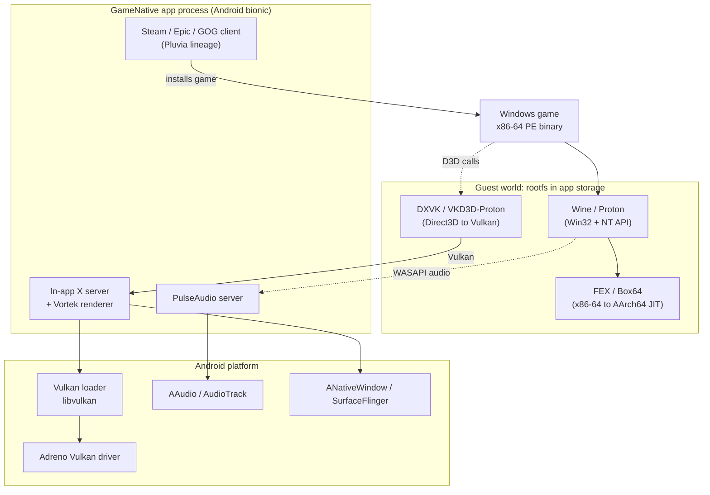

Read it as three bands. The **guest** band is a Linux x86-64 world running
inside a normal Android app's private storage. The **app** band is native ARM64
Android code: the in-app X server that receives the game's frames, the
PulseAudio server that receives its audio, and the storefront client that
downloaded the game. The **platform** band is plain AOSP: the Vulkan loader and
`ANativeWindow` from Chapter 13, AAudio from Chapter 15, and the SurfaceFlinger
compositor from Chapter 24.

Crucially, the dotted Direct3D and audio arrows *leave* the emulator early. The
game's D3D calls are handed to DXVK, which (in the fast configurations) runs as
native ARM64 code and emits Vulkan, so the heavy graphics translation is not
itself emulated. The same is true of audio. Only the solid arrow from the game
into Wine, and from Wine into the emulator, represents x86-64 code that the JIT
must actually translate.

### 64.1.3 No Root, No Kernel Changes

Everything in the guest band runs with the privileges of an ordinary
installed app. There is no `su`, no `insmod`, no SELinux policy change, no
modification to the system image. That constraint is what makes these apps
installable from a store on a locked bootloader, and it is also what forces most
of the engineering cleverness in this chapter. A desktop Wine setup can `chroot`
into a rootfs, mount filesystems, and `dlopen` the system's glibc GPU driver
directly. An Android app can do none of those things. Each missing capability is
replaced by a userspace stand-in:

| Desktop capability | Forbidden on unrooted Android | Userspace replacement |
|--------------------|-------------------------------|-----------------------|
| `chroot` into a rootfs | needs `CAP_SYS_ADMIN` | **PRoot** (ptrace path rewriting) |
| Mount the rootfs image | needs root | extract into app-private storage |
| System V shared memory | restricted by the kernel | ashmem/`memfd`-backed shim |
| `dlopen` the glibc GPU driver | driver is a `bionic` library | IPC to a native renderer, or thunks |
| Run a system PulseAudio | no system daemon access | bundle a PulseAudio server in the app |

### 64.1.4 The Unrooted-App Constraints in AOSP Terms

Three AOSP mechanisms shape what the stack can and cannot do, and all three were
introduced in earlier chapters.

**Linker namespaces (Chapter 7).** An app's native libraries are loaded in an
isolated linker namespace so they cannot see arbitrary system libraries. The
public `android_dlopen_ext` flags that govern this live in
`bionic/libc/include/android/dlext.h`; `ANDROID_DLEXT_USE_NAMESPACE`
(`bionic/libc/include/android/dlext.h:115`) lets a caller pick the namespace a
library loads into, and `ANDROID_DLEXT_USE_LIBRARY_FD`
(`bionic/libc/include/android/dlext.h:80`) lets it load a library straight from
a file descriptor, for example a `.so` stored uncompressed inside the APK. The
Vulkan loader itself uses the namespace flag when it opens the device driver, as
we will see in 64.7.4.

**W^X enforcement (Chapter 7).** A JIT must write machine code and then execute
it. Since API 26 the dynamic linker refuses to load any ELF segment that is
simultaneously writable and executable; `bionic/linker/linker_phdr.cpp:1057`
emits the `"has load segments that are both writable and executable"` diagnostic
and `bionic/linker/linker_phdr.cpp:1061` records the `W+E load segments` warning. A translator
like FEX or Box64 therefore cannot keep a page mapped `PROT_WRITE | PROT_EXEC`;
it must map JIT pages writable, fill them, then flip them to executable with
`mprotect`, respecting the write-xor-execute rule the platform enforces on app
processes.

**App-data execution limits.** On recent Android, executing binaries from an
app's writable data directory is increasingly restricted. The translation stack
must run the guest's executables through a loader it controls (PRoot, or a
redirection library) rather than handing the kernel a path under the app's data
dir and calling `execve` directly. This is one of the jobs of GameNative's
proprietary `libredirect.so`, discussed in 64.4.4.

---

## 64.2 GameNative: the Integrated Application

GameNative is an Android app that runs Windows PC games locally, with built-in
storefront integration for Steam, Epic Games Store, GOG, and Amazon Games. It is
the most complete public example of the full stack, so it anchors this chapter.
It is licensed GPL-3.0, with the package id `app.gamenative`.

### 64.2.1 Lineage: a Pluvia and Winlator Graft

GameNative is best understood as a graft of two upstream codebases rather than a
single fork:

1. **The application and Steam-client layer comes from Pluvia**, a lightweight
   unofficial Steam client for Android. Its fingerprints are in the source: the
   `Application` subclass is `PluviaApp.kt`, the Room database is
   `PluviaDatabase.kt`, and Steam connectivity uses the **JavaSteam** library.
   Pluvia provides account login, the library view, and the SteamPipe depot
   downloader.

2. **The runtime and compatibility layer comes from Winlator.** The entire
   `com.winlator.*` Java tree is vendored under
   `app/src/main/java/com/winlator/`, with the subpackages `container`, `core`,
   `xserver`, `xenvironment`, `winhandler`, `box86_64`, `fexcore`,
   `inputcontrols`, and `renderer`. The native side under
   `app/src/main/cpp/winlator/` is Winlator's too.

So in code-provenance terms GameNative is **Pluvia (the storefront app) plus
Winlator (the Wine and emulation runtime)**, unified under GameNative's GPL-3.0
Kotlin layer. Popular write-ups that call it simply "a fork of Winlator" are
collapsing this two-source structure; the accurate statement is the one above,
and the rest of the chapter relies on the Winlator half, which is the part that
actually runs the game.

### 64.2.2 The App Architecture

The Android-facing half is Kotlin with Jetpack Compose UI and Dagger Hilt
dependency injection. Three pieces matter for our purposes:

- **`SteamService`** (a foreground `Service`) owns the Steam session;
  per-store services sit alongside it for Epic, GOG, and Amazon.
- **`XServerScreen`** is the full-screen Compose surface a game renders into,
  driven by `XServerViewModel`. This is where the in-app X server, the audio
  server, and the graphics renderer are brought up.
- **The vendored Winlator runtime** does the actual container, rootfs, Wine,
  and emulator work, orchestrated from the `com.winlator.xenvironment` package.

### 64.2.3 The Container Model

A **container** is one game's isolated Windows environment: a Wine prefix plus
its configuration (graphics driver, emulator, audio driver, DLL overrides,
environment variables). The classes `com.winlator.container.Container` and
`ContainerManager` define and manage them, and the defaults are the clearest
single statement of what "the GameNative stack" actually is. From
`app/src/main/java/com/winlator/container/Container.java`:

```java
// GameNative: app/src/main/java/com/winlator/container/Container.java
public static final String DEFAULT_EMULATOR        = "FEXCore";
public static final String DEFAULT_AUDIO_DRIVER    = "pulseaudio";
public static final String DEFAULT_DXWRAPPER       = "dxvk";
// graphics driver default resolves to "vortek"
```

The pinned component versions live alongside, in
`app/src/main/java/com/winlator/core/DefaultVersion.java`: Box64, Box86, the
FEXCore build number, Turnip (the Mesa Adreno Vulkan driver), DXVK, VKD3D, and
the rest. The default Wine is recorded in `WineInfo.java`. Reading these two
files tells you the entire default pipeline at a glance, which is why a "Try It"
exercise at the end of the chapter is simply to read them.

### 64.2.4 The Default Stack

Putting the container defaults together, a freshly created GameNative container
runs:

- **Wine / Proton** in an **ARM64EC** configuration as the Windows API layer
  (64.6), with **FEXCore** translating the game's x86-64 code and a WoW64
  helper translating any 32-bit code (64.5.8).
- **DXVK** translating Direct3D 9/10/11 to Vulkan, with **VKD3D-Proton** for
  Direct3D 12 (64.7.2).
- **Vortek** as the Vulkan path that reaches the device's Adreno driver (64.7.3),
  with **Turnip** (Mesa) available as an alternative.
- **PulseAudio** as the audio server (64.8).

Box64 with a classic glibc launch path is also bundled as the alternative
route for Wine builds that are not ARM64EC; that path is selected by a different
launcher component (64.5.6).

### 64.2.5 Packaging: How the Pieces Reach the Device

GameNative ships a remarkable amount of prebuilt native software inside one app,
through three distinct delivery mechanisms.

1. **Android-process native libraries** ship in `jniLibs/arm64-v8a/` and are
   unpacked by the platform's package manager into the app's
   `nativeLibraryDir`. These are the libraries that load into the *Android*
   (bionic) process: the PulseAudio server libraries (`libpulse.so` and
   friends), the native graphics renderers (`libvortekrenderer.so`,
   `libvirglrenderer.so`) and the in-app X server (`libwinlator.so`), and the
   proprietary `libsteambootstrap.so`.

2. **Guest components** ship as compressed tar archives in `assets/` (Zstandard
   `.tzst` and xz `.txz`) and are extracted into the rootfs at runtime by
   `com.winlator.core.TarCompressorUtils`. Wine, FEX, Box64, DXVK, VKD3D, the
   Vulkan drivers, and the Windows DLL components all arrive this way. After
   extraction their ELF interpreters and RPATHs are patched with a vendored
   `patchelf`.

3. **Large or optional payloads** are downloaded on demand. The Ubuntu rootfs is
   delivered as a separate Android **dynamic feature module** (`ubuntufs/`,
   `dist:on-demand`), and the graphics drivers, extra DXVK builds, and Proton
   container patterns are fetched from GameNative's download server per the
   `assets/*_download.json` manifests. This keeps the base APK installable while
   the multi-gigabyte Linux userland arrives only when a game is first run.

### 64.2.6 End-to-End Launch Sequence

#### Diagram: launching a game in GameNative

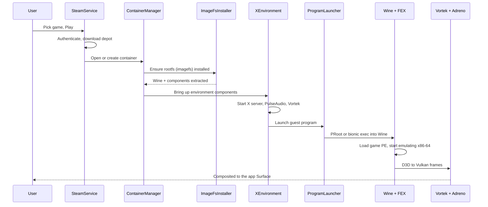

The `XEnvironment` object holds an ordered list of **components**, each a small
class in `com.winlator.xenvironment.components` that starts one subsystem: the X
server, `PulseAudioComponent`, the graphics renderer (`VortekRendererComponent`
or a VirGL renderer), a System V shared-memory component, and finally a
program-launcher component that spawns Wine under the emulator. The launcher is
either `BionicProgramLauncherComponent` (the default ARM64EC/FEX path) or
`GuestProgramLauncherComponent` (the classic glibc/Box64 path).

### 64.2.7 Licensing and the GPL Aggregation Question

GameNative is GPL-3.0, as is the vendored Winlator code. Most of the bundled
runtime carries its own upstream, mostly permissive or LGPL licences: Wine and
PulseAudio are LGPL-2.1, Mesa (Turnip, Zink) is largely MIT, DXVK is
zlib-licensed, and Box64 and FEX are MIT/BSD-style. The project's
`THIRD_PARTY_NOTICES` file makes a blanket written offer of source for the
copyleft components.

Two components are deliberately closed-source, and they are the legally
interesting part:

- **`libredirect.so`** (shipped in `assets/redirect.tzst`) is loaded only into
  the Wine/Proton subprocesses through `LD_PRELOAD`, never into the Android
  app's own address space. It rewrites a legacy package identifier and adapts
  process launches to recent-Android exec-from-data restrictions.
- **`libsteambootstrap.so`** is a JNI shim that drives a real in-process Steam
  client for achievements, cloud saves, and the overlay.

The maintainer's stated position is that these run as separate
programs/subprocesses communicating only through OS interfaces, and so are mere
aggregation under GPL-3.0 section 5 rather than derivative works of the GPL app.
That is the project's argument, not an adjudicated fact; whether shipping closed
`LD_PRELOAD` and JNI shims alongside a GPL-3.0 app withstands scrutiny is a
genuine, unsettled GPL question. The app builds and runs without either library,
with reduced compatibility, which is part of the maintainer's separability
argument.

---

## 64.3 The rootfs: a glibc Linux Userland Inside an App

### 64.3.1 What Is in the rootfs

Wine, the emulator's guest libraries, and the game all expect a Linux
filesystem laid out the normal way, with `/usr/lib`, `/bin`, an `ld-linux`
dynamic loader, and above all a **glibc** C library. Android provides none of
that to an app; it provides `bionic` and an app-private data directory. So the
stack ships an entire small Linux distribution, historically called the
**imagefs** in Winlator, and extracts it into the app's private storage.

The rootfs is based on **Ubuntu** (the original Winlator uses Focal Fossa,
20.04). Inside it sit a glibc userland, the Wine installation under `/opt`, and
the per-container **Wine prefix** at `/home/xuser/.wine`. The path constants are
defined in `com.winlator.xenvironment.ImageFs`.

### 64.3.2 Shipping and Extraction

The userland is shipped compressed and unpacked on first use, never mounted (an
app cannot mount). The relevant code is `ImageFsInstaller`, which extracts the
Wine tarball into `<rootfs>/opt/<version>`, and `TarCompressorUtils`, which
handles both the Zstandard `.tzst` and xz `.txz` formats GameNative uses. Once
extracted, ELF binaries are fixed up with `patchelf` so their interpreter and
library search paths point inside the rootfs rather than at a system that does
not exist.

The size is the reason the rootfs is delivered as an on-demand dynamic-feature
module (64.2.5): a full Ubuntu-plus-Wine userland is hundreds of megabytes
to gigabytes, far too large to sit in a base APK.

### 64.3.3 Entering the rootfs: PRoot

A desktop setup would `chroot` into the rootfs. An unrooted app cannot. The
classic Winlator answer is **PRoot**, a userspace re-implementation of `chroot`
and bind-mounts built entirely on the Linux `ptrace` system call.

PRoot launches the guest program as a traced child. Every time the child makes a
system call that names a path, PRoot intercepts it at the kernel boundary,
*rewrites the path string in the tracee's memory* so that, say, `/usr/lib/...`
becomes `<app data>/imagefs/usr/lib/...`, and then lets the kernel proceed. The
guest believes it lives at `/`; in reality every path is being remapped on the
fly. The same trick is reapplied across `execve` so that child processes stay
confined. Bind-mounts like `--bind=/dev` and `--bind=/proc` are implemented the
same way, by remapping the relevant prefixes.

#### Diagram: how PRoot remaps a guest path with ptrace

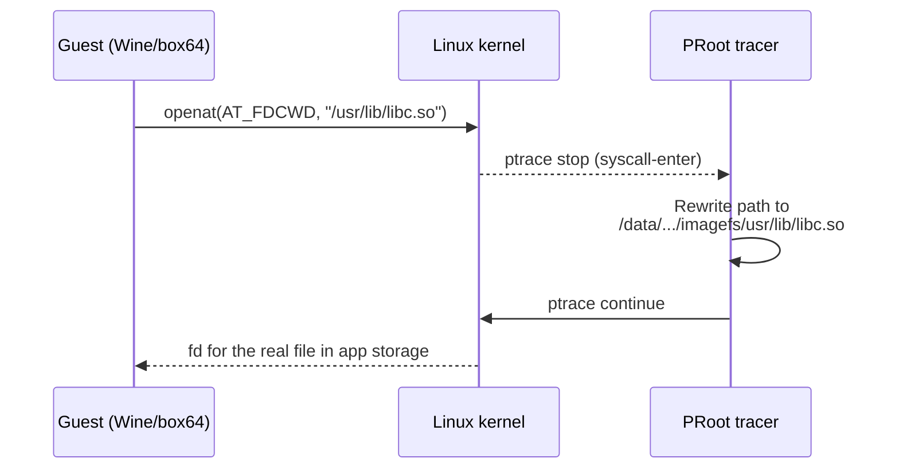

The cost is the price of admission for going rootless: every path-bearing
syscall takes a `ptrace` stop-and-continue round trip into the PRoot process.
That overhead is the main reason the newer **bionic** designs (64.3.6) try to
eliminate PRoot entirely.

### 64.3.4 glibc Versus bionic: the Central Mismatch

The rootfs gives Wine a glibc world, which is exactly what Wine wants. But it
creates the defining problem of the whole stack: **the process now contains
glibc, while every native Android library, including the GPU driver, is built
against `bionic`.** You cannot simply `dlopen` a `bionic` `.so` into a glibc
process. The two C libraries disagree about thread-local storage layout, about
the dynamic loader's internal structures, about `errno`, about `pthread_t`,
about stack canaries. Loading one libc's shared object into the other's process
corrupts state and crashes.

This is the problem that "bionic redirections" exist to solve, and it is
important enough to get its own section (64.4). For now, note the shape of the
two answers: either keep the glibc world and reach Android services through
**inter-process communication** rather than linking (the PulseAudio server, the
Vortek renderer, and the SysV-SHM server are all separate endpoints reached over
sockets), or abandon glibc and run Wine directly on `bionic` (the newer forks).

### 64.3.5 System V Shared Memory over ashmem

The cleanest concrete example of a bionic redirection is System V shared memory.
X11, DXVK, and other components use `shmget`/`shmat` to share large buffers
between processes. Android's kernel restricts the System V SHM API. Winlator's
glibc rootfs therefore carries a **patched glibc** whose `shmget`/`shmat`/`shmdt`
family is reimplemented on top of Android's anonymous shared memory, brokered by
a small server on the Android side (`com.winlator.sysvshm`).

On the Android side, the natural primitive is `ASharedMemory_create`
(`frameworks/native/include/android/sharedmem.h:78`), the NDK entry point that
returns a file descriptor for an anonymous, refcounted shared-memory region.
Underneath, it is backed by `memfd_create`
(`bionic/libc/include/sys/mman.h:183`, available from API 30) or the older
ashmem driver. The redirection turns a System V `shmget` call inside the guest into
an `ASharedMemory`-style fd on the host, passed back across the socket. The guest
keeps using the System V API it was written for; the host satisfies it with an
Android primitive the kernel actually allows.

### 64.3.6 The bionic-Wine Alternative

The newest Winlator forks, and GameNative's default path, take the other route:
build Wine for **`bionic`** and drop PRoot. If Wine itself runs on `bionic`,
there is no libc mismatch with the Android GPU driver, and there is no per-syscall
`ptrace` tax. The price is that everything Wine relied on glibc for must now be
provided on `bionic`, which is why this path leans on ARM64EC Wine builds
(64.5.8) and a set of redirection libraries that fix up path and behaviour
differences in place of PRoot. We turn to those next.

---

## 64.4 Bionic Redirections and the libc Boundary

"Bionic redirections" is the umbrella term for the techniques that let a stack
built around glibc-flavoured Linux software cooperate with an Android system
built around `bionic`. There are several distinct problems hiding under that
phrase, and they have different solutions.

### 64.4.1 Why Two libcs Cannot Share a Process

Restating the core constraint precisely, because everything else follows from
it: a single Linux process has exactly one dynamic loader and one C library
providing the loader's internal state, the TLS block, `malloc`, and the syscall
wrappers. glibc and `bionic` are different implementations with incompatible
internal layouts. A glibc process's threads have glibc `pthread` structures and a
glibc TLS model; a `bionic` `.so` compiled to find its thread-control-block at a
`bionic` offset will read garbage. There is no flag that makes the two coexist.
The boundary between them must be crossed by *some* mechanism that does not
require linking, and there are exactly three such mechanisms in this stack:
inter-process communication, ABI thunking, or choosing one libc for the whole
process.

### 64.4.2 Linker Namespaces and dlext

Even when the stack does run native `bionic` code, it is subject to the linker
namespace isolation from Chapter 7. App native libraries load into a restricted
namespace that cannot see most system libraries. The driver-loading path uses
`android_dlopen_ext` with `ANDROID_DLEXT_USE_NAMESPACE`
(`bionic/libc/include/android/dlext.h:115`) to target a specific namespace, and
custom-driver loaders such as **adrenotools** (used to side-load a newer Turnip
build than the device ships) rely on exactly this machinery to get a chosen
`.so` loaded into a namespace that can reach the GPU kernel interfaces. The
`ANDROID_DLEXT_USE_LIBRARY_FD` flag
(`bionic/libc/include/android/dlext.h:80`) is the companion that loads a driver
straight from a file descriptor.

### 64.4.3 W^X and the JIT

The translators are JITs, and a JIT must respect the write-xor-execute rule the
platform enforces (64.1.4). The pattern every translator on Android follows is:
map a code buffer `PROT_READ | PROT_WRITE`, emit AArch64 instructions into it,
clear the instruction cache for that range, then `mprotect` it to
`PROT_READ | PROT_EXEC` before jumping in. A page is never both writable and
executable at once, satisfying the linker's W+E rejection
(`bionic/linker/linker_phdr.cpp:1057`). On devices and Android versions that
further restrict executing memory from app data, the translator must allocate
its code pages as anonymous memory it owns rather than mapping a file from the
data directory.

### 64.4.4 Path Redirection: PRoot Versus libredirect

PRoot (64.3.3) is one form of path redirection: rewrite paths in the kernel ABI
using `ptrace`. It is general but slow. The bionic path replaces it with a
preloaded library, GameNative's `libredirect.so`, injected into Wine
subprocesses with `LD_PRELOAD`. Instead of trapping every syscall through
`ptrace`, the library interposes the libc functions that take paths and rewrites
their arguments in-process, with no tracer round trip. It also adapts process
launches to recent-Android restrictions on executing from the app data
directory, standing in for the kernel mechanism that an unrooted app is not
allowed to use. The trade-off is generality for speed: a preload library only
catches calls that go through the functions it interposes, whereas PRoot catches
everything at the kernel boundary, but the preload approach avoids the
per-syscall `ptrace` cost that dominates PRoot's overhead.

### 64.4.5 The IPC Escape Hatch

The most robust redirection is to not cross the libc boundary in-process at all.
Three of the stack's services live on the Android (`bionic`) side as separate
endpoints and are reached from the guest over Unix-domain sockets:

- the **PulseAudio server**, which the guest's Wine audio backend connects to as
  an ordinary PulseAudio client (64.8);
- the **Vortek Vulkan renderer**, where the guest holds only a thin Vulkan ICD
  that serialises commands over a socket to the native renderer (64.7.3);
- the **System V SHM server** (64.3.5).

Because the boundary is a socket, the two sides can use different C libraries,
different instruction sets, and different memory models without any of it
mattering: the only contract is the wire protocol. This is the same reason
Binder works across processes with different runtimes (Chapter 9). It costs a
serialisation step and a copy, but it sidesteps the libc problem entirely, which
is why the performance-critical-but-not-hottest paths (audio, command
submission) are built this way while the truly hot path (CPU translation) is
not.

---

## 64.5 FEX and Box64: Translating x86-64 to AArch64

This is the layer that does the actual instruction-set emulation from 64.1.1.
Two projects dominate, and GameNative ships both: **FEX** (the default, via its
FEXCore engine) and **Box64**. They solve the same problem with opposite
philosophies, and understanding the difference explains most of the
compatibility-versus-speed trade-offs users encounter. This chapter complements
Chapter 19, which covered Android's *own* in-process binary translators that plug
into the Native Bridge: **Berberis**, the AOSP translator that runs riscv64 app
code on x86_64 devices (its CPU-emulation core was consolidated under
`frameworks/libs/binary_translation/cpu_emulation/` in Android 17), and the
historical, closed-source **Houdini**, which ran ARM app code on Intel x86. Both
run *guest Android APK* native code under ART, in the opposite direction to the
x86-64-on-AArch64 problem here, and neither is involved in this stack. FEX and
Box64 are the same dynarec idea applied to whole Linux/Windows x86-64 *programs*:
they run inside an ordinary app process, not as Native Bridge plugins, and they
translate x86-64 to AArch64, which is a direction no AOSP-shipped translator
covers.

### 64.5.1 What a Dynamic Recompiler Does

A dynamic recompiler, or dynarec, is a JIT for foreign machine code. It reads a
block of x86-64 instructions, translates them once into AArch64 instructions,
caches the result, and jumps to the cached translation every time the guest
reaches that address again. The translated code keeps the guest's registers in
host registers, keeps the guest's memory as ordinary host memory, and falls back
to a dispatcher only at block boundaries to decide what to run next. A dynarec is
typically five to ten times faster than an interpreter because the per-instruction
decode cost is paid once, at translation time, instead of on every execution.

Three things make x86-to-ARM specifically hard, and each one is a place where
FEX and Box64 spend their engineering effort:

1. **Flags.** Almost every x86 arithmetic instruction updates the EFLAGS
   register. Computing those flag bits on ARM after every operation is
   ruinously expensive, so a good dynarec defers and elides flag computation,
   only materialising flags when something actually reads them.
2. **Vector instructions.** SSE, AVX, and x87 floating point have to map onto
   ARM's NEON vector registers (and SVE where the host supports it), with
   careful attention to NaN handling and rounding.
3. **The memory model.** x86 has a strong memory model (Total Store Ordering);
   ARM has a weaker one. Preserving correctness here is subtle and costly enough
   to warrant its own subsection (64.5.3).

### 64.5.2 The FEXCore Pipeline

FEX is a userspace x86 and x86-64 emulator for AArch64 hosts. Its emulation
engine is a library called **FEXCore**, and its translation pipeline is a clean
four-stage design:

#### Diagram: the FEXCore translation pipeline

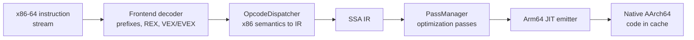

Walking the stages against the FEX source tree:

- **The frontend decoder** reads the raw byte stream and finds instruction
  boundaries, handling x86's legacy prefixes, REX prefixes, and the VEX/EVEX
  encodings used by AVX.
- **The `OpcodeDispatcher`** (`FEXCore/Source/Interface/Core/OpcodeDispatcher.cpp`,
  with vector and x87 handling split into `OpcodeDispatcher/Vector.cpp` and
  `OpcodeDispatcher/X87.cpp`) translates each decoded instruction into FEX's own
  SSA-form intermediate representation. The IR opcodes themselves are defined in
  `FEXCore/Source/Interface/IR/IR.json`.
- **The `PassManager`** (`FEXCore/Source/Interface/IR/PassManager.cpp`) runs
  optimisation passes over the IR. The most important for performance are
  register allocation (mapping IR values to ARM registers), redundant-flag
  elimination (dropping EFLAGS updates that are never read), and an x87 stack
  optimisation pass.
- **The JIT backend** (`FEXCore/Source/Interface/Core/JIT/JIT.cpp`) emits native
  AArch64 instructions from the optimised IR into the code cache. FEX uses a
  custom ARM64 emitter rather than an off-the-shelf assembler to keep code
  generation fast and compact.

FEX supports MMX, SSE through SSE4, x87, and AVX/AVX2, and it translates
multi-block regions rather than single basic blocks, dispatching between cached
translations through a lookup cache. Self-modifying code is handled by detecting
guest writes to pages that contain translated code and invalidating the affected
cached blocks.

### 64.5.3 The TSO Memory-Model Problem

This is the most important performance subtlety in the entire emulation layer.
x86 guarantees Total Store Ordering: stores from one core become visible to
other cores in program order. ARM does not; it allows stores to be reordered
unless you insert barriers or use acquire/release instructions. A multithreaded
game written for x86's strong ordering will race and crash if its memory
operations are naively translated to plain ARM loads and stores.

FEX's correct-by-default answer is to emulate TSO, using ARM's acquire/release
load and store instructions (the `FEAT_LRCPC` extensions) and atomics
(`FEAT_LSE2` for the unaligned atomics x86 permits but ARM normally forbids).
This emulation is expensive: faithfully reproducing x86 ordering on a weak model
can cost on the order of a 10x slowdown on the affected memory traffic, felt most
in vector-heavy game code.

The escape valve is **hardware TSO**. Some ARM cores can be switched into a
hardware total-store-ordering mode; Apple Silicon does this (it is how Rosetta 2
is fast), and where the host CPU exposes it, FEX requests it and relaxes its
software emulation for a large win. FEX also offers tunables to disable TSO
emulation for vector accesses or for stack memory (which is thread-private and
safe), trading a little stability for speed. The practical upshot for a phone is
that a Snapdragon's specific memory-ordering capabilities materially affect how
fast emulation runs, independent of raw clock speed.

### 64.5.4 FEX Thunks: Calling Native ARM64 Graphics

If FEX translated *every* instruction the game's process executed, including the
entire Vulkan driver, performance would be hopeless. The lever that avoids this
is **thunking**, also called library forwarding. A thunk lets emulated x86 guest
code call a **native AArch64** host library directly, so heavy libraries like
the GPU driver run as native code rather than being translated instruction by
instruction.

The design is two-sided. On the guest side, FEX provides a small x86 stub
library that presents the normal guest ABI (for example a guest `libvulkan.so`)
but, instead of containing the driver, forwards each call across the boundary. On
the host side, a native ARM64 thunk library receives the forwarded call and
invokes the real host library. The FEX source carries both halves for the key
graphics libraries: `ThunkLibs/libvulkan/Guest.cpp` and
`ThunkLibs/libvulkan/Host.cpp` for Vulkan, and `ThunkLibs/libGL/` for OpenGL.

#### Diagram: a thunked Vulkan call crossing the emulation boundary

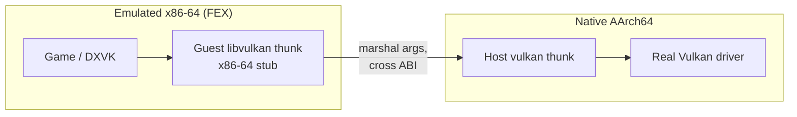

The hard part is marshalling: the guest and host disagree on pointer size in the
32-bit case, on structure layout, and on calling convention, and callbacks (a
function pointer the host library will call back into) must be trampolined back
across the boundary in the other direction. FEX's thunking handles function
pointers in both directions and converts data-structure layouts at the boundary,
configured by a `ThunksDB.json` that maps each guest library to its host overlay.
Thunking is the single biggest reason FEX-based graphics can approach native
speed: only the game's draw-call *setup* is emulated, while the driver work runs
native.

### 64.5.5 The FEX RootFS Requirement

When FEX runs as a standalone Linux emulator, emulating a complete x86-64
*process*, it needs an x86-64 root filesystem to supply the guest glibc and base
libraries; on desktop Linux the `FEXRootFSFetcher` downloads a SquashFS or EroFS
image for exactly that. This is the everything-emulated model, and it is the
main axis on which Box64 differs, since Box64 wraps host libraries instead of
emulating a full guest userland.

In GameNative's default ARM64EC configuration, however, FEX does not run as a
Linux emulator at all. It plugs into Wine as a CPU-only module (64.5.8): the
Windows system calls are serviced by Wine rather than by a guest glibc, so the
separate x86 rootfs is no longer needed. The FEX rootfs requirement is therefore
a property of the everything-emulated path, not of the ARM64EC default, and
shedding it is one of ARM64EC's concrete wins.

### 64.5.6 Box64: Wrapped Native Libraries

Box64, by ptitSeb, is a dynarec with the same core job but a different
philosophy about system libraries. Instead of emulating the x86-64 glibc, GL,
and Vulkan from a rootfs, Box64 detects when the guest is about to call into one
of those well-known libraries and **substitutes the host's native ARM64
implementation**, wrapping each call to translate the calling convention. The
hand-written wrappers live in the Box64 source under `src/wrapped/`, for example
`src/wrapped/wrappedvulkan.c` for Vulkan and `src/wrapped/wrappedlibc.c` for the
C library.

The consequence is that Box64 does not need a full x86 rootfs for the libraries
it wraps; it borrows the host's. That makes it lighter than FEX, and it is the
historical default of classic Winlator, where the launch chain is literally
`proot` then `box64` then `wine`. GameNative's `GuestProgramLauncherComponent`
builds exactly that `box64 <guest exe>` command for the glibc path. The trade-off
is that wrapping is only as correct as the wrappers: when a wrapped library's
behaviour diverges from what the guest expected, it can break in ways a
full-emulation approach would not.

The 32-bit story is symmetric. Box64 handles x86-64; its sibling **Box86**
handles 32-bit x86, and for hosts with no 32-bit ARM environment Box64 has an
experimental `BOX32` mode that emulates a 32-bit environment within the 64-bit
one. Box64's own `docs/WINE.md` lays out the matrix of Wine variants (x86, x86-64,
x86-64 WoW64, ARM64 WoW64) and which Box combination each requires; it is the
single best primary reference for how the emulator and Wine fit together.

### 64.5.7 FEX Versus Box64

#### Diagram: the two emulation philosophies

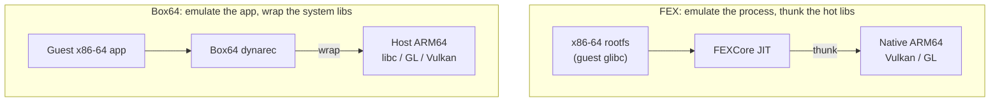

| Dimension | FEX | Box64 |
|-----------|-----|-------|
| System libraries | emulated from an x86-64 rootfs | wrapped to host-native ARM64 |
| Disk footprint | heavier (full rootfs) | lighter (borrows host libs) |
| Native-lib escape | thunks (GL, Vulkan) | wrappers (libc, GL, Vulkan, more) |
| 32-bit code | same core; WoW64/ARM64EC | separate Box86, or BOX32 |
| Accuracy posture | full IR recompiler, rigorous TSO | pragmatic; depends on wrapper fidelity |
| Role in GameNative | default (FEXCore) | bundled alternative |

Neither is universally better. FEX's full-emulation accuracy helps with
heavily-modded or unusual titles; Box64's lighter footprint and mature wrappers
made it the long-time Winlator default. GameNative ships both and lets a
container pick.

### 64.5.8 ARM64EC and WoW64: Emulating Only the Game

The most important recent shift is architectural, not incremental: stop running
Wine itself through the emulator. In the "everything emulated" model, the JIT
translates the game *and* all of Wine *and* the x86 Linux libraries underneath
Wine; the emulator is on the hot path for every instruction. The **ARM64EC**
model instead builds Wine natively for ARM64 and emulates only the game's x86-64
code.

ARM64EC ("Emulation Compatible") is a Microsoft ABI, reimplemented in Wine, in
which native ARM64 code is laid out to be call-compatible with emulated x86-64
code. Wine's system DLLs are compiled in this ABI, so when the emulated game
calls a Windows API, execution transitions into *native* ARM64 Wine code instead
of continuing to emulate. The emulator is reduced to a CPU core that plugs into
Wine as a loadable module at the ABI boundary. In this configuration the
emulator ships as a Windows DLL that Wine loads: FEX as `libarm64ecfex.dll` for
64-bit code, and either `libwow64fex.dll` (FEX) or `wowbox64.dll` (Box64) for the
32-bit WoW64 path. GameNative selects between these in its
`BionicProgramLauncherComponent` based on whether the configured Wine build is
ARM64EC.

#### Diagram: shrinking the emulated region with ARM64EC

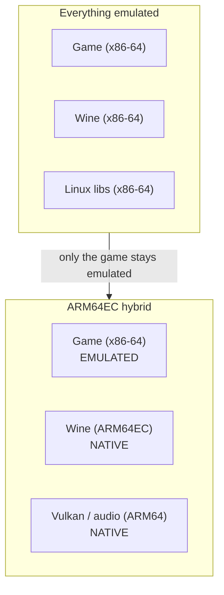

The payoff is large: the Windows API work, the graphics translation, and the
audio path all run as native ARM64, and only the game's own instruction stream is
translated. This is the design GameNative defaults to, and it is why the stack is
fast enough to be usable on a phone at all.

---

## 64.6 Wine: Implementing the Windows API

Wine is the layer that makes the game think it is running on Windows. Where the
emulator handles instructions, Wine handles meaning: every call the game makes to
the Windows API is serviced by Wine's reimplementation of that API on top of the
Linux kernel.

### 64.6.1 Not an Emulator

The name is a recursive acronym, "Wine Is Not an Emulator," and on ARM Android
the distinction is not pedantry, it is the architecture. Wine contains no
instruction translation whatsoever. It takes a Windows PE binary, loads it into a
Linux process, and answers its Windows API and NT system calls with native code
that talks to Linux. On x86-64 Linux that native code runs directly. On ARM
Android, Wine is *itself* either emulated (the everything-emulated model) or
compiled native as ARM64EC (the hybrid model) but in neither case does Wine do
the x86-to-ARM translation; that is always FEX or Box64. The two layers are
orthogonal, exactly as 64.1.1 set out.

### 64.6.2 The PE/Unix Split

Modern Wine is organised around a hard boundary between Windows PE code and a
Unix backend. Wine's builtin DLLs (`ntdll`, `kernel32`, `kernelbase`, `user32`,
`gdi32`) are compiled as real PE files, so from the game's point of view it is
calling ordinary Windows DLLs. The subset of DLLs that must touch the host OS are
split into a PE part and a Unix part.

The canonical example is `ntdll`. The PE side (`dlls/ntdll/`) builds
`ntdll.dll`; the Unix side (`dlls/ntdll/unix/`) builds `ntdll.so`, an ELF
library `dlopen`'d at startup whose key files are `dlls/ntdll/unix/loader.c`,
`dlls/ntdll/unix/virtual.c`, and `dlls/ntdll/unix/signal_x86_64.c`. The contract
between the two halves is declared in `dlls/ntdll/unixlib.h`.

Process startup begins as a perfectly ordinary Linux process: a small loader
`dlopen`s `ntdll.so`, which builds the Windows process control structures (the
PEB and TEB), maps the PE `ntdll.dll` and the initial executable, connects to
wineserver, and finally jumps into PE-side initialization, after which control
runs "as if it were Windows."

#### Diagram: Wine's PE and Unix halves and the syscall boundary

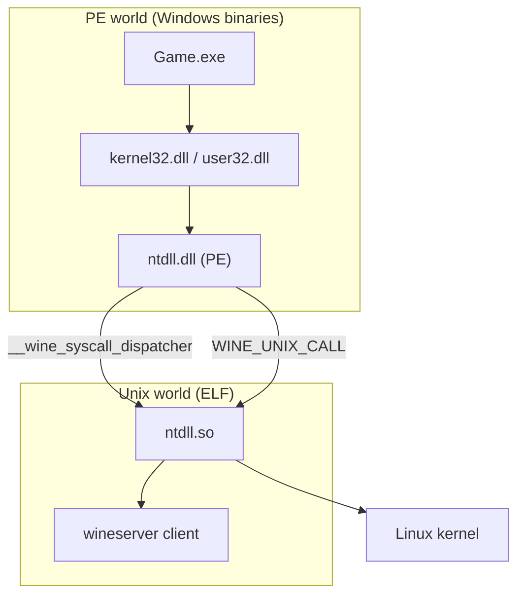

Two mechanisms cross the boundary. NT system calls (`NtCreateFile`,
`NtUserCreateWindowEx`) funnel through a `__wine_syscall_dispatcher` set up in
`dlls/ntdll/unix/signal_x86_64.c`, which saves CPU state, switches to a Unix
stack, indexes a syscall table, and calls the Unix implementation. DLLs with a
Unix backend that bypass the NT table instead use `WINE_UNIX_CALL`. The fact that
Wine routes Windows API calls through an explicit, NT-like syscall boundary is
exactly what makes the ARM64EC and WoW64 transitions of 64.5.8 possible: the
boundary is already there to hook.

### 64.6.3 wineserver

wineserver is a separate daemon that provides Wine roughly the services the
Windows kernel provides on Windows. Every Wine process sharing a prefix shares,
through wineserver, the things NT keeps in kernel space: handles and the object
namespace, synchronization objects (events, mutexes, semaphores), processes and
threads, window-management state, and the registry.

Clients talk to it over an `AF_UNIX` socket, marshalling requests through
`wine_server_call`; the server's request handlers live in `server/request.c`.
The socket lives in a per-prefix directory keyed off the prefix's device and
inode, so each prefix gets its own server. A particularly important detail is
that the socket passes **file descriptors** between processes using the standard
`SCM_RIGHTS` ancillary-data technique, so a Windows `HANDLE` can be backed by a
real Linux fd handed over from the server.

The performance caveat matters on a phone. Games synchronize threads constantly,
and the classic "ask wineserver every time" model makes each synchronization a
socket round trip. Wine has progressively moved synchronization out of the
server: **esync** (eventfd-based), **fsync** (futex-based), and most recently
**ntsync**, a Linux kernel driver exposing `/dev/ntsync` that models NT
synchronization primitives in-kernel. Whether the faster paths are available
depends on the host kernel: an Android kernel may not expose `/dev/ntsync` at
all, in which case the stack falls back to fsync on futexes, which Android does
have.

### 64.6.4 The Prefix, the C: Drive, and the Registry

A **Wine prefix** (the `WINEPREFIX`, here `/home/xuser/.wine` inside the rootfs)
is one self-contained virtual Windows installation: its own C: drive, its own
registry, and its own wineserver. Inside, `drive_c/windows/system32` holds the
64-bit system DLLs, `drive_c/windows/syswow64` holds the 32-bit ones (the
Windows naming inversion is preserved), and `dosdevices/` holds the symlinks that
map drive letters to host paths. The registry is stored as text `.reg` files at
the prefix root (`system.reg` for HKLM, `user.reg` for HKCU) and served live by
wineserver.

This layout is why a container is portable and disposable: it is just a directory
tree. GameNative's per-game containers are exactly per-game prefixes, which is
how two games with conflicting DLL or registry needs stay isolated.

### 64.6.5 DLL Overrides: How DXVK Replaces Wine's Direct3D

Wine decides, per DLL, whether to use its own builtin implementation or a
**native** DLL placed in the prefix. The choice is driven by the
`WINEDLLOVERRIDES` environment variable and by registry entries under
`HKCU\Software\Wine\DllOverrides`. This single mechanism is how the entire
graphics fast path gets installed: DXVK and VKD3D-Proton ship PE DLLs named
exactly like Wine's builtin Direct3D DLLs (`d3d9.dll`, `d3d11.dll`, `dxgi.dll`,
`d3d12.dll`), the installer copies them into the prefix's `system32`/`syswow64`,
and sets those names to `native`. The next time the game calls
`D3D11CreateDevice`, Wine's loader resolves `d3d11.dll` to the DXVK file instead
of its own `wined3d`-backed builtin, and Direct3D is now translated to Vulkan
(64.7) rather than to OpenGL.

### 64.6.6 Where Wine Meets the Emulator

Tying 64.5 and 64.6 together: in the ARM64EC configuration, Wine is native
ARM64EC, its DLLs transition to native code at the syscall boundary, and the
emulator (`libarm64ecfex.dll` or the WoW64 helper) is invoked only to run the
game's x86-64 instruction stream. In the everything-emulated configuration, all
of Wine is x86-64 and runs on top of Box64 or FEX against the rootfs glibc. Both
configurations present the game an identical Windows; they differ only in how
much of the process below the game is emulated versus native, which is the single
biggest determinant of frame rate.

---

## 64.7 Graphics: Direct3D to the Adreno GPU

Graphics is where the stack either succeeds or visibly fails, and it is the
longest translation chain in the book: a Direct3D call made by an x86-64 game
ends up as a Vulkan command executed by the phone's Adreno driver and composited
by SurfaceFlinger. Every link in that chain is a separate technology.

### 64.7.1 The Translation Chain

#### Diagram: the full Direct3D-to-display chain

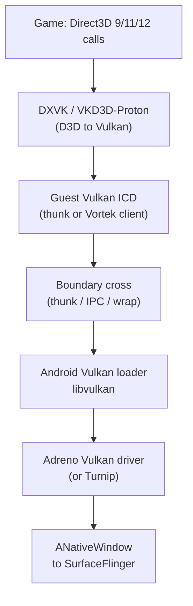

The chain has two halves separated by the libc boundary from 64.4. Above the
boundary, in the Windows/guest world, Direct3D becomes Vulkan. Below it, on the
Android side, Vulkan reaches the real driver and the frame reaches the display.
The interesting engineering is entirely in how the boundary is crossed.

### 64.7.2 D3D to Vulkan: DXVK, VKD3D, and the Fallbacks

Several translators cover the Direct3D version space, all installed as Wine DLL
overrides (64.6.5):

- **DXVK** translates Direct3D 9/10/11 to Vulkan. It ships `d3d9.dll`,
  `d3d11.dll`, `dxgi.dll` and related DLLs. It is the default `DEFAULT_DXWRAPPER`
  in GameNative containers.
- **VKD3D-Proton** translates Direct3D 12 to Vulkan, shipping `d3d12.dll` and
  `d3d12core.dll`. It is the Valve-tuned fork of WineHQ's own vkd3d, optimised
  for game performance.
- **D8VK** extends DXVK down to Direct3D 8.
- **wined3d** is Wine's builtin fallback, translating Direct3D to OpenGL rather
  than Vulkan. It is slower and used only when a game is incompatible with DXVK.
- **cnc-ddraw** handles legacy DirectDraw titles.

The key architectural point is that on ARM64EC these translators are native
ARM64 code (64.5.8). Only the game's D3D *calls* originate from emulated code;
the heavy work of turning a frame's worth of draw calls into Vulkan command
buffers runs native. This is why DXVK on a phone is far faster than the alternative
of translating Direct3D inside a fully-emulated x86 Wine.

### 64.7.3 Reaching the Real GPU: Turnip and Vortek

Vulkan commands now have to reach the actual Adreno GPU, and there are two
strategies, which is the most important fork in the graphics design.

**Turnip** is Mesa's open-source Vulkan driver for Adreno GPUs. The stack ships a
Turnip build (and can side-load a newer one via adrenotools, 64.4.2) so the guest
has a real, complete Vulkan implementation that talks to the Adreno kernel
interface directly. Turnip exists because the Vulkan driver a phone ships is often
incomplete or buggy for the unusual workloads Wine and DXVK generate; a known-good
Mesa driver sidesteps that. In the FEX world, the guest reaches Turnip through the
**thunk** mechanism (64.5.4): a guest `libvulkan` stub forwards to the native
Turnip.

**Vortek** is Winlator's own Vulkan compatibility layer, and it takes the IPC
route from 64.4.5 instead of thunking. It is a client/server design: the guest
links a thin Vortek Vulkan **ICD** (shipped into the rootfs from an
`assets/.../vortek-*` archive) that serialises every Vulkan call into a command
stream and ships it over a Unix socket to a **native Android server**, the
prebuilt `libvortekrenderer.so`, driven by `VortekRendererComponent`. The server
replays the commands against the device's real Vulkan driver, and along the way
it can patch SPIR-V shaders, decode texture formats the host driver lacks, and
emulate features. Vortek is GameNative's
default graphics driver precisely because the socket boundary makes it robust to
the glibc/`bionic` mismatch: the guest and the host driver never share an address
space.

#### Diagram: Turnip (thunk) versus Vortek (IPC) to the GPU

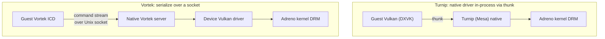

A handful of other paths exist for non-Vulkan or low-end cases: **Zink** (Mesa's
OpenGL-on-Vulkan), **VirGL** (a virtio-gpu virtual 3D renderer with its own
client/server), and **llvmpipe** (a pure-CPU software rasteriser of last resort).
Zink is worth a moment because it is the guest-side mirror of an AOSP component:
where a guest needs OpenGL and the host only has a good Vulkan driver, Zink
re-expresses GL as Vulkan, which is exactly what Android's own **ANGLE**
(`external/angle/`) does for native apps that call OpenGL ES (Chapter 13). ANGLE
is not the platform's default GLES driver on most devices, as the EGL loader
itself notes (`frameworks/native/opengl/libs/EGL/Loader.cpp:555`); it is selected
per-app or system-wide. The Windows-game stack does not route through ANGLE,
because the guest runs its own GL-to-Vulkan translation (Zink, or `wined3d`'s GL
output) inside the rootfs and reaches the device through the Vulkan loader; the
parallel is conceptual, not a shared code path.

### 64.7.4 The Android Vulkan Loader

Whichever guest path is used, the bottom of the chain is the same AOSP Vulkan
loader from Chapter 13. The loader discovers and loads the device's Vulkan driver
in `frameworks/native/vulkan/libvulkan/driver.cpp`; the `LoadDriver` routine
(`frameworks/native/vulkan/libvulkan/driver.cpp:153`) opens the HAL driver
(`vulkan.<board>.so`) with `android_dlopen_ext`
(`frameworks/native/vulkan/libvulkan/driver.cpp:171`) using
the namespace flag from 64.4.2, because the driver lives in a restricted linker
namespace. A native renderer such as Vortek's server, or a thunked Turnip, is in
the end just another client of this loader and this driver, which is why the
whole edifice works without any platform modification: the GPU is reached through
the same public Vulkan interface any Android game uses.

### 64.7.5 Presentation: the In-App Surface

Rendered frames must become pixels on screen. The game does not get a real X
display or a real window system; it gets GameNative's **in-app X server**, a
small X11 server implemented inside the app (`com.winlator.xserver`, native code
under `app/src/main/cpp/winlator/`) that receives the game's output and the
window it draws into. The X server's contents are drawn with Vulkan and presented
to an Android **Surface**.

That final step uses the native window APIs from Chapter 13. Frames reach the
compositor through `ANativeWindow`; for the CPU-access path the functions are
`ANativeWindow_lock`
(`frameworks/native/libs/nativewindow/include/android/native_window.h:179`) and
`ANativeWindow_unlockAndPost`
(`frameworks/native/libs/nativewindow/include/android/native_window.h:188`), while
the zero-copy GPU path binds an `AHardwareBuffer`
(`frameworks/native/libs/nativewindow/include/android/hardware_buffer.h:479`, via
`AHardwareBuffer_allocate`) as the Vulkan swapchain image so the GPU renders
straight into a buffer SurfaceFlinger can scan out. From SurfaceFlinger onward
(Chapter 24) the game's frame is just another layer composited to the display.

### 64.7.6 Frame Generation

As an optional final touch, GameNative can insert a Vulkan implicit layer that
performs frame generation, interpolating synthetic frames between rendered ones by
intercepting `vkQueuePresentKHR`. It is a layer in the Vulkan sense, slotting into
the loader's layer chain, and it illustrates how much of the graphics stack is
built out of standard Vulkan extension points rather than bespoke hooks.

---

## 64.8 Audio: from WASAPI to AAudio

Audio is a shorter chain than graphics but crosses the same libc boundary, and it
is solved with the IPC pattern from 64.4.5: a real audio server runs on the
Android side and the guest connects to it as a client.

### 64.8.1 Wine's Audio Backends

A Windows game emits audio through one of several front-end APIs (the modern
WASAPI via `mmdevapi`, legacy DirectSound, or the old `winmm`/`waveOut`). Wine
layers all of them onto a single backend driver chosen at runtime. The backend
that matters here is `winepulse.drv`, which targets **PulseAudio**; the
alternatives are `winealsa.drv` (ALSA) and `wineoss.drv` (OSS). Each backend is a
PE driver DLL paired with a Unix `.so` that calls the host audio client library.
In the ARM64EC configuration the backend and its client library are native ARM64,
so audio mixing and transport are not emulated; only the game's calls into the
front-end API cross the emulator.

### 64.8.2 A PulseAudio Server Inside the App

There is no system PulseAudio daemon available to an unrooted app, so the stack
ships one. GameNative's `PulseAudioComponent` starts a PulseAudio server from the
bundled native libraries (`libpulse.so` and the `libpulsecommon`/`libpulsecore`
PulseAudio 13 libraries in `jniLibs/`). Wine's `winepulse.drv` connects to this
server exactly as it would to a desktop PulseAudio, over PulseAudio's normal
socket protocol. Because the contract is the PulseAudio wire protocol, the guest
side (glibc, possibly emulated) and the server side (`bionic`, native) interoperate
across the libc boundary without sharing an address space.

#### Diagram: the audio path from game to speaker


### 64.8.3 The ALSA Bridge

Winlator also provides a lower-level ALSA route. The rootfs carries a custom ALSA
PCM plugin (Winlator's `android_alsa`, `module_pcm_android_aserver.c`) that
exposes an "android aserver" PCM device; on the Android side
`com.winlator.alsaserver` implements the server endpoint, and a native client
(`app/src/main/cpp/winlator/` audio code) ships the PCM frames to the app. Whether
audio takes the PulseAudio route or the ALSA route, the structure is identical: a
guest audio API, a socket, and a native Android endpoint.

### 64.8.4 Reaching the Speaker via AAudio

The Android endpoint ultimately writes the decoded PCM into an Android audio
stream. The natural API is **AAudio** from Chapter 15: a stream is created with
`AAudio_createStreamBuilder`
(`frameworks/av/media/libaaudio/include/aaudio/AAudio.h:1216`), configured and
opened, and fed with `AAudioStream_write`, after which the frames flow through the
audio HAL to the speaker. (Older or `targetSdk`-constrained builds may use
`AudioTrack` or OpenSL ES instead, but AAudio is the modern low-latency path.) The
audio chain therefore ends in exactly the same AOSP subsystem any native Android
game's audio ends in.

### 64.8.5 Latency

The cost of routing audio through a guest API, a socket, and a server is latency.
The stack tunes for it: PulseAudio is configured with a deliberately large buffer
(the containers set a `PULSE_LATENCY_MSEC` on the order of a hundred-odd
milliseconds) to trade responsiveness for glitch-free playback under the jitter
that emulation and IPC introduce. It is a pragmatic choice; perfectly tight audio
latency is not achievable through this many layers, but for most games steady
playback matters more than a few tens of milliseconds of lag.

---

## 64.9 Putting It Together: Tracing Three Paths

The clearest way to consolidate the whole chapter is to follow three different
operations from the game down to the Android platform and notice how each one
takes a different route through the layers.

#### Diagram: three operations, three routes through the stack

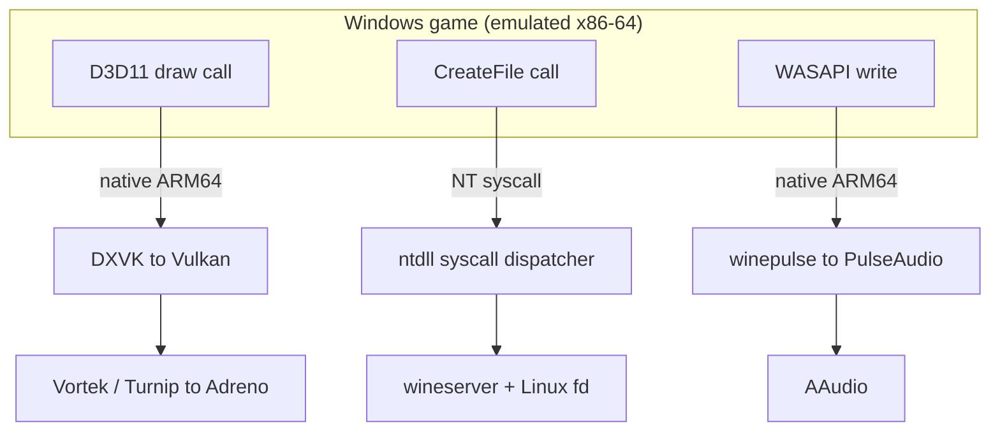

1. **A Direct3D 11 draw call.** The game's `ID3D11DeviceContext::Draw` is an
   x86-64 call (emulated). It enters DXVK, which on ARM64EC is native and builds
   a Vulkan command buffer, then crosses the libc boundary by thunk (Turnip) or
   socket (Vortek) to the Adreno driver, and the result is composited by
   SurfaceFlinger. Almost none of this is emulated; only the original call site
   is.

2. **A `CreateFile` call.** The game asks to open a file. This is a Windows API
   call that becomes an NT system call, funnelled through Wine's
   `__wine_syscall_dispatcher` into `ntdll.so`, which asks wineserver to
   translate the Windows path and hand back a real Linux file descriptor over the
   socket. PRoot or `libredirect` then remaps the path into the rootfs, and the
   Linux `openat` finally lands in the app's private storage. No GPU, no audio,
   entirely different machinery from path 1.

3. **An audio buffer write.** The game's WASAPI write enters `winepulse.drv`
   (native on ARM64EC), which ships the PCM over the PulseAudio socket to the
   in-app server, which writes it into an AAudio stream that reaches the speaker.

Three operations, three completely different paths, and only the parts drawn
inside the emulated box are actually translated instruction by instruction. The
entire art of the stack is keeping that box small.

---

## 64.10 What Android 17 Changes for the Stack

None of the translation projects in this chapter ship inside AOSP, so Android 17
does not "add" a Windows-game runtime. What 17 does is move the *platform floor*
the stack stands on, and three shifts are worth pinning down because each either
helps or constrains a layer above.

### 64.10.1 The Platform Interfaces the Stack Rides On Are Stable

The whole design works because it only ever touches public, stable AOSP surfaces:
the Vulkan loader (`frameworks/native/vulkan/libvulkan/driver.cpp`), the native
window APIs (`frameworks/native/libs/nativewindow/include/android/native_window.h`),
`AHardwareBuffer`, AAudio
(`frameworks/av/media/libaaudio/include/aaudio/AAudio.h`), `ASharedMemory`
(`frameworks/native/include/android/sharedmem.h`), the `android_dlopen_ext`
namespace flags (`bionic/libc/include/android/dlext.h`), and the linker's W^X
rule (`bionic/linker/linker_phdr.cpp`). In Android 17 all of these are present
with the same contracts the earlier sections rely on, which is exactly why a
Winlator-class app keeps working across releases without a platform patch: the
stack invents nothing at the bottom, so it inherits whatever the release's public
Vulkan, audio, and linker surfaces provide.

### 64.10.2 Berberis Is Not This Stack, and 17 Reorganized It

It is easy to assume Android's own binary translator must be involved here. It is
not. Android 17 reorganized **Berberis** (Chapter 19): every module of its
CPU-emulation core was consolidated under a new
`frameworks/libs/binary_translation/cpu_emulation/` directory, with the
three-tier engine (`cpu_emulation/interpreter/`, `cpu_emulation/lite_translator/`,
`cpu_emulation/heavy_optimizer/`) and the tier dispatcher
(`cpu_emulation/translator/`) now siblings under it. But Berberis translates
**riscv64 guest code to x86_64 hosts** (`frameworks/libs/binary_translation/README.md`)
and plugs into ART through the Native Bridge
(`frameworks/libs/binary_translation/native_bridge/`). That is the wrong direction
(riscv64 to x86_64, not x86-64 to AArch64) and the wrong integration point
(in-ART APK code, not a whole Windows process) for running PC games. The 17 reorg
is real and relevant to Chapter 19, but it changes nothing in this chapter: the
x86-64-to-AArch64 translation here is still done entirely by FEX and Box64, which
no AOSP-shipped translator competes with.

### 64.10.3 Where ANGLE Fits, and Where It Does Not

Android's GLES-on-Vulkan translator **ANGLE** (`external/angle/`, Chapter 13) is
the platform's own answer to "express OpenGL ES on a Vulkan-only driver," and it
overlaps conceptually with the Zink and `wined3d`-to-GL paths inside the guest. It
is tempting to call ANGLE "the default" on Android 17, but the EGL loader's own
comment is explicit that it is not the default GLES driver on most devices
(`frameworks/native/opengl/libs/EGL/Loader.cpp:555`); it is opt-in per app or via
system configuration. For this stack the practical point is unchanged: the guest
performs its own GL or D3D translation to Vulkan and reaches the GPU through the
Vulkan loader, so the device's ANGLE setting neither helps nor hinders a Windows
game. The two are parallel solutions to the same shape of problem on opposite
sides of the libc boundary, not a shared path.

---

## 64.11 Try It

These exercises use a checkout of the GameNative source and a device or emulator
with a Winlator-class app installed. The source reading requires nothing but a
clone; the on-device steps assume you have legally installed such an app and a
game you own.

1. **Read the stack off the defaults.** Clone GameNative and open
   `app/src/main/java/com/winlator/container/Container.java` and
   `app/src/main/java/com/winlator/core/DefaultVersion.java`. Write down the
   default emulator, graphics driver, audio driver, DX wrapper, and the pinned
   versions of Wine, DXVK, VKD3D, and Turnip. You have just reconstructed the
   entire default pipeline from two files.

2. **Find the launch command.** Read
   `app/src/main/java/com/winlator/xenvironment/components/GuestProgramLauncherComponent.java`
   and locate where it assembles the `box64 <guest exe>` command, then read
   `BionicProgramLauncherComponent.java` and find where it branches on whether the
   Wine build is ARM64EC. Compare the two launch paths.

3. **Inspect the bundled components.** List `app/src/main/assets/` and identify
   the `.tzst`/`.txz` archives for FEX, Box64, DXVK, and the Vulkan drivers, and
   the `*_download.json` manifests that fetch the rest on demand. Note which
   pieces are in the APK and which are downloaded.

4. **Watch the processes on device.** With the app running a game, use
   `adb shell ps -A` and look for the Wine, wineserver, PulseAudio, and X server
   processes living under the app's UID. Then `adb shell cat /proc/<pid>/maps`
   for the Wine process and observe both the JIT's anonymous executable mappings
   and the rootfs libraries.

5. **See the sockets.** Run `adb shell ls -l /proc/<pid>/fd` on the Wine process
   and find the Unix-domain sockets connecting it to wineserver, the Vulkan
   renderer, and PulseAudio. These are the boundary crossings of 64.4.5 made
   visible.

6. **Explore the prefix.** Locate the container's Wine prefix under the app's
   data directory and examine `drive_c/windows/system32` for the DXVK DLLs that
   overrode Wine's builtin Direct3D, and `user.reg` for the
   `Software\Wine\DllOverrides` entries that put them there.

7. **Confirm the AOSP touchpoints.** In an AOSP checkout, open
   `frameworks/native/vulkan/libvulkan/driver.cpp` at the `LoadDriver` function
   (line 153) and confirm the driver is opened through `android_dlopen_ext` with
   a namespace; this is the public interface the whole graphics stack ultimately
   funnels into.

---

## 64.12 Summary

Running a Windows game on an unrooted ARM Android phone is a stack of
single-purpose translation layers, each bridging one gap between a Windows x86-64
game and the AOSP internals covered in the rest of this book.

| Layer | Problem it solves | Key technology |
|-------|-------------------|----------------|
| GameNative app | orchestration, storefronts, packaging | Pluvia + Winlator graft, GPL-3.0 |
| rootfs (imagefs) | a glibc Linux userland with no root | Ubuntu tree extracted to app storage, entered via PRoot or a bionic loader |
| bionic redirections | glibc software on a `bionic` system | path rewriting, SysV-SHM-over-ashmem, IPC servers |
| FEX / Box64 | x86-64 instructions on AArch64 | dynarec, TSO emulation, thunks vs wrapped libs |
| ARM64EC / WoW64 | emulate only the game | native ARM64 Wine, emulator as a DLL |
| Wine | the Windows API on Linux | PE/Unix split, wineserver, DLL overrides |
| DXVK / VKD3D | Direct3D on a Vulkan GPU | D3D to Vulkan, installed as native DLL overrides |
| Turnip / Vortek | Vulkan to the real Adreno GPU | Mesa driver via thunk, or client/server over a socket |
| PulseAudio | Windows audio to the speaker | in-app audio server, out via AAudio |

The recurring lessons:

1. **Two orthogonal translations.** Instruction-set translation (FEX/Box64) and
   Windows-API translation (Wine) are entirely separate problems; conflating them
   is the most common misunderstanding of how these apps work.

2. **Emulate as little as possible.** Every performance gain in the stack comes
   from moving work out of the emulated box: thunks and wrappers for the GPU
   driver, native ARM64 DXVK, and above all ARM64EC, which leaves only the game's
   own code emulated.

3. **The libc boundary is the hard part.** glibc and `bionic` cannot share a
   process, and the three ways across it (IPC, ABI thunking, or running native on
   `bionic`) shape every design decision in the stack.

4. **It is all standard AOSP underneath.** The Vulkan loader, `ANativeWindow`,
   `AHardwareBuffer`, AAudio, linker namespaces, `ASharedMemory`, and the W^X
   rules are the same platform interfaces any Android app uses. The translation
   stack invents nothing at the bottom; its genius is reaching those public
   interfaces from a Windows game many layers above.

### Key Source Files Reference

| File | Purpose |
|------|---------|
| `bionic/libc/include/android/dlext.h:115` | `ANDROID_DLEXT_USE_NAMESPACE`, loads a driver into a chosen linker namespace |
| `bionic/libc/include/android/dlext.h:80` | `ANDROID_DLEXT_USE_LIBRARY_FD`, loads a library from an fd |
| `bionic/linker/linker_phdr.cpp:1057` | rejects ELF segments that are both writable and executable (W^X) |
| `bionic/libc/include/sys/mman.h:183` | `memfd_create`, backing for anonymous shared memory |
| `frameworks/native/include/android/sharedmem.h:78` | `ASharedMemory_create`, host side of the SysV-SHM redirection |
| `frameworks/native/vulkan/libvulkan/driver.cpp:153` | `LoadDriver`, discovers and opens the device Vulkan driver |
| `frameworks/native/libs/nativewindow/include/android/native_window.h:179` | `ANativeWindow_lock`, CPU presentation path |
| `frameworks/native/libs/nativewindow/include/android/native_window.h:188` | `ANativeWindow_unlockAndPost`, posts a frame to the compositor |
| `frameworks/native/libs/nativewindow/include/android/hardware_buffer.h:479` | `AHardwareBuffer_allocate`, zero-copy GPU presentation buffer |
| `frameworks/av/media/libaaudio/include/aaudio/AAudio.h:1216` | `AAudio_createStreamBuilder`, the audio path's Android sink |
