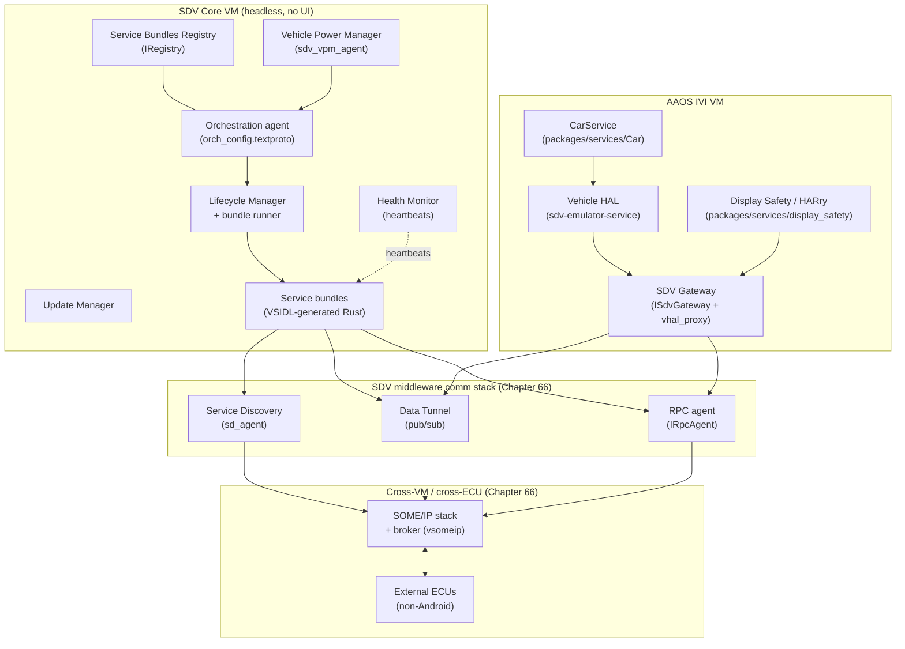
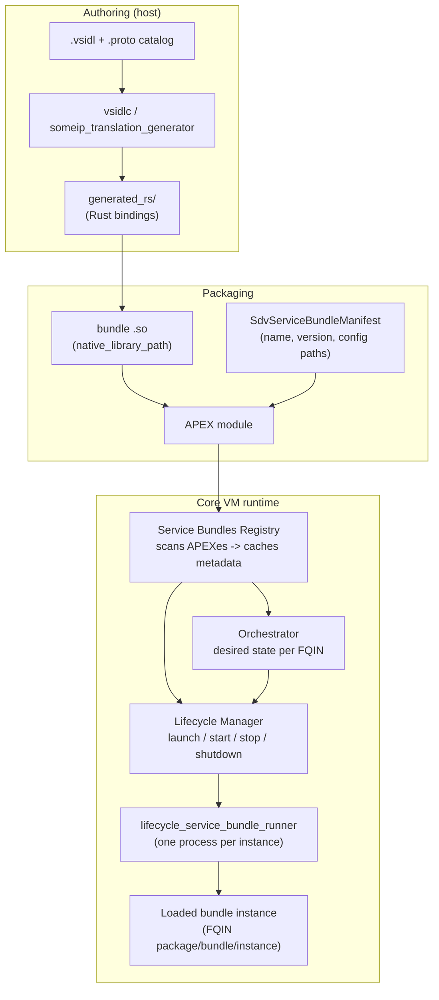
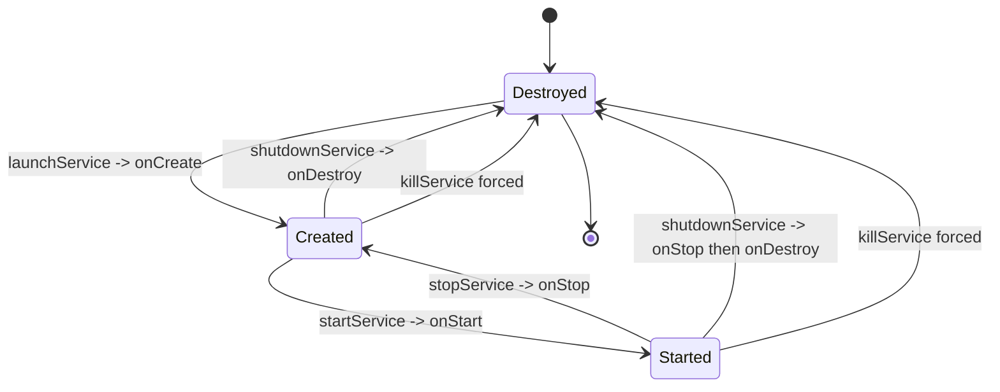
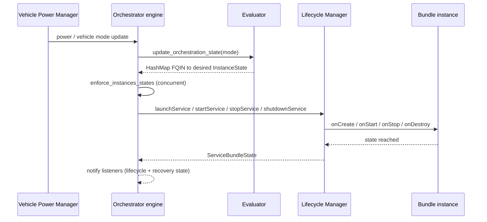
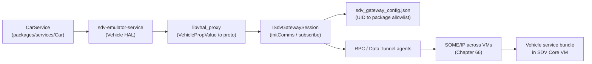

# Chapter 65: Software Defined Vehicle

Android 17's marquee device-support addition is the **Software Defined Vehicle (SDV)** platform: an entire new top-level source tree (`system/software_defined_vehicle/`), a flagship reference device (`device/google/sdv`), a new HAL/AIDL contract package (`hardware/sdv/interfaces`), and an automotive display-safety service (`packages/services/display_safety`). SDV is not "Android in the dashboard" the way Android Automotive OS (AAOS) is. It is a *headless* vehicle operating system: a "Core" VM runs the vehicle's safety- and power-relevant services with no UI at all, and one or more AAOS In-Vehicle Infotainment (IVI) VMs — plus non-Android automotive ECUs — talk to it over a service fabric. The Core VM has no display, no launcher, and no apps in the AAOS sense; it hosts *service bundles*, units of vehicle functionality described in a new interface language and generated to Rust, supervised by a lifecycle manager and an orchestrator that bring bundles up and down as the vehicle changes power and driving state.

This chapter is the architecture overview. It walks the headless Core VM, the service-bundle model and the VSIDL-to-Rust toolchain, the four control-plane agents that supervise bundles (orchestration, lifecycle management, the service-bundles registry, and the health monitor), the update manager, the vehicle power-state manager (vpm), the automotive display-safety runtime, and how an AAOS IVI VM integrates through the SDV Gateway. The wire-level transport — the middleware comm stack, SOME/IP, the VSIDL grammar, and the gateway's network plumbing — is the subject of Chapter 66; this chapter cross-references it rather than duplicating it.

---

## 65.1 What "Software Defined Vehicle" Means Here

### 65.1.1 The Headless Core VM

The defining architectural decision of SDV is that the vehicle's services run in a VM with no user interface. `device/google/sdv/sdv_core_base/sdv_core_base.mk` states it directly in its header comment: "Software-Defined Vehicle (SDV) is a headless vehicle Android OS." The Core VM is Android — it boots `init`, it runs Binder, it uses APEX modules — but it ships none of SystemUI, no launcher, and no AAOS app stack. Its job is to host vehicle *service bundles* and the agents that supervise them.

The Cuttlefish targets make the headlessness concrete. SDV is designed to run as multiple cooperating VMs on one host: a Core VM and one or more IVI VMs. `device/google/sdv/cuttlefish_multi_tenancy/` carries example multi-VM launch configurations that boot several VM instances, each given a distinct `androidboot.sdv.instance_name` via bootconfig and each running with no GPU (`gpu_mode: "none"`) because there is nothing to draw. The VMs reach each other over a virtual network, and SDV-RPC traffic is pinned to a dedicated VLAN named by the `androidboot.sdv.rpc.interface` bootconfig property (default `sdv_rpc`), configured through the `SDV_RPC_INTERFACE` build variable (`device/google/sdv/sdv_core_base/BoardConfig.mk`; `system/software_defined_vehicle/sdv_gateway/README.md`).

### 65.1.2 The Four Trees

SDV is deliberately spread across four locations in the tree, each with a distinct role:

- `system/software_defined_vehicle/` — the platform itself: 17 subrepos holding the agents, the middleware comm stack, the VSIDL toolchain, and shared libraries. This is where the running code lives.
- `device/google/sdv` — the reference device. It composes the platform code into lunch targets (`sdv_core_base`, `sdv_ivi_base`, and friends) and decides which agents and APEXes land in which VM.
- `hardware/sdv/interfaces` — the stable contract package. Every cross-process boundary that needs version stability (the gateway, the registry, the lifecycle internal interface, vpm, telemetry, the RPC agent) has its `@VintfStability` AIDL frozen here under `aidl_api/`.
- `packages/services/display_safety` — the automotive Driver-UI runtime ("HARry") and its safety monitor, which runs on the IVI side.

This chapter treats `system/software_defined_vehicle/` and the device/HAL composition; Chapter 66 treats the middleware and SOME/IP subrepos in depth.

### 65.1.3 The Layering

The high-level picture is a vehicle-service fabric beneath and beside AAOS. Bundles run in the Core VM; the comm stack carries their traffic; SOME/IP bridges across VMs and ECUs; and an AAOS IVI VM reaches the fabric through the SDV Gateway.

The SDV platform stack and the seam to AAOS

---

## 65.2 The Service Bundle Model

### 65.2.1 What a Service Bundle Is

The unit of deployment in the Core VM is the **service bundle**, not the Android app or the standalone daemon. A service bundle is a shared library — VSIDL-generated Rust compiled to a `.so` — that the lifecycle manager loads into a host process and drives through a fixed lifecycle. Bundles ship inside APEX modules; the APEX carries the bundle's native library plus a manifest entry describing where everything lives.

The metadata contract is the `SdvServiceBundleManifest` proto (`system/software_defined_vehicle/service_bundles_registry/proto/sdv_service_bundles_manifest.proto`). Each entry carries the bundle `name`, a `version_number` and `version_name`, the `native_library_path` (relative to the APEX root), and a set of optional config paths: `orchestration_config_path`, `scheduling_config_path`, `health_config_path`, `diagnostics_config_path`, `user_config_path`, `vsidl_schemas_path`, `external_protocol_mapping_path` (the SOME/IP mapping), and `authorization_policy_path` (which superseded the deprecated `access_control_list_policy_path`). The proto reserves three field-number ranges by audience — low numbers for bundle execution, a middle range for the SDV agents, and a high range for OEM custom metadata — so that a bundle's manifest never collides between layers.

### 65.2.2 VSIDL Generates Rust

Service interfaces are not written in AIDL. They are described in `.vsidl` service-bundle definitions plus `.proto` message schemas, and the `vsidlc` compiler (`system/software_defined_vehicle/vsidl/vsidlc`) walks the catalog and emits Rust middleware bindings into `generated_rs/` directories. The companion `someip_translation_generator` emits the SOME/IP-to-proto translation code, and `vsidl_rc_generator` emits resource-control glue. All three are host tools installed by the Core target (`device/google/sdv/sdv_core_base/sdv_packages_core_services.mk` lists `vsidlc`, `vsidl_rc_generator`, and `someip_translation_generator` under `SDV_CORE_SERVICES_HOST_PACKAGES`). On-device, the `sdv_vsidl_provider_agent` (APEX `com.android.sdv.vsidl_provider`) serves bundle VSIDL schemas at runtime. This is the SDV equivalent of AIDL stub generation, and the full grammar and transport mapping belong to Chapter 66.

A concrete `.vsidl` makes the shape clear. The vehicle power manager's bundle definition (`system/software_defined_vehicle/vpm/stable/vsidl/vpm.vsidl`) declares a `service_bundle` named `VpmSystemServiceBundle` with three interface slots: a `server` exporting the RPC service `com.android.sdv.vpm.VpmSystemService`, a `client` of `com.android.sdv.vpm.client.PowerNotificationService`, and a Data Tunnel `publisher` of `com.android.sdv.vpm.vehicle.VehicleStateChange`. A bundle therefore declares, in one place, what it serves over RPC, what it consumes, and what it publishes on the pub/sub fabric.

### 65.2.3 Fully Qualified Instance Names

Bundles can run in multiple instances, so SDV identifies a running unit by a **Fully Qualified Instance Name (FQIN)**. In the orchestrator's common crate (`system/software_defined_vehicle/orchestration/common/src/fqin.rs`) an FQIN is three fields — `package_name`, `service_bundle_name`, and `instance_name` — formatted as `package/bundle/instance`. The orchestrator's FQIN converts to the lifecycle manager's `ServiceFqin` representation, which additionally carries a VM name (`local-vm` for the current VM). The FQIN is the key the control-plane agents use everywhere: the lifecycle manager keys its process table by it, the orchestrator keys its desired-state map by it, and the health monitor keys heartbeat tracking by it.

The service-bundle model, from APEX to running instance

---

## 65.3 The Service Bundles Registry

The first control-plane agent in the boot order is the **Service Bundles Registry**. Its README (`system/software_defined_vehicle/service_bundles_registry/README.md`) gives it three jobs: scan, detect, and cache the metadata of locally available SDV service bundles; verify their security restrictions; and provide that cached metadata to a limited set of SDV agents and automotive services. It is the catalog the rest of the control plane reads from — the orchestrator and the lifecycle manager both ask the registry "what bundles exist and where are their config files" before they can do anything.

The registry's public interface is the stable, `@VintfStability` `IRegistry.aidl` (`hardware/sdv/interfaces/service_bundles_registry/google/sdv/service_bundles_registry/IRegistry.aidl`). The frozen contract is small: a single method `getAvailableServiceBundlesMetadata()` returning a `List<ServiceBundleMetadata>`. The interface is currently at frozen API version 3 (the versioned snapshots live under `hardware/sdv/interfaces/service_bundles_registry/aidl_api/google.sdv.service_bundles_registry/`, with `3/` being the current frozen version). The `ServiceBundleMetadata` parcelable mirrors the manifest proto: it carries `name`, `versionNumber`, `versionName`, `packageName`, `nativeLibraryPath`, and the nullable config-path fields (`orchestrationConfigPath`, `healthConfigPath`, `authorizationPolicyPath`, `vsidlSchemasPath`, and the rest), plus a `customMetadata` array of `KeyValuePair`.

The agent binary is `sdv_service_bundles_registry_agent`, installed by the Core target and registered as a system service rather than shipped in its own APEX. When the registry has finished its scan and is ready to serve, it registers the binder service descriptor `google.sdv.service_bundles_registry.IRegistry/default` and sets the system property `ro.sdv.sbr.state.ready` to `true` — a readiness signal the other agents wait on (`system/software_defined_vehicle/service_bundles_registry/src/registry/binder.rs`).

---

## 65.4 Lifecycle Management

### 65.4.1 The Lifecycle Manager's Job

The **Lifecycle Manager** (`system/software_defined_vehicle/lifecycle_management/`) is the agent that actually launches, starts, stops, and kills bundle processes. Its README describes it as the central dispatcher through which SDV agents control service-bundle lifecycles. Other agents — chiefly the orchestrator — drive it through the `ILifecycleManager` AIDL (`system/software_defined_vehicle/lifecycle_management/aidl/google/sdv/lifecycle/ILifecycleManager.aidl`):

- `launchService(ServiceFqin)` — bring a bundle to the CREATED state (loaded, constructed, but not yet running).
- `startService(ServiceFqin)` — transition CREATED to STARTED (running).
- `stopService(ServiceFqin)` — transition STARTED back to CREATED (stopped but still loaded).
- `shutdownService(ServiceFqin)` — gracefully bring a bundle to DESTROYED.
- `killService(ServiceFqin)` — forcefully stop a bundle.
- `getServiceBundleState(ServiceFqin)` — return the current `IServiceBundleState`.

The two persistent states a loaded bundle can hold are defined in `IServiceBundleState.aidl` as an int-backed enum: `CREATED = 1` (reached after `onCreate` or after `onStop`) and `STARTED = 2` (reached after `onStart`). Error returns use the `ResponseCode` enum (`SERVICE_NOT_FOUND`, `PERMISSION_DENIED`, `OPERATION_FAILED`, `VALUE_CORRUPTED`, `INVALID_ARGUMENT`, `INTERNAL_ERROR`).

### 65.4.2 The Bundle Lifecycle and the Runner

A bundle's own code sees the lifecycle through the `IService` interface, which is frozen in the stable HAL package (`hardware/sdv/interfaces/lifecycle_management/aidl/google/sdv/lifecycle/internal/IService.aidl`). It is four callbacks that mirror a native constructor/destructor pair around a start/stop pair: `onCreate()`, `onStart()`, `onStop()`, `onDestroy()`. `onCreate` and `onDestroy` are guaranteed to be called exactly once; `onStart`/`onStop` can cycle. The matching `IServiceManager` (same package) is how a bundle process registers itself back with the manager: `registerService(ServiceFqin, IService)`, `unregisterService(ServiceFqin)`, and `getPid()`.

The mechanism that turns a bundle library into a running process is the `lifecycle_service_bundle_runner`. The lifecycle agent does not load bundle code into its own address space; instead, for each instance it spawns a fresh `lifecycle_service_bundle_runner` process, passing the bundle's native-library path and the FQIN as arguments (`system/software_defined_vehicle/lifecycle_management/service_bundle_runner/src/main.rs`). The runner dynamically loads the bundle `.so` from its APEX, starts a binder thread pool, registers an `IService` back with the manager via `IServiceManager`, and then runs the bundle's executor on its main thread. When the agent launches an instance it allocates a per-bundle user ID, creates the bundle's data directory, applies the SELinux domain, spawns the runner, and waits (with a registration timeout) for the runner to register before considering the launch successful (`system/software_defined_vehicle/lifecycle_management/src/lifecycle_manager/agent.rs`). Isolation is therefore per instance: one process, one UID, one SELinux context per running bundle. The agent binary `sdv_lifecycle_agent` and the `lifecycle_service_bundle_runner` are both system binaries installed by the Core target.

The service-bundle lifecycle state machine

---

## 65.5 Orchestration

### 65.5.1 Desired State, Not Imperative Control

The **Orchestrator** is the brain of the Core VM control plane. Where the lifecycle manager is imperative ("launch this, start that"), the orchestrator is declarative: it holds a *desired* lifecycle state for every bundle instance, recomputes that desired state whenever the vehicle changes mode, and drives the lifecycle manager until reality matches. Its README (`system/software_defined_vehicle/orchestration/README.md`) calls it "an SDV agent responsible for managing the lifecycle of service bundles based on orchestrator configurations." The binary is `sdv_orchestration_agent`, shipped in the APEX `com.android.sdv.orchestrator`.

At startup the orchestrator's `Agent::new()` (`system/software_defined_vehicle/orchestration/engine/src/agent.rs`) reads a VM-level config path from the system property `persist.sdv.orchestrator_config_path`, fetches per-bundle orchestration configs from the registry, builds an `Evaluator` from the combined configuration, restores the previously persisted modes from backup, and constructs the `OrchestratorEngine`. The engine sets `ro.sdv.orchestrator.state.ready` once it is up.

### 65.5.2 Modes, Conditions, and the Evaluator

Orchestration configuration is textproto. The schema lives in `system/software_defined_vehicle/orchestration/distributed_config/src/protos/` as `vm_config.proto`, `service_bundle_config.proto`, and the shared `common.proto`. A `ServiceBundleConfig` lists the bundle's instances and a set of `InstancesStateConfiguration` entries; each entry pairs an optional `condition` with the instance states it wants (`created`, `started`, `destroyed`). The condition is a boolean expression over the system's current modes — `common.proto` defines `Condition` as a oneof of `power_state`, `vehicle_state`, `custom_state`, and the logical operators `not`/`and`/`or`. The Rust side mirrors this with a `Condition` enum (`distributed_config/src/condition.rs`) carrying `State { mode, state }`, `And`, `Or`, `Not`, and `Empty` (always true), evaluated with three-valued logic so partially-undefined conditions behave sanely.

A **mode** is what the orchestrator tracks (`orchestration/common/src/mode.rs`): `Power`, `Vehicle`, and OEM-defined `Custom(String)`. When a mode changes, the `Evaluator` updates its orchestration state (with timestamp validation so stale updates are dropped) and evaluates every bundle's conditions to produce a fresh `HashMap<Fqin, InstanceState>` of what each instance should be. Where several conditions apply to one instance, the states merge by precedence: `Destroyed` beats `Started` beats `Created` (`orchestration/common/src/instance_state.rs`). The "config can live VM-wide or per-bundle" design is why this subtree is named *distributed* config (`orchestration/distributed_config/README.md`): a bundle ships its own slice of orchestration policy in its APEX, and the orchestrator stitches the slices together at startup.

### 65.5.3 Enforcement, Crashes, and Retry

The engine's `enforce_instances_states()` (`orchestration/engine/src/engine.rs`) reconciles desired state against reality, calling the lifecycle manager concurrently across instances up to a thread cap (default 12). Each instance is managed by an `InstanceManager` (`orchestration/engine/src/instance_manager.rs`) that tracks the last known state and classifies failures as transient (retry), persistent (kill, then retry), or permanent (give up). It is bounded by a `RetryConfiguration` (`orchestration/common/src/retry_configuration.rs`) carrying `max_retries`.

The orchestrator publishes instance state outward through `IOrchestrationAgent.aidl`: a subscriber registers an `IServiceBundleInstanceStateChangeListener`, and the orchestrator calls back `onServiceBundleInstanceStateChanged(fqin, newRecoveryState, expectedLifecycleState)`. Two enums carry that state. `ServiceBundleInstanceLifecycleState` is the *intent* — `STARTED`, `CREATED`, or `DESTROYED`. `ServiceBundleInstanceRecoveryState` is the *health* — `OPERATIONAL` (reached its required state), `RETRYING` (recovering from a crash or a failed transition), or `RETRY_FAILED` (the orchestrator has given up). Because the lifecycle manager can itself crash, the orchestrator holds its connection through a `PersistentBinderConnection` (`orchestration/persistent_binder/lib.rs`) that relinks death notifications and reconnects transparently; after a lifecycle-manager crash the engine processes a `Recovery` event (`orchestration/common/src/mode.rs`) to re-enforce every instance.

How the orchestrator reconciles desired state on a mode change

---

## 65.6 Health Monitoring

The **Health Monitor** (`system/software_defined_vehicle/health_monitor/`) is, per its README, "a VM-internal service which is responsible for monitoring heartbeats from critical services and generating VM health report." It is the watchdog tier beneath the orchestrator: the orchestrator decides what *should* run, the health monitor notices when something that is running has gone silent. The binary is `sdv_health_monitor`, shipped in the APEX `com.android.sdv.health`.

Bundles opt into monitoring by registering a heartbeat configuration rather than being watched implicitly. The monitor's registration path (`system/software_defined_vehicle/health_monitor/src/hb_explicit_registration.rs`) takes a `RegisterConfiguration` keyed by FQIN, and the configuration itself (`hb_config.rs`) is four numbers: `initial_delay_ms` (grace period between start and the first expected heartbeat), `period_ms` (how often the bundle should beat), `num_periods` (how many beats may be missed before the bundle is considered unhealthy), and `task_duration_ms` (the expected length of the bundle's work). A bundle is marked unhealthy when no heartbeat has arrived within `period_ms * num_periods + task_duration_ms`. The monitor tracks each bundle through a small state machine (`sb_recovery_monitor.rs`): `Normal` while healthy, `Recovering` once recovery has been triggered, and `FailedRecovery` if recovery did not restore it. The health verdict feeds back into the orchestrator's recovery/retry handling, so a bundle that stops beating is restarted by the same machinery that restarts one that crashed.

---

## 65.7 Vehicle Power-State Manager (vpm)

### 65.7.1 Power and Vehicle States

The **Vehicle Power-state Manager (vpm)** is the agent that owns the VM's relationship to the vehicle's power and driving state, and it is the upstream that drives the orchestrator's `Power` and `Vehicle` modes. The agent binary is `sdv_vpm_agent` (`system/software_defined_vehicle/vpm/android/sdv/vpm/Android.bp`), packaged in the APEX `com.android.sdv.vpm`.

vpm's state vocabulary is defined as VSIDL protos. The power side (`system/software_defined_vehicle/vpm/stable/vsidl/power.proto`) defines `PowerStateReport` with a full suspend/resume lifecycle: `POWER_OFF_EXIT` (cold boot), `SUSPEND_TO_RAM_EXIT` / `SUSPEND_TO_DISK_EXIT` (resume), `ON` (running normally), the `_ENTER` states that begin a shutdown or suspend, `WAIT_FOR_FINISH` (the VM has done initial cleanup and is waiting for the OEM's go/cancel signal), `SHUTDOWN_CANCELLED`, and the `_POST_FINISH` states where SDV agents do their final cleanup before the platform powers off or suspends. The comments are precise about who may rely on whom in each phase — for instance, during `POWER_OFF_ENTER` agents must stay up because OEM applications may still need them, but during `POWER_OFF_POST_FINISH` everyone cleans up.

The vehicle side (`system/software_defined_vehicle/vpm/stable/vsidl/vehicle.proto`) defines `VpmVehicleState` as a ladder of vehicle activity: `LOW_POWER` (car off from the user's view but the power-control unit still sees it), `SOFTWARE_UPDATE`, `PARK` (a few ECUs powered for a specific activity), `LIFE_ON_BOARD` (comfort ECUs, customer present), `VEHICLE_ON` (engine ECUs powered, driving not yet possible), and `TRACTION_ON` (driving possible). These are the values an orchestration `condition` matches against when it gates a bundle by `vehicle_state`.

### 65.7.2 The OEM-Facing and Client-Facing Interfaces

vpm exposes two faces. The OEM-facing RPC service `VpmSystemService` lets the OEM's platform integration set the vehicle state and request power transitions (the requests are `TURN_ON`, `PREPARE_SHUTDOWN`, `CANCEL_SHUTDOWN`, `FINISH_SHUTDOWN`, with a `ShutdownType` of `POWER_OFF`, `SUSPEND_TO_RAM`, or `SUSPEND_TO_DISK`). After a successful vehicle-state change, vpm publishes the new state on the Data Tunnel topic `com.android.sdv.vpm.vehicle.VehicleStateChange` so any bundle can react. The bundle-facing client side is the stable HAL AIDL: `IPowerStateClientApi.aidl` (`hardware/sdv/interfaces/vehicle_power_manager/aidl/google/sdv/vpm/IPowerStateClientApi.aidl`) lets a client `subscribeToPowerStateReport(IPowerStateReportListener)` and receive `PowerStateReport` callbacks. This is the path by which the orchestrator (and any power-aware bundle) learns of power transitions and recomputes desired state.

---

## 65.8 Update Manager

The **Update Manager** (`system/software_defined_vehicle/update_manager/`) handles both system (partition) updates and service-bundle (APEX) updates for the VM. The agent binary is `sdv_update_manager_agent`, shipped in the APEX `com.android.sdv.update_manager`. Its interfaces are VSIDL service definitions (`update_manager/catalog/update_manager_agent.vsidl` and `update_manager_client.vsidl`) exposing an `UpdateManagerService` and a client-side `UpdateManagerListenerService` for status callbacks.

The update model is a small state machine over a payload. The payload proto (`update_manager/catalog/payload.proto`) distinguishes a `SystemUpdatePayload` (a path to an OTA image, with optional offset/size) from a `ServiceBundleUpdatePayload` (one or more APEX paths plus a `boot_attempts` count for retry). The service proto (`update_manager/catalog/update_manager_service.proto`) drives them through `Prepare`, `Activate`, `Commit`, and `Rollback`, with `Suspend`/`Resume` available for system updates and `UninstallApex` for removing a bundle. Crucially, the update path is power-aware: the service proto documents that if the Update Manager is in the `PREPARE` state and vpm signals the VM is suspending or powering off, the update is suspended — the same power modes that gate bundle lifecycles also gate the update flow.

---

## 65.9 The Platform Layer and Shared Common Code

### 65.9.1 platform

The `system/software_defined_vehicle/platform/` tree is the native foundation the agents and bundles build on. Its README describes it as "native libraries and wrappers ... Log & Trace, Time Sync and others," and the subtree carries those wrappers in C, C++, and Rust flavors. The most load-bearing is `platform/status/`, which defines the SDV error/status API: `libsdv_status` (a C ABI-stable core), `libsdv_status_cpp` (the C++ `SdvStatus`/`SdvStatusOr` wrappers), and `libsdv_status_rs` (the Rust `SdvStatus`/`SdvResult` types) — the result type every agent returns. Alongside it the platform tree carries logging and tracing libraries, a `power` library, open-DICE initialization, and `adbd_auth` glue, giving every SDV component the same observability, error-handling, and attestation primitives regardless of which language it is written in.

### 65.9.2 common

The `system/software_defined_vehicle/common/` tree holds shared infrastructure. The piece worth naming is `common/lib_dump/`, a thin wrapper around `libbinder_rust` that exposes the `ISdvAgent.aidl` interface (`common/lib_dump/aidl/google/sdv/agent/ISdvAgent.aidl`) so every agent gets uniform `dumpsys` support — a single, simple interface that the registry, orchestrator, lifecycle manager, and the rest implement so an operator can dump any agent the same way. The tree also carries shared protos, vendored third-party code, and the `performance_image_generator` used to build the SDV "performance" image variants (`sdv_core_perf_cf`).

---

## 65.10 Display Safety: the HARry Driver-UI Runtime

### 65.10.1 What Display Safety Is

On the IVI side, `packages/services/display_safety` implements the automotive Driver-UI runtime and its safety enforcement. It is a large Rust workspace (the root `packages/services/display_safety/Cargo.toml` enumerates dozens of crates) split into three tiers: a `framework/` of reusable rendering, audio, layout, and monitoring crates; a `reference/` implementation (`harry-app`, the `safety-monitor`, and ADAS visualization); and a `service/` layer that bridges the UI to the SDV fabric. The motivation is regulatory: a driver-facing display must not show distracting or non-compliant content while the vehicle is in motion, and the cluster/Driver-UI must render deterministically. The framework's graphics path wraps the Impeller engine (`framework/graphics/impeller`), drives layout through a Taffy-based engine (`framework/har-layout`), and instruments itself with a performance-monitoring crate (`framework/har-monitoring`).

### 65.10.2 The Safety Monitor

The distraction-and-compliance enforcement lives in `packages/services/display_safety/reference/safety-monitor`, which builds the `har_safety_monitor` binary. It captures the rendered screen, takes vehicle data over gRPC, and runs a set of pluggable algorithms over the result — a static-pixel check, a TFLite inference path for ML-based classification, and correlation/computer-vision filters — to decide whether what is on screen is safe for the current vehicle state, issuing verdicts back over a gRPC control interface. It is, in effect, an independent referee watching the Driver-UI's output.

### 65.10.3 The SDV Service Bundle Bridge

The seam between this IVI-side Rust runtime and the SDV fabric is `packages/services/display_safety/service/har-sdv-service`, which builds `libhar_sdv_service_bundle` — an SDV service bundle. It depends on the SDV middleware (`libsdv_comms`, the generated SDV comms code) on one side and on the gRPC services (`libhar_grpc_services`, generated from `vehicledata.proto` and `driverui.proto`) on the other, so it publishes vehicle data and serves the Driver-UI over gRPC *through* the SDV middleware. Vehicle data flows in from a publisher service bundle (`service/vehicledata/`), through the SDV fabric, into the HARry app and the safety monitor.

The whole runtime ships as APEXes built only for SDV/display-safety products: `com.google.display_safety.har` carries the `harry_app`, the `har_safety_monitor`, and the rendering assets, while `com.sdv.google.display_safety.services_bundle.apex` carries the service-bundle `.so`s and their orchestration/ACL configs. The product wiring lives in `device/google/sdv_display_safety`, whose makefiles (`sdv_harry_common.mk`, `sdv_ivi_cf_ds.mk`, `sdv_ivi_arm64_ds.mk`, `sdv_media_har_cf.mk`) layer the display-safety stack onto the IVI and media products and pull in the AAOS DriverUI app from `packages/services/Car`.

---

## 65.11 Integrating AAOS Through the SDV Gateway

### 65.11.1 The Gateway as the IVI's Door to the Fabric

The AAOS IVI VM is a full Android Automotive image; it is not built from SDV-aware code top to bottom. So how does CarService, or a Vehicle HAL service, reach vehicle data that physically lives in another VM? Through the **SDV Gateway**. The gateway (`system/software_defined_vehicle/sdv_gateway/`, contract in `hardware/sdv/interfaces/sdv_gateway/`) is a `@VintfStability` AIDL service that runs on the IVI VM and gives non-SDV-aware native and Java clients a controlled entry point into the comm stack.

The entry interface `ISdvGateway.aidl` is intentionally tiny — `getVersion()` and `createSession()` — and all the work happens on the returned `ISdvGatewaySession`. A session is per-process and isolated; through it a client calls `initComms(InitCommsParams)` to bring up bidirectional communication with remote SDV services, then `registerRpcServer(...)` / `findRpcServerByName(...)` to expose or locate RPC servers in Service Discovery, and `createPublication(...)` / `subscribeToPublicationByName(...)` to use the Data Tunnel pub/sub. The session also exposes the calling app's `ServiceIdentity`, an authorization service, and handles to the underlying Service Discovery and Data Tunnel agents. In other words, the gateway is the IVI-side adaptor that turns "I am an ordinary Android service" into "I am a participant in the SDV fabric" — without the IVI client linking the full SDV middleware.

### 65.11.2 Gating: the Gateway Config

Because the gateway hands ordinary Android processes the keys to the vehicle fabric, access is allowlisted. The gateway requires a config file installed at `/vendor/etc/sdv_gateway_config.json` that declares, per process UID, which SDV package names (the second element of the FQIN) that UID's native service is permitted to use when calling `initComms` (`system/software_defined_vehicle/sdv_gateway/README.md`). The format maps a UID to an array of allowed package names — for example a UID `2942` allowed to use `com.oemspecific.vhal`; a UID of `-1` grants a package name to all UIDs. The README recommends defining unique AIDs for the gateway's native clients and restricting each to only the package names it needs. An empty config blocks every native application from using the gateway. The reference config (`device/google/sdv/sdv_ivi_base/sdv_gateway_config.json`) ships with only the propagation flags (`propagate_rpc_network_changes_to_data_tunnel`, `propagate_rpc_network_changes_to_service_discovery`, both `false`), meaning the reference image's separate VLANs for RPC, Service Discovery, and Data Tunnel are kept independent.

### 65.11.3 VHAL Proxy: Vehicle Properties Across VMs

The concrete CarService integration is the Vehicle HAL. On the IVI VM the SDV products wire a SDV-specific VHAL — `device/google/sdv/sdv_ivi_cf/sdv_ivi_cf.mk` sets `LOCAL_VHAL_PRODUCT_PACKAGE := android.hardware.automotive.vehicle@V1-sdv-emulator-service`. That VHAL uses the gateway's **vhal_proxy** library (`system/software_defined_vehicle/sdv_gateway/vhal_proxy/libvhal_proxy`). The `VhalProxy` class reads and writes Android `VehiclePropValue`s by translating them to and from SDV proto messages and routing them over the gateway: `ReadMessages`/`WriteMessages` move properties, `Subscribe`/`Unsubscribe` register for incoming updates, and the proxy's config (a JSON of protobuf descriptors and property-to-service-unit mappings) decides which property maps to which SDV publication and whether each is an `ACTION_SUBSCRIBE` or `ACTION_PUBLISH`. CarService, sitting above the VHAL exactly as it does on a normal automotive build, is therefore unaware that the vehicle property it reads originated in a service bundle in the Core VM: the gateway and vhal_proxy make the cross-VM hop invisible.

The IVI's SDV-facing services are installed by `device/google/sdv/sdv_ivi_base/sdv_packages_ivi_services.mk` (the gateway, `libvhal_proxy`, the gateway networking service, and the SDV IVI runtime) and started by `device/google/sdv/sdv_ivi_base/sdv.agents.rc`, which brings up the gateway, Service Discovery, and RPC agents in order once the SDV network is ready. The transport beneath them — RPC, Data Tunnel, SOME/IP across VMs and to external ECUs — is the subject of Chapter 66.

How a CarService VHAL read reaches a Core VM service bundle

---

## 65.12 Composing It All: the Reference Device

`device/google/sdv` ties the platform into buildable products. OEM products are meant to inherit one SDV "base" target plus a vendor target (`device/google/sdv/README.md`). The bases are `sdv_base` (comm stack only), `sdv_core_base` (the full set of Core services), `sdv_media_base` (Core plus media APIs), and `sdv_ivi_base` (an AAOS IVI capable of talking to SDV services on other VMs). The canonical "what runs in the Core VM" list is `device/google/sdv/sdv_core_base/sdv_packages_core_services.mk`: the lifecycle client libraries, `orch_config.textproto`, `sdv_lifecycle_agent`, `sdv_orchestration_agent`, `sdv_service_bundles_registry_agent`, `lifecycle_service_bundle_runner`, `sdv_someip_broker_agent_comms`, `sdv_update_manager_agent`, `sdv_health_monitor`, `sdv_vsidl_provider_agent`, the comm-stack agents (`dt_agent`, `rpcagent`, `sdv_sd_agent`), and the matching APEXes (`com.android.sdv.health`, `com.android.sdv.orchestrator`, `com.android.sdv.update_manager`, `com.android.sdv.vsidl_provider`, `com.android.sdv.dt`). The same file demands a SOME/IP broker config and warns if no SOME/IP agent is installed, because a Core VM with no transport agent cannot talk to anything.

The sample lunch targets (`device/google/sdv/AndroidProducts.mk`) are the Cuttlefish and ARM64 instances of these bases: `sdv_core_cf`, `sdv_core_perf_cf`, `sdv_core_tiny_cf`, `sdv_ivi_cf`, `sdv_media_cf`, `sdv_media_har_cf`, and their `*_arm64` peers. Booting a Core VM plus an IVI VM together — as `device/google/sdv/cuttlefish_multi_tenancy/` configures — is the smallest end-to-end SDV system: a headless Core hosting bundles, an AAOS IVI reaching them through the gateway, and the comm fabric between.

---

## 65.13 Try It

These exercises use the AOSP 17 source tree; none require building a vehicle. Run them from the root of a synced `android17-release` checkout.

1. **List the Core VM's agents.** Open `device/google/sdv/sdv_core_base/sdv_packages_core_services.mk` and map each `SDV_CORE_SERVICES_PACKAGES` entry to a section of this chapter. Which entries are agents, which are APEXes, and which are host build tools?

2. **Read a real service-bundle definition.** Open `system/software_defined_vehicle/vpm/stable/vsidl/vpm.vsidl`. Identify the bundle's `server`, `client`, and `publisher` slots. Then open `system/software_defined_vehicle/vpm/stable/vsidl/power.proto` and `vehicle.proto` and list the `PowerStateReport` and `VpmVehicleState` enum values. Which of these would an orchestration `condition` match against?

3. **Trace the lifecycle contract.** Read `system/software_defined_vehicle/lifecycle_management/aidl/google/sdv/lifecycle/ILifecycleManager.aidl` and `hardware/sdv/interfaces/lifecycle_management/aidl/google/sdv/lifecycle/internal/IService.aidl`. Match each `ILifecycleManager` method (`launchService`, `startService`, `stopService`, `shutdownService`) to the `IService` callback it triggers (`onCreate`, `onStart`, `onStop`, `onDestroy`).

4. **Inspect the orchestration config schema.** Open `system/software_defined_vehicle/orchestration/distributed_config/src/protos/service_bundle_config.proto` and `common.proto`. How does an `InstancesStateConfiguration` pair a `condition` with desired instance states? What are the three logical operators a `Condition` can use?

5. **Find the frozen registry API.** List `hardware/sdv/interfaces/service_bundles_registry/aidl_api/google.sdv.service_bundles_registry/` and confirm the current frozen version. Open the version-3 `IRegistry.aidl` and confirm it exposes only `getAvailableServiceBundlesMetadata()`.

6. **Read the gateway allowlist.** Open `system/software_defined_vehicle/sdv_gateway/README.md` and `device/google/sdv/sdv_ivi_base/sdv_gateway_config.json`. Explain what `allowed_native_packagename` gates, and why a UID of `-1` is a security risk worth avoiding.

7. **Find the display-safety bundle.** In `packages/services/display_safety/service/har-sdv-service/Android.bp`, find the `libhar_sdv_service_bundle` module and list its dependencies. Which dependency is the SDV middleware, and which is the gRPC service layer?

---

## Summary

- **SDV is a headless vehicle OS.** The Core VM runs Android with no UI (`device/google/sdv/sdv_core_base/sdv_core_base.mk`), hosting *service bundles* and the agents that supervise them, while AAOS IVI VMs and external ECUs talk to it over a service fabric.
- **The unit of deployment is the service bundle**, a VSIDL-generated Rust `.so` shipped in an APEX with an `SdvServiceBundleManifest` entry, identified at runtime by a Fully Qualified Instance Name (`package/bundle/instance`).
- **VSIDL replaces AIDL for bundle interfaces.** `vsidlc` and its companions generate Rust middleware bindings and SOME/IP translation from `.vsidl` + `.proto` catalogs (transport detail in Chapter 66).
- **Four control-plane agents supervise bundles.** The Service Bundles Registry (`IRegistry`, frozen at v3) catalogs them; the Lifecycle Manager (`ILifecycleManager` + the `IService` callbacks, via `lifecycle_service_bundle_runner` processes) launches/starts/stops them; the Orchestrator holds a *desired* state per FQIN and reconciles it on every mode change with retry/recovery semantics; the Health Monitor watches per-bundle heartbeats and feeds failures back into recovery.
- **vpm drives the modes.** The vehicle power-state manager (`sdv_vpm_agent`) defines the `PowerStateReport` and `VpmVehicleState` ladders and publishes transitions, which are exactly what orchestration conditions match against; the Update Manager is power-aware in the same way.
- **AAOS integrates through the SDV Gateway.** `ISdvGateway`/`ISdvGatewaySession` give ordinary IVI native/Java clients a UID-allowlisted door into the fabric; `libvhal_proxy` makes a Core-VM vehicle property look like an ordinary VHAL property to CarService.
- **Display safety (HARry)** is an IVI-side Rust runtime whose `libhar_sdv_service_bundle` joins the SDV fabric, with a `har_safety_monitor` enforcing distraction/compliance constraints, shipped as SDV-only APEXes.

### Key Source Files Reference

| File | Purpose |
|------|---------|
| `device/google/sdv/sdv_core_base/sdv_packages_core_services.mk` | Canonical list of agents/APEXes installed in the Core VM |
| `device/google/sdv/AndroidProducts.mk` | SDV lunch targets (Core/IVI/Media, cf and arm64) |
| `device/google/sdv/sdv_core_base/sdv_core_base.mk` | Declares SDV a headless vehicle Android OS |
| `system/software_defined_vehicle/service_bundles_registry/proto/sdv_service_bundles_manifest.proto` | Service-bundle manifest schema |
| `hardware/sdv/interfaces/service_bundles_registry/google/sdv/service_bundles_registry/IRegistry.aidl` | Registry stable AIDL (frozen v3) |
| `system/software_defined_vehicle/lifecycle_management/aidl/google/sdv/lifecycle/ILifecycleManager.aidl` | Lifecycle control interface |
| `hardware/sdv/interfaces/lifecycle_management/aidl/google/sdv/lifecycle/internal/IService.aidl` | Bundle lifecycle callbacks (onCreate/onStart/onStop/onDestroy) |
| `system/software_defined_vehicle/lifecycle_management/service_bundle_runner/src/main.rs` | The per-instance bundle runner process |
| `system/software_defined_vehicle/orchestration/aidl/google/sdv/orchestration/ServiceBundleInstanceLifecycleState.aidl` | Orchestrator intent enum (STARTED/CREATED/DESTROYED) |
| `system/software_defined_vehicle/orchestration/aidl/google/sdv/orchestration/ServiceBundleInstanceRecoveryState.aidl` | Orchestrator recovery enum (OPERATIONAL/RETRYING/RETRY_FAILED) |
| `system/software_defined_vehicle/orchestration/distributed_config/src/protos/service_bundle_config.proto` | Per-bundle orchestration config schema |
| `system/software_defined_vehicle/orchestration/engine/src/engine.rs` | Orchestrator reconciliation engine |
| `system/software_defined_vehicle/health_monitor/src/hb_config.rs` | Heartbeat monitoring configuration |
| `system/software_defined_vehicle/vpm/stable/vsidl/power.proto` | `PowerStateReport` enum |
| `system/software_defined_vehicle/vpm/stable/vsidl/vehicle.proto` | `VpmVehicleState` enum |
| `hardware/sdv/interfaces/vehicle_power_manager/aidl/google/sdv/vpm/IPowerStateClientApi.aidl` | Client power-state subscription AIDL |
| `system/software_defined_vehicle/update_manager/catalog/update_manager_service.proto` | Update Manager state machine |
| `hardware/sdv/interfaces/sdv_gateway/google/sdv/gateway/ISdvGateway.aidl` | Gateway entry interface |
| `hardware/sdv/interfaces/sdv_gateway/google/sdv/gateway/ISdvGatewaySession.aidl` | Gateway session (initComms, RPC/Data Tunnel access) |
| `system/software_defined_vehicle/sdv_gateway/README.md` | Gateway config (UID-to-package allowlist) and SDV-RPC VLAN |
| `system/software_defined_vehicle/sdv_gateway/vhal_proxy/libvhal_proxy/include/vhal_proxy.h` | VHAL-to-SDV property bridge |
| `device/google/sdv/sdv_ivi_base/sdv_packages_ivi_services.mk` | IVI-side SDV services (gateway, vhal_proxy) |
| `packages/services/display_safety/service/har-sdv-service/Android.bp` | The display-safety SDV service bundle |
| `device/google/sdv_display_safety/` | Display-safety product overlays |
