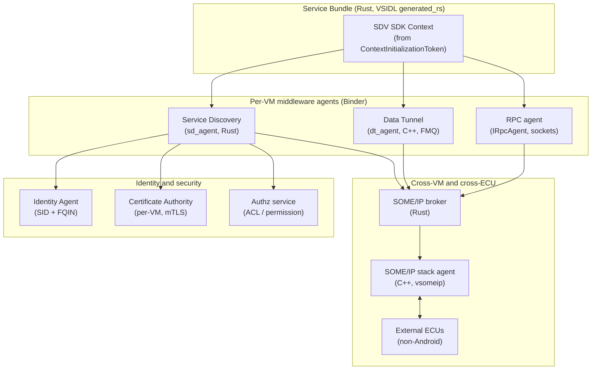
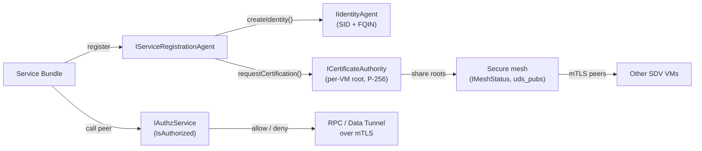
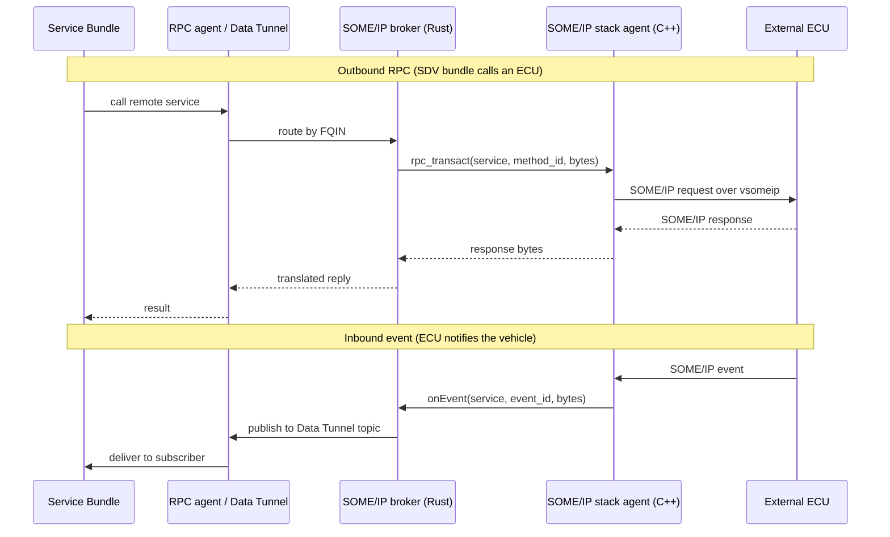

# Chapter 66: SDV Middleware and Vehicle Communication

Chapter 65 introduced the Software Defined Vehicle (SDV) platform that arrives in Android 17: a headless vehicle Android OS where a *Core* VM runs vehicle services with no UI, alongside one or more Android Automotive OS (AAOS) In-Vehicle Infotainment (IVI) VMs and non-Android automotive ECUs. That chapter covered the architecture overview, the Core VM, and the orchestration that drives bundle lifecycle. This chapter goes one layer down, into the *communication fabric* that ties all of those pieces together: the VSIDL interface-definition language and its Rust code generator, the three-agent middleware (Service Discovery, Data Tunnel, RPC) with its secure mesh, the SOME/IP stack that carries cross-VM and cross-ECU traffic, the SDV Gateway that lets ordinary AAOS apps and the VHAL reach the fabric, and the automotive-domain service catalog (diagnostics, configuration, calibration, vehicle mode, user profile) layered on top. The source lives almost entirely under `system/software_defined_vehicle/`, with the stable contracts in `hardware/sdv/interfaces/`.

---

## 66.1 The Shape of the Fabric

If Binder is how processes talk *inside* one Android VM (Chapter 9), the SDV middleware is how Service Bundles talk *across* VMs and out to physically separate ECUs. The design borrows Android's idioms — AIDL contracts, a registry, identity-aware calls — but stretches them over a network of mutually distrusting compute nodes inside a single vehicle.

Three concepts recur throughout the chapter:

- **Service Bundle** — the SDV unit of deployment and the analogue of an Android service. A bundle publishes topics, subscribes to topics, and offers or consumes RPC services. Its interface is described in VSIDL (§66.2).
- **FQIN (Fully Qualified Instance Name)** — the vehicle-wide identity of a bundle instance. `ServiceFqin` (`hardware/sdv/interfaces/middleware/service_discovery/google/sdv/identity/ServiceFqin.aidl`) is four strings: `sdvVmName`, `sdvPackageName`, `serviceBundleName`, and `serviceInstanceName` (the last assigned by the Orchestrator at load time). The FQIN is what gets baked into TLS certificates so the mesh can authenticate peers.
- **SID (Service ID)** — a 64-bit numeric identity that fast lookups use at runtime. `ServiceIdentity` (`.../identity/ServiceIdentity.aidl`) pairs the `long sid` with an EC public key and the human-readable FQIN.

### 66.1.1 The three middleware agents

Inside any one VM, a Service Bundle reaches the fabric through three agents, each a Binder service defined in `hardware/sdv/interfaces/middleware/`:

- **Service Discovery** (`service_discovery/`) registers, finds, and watches service units and topics.
- **Data Tunnel** (`data_tunnel/`) carries named-topic publish/subscribe traffic over Android FastMessageQueues (FMQ).
- **RPC** (`rpc/`) carries request/response calls over sockets.

A bundle does not connect to those agents one by one. The Lifecycle Manager (Chapter 65) hands each bundle a single use-once `ContextInitializationToken` (`hardware/sdv/interfaces/middleware/ctx/aidl/google/sdv/comms/ContextInitializationToken.aidl`) that bundles all four Binder connections it needs:

```java
// Source: hardware/sdv/interfaces/middleware/ctx/aidl/google/sdv/comms/ContextInitializationToken.aidl:31
parcelable ContextInitializationToken {
    ServiceIdentity identity;
    IServiceRegistrationAgent sr_agent;
    IServiceDiscoveryAgent sd_agent;
    IAgentService dt_agent;          // Data Tunnel
    IRpcAgent rpc_agent;
}
```

The comment on the token states its lifecycle plainly: it is "the use-once Context initialisation value issued by LifecycleManager to Service Bundles that enables them to create the SDV SDK Context object." From that token the bundle builds its SDK `Context`, and everything else flows from there.

The overall layering, from the bundle down to the wire, looks like this.

How a Service Bundle reaches the fabric, and how the fabric reaches other VMs and ECUs



## 66.2 VSIDL: Describing Services and Generating Rust

SDV does not hand-write the marshalling code that moves messages between bundles. It describes services in a *Vehicle Service Interface Definition Language* (VSIDL) and generates the middleware bindings, the same way AIDL generates Binder stubs. The toolchain lives under `system/software_defined_vehicle/vsidl/` and is written in Rust.

### 66.2.1 The .vsidl and .proto catalog

A *catalog* is a directory holding two kinds of files: `.proto` files that define message types, and `.vsidl` files that define service bundles. The compiler README spells out the split: "From `.proto` files it reads message names, rpc interfaces, and type definitions. From `.vsidl` files it reads service bundle definitions" (`system/software_defined_vehicle/vsidl/vsidlc/README.md`).

A `.vsidl` file is itself textproto, conforming to the grammar in `system/software_defined_vehicle/vsidl/language/src/protos/sdv/vsidl/v1/syntax.proto`. A bundle declares the topics it publishes and subscribes to and the RPC services it serves or calls:

```protobuf
// Source: system/software_defined_vehicle/samples/vsidl/complex/catalog/complex_message_publisher.vsidl:18
package: "com.android.sdv.sample.complex"

service_bundle {
    name: "ComplexMessagePublisher"

    publisher {
        message: "ComplexMessage"
        topic: "complex-message"
        capacity: 50
    }

    server {
        service: "ComplexMessageRPC"
        channel: "complex-message-rpc"
    }
}
```

A subscriber/client bundle is the mirror image: a `subscriber` block naming the same topic, and a `client` block naming the same RPC channel. Topics are *named* — `complex-message` here — and that name is the rendezvous point the two halves use without ever knowing each other's FQIN at authoring time.

### 66.2.2 vsidlc and generated_rs

The compiler `vsidlc` (`system/software_defined_vehicle/vsidl/vsidlc/`) walks the catalog recursively and emits Rust middleware bindings into an `output/generated_rs` directory (per its README). Internally it runs a small pipeline of generation steps — service-bundle bindings, RPC bindings, diagnostics bindings, and a generated `Android.bp` — under `system/software_defined_vehicle/vsidl/vsidlc/src/rust/steps/`. The output is the SDV equivalent of an AIDL stub: typed publisher/subscriber/server/client handles the bundle code links against, so application logic never touches the wire format directly.

A companion tool, `vsidl_rc_generator` (`system/software_defined_vehicle/vsidl/vsidl_rc_generator/`), produces the *runtime* configuration the agents load rather than the code the bundle links. Its README lists the outputs: "Schemas of Protobuf messages used in the catalog, SOME/IP mapping files, [and] Diagnostic declarations," serialized as `vsidl-config.binpb`, `someip-config.binpb`, and `diagnostics-config.binpb`.

### 66.2.3 SOME/IP translation modes

Because a topic may have to cross onto a SOME/IP bus to reach a non-Android ECU, message types carry a *translation mode* that decides how the SOME/IP layer treats their bytes. The parser recognizes three modes (`system/software_defined_vehicle/vsidl/language/src/parser/converter.rs`): `INTERPRET_AS_BYTES`, `DYNAMIC_LIBRARY`, and a default `REFLECTION`. The `someip_translation_generator` (`system/software_defined_vehicle/some_ip/someip_translation_generator/`) reads these tags and emits translation code: its README documents a `static-lib` mode that handles messages tagged `INTERPRET_AS_BYTES` (the bytes go on the wire as-is) and a `dyn-lib` mode for messages tagged `DYNAMIC_LIBRARY` (translation code is compiled into a shared library). This is the seam where SDV's protobuf-shaped messages meet SOME/IP's fixed wire layout.

### 66.2.4 The VSIDL provider agent

Catalog metadata also has to be queryable at runtime — sometimes from a different VM. `sdv_vsidl_provider_agent` (`system/software_defined_vehicle/vsidl/provider/agent/sdv/`) is an RPC service that answers descriptor queries: publication descriptors, RPC method descriptors, message descriptors, and diagnostics declarations. Its client library (`system/software_defined_vehicle/vsidl/provider/clientlib/`) can source that metadata three ways — from local config files, from on-device APEXes, or by delegating to another VM's provider agent — so a tool or bundle can introspect a service bundle that lives on a peer VM. There is an `ivi/` variant of the agent for the IVI side as well.

## 66.3 The Middleware: Discovery, Data Tunnel, RPC, and the Secure Mesh

With VSIDL covering the contract, the runtime fabric is the three agents plus the identity and security layer beneath them. The implementations live under `system/software_defined_vehicle/middleware/`; the contracts under `hardware/sdv/interfaces/middleware/`.

### 66.3.1 Service Discovery

`IServiceRegistrationAgent` registers a service unit and returns a one-use `RegistrationToken`; `IServiceDiscoveryAgent` finds and watches units. The registration call carries the unit name, its `UnitType`, an ACL, and application metadata (`.../service_discovery/discovery/IServiceRegistrationAgent.aidl`), and discovery offers both type-based and name-based lookups plus topic enumeration:

```java
// Source: hardware/sdv/interfaces/middleware/service_discovery/google/sdv/service_discovery/discovery/IServiceDiscoveryAgent.aidl
ServiceUnitDefinition getServiceUnit(in ServiceFqin fqin, in String unitName);
// ... plus listServiceUnitsByType/ByName, fetchPublishersByTopicName, listTopics
```

A third interface, `ITransportSupportAgent`, lets a transport (such as the SOME/IP broker) redeem a `RegistrationToken` for the full `ServiceUnitDefinition` and attach transport-specific metadata to it. That indirection is how the wire layer learns where to actually send bytes for a logically-registered service. The Service Discovery agent itself, `sdv_sd_agent`, is Rust (`system/software_defined_vehicle/middleware/service_discovery/sdv_sd_agent/srcs/main.rs`).

### 66.3.2 Data Tunnel

Data Tunnel is named-topic pub/sub. `IAgentService` (`hardware/sdv/interfaces/middleware/data_tunnel/aidl/google/sdv/data_tunnel/IAgentService.aidl`) has a publisher register a publication — handing over an `MQDescriptor` for the FastMessageQueue it will write into — and subscribers attach by unit identifier or by topic name:

- `Connect(long sid, out ClientDescriptor)` establishes the per-client channel.
- `RegisterPublication(RegistrationToken, MQDescriptor<byte,...>, out PublicationDescriptor)` registers a topic backed by an FMQ the publisher allocates.
- `SubscribeToPublicationExtended(SubscriptionParams, out SubscriptionResult)` subscribes with a readiness listener.
- `GetLastMessageByTopic(UnitType, String topicName, out byte[])` reads the most recent value of a topic.

Using FMQ means same-VM pub/sub is effectively zero-copy through shared memory; cross-VM topics ride the SOME/IP broker instead. The Data Tunnel agent is C++, and it ships with a companion APEX `com.android.sdv.dt` that carries the ACLs governing inter-VM Data Tunnel communication (`system/software_defined_vehicle/middleware/data_tunnel/apex/Android.bp`).

### 66.3.3 RPC

RPC is socket-based request/response. `IRpcAgent` (`hardware/sdv/interfaces/middleware/rpc/google/sdv/rpc/IRpcAgent.aidl`) is small and pointed: a server redeems a `RegistrationToken` to get a socket to listen on, and a client asks for a connection to a named server:

```java
// Source: hardware/sdv/interfaces/middleware/rpc/google/sdv/rpc/IRpcAgent.aidl:26
interface IRpcAgent {
    ParcelFileDescriptor registerServer(in RegistrationToken token);
    void registerServerPort(in RegistrationToken token, int port);
    ParcelFileDescriptor getFdConnection(in long sid, @utf8InCpp String unitName);
    @utf8InCpp String getAddressConnection(in long sid, @utf8InCpp String unitName);
    @utf8InCpp String getNetworkInterfaceName();
}
```

`getNetworkInterfaceName()` returns the network interface the agent binds to — by default the dedicated SDV-RPC VLAN discussed in §66.4.4.

### 66.3.4 Identity, the certificate mesh, and authorization

The agents above are only safe because of a security layer that runs beneath them. It has three parts, all under `hardware/sdv/interfaces/middleware/service_discovery/google/sdv/`:

- **Identity** (`identity/IIdentityAgent.aidl`) mints and verifies `ServiceIdentity` records: `createIdentity(EcPublicKey, ServiceFqin, ...)`, `verifyIdentity(...)`, and lookups by SID, by FQIN, or by OS process identifier.
- **Certificate Authority** (`ca/ICertificateAuthority.aidl`) issues X.509 certificates for FQINs. `requestCertification(String request)` takes a PEM PKCS#10 request whose subject-alternative DNS name encodes the FQIN; `addAuthoritiesListener(...)` lets a peer learn as VMs join or leave. The CA is gated on boot state — `isEnabled()` returns false in the UNLOCKED boot mode and true when LOCKED.
- **Authorization** (`authz/IAuthzService.aidl`) answers `isAuthorized(subject_fqin, object_fqin, object_service_unit_name)` so the middleware can deny calls between bundles that policy does not permit.

The certificate material is EC (P-256); the helper that builds the self-signed per-VM root encodes the BASE32 FQIN into the certificate subject and subject-alternative name (`system/software_defined_vehicle/middleware/crypto_rpc/src/cert.rs`). The `crypto_rpc` library README states the coupling directly: it "enables TLS for RPC," and "Service Discovery and SDV RPC library depend on each other in terms of X509 certificate signing and usage."

The result is the **secure mesh**: each SDV VM runs its own CA, and the set of CAs is shared across VMs so any node can validate any peer's certificate. `IMeshStatus` (`.../mesh/IMeshStatus.aidl`) reports whether this VM is connected to every other VM declared in the vehicle's `vvmconfig` (`isComplete()`) and the per-peer `PeerConnectionStatus`. Mesh provisioning writes a truststore file `/vvmtruststore/uds_pubs` via `IUdsPubsProvisioner` (`.../mesh/provisioning/IUdsPubsProvisioner.aidl`), and that step is only available in the UNLOCKED boot mode — the device is provisioned, then locked.

The security and identity layer beneath the three agents



## 66.4 SOME/IP: Crossing VM and ECU Boundaries

Same-VM traffic stays in Binder and FMQ. The moment a topic or RPC has to reach another VM or a non-Android ECU, it goes onto **SOME/IP** — the AUTOSAR automotive service protocol — through two cooperating processes under `system/software_defined_vehicle/some_ip/`.

### 66.4.1 The stack agent and vsomeip

`sdv_someip_stack_agent` is C++. It wraps the open-source `vsomeip` library: `StackImpl` constructs `vsomeip::runtime::get()` and creates a vsomeip application (`system/software_defined_vehicle/some_ip/vsomeip_stack/src/stack.cpp`), then exposes a Binder interface, `ISomeIpStack`. The wire configuration — which SOME/IP service IDs and instance IDs this node offers, their TCP/UDP ports, and the service-discovery multicast group — lives in `system/software_defined_vehicle/some_ip/vsomeip_stack/vsomeip_config.json`, the standard vsomeip configuration format.

`ISomeIpStack` (`hardware/sdv/interfaces/some_ip/stack_agent/aidl/google/sdv/someip/ISomeIpStack.aidl`) is the boundary between SDV's world and the SOME/IP wire, and it speaks in raw `byte[]` payloads on both sides:

```java
// Source: hardware/sdv/interfaces/some_ip/stack_agent/aidl/google/sdv/someip/ISomeIpStack.aidl
byte[] rpc_transact(in SomeIpService service, char method_id, in byte[] payload);   // sync RPC
void   rpc_oneway  (in SomeIpService service, char method_id, in byte[] payload);   // fire-and-forget
oneway void monitor_service(in SomeIpService service);                              // track availability
oneway void publish(in SomeIpService service, char event_id, in byte[] payload);    // emit event
void subscribe_eventgroup(in SomeIpService service, char eventgroup, in char[] event_ids);
```

A `SomeIpService` is the SOME/IP triple — a 16-bit `service_id`, a 16-bit `instance_id`, and a `SomeIpServiceVersion` (`byte major`, `int minor`) — defined in `SomeIpService.aidl` and `SomeIpServiceVersion.aidl` in the same directory.

### 66.4.2 The broker

The stack agent only knows SOME/IP. Mapping SDV's topics, RPC channels, and protobuf messages onto SOME/IP services, events, and method IDs is the job of `sdv_someip_broker_agent_comms`, which is Rust. Its module header states its purpose: "This agent is responsible for enabling communication between SOME/IP communication and SDV" (`system/software_defined_vehicle/some_ip/broker_agent_comms/src/main.rs`). The broker has sub-modules for service discovery, pub/sub, and RPC, plus a `translator` that converts between SOME/IP bytes and SDV types using the mappings generated by `vsidl_rc_generator` (§66.2.2). It connects to the stack agent over Binder (`google.sdv.someip.ISomeIpStack/default`) and registers callbacks so SOME/IP events, availability changes, and inbound RPC requests are routed back into the SDV agents.

### 66.4.3 Callbacks: how traffic flows in both directions

`ISomeIpStack` is paired with three callback interfaces the broker registers so the flow is bidirectional:

- `ISomeIpServiceAvailabilityCallback` — the stack tells the broker when a SOME/IP service appears or disappears (SOME/IP service discovery).
- `IEventNotificationCallback` — the stack delivers a subscribed SOME/IP event up to the broker, which fans it out to Data Tunnel subscribers.
- `IRpcRequestCallback` — `byte[] onRpcRequest(SomeIpService, char method_id, byte[] payload)`: the stack hands an inbound SOME/IP RPC request to the broker and sends the returned bytes back as the response.

A separate, tiny interface, `ISomeIpLoadIndicators` (`hardware/sdv/interfaces/some_ip/load_indicators/aidl/.../ISomeIpLoadIndicators.aidl`), reports a single `int pendingSomeIpEventCounter`: zero means idle, a positive value is the depth of the unprocessed SOME/IP event queue, and a negative value signals an error — a cheap real-time backpressure signal the stack agent samples periodically.

The round trip for an outbound RPC and an inbound event



### 66.4.4 The SDV-RPC VLAN

SDV-RPC traffic rides a dedicated VLAN so it can be isolated and policed separately from ordinary networking. The interface name is set either as a bootconfig variable, `androidboot.sdv.rpc.interface=sdv_rpc`, or via the `SDV_RPC_INTERFACE` build variable, and the reference Cuttlefish targets (`sdv_core_cf`, `sdv_ivi_cf`) default it to `sdv_rpc` (`system/software_defined_vehicle/sdv_gateway/README.md`). At runtime the gateway and networking services read it from the `ro.boot.sdv.rpc.interface` system property (`system/software_defined_vehicle/sdv_gateway/service/cpp/SdvGatewayService.cpp`).

## 66.5 The SDV Gateway: Bringing the IVI and the VHAL onto the Fabric

The middleware so far assumes SDV-aware Rust bundles built from VSIDL. But an AAOS IVI VM is full of ordinary Java apps and a Vehicle HAL that know nothing about FQINs, registration tokens, or the secure mesh. The **SDV Gateway** (`system/software_defined_vehicle/sdv_gateway/`) is the adapter that lets those non-SDV-aware clients reach the fabric. It is implemented mainly in C++ (the `service/`, `libsdvgateway`, and `vhal_proxy` pieces) with Java for the networking service and client SDK.

### 66.5.1 The session model

A client first obtains the gateway, then opens a session. `ISdvGateway` (`hardware/sdv/interfaces/sdv_gateway/google/sdv/gateway/ISdvGateway.aidl`) is deliberately minimal — `getVersion()` and `createSession()` — and a process may hold only one session at a time. `ISdvGatewaySession` (`.../ISdvGatewaySession.aidl`) is the substantial interface; it mirrors the three middleware agents but for an untrusted caller:

- `initComms(InitCommsParams)` — establishes the session's comms. `InitCommsParams` (`.../InitCommsParams.aidl`) carries the caller's `PublicKey` plus the three FQIN strings it is asking to use: `sdvPackageName`, `serviceBundleName`, `serviceInstanceName`.
- `registerRpcServer(RegisterRpcServerParams)` / `findRpcServerByName(FindRpcServerByNameParams)` — the gateway side of RPC; the find result returns a `SocketAddress`, a subject-alternative name, and the peer VM name.
- `createPublication(CreatePublicationParams)` returning `IDataTunnelPublication`, and `subscribeToPublicationByName(...)` — the gateway side of Data Tunnel.
- `rpcCredentialsConfig()` returning `RpcCredentialsConfigResult` (a `useInsecureRpc` flag plus the subject-alternative name), `requestCertificateChain(...)`, and `setAuthoritiesListener(...)` — the gateway side of the certificate mesh.

Status comes back as `SdvGatewayStatusCode` (`.../SdvGatewayStatusCode.aidl`), a gRPC-style enum (`OK`, `CANCELLED`, … `UNAUTHENTICATED`).

### 66.5.2 The privileged interfaces

Behind the public session, the gateway also exposes a set of *privileged* interfaces under `hardware/sdv/interfaces/sdv_gateway/google/sdv/privileged/`, reserved for trusted system services rather than arbitrary apps:

- `IPrivilegedGatewayNetworking` (`privileged/gatewaynetworking/`) — used only by the Java `sdv_gatewaynetworking_service`. It supplies `getRpcNetworkInterfaceName()`, `setRpcNetworkHandle(long)`, `onCarPowerStateChanged(CarPowerState)`, and listener registration. `CarPowerState` enumerates the AAOS power states (`WAIT_FOR_VHAL`, `ON`, `SHUTDOWN_PREPARE`, `SUSPEND_ENTER`, `HIBERNATION_ENTER`, …) so the fabric can react to vehicle power transitions.
- `IPrivilegedIdentityAgent`, `IPrivilegedServiceRegistrationAgent`, `IPrivilegedServiceDiscoveryAgent` — the same identity/registration/discovery operations as §66.3, but taking an explicit *process identifier* argument so the gateway can act on behalf of a specific client process rather than its own.

The gateway AIDL is versioned and frozen under `hardware/sdv/interfaces/sdv_gateway/aidl_api/`: the public `google.sdv.gateway` package is at API v3 (with v1/v2 snapshots retained), and the privileged packages are at v2/v3 — the same backward-compatibility discipline as any stable AIDL HAL (Chapter 10).

### 66.5.3 The VHAL proxy

The flagship gateway client is the **VHAL proxy** (`system/software_defined_vehicle/sdv_gateway/vhal_proxy/libvhal_proxy/`). It lets a Vehicle HAL service surface vehicle properties as Data Tunnel topics and vice versa. Per its README, `VhalProxy` "handles parsing a VHAL proxy configuration file, subscribing to the services defined via Data Tunnel Publishers, and reading protobuf messages from those services. For every message, this library handles converting the protobuf value for each property ID and area ID pair, and creating a corresponding `VehiclePropValue`." Its API surface is four calls: `ReadMessages`, `WriteMessages`, `Subscribe`, and `Unsubscribe`. The config maps protobuf message types to VHAL property/area pairs and a Data Tunnel action (subscribe or publish) — a sample lives at `system/software_defined_vehicle/samples/vhal_proxy/sdv_emulated_vhal/VhalProxySampleConfig.json`.

This is what makes a stock AAOS CarService (Chapter 60) work over SDV: CarService reads vehicle properties from the VHAL exactly as on a one-VM device, and the VHAL proxy quietly sources those properties from vehicle services running in the Core VM, through the gateway, over the fabric.

### 66.5.4 The UID allowlist

Because the gateway lets an untrusted process claim an SDV package name (the second FQIN element), it must police which process may claim which name. That is the job of `sdv_gateway_config.json`, installed at `/vendor/etc/sdv_gateway_config.json`. The README is explicit: the file contains "the SDV package names (the second element of the FQIN) that native service (e.g. VHAL) are allowed to use when calling `initComms`," and "an empty config would prevent all native applications from using the SDV Gateway."

The allowlist is keyed by Android user ID:

```json
// Source: system/software_defined_vehicle/sdv_gateway/README.md (config example)
{
  "allowed_native_packagename": {
     "2942": [ "com.oemspecific.vhal" ]
  },
  "propagate_rpc_network_changes_to_data_tunnel": false,
  "propagate_rpc_network_changes_to_service_discovery": false
}
```

UID `2942` here may register only the `com.oemspecific.vhal` SDV package name; a UID of `-1` grants a name to all UIDs. The README recommends giving each native gateway client a unique AID and allowlisting only the names it truly needs, "to add another layer of security against the compromise or misuse of service discovery identities." The two `propagate_rpc_network_changes_*` flags, both `false` in the reference `device/google/sdv/sdv_ivi_base/sdv_gateway_config.json`, control whether an SDV-RPC VLAN change is pushed to the Data Tunnel and Service Discovery agents (relevant only when those agents share the RPC interface rather than running on separate VLANs).

## 66.6 Automotive Services: the Domain Catalog

The fabric so far is domain-agnostic plumbing. On top of it, `system/software_defined_vehicle/automotive_services/` ships the *automotive-specific* service catalog. The repo README names the five: "Diagnostics, Configuration, Calibration, Vehicle Mode, User Profile." These are defined in VSIDL/proto and implemented in Rust as ordinary service bundles riding the Data Tunnel and RPC agents.

### 66.6.1 Diagnostics (ISO 14229-1 / AUTOSAR)

Diagnostics is the most developed of the five and the one that most clearly shows SDV adopting an automotive standard rather than inventing one. Its README states the lineage outright: "APIs are based on ISO 14229-1:2020 and AUTOSAR Diagnostic Event Manager standards" (`system/software_defined_vehicle/automotive_services/diagnostics/README.md`), and links the ISO 14229-1:2020 (UDS) and AUTOSAR DEM specifications as external references.

The interface set under `system/software_defined_vehicle/automotive_services/diagnostics/vsidl/v1/` maps directly onto UDS:

- `diagnostics_manager_service.proto` — the RPC API a service uses to query connection parameters from the Diagnostics Manager.
- `connection.proto` — `SessionType` (default, programming, extended-diagnostic, safety-system-diagnostic sessions per UDS) and `ConnectionParameters` (source/target address, session type).
- `event.proto` — fault events whose `Status` enum (PASS, FAIL, PRE_PASS, PRE_FAIL) follows the AUTOSAR Diagnostic Event Manager, with an `OperationCycle` (START/STOP/RESTART) and an `EnableCondition` published over Data Tunnel.
- `response_code.proto` — the ISO 14229-1 negative-response codes.
- Per-service interfaces for the standard UDS routines: `routine_control_service.proto`, `io_control_service.proto`, `ecu_reset_service.proto`, `security_access_service.proto`, `authentication_service.proto`, `file_transfer_service.proto`, and `fault_listener_service.proto`.

A reference `sdv_diagnostics_agent` (`system/software_defined_vehicle/automotive_services/diagnostics/tests/agent/src/main.rs`) wires these together and listens for DoIP (Diagnostics over IP, ISO 13400) traffic — the path an external diagnostic tester uses to reach the vehicle.

### 66.6.2 Configuration, Calibration, Vehicle Mode, User Profile

The remaining four follow the same pattern — proto-defined VSIDL services, Rust implementations:

- **Configuration / Calibration (ConCal)** (`automotive_services/concal/`) lets services be reconfigured and calibrated at runtime. `ConCalCalibrationService` (`concal/catalog/concal_calibration_service.proto`) exposes `GetCalibrationConfigIds`, `StartCalibration`, `UpdateConfigForCalibration`, and `FinishCalibration`, with companion registration, update, and notification services.
- **User Profile** (`automotive_services/user_preferences/`) manages per-user settings. `UserPreferencesManagementService` (`user_preferences/vsidl/v1/user_preferences_management_service.proto`) offers `RequestSettingsChange`, `SubscribeToSettingsChangeAndGetSettings`, and `UnsubscribeFromSettingsChange`, alongside admin, registry, and change-notifier services.
- **Vehicle Mode** is named in the catalog README as one of the five automotive services; vehicle power-state handling itself lives in the Vehicle Power Manager (`system/software_defined_vehicle/vpm/`), covered with orchestration in Chapter 65.

## 66.7 Samples and Tools

SDV ships an unusually large body of runnable examples and host tooling, because a distributed multi-VM fabric is hard to learn from contracts alone.

### 66.7.1 Samples

`system/software_defined_vehicle/samples/` holds reference bundles, each with its own README:

- **quickstart** (`samples/quickstart/`) packages two bundles (a `Manager` and a `Monitor`) into an APEX, with `vsidlc`-generated Rust middleware, demonstrating the end-to-end flow from `.vsidl` to a deployable, lifecycle-launched bundle.
- **qos_scheduling** (`samples/qos_scheduling/`) shows scheduling profiles affecting CPU-bound bundles.
- **tracing** instruments both C++ (Perfetto SDK) and Rust (the `tracing` crate plus `libatrace_rust`) bundles and shows AIDL calls auto-emitting ATrace events.
- **sdv_gateway** (`samples/sdv_gateway/`) is an IVI app reaching SDV services through the gateway client library, exercising Service Discovery, Data Tunnel, and RPC together with TLS.
- **oem_partition_update_client** demonstrates the OEM A/B partition update flow (prepare, activate, commit, rollback) via an `OemUpdater` crate.
- **cujs** (`samples/cujs/`) is a large set of Critical User Journeys — pub/sub, RPC, pub/sub-with-power-suspend, multi-publisher, and robustness scenarios — that double as integration tests across VMs.

### 66.7.2 Host tools

`system/software_defined_vehicle/tools/` holds the host-side, mostly-Rust tooling that supports the build and provisioning flows:

- **regenerator** (`tools/regenerator/`) re-runs `vsidlc` to refresh generated middleware catalogs, driven by `CATALOG_UPDATE` textproto files that record the output path, dependency catalogs, and generator flags.
- **vvmconfig_generator** (`tools/vvmconfig_generator/`) converts a human-readable JSON vehicle-VM topology into the CBOR `vvmconfig` blob the Service Discovery agent consumes — JSON in git, binary CBOR at build time.
- **sdv_provisioning_tool** (`tools/sdv_provisioning_tool/`) drives secure-mesh provisioning: it waits until the mesh is complete, writes `/vvmtruststore/uds_pubs`, and returns its SHA-256 as the factory trust anchor.
- **vhal_json_generator** (`tools/vhal_json_generator/`) is a Rust host binary that reads VSIDL VHAL mappings and emits the JSON config the VHAL proxy (§66.5.3) loads.
- **test_uds_certs_generator** (`tools/test_uds_certs_generator/`) generates `uds_certs` files for development and testing of the mesh.

## 66.8 Try It

These commands assume an SDV Core VM or a Cuttlefish SDV target (`sdv_core_cf`, `sdv_ivi_cf`) and a checked-out tree at `system/software_defined_vehicle/`.

- **Read a service bundle's contract.** Open `system/software_defined_vehicle/samples/vsidl/complex/catalog/complex_message_publisher.vsidl` and its subscriber peer. Identify the shared `topic` name and the shared RPC `channel` — that is the only thing the two halves agree on at authoring time.

- **See what `vsidlc` would generate.** Read `system/software_defined_vehicle/vsidl/vsidlc/README.md`, then look at the generation steps under `system/software_defined_vehicle/vsidl/vsidlc/src/rust/steps/`. Note that the output goes into `output/generated_rs`, the SDV analogue of AIDL stubs.

- **Trace the SOME/IP boundary.** Read `hardware/sdv/interfaces/some_ip/stack_agent/aidl/google/sdv/someip/ISomeIpStack.aidl`. Find `rpc_transact`, `publish`, and `subscribe_eventgroup`, and confirm that every payload crossing this interface is a raw `byte[]` — translation happens in the broker, not the stack.

- **Inspect the gateway allowlist.** Read `device/google/sdv/sdv_ivi_base/sdv_gateway_config.json` and the "Service config" section of `system/software_defined_vehicle/sdv_gateway/README.md`. Work out which UID is allowed to claim which SDV package name, and what an empty config would do.

- **Map a UDS routine to a proto.** Open `system/software_defined_vehicle/automotive_services/diagnostics/vsidl/v1/connection.proto` and find the `SessionType` enum. Match each value against ISO 14229-1's diagnostic session types (default, programming, extended, safety-system).

- **Check the mesh on a running target.** On a Core VM, `adb shell` and list the SDV agent services with `service list | grep sdv` (or `dumpsys`), then look for the Data Tunnel APEX `com.android.sdv.dt`. Inspecting `/vvmtruststore/` shows the mesh truststore the provisioning tool wrote.

## Summary

- SDV's communication fabric is a network-spanning version of Android's IPC idioms: a Service Bundle is described in VSIDL, identified by an FQIN/SID, and reaches the fabric through three Binder agents handed to it as one `ContextInitializationToken`.
- VSIDL (`system/software_defined_vehicle/vsidl/`, Rust) compiles `.vsidl` + `.proto` catalogs into Rust middleware bindings (`generated_rs`) and runtime config; per-message translation modes (`INTERPRET_AS_BYTES`, `DYNAMIC_LIBRARY`) decide how a type crosses onto SOME/IP.
- The three agents are Service Discovery (Rust), Data Tunnel (C++, named-topic pub/sub over FMQ), and RPC (socket-based). Beneath them, a per-VM certificate authority, identity agent, and authorization service form a mutually-authenticated **secure mesh** over mTLS with P-256 certificates that encode the FQIN.
- SOME/IP carries cross-VM and cross-ECU traffic: a C++ `vsomeip` stack agent presents `ISomeIpStack` (raw `byte[]` payloads), and a Rust broker maps SDV topics/RPC/messages onto SOME/IP services, events, and methods, with callbacks for availability, events, and inbound RPC.
- The SDV Gateway (`ISdvGateway`/`ISdvGatewaySession`, plus privileged interfaces) lets non-SDV-aware AAOS apps and the VHAL proxy join the fabric, gated by a UID-keyed package-name allowlist in `/vendor/etc/sdv_gateway_config.json`, with SDV-RPC traffic on a dedicated VLAN.
- `automotive_services/` layers the domain catalog on top — Diagnostics (ISO 14229-1 / AUTOSAR DEM, DoIP), Configuration, Calibration, Vehicle Mode, and User Profile — and `samples/` plus `tools/` provide runnable references and the host-side codegen/provisioning toolchain.

### Key Source Files Reference

| File | Purpose |
|------|---------|
| `hardware/sdv/interfaces/middleware/ctx/aidl/google/sdv/comms/ContextInitializationToken.aidl` | The use-once token bundling a Service Bundle's four agent connections |
| `hardware/sdv/interfaces/middleware/service_discovery/google/sdv/identity/ServiceFqin.aidl` | Vehicle-wide bundle identity (the FQIN) |
| `hardware/sdv/interfaces/middleware/rpc/google/sdv/rpc/IRpcAgent.aidl` | Socket-based RPC agent contract |
| `hardware/sdv/interfaces/middleware/data_tunnel/aidl/google/sdv/data_tunnel/IAgentService.aidl` | Named-topic pub/sub over FMQ |
| `hardware/sdv/interfaces/middleware/service_discovery/google/sdv/ca/ICertificateAuthority.aidl` | Per-VM CA for the secure mesh |
| `system/software_defined_vehicle/vsidl/vsidlc/README.md` | VSIDL compiler: catalog to `generated_rs` |
| `system/software_defined_vehicle/vsidl/language/src/protos/sdv/vsidl/v1/syntax.proto` | The VSIDL textproto grammar |
| `hardware/sdv/interfaces/some_ip/stack_agent/aidl/google/sdv/someip/ISomeIpStack.aidl` | SOME/IP stack boundary (raw bytes) |
| `system/software_defined_vehicle/some_ip/broker_agent_comms/src/main.rs` | SOME/IP-to-SDV broker (Rust) |
| `hardware/sdv/interfaces/sdv_gateway/google/sdv/gateway/ISdvGatewaySession.aidl` | Gateway session for non-SDV-aware clients |
| `system/software_defined_vehicle/sdv_gateway/README.md` | Gateway config, UID allowlist, SDV-RPC VLAN |
| `system/software_defined_vehicle/sdv_gateway/vhal_proxy/libvhal_proxy/README.md` | VHAL proxy: properties to Data Tunnel topics |
| `system/software_defined_vehicle/automotive_services/diagnostics/README.md` | Diagnostics: ISO 14229-1 / AUTOSAR DEM |
