# Appendix D: Android 17 Updates

This appendix summarizes the important platform changes between Android 16 (the `android-16.0.0_r4` tag) and Android 17 (the `android17-release` branch). It is derived from a per-repository diff of the two releases and verified against the Android 17 source tree. The focus is new projects, new code modules, and architecture changes; `external/*` dependencies are covered only by how they are integrated, and routine bugfixes and version bumps are omitted. Where a change is still flag-gated or scaffolded-but-not-default in 17, that status is called out.

## D.1 How to read this appendix

The appendix is organized by book Part (subsystem), in chapter order. Within each Part, changes are grouped by category: **New projects** (new top-level repositories), **New modules** (new code modules, APEXes, or HAL packages inside existing repos), **Architecture changes** (structural reworks), and **Notable integrations** (how new or external pieces are wired into the platform). Every claim cites real AOSP paths, and a closing **Key Source Files Reference** table (D.16) collects the standout files per Part.

## D.2 Kernel & Boot

Android 17 carves USB accessory handling out into its own top-level repo, moves snapshot-based OTA toward a userspace block-device (UBLK) backend, and ships the first `android17-6.18` GKI configs. The init first-stage mount path also finishes splitting Android-specific logic from Microdroid.

### New projects

**`system/usb` (`platform/system/usb`)** is a brand-new top-level repo holding the USB stack's userspace components. Its first inhabitant is `aoad`, a userspace daemon implementing the **Android Open Accessory (AOA)** protocol that historically lived in the kernel's `f_accessory` USB function driver. The repo ships:

- An AIDL contract `android.hardware.usb.aoa` (`system/usb/aoa/aidl/android/hardware/usb/aoa/IUsbAoa.aidl`) exposing `openAccessory()`, `openAccessoryForInputStream/OutputStream()`, `getMaxPacketSize()`, `getAccessoryStrings()`, `getInitializationStatus()`, and `isStartRequested()`. Clients such as `UsbDeviceManager` call `getInitializationStatus()` to confirm the userspace AOA path is healthy.
- The daemon itself (`system/usb/aoa/daemon/main.cpp`), registering the `aoad` Binder service, plus `UsbAoaService.cpp`, `VendorControlRequestMonitor.cpp`, and `AccessoryLegacyBridgeThread.cpp` (built into `libaoad_core` per `system/usb/aoa/daemon/Android.bp`).

The architectural move is from a kernel gadget function to a **FunctionFS (FFS) + userspace** model: `VendorControlRequestMonitor` (`system/usb/aoa/daemon/VendorControlRequestMonitor.h`) opens the FFS control endpoint `ep0`, epoll-waits, and decodes the AOA vendor control requests (`ACCESSORY_GET_PROTOCOL=51`, `..._SEND_STRING=52`, `..._START=53`, HID requests `54..57`, `..._SET_AUDIO_MODE=58`) entirely in userspace. HID-over-AOA is bridged to `/dev/uhid`. The daemon is gated off by default and only starts when opted in.

Userspace AOA daemon startup gate

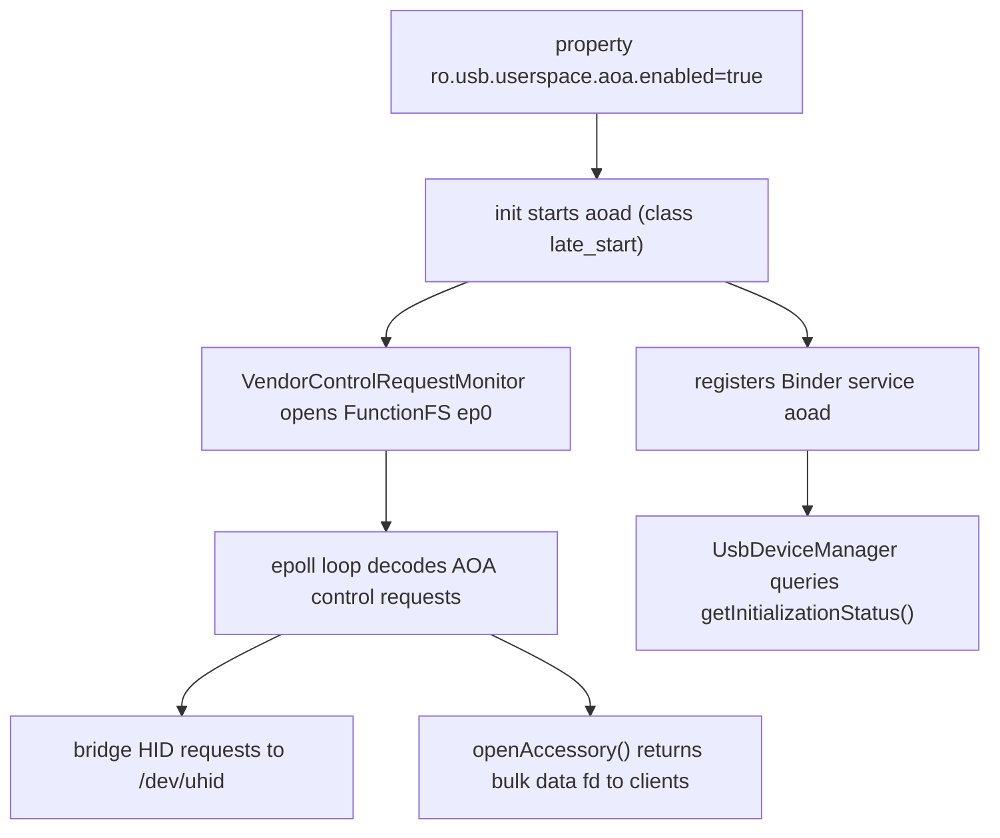

`system/usb/aoa/daemon/aoad.rc` declares `service aoad /system/bin/aoad`, `disabled`, started only `on property:ro.usb.userspace.aoa.enabled=true`, running as `user system` with groups `system usb uhid` under `seclabel u:r:aoad:s0`. A `cc_fuzz` target (`aoad_fuzzer`) fuzzes the privileged surface.

### Architecture changes

**OTA snapshots move to a UBLK backend (`system/core` + `system/update_engine`).** Virtual A/B snapshot merges, previously served by `snapuserd` through the kernel `dm-user` device, can now run over **UBLK** (userspace block driver). First-stage init selects the mode at boot: `system/core/init/first_stage_mount_android.cpp` calls `sm->UpdateUsesUblk()`, then `LaunchFirstStageSnapuserd(use_ublk)` and initializes `/dev/block/ublkb*` / `/dev/ublk*` misc devices. A new manifest field `disable_ublk` (`system/update_engine/update_metadata.proto:385-387`) lets OEMs force dm-user even on UBLK-configured devices. The legacy `system snapuserd` codepath and `ro.virtual_ab.userspace.snapshots.enabled`-style props are removed on both sides.

**update_engine COW/compression updates.** Android 17 adds **zstd compression for REPLACE ops** (plus a `zstd_extent_writer` unittest) and a flag to disable REPLACE compression. It also **removes squashfs support** and retrofit-dynamic-partition logic, drops `SnapshotMergeStats`, and stops saving manifest bytes / frees manifest partition memory after use to cut peak RAM. Large patches are now written to a file and applied via fd rather than held in memory.

**First-stage init: Microdroid vs Android separation.** The first-stage mount logic was refactored so Android-specific mounting no longer compiles into Microdroid (and vice versa): `system/core/init/first_stage_mount_android.cpp/.h` and `first_stage_mount_microdroid.cpp` now sit beside the shared `first_stage_mount.cpp`, the `FirstStageMount` virtual base class was removed, and second-stage init no longer pulls in first-stage mount/main.

**Other init/boot changes.** A reworked **boot monitor** lands, though enabling it by default was reverted again this cycle. Boot analysis gains `ro.boottime.event.*` properties and richer bootchart capture (early bootcharting via kernel command line, full-command-line capture, CPU model detection from `/proc/cpuinfo`). Init now passes the shutdown reason to the kernel on reboot, adds reboot reasons for long power-key presses, mounts `securityfs`, and removes the interactive FDR prompt when the TPM has been cleared. `ueventd` gains wildcard matching in sysfs attribute specs and can pull firmware from bootstrap APEXes before the full APEX set is ready.

### Notable integrations

- **GKI kernel: first `android17-6.18` configs.** `kernel/configs` adds the `android17-6.18` branch targeting the Linux 6.18 GKI kernel, while pruning Android R configs and refreshing OGKI approved-build lists and `kernel-lifetimes.xml`.
- **Shared OTA headers across init/fastboot/recovery.** `libupdate_engine_headers` is exported so `init`, `fastboot`, and recovery's `libinstall` can find `file_descriptor.h` (`system/core` and `bootable/recovery`), tightening the coupling between the OTA engine and the boot/recovery tooling that feeds it.
- **Recovery (`bootable/recovery`).** Picks up F2FS `packed_ssa` support, a `binder=c` bit in `MISC_KCMDLINE`, and a configurable `recovery_ui` graphics timeout.

## D.3 Native Foundation

The native layer of Android 17 is dominated by two stories: a much larger AIDL HAL surface (820 commits in `hardware/interfaces`, a new framework compatibility matrix, several new device contracts), and a structural maturation of berberis, the dynamic binary translator (439 commits), which grows beyond riscv64-on-x86_64 into a multi-guest engine with arm64 scaffolded in. bionic and libcore round it out with page-size/memory-tagging hardening and an OpenJDK uprev aimed at jdk-25.

### New projects

No entirely new repositories enter this Part. The notable additions are new *HAL packages* inside `hardware/interfaces` and new *subdirectories* inside berberis (covered under New modules and Architecture changes).

### New modules

New AIDL HAL contracts shipped in `hardware/interfaces` and declared in the Android 17 framework compatibility matrix `compatibility_matrices/compatibility_matrix.202704.xml` (FCM `level="202704"`):

- **Motion Context HAL** — `hardware/interfaces/motioncontext/aidl/android/hardware/motioncontext/` defines `IMotionContext`, `IMotionContextClient`, `IMotionContextCallback`, plus `MotionState`, `MotionEvent`, `MotionSubscription`, `EventDeliveryReason`: a subscription-based stream of device motion state to framework clients.
- **NPU HAL** — `hardware/interfaces/npu/aidl/android/hardware/npu/` adds `IScheduling` and `ISchedulingCallback` with `SchedulingConfig`, `WorkInfo`, `StartReason`, `EndReason`, `Uuid`. Per `npu/README.md`, the first revision lets Android inform a neural-processing unit of application priorities (0-1000, 0 = most important) and receive callbacks when NPU work starts/ends.
- **`libwrapfd` (`system/memory/libwrapfd`)** -- a new Rust/LLNDK library (`rust/lib.rs`, `cc_library_shared libwrapfd`) over a new `/dev/wrapfd` kernel driver. It wraps an existing fd and controls how it may be `mmap`ed: `wrapfd_driver_wrap()` pins a `PROT_READ`/`PROT_WRITE`/`PROT_NONE` mask, with ioctls to query state and acquire/release ownership. It is `apex_available` to `com.android.npumanager`, backing NPU-buffer protection.
- **Secure Execution Environment (SEE) family** — a large new `hardware/interfaces/security/see/` tree, all declared in the 202704 matrix:
  - `security/see/hwcrypto/aidl/.../hwcrypto/` — `IHwCryptoOperations`, `IOpaqueKey`, `ICryptoOperationContext` (+`CryptoOperation`, `CryptoOperationSet`, `KeyPolicy`, `MemoryBufferParameter`): a TEE-side crypto operation surface using opaque key handles.
  - `security/see/storage/aidl/.../storage/` — `ISecureStorage`, `IStorageSession`, `IDir`, `IFile` (+`CreationMode`, `Integrity`, `Availability`, `Filesystem`, `OpenOptions`): a tamper-evident/rollback-protected secure filesystem contract.
  - `security/see/devicestate/.../IDeviceState`, `security/see/authmgr/`, and `security/see/ext/.../ITrustedHalExt.aidl` — an extension point letting a trusted HAL be reached from the SEE.
- **Existing HAL version bumps**: health AIDL V5 (battery manufacturer/model/voltage-min-design), Weaver V3, Bluetooth Audio V6 (LE Audio peripheral/broadcast-sink, LE Audio over HDT phy, ISO parameter update), Channel Sounding additions (`UpdateChannelSoundingConfig`, `GetVelocity`), wifi Proximity Ranging, USB `PortPartnerStatus`/`Bc12Type`, and a new "timestamp HAL".

berberis adds a `cpu_emulation/` umbrella module (below) and splits the riscv64 translator into its own libraries (`translator_riscv64`, `runtime_library`).

### Architecture changes

**berberis: from a riscv64 translator to a multi-guest, multi-tier engine.** Android 16's tree was effectively riscv64-on-x86_64 only. In 17 the engine is reorganized under `frameworks/libs/binary_translation/cpu_emulation/`, gathering three execution tiers plus shared infrastructure:

- `cpu_emulation/interpreter/` — first-tier interpreter (riscv64).
- `cpu_emulation/lite_translator/` — fast, low-optimization JIT (`lite_translator/riscv64_to_x86_64`).
- `cpu_emulation/heavy_optimizer/` — optimizing JIT (`heavy_optimizer/riscv64`), the focus of the 17 cycle: global guest context optimization is implemented and enabled by default, plus `LoopGuestContextOptimizer` for irreducible loops and register-lifetime work in `LocalGuestContextOptimizer`.
- shared support: `cpu_emulation/{decoder,assembler,backend/x86_64,code_gen_lib,intrinsics}/`.

The arm64 guest is now scaffolded across the tree. New arch directories appear under `runtime/arm64/` and `runtime/arm64_to_x86_64/`, `guest_loader/arm64/`, `guest_state/arm64/` (with `get_cpu_state.cc`), `guest_abi/arm64/`, `guest_os_primitives/arm64/`, `kernel_api/arm64/`, plus `cpu_emulation/insn_tests/arm64/` and intrinsic-mapping dirs (`intrinsics/riscv64_to_arm64/`, `code_gen_lib/arm64_to_x86_64/`, `arm64_to_all/`). So while `README.md` still advertises riscv64-on-x86_64, the 17 codebase generalizes the abstractions to host more than one guest ISA. Runtime hardening in the same cycle increases the translation host stack to 1 MB with guard pages and adds `clone3` syscall emulation.

#### berberis three-tier translation pipeline (riscv64 guest, x86_64 host)

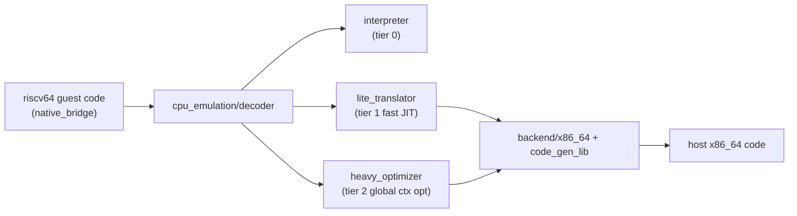

**AIDL toolchain.** `system/tools/aidl` (78 commits) gains the `@VersionSupport(version=N)` interface annotation, registered in `system/tools/aidl/aidl_language.cpp` (`AidlAnnotation::Type::VERSION_SUPPORT`) and enforced by `AidlInterface::VersionSpecificCheckValid()` plus `GetVersionSupportVersion()` in `aidl_language.h:372` — it pins a declared version to the interface's actual version. The Rust backend gains `no_std` variants, Soong rules are progressively sandboxed, and C++ tracing in generated code is now off by default.

**VINTF.** `system/libvintf` is quiet (8 commits, no contract change), but the compatibility surface advances via the new `compatibility_matrix.202704.xml` FCM plus placeholder values for the next dessert release.

### Notable integrations

- **bionic memory/page-size hardening.** The 16 KB page-size transition continues: a padded ELF test library, 16 KB backcompat-mode guard pages (added then reverted), and `RWX_MiddlePageProtection` regression coverage. The dynamic linker re-enables execute-only memory (XOM) in the linker binary, adds missing BTI instructions/ELF notes, and refines MTE handling (only calling `get_tagged_address` on readable sections). String routines move toward portable-SIMD (`strlen.cpp` from psimd, rustlib's x86_64 strlen replaced with psimd), plus optimized `wmemset`/`wmemcpy`/`memccpy`.
- **libcore OpenJDK uprev.** libcore (205 commits) imports broadly from `jdk-25.0.1-ga` and `jdk-25+26` — `java.util.concurrent` (+`.locks`, `.atomic`), `java.time.chrono`, `Character`, `ClassValue`, `Collections`, `Invokers`/`NamedParameterSpec` — alongside OpenJDK 21's 3 new `String` API methods. An `OpenJDK 25` entry is added to the `libcore-openjdk-analyzer` tool, signalling the class libraries tracking toward JDK 25.

## D.4 Native Services & Media

Android 17's native-services and media layer advances on several fronts. SurfaceFlinger gains scaffolding for **out-of-process rendering (OOPR)** -- a shared-memory render-command channel that lets a client record draw commands instead of pushing finished buffers -- plus a reworked multi-display modeset path. libbinder grows a generic-netlink diagnostics channel. On the media side, codec2 splits a stable NDK codec surface (`libapexcodecs`) out for the media APEX, the camera service adds a multi-client *shared session* mode, and the Photo Picker grows search and a category grid.

### New modules

- **`libapexcodecs` -- stable C2 codec NDK for the media APEX.** `frameworks/av/media/module/libapexcodecs/include/apex/ApexCodecs.h` defines a C ABI (`ApexCodec_ComponentStore`, `ApexCodec_Component`, `ApexCodec_Buffer`, with `ApexCodec_Component_create/start/flush/reset/process`, all `__INTRODUCED_IN(36)`) so the updatable media (swcodec) APEX can expose Codec2 software components across the APEX boundary. The 17 cycle wires real decoders onto it (`C2ApexAacDec`, `C2ApexOpusDec`) and `Codec2Client` learns to enumerate and rank ApexCodecs-based components.
- **libgui lockless IPC primitives for OOPR.** A cluster of new headers under `frameworks/native/libs/gui/include/gui/` -- `RenderCommandBuffer{,Producer,Consumer}.h`, plus the lock-free building blocks `MagicRingBuffer.h`, `LocklessStaticQueue.h`, `LocklessTripleBuffer.h`, `LocklessQueue.h`, and `RPointer.h` (relative pointers for shared memory) -- back the render-command channel below.

### Architecture changes

**SurfaceFlinger out-of-process rendering (OOPR).** The largest SF theme of the cycle. Instead of rendering into a `GraphicBuffer` and queueing it, a client records Skia draw operations into an ashmem-backed `RenderCommandBuffer` that SurfaceFlinger replays at composition time. `RenderCommandBufferProducer` (`frameworks/native/libs/gui/include/gui/RenderCommandBufferProducer.h`) owns the ashmem `IpcRenderRegion`, exposes `startRecording()`/`finishRecordingAndPostFrame()`, and attaches to a layer via a new `SurfaceComposerClient::Transaction` setter; bulk uploads move through the lock-free `MagicRingBuffer`. SF-side support adds `RenderResourceCache` (`frameworks/native/services/surfaceflinger/RenderResourceCache.{h,cpp}`), composition shaders, a frameId plumbed end-to-end for sync, and OOPR-aware stats. The path sits behind an aconfig flag; in 17 it is infrastructure, not yet the default render path.

#### OOPR render-command channel versus the classic buffer-queue path

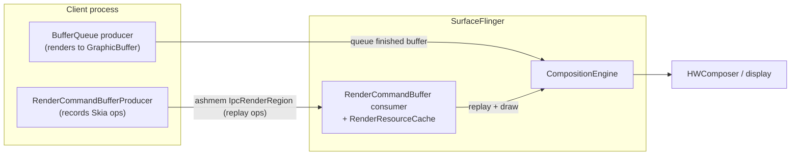

**Multi-display atomic modeset.** SF reworks how mode changes are committed across displays: a new display-command modeset implementation and state machine, a `SurfaceControl` API to drive an atomic modeset (`gui: Plumb SurfaceControl API for atomic modeset`), and flag-gated enablement. Related scheduler work moves pacesetter selection to peak FPS rather than vsync rate. HIDL power is removed from SF.

**libbinder generic-netlink reporting.** A new `frameworks/native/libs/binder/BinderNetlink.cpp` opens a generic-netlink socket to the kernel binder driver's `"binder"` family and consumes asynchronous reports: `BinderNetlink::open()/getReport()/readReport()` decode `BINDER_A_REPORT_ERROR` / `BINDER_A_REPORT_CONTEXT` attributes, giving userspace a diagnostics stream of driver-side binder errors keyed by context. The cycle also continues libbinder_rs `no_std` enablement plus RPC `IAccessor`/Parcel performance cleanups, and SensorService suspends events for frozen clients.

**Camera multi-client shared session.** The camera service adds a *shared session* mode letting multiple clients observe one camera. `frameworks/av/services/camera/libcameraservice/config/SharedSessionConfigReader.h` parses an XML descriptor of shared output streams (`SharedSessionConfig` with `surfaceType`, `streamUseCase`, `dataSpace`, color space); the `camera_multi_client` flag is retired and metrics for shared mode / current surface id are added, mirrored in metadata by a brand-new section (below).

### Notable integrations

- **New camera-metadata sections (`system/media`).** `system/media/camera/include/system/camera_metadata_tags.h` adds two sections ahead of `ANDROID_SECTION_COUNT`: `ANDROID_SHARED_SESSION` (`..._COLOR_SPACE`, `..._OUTPUT_CONFIGURATIONS`, both `fwk_only`) backing the shared-session feature, and `ANDROID_DESKTOP_EFFECTS` (`..._CAPABILITIES`, `..._BACKGROUND_BLUR_MODES`, `system`/HIDL v3.2) for camera-pipeline background blur. The cycle also adds an AGTM dynamic-range-profile entry and promotes `libcamera_metadata` to LLNDK.
- **codec2 surface migration and 10-bit color.** Codec2 migrates its `GraphicsTracker` and allocator onto `Surface`, and the codec stack gains 10-bit RGB / YUV support. The xHE-AAC encoder (`C2SoftXheAacEnc`) is fleshed out (presentation id, end-of-frame marking, live mode).
- **New Codec2 software components and AudioFlinger MMAP AIDL.** `frameworks/av/media/codec2/components/` gains APV codecs (`libcodec2_soft_apvdec`/`...apvenc`, `apv/C2SoftApvDec.cpp`) and an IAMF decoder (`libcodec2_soft_iamfdec`, `iamf/C2SoftIamfDec.cpp`). AudioFlinger also moves MMAP stream control onto stable AIDL via `IMmapStream` (`frameworks/av/media/libaudioclient/aidl/android/media/IMmapStream.aidl`, `createMmapBuffer`/`startTrack`/`stopTrack`).
- **Photo Picker: search and categories (`packages/providers/MediaProvider`).** The Kotlin Photo Picker becomes default on T+ and grows two major features under `photopicker/src/com/android/photopicker/features/`: a `search/` feature (local on-device search backed by AppSearch with a 50k-document limit and restricted-word filtering, plus a cloud-provider `SearchMediaService` SPI) and a `categorygrid/` feature (album/category browsing, including SD-card categories). The embedded picker gains a V2 API surface, `PhotoPickerSelectionParams`, and a location-metadata feature flag.
- **`packages/modules/Media` API surface.** Mostly housekeeping, but `MediaParser` is migrated onto Media3/ExoPlayer, gains track-aware seeking (per-track duration in `MediaFormat`), deprecates `SAMPLE_FLAG_DECODE_ONLY`, and the media-metrics AIDL is converted to stable AIDL.

## D.5 Runtime

Android 17 reshapes the lowest layers of the managed runtime. The headline is a ground-up rewrite of the Zygote in Rust as a new top-level project, alongside a new x86 micro-architecture target in ART and continued shrinking of the APEX-mounted runtime surface.

### New projects

**`system/zygote` (Native Zygote / `zygote_next`).** Android 17 introduces an entirely new top-level repository implementing the Zygote process server in Rust. It builds the `zygote_next` daemon (`system/zygote/zygote/src/bin/zygote.rs`) and is split into focused crates (`system/zygote/Android.bp`, `edition: "2024"`):

- `zygote-sys` wraps raw syscalls (`fork`, `clone3`, `epoll_wait`, `setresuid`/`setresgid`, `prctl`) and `/proc` introspection behind safe Rust (`system/zygote/zygote-sys/src/`).
- `zygote-messages` defines the system_server <-> Zygote IPC as a FlatBuffers schema (`system/zygote/zygote-messages/schemas/messages.fbs`) with derive-macro marshalling from `zygote-proc-macros`.
- `zygote-core` centralizes logging/tracing init and hooks into `atrace`.
- `zygote` holds the `Server` event loop and the `Species` abstraction.

The classic `frameworks/base` `ZygoteInit` Java path still exists; `zygote_next` is the native successor the platform is migrating toward. It logs a `NativeZygoteStarted` statsd atom on launch, runs at `nice -20`, and is built with ASYNC MTE (Soong `sanitize: { memtag_heap: true }` in `system/zygote/zygote/Android.bp`).

### Architecture changes

**The Species / subspecies process model.** Rather than the old fork-and-specialize flow, `zygote_next` models each preload-and-spawn environment as a *Species* (`system/zygote/zygote/src/species.rs`). The `Species` trait (lines 82-181) is a vtable of callbacks (`gather_reinitialization_data`, `speciate`, `gestate`, `set_seccomp_filters`, `sync_fd_state`, file/socket allow-list checks). Three implementations are registered statically: `AndroidNative` (`.../species/android_native.rs`), `LibApp`, and a `Mock` "Turtle" used in tests.

A key new capability is the **subspecies**: the schema defines `SpawnSubspecies` and the `SpawnSubspeciesAndroidNative` payload (`messages.fbs` lines 31-43, 87-93), and the server can spawn a *native child Zygote* on demand that re-initializes itself as a subspecies (`speciate()` runs before `re_initialize_as_subspecies()`). This generalizes the old "child zygote" idea into a first-class, per-payload spawn command carrying its own library paths, ABI list, preload function, and UID/GID range.

Native Zygote spawn dispatch through the Species abstraction

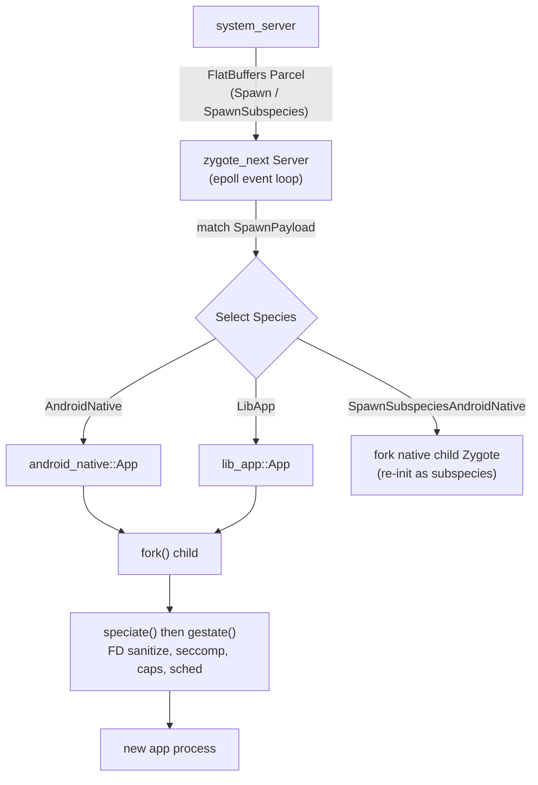

FD inheritance is now governed by explicit, dated allow-lists in each species (`android_native.rs` lines 41-77): each `AllowListEntry` records a reviewer and review date, and a unit test (`species.rs` `allow_list_audit`) fails the build when an entry goes stale (> 365 days). The transport also moved from a hand-rolled loop to `epoll`, with coalesced `SIGCHLD` handling and child exit status forwarded to ActivityManager over the unsolicited Zygote socket.

**ART: pantherlake x86 target.** ART adds Intel **Panther Lake** -- Intel's client (consumer/mobile) CPU generation, newer than the Kaby Lake / Alder Lake parts already known to ART -- as a recognized x86 / x86-64 instruction-set variant (`art/runtime/arch/x86/instruction_set_features_x86.cc` lines 43-115). Like other Intel client silicon it exposes AVX/AVX2 but not server-only AVX-512, so the variant is registered with SSSE3, SSE4.1/4.2, POPCNT, and AVX/AVX2 (feature string `ssse3,sse4.1,sse4.2,avx,avx2,popcnt`, bitmap 63) -- the same AVX2 tier as `alderlake`/`kabylake`, verified by the `X86FeaturesFromPantherlakeVariant` unit test for both 32- and 64-bit. Naming this variant lets `dex2oat` emit 256-bit AVX2-vectorized code for these CPUs on x86-64 Android targets such as the emulator and x86 form factors.

**DEX container format V41.** The runtime treats DEX **version 41** as the container format (`art/libdexfile/dex/dex_file.h` line 112, `kDexContainerVersion = 41`; `HeaderV41` at line 181). V41 files carry a container offset/size so multiple logical DEX files share one backing buffer; profile machinery was updated for the V41-only location syntax. `HasDexContainer()` / `ContainerSize()` (lines 165-174) gate the new behavior.

**Value and record classes.** `mirror::Class` gains first-class `IsValueClass()`/`SetValueClass()` and `IsRecordClass()`/`SetRecordClass()` accessors (`art/runtime/mirror/class.h` lines 341-357), backed by new `mirror::Class` flags (`kClassFlagValue`/`kClassFlagRecord`). This is groundwork for Valhalla-style value classes; records are now treated as normal classes carrying the record flag.

**GC tuning.** The collector re-enables eager `MADV_FREE`-based page release under the concurrent-copying GC (reverting an earlier temporary disable; `art/runtime/gc/collector/garbage_collector.cc` ~line 465), and GC knobs are now reported through the `ArtDeviceStatus` pulled atom for fleet telemetry.

### Notable integrations

**APEX: shrinking the runtime mount surface.** `apexd` continues to remove runtime components from the bootstrap APEX set. The `com.android.runtime` APEX is now gated behind `RELEASE_DEPRECATE_RUNTIME_APEX` in the bootstrap list (`system/apex/apexd/apexd.cpp` lines 169-180): when set, the runtime APEX disappears and its contents move into the base system image.

**EROFS file-backed mounts (no loop device).** A major mounting change lets `apexd` mount EROFS-format APEX payloads directly from the file, skipping the loop device entirely (`system/apex/apexd/apexd.cpp` lines 522-534): when file-backed mount is enabled, the payload is mounted with a `fsoffset=` option pointing at the in-APEX image. This is controlled by the `erofs_file_backed_mount` aconfig flag and runtime properties (`apexd_mount.cpp` lines 38-120). A companion `microdroid_no_loop_device` flag lets Microdroid activate block APEXes via `dm-linear` instead of loop devices. Together these cut the per-APEX loop-device cost as the mainline module set keeps growing. `apexd` also enables Direct I/O on loop devices and dm-verity verification in a tasklet for APEX payloads.

## D.6 Framework Core

The Framework Core delta is dominated by `frameworks/base` (15,196 commits). This section covers the genuinely platform-level changes: the new SDK level, new system services with public/system API surfaces, a new mainline SDK-extension version, and the maturation of desktop windowing in WindowManager Shell.

### New API level

Android 17 is API level 37, codename **CINNAMON_BUN**. The constant lives in `frameworks/base/core/java/android/os/Build.java`:

- `VERSION_CODES.CINNAMON_BUN = 37` (Build.java:1318), following `BAKLAVA = 36`.
- `VERSION_CODES_FULL.CINNAMON_BUN = 3700000` (Build.java:1545) — the full-version encoding (`SDK_INT_MULTIPLIER = 100000`) introduced to carry minor versions alongside the major `SDK_INT`. Both `SDK_INT_FULL` and `VERSION_CODES_FULL.CINNAMON_BUN` are public API (`core/api/current.txt:34998`, `:35049`).

The 17 public API surface is `core/api/current.txt` (~65k lines); new feature areas surface there and in `core/api/system-current.txt`.

### New modules

**AdvancedProtectionService** — a new device-hardening framework (Advanced Protection Mode). A single user-facing toggle drives a set of independent security "features" that each tighten one subsystem.

- System service: `frameworks/base/services/core/java/com/android/server/security/advancedprotection/AdvancedProtectionService.java`, registered in `services/java/com/android/server/SystemServer.java:1868`.
- Public/system API: `frameworks/base/core/java/android/security/advancedprotection/AdvancedProtectionManager.java`, reachable via `Context.ADVANCED_PROTECTION_SERVICE = "advanced_protection"` (`Context.java:6873`); `isAdvancedProtectionEnabled()` plus register/unregister callbacks are public (`core/api/current.txt:42225`).
- Feature hooks under `.../advancedprotection/features/`: `DisallowCellular2GAdvancedProtectionHook`, `DisallowInstallUnknownSourcesAdvancedProtectionHook`, `UsbDataAdvancedProtectionHook`, `MemoryTaggingExtensionHook` (MTE). The `@SystemApi` feature IDs in `AdvancedProtectionManager` (DISALLOW_CELLULAR_2G=0 … DISALLOW_USB=2, DISALLOW_WEP=3, ENABLE_MTE=4, plus insecure-Wi-Fi-autojoin and a11y-restriction) map one-to-one to those hooks.

**SupervisionService** — a first-class supervision (parental-controls) framework, splitting supervision out from DevicePolicy.

- System service: `frameworks/base/services/supervision/java/com/android/server/supervision/SupervisionService.java` (with `SupervisionSettings`, `SupervisionUserData`, `SupervisionPolicyMigrator`, `SupervisionRecoveryInfoStorage`), registered at `SystemServer.java:1705`.
- API/AIDL surface: `frameworks/base/core/java/android/app/supervision/` — `SupervisionManager.java`, `ISupervisionManager.aidl`, `Policy.java`/`PolicyKey.java`, `PackageUsagePolicy.java`, `SupervisionRecoveryInfo`. SystemUI and SettingsLib gained `supervision/` packages consuming it.

**AiSeal** — a new system service mediating access to an AiSeal virtual machine for on-device AI host services (landed very late, Nov 2025).

- Service: `AiSealSystemService`, registered at `SystemServer.java:3024`.
- API (`@SystemApi`, flag-gated `android.aiseal.aiseal_host_apis`): `frameworks/base/core/java/android/aiseal/AiSealManager.java` with `connectService(String)`, plus `Context.AISEAL_HOST_SERVICE = "aiseal_host"` and `PackageManager.FEATURE_AISEAL` (`core/api/system-current.txt:674`, `:4513`, `:5065`).

**NpuManager** (`npu`) — a flag-gated (`com.android.npumanager.npumanager_enabled`) NPU model-management surface. Only mock dirs exist under `core/java/android/npumanager/mock` and `core/java/android/ranging/mock`; the API hooks (`Context.NPU_SERVICE = "npu"`, `PackageManager.FEATURE_NEURAL_PROCESSING_UNIT`, system permissions) are declared in `core/api/*.txt` behind the flag, so treat this as a reserved/preview surface in `frameworks/base` rather than a shipped service (the real module lives under `packages/modules/NpuManager`, see D.12).

### Architecture changes

**Desktop windowing maturation (WindowManager Shell).** The largest WM-Shell expansion is the `desktopmode` package: `frameworks/base/libs/WindowManager/Shell/src/com/android/wm/shell/desktopmode/` is now one of WM-Shell's largest packages. `DesktopTasksController.kt` is the core orchestrator; supporting pieces include `DesktopImmersiveController`, `DesktopUserRepositories`, `DesktopMixedTransitionHandler`, `DragToDesktopTransitionHandler`, `DesktopModeMoveToDisplayTransitionHandler`/`CrossDisplay` handling, `DesktopWallpaperActivity`, and a sibling `desktopai/` package. Multi-display desktop (move-to-display, cross-display transitions), home-screen peek hot corners, and per-user desktop repositories are the notable additions over 16.

Desktop windowing transition flow (Shell):

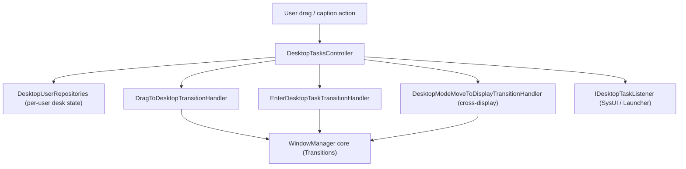

**SystemUI scene container (flexiglass).** SystemUI continues the shade/keyguard rewrite around the scene framework under `frameworks/base/packages/SystemUI/src/com/android/systemui/scene/` (`data`, `domain`, `ui/{view,viewmodel,compose}`, `shared`). Numerous `[flexiglass]` and `[Desktop]` shade/status-bar commits feed this; the Compose-backed `SceneWindowRootView` path is the direction of travel for the shade and lockscreen.

### Notable integrations

**SDK Extensions version 22 + new "C" extension.** `packages/modules/SdkExtensions` bumped the extension database to **version 22** (`gen_sdk/extensions_db.textpb` tail — ART/CONSCRYPT/MEDIA/MEDIAPROVIDER/PERMISSIONS/STATSD/TETHERING/APPSEARCH/etc. all at 22). The releases mechanism gained a new per-dessert extension axis for Android 17, "**c**":

- `derive_sdk/derive_sdk.cpp:85` iterates desserts `{"r","s","t","ad_services","u","v","b","c"}`; `:244` adds `relevant_modules.insert(kCModules…)` and sets the `c` extension when `IsAtLeastC()`.
- `sdk-extensions-info.xml` gained the C extension entries; Conscrypt was added to SDK extensions (incl. `EchConfigList`/`InvalidEchDataException` ECH APIs), and `android.net.dns`/`DnsResolver` were exposed S+. AD_SERVICES/EXT_SERVICES are frozen at 20 per `gen_sdk/gen_sdk.py:134`.

This is the mainline-API mechanism that lets modules ship API additions to older OS versions independently of the OS dessert; v22 is the Android 17 baseline, and the new `c` axis lets future module updates target "Android 17+".

## D.7 Framework Services

Android 17 reorganizes several framework-service-adjacent subsystems. The headline is a brand-new native memory daemon (`mmd`) taking over ZRAM management from system_server and adding per-process writeback/prefetch. The Permission/Privacy module grows an agent-activity surface and Private Compute Core (PCC) awareness, while UprobeStats and Profiling ship as prebuilt module SDKs.

### New projects

**`system/memory/mmd` (Modern Memory Daemon).** Android 17 introduces `mmd`, a new native Rust daemon centralizing memory-management configuration and ZRAM tunables (`system/memory/mmd/README.md`), unifying what was fragmented across `swapon_all`, `config.xml` overlays and `ro.zram.*` properties and pulling swap management out of system_server. It registers a Binder service named `mmd` (`system/memory/mmd/src/main.rs:203-205`) exposing the `IMmd` AIDL interface (`system/memory/mmd/aidl/android/os/IMmd.aidl`). A dedicated `mmd_setup` service (`system/memory/mmd/src/mmd_setup.rs`), started by init, performs first-boot ZRAM activation. When `mmd.zram.enabled` is set, ZRAM setup inside `swapon_all` becomes a no-op and the legacy overlay config is ignored.

### New modules

**UprobeStats prebuilt module SDK.** The uprobe-based tracing module (attaching BPF uprobes to instrument method calls and emitting results as statsd atoms) now ships a prebuilt module SDK: `sdk { name: "uprobestats-module-sdk" }` (`packages/modules/UprobeStats/apex/Android.bp:87-88`). In A17 its Rust `core` crate gained a typed `UprobeStatsError` and a `Handler` trait carrying `MAP_PATH`/`PROG_PATH` constants, granular BPF-attachment error reporting, and batched event delivery in `UprobeStatsBridgeServiceImpl`. New BPF handlers cover accessibility and "disruptive app" detection, plus generic instrumentation resolving primitive call arguments from registers.

**Profiling prebuilt module SDK + anomaly detector.** The on-device Profiling module likewise ships `sdk { name: "profiling-module-sdk" }` (`packages/modules/Profiling/apex/Android.bp:103-104`). A17 adds an `AnomalyDetectorService` (`.../anomaly-detector/service/java/com/android/os/profiling/anomaly/AnomalyDetectorService.java`), gated by an `anomaly_detector_core_c` flag, that evaluates rule-based signals (such as a `BinderSpamAnomalyDetector`) and triggers Perfetto traces. A dedicated `MemoryAnomalyRateLimiter` throttles memory-limit anomaly profiling before requests reach `ProfilingService`.

**Web App (PWA) service.** New `com.android.webapp` APEX installs/manages Progressive Web Apps, publishing `WebAppManager` under `Context.WEB_APP_SERVICE` (`"web_app"`) via an AIDL system service, gated by `enable_web_app_service_v2` (namespace `lse_desktop_experience`) (`packages/modules/WebApp/framework/java/android/content/pm/webapp/WebAppManager.java`).

**Wired Serial API + native daemon.** A wired serial-port API (`Context.SERIAL_SERVICE`, `"serial"`), distinct from USB serial: `SerialManager`/`SerialPort` in `frameworks/base/core/java/android/hardware/serial/`, backed by `SerialManagerService` in `SystemServer.java`. A Rust daemon registers the lazy binder `native_serial` behind the `enable_wired_serial_api` flag (`frameworks/native/services/serialservice/rust/service.rs:53`).

**Process Memory Guardian Daemon (pmgd).** Native Rust per-process daemon watching each target process's cgroup-v2 `memory.high` pressure and `anon_limit_in_mb`, killing offenders after a reclaim grace period and emitting kill telemetry as statsd atoms (`system/memory/guardian/README.md`). Complements `mmd` with granular per-process enforcement.

**New system_server services.** Three managers join `SystemServer.java`, each with a `Context.*_SERVICE` constant: `MultisensoryService` (audio-haptic, `MULTISENSORY_MANAGER_SERVICE`), `ContentRestrictionService` (`CONTENT_RESTRICTION_SERVICE`), and `PccSandboxManagerService` (Private Compute Core, `PCC_SANDBOX_SERVICE`) (`frameworks/base/core/java/android/content/Context.java`).

### Architecture changes

**mmd ZRAM lifecycle and per-process writeback/prefetch.** After boot, `mmd_setup` activates ZRAM and calls `swapon` with an optional swap priority; A17 added explicit swap-priority and multi-device support (`mmd.zram.num_devices`, per-device properties), packing priority into the swap flags via `SWAP_FLAG_PREFER` (`system/memory/mmd/src/zram/setup.rs:40-73`). ZRAM maintenance (idle writeback, recompression) is no longer driven by system_server's own logic; system_server sends `doZramMaintenanceAsync()` hints over Binder and `mmd` applies its own policy.

The genuinely new low-memory path is **per-process** ZRAM operations. `IMmd` gained `supportsProcessMemoryZramOps()`, `asyncWritebackProcessZramMemory(pidfd, callback)` and `asyncPrefetchProcessZramMemory(pidfd)` (`system/memory/mmd/aidl/android/os/IMmd.aidl:51-80`). Writeback targets a single process by `pidfd`, pushes its ZRAM-resident pages to the backing device, and reports a `WritebackStatus` plus bytes written through `IMmdProcessWritebackCallback`. Prefetch is the inverse: it pulls a process's written-back pages back into the compressed pool before a cached app is resumed. These ride new zram kernel ioctls (`ZRAM_ANDROID_IOC_PROCESS_WRITEBACK_CMD`, `..._PREFETCH_CMD`) wrapped in `system/memory/mmd/src/zram/per_process_ioctls.rs`.

Internally `MmdService` runs a two-level work queue (`system/memory/mmd/src/service.rs:68-146`): prefetch goes on a high-priority `prefetch_work` deque, writeback and periodic maintenance on low-priority `other_work`. A prefetch request for a pid cancels any still-pending writeback for that process (matched via `pidfds_likely_equals`), so a resume cannot race a writeback about to evict the very pages being prefetched.

mmd per-process ZRAM writeback and prefetch flow

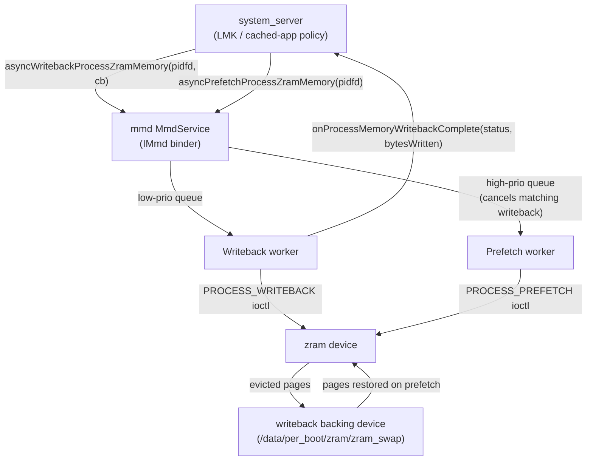

**Permission / Privacy: agent activity and PCC awareness.** The Permission module (PermissionController, role-controller, Safety Center, 533 commits) has two architectural threads. First, a new *agent activity / agent timeline* privacy surface tracks which AI agents accessed user data, with 24-hour and 7-day windows, under new `appinteraction` and `appfunctions` source trees (e.g. `.../permissioncontroller/appinteraction/domain/model/v31/AgentActivityItem.kt`, `.../appfunctions/ui/handheld/v37/AgentUsageDetailsFragment.kt`) behind an agent-activity flag. Second, Private Compute Core awareness threads through permission/Safety Center UID checks: Safety Center resolves a PCC sandbox UID back to its owning app UID before comparison (`packages/modules/Permission/.../safetycenter/SafetyCenterService.java`), and the `PERSONAL_CONTEXT_*` signature permissions are now marked `allowedInPrivateComputeCore`.

**Private space role policy.** Role qualification gained per-package and cross-user hooks. `RoleBehavior` adds `isPackageAllowedToBypassQualificationAsUser(...)`, and `Role` now treats `EXCLUSIVITY_PROFILE_GROUP` roles as unavailable to private-space profiles unless the device is organization-owned (`.../role-controller/java/com/android/role/controller/model/{RoleBehavior,Role}.java`).

### Notable integrations

**statsd metrics pipeline and io_uring.** The StatsD module (130 commits) added an `io_uring`-based socket listener for atom ingestion, guarded behind a new minimum API level 37: `IO_URING_API_VERSION 37`, activated only when both `flags::use_iouring_socket_listener()` and runtime support are present (`packages/modules/StatsD/statsd/src/main.cpp:52-119`). statsd also handles `SIGTERM` cleanly via its `stop()` path and refines UID mapping for sandbox/SDK-sandbox UIDs.

**mmd as a statsd producer.** `mmd` reports its own ZRAM telemetry as statsd atoms via `statslog_rust`: `ZramSetupExecuted` from the setup service, plus `ZramMaintenanceExecuted`/`ZramMmStatMmd`/`ZramIoStatMmd`/`ZramBdStatMmd` from maintenance (`system/memory/mmd/src/atom.rs:29-39`). UprobeStats and the Profiling anomaly detector are likewise statsd producers, so A17's memory, tracing, profiling and metrics subsystems are increasingly stitched together through the statsd pipeline.

## D.8 Connectivity

Android 17's connectivity surface is dominated by one cross-cutting theme: **generic ranging**. A new system service unifies UWB, Bluetooth Channel Sounding, Wi-Fi RTT and BLE RSSI behind a single `RangingManager` API, and the controller-level stacks in Bluetooth, Wi-Fi and UWB all grew the primitives that feed it. Alongside ranging, Wi-Fi gained a new Unsynchronized Service Discovery (USD) service, NFC added a gesture-exchange API for tap-to-X, and telephony continued building out satellite / NTN support.

### New projects

**`hardware/nxp/uwb` -- NXP UWB vendor HAL.** A new repository providing a concrete vendor implementation of the `android.hardware.uwb` AIDL HAL for NXP's SR1XX UWB chipset family. Previously the tree shipped only the HAL interface and a stub; this repo carries a shippable implementation OEMs using NXP silicon can build directly.

The AIDL service implements `IUwb`/`IUwbChip` (`hardware/nxp/uwb/aidl/uwb.h:33`, `uwb_chip.h:35`) and registers as `android.hardware.uwb-service.nxp` (init service `vendor.uwb_hal`, declaring `IUwb` v1). The thin AIDL layer bridges into the legacy NXP HAL core -- `open()`/`coreInit()`/`sendUciMessage()` forward to `phNxpUciHal_open`/`_coreInitialization`/`_write` (`hardware/nxp/uwb/aidl/uwb_chip.cpp:69,90,101`) -- with the bulk of the logic (HBCI firmware download, TML transport, calibration, session/time-sync) under `halimpl/` and board profiles like `example_config/SR1XX`. This is what makes UWB hardware ranging work on NXP-based devices feeding the ranging stack below.

### New modules

**Generic Ranging stack (`packages/modules/Uwb/ranging`).** A new multi-technology ranging subsystem ships inside the UWB module, exposing the public `android.ranging` framework (50 classes under `packages/modules/Uwb/ranging/framework/java/android/ranging`), fronted by `RangingManager` registered as the `Context.RANGING_SERVICE` system service (`RangingManager.java:55`). The backing `RangingService extends SystemService` and `publishBinderService(Context.RANGING_SERVICE, ...)` (`service/.../RangingService.java:25,38`); SystemServer loads it from the UWB apex JAR via `startServiceFromJar(RANGING_SERVICE_CLASS, RANGING_APEX_SERVICE_JAR_PATH)` (`frameworks/base/services/java/com/android/server/SystemServer.java:3310-3312`).

The service abstracts six underlying technologies behind a common `RangingAdapter` (`service/.../RangingTechnology.java:39-46`): `UWB`, `CS` (Bluetooth Channel Sounding, formerly HADM), `RTT` and `RTT_STATION` (Wi-Fi 802.11mc), `RSSI` (BLE) and `WIFI_PD` (Wi-Fi Proximity Detection). Per-technology API params live in subpackages (`ble/cs/BleCsRangingParams`, `wifi/rtt/RttRangingParams`, `wifi/pd/WifiPdRangingParams`, `uwb/UwbRangingParams`). Apps express a `RangingPreference`/`SessionConfig` and the service picks, fuses and switches technologies at runtime through a `fusion` engine (`FilteringFusionEngine`, `DataFusers`) and session `engine` classes including make-before-break / break-before-make handoff. Out-of-band negotiation (`oob/`) lets two devices agree on a technology over BLE.

**Wi-Fi USD service (`packages/modules/Wifi/.../usd`).** Unsynchronized Service Discovery gets a dedicated `@SystemApi UsdManager` (`framework/java/android/net/wifi/usd/UsdManager.java:65-67`, gated on `Flags.FLAG_USD`) registered as `Context.WIFI_USD_SERVICE` (`WifiFrameworkInitializer.java:124-132`), with `PublishSession`/`SubscribeSession` and a new `IUsdManager` AIDL. USD also threads into Wi-Fi Aware and Wi-Fi P2P (`WifiP2pUsdBasedServiceDiscoveryConfig`, plus `WifiP2pUsdBasedServiceResponse` in the `nsd/` subpackage).

**USB device authorization (`frameworks/native/services/usbauthservice`).** A new Rust daemon implementing the `IUsbAuthManager` binder service (`service.rs:15`) behind the framework-internal `android.hardware.usb.auth` AIDL interface (`Android.bp:23`, depends on `android.hardware.usb.auth-rust`; defined in `frameworks/base/core/java/Android.bp`, not a vendor HAL). It authorizes attached USB devices against an allow / interactive-PIN policy engine (`rules.rs`, `authorization.rs`) -- desktop / large-screen security hardening.

**AOSP IMS stack (`packages/modules/ImsStack`).** A full in-tree IMS stack shipped as the `com.android.imsstack` privileged app (`java/.../ImsStackApp.java`, `java/Android.bp:111`): a Java service over JNI driving a native `libimsstack` C++ SIP engine (`native/libimsstack/Android.bp`, `cc_library_shared "libimsstack"`).

**LE Audio Peripheral (server) role (`packages/modules/Bluetooth`).** The stack gained an in-stack LE Audio server/acceptor role -- the "BAP Peripheral" `LeAudioServer` (`system/bta/le_audio/server/server.cc:63,66`) -- backed by new Rust ISO and periodic-sync managers (`system/rust/src/le_audio/iso_manager/manager.rs`, `periodic_advertising_sync/manager.rs`), complementing the LE Audio HAL / broadcast-sink noted in D.3.

**Mainline supplicant (`packages/modules/Wifi`) -- architecture change.** wpa_supplicant is moving into the Wi-Fi mainline module via the unstable `IMainlineSupplicant` AIDL (`aidl/mainline_supplicant/.../IMainlineSupplicant.aidl:26`), reached through `MainlineSupplicantAidlManager` binding the `wifi_mainline_supplicant` service (`service/.../MainlineSupplicantAidlManager.java:44,46`).

### Architecture changes

**Bluetooth Channel Sounding feeds the ranging stack.** The Bluetooth stack gained a Channel Sounding pipeline: the GD HCI `channel_sounding/` metrics layer, a `distance_measurement_manager_impl` driving `METHOD_CS` sessions with security levels and producing distance/velocity results (`system/gd/hci/distance_measurement_manager_impl.cc:45,361`), and the RAS (Ranging Service GATT profile) types under `system/bta/ras/`. A new `enforce_security_for_ranging` flag hardens CS ranging sessions, and the results surface to apps via the `CS` adapter in the generic ranging service. Bluetooth (`packages/modules/Bluetooth`, the release's largest module delta) also continued its LE Audio buildout in parallel.

How the generic ranging service multiplexes the radios:

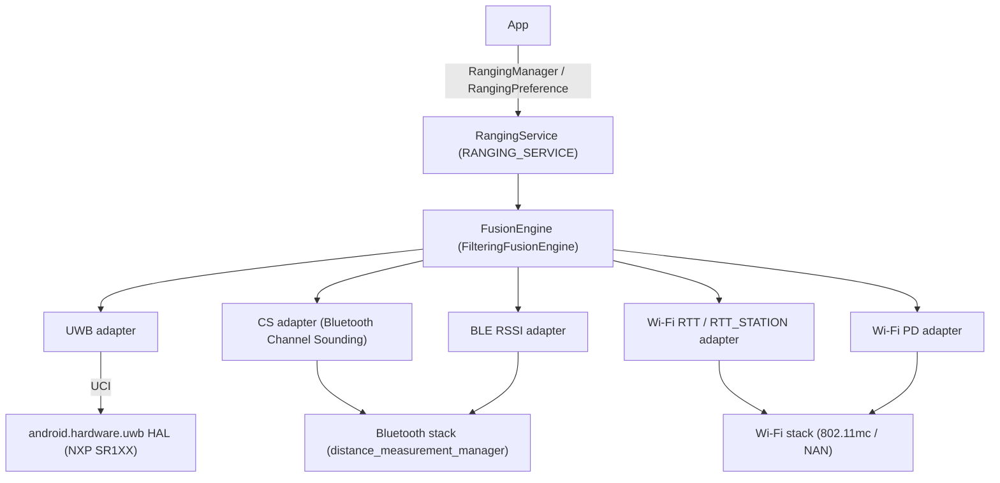

### Notable integrations

**Telephony satellite / NTN.** The satellite stack under `frameworks/opt/telephony/.../satellite` keeps expanding: carrier-roaming NTN APIs (`isInCarrierRoamingNtnMode`, `getCarrierRoamingNtnAvailableServices`), NR-NTN signal-strength keys (SSRSRP/SSRSRQ/SSSINR), satellite enable/suspend APIs, emergency-messaging routing carrier configs, and new RIL constants for the 26Q2 Satellite HAL. `NtnCapabilityResolver`, `SatellitePlmnNetworkInfo` and `SatelliteController` carry the bulk; the framework now lists satellite PLMNs and ICCID to the modem via `updateSystemSelectionChannels`. On the app side, `packages/services/Telephony` tracked these with satellite messaging/SOS UI and carrier-config plumbing.

**NFC gesture exchange / tap-to-X.** NFC added a `NfcGestureExchangeCallbackListener` and `PERFORM_GESTURE_EXCHANGE`-gated APIs (`packages/modules/Nfc/framework/java/android/nfc/`) plus home-screen tap-to-X routing, building on the existing observe-mode and wallet-role infrastructure. Observe mode's "always on" variant was removed.

**Wi-Fi Aware.** Aware reporting and pairing matured: group-key cipher-suite reporting, `AwarePairingConfig` / supplicant-driven pairing verification with NPKSA handling, USD-based discovery, and `UsdPeerId` carried in `RangingResult` -- another path connecting Aware discovery to the unified ranging results.

**Connectivity (Tethering/NetworkStack).** The 877-commit Connectivity delta is mostly incremental hardening of Tethering, NetworkStack and ConnectivityService; the notable new-capability item is the device-to-device path under `nearby/` gated by `enable_d2d_connectivity_service` (`packages/modules/Connectivity/nearby/flags/d2d_connectivity.aconfig`).

## D.9 Security

Android 17 reshapes the hardware-backed security stack around two themes: moving the secure services (KeyMint, SecureClock, SharedSecret, RKP, Gatekeeper) into protected VMs, and introducing a general in-process sandboxing primitive (LFI) so untrusted native code can run inside trusted processes. Several new repos appear: a dedicated Weaver implementation, the SEE AuthMgr, and an out-of-tree key-attestation verification library.

### New projects

**`system/lfi` — Lightweight Fault Isolation runtime support.** A new repo holding the shared glue to compile and load LFI-sandboxed libraries. Per `system/lfi/README.md` it has three pieces: `boxrt` (runtime stubs linked into the sandboxed library, e.g. `abort`/`brk`/`pause` as raw `svc` syscalls in `boxrt/boxrt_minimal.c`), `allocator` (a thread-safe spinlock minimal allocator, `allocator/alloc.c`), and `relocator` (a minimal `-static-pie` loader doing relocations for `lfi-bind`, `relocator/relocate.c` + `start.S`). LFI is the software-fault-isolation scheme from Stanford/LLVM that confines a library's memory accesses and control flow to a sandbox region via verified machine code rather than a separate address space. `system/lfi/Android.bp` defines `cc_defaults` `system_lfi_defaults` (`lfi_supported: true`, `nocrt`, `stl: "none"`, statically linking `libc_lfi`/`libm_lfi`, arm64-only, `apex_available: ["com.android.media.swcodec"]`) — the first production consumer is the swcodec APEX.

**`system/weaver` — Weaver anti-rollback secret storage TA.** A new Rust workspace (`Cargo.toml` members `ta`, `wire`) implementing the `IWeaver` HAL backed by a secure-environment trusted application. Weaver stores per-slot key/value secrets for credential throttling: each `Slot` (`ta/src/lib.rs`) holds a `slot_key`, `slot_value`, `last_checked_timestamp`, and `failure_counter`, and the TA returns `Error::IncorrectKey(ms)` / `Error::Throttle(ms)` to enforce hardware-backed retry back-off that survives reboots. The HAL service (`hal/src/lib.rs`) is a thin `IWeaver` binder shim serializing requests as CBOR over a `SerializedChannel` to the TA, reusing the shared `system/security/hals/*` channel + wire crates.

**`system/see/authmgr` — Secure Execution Environment authentication manager.** Rust crates split into a frontend (`authmgr-fe`), backend (`authmgr-be`, `authmgr-be-impl`, `authmgr-be-storage-impl`), and `authmgr-common`, plus a `secure-storage-aidl-wrapper`. AuthMgr implements `hardware/interfaces/security/see/authmgr/IAuthMgrAuthorization.aidl` (cited in `authmgr-fe/src/authorization.rs`), authenticating protected VMs (pVMs) to secure-side trusted apps using DICE certificate chains and policies: `AuthMgrFe::authenticate` presents an `ExplicitKeyDiceCertChain` + `SignedConnectionRequest`, and the backend deduplicates instances by instance-id and DICE mode and enforces rollback protection. The 42 commits add two DICE-chain modes per instance id, override points for DICE policy, and secure-storage staging/commit plus `read_file`/`write_file` APIs.

### New modules

**`external/lfi/*` — LFI toolchain (external, integration only).** Upstream components vendored to back the in-process sandbox: `lfi-verifier` (validates an ELF emits only sandbox-safe instructions), `lfi-runtime` (`liblfi`: reserves/maps the sandbox address space, transfers control in/out, emulates host calls), `lfi-bind` (Go trampoline generator), `rlbox`/`rlbox-lfi` (RLBox API with an LFI backend), and `disarm`/`fadec` (AArch64/x86 decoders for the verifier). Integrated, not modified: the build links `liblfi` and the sandboxed `libopus_lfi` into `frameworks/av/media/module/libapexcodecs`, and codec2 takes the in-process path when `android.media.codec.in_process_sw_codec_lfi` is set (`frameworks/av/media/codec2/hal/client/client.cpp:1909,2034`) — running an untrusted software decoder inside the codec process with memory safety enforced by verified code rather than a separate process.

**`external/keyattestation` — Android Key Attestation verifier (external, integration only).** A Kotlin library (`Android.bp` builds `java_library "keyattestation"`, visible to `//frameworks/base/core/java` and vendor) verifying key-attestation certificate chains produced by KeyMint/RKP. Its `Verifier` takes trust-anchor, revoked-serial, and time sources and returns a `VerificationResult` exposing the attested public key, security level, verified-boot state, and device info, with pluggable `ChallengeChecker`s. It ships its own root set (`roots.json`, `keyattestation_roots` filegroup), mirrored from `github.com/android/keyattestation`.

### Architecture changes

**KeyMint and friends move into a protected VM (keymint-in-vm).** The largest sepolicy theme this cycle (`system/sepolicy`, 452 commits) is exposing the hardware security HALs from inside a VM. New `accessor` service support is defined, and accessor permissions are added for `IRemotelyProvisionedComponent`, `ISecureClock`, `ISharedSecret`, `IProvisioning`, and (separately) `gatekeeper-in-vm` for `IGatekeeper`. `ISharedSecret/security_vm` and a KeyMint provisioning service context are added to `service_contexts`. The effect: KeyMint, RKP, SecureClock, SharedSecret, and Gatekeeper can run in a `security_vm` (Microdroid/pVM), reached by the platform through accessor services rather than a vendor HIDL/AIDL HAL on the host. This is what AuthMgr's pVM authentication underpins.

**KeyMint reference TA gains ML-DSA (post-quantum) keys.** `system/keymint` (63 commits) adds ML-DSA signature support to the Rust reference TA, including ML-DSA-87 and PKCS#8 seed import. Keystore2 follows: `system/security/keystore2/src/key_parameter.rs` and `security_level.rs` handle ML-DSA, metrics record ML-DSA variants, and `Algorithm.aidl` adds the enum. KeyMint also reworks attestation: attestation IDs are parsed out of the `KeyParam` list, `Cow` strings hold the application attestation id and encoded Root-of-Trust, and destroying attestation IDs is removed in HAL v5 / AIDL >= 500. The timestamp interface is consolidated into the KeyMint HAL (`hal_timestamp_service` removed from `hal_keymint`).

The diagram below shows how an untrusted software codec runs inside the trusted swcodec process under LFI.

#### LFI in-process software-codec sandbox flow

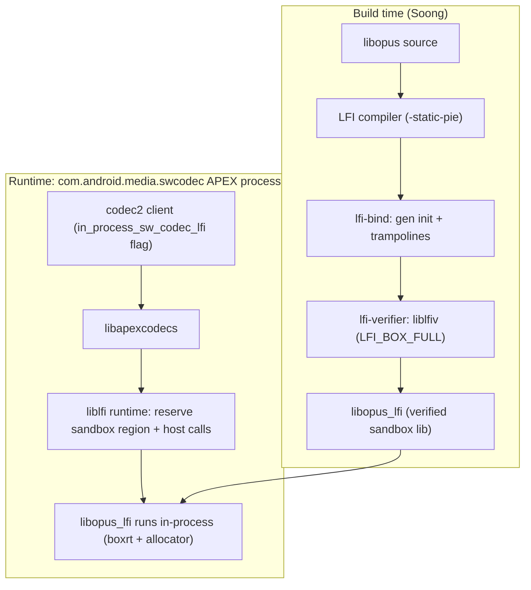

### Notable integrations

- **RKP module** (`packages/modules/RemoteKeyProvisioning`, 55 commits): hardening rather than new architecture — fallback to a default provisioning URL when the server omits/returns a bad one, reset-to-default config on repeated failures/boot, Widevine provisioning moved to the request POST body and gated on model + OEMCrypto/crypto version, device-reset reporting via `UnverifiedDeviceInfo`, and support for the updated `requestSignedCertificates` server API and Sigma.
- **Weaver warmup/timeout** flags (`android.security.enable_weaver_warmup`, `enable_weaver_get_timeout`, `frameworks/base/core/java/android/security/flags.aconfig`) are consumed by `LockSettingsService` and the keyguard/bouncer UI to pre-warm the Weaver TA before the credential prompt, reducing unlock latency for the new throttling path.
- **PCC / Private Compute Core** is granted keystore access in sepolicy ("Allow keystore operations from within PCC").

## D.10 UI Framework

Between Android 16 and the Android 17 release branch the UI-framework repos saw their largest churn in the desktop-windowing path (Launcher3, 1978 commits), in the graphics stack (ANGLE promoted toward the default GLES driver, 1335 commits), and in the shared SystemUI/theming libraries.

### New modules

`frameworks/libs/systemui` gained a standalone `dynamiccolors` Android library (`frameworks/libs/systemui/dynamiccolors/Android.bp`) carrying light and dark Material color resources (`res/values/colors.xml`, `res/values-night/colors.xml`) so the dynamic-color palette can be consumed without pulling in the whole Monet stack.

Launcher3's recents/overview is now built as a *windowed* surface rather than a full activity. The new `com.android.quickstep.window` package (`quickstep/src/com/android/quickstep/window/RecentsWindowManager.kt`, `RecentsWindowContext.kt`, `RecentsWindowRootView.kt`, `RecentsWindowSwipeHandler.java`, `RecentsWindowTracker.kt`) hosts Overview inside a `WindowlessWindowManager` / `SurfaceControlViewHost`, gated by `RecentsWindowFlags`, so Overview can coexist with freeform desktop windows on one display.

### Architecture changes

**Per-display taskbar.** Taskbar state is no longer a single global; it is keyed per display through `DisplayModel<PerDisplayTaskbarResource>` (`quickstep/src/com/android/quickstep/DisplayModel.kt`, backed by a `SparseArray` and `PerDisplayRepository`). `TaskbarManagerImpl` (`quickstep/src/com/android/launcher3/taskbar/TaskbarManagerImpl.java`) holds an `mPrimaryDisplayId` plus an `mResources` `DisplayModel`, and creates/recreates a `TaskbarActivityContext` per display (`getTaskbarForDisplay`, `recreateTaskbarForDisplay`). Each `PerDisplayTaskbarResource` owns its own window context, config-change callback, and broadcast receivers, enabling an independent taskbar on external / connected displays in desktop mode.

**Desktop windowing in Launcher.** `TaskbarDesktopModeController` (`quickstep/src/com/android/launcher3/taskbar/TaskbarDesktopModeController.kt`) listens to `DesktopVisibilityController` and exposes display-scoped queries (`isInDesktopMode(displayId)`). `TaskbarRecentAppsController.kt` switches the taskbar's app row by mode: fullscreen shows most-recent tasks, desktop mode shows currently *running* tasks as `GroupTask`s. Desktop app launches route through dedicated remote transitions in the new `com.android.launcher3.desktop` package (`DesktopAppLaunchTransitionManager.kt` and siblings), and desktop mode resolves through `DesktopStateProvider.kt`, now gated by the platform `android.window.DesktopExperienceFlags` mechanism rather than ad-hoc Launcher flags.

#### Launcher3 desktop-windowing surface ownership

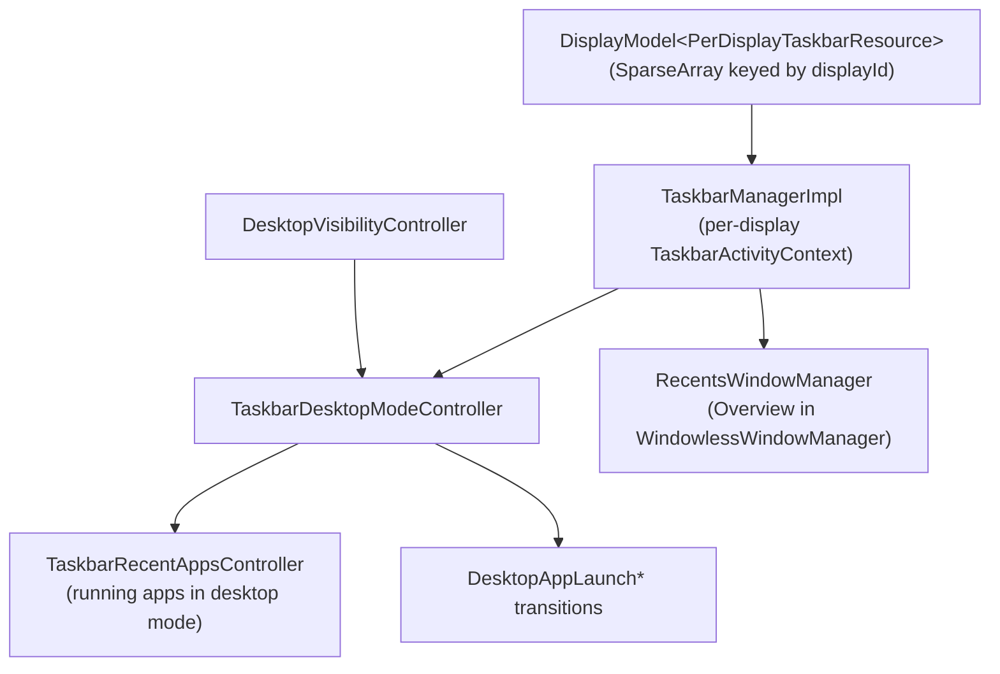

**Multi-seed Material color scheme.** `ColorScheme` (`frameworks/libs/systemui/monet/src/com/android/systemui/monet/ColorScheme.java`) now accepts a list of seed colors -- a `private final List<Integer> mSeeds` field, a `ColorScheme(List<Integer> seeds, boolean isDark, ...)` constructor and a `getSeeds()` accessor -- so a wallpaper can drive several palettes instead of one dominant seed.

### Notable integrations

**ANGLE as the default GLES driver.** Android 17 ships the ANGLE (GLES-over-Vulkan) drivers in every base system image: `base_system.mk` unconditionally adds `libEGL_angle`, `libGLESv1_CM_angle`, and `libGLESv2_angle` to `PRODUCT_PACKAGES` (`build/make/target/product/base_system.mk:493`). A product can make ANGLE the *default* GLES implementation by inheriting `angle_default.mk`, which sets `persist.graphics.egl=angle` via `PRODUCT_SYSTEM_EXT_PROPERTIES`. With that property set, the platform EGL loader resolves `libEGL`/`libGLESv2` to ANGLE instead of the vendor GL driver, so every GLES app runs through ANGLE's translator onto Vulkan -- one conformance-tested, driver-independent front end. (The 1335 ANGLE commits are an upstream refresh; only the build-time integration above is platform-visible.)

**Theme Service in the wallpaper/theming UI.** WallpaperPicker2 now routes color-overlay application through the platform Theme Service, gated by the framework flag `android.server.Flags.enableThemeService` (`packages/apps/WallpaperPicker2/src/com/android/wallpaper/config/BaseFlags.kt`, `isThemeServiceEnabled()`), alongside desktop-form-factor work in the wallpaper carousel and named custom icon themes for the home screen.

## D.11 System Apps

The front doors to Android 17's platform features land in two apps: **Settings** (2145 commits, the 2nd-largest app delta) and **DocumentsUI** (667 commits). Settings gains new feature dashboards (Supervision, desktop experience) and continues a large preference-framework migration; DocumentsUI gets a redesigned file-info experience, a search rebuild, and desktop/large-screen polish.

### New modules

**Settings: Supervision dashboard.** The most significant new Settings surface in 17 is the parental-supervision area, a new package under `src/com/android/settings/supervision/` (first commit 2025-01-21), built on the platform `android.app.supervision.SupervisionManager` and the new `ROLE_SUPERVISION` role. The landing page `SupervisionDashboardScreen.kt` exposes a primary on/off switch, a dynamically-built feature list, and a PIN-management entry point. Sub-areas:

- `webcontentfilters/` — Safe Search / Safe Sites toggles plus per-app browser/search filter screens.
- `appstorefilters/` — app-store content filtering (`SupervisionAppStoreFiltersScreen.kt`).
- `credentialmanagement/` — supervision PIN setup/change/delete and recovery (`SupervisionPinManagementScreen.kt`, `SupervisionPinRecoveryActivity.kt`).
- `ipc/` — a `SupervisionMessengerClient` plus request/response data classes letting a supervision client app inject preferences and supervised-app lists into the dashboard.

Setup/teardown uses dedicated activities (`SetupSupervisionActivity.kt`, `EnableSupervisionActivity.kt`, `DisableSupervisionActivity.kt`), gated behind `android.app.supervision.flags.Flags` (e.g. `enableSupervisionSettingsUiUpdates`).

**Settings: desktop experience developer toggles.** A new developer-options package `src/com/android/settings/development/desktopexperience/` (first commit 2025-02-13) surfaces the desktop-windowing work: `DesktopExperiencePreferenceController.java` (master `override_desktop_experience_features` toggle backed by `Settings.Global.DEVELOPMENT_OVERRIDE_DESKTOP_EXPERIENCE_FEATURES` and `android.window.DesktopModeFlags`), plus `DesktopModePreferenceController`, `DesktopModeSecondaryDisplayPreferenceController`, `FreeformWindowsPreferenceController` — the front door for Connected Displays / desktop mode.

### Architecture changes

**Settings: continued Catalyst preference-screen migration.** Screens are increasingly Kotlin classes annotated `@ProvidePreferenceScreen` implementing `settingslib.metadata` interfaces (`PreferenceScreenMixin`, `PreferenceAvailabilityProvider`, `PreferenceLifecycleProvider`) instead of XML + `PreferenceController` pairs. ~217 new `*Screen.kt` files were added since the 16 branch; ~233 files now reference `@ProvidePreferenceScreen`. The framework also feeds App Functions metadata, so each migrated screen doubles as a machine-readable surface for on-device agents.

**DocumentsUI: feature gating consolidated in `FlagUtils`.** Nearly every behavioral change is gated through a single `src/com/android/documentsui/util/FlagUtils.kt` (added this cycle), centralizing ~24 aconfig flags with dev overrides — the cleanest map of what changed: `isUseMaterial3FlagEnabled`, `isSearchV2Enabled`, `isGetInfoDialogEnabled`, `isUsePeekPreviewFlagEnabled`, `isDesktopFileHandlingFlagEnabled`, `isDesktopUxPhase2FlagEnabled`, `isSingleClickToSelectEnabled`, `isTrashFlowEnabled`, `isUseApprovedDocumentHandlerEnabled`, `isMovingContentIntoPrivateSpaceEnabled`, `isUseLocalSearchProviderEnabled`, and more. Several gates AND with `isUseMaterial3FlagEnabled()`, so the Material 3 redesign is the umbrella the rest hang off.

### Notable integrations

**DocumentsUI: "Get Info" / metadata redesign.** A new `src/com/android/documentsui/files/getinfo/` package (`GetInfoDialogFragment.kt`, `GetInfoViewModel.kt`, `MetadataUtils.kt`) and a `peek/` package (`PeekFragment.kt`, `PeekViewManager.kt`, `Metadata*SheetController.kt`) add a rich file-details dialog and peek preview, flag-gated by `isGetInfoDialogEnabled` / `isUsePeekPreviewFlagEnabled`. A reactive summary column is driven by `dirlist/SummaryProviderManager.kt` and `SummaryConsentFragment.kt`.

**DocumentsUI: Search V2.** A rebuilt search stack under `queries/` (`SearchOptionsController.kt`, `SearchOptionsState.kt`, `FileTypeOption.kt`, `LastModifiedOption.kt`, `SearchLocationOption.kt`) plus new loaders (`loaders/SearchLoader.kt`, `loaders/QueryOptions.kt`) provide filterable search by type/date/location and an optional local search provider (`isUseLocalSearchProviderEnabled`).

**DocumentsUI: desktop / large-screen polish.** A Kotlin rewrite of the sidebar into a RecyclerView nav rail (`sidebar/RecyclerRootsAdapter.kt`, `RootsRecyclerViewHandler.kt`) and a Kotlin breadcrumb stack (`breadcrumbs/Breadcrumb{Controller,Model,View}.kt`) support desktop UX phase 2, alongside single-click-to-select and drags from other apps.

**DocumentsUI: approved document handlers & private space.** A new `approveddochandlers/` package (`ApprovedDocHandlers.kt`, `ApprovedDocMenuController.kt`, gated by `isUseApprovedDocumentHandlerEnabled`) governs which apps may open documents via signature-based trust. The picker also gains "move content into Private Space" (`isMovingContentIntoPrivateSpaceEnabled`) and a new `picker/TrampolineActivity.kt` / `PickFilesFragment.kt`.

## D.12 AI & Devices

Android 17 pushes on-device AI deeper into the platform: a new NPU Manager mainline module arbitrating access to neural accelerators, a new PersonalContext system app building an on-device personal-context surface, and the first vendoring of the Khronos OpenXR SDK headers alongside a flag-gated Android XR API surface (covering both headsets and MicroXR glasses). CHRE grows a high-throughput data-flow subsystem for always-on sensing.

### New projects

`packages/modules/NpuManager` is a new launched APEX (`com.android.npumanager`, `min_sdk_version: 36`) shipping its own module SDK in 17 (`apex/Android.bp` defines `npumanager-module-sdk`). It is gated by the `RELEASE_NPUMANAGER_MODULE` release flag and the `npumanager_enabled` aconfig flag (`machine_learning` namespace, `flags/npumanager_flags.aconfig`), and contributes both a bootclasspath fragment (`framework-npumanager`) and a systemserver fragment (`service-npumanager`). Details in "New modules" below.

`packages/apps/PersonalContext` (`com.android.personalcontext`) is a new privileged, platform-signed, `product_specific` system app (`Android.bp` `PersonalContext_defaults`: `privileged: true`, `certificate: "platform"`) building an on-device personal-context layer that feeds assistant-style surfaces. Its `AndroidManifest.xml` declares `ContextUnderstanderService` implementations (`ChatUnderstanderService`, `NotificationUnderstanderService`, `ContextMenuUnderstanderService` under `src/com/android/personalcontext/understander/`) bound under `android.service.personalcontext.UnderstanderService` and guarded by `BIND_CONTEXT_COMPONENT_SERVICE`.

Its working components are tagged `android:privateComputeCore` and the app holds new `PERSONAL_CONTEXT_*` permissions (`PUBLISH_INSIGHTS`, `READ_SETTINGS`, `RECEIVE_HINTS`) plus `USE_ON_DEVICE_INTELLIGENCE`, so it runs inside the Private Compute Core sandbox and talks to on-device models rather than the network. Source subpackages (`memorygeneration/`, `magicrecall/`, `magicactions/`, `appfunctions/`, `aicore/`, AppSearch-backed `storage/appsearch/`) point to a personal-memory store driving recall and "magic action" suggestions, gated by the `enable_osi` aconfig master flag (`personal_context` namespace).

### New modules

NpuManager multiplexes on-device neural accelerators across competing apps. The framework surface is the `@SystemApi`, `@FlaggedApi`-gated `NpuManager` class (`Context.NPU_SERVICE`) at `framework/java/android/npumanager/NpuManager.java`. Apps do not get raw NPU access; instead they ask permission to load a model and the service answers when it is advisable. The binder contract (`framework/java/android/npumanager/INpuManagerService.aidl`) is admission control plus memory management:

- `canLoadModel`, `cancelModelLoad`, `notifyModelLoaded`, `notifyModelUnloaded`, `setPolicy`
- `createAllocator(INpuAllocatorCallback)` returning an `INpuAllocator`.

The system-server side (`service/java/com/android/server/npumanager/`, `NpuManagerService` / `NpuManagerServiceImpl`) implements pluggable model loading policies behind the abstract `NpuModelLoadingPolicy`: `BudgetModelLoadingPolicy` (memory-budget arbitration keyed on `KEY_MAX_BUDGET` and coarse `NpuModelSize` buckets of <1GB / 1-2GB / >2GB), `TurnTakingModelLoadingPolicy`, `StatusQuoModelLoadingPolicy`, all backed by a `PriorityManager`. Native buffer management is Rust-based (`service/jni/lib.rs`, `ndk/*.rs`) and exposes a C NDK surface (`ndk/include/android/npumanager/buffer.h`) with an `ANpuBuffer` priority range of 0-1000.

The module is paired with a new vendor HAL, `android.hardware.npu` (`hardware/interfaces/npu/`, AIDL v1), through which NpuManager informs the NPU of per-app priorities and receives work callbacks (`IScheduling`, `ISchedulingCallback`, `WorkInfo`, `StartReason`, `EndReason`, `SchedulingConfig`).

#### NpuManager admission-control flow

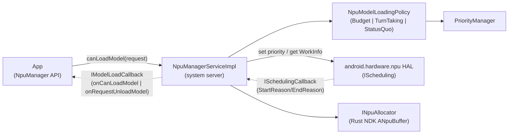

### Architecture changes

CHRE (`system/chre`, 536 commits) gains a new **data-flow** subsystem for high-throughput streaming between a single source and multiple sinks (nanoapps and other endpoints), using shared memory regions to minimise copies. The public API is `chre_api/include/chre_api/chre/data_flow.h` (events `CHRE_EVENT_DATA_FLOW_CREATED`, `_SINK_CREATED`, `_ALERT`, `_SINK_CONFIGURE_DONE`; calls like `chreDataFlowSinkEnable()`). Flows are keyed by source message-hub ID + data-flow ID, aligning with the endpoint/message-hub model; the reference implementation lives in `system/chre/data_flow/` (shared-region core + host-side managers), and a new `WakeupStatsManager` centralises host wakeup attribution. Together these target low-power, always-on sensing and ML offload without waking the application processor.

`packages/modules/OnDevicePersonalization` was repackaged/moved in 17 and retains its Private Compute model: the framework + system service (`framework/`, `systemservice/`), a `pluginlib/` sandbox, and a `federatedcompute/` subtree for federated learning/analytics keeping personalization signals on-device.

### Notable integrations

**Android XR: API scaffolding only.** `external/openxr-sdk` (Khronos OpenXR SDK, `release-1.1.50`) is newly vendored read-only: its `Android.bp` builds a single `cc_library_headers { name: "openxr_headers" }` over `include/` — the OpenXR headers, with no loader and no in-tree consumer. The matching framework surface in `frameworks/base/core/api/current.txt` is equally inert: `FEATURE_XR_API_OPENXR` ("android.software.xr.api.openxr") and `FEATURE_XR_API_SPATIAL`; the `FEATURE_XR_INPUT_*` strings (controller, eye-tracking, hand-tracking); `XrWindowProperties` and its full-space vs home-space activity start modes; `DisplayManager.DISPLAY_CATEGORY_XR_PROJECTED`; and the dangerous body/environment-tracking permissions plus AppOps (`EYE_TRACKING_COARSE/FINE`, `FACE_TRACKING`, `HAND_TRACKING`, `HEAD_TRACKING`, `SCENE_UNDERSTANDING_COARSE/FINE`) are all `@FlaggedApi`-gated by the `android.xr.xr_manifest_entries` aconfig flag (`core/java/android/content/pm/xr.aconfig`), which is disabled by default. The framing is explicit: the runtime, compositor, OpenXR loader, and scene/spatial SDK are not in AOSP — vendor runtimes plus the off-tree Jetpack XR SDK supply them. The only behavioral XR code upstream is a headset-side recorder statsd atom (`frameworks/proto_logging/stats/atoms/xr/recorder/`, `XrRecorderSessionStatusReported`).

**MicroXR: the XR-glasses peripheral class.** Distinct from the headset surface, lightweight body-worn XR glasses ride a separate flag: `com.android.microxr`'s `xr_glasses_feature` (`frameworks/base/core/java/android/content/pm/glasses.aconfig`, also default-off). It gates `FEATURE_XR_PERIPHERAL` (`android.hardware.type.xr_peripheral`), a device-class marker (peer of `FEATURE_PC` / `FEATURE_WATCH`) whose `PackageManager` javadoc defines an XR peripheral as a body-worn full-stack Android device with no user-installable apps that likely needs a companion device for interaction. Unlike the inert headset features, this marker is actually read in-tree: WiFi (`WifiGlobals`), Bluetooth audio (`Util.isXrDevice()`), and MediaProvider all branch on `hasSystemFeature(FEATURE_XR_PERIPHERAL)` to treat glasses as a constrained device class. Its glasses telemetry lives in `frameworks/proto_logging/stats/atoms/microxr/` (`MicroXrDonDoffStateChanged` for donned/doffed wear state, `MicroXrPhotoCaptured` / `MicroXrVideoCaptured` for button- vs voice-triggered capture, `MicroXrMcuCrashOccurred` for a separate MCU). No MicroXR module, service, HAL, or device target ships in AOSP.

Health Connect (`packages/modules/HealthFitness`, 689 commits) is mostly incremental API/UX work: new bulk `grantHealthPermissions` / `revokeHealthPermissions` APIs, derivation of distance and calories from step data, reduced conversion layers in the Changelogs API, and continued build-out of cross-device "matchmaking" / device-data-provider flows (`service/.../onboarding/matchmaking/`, `apk/src/.../controller/matchmaking/`, `.../newDevices/DeviceDataProvider*`).

## D.13 Infrastructure

Android 17's build and virtualization plumbing moved on two fronts. The Soong build system grew a first-class machine-readable "API/compliance" database and continued migrating off Kati-era Make logic, while AVF (the Android Virtualization Framework) turned protected VMs into a multi-tenant, Trusty-capable platform. A new top-level `tools/mainline` repository carries the open-source mainline-train build tooling.

### New projects

**`tools/mainline` (mainline-train build tooling).** Android 17 adds a new top-level repository for assembling mainline "trains" (the bundles of APEX/APK modules shipped as a unit). Its `train_build/` directory is a set of Python host binaries and libraries (`tools/mainline/train_build/Android.bp`) implementing the steps that turn per-module artifacts into a signed, versioned train:

- `trim_action.py` strips a bundled APEX down to the architectures a target needs, mapping module ABIs onto DCLA arch sets (`DCLA_ARCH_BY_MODULE_ARCH`).
- `dcla_build_action.py` builds the shared "DCLA" library APEX (`com.google.mainline.primary.libs` / `...go.primary.libs`) that dedupes common native libs across modules (`BIG_ANDROID_DCLA`/`GO_DCLA`).
- `versioning_action.py` bumps module version codes; `pack_action.py` packs the result.
- `generic_train_build_action.py` and `primary_train_build_action.py` are the orchestrators, modelling each train as a `TrainBuildSpec` and dispatching by `TrainType` (TELEMETRY, ADSERVICES, NPU, NONUPDATABLE, TIMEZONE, PRELOAD, Go variants).

Most legacy mock data and proprietary scripts moved out to `vendor/google/train_build`; what remains in AOSP is the reusable trim/DCLA/versioning/pack machinery plus host unit tests.

### New modules

**`cipd_package` (`build/soong/android/cipd/cipd_package.go`).** A new Soong module type fetching a prebuilt from CIPD (Chrome Infrastructure Package Deployment) at build time, publishing a `CipdPackageInfoProvider` carrying the full package name and pinned version. A bounded `cipdPool` (depth 8) limits concurrent fetches. Many `prebuilt_*` module types now record their CIPD source so it flows into compliance metadata.

**`android_filesystem_prebuilt` (`build/soong/filesystem/prebuilt.go`).** A generic prebuilt-image module wrapping an existing system image file (`Src`) in the normal `filesystem` machinery, so a vendor-supplied partition image participates in packaging/AVB like a Soong-built one.

**`trusty_vm_signing_tool` (`packages/modules/Virtualization/guest/trusty/tools/Android.bp`).** A new Rust host tool that signs Trusty pVM payloads for pvmfw.

### Architecture changes

**Soong API / compliance database (`soong_api`).** The biggest build-system change is a new singleton `soong_api_db` (`build/soong/soong_api/soong_api.go`) that walks every module proxy and emits a per-module `SoongApiModuleRecord` (identity/type, install/built files, license metadata, `trendy_team_id`, Java/CC/Rust dependency edges, CIPD source), exporting `soong_api.json`/`.zip` and a SQLite `soong_api.db` under `out/soong/soong_api/<product>/`. It succeeds the older `metadata.db`/`metadata_db_loader` family and underpins SBOM/provenance generation, replacing the removed native-gRPC query path.

The pipeline below shows how module providers feed the database that downstream SBOM/compliance tooling consumes.

Soong API database collection and export pipeline

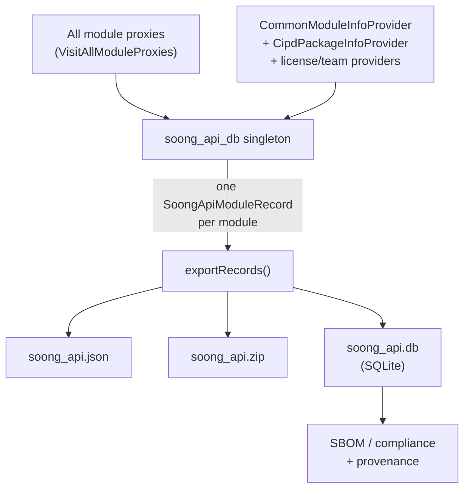

**Partial analysis and on-demand variants.** Soong gained an opt-in `SOONG_PARTIAL_ANALYSIS` env var (`build/soong/ui/build/config.go`) restricting the analysis graph to a named target set and its transitive closure. Blueprint added a `PrePartial()` mutator group running before partial analysis (`build/blueprint/context.go`) and a "passive" `moduleGroup` flag for module groups not yet in the build graph. The variant system shifted toward "variants on demand" (VoD): rather than eagerly splitting every os/arch/image variant, Blueprint creates and mutates dependency variants lazily via `createVariantOnDemand`/`searchOnDemandVariant`. Several eager-split paths (test module types, `PRODUCT_HOST_PACKAGES`, `vndk_prebuilt_library`) were retained for correctness during the transition.

**Release-config maturity.** The Make-era release-config logic now lives entirely under Soong (`build/soong/cmd/release_config/`), and naming is enforced: maps must be named `release_config_map.textproto` (`.../release_config_lib/release_configs.go`). build/make's 871 new vs 154 dropped commits are largely build-ID bumps plus removal of legacy product entries, winding down the Kati path.

### Notable integrations

**AVF multitenancy.** From Android 26Q2, a single protected VM can host multiple mutually isolated tenants (`packages/modules/Virtualization/docs/multitenancy.md`). The VM owner ships a signed `TenancyConfig` (a JSON payload config inside the APK, set via `VirtualMachineConfig#setPayloadConfigPath`) declaring each tenant's `package`, a unique `uid` in `[10000, 65534]`, a `min_version`, and an `expected_authority` map of per-build-flavor signing hashes. virtmgr validates each tenant's authority against the OS signing status and reflects it in the pVM's DICE certificates; per-tenant cgroup and SELinux domains isolate tenants, and unmatched payloads are discarded.

**Trusty as a pVM.** Trusty OS now runs as an AVF-managed protected VM (`packages/modules/Virtualization/guest/trusty/docs/trusty_vm.md`). The Trusty kernel gained virtio-vsock over PCI for host/VM IPC, virtio-vsock over virtio-msg over FF-A for host-opaque channels into a secure-world TEE, device-tree parsing of the crosvm-generated DT (including the pvmfw DICE region), PSCI CPU on/off, and ARM TRNG entropy. The payload is built, signed (via the new `trusty_vm_signing_tool`), and packaged for pvmfw through Soong genrules, producing the `security_vm`/`test_vm` images under `.../guest/trusty/`.

**Linux/Terminal VM in-guest agent and pVM TEE services.** AVF adds `linux_vm_manager`, an in-guest Rust agent for the Linux/Terminal VM (`packages/modules/Virtualization/guest/linux_vm_manager/`) that connects back to the host over vsock (`src/main.rs`) and registers an `IGuestAgent` binder whose handlers (e.g. `shutdownAsync`) live in `src/guest_agent.rs`. The libavf LLNDK also exposes `AVirtualMachineRawConfig_addTeeService` (`libs/libavf/include/android/virtualization.h`, `introduced=37`), letting a protected VM declare TrustZone/TEE services it may reach.

## D.14 Device Support

Android 17's marquee device-support change is the **Software Defined Vehicle (SDV)** platform. Rather than a single repo, SDV arrives as a new top-level tree (`system/software_defined_vehicle/`) plus a reference device (`device/google/sdv`), a new HAL interface package (`hardware/sdv/interfaces`), and an automotive display-safety service (`packages/services/display_safety`). The model is a *headless* vehicle Android OS: SDV "Core" runs vehicle services in their own VM with no UI, communicating with one or more AAOS In-Vehicle Infotainment (IVI) VMs and non-Android automotive ECUs over SOME/IP.

### New projects

`manifest-snapshots/_compare/android-16.0.0_r4-to-android17-release/added-removed.txt` lists 84 ADDED projects; the SDV cluster is the bulk:

- **16 new `system/software_defined_vehicle/*` repos**: `middleware`, `orchestration`, `some_ip`, `vsidl`, `telemetry`, `update_manager`, `sdv_gateway`, `lifecycle_management`, `health_monitor`, `service_bundles_registry`, `automotive_services`, `platform`, `common`, `samples`, `tools`, `vpm`.
- **`device/google/sdv`** (sha `f4bfa128`, groups `swcar, pdk`) — the reference device with all SDV lunch targets.
- **`device/google/sdv_display_safety`** (sha `0971a467`) — display-safety product overlays.
- **`hardware/sdv/interfaces`** — the new SDV HAL/AIDL contract package.
- **`packages/services/display_safety`** — the automotive display-safety ("HARry") service.

`packages/services/Car` (Android Automotive CarService) is a *moved/extended* existing repo (561 commits), not a new project.

### New modules

From `device/google/sdv/sdv_core_base/sdv_packages_core_services.mk`, an SDV Core VM installs these agents and APEXes:

- **Communication stack** (`middleware/`): `sdv_sd_agent` (Service Discovery), `dt_agent` (Data Tunnel pub/sub, `com.android.sdv.dt`), `rpcagent` (`middleware/rpc_agent`); shared client library `libsdv_comms` (`middleware/sdv_comms`) over `wire_format` and `transport` (Rust).
- **Lifecycle & orchestration**: `sdv_lifecycle_agent`, `lifecycle_service_bundle_runner`, `sdv_orchestration_agent` (`com.android.sdv.orchestrator`), `sdv_service_bundles_registry_agent` — the orchestrator drives bundle lifecycle from `orch_config.textproto`.
- **VSIDL toolchain** (host): `vsidlc`, `vsidl_rc_generator`, `someip_translation_generator`; on-device `sdv_vsidl_provider_agent`.
- **SOME/IP**: `sdv_someip_stack_agent` + `vsomeip_config.json`, `sdv_someip_broker_agent_comms`.
- **Platform/ops**: `sdv_health_monitor`, `sdv_update_manager_agent`, `sdv_diagnostics_agent`, `vepsm` (vehicle power-state manager).

`hardware/sdv/interfaces` defines the stable AIDL surface: `ISdvGateway`/`ISdvGatewaySession` (`sdv_gateway/google/sdv/gateway/`), `IRpcAgent` (`middleware/rpc/`), `IRegistry` (`service_bundles_registry/`, API v3 under `aidl_api/`), lifecycle `IService`/`IServiceManager`, the vehicle-power-manager AIDL, and privileged Service-Discovery / identity agents.

`packages/services/display_safety` is a Rust workspace (root `Cargo.toml`) implementing the **HARry** Driver-UI runtime: `framework/` (Impeller graphics, audio, layout, monitoring), `reference/` (`harry-app`, `safety-monitor`, ADAS visualization), and `service/har-sdv-service` whose `libhar_sdv_service_bundle` publishes vehicle data and serves the Driver UI over gRPC through the middleware.

### Architecture changes

The SDV stack layers a vehicle-service fabric beneath (and beside) AAOS. The new tree provides the communication middleware and agents; `device/google/sdv` composes them into lunch targets; `hardware/sdv/interfaces` defines the contracts; CarService and the IVI VM consume them through the gateway.

**Lunch-target composition** (`device/google/sdv/AndroidProducts.mk`, `README.md`): OEM products inherit from one SDV "base" plus a vendor target. The bases are `sdv_base` (comm stack only), `sdv_core_base` (full SDV Core services), `sdv_media_base` (Core + media APIs), and `sdv_ivi_base` (an AAOS IVI talking to SDV services on other VMs). Sample targets `sdv_core_cf`, `sdv_media_cf`, `sdv_ivi_cf` (Cuttlefish) and their `*_arm64` peers boot multiple VM instances (`cvd_config_sdv_core_instance{1,2,3}.json`).

**VSIDL → generated Rust.** Services are described in `.vsidl` service-bundle definitions plus `.proto` message schemas in a catalog. `vsidlc` (`vsidl/vsidlc`) walks the catalog and emits Rust middleware bindings into `generated_rs/`; `someip_translation_generator` emits SOME/IP↔proto translation code for messages tagged `INTERPRET_AS_BYTES` (static) or `DYNAMIC_LIBRARY` (dynamic). This is the SDV equivalent of AIDL stub generation.

**Vehicle-service interface layers.** Inside a VM, the comm stack splits into Service Discovery, Data Tunnel (named pub/sub topics), and RPC (`IRpcAgent`). Cross-VM and cross-ECU traffic goes over **SOME/IP** via the SOME/IP stack agent and broker-agent-comms layer, with vsomeip as transport. Non-SDV-aware native/Java apps reach the fabric through the **SDV Gateway** (`sdv_gateway/`): the gateway's `vhal_proxy` (`libvhal_proxy`) lets a VHAL service call `initComms` and publish vehicle properties, gated by `sdv_gateway_config.json` (`/vendor/etc/sdv_gateway_config.json`) which allowlists SDV package names per process UID. SDV-RPC traffic rides a dedicated VLAN (`androidboot.sdv.rpc.interface`, default `sdv_rpc`).

**Display safety.** On the IVI side, `packages/services/display_safety` runs the HARry Driver-UI as an SDV service bundle (`har-sdv-service`) with a `safety-monitor` enforcing distraction/safety constraints. The window migrated the ADAS framework crates and DriverUI SEPolicy into this repo, and ships `com.google.display_safety.har.apex` only for SDV builds.

The stack:

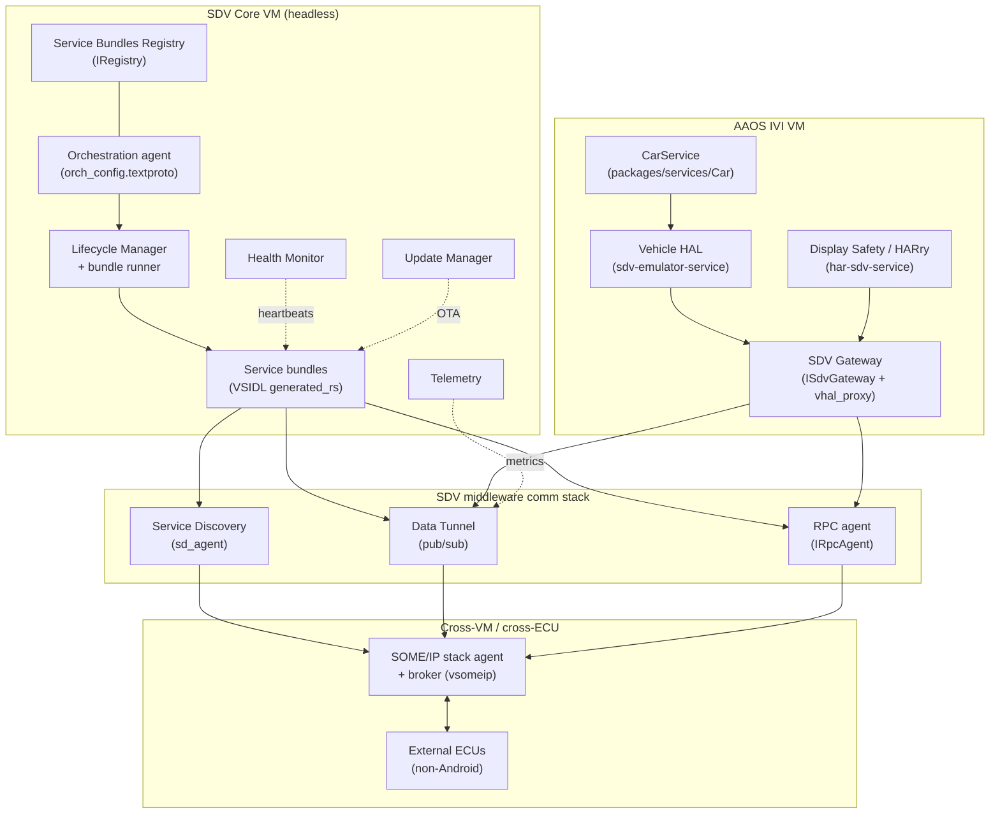

### Notable integrations

- **CarService ↔ SDV.** `packages/services/Car` (moved repo, 561 commits) gained the Driver-UI plumbing the IVI side needs: `com.android.car.driverui` privapp permissions and `ACCESS_LOCAL_NETWORK` default-grant, plus SDV linters. The IVI lunch target wires a Vehicle HAL specifically for SDV: `LOCAL_VHAL_PRODUCT_PACKAGE := android.hardware.automotive.vehicle@V1-sdv-emulator-service` (`device/google/sdv/sdv_ivi_cf/sdv_ivi_cf.mk`), so CarService talks to vehicle properties ultimately served by SDV Core through the gateway.
- **AIDL relocation into `hardware/sdv/interfaces`.** Several interface sets moved out of `system/` into the new HAL package: the SDV Gateway interfaces, the Service Bundles Registry AIDL, vpm stable AIDL, and (after a revert) the Telemetry AIDL. This makes the SDV hardware contract a versioned, VINTF-stable surface independent of the agent implementations.
- **VHAL proxy bridge & OEM/PDK.** `sdv_gateway/vhal_proxy` (`libvhal_proxy`, `config_loader`) lets an unmodified VHAL join the SDV fabric under an allowlisted SDV package name. The reference device supports a custom `/oem_ab` partition (`sdv_core_base/oem_ab/`) for OEM service bundles, and Core targets are PDK-buildable (SDV KeyMint is force-added because the PDK is tested without `system/software_defined_vehicle/` sources).
- **Security model.** VM-level permissions are an APEX with id `com.oem.sdv.authz` (reference `com.oem.sdv.authz.allow_all.{core,ivi}`); the gateway config additionally restricts native clients by UID, and the middleware ships `crypto_rpc` and `service_authz` for authenticated RPC.

## D.15 Practical

Practical dev/test tooling moved modestly: Cuttlefish (290 commits) gained a new desktop product, a unified VKMS controller, an NPU HAL, and AiSeal wiring, while Traceur added two Perfetto trace categories.

### New projects

`vsoc_x86_64_only/desktop/` is a new Cuttlefish product, `aosp_cf_x86_64_desktop` (registered in `AndroidProducts.mk:40`), targeting the Android Desktop form factor. It is HSUM-only (`PRODUCT_USE_HSUM := true`), 64-bit only, uses dynamic partitions with lz4 virtual-AB compression, and ships a `desktop_init_dev_config` service picking APEX/device config at first boot (`shared/desktop/common.mk`). The product turns on verity+encryption by default and enables Trusty gatekeeper/keymint plus `pvmfw-cf` (`vsoc_x86_64_only/desktop/desktop.mk`).

### New modules

- `guest/commands/vkms_controller/` is a new guest-side binary for Virtual Kernel Mode Setting (`main.cpp`). It consolidates fragmented VKMS logic so the host CLI is a stateless `adb shell vkms_controller ...` proxy, test frameworks share one setup path, and the guest correlates virtual hardware (ConfigFS indices) to SurfaceFlinger display IDs. Ships as a `vendor` `cc_binary` (`guest/commands/vkms_controller/Android.bp`).
- NPU support: `shared/device.mk:489` installs the `com.android.hardware.npu.cf` HAL APEX and copies `android.hardware.npu.xml` as a vendor feature permission, advertising the new NPU HAL surface on virtual devices.

### Architecture changes

- AiSeal (on-device AI sealing) is now wired for Cuttlefish via `shared/aiseal/device_vendor.mk`, gated on `RELEASE_AISEAL_FRAMEWORK` and optionally AppSearch. Because Cuttlefish has no protected-VM support, it forces `service.aiseal.protected_vm=0` and runs AiSeal in a nonprotected VM; `aosp_cf_x86_64_only_phone` opts into the feature.
- Host tooling cleanup: the acloud translator was deleted from the Cuttlefish host package, and `cvd-host-package` is now built sandboxed (Sbox) with incremental-walk dependency tracking, tightening reproducibility of the developer host tarball.
- Variant breadth is unchanged in count but reaffirmed across all four `minidroid` targets (`vsoc_{arm64,arm,riscv64,x86_64}_minidroid`) plus the page-size-agnostic `vsoc_x86_64_pgagnostic` / `vsoc_arm64_pgagnostic` products used to validate 16 KB-page builds.

### Notable integrations

Traceur adds two Perfetto trace categories developers can toggle in the system tracing UI (`src_common/com/android/traceur/TraceUtils.java:127`):

- `wattson` ("Wattson power estimation"): when enabled, Traceur emits a minimum Perfetto config with `linux.sys_stats` (cpufreq/cpuidle polling) and a `linux.ftrace` block capturing CPU-hotplug, devfreq, cpu_frequency/idle, suspend_resume, and sched_switch events (`src_common/com/android/traceur/PerfettoUtils.java:821`).
- `mq` ("messagequeue tracing"): enables the `mq` `track_event` category for Looper/MessageQueue dispatch tracing (`src_common/com/android/traceur/PerfettoUtils.java:851`).

Traceur also bumped `targetSdk` to 36, enabled R8 bytecode optimization, and removed the dead `bitmaps_in_traceur` flag and the WinscopeUtils/view-capture path.

## D.16 Key Source Files Reference

| Part | Key files |
| --- | --- |
| Kernel & Boot | `system/usb/aoa/{aidl/.../IUsbAoa.aidl, daemon/main.cpp, daemon/VendorControlRequestMonitor.h, daemon/aoad.rc}`; `system/core/init/first_stage_mount_android.cpp`; `system/update_engine/update_metadata.proto:385`; `kernel/configs` (`android17-6.18`) |
| Native Foundation | `hardware/interfaces/compatibility_matrices/compatibility_matrix.202704.xml`; `hardware/interfaces/{motioncontext,npu,security/see}/aidl/`; `frameworks/libs/binary_translation/cpu_emulation/`; `system/tools/aidl/aidl_language.cpp` |
| Native Services & Media | `frameworks/av/media/module/libapexcodecs/include/apex/ApexCodecs.h`; `frameworks/native/libs/gui/include/gui/RenderCommandBufferProducer.h`; `frameworks/native/services/surfaceflinger/RenderResourceCache.{h,cpp}`; `frameworks/native/libs/binder/BinderNetlink.cpp`; `system/media/camera/include/system/camera_metadata_tags.h` |
| Runtime | `system/zygote/{Android.bp, zygote/src/species.rs, zygote/src/species/android_native.rs, zygote-messages/schemas/messages.fbs}`; `art/runtime/arch/x86/instruction_set_features_x86.cc`; `art/libdexfile/dex/dex_file.h`; `system/apex/apexd/apexd.cpp` |
| Framework Core | `frameworks/base/core/java/android/os/Build.java`; `.../services/core/.../advancedprotection/AdvancedProtectionService.java`; `.../services/supervision/.../SupervisionService.java`; `.../libs/WindowManager/Shell/.../desktopmode/`; `packages/modules/SdkExtensions/derive_sdk/derive_sdk.cpp` |
| Framework Services | `system/memory/mmd/{src/main.rs, aidl/android/os/IMmd.aidl, src/service.rs, src/zram/per_process_ioctls.rs, src/atom.rs}`; `packages/modules/{UprobeStats,Profiling}/apex/Android.bp`; `packages/modules/StatsD/statsd/src/main.cpp` |
| Connectivity | `hardware/nxp/uwb/aidl/{uwb_chip.cpp, nxp-uwb-service.rc}`; `packages/modules/Uwb/ranging/{framework/.../RangingManager.java, service/.../RangingTechnology.java}`; `packages/modules/Wifi/.../usd/UsdManager.java`; `system/gd/hci/distance_measurement_manager_impl.cc` |
| Security | `system/lfi/{boxrt/boxrt_minimal.c, allocator/alloc.c, relocator/relocate.c, Android.bp}`; `frameworks/av/media/codec2/hal/client/client.cpp:1909`; `system/weaver/{ta/src/lib.rs, hal/src/lib.rs}`; `system/see/authmgr/authmgr-fe/src/authorization.rs`; `external/keyattestation/{Android.bp, roots.json}`; `system/keymint`; `system/sepolicy` accessor service contexts |
| UI Framework | `frameworks/libs/systemui/dynamiccolors/Android.bp`; `quickstep/src/com/android/quickstep/{window/RecentsWindowManager.kt, DisplayModel.kt}`; `.../launcher3/taskbar/TaskbarManagerImpl.java`; `frameworks/libs/systemui/monet/.../ColorScheme.java`; `build/make/target/product/{base_system.mk:493, angle_default.mk}` |
| System Apps | `packages/apps/Settings/src/com/android/settings/{supervision/SupervisionDashboardScreen.kt, development/desktopexperience/}`; `packages/apps/DocumentsUI/src/com/android/documentsui/{util/FlagUtils.kt, files/getinfo/, queries/}` |
| AI & Devices | `packages/modules/NpuManager/{apex/Android.bp, framework/.../NpuManager.java, service/.../NpuManagerServiceImpl, ndk/include/android/npumanager/buffer.h}`; `packages/apps/PersonalContext/AndroidManifest.xml`; `system/chre/{chre_api/include/chre_api/chre/data_flow.h, data_flow/}`; `external/openxr-sdk` |
| Infrastructure | `tools/mainline/train_build/{Android.bp, primary_train_build_action.py}`; `build/soong/{soong_api/soong_api.go, android/cipd/cipd_package.go, filesystem/prebuilt.go}`; `packages/modules/Virtualization/{docs/multitenancy.md, guest/trusty/docs/trusty_vm.md, guest/trusty/tools/Android.bp}` |
| Device Support (SDV) | `system/software_defined_vehicle/*` (16 repos: `middleware`, `orchestration`, `some_ip`, `vsidl`, `sdv_gateway`, …); `device/google/sdv/{AndroidProducts.mk, sdv_core_base/sdv_packages_core_services.mk, sdv_ivi_cf/sdv_ivi_cf.mk}`; `hardware/sdv/interfaces`; `packages/services/display_safety`; `packages/services/Car` |
| Practical | `device/google/cuttlefish/vsoc_x86_64_only/desktop/desktop.mk`; `device/google/cuttlefish/guest/commands/vkms_controller/main.cpp`; `device/google/cuttlefish/shared/aiseal/device_vendor.mk`; `.../traceur/{TraceUtils.java, PerfettoUtils.java}` |
