# Part App.: Appendices

AOSP Internals — Appendices. Use when looking up a key file path
(per-chapter table of the most important AOSP source files: build, init,
kernel, HAL, framework services, system apps, infrastructure) or the
meaning of an AOSP-specific acronym/term (Treble, VINTF, GKI, APEX, AIDL,
HIDL, etc.), why Kotlin is absent from the public API, or what changed from
Android 16 to Android 17. Reference material — load when you need a concrete
path, a definition, or a changelog rather than narrative explanation.

## Chapter content

<!-- chapter:A-appendix-key-files -->
# Appendix A: Key Files Reference

This appendix provides a quick-reference table of the most important source files
in AOSP, organized by subsystem and cross-referenced to the chapter where each
file is discussed. Paths are relative to the AOSP root (`$AOSP/`).

---

## Build System (Chapter 2)

| File Path | Purpose |
|-----------|---------|
| `build/make/core/main.mk` | Top-level build entry point; includes all other makefiles |
| `build/make/core/Makefile` | Legacy build rules for images, OTA, packaging |
| `build/make/core/definitions.mk` | Common macro definitions used across the build |
| `build/make/core/envsetup.mk` | Environment variable setup for build configuration |
| `build/make/core/product.mk` | Product-level build variable definitions |
| `build/make/core/product_config.mk` | Product configuration loading and validation |
| `build/make/core/board_config.mk` | Board-level hardware configuration |
| `build/make/core/binary.mk` | Shared rules for building native binaries |
| `build/make/core/tasks/berberis_test.mk` | Build configuration for native bridge testing |
| `build/make/envsetup.sh` | Shell environment setup; defines `lunch`, `m`, `mm`, `mmm` |
| `build/soong/cmd/soong_build/main.go` | Soong build system entry point |
| `build/soong/android/module.go` | Base module type definitions for Soong |
| `build/soong/android/androidmk.go` | Android.mk to Soong conversion logic |
| `build/soong/cc/cc.go` | C/C++ module build rules for Soong |
| `build/soong/cc/library.go` | Shared/static library build rules |
| `build/soong/cc/binary.go` | Native binary build rules |
| `build/soong/cc/config/riscv64_device.go` | RISC-V 64-bit device configuration |
| `build/soong/java/java.go` | Java module build rules for Soong |
| `build/soong/java/app.go` | Android application build rules |
| `build/soong/apex/apex.go` | APEX module build rules |
| `build/blueprint/context.go` | Blueprint core context and dependency resolution |
| `build/blueprint/module_ctx.go` | Module context interface for Blueprint |
| `device/generic/goldfish/board/BoardConfigCommon.mk` | Emulator board configuration (common) |
| `device/google/cuttlefish/vsoc_x86_64/BoardConfig.mk` | Cuttlefish virtual device board config (x86_64) |

## Boot and Init (Chapter 4)

| File Path | Purpose |
|-----------|---------|
| `system/core/init/init.cpp` | PID-1 init process main entry point |
| `system/core/init/service.cpp` | Service lifecycle management (start/stop/restart) |
| `system/core/init/service_parser.cpp` | Parsing of service definitions in .rc files |
| `system/core/init/action.cpp` | Action and trigger execution engine |
| `system/core/init/action_parser.cpp` | Parsing of action blocks in .rc files |
| `system/core/init/property_service.cpp` | System property daemon and persistence |
| `system/core/init/first_stage_init.cpp` | First-stage init before mounting partitions |
| `system/core/init/first_stage_mount.cpp` | Early partition mounting logic |
| `system/core/init/selinux.cpp` | SELinux policy loading during init |
| `system/core/init/ueventd.cpp` | Device node creation daemon |
| `system/core/init/reboot.cpp` | Shutdown and reboot sequencing |
| `system/core/rootdir/init.rc` | Root init script; defines core services and triggers |
| `system/core/rootdir/init.zygote64_32.rc` | Zygote startup configuration (64+32-bit) |
| `system/core/fastboot/fastboot.cpp` | Fastboot protocol host-side implementation |
| `bootable/recovery/recovery.cpp` | Recovery mode main entry point |

## Kernel (Chapter 5)

| File Path | Purpose |
|-----------|---------|
| `kernel/common/Makefile` | Top-level kernel Makefile |
| `kernel/common/arch/arm64/configs/gki_defconfig` | GKI default kernel configuration |
| `kernel/common/drivers/android/binder.c` | Binder kernel driver implementation |
| `kernel/common/drivers/android/binder_alloc.c` | Binder memory allocation |
| `kernel/common/drivers/staging/android/ion/` | ION memory allocator (legacy) |
| `kernel/common/drivers/dma-buf/` | DMA-BUF framework for buffer sharing |
| `kernel/common/drivers/gpu/drm/` | DRM/KMS graphics driver framework |
| `kernel/common/include/uapi/linux/android/binder.h` | Binder UAPI header |
| `kernel/common/fs/fuse/dev.c` | FUSE device implementation (for scoped storage) |
| `kernel/build/build.sh` | Kernel build wrapper script |
| `kernel/build/kleaf/` | Kleaf (Bazel-based) kernel build system |

## Bionic and the Dynamic Linker (Chapter 7)

| File Path | Purpose |
|-----------|---------|
| `bionic/libc/bionic/malloc_common.cpp` | malloc dispatch (jemalloc/scudo selection) |
| `bionic/libc/bionic/pthread_create.cpp` | POSIX thread creation |
| `bionic/libc/bionic/libc_init_dynamic.cpp` | Dynamic-linked process startup |
| `bionic/libc/bionic/libc_init_static.cpp` | Static-linked process startup |
| `bionic/libc/bionic/system_property_api.cpp` | System property client API |
| `bionic/libc/arch-arm64/` | ARM64 architecture-specific code |
| `bionic/libc/include/` | Public C library headers |
| `bionic/linker/linker.cpp` | Dynamic linker main logic |
| `bionic/linker/linker_phdr.cpp` | ELF program header parsing and loading |
| `bionic/linker/linker_namespaces.cpp` | Linker namespace implementation |
| `bionic/linker/linker_soinfo.cpp` | Shared object info management |
| `bionic/linker/linker_config.cpp` | Linker configuration file parsing |
| `system/core/rootdir/etc/ld.config.txt` | Default linker namespace configuration |
| `bionic/libm/` | Math library implementation |
| `bionic/libdl/libdl.cpp` | dlopen/dlsym implementation |

## Binder IPC (Chapter 9)

| File Path | Purpose |
|-----------|---------|
| `frameworks/native/libs/binder/IPCThreadState.cpp` | Per-thread Binder transaction processing |
| `frameworks/native/libs/binder/ProcessState.cpp` | Per-process Binder driver state |
| `frameworks/native/libs/binder/Binder.cpp` | BBinder (local) base class |
| `frameworks/native/libs/binder/BpBinder.cpp` | BpBinder (proxy) base class |
| `frameworks/native/libs/binder/Parcel.cpp` | Data serialization for Binder transactions |
| `frameworks/native/libs/binder/IServiceManager.cpp` | Service manager client interface |
| `frameworks/native/cmds/servicemanager/ServiceManager.cpp` | Service manager daemon |
| `frameworks/native/cmds/servicemanager/main.cpp` | Service manager entry point |
| `frameworks/base/core/java/android/os/Binder.java` | Java-side Binder base class |
| `frameworks/base/core/java/android/os/BinderProxy.java` | Java-side Binder proxy |
| `frameworks/base/core/java/android/os/Parcel.java` | Java-side Parcel |
| `frameworks/base/core/java/android/os/ServiceManager.java` | Java service manager client |
| `frameworks/base/core/jni/android_util_Binder.cpp` | Binder JNI bridge |

## HAL -- Hardware Abstraction Layer (Chapter 10)

| File Path | Purpose |
|-----------|---------|
| `hardware/interfaces/` | Top-level HIDL/AIDL HAL interface directory |
| `hardware/interfaces/audio/aidl/` | Audio HAL AIDL interface definitions |
| `hardware/interfaces/camera/provider/aidl/` | Camera provider HAL interface |
| `hardware/interfaces/graphics/composer/aidl/` | HWC (Hardware Composer) HAL interface |
| `hardware/interfaces/graphics/allocator/aidl/` | Gralloc allocator HAL interface |
| `hardware/interfaces/graphics/mapper/stable-c/` | Gralloc mapper stable-C HAL interface |
| `hardware/interfaces/health/aidl/` | Battery/health HAL interface |
| `hardware/interfaces/sensors/aidl/` | Sensors HAL interface |
| `hardware/interfaces/neuralnetworks/aidl/` | NNAPI HAL interface |
| `hardware/interfaces/power/aidl/` | Power HAL interface |
| `hardware/interfaces/thermal/aidl/` | Thermal HAL interface |
| `hardware/interfaces/bluetooth/aidl/` | Bluetooth HAL interface |
| `hardware/interfaces/wifi/aidl/` | Wi-Fi HAL interface |
| `hardware/interfaces/vibrator/aidl/` | Vibrator HAL interface |
| `hardware/libhardware/include/hardware/hardware.h` | Legacy HAL module interface (hw_module_t) |
| `system/libhidl/transport/HidlTransportSupport.cpp` | HIDL transport initialization |
| `system/tools/hidl/` | HIDL compiler (hidl-gen) |
| `system/tools/aidl/` | AIDL compiler for HAL interfaces |

## NDK -- Native Development Kit (Chapter 11)

| File Path | Purpose |
|-----------|---------|
| `frameworks/native/include/android/` | Public NDK native headers |
| `frameworks/native/libs/nativewindow/include/android/native_window.h` | ANativeWindow API |
| `frameworks/native/include/android/native_activity.h` | NativeActivity API |
| `frameworks/native/include/android/sensor.h` | Sensor NDK API |
| `frameworks/native/include/android/asset_manager.h` | Asset manager NDK API |
| `frameworks/av/media/ndk/` | Media NDK implementation (AMediaCodec, etc.) |
| `packages/modules/NeuralNetworks/runtime/` | NNAPI runtime implementation |
| `frameworks/native/libs/nativewindow/` | ANativeWindow implementation |

## Native Services (Chapter 12)

| File Path | Purpose |
|-----------|---------|
| `frameworks/native/services/inputflinger/InputDispatcher.cpp` | Input event dispatch to windows |
| `frameworks/native/services/inputflinger/InputReader.cpp` | Input device event reading |
| `frameworks/native/services/inputflinger/InputManager.cpp` | Input subsystem coordinator |
| `frameworks/native/services/sensorservice/SensorService.cpp` | Sensor event multiplexing |
| `frameworks/native/services/surfaceflinger/main_surfaceflinger.cpp` | SurfaceFlinger process entry point |
| `system/logging/logd/SerializedLogBuffer.cpp` | System log ring buffer |
| `system/memory/lmkd/lmkd.cpp` | Low memory killer daemon |
| `system/memory/lmkd/` | Modern LMKD implementation |
| `system/core/healthd/` | Battery/health daemon |
| `system/netd/server/NetdNativeService.cpp` | Network daemon native service |

## Graphics and Render Pipeline (Chapter 13)

| File Path | Purpose |
|-----------|---------|
| `frameworks/native/services/surfaceflinger/SurfaceFlinger.cpp` | Compositor main class |
| `frameworks/native/services/surfaceflinger/SurfaceFlinger.h` | SurfaceFlinger declarations |
| `frameworks/native/services/surfaceflinger/Scheduler/Scheduler.cpp` | VSYNC scheduling and frame pacing |
| `frameworks/native/services/surfaceflinger/Scheduler/VsyncController.cpp` | VSYNC signal generation |
| `frameworks/native/services/surfaceflinger/CompositionEngine/` | Composition strategy engine |
| `frameworks/native/services/surfaceflinger/DisplayHardware/HWComposer.cpp` | HWC abstraction layer |
| `frameworks/native/services/surfaceflinger/DisplayHardware/PowerAdvisor.cpp` | Power hint integration |
| `frameworks/native/services/surfaceflinger/Layer.cpp` | Individual surface/layer management |
| `frameworks/native/services/surfaceflinger/BufferLayer.cpp` | Buffer-backed layer implementation |
| `frameworks/native/services/surfaceflinger/FrontEnd/LayerLifecycleManager.cpp` | Layer lifecycle tracking |
| `frameworks/native/services/surfaceflinger/Tracing/TransactionTracing.cpp` | Transaction trace capture |
| `frameworks/native/libs/gui/Surface.cpp` | Client-side Surface implementation |
| `frameworks/native/libs/gui/BufferQueue.cpp` | Producer-consumer buffer queue |
| `frameworks/native/libs/gui/BufferQueueProducer.cpp` | Buffer queue producer side |
| `frameworks/native/libs/gui/BufferQueueConsumer.cpp` | Buffer queue consumer side |
| `frameworks/native/libs/gui/SurfaceComposerClient.cpp` | SurfaceFlinger client interface |
| `frameworks/native/libs/gui/BLASTBufferQueue.cpp` | BLAST buffer queue (modern path) |
| `frameworks/native/libs/renderengine/skia/SkiaGLRenderEngine.cpp` | Skia-based GPU composition |
| `frameworks/native/libs/renderengine/skia/SkiaVkRenderEngine.cpp` | Skia Vulkan render engine |
| `frameworks/native/opengl/libs/EGL/eglApi.cpp` | EGL API entry points |
| `frameworks/native/opengl/libs/EGL/Loader.cpp` | EGL driver loader |
| `frameworks/native/vulkan/libvulkan/driver.cpp` | Vulkan loader/driver interface |
| `frameworks/native/vulkan/libvulkan/api.cpp` | Vulkan API dispatch |
| `external/skia/src/gpu/ganesh/GrDirectContext.cpp` | Skia GPU context |
| `external/skia/src/gpu/graphite/` | Skia Graphite (next-gen GPU backend) |
| `frameworks/base/libs/hwui/renderthread/RenderThread.cpp` | HWUI render thread |
| `frameworks/base/libs/hwui/renderthread/CanvasContext.cpp` | Per-window render context |
| `frameworks/base/libs/hwui/pipeline/skia/SkiaOpenGLPipeline.cpp` | Skia GL rendering pipeline |
| `frameworks/base/libs/hwui/pipeline/skia/SkiaVulkanPipeline.cpp` | Skia Vulkan rendering pipeline |
| `frameworks/base/libs/hwui/RenderNode.cpp` | Display list render node |
| `frameworks/base/libs/hwui/RecordingCanvas.cpp` | Display list recording canvas |
| `frameworks/base/libs/hwui/DamageAccumulator.cpp` | Dirty region tracking |
| `frameworks/base/libs/hwui/JankTracker.cpp` | Frame jank detection and reporting |
| `frameworks/base/graphics/java/android/graphics/Canvas.java` | Java Canvas API |
| `frameworks/base/graphics/java/android/graphics/RenderNode.java` | Java RenderNode API |
| `frameworks/base/core/java/android/view/Choreographer.java` | VSYNC-based callback scheduler |
| `frameworks/base/core/java/android/view/ViewRootImpl.java` | View hierarchy root; drives measure/layout/draw |
| `frameworks/base/core/java/android/view/ThreadedRenderer.java` | Java bridge to HWUI RenderThread |

## Animation System (Chapter 14)

| File Path | Purpose |
|-----------|---------|
| `frameworks/base/core/java/android/animation/ValueAnimator.java` | Core property animation engine |
| `frameworks/base/core/java/android/animation/ObjectAnimator.java` | Property-targeted animation |
| `frameworks/base/core/java/android/animation/AnimatorSet.java` | Coordinated animation sequencing |
| `frameworks/base/core/java/android/view/animation/Animation.java` | Legacy view animation base class |
| `frameworks/base/core/java/android/transition/TransitionManager.java` | Scene transition framework |
| `frameworks/base/core/java/android/window/TransitionInfo.java` | Shell transition metadata |
| `frameworks/libs/systemui/animationlib/src/` | SystemUI shared animation library |

## Audio System (Chapter 15)

| File Path | Purpose |
|-----------|---------|
| `frameworks/av/services/audioflinger/AudioFlinger.cpp` | Audio mixing daemon main class |
| `frameworks/av/services/audioflinger/Threads.cpp` | Playback and record thread implementations |
| `frameworks/av/services/audioflinger/Tracks.cpp` | Audio track management |
| `frameworks/av/services/audioflinger/Effects.cpp` | Audio effects chain processing |
| `frameworks/av/services/audiopolicy/managerdefault/AudioPolicyManager.cpp` | Audio routing policy |
| `frameworks/av/services/audiopolicy/common/managerdefinitions/src/AudioPort.cpp` | Audio port abstraction |
| `frameworks/av/media/libaudioclient/AudioTrack.cpp` | Client-side audio playback |
| `frameworks/av/media/libaudioclient/AudioRecord.cpp` | Client-side audio recording |
| `frameworks/av/media/libaudioclient/AudioSystem.cpp` | Audio system client interface |
| `frameworks/av/media/libaudiohal/impl/DeviceHalAidl.cpp` | Audio device HAL AIDL adapter |
| `frameworks/base/media/java/android/media/AudioTrack.java` | Java audio playback API |
| `frameworks/base/services/core/java/com/android/server/audio/AudioService.java` | Audio service (volume, routing) |

## Media and Video Pipeline (Chapter 16)

| File Path | Purpose |
|-----------|---------|
| `frameworks/av/media/libmediaplayerservice/MediaPlayerService.cpp` | Media player daemon |
| `frameworks/av/media/codec2/sfplugin/CCodec.cpp` | Codec2 framework plugin |
| `frameworks/av/media/codec2/sfplugin/CCodecBufferChannel.cpp` | Codec2 buffer management |
| `frameworks/av/media/codec2/components/` | Software codec implementations |
| `frameworks/av/media/libstagefright/MediaCodec.cpp` | MediaCodec native implementation |
| `frameworks/av/media/libstagefright/ACodec.cpp` | Legacy OMX codec adapter |
| `frameworks/av/media/libstagefright/NuPlayer/NuPlayer.cpp` | Media playback engine |
| `frameworks/av/media/module/extractors/` | Media file format extractors (MP4, MKV, etc.) |
| `frameworks/av/services/camera/libcameraservice/CameraService.cpp` | Camera service daemon |
| `frameworks/av/drm/mediadrm/plugins/clearkey/` | ClearKey DRM reference implementation |
| `frameworks/base/media/java/android/media/MediaCodec.java` | Java MediaCodec API |
| `frameworks/base/media/java/android/media/MediaPlayer.java` | Java MediaPlayer API |

## ART Runtime (Chapter 18)

| File Path | Purpose |
|-----------|---------|
| `art/runtime/runtime.cc` | ART runtime initialization |
| `art/runtime/class_linker.cc` | Class loading and linking |
| `art/runtime/interpreter/interpreter.cc` | Bytecode interpreter entry point |
| `art/runtime/jit/jit.cc` | JIT compiler coordinator |
| `art/runtime/jit/jit_code_cache.cc` | JIT compiled code cache |
| `art/runtime/gc/heap.cc` | Garbage collector heap management |
| `art/runtime/gc/collector/concurrent_copying.cc` | Concurrent copying GC |
| `art/runtime/thread.cc` | Thread management |
| `art/runtime/oat/oat_file.cc` | OAT file format handling |
| `art/runtime/mirror/object.h` | Root object type for managed heap |
| `art/runtime/mirror/class.h` | Class metadata representation |
| `art/compiler/optimizing/optimizing_compiler.cc` | AOT/JIT optimizing compiler |
| `art/compiler/optimizing/code_generator_arm64.cc` | ARM64 code generation backend |
| `art/compiler/optimizing/register_allocator_linear_scan.cc` | Register allocation |
| `art/dex2oat/dex2oat.cc` | Ahead-of-time compilation tool |
| `art/dex2oat/dex2oat_options.cc` | DEX-to-OAT compilation options |
| `art/libdexfile/dex/dex_file.h` | DEX file format definitions |
| `art/runtime/native_bridge_art_interface.cc` | ART-side native bridge integration |

## Native Bridge and Binary Translation (Chapter 19)

| File Path | Purpose |
|-----------|---------|
| `frameworks/libs/binary_translation/native_bridge/native_bridge.h` | NativeBridgeCallbacks interface (v3-v8) |
| `frameworks/libs/binary_translation/native_bridge/native_bridge.cc` | Native bridge framework implementation |
| `frameworks/libs/binary_translation/guest_loader/` | Guest library loading and linking |
| `frameworks/libs/binary_translation/guest_abi/` | ABI conversion between host and guest |
| `frameworks/libs/binary_translation/guest_state/` | Guest CPU state abstraction |
| `frameworks/libs/binary_translation/jni/` | JNI trampoline generation |
| `frameworks/libs/binary_translation/interpreter/` | Guest instruction interpreter |
| `frameworks/libs/binary_translation/decoder/` | Guest instruction decoder |
| `frameworks/libs/binary_translation/backend/` | Host code generation backend |
| `frameworks/libs/binary_translation/assembler/` | Host instruction assembler |
| `frameworks/libs/binary_translation/android_api/` | Android framework proxy stubs |
| `frameworks/libs/native_bridge_support/native_bridge_support.mk` | Build synchronization for bridge support |
| `art/libnativebridge/native_bridge.cc` | System-side native bridge loading |

## system_server (Chapter 20)

| File Path | Purpose |
|-----------|---------|
| `frameworks/base/services/java/com/android/server/SystemServer.java` | system_server boot sequence |
| `frameworks/base/services/core/java/com/android/server/SystemServiceManager.java` | Service lifecycle manager |
| `frameworks/base/services/core/java/com/android/server/am/ActivityManagerService.java` | Activity Manager Service |
| `frameworks/base/services/core/java/com/android/server/wm/WindowManagerService.java` | Window Manager Service |
| `frameworks/base/services/core/java/com/android/server/wm/ActivityTaskManagerService.java` | Activity Task Manager Service |
| `frameworks/base/services/core/java/com/android/server/pm/PackageManagerService.java` | Package Manager Service |
| `frameworks/base/services/core/java/com/android/server/power/PowerManagerService.java` | Power management |
| `frameworks/base/services/core/java/com/android/server/display/DisplayManagerService.java` | Display management |
| `frameworks/base/services/core/java/com/android/server/input/InputManagerService.java` | Input management bridge |
| `frameworks/base/core/java/com/android/internal/os/ZygoteInit.java` | Zygote process initialization |
| `frameworks/base/core/java/com/android/internal/os/ZygoteConnection.java` | Zygote fork request handling |
| `frameworks/base/core/java/com/android/internal/os/Zygote.java` | Zygote fork mechanics |
| `frameworks/base/core/java/com/android/internal/os/RuntimeInit.java` | App process runtime initialization |

## Activity and Window Management (Chapter 22)

| File Path | Purpose |
|-----------|---------|
| `frameworks/base/services/core/java/com/android/server/wm/Task.java` | Task (back stack) container |
| `frameworks/base/services/core/java/com/android/server/wm/ActivityRecord.java` | Per-activity state tracking |
| `frameworks/base/services/core/java/com/android/server/wm/ActivityStarter.java` | Intent resolution and activity start |
| `frameworks/base/services/core/java/com/android/server/wm/ActivityClientController.java` | Activity lifecycle IPC handler |
| `frameworks/base/services/core/java/com/android/server/wm/RootWindowContainer.java` | Root of the window hierarchy |
| `frameworks/base/services/core/java/com/android/server/wm/TaskFragment.java` | Activity embedding container |
| `frameworks/base/core/java/android/app/Activity.java` | Application-side activity base class |
| `frameworks/base/core/java/android/app/ActivityThread.java` | Main thread of every Android app |
| `frameworks/base/core/java/android/app/Instrumentation.java` | Activity lifecycle instrumentation hooks |

## Window System (Chapter 23)

| File Path | Purpose |
|-----------|---------|
| `frameworks/base/services/core/java/com/android/server/wm/WindowState.java` | Per-window server state |
| `frameworks/base/services/core/java/com/android/server/wm/WindowToken.java` | Window grouping token |
| `frameworks/base/services/core/java/com/android/server/wm/Session.java` | Per-app WMS session |
| `frameworks/base/services/core/java/com/android/server/wm/WindowSurfaceController.java` | Window-to-Surface bridge |
| `frameworks/base/services/core/java/com/android/server/wm/WindowAnimator.java` | Window animation coordinator |
| `frameworks/base/services/core/java/com/android/server/wm/InsetsStateController.java` | System insets management |
| `frameworks/base/services/core/java/com/android/server/wm/InsetsPolicy.java` | Insets visibility policy |
| `frameworks/base/core/java/android/view/WindowManager.java` | Client window manager interface |
| `frameworks/base/core/java/android/view/WindowManagerImpl.java` | Window manager implementation |
| `frameworks/base/core/java/android/view/View.java` | Base UI component (measure/layout/draw) |
| `frameworks/base/core/java/android/view/ViewGroup.java` | Container for child views |
| `frameworks/base/core/java/android/view/SurfaceView.java` | Separate-surface view component |

## Display System (Chapter 24)

| File Path | Purpose |
|-----------|---------|
| `frameworks/base/services/core/java/com/android/server/wm/DisplayContent.java` | Per-display window container |
| `frameworks/base/services/core/java/com/android/server/wm/DisplayPolicy.java` | Per-display window policy (bars, cutouts) |
| `frameworks/base/services/core/java/com/android/server/wm/DisplayRotation.java` | Display rotation handling |
| `frameworks/base/services/core/java/com/android/server/display/LogicalDisplay.java` | Logical display abstraction |
| `frameworks/base/services/core/java/com/android/server/display/DisplayDeviceInfo.java` | Physical display properties |
| `frameworks/base/services/core/java/com/android/server/display/LocalDisplayAdapter.java` | Built-in display adapter |

## PackageManagerService (Chapter 26)

| File Path | Purpose |
|-----------|---------|
| `frameworks/base/services/core/java/com/android/server/pm/PackageManagerService.java` | Package management core |
| `frameworks/base/services/core/java/com/android/server/pm/Settings.java` | Package settings persistence |
| `frameworks/base/services/core/java/com/android/server/pm/InstallPackageHelper.java` | Package installation logic |
| `frameworks/base/services/core/java/com/android/server/pm/PackageInstallerService.java` | Installer session management |
| `frameworks/base/services/core/java/com/android/server/pm/permission/PermissionManagerService.java` | Runtime permission management |
| `frameworks/base/services/core/java/com/android/server/pm/pkg/parsing/ParsingPackageUtils.java` | APK manifest parsing |
| `frameworks/base/services/core/java/com/android/server/pm/resolution/ComponentResolver.java` | Intent filter resolution |
| `frameworks/base/services/core/java/com/android/server/pm/dex/DexManager.java` | DEX file optimization tracking |
| `frameworks/base/core/java/android/content/pm/PackageManager.java` | Public PackageManager API |

## Security (Chapter 40)

| File Path | Purpose |
|-----------|---------|
| `system/sepolicy/public/` | Public SELinux policy definitions |
| `system/sepolicy/private/` | Private (platform) SELinux policy |
| `system/sepolicy/vendor/` | Vendor SELinux policy |
| `system/security/keystore2/` | Keystore2 service (Rust) |
| `system/security/identity/` | Identity credential service |
| `external/selinux/` | SELinux userspace tools |
| `system/extras/verity/` | dm-verity tools |
| `system/core/fs_mgr/libfs_avb/` | AVB (Android Verified Boot) integration |
| `frameworks/base/services/core/java/com/android/server/biometrics/` | Biometric authentication |
| `frameworks/base/keystore/java/android/security/keystore2/` | Keystore Java API |

## SystemUI (Chapter 48)

| File Path | Purpose |
|-----------|---------|
| `frameworks/base/packages/SystemUI/src/com/android/systemui/SystemUIApplication.java` | SystemUI application entry |
| `frameworks/base/packages/SystemUI/src/com/android/systemui/statusbar/phone/CentralSurfacesImpl.java` | Status bar + notification shade |
| `frameworks/base/packages/SystemUI/src/com/android/systemui/qs/QSPanelController.java` | Quick Settings panel controller |
| `frameworks/base/packages/SystemUI/src/com/android/systemui/recents/OverviewProxyService.java` | Recents/overview proxy to Launcher |
| `frameworks/base/packages/SystemUI/src/com/android/systemui/keyguard/KeyguardViewMediator.java` | Lock screen coordinator |
| `frameworks/base/packages/SystemUI/src/com/android/systemui/navigationbar/NavigationBar.java` | Navigation bar |
| `frameworks/base/packages/SystemUI/src/com/android/systemui/volume/VolumeDialogControllerImpl.java` | Volume dialog logic |
| `frameworks/base/packages/SystemUI/src/com/android/systemui/shade/NotificationPanelViewController.java` | Notification panel controller |

## Launcher3 (Chapter 49)

| File Path | Purpose |
|-----------|---------|
| `packages/apps/Launcher3/src/com/android/launcher3/Launcher.java` | Main Launcher activity |
| `packages/apps/Launcher3/src/com/android/launcher3/Workspace.java` | Home screen workspace |
| `packages/apps/Launcher3/src/com/android/launcher3/allapps/AllAppsContainerView.java` | All-apps drawer |
| `packages/apps/Launcher3/src/com/android/launcher3/model/LoaderTask.java` | App list loading |
| `packages/apps/Launcher3/src/com/android/launcher3/dragndrop/DragController.java` | Drag-and-drop coordinator |
| `packages/apps/Launcher3/quickstep/src/com/android/quickstep/RecentsActivity.java` | Recents (overview) activity |
| `packages/apps/Launcher3/quickstep/src/com/android/quickstep/TouchInteractionService.java` | Gesture navigation service |

## Settings App (Chapter 50)

| File Path | Purpose |
|-----------|---------|
| `packages/apps/Settings/src/com/android/settings/Settings.java` | Main Settings activity |
| `packages/apps/Settings/src/com/android/settings/dashboard/DashboardFragment.java` | Preference dashboard base |
| `packages/apps/Settings/src/com/android/settings/search/SearchFeatureProvider.java` | Settings search |
| `packages/apps/Settings/src/com/android/settings/biometrics/` | Biometrics enrollment |

## CompanionDeviceManager and Virtual Devices (Chapter 52)

| File Path | Purpose |
|-----------|---------|
| `frameworks/base/services/companion/java/com/android/server/companion/CompanionDeviceManagerService.java` | CDM service |
| `frameworks/base/services/companion/java/com/android/server/companion/virtual/VirtualDeviceManagerService.java` | VDM service |

## Mainline Modules (Chapter 54)

| File Path | Purpose |
|-----------|---------|
| `packages/modules/Wifi/` | Wi-Fi Mainline module |
| `packages/modules/Bluetooth/` | Bluetooth Mainline module |
| `packages/modules/NetworkStack/` | Network stack Mainline module |
| `packages/modules/Permission/` | Permission controller module |
| `packages/modules/MediaProvider/` | Media storage provider module |
| `packages/modules/adb/` | ADB Mainline module |
| `packages/modules/common/` | Shared Mainline module infrastructure |
| `system/apex/apexd/` | APEX daemon (module installer) |
| `system/apex/apexd/apexd.cpp` | APEX installation and activation |
| `system/apex/libs/libapexutil/` | APEX utility library |

## Virtualization Framework (Chapter 56)

| File Path | Purpose |
|-----------|---------|
| `packages/modules/Virtualization/` | Android Virtualization Framework top-level |
| `packages/modules/Virtualization/android/virtualizationservice/` | VM lifecycle management |
| `packages/modules/Virtualization/build/microdroid/` | Minimal guest OS (Microdroid) build files |
| `packages/modules/Virtualization/guest/pvmfw/` | Protected VM firmware |
| `packages/modules/Virtualization/libs/libvm_payload/` | Guest payload interface |

## Testing (Chapter 57)

| File Path | Purpose |
|-----------|---------|
| `test/vts/` | Vendor Test Suite top-level |
| `cts/tests/` | Compatibility Test Suite tests |
| `tools/tradefederation/core/` | Trade Federation test harness core |
| `tools/tradefederation/core/src/com/android/tradefed/` | TradeFed framework classes |
| `platform_testing/tests/` | Platform integration tests |
| `frameworks/base/core/tests/` | Framework core unit tests |
| `frameworks/base/test-runner/` | Android test runner framework |

## Architecture Support (Chapter 59)

| File Path | Purpose |
|-----------|---------|
| `build/soong/cc/config/arm64_device.go` | ARM64 toolchain: arch variants, CPU tuning, PAC/BTI |
| `build/soong/cc/config/arm_device.go` | ARM 32-bit toolchain: Thumb/ARM, errata workarounds |
| `build/soong/cc/config/x86_device.go` | x86 32-bit toolchain: SSE, stack realignment |
| `build/soong/cc/config/x86_64_device.go` | x86_64 toolchain: microarchitecture variants |
| `build/soong/cc/config/riscv64_device.go` | RISC-V 64-bit toolchain: ISA extensions |
| `build/soong/cc/config/toolchain.go` | Toolchain interface and factory registry |
| `build/soong/cc/config/global.go` | Global compiler/linker flags for all architectures |
| `build/soong/cc/config/bionic.go` | Bionic CRT objects and default shared libraries |
| `build/soong/cc/config/clang.go` | Clang unknown-flags filter |
| `build/soong/android/arch.go` | Arch struct, ArchType, multilib decode logic |
| `bionic/libc/arch-arm64/ifuncs.cpp` | ARM64 ifunc dispatchers (MTE, SVE selection) |
| `art/runtime/arch/riscv64/instruction_set_features_riscv64.h` | ART RISC-V feature detection |
| `art/runtime/arch/arm64/instruction_set_features_arm64.h` | ART ARM64 feature bitmap and errata |

## Emulator (Chapter 60)

| File Path | Purpose |
|-----------|---------|
| `external/qemu/android/emulation/` | Emulator core emulation logic |
| `external/qemu/android/android-emu/android/emulation/` | Emulator hardware emulation |
| `device/generic/goldfish/` | Goldfish virtual device definitions |
| `device/google/cuttlefish/` | Cuttlefish virtual device definitions |
| `device/google/cuttlefish/host/commands/run_cvd/` | Cuttlefish launcher |
| `external/crosvm/` | CrosVM virtual machine monitor |
| `external/qemu/android/android-grpc/` | Emulator gRPC control interface |

## Automotive, TV, and Wear (Chapter 62)

| File Path | Purpose |
|-----------|---------|
| `packages/services/Car/` | Android Automotive service layer |
| `packages/services/Car/service/src/com/android/car/CarServiceImpl.java` | Automotive car service |
| `packages/apps/Car/Launcher/` | Automotive launcher |
| `device/google/atv/` | Android TV device configuration |
| `packages/apps/TvSettings/` | TV settings application |
| `prebuilts/sdk/opt/wear/` | Wear OS SDK prebuilts |

---

> **Note**: Paths may shift between AOSP branches. The paths above target AOSP
> `main` as of early 2026. Use `find` or `cs.android.com` to verify against your
> checked-out branch.

<!-- chapter:B-appendix-glossary -->
# Appendix B: Glossary

An alphabetical reference of key terms, acronyms, and subsystem names used
throughout AOSP and this book.

---

**ABI** (Application Binary Interface)
: The low-level interface contract between compiled code and the operating
  system, specifying calling conventions, data layout, and system call numbers
  for a given architecture (e.g., arm64, x86_64, riscv64).

**ADB** (Android Debug Bridge)
: Command-line tool and daemon for communicating with Android devices over USB
  or TCP. Provides shell access, file transfer, app installation, and
  debugging capabilities.

**AIDL** (Android Interface Definition Language)
: An interface description language used to define IPC contracts between
  processes. Modern AIDL replaces HIDL for HAL interfaces starting with
  Android 12+ and supports both Java and C++ backends.

**AMS** (ActivityManagerService)
: The system service responsible for managing application processes, enforcing
  permissions, and coordinating with ATMS for activity lifecycle. Lives in
  `system_server`.

**ANR** (Application Not Responding)
: A system dialog triggered when an application's main thread is blocked for
  too long (5 seconds for input events, 10 seconds for broadcast receivers).
  AMS monitors and enforces ANR timeouts.

**AOT** (Ahead-Of-Time compilation)
: Compilation of DEX bytecode into native machine code before execution,
  performed by `dex2oat`. Produces OAT files stored on disk for faster
  cold-start times.

**APEX** (Android Pony EXpress)
: A file format and installation mechanism for updatable system components
  (Mainline modules). An APEX is a zip-like container with a filesystem image,
  manifest, and signature, managed by `apexd`.

**ART** (Android Runtime)
: The managed runtime that executes Android applications. Replaced Dalvik in
  Android 5.0. Combines AOT compilation, JIT compilation, and an interpreter
  with a concurrent garbage collector.

**ATMS** (ActivityTaskManagerService)
: The system service that manages the activity task stack, back-stack
  navigation, and multi-window modes. Split from AMS in Android 10 to
  separate task management from process management.

**AVB** (Android Verified Boot)
: A chain-of-trust mechanism that verifies the integrity of each boot
  partition using cryptographic signatures. Also known as `vbmeta`; enforced
  by the bootloader and `fs_mgr`.

**AVF** (Android Virtualization Framework)
: The framework enabling hardware-isolated virtual machines on Android.
  Comprises the virtualization service, pKVM hypervisor, and Microdroid
  guest OS. Introduced in Android 13.

**BHB** (BufferHub)
: A system for zero-copy buffer sharing between processes, used primarily by
  VR and low-latency display paths. Manages buffer lifecycle and
  synchronization.

**Binder**
: Android's primary IPC mechanism. A kernel driver (`/dev/binder`) combined
  with userspace libraries provides object-oriented, synchronous remote
  procedure calls between processes with built-in reference counting and
  death notifications.

**Bionic**
: Android's custom C library, replacing glibc. Includes `libc`, `libm`,
  `libdl`, and the dynamic linker (`linker64`). Optimized for size, security
  (MTE support), and Android-specific features (system properties).

**BLAST** (Buffer Layer Accelerated SurfaceTexture)
: The modern buffer submission path in SurfaceFlinger that replaces the
  legacy BufferQueue model. Bundles buffer submission with
  SurfaceFlinger transactions for atomic, synchronized updates.

**Blueprint**
: The build description language used by Soong. `Android.bp` files use a
  JSON-like declarative syntax to define modules (libraries, binaries, APKs,
  APEX packages).

**BufferQueue**
: A producer-consumer queue for sharing graphical buffers between processes.
  The producer (app) dequeues/queues buffers; the consumer (SurfaceFlinger)
  acquires/releases them. Being superseded by BLASTBufferQueue.

**CDM** (CompanionDeviceManager)
: System service that manages associations between an Android device and
  companion devices (watches, headphones, etc.), providing discovery,
  pairing, and permission delegation.

**Choreographer**
: A Java-side coordinator that schedules drawing, animation, and input
  callbacks in sync with the display VSYNC signal. The heartbeat of
  Android's UI rendering loop.

**CTS** (Compatibility Test Suite)
: A large test suite that device manufacturers must pass to certify Android
  compatibility. Tests cover API behavior, permissions, security, and
  platform features.

**Cuttlefish**
: Google's configurable virtual Android device, designed for cloud-based
  testing and development. Runs on Linux with KVM and provides a more
  realistic virtual device than the traditional emulator.

**DEX** (Dalvik Executable)
: The bytecode format for Android applications. `.dex` files contain
  compiled Java/Kotlin code in a register-based instruction set optimized
  for memory-constrained devices.

**DisplayContent**
: The WMS container representing all window state for a single logical
  display. Holds the display-specific window hierarchy, policy, and
  configuration.

**DMA-BUF**
: A Linux kernel framework for sharing buffers between devices and
  userspace. Used extensively in Android's graphics stack for zero-copy
  sharing between GPU, display, camera, and video hardware.

**DRM/KMS** (Direct Rendering Manager / Kernel Mode Setting)
: The Linux kernel graphics subsystem. KMS handles display mode setting
  and page flipping; DRM manages GPU command submission. HWC HAL
  typically wraps DRM/KMS.

**EGL**
: The interface between OpenGL ES and the native windowing system. Manages
  display connections, rendering contexts, and surfaces. Android's EGL
  implementation lives in `libEGL.so`.

**Fastboot**
: A protocol and tool for flashing firmware images to Android devices.
  Operates in the bootloader before the OS boots, providing low-level
  access to partitions.

**GKI** (Generic Kernel Image)
: A Google-maintained kernel binary that provides a stable ABI (KMI)
  for vendor kernel modules. Part of Project Treble's kernel
  modularization effort.

**Goldfish**
: The traditional Android emulator virtual device platform. Named after the
  original QEMU-based virtual hardware. Being progressively replaced by
  Cuttlefish for cloud testing.

**Gralloc** (Graphics Allocator)
: The HAL responsible for allocating graphical buffers in device memory.
  Split into an `allocator` (allocation) and `mapper` (CPU mapping)
  interface.

**GTS** (Google Test Suite)
: A proprietary test suite run by Google to validate GMS (Google Mobile
  Services) integration on certified devices. Distinct from the
  open-source CTS.

**HAL** (Hardware Abstraction Layer)
: A standardized interface between the Android framework and
  hardware-specific driver code. HALs isolate vendor implementations
  behind stable interfaces (AIDL or legacy HIDL).

**HIDL** (HAL Interface Definition Language)
: The interface definition language used for HALs introduced with Project
  Treble (Android 8.0). Being replaced by AIDL for HALs starting in
  Android 12+.

**HWC** (Hardware Composer)
: The HAL that drives display composition. SurfaceFlinger delegates layer
  composition to HWC, which decides whether to use dedicated hardware
  overlay planes or fall back to GPU composition.

**HWUI**
: Android's hardware-accelerated 2D rendering library. Converts
  `Canvas` drawing commands into GPU operations via a display-list
  architecture backed by Skia. Runs on the dedicated `RenderThread`.

**IME** (Input Method Editor)
: The software keyboard and text input framework. An IME is a special
  service that provides a window for text input, managed by
  `InputMethodManagerService`.

**InputFlinger**
: The native service responsible for reading input events from the kernel
  (`/dev/input/`), processing them, and dispatching them to the correct
  window via `InputDispatcher`.

**Intent**
: Android's message-passing object for requesting actions from components.
  Intents can start activities, services, or broadcast events, and are
  resolved by `PackageManagerService` against registered intent filters.

**ION**
: A legacy Android-specific memory allocator for sharing buffers between
  hardware components. Replaced by the upstream DMA-BUF heaps framework
  in modern kernels.

**JIT** (Just-In-Time compilation)
: Runtime compilation of frequently executed DEX bytecode into native
  machine code. ART's JIT compiler uses profiling data to identify
  hot methods, achieving a balance between startup speed and peak
  performance.

**JNI** (Java Native Interface)
: The standard interface for calling between Java/Kotlin managed code
  and native C/C++ code. ART implements JNI with fast-path optimizations
  and manages the transition between managed and native stacks.

**Kleaf**
: The Bazel-based kernel build system replacing the legacy shell-script
  build. Provides hermetic builds, caching, and better integration with
  the AOSP build system.

**KMI** (Kernel Module Interface)
: The stable ABI between the GKI kernel and vendor-provided kernel
  modules. Allows kernel and vendor modules to be updated independently
  without breaking compatibility.

**LLNDK** (LL-NDK)
: The set of low-level NDK libraries that are available to both the
  platform and vendor partitions. Includes `libc`, `libm`, `liblog`,
  `libbinder_ndk`, and a few others. Stable across Android releases.

**LMKD** (Low Memory Killer Daemon)
: A userspace daemon that monitors memory pressure (via PSI) and kills
  background processes to prevent OOM situations. Replaced the legacy
  in-kernel lowmemorykiller.

**Looper**
: The native event-loop mechanism underlying `Handler` and `MessageQueue`.
  A `Looper` polls file descriptors (including Binder) and dispatches
  messages. Every thread with a `Handler` has a `Looper`.

**Mainline**
: Google's initiative to deliver updates to core OS components via
  Google Play (as APEX or APK modules) independently of full OTA updates.
  Covers ~30+ modules including Wi-Fi, Bluetooth, Media, DNS, and more.

**Microdroid**
: A minimal Android-based guest OS used inside pKVM virtual machines.
  Contains a stripped-down kernel, init, and payload runtime for running
  isolated workloads within AVF.

**MTE** (Memory Tagging Extension)
: An ARM hardware feature that tags memory allocations with metadata
  to detect use-after-free and buffer overflow bugs. Bionic and the
  kernel support MTE on compatible hardware.

**NDK** (Native Development Kit)
: The set of tools, headers, and libraries that allow developers to
  write portions of Android apps in C/C++. The NDK provides a stable
  API surface guaranteed across Android versions.

**NNAPI** (Neural Networks API)
: Android's hardware-abstraction API for machine learning inference.
  Delegates computation to accelerators (GPU, DSP, NPU) via the
  `neuralnetworks` HAL.

**OAT**
: The file format produced by `dex2oat` containing AOT-compiled native
  code alongside the original DEX bytecode. An OAT file is an ELF
  binary loaded by ART at runtime.

**OTA** (Over-The-Air update)
: The mechanism for delivering system updates wirelessly. Android
  supports A/B (seamless) and Virtual A/B update strategies with
  dm-snapshot compression.

**Parcel**
: The serialization container used by Binder to marshal data across
  process boundaries. Supports primitive types, `IBinder` references,
  file descriptors, and `Parcelable` objects.

**pKVM** (Protected Kernel-based Virtual Machine)
: A hypervisor integrated into the Android kernel that provides
  hardware-isolated virtual machines. The foundation of AVF, running
  at EL2 on ARM64 to enforce memory isolation.

**PMS** (PackageManagerService)
: The system service responsible for installing, uninstalling, and
  querying packages. Maintains the package database, resolves intents,
  and manages permissions.

**PSI** (Pressure Stall Information)
: A Linux kernel mechanism that reports the percentage of time tasks
  are stalled waiting for CPU, memory, or I/O resources. LMKD uses
  PSI to make kill decisions.

**RenderEngine**
: SurfaceFlinger's GPU composition backend. Uses Skia (GL or Vulkan) to
  composite layers that HWC cannot handle in hardware. Replaces the
  legacy GLES-based RenderEngine.

**RenderThread**
: A dedicated thread in each Android process that executes GPU drawing
  commands. Decouples GPU work from the main (UI) thread, allowing
  the UI thread to start the next frame while the GPU finishes the
  current one.

**RRO** (Runtime Resource Overlay)
: A mechanism for overlaying resources (layouts, strings, drawables)
  on top of existing packages at runtime without modifying the
  original APK. Used for theming and OEM customization.

**SELinux** (Security-Enhanced Linux)
: The mandatory access control (MAC) system enforced on Android.
  Every process and file has a security context; `sepolicy` rules
  define allowed interactions. Android uses SELinux in enforcing mode.

**Skia**
: The 2D graphics library used throughout Android. Provides `Canvas`
  drawing operations, text rendering, image decoding, and PDF
  generation. Backends include OpenGL, Vulkan (Ganesh), and the
  next-generation Graphite.

**Soong**
: Android's build system that processes `Android.bp` files (Blueprint
  syntax) to generate Ninja build rules. Replaces the legacy
  Make-based build for most modules.

**SurfaceFlinger**
: Android's system compositor. Receives buffers from applications and
  system UI, composites them (via HWC and/or GPU), and presents the
  final frame to the display.

**SystemUI**
: The always-running Android system application that provides the
  status bar, notification shade, quick settings, lock screen,
  navigation bar, volume dialog, and other system chrome.

**TEE** (Trusted Execution Environment)
: A secure processing environment isolated from the main OS. Android
  uses TEE (often ARM TrustZone) for Keymaster/Keymint, Gatekeeper,
  and biometric template storage.

**Tombstone**
: A crash dump file generated when a native process crashes. Contains
  register state, backtrace, memory maps, and other diagnostic
  information. Stored in `/data/tombstones/`.

**TradeFed** (Trade Federation)
: Android's test harness framework used to run CTS, VTS, and other
  test suites. Manages device allocation, test execution, result
  collection, and reporting.

**Treble**
: Google's Android architecture initiative (Android 8.0+) to separate
  the platform framework from vendor-specific HAL implementations.
  Enables faster OS updates by decoupling the vendor partition.

**Trusty**
: Google's open-source TEE operating system. Runs alongside Android in
  a secure world and hosts trusted applications for key management,
  DRM, and secure UI.

**VDEX**
: A file format that stores the original DEX bytecode and verification
  metadata alongside OAT files. Allows ART to re-verify and
  re-optimize DEX code without the original APK.

**VDM** (VirtualDeviceManager)
: System service that creates and manages virtual devices with their
  own displays, input, sensors, and audio. Used for multi-device
  experiences and streaming.

**VINTF** (Vendor Interface)
: The compatibility framework that describes the interface between the
  vendor and platform partitions. `VINTF` manifests declare what HALs
  a device provides and what the framework requires.

**VNDK** (Vendor NDK)
: The set of framework shared libraries available to vendor HAL
  implementations. VNDK snapshots ensure vendor code runs against a
  known set of library versions.

**VSYNC** (Vertical Synchronization)
: The display refresh signal used to synchronize rendering across the
  entire graphics pipeline. Choreographer, SurfaceFlinger, and HWC all
  coordinate around VSYNC events.

**VTS** (Vendor Test Suite)
: A test suite that validates vendor HAL implementations against their
  interface contracts. Ensures Treble compatibility between the
  platform and vendor partitions.

**Vulkan**
: A low-overhead, cross-platform 3D graphics API. Android supports
  Vulkan as an alternative to OpenGL ES, providing explicit control
  over GPU resources, command buffers, and synchronization.

**WMS** (WindowManagerService)
: The system service that manages window placement, z-ordering,
  transitions, and input focus. Works closely with SurfaceFlinger to
  control what is visible on screen.

**Zygote**
: The parent process from which all Android application processes are
  forked. Pre-loads common classes and resources so that new app
  processes start quickly via copy-on-write memory sharing.

---

> **Cross-reference**: Terms are discussed in detail in the chapter indicated
> by each entry's primary topic area. See also **Appendix A** for key source
> file locations.

<!-- chapter:C-appendix-kotlin-public-api -->
# Appendix C: Why AOSP Doesn't Adopt Kotlin for Public Framework APIs

A reader new to AOSP quickly notices an asymmetry. Kotlin is everywhere in the
upper layers of the tree — SystemUI, Settings, Launcher3, parts of CTS — yet the
public framework APIs that apps compile against are still defined in Java. This
appendix lays out the constraints that produce that asymmetry. It is not
advocacy and does not predict when, or whether, the situation will change. It
collects the engineering facts: where Kotlin is allowed, where it is not, the
binary contract that gates the difference, and the toolchain that enforces that
contract. After reading it you should be able to look at any class in
`frameworks/base/` and predict whether Kotlin source there is risk-free or
whether it would break something. The rule the appendix builds toward is
straightforward: trace the class outward to its nearest API boundary. If the
boundary is a `current.txt` member, an `@SystemApi`, a module-library export, or
anything else apps or vendor code links against, the freeze applies and Kotlin
source there imports kotlinc-emission risk. If the boundary is intra-process and
recompiles in lock-step with the framework — a `LocalServices` interface, a
binder server stub, a SystemUI internal — Kotlin is safe. The precise definition
of "public API" used throughout the appendix is in the section titled "The
Public API Contract".

The appendix is organized to be read top to bottom but the sections can be
consulted independently. The engineering core is "The Java/Kotlin ABI Gap" and
"Toolchain Lock-In"; the surrounding sections frame the freeze, expand it to
vendor and Mainline surfaces, and inventory where Kotlin already lives safely
inside the platform.

A note on sourcing. Every concrete file path, line count, and tool name comes
from inspecting the AOSP checkout directly. Where the appendix cites ~65k lines
or ~750k rows, the numbers were measured at one point in time and will drift as
the tree evolves; the orders of magnitude are what the argument depends on.

## The Asymmetry

The cleanest way to see the asymmetry is to count files. Kotlin and Java sources
coexist across the tree, but they cluster in very different places. Running
`find` over the AOSP checkout produces the inventory below.

| Path | Kotlin files | Notes |
|------|--------------|-------|
| `frameworks/base/packages/SystemUI/` | 7,846 | The heavy adopter; system UI shell and quick settings |
| `packages/apps/Settings/` | 1,576 | Settings app, app-layer code |
| `cts/` | 925 | Compatibility Test Suite |
| `packages/apps/Launcher3/` | 949 | Launcher app |
| `frameworks/base/services/` | 237 | All in the permission subsystem |
| `frameworks/base/core/` | 35 | The API-surface layer that apps call into |
| `frameworks/base/` (total) | 10,461 | Sum across all subdirectories |
| `frameworks/base/` Java total | 17,871 | Reference point for comparison |

Two numbers in that table do most of the work for this appendix.

The first is 35. `frameworks/base/core/` is where the `android.*` classes that
constitute the public Android SDK live. The fact that this directory contains
only 35 Kotlin files — against tens of thousands of Java files — is the most
direct statement of the policy. The public API surface is overwhelmingly defined
in Java.

The second is 237. `frameworks/base/services/` is the home of `system_server`
and the dozens of system services it hosts. 237 Kotlin files sounds like
meaningful adoption until you look at where they sit. Every production
(non-test) Kotlin file under `frameworks/base/services/` is inside the
permission access subtree at
`frameworks/base/services/permission/java/com/android/server/permission/access/`.
The major services — `ActivityManagerService`, `PackageManagerService`,
`WindowManagerService`, the input pipeline, the display pipeline — are still
Java.

The "public API" that this appendix worries about is defined in three signature
files that metalava produces and validates against:

- `frameworks/base/core/api/current.txt` — the canonical public Android SDK
  signature. The in-tree copy is ~65k lines, ~4 MB, in
  metalava's "Signature format: 2.0".
- `frameworks/base/services/api/current.txt` — the system-services API surface
  exposed to in-process callers.
- The corresponding `system-current.txt` and `module-lib-current.txt` siblings
  under `frameworks/base/*/api/` that define the `@SystemApi` surface (visible
  to platform components signed with the platform key) and the module-library
  surface (visible to Mainline modules at compile time).

These signature files are language-neutral text. Nothing in them depends on
whether the implementing source was written in Java or Kotlin — but, as the rest
of this appendix shows, the JVM signatures they describe are not equally stable
to produce from the two languages.

A second observation worth registering before the diagram: the inventory does
not say Kotlin is *unsafe* in `frameworks/base/`. It says Kotlin is *absent*
from the public API surface specifically. There are 35 Kotlin files in
`frameworks/base/core/` and 237 in `frameworks/base/services/` — those files
compile, ship, and run. The boundary between safe and unsafe runs through
individual classes, not through directories. A Kotlin class in
`frameworks/base/core/` that never appears in `current.txt` is just internal
code that happens to live in the API-bearing directory. The classification is by
whether metalava picks the class up, not by where it lives in the source tree.

A third observation: the directional asymmetry. SystemUI and the Settings app
live "below" the framework in the dependency graph — they consume the public API
surface but do not contribute to it. Their freedom to use Kotlin is
unconstrained because nothing depends on their internal class shapes. The
framework, in contrast, sits "above" them: its classes are what apps and vendor
code link against, and freedom there is bought at the cost of binary stability.
The same Kotlin source pattern that is risk-free in SystemUI is risk-bearing in
`frameworks/base/core/java/android/`.

Where Kotlin is allowed across the AOSP API surface layers.

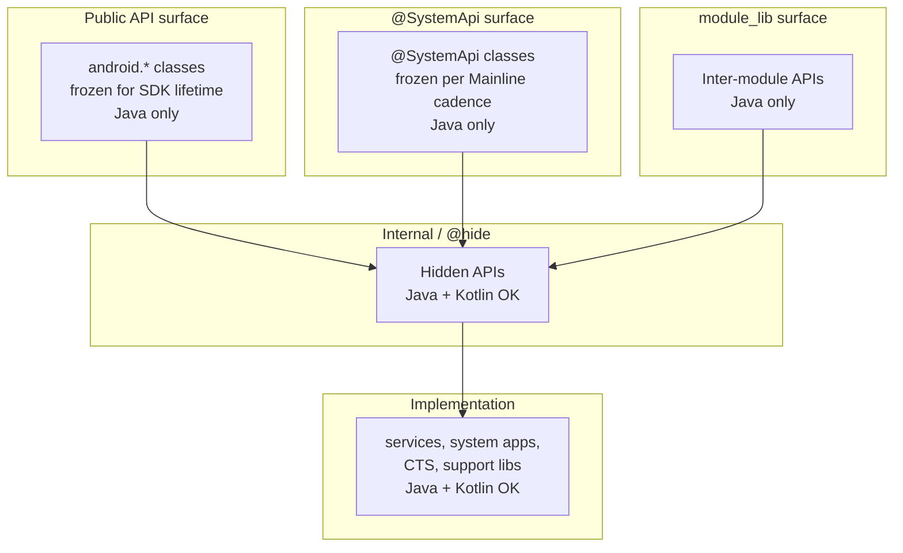

The diagram is not a build-time dependency graph. It is a freedom-of-language
map. Each higher box constrains itself to Java so that the languages used below
it cannot leak through. A class in `android.*` may end up calling a Kotlin
implementation in a service, but the call goes through a binder interface or a
manager-class facade whose signature is Java-shaped. The point at which a method
is exposed to apps is the point at which Kotlin stops.

## The Public API Contract

The phrase "public API" inside AOSP has a precise definition: it is the set of
class members listed in `frameworks/base/core/api/current.txt` (and the adjacent
`system-current.txt`, `module-lib-current.txt`, `test-current.txt`). This file
is human-readable text. Its first lines look like:

```
// Signature format: 2.0
package android {

  public final class Manifest {
    ctor public Manifest();
```

Every entry is a fully resolved JVM signature: package, modifiers, return type,
parameter types, exceptions. There are no Kotlin keywords in the file because
the format predates Kotlin and was designed to describe what the runtime sees,
not what the source-level developer wrote.

The shape of an entry is worth dwelling on. A class declaration nests inside a
`package` block, with each member declared as a single line containing:

- The visibility (`public`, `protected`).
- Modifiers in a fixed order (`static`, `final`, `abstract`, `synchronized`,
  `native`, `default`).
- The return type, qualified by package.
- The member name.
- For methods, the parameter list with each parameter typed and named.
- For methods, an optional `throws` clause listing checked exceptions.

The format is whitespace-significant in places (each member starts with leading
spaces matching its nesting depth) but otherwise has the regularity of a
generated artifact. Diff tools have no trouble showing what changed between two
snapshots, which matters because almost every framework change runs through the
`m update-api` workflow and produces a textual delta that the API council
reviews member by member.

Several signature surfaces exist in parallel — public (`current.txt`),
`@SystemApi` (`system-current.txt`), the module-library surface used by Mainline
(`module-lib-current.txt`), and `@TestApi` (`test-current.txt`) — plus per-
subsystem files such as `frameworks/base/services/api/current.txt`. They all
share the same format. Each surface is produced by **metalava**, a Kotlin tool
at `tools/metalava/` that reads framework source through PSI (for Kotlin) and
Turbine (for Java) and emits the language-neutral signature text. The build
re-runs metalava, compares the generated snapshot against the checked-in
`current.txt`, and fails the build on any drift; intentional additions go
through `m update-api` plus API council review of the textual delta.

How a framework class becomes part of the public API contract.

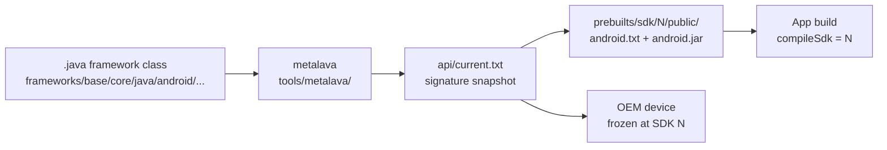

Once an API ships in a numbered SDK release, its signature is frozen forever.
Each SDK release snapshots the surface into `prebuilts/sdk/<N>/public/api/
android.txt` and pins the stub jar that apps compile against at
`prebuilts/sdk/<N>/public/android.jar`. Removing an entry, changing a parameter
or return type, or changing the JVM signature behind an unchanged textual entry
all count as breaking changes.

Devices bake an SDK level in at manufacture, and that determines the "stable
forever" promise. A phone that launched with SDK 30 will still be running
SDK 30 four or five years later (longer for OEM long-life devices). Apps
targeting `compileSdk = 30` must continue to install and run on that device.
The OEM cannot fix a regression in the platform's binary contract by issuing a
kotlinc upgrade or a metadata format update, because the original device's
runtime classloader is what defines compatibility.

That window — roughly ten years from first ship to last realistic in-service
use — is the time horizon every member of `current.txt` must survive. The API
council applies that horizon every time it approves a new method, and once it
ships the signature cannot be retracted.

## The Java/Kotlin ABI Gap

The compatibility problem is not that Kotlin lacks features. It is that the
mapping from Kotlin source to JVM signatures has degrees of freedom that the
Java mapping does not. The kotlinc compiler, the Kotlin metadata format, and the
Kotlin standard library can all evolve. When they do, the JVM-visible signatures
of an unchanged source class can shift. For internal code that recompiles in
lock-step with kotlinc, this is invisible. For a frozen public surface, every
shift is a binary break.

This section walks through the specific feature surfaces where the mapping is
unstable.

### `@JvmOverloads` and default-arg overload freeze

Kotlin lets a function declare default values for parameters. From a single
source declaration:

```kotlin
fun openFile(path: String, mode: Int = 0, encoding: String = "UTF-8"): File
```

Without an annotation, kotlinc emits a single JVM method:

```
openFile(Ljava/lang/String;ILjava/lang/String;)Ljava/io/File;
```

Java callers must pass all three arguments. With `@JvmOverloads`, the compiler
synthesizes additional overloads — one for each truncation of trailing defaulted
parameters:

```
openFile(Ljava/lang/String;)Ljava/io/File;
openFile(Ljava/lang/String;I)Ljava/io/File;
openFile(Ljava/lang/String;ILjava/lang/String;)Ljava/io/File;
```

On a public surface this raises two distinct freezing problems. First, the set
of synthesized overloads is determined by the order of parameters: changing the
order in source changes the synthesized signatures. Second, default values are
encoded as `$default` synthetic helpers (e.g. `openFile$default`) that the
compiler inserts into the bytecode. The presence and shape of these helpers is
part of the binary surface a Java caller sees. Removing `@JvmOverloads` from a
public class would silently delete several JVM methods and break any compiled
caller. Adding a new parameter at the end (even with a default) appends new
entries to the overload set, but reordering existing parameters renames them.

The note compiled while writing this appendix confirms that the only AOSP usages
of `@JvmOverloads` are in `frameworks/base/services/tests/displayservicetests/`
— test utility files like `TestUtils.kt`, `PersistentDataStoreTestUtils.kt`,
`DisplayDeviceConfigTestUtils.kt`, and `ClamperTestUtils.kt`. No production
service uses it. The reason is straightforward: production Kotlin in AOSP only
calls into Java, never the reverse. There is no Java caller in the platform that
needs the synthesized overloads.

### `@JvmStatic` and the `Companion.foo()` vs `Foo.foo()` choice

A Kotlin `companion object` holds members that look like statics from inside
Kotlin (`MyClass.foo()`) but are emitted as instance methods on a synthetic
inner `Companion` class. Without `@JvmStatic`:

```kotlin
class Foo {
    companion object {
        fun bar() = 42
    }
}
```

The Java-visible signatures are:

```
public final class Foo
public static final class Foo$Companion
    public final int bar()
public static final Foo$Companion Foo.Companion
```

A Java caller writes `Foo.Companion.bar()`. Annotating with `@JvmStatic` adds a
second, static, copy of the method on the outer class:

```kotlin
class Foo {
    companion object {
        @JvmStatic fun bar() = 42
    }
}
```

```
public final class Foo
    public static final int bar()
public static final class Foo$Companion
    public final int bar()
```

Now `Foo.bar()` works from Java too. The decision is observable in `current.txt`
because both methods are part of the public surface. Once shipped, neither can
be removed.

The AOSP usage pattern of `@JvmStatic` confirms the asymmetry: every hit in
`frameworks/base/services/` is inside the `services/tests/` subtree, where the
JUnit runner (Java) needs to invoke `@BeforeClass`/`@AfterClass` methods
declared on Kotlin test companions. Concrete example from `ApexUpdateTest.kt`:

```kotlin
@JvmStatic
@BeforeClassWithInfo
fun initApexHelper(testInformation: TestInformation) {
    apexInstallHelper = ApexInstallHelper(testInformation)
}
```

Production Kotlin avoids `@JvmStatic` because nothing in the platform calls
those Kotlin methods from Java. Public API code, by definition, must be callable
from Java apps — so every static factory or constant in a public Kotlin class
would have to commit to one of these emission shapes and freeze it.

### `@JvmName` mangling

Kotlin allows the source-level function name to differ from the JVM-level method
name:

```kotlin
@JvmName("safeOpen")
fun open(path: String): File
```

The Kotlin caller writes `open(path)`. The Java caller writes `safeOpen(path)`.
On the JVM, only `safeOpen` exists. Removing the `@JvmName` annotation (or
changing its argument) renames the symbol that Java code is linked to. On a
public surface, this is a hard break for every app already compiled against the
previous name.

`@JvmName` is also implicitly applied in places the developer does not annotate.
Top-level Kotlin functions compile into a synthetic class named after the source
file (e.g. `Utils.kt` becomes `UtilsKt`). The class name can be customized with
`@file:JvmName("Utils")`. The framework's API surface contract has no way to
express "rename the synthesizing class" without breaking apps that resolved
against the old name.

### `suspend` functions and `Continuation` in JVM signatures

A `suspend` function in source:

```kotlin
suspend fun load(): Result
```

Becomes a JVM method whose signature appends a `kotlin.coroutines.Continuation`
parameter:

```
load(Lkotlin/coroutines/Continuation;)Ljava/lang/Object;
```

The return type is erased to `Object` because the coroutine machinery delivers
the result asynchronously. For an internal Kotlin caller, the source-level
signature is what matters; the compiler hides the transformation. For a Java
caller, the only thing visible is the JVM signature — including `Continuation`,
including the erased return type, including the way exceptions get wrapped into
`kotlin.Result` boxing.

Two stability problems flow from this. First, `kotlin.coroutines.Continuation`
is a Kotlin standard-library type. Its package, its method names, and the
runtime semantics it expects must remain frozen at the JVM level. Second, the
lowering of `suspend` to `Continuation` is a kotlinc implementation choice. Past
Kotlin releases have considered alternative lowerings (state machines vs.
CPS-style, different boxing strategies). A future kotlinc that adjusted the
lowering for any reason could change the JVM signature of an unchanged source
declaration.

No public Android API exposes `suspend` today. Coroutine-based APIs in AndroidX
live above the framework SDK and ship as separate artifacts, where the suspend
signatures can evolve with the AndroidX artifact's own version cadence.

### `inline` functions exposing source bytecode

An `inline` function in Kotlin is not just a hint to the optimizer; it is a
contract that the function's body will be inlined at every call site. Kotlin
uses this for `reified` type parameters (which require the type to be visible at
the call site, not erased) and for performance-sensitive lambda-taking APIs.

The implication for binary stability is that the compiled bytecode of an
`inline` function — every instruction in its body, including references to
private helpers — is copied into every caller's class file. If the framework
declares a public `inline fun` and the source body changes between SDK releases,
apps that compiled against the old version still contain the old body inline.
Conversely, if the framework needs to fix a bug in an `inline` function, only
newly recompiled callers see the fix.

For a platform that ships compiled apps to billions of devices, "the fix only
applies if every caller rebuilds" is not viable. Java has no equivalent: `static
final` methods can be redirected at the implementation, but the JVM resolves
them through the runtime classloader. A Kotlin `inline` function is closer to a
C++ header-defined template than to a Java method, and the freezing semantics
that work for Java methods do not work for inlined Kotlin bodies.

### Value classes / inline classes and parameter-signature mangling

A Kotlin value class (formerly inline class) wraps a single backing value at
compile time and unwraps it at the call boundary:

```kotlin
@JvmInline
value class UserId(val value: Long)

fun grantAccess(user: UserId)
```

The JVM emission for `grantAccess` is not `grantAccess(LUserId;)V`. It is
mangled: kotlinc inserts a hash of the parameter shape into the method name to
avoid clashing with overloads where `UserId` and `Long` would erase to the same
signature:

```
grantAccess-{hash}(J)V
```

The exact mangling scheme — what gets hashed, what character separates the
original name from the hash, how synthetic constructors interact — has been
refined across Kotlin releases. A frozen public API cannot tolerate the mangling
scheme changing, and it cannot tolerate the developer inadvertently adding an
overload that perturbs the hash of an existing method.

### `Result<T>` mangling on JVM

`kotlin.Result<T>` is a value class. Any function returning `Result<Foo>` is
subject to the same name-mangling that any other value-class-returning function
gets:

```kotlin
fun fetch(): Result<Data>
```

Becomes something like `fetch-{hash}()Ljava/lang/Object;` at the JVM level. The
Java type seen at the call boundary is `Object` because `Result` boxes through
erasure. Direct Java consumption of a `Result`-returning Kotlin API is awkward
at best.

The official Kotlin guidance is that `Result` should not appear in public
Java-visible APIs. For internal code that interoperates between Kotlin callers,
`Result` is convenient. For a public surface that must be Java-callable, it is
not viable.

### Companion-object `INSTANCE` static fields

A Kotlin `object` (declared at the top level, not as a companion) compiles to a
class with a single static `INSTANCE` field:

```kotlin
object UriRegistry {
    fun lookup(scheme: String): Class<*>? = ...
}
```

Becomes:

```
public final class UriRegistry
    public static final UriRegistry INSTANCE
    public final Class<?> lookup(String)
```

A Java caller writes `UriRegistry.INSTANCE.lookup("content")`. The `INSTANCE`
field is part of the binary surface. Renaming the `object` in Kotlin source
renames the class; restructuring the singleton (for instance, splitting it into
a per-user-id keyed map) deletes the `INSTANCE` field. Both are breaking changes
for any compiled Java caller, and they appear in `current.txt` as field entries
that must survive the SDK lifetime.

Companion object `INSTANCE` accessors (the `Foo.Companion` field generated for
any `class Foo { companion object { ... } }`) have the same property. They are
public fields the binary surface must preserve.

### `data class` synthesis and `componentN` accessors

A Kotlin `data class` triggers the compiler to synthesize a fixed set of members
alongside the declared fields:

```kotlin
data class Point(val x: Int, val y: Int)
```

becomes, at the JVM level, approximately:

```
public final class Point
    public Point(int x, int y)
    public final int getX()
    public final int getY()
    public final int component1()
    public final int component2()
    public final Point copy(int x, int y)
    public static Point copy$default(Point, int, int, int, Object)
    public boolean equals(Object)
    public int hashCode()
    public String toString()
```

Each synthesized member is part of the binary surface. The `componentN`
accessors enable Kotlin destructuring (`val (x, y) = point`); they are numbered
by parameter position. Reordering the fields in source renames the components:
what was `component1` becomes `component2`. The `copy` method takes the same
parameters as the constructor; adding a new field at the end appends a parameter
to `copy` and keeps the `copy$default` synthetic helper; reordering the fields
again breaks compiled callers that named-arg `copy`.

A public `data class` would have to commit to its field order, its `componentN`
numbering, the `copy` overload set, and the synthesized `equals`/`hashCode`
semantics for the SDK lifetime. This is more constraint than a Java `record`
(where only the canonical accessor names and the `equals`/`hashCode` contract
are guaranteed) and it is more constraint than a hand-rolled Java class (where
the developer chooses which of these members exist).

### Top-level functions and the `Kt` synthetic class

Kotlin allows functions and properties at file top level, outside any class:

```kotlin
// File: PathUtils.kt
package android.os

fun normalizePath(path: String): String = ...
const val PATH_SEPARATOR = "/"
```

kotlinc compiles this into a synthetic class whose name is the file name with
`Kt` appended:

```
public final class PathUtilsKt
    public static String normalizePath(String)
    public static final String PATH_SEPARATOR
```

The class name is part of the binary surface. Renaming the source file renames
the class; `@file:JvmName("PathUtils")` overrides the suffix. For Java callers,
the static methods are reachable as `PathUtilsKt.normalizePath(...)` (or
`PathUtils.normalizePath(...)` if the JvmName is set). For Kotlin callers, the
synthetic class is invisible — they import the function directly.

A public top-level function in the framework would commit to a class name that
did not exist in the source. Renaming the file would silently break compiled
Java callers. Splitting the file would split the synthetic class into two
synthetic classes, again breaking callers. Java has no equivalent: every static
method in Java sits on a developer-named class, so the class identity is part of
the source-level decision.

### Boot classpath sharing forces one stdlib version on every app

Everything above describes how a single Kotlin source declaration produces a
*set* of JVM artifacts — signatures, helpers, mangled names, metadata blobs —
that the framework would have to freeze. There is a second binary-stability
concern operating one layer beneath signature shape: the Android runtime model
loads the public framework API into a classloader that every app on the device
shares, and a public Kotlin API would force `kotlin-stdlib.jar` into that
shared classloader too.

The framework's public API ships as `framework.jar` (plus adjacent jars like
`services.jar`, `framework-graphics.jar`, `framework-location.jar`, `ext.jar`,
`telephony-common.jar`) on the device's **boot classpath**. The composition is
configured by Soong via `PRODUCT_BOOT_JARS`, with the default set defined at
`build/make/target/product/default_art_config.mk:38` — `framework-minus-apex`,
`ext`, `telephony-common`, `framework-graphics`, `framework-location`, and the
per-APEX jars (ART, conscrypt, i18n, and the rest). At device boot, ART
ahead-of-time compiles these jars into a boot image and the zygote process
loads it into its address space.

`com.android.internal.os.ZygoteInit.preloadClasses()` at
`frameworks/base/core/java/com/android/internal/os/ZygoteInit.java:284` reads
the `/system/etc/preloaded-classes` text file and eagerly initializes every
named class so that the boot image's class objects, static fields, and
JIT-compiled code are resident in the zygote's heap before any app forks.
Every app process started afterward is forked from that zygote and inherits
the resolved class objects directly — `android.app.Activity` is literally the
same class object in the zygote and in every app, with no per-app load step.

App-specific code sits one classloader below. An installed APK is loaded by
`dalvik.system.PathClassLoader`
(`libcore/dalvik/src/main/java/dalvik/system/PathClassLoader.java:44`) whose
parent is the boot classloader. `ClassLoader.loadClass()`
(`libcore/ojluni/src/main/java/java/lang/ClassLoader.java:622`) follows the
standard parent-first delegation: it calls `parent.loadClass(name)` at line
630 *before* it ever calls `findClass()` on its own dex at line 642. Any
class name that resolves in BOOTCLASSPATH wins over the same name in the
app's APK.

For Java this is unproblematic. The framework's transitive dependencies on
`java.*` and `javax.*` are themselves part of the JDK's strictly-versioned
core, evolving under OpenJDK with explicit JLS compatibility guarantees, and
apps cannot ship their own `java.util.HashMap` even if they wanted to — the
classloader delegation hands every resolution back up to the platform copy by
design. For Kotlin it is the central sticking point. A `suspend` function on
the public surface drags in `kotlin.coroutines.Continuation`. A
`Result<T>`-returning method drags in `kotlin.Result`. Even a plain class
written in Kotlin emits a `@kotlin.Metadata` annotation that the Kotlin
reflection layer reads when an app calls `Foo::class` on the class. All of
those types live in `kotlin-stdlib.jar`.

The verified state today: no boot classpath jar in AOSP links `kotlin-stdlib`.
`external/kotlinc/Android.bp:59` declares `kotlin-stdlib` as a `java_import`
of the prebuilt jar, but the modules that depend on it are non-boot — SystemUI's
plugin and shared subprojects explicitly set `static_kotlin_stdlib: false` to
keep their own stdlib internal to their APK rather than promoted to shared
state. The Kotlin code that does run inside boot-classpath jars (parts of
`system_server` and other framework services, see "Where Kotlin Already Lives
in AOSP" below) compiles to JVM signatures that hold no Kotlin type at the
public boundary, so no `kotlin-stdlib` reference reaches the shared
classloader.

Adding the first public Kotlin signature inverts that. The framework jar that
exposes a `Result<T>` return type, a `suspend` parameter, or even just a public
top-level function's synthetic `Kt` class with Kotlin metadata must link
against `kotlin-stdlib`, and that `kotlin-stdlib` would have to ship inside
the boot classpath. Every app process forked from the zygote would resolve
`kotlin.Result`, `kotlin.coroutines.Continuation`, and the metadata-format
types from the boot classpath — not from the version bundled in the app's own
APK.

This is more disruptive than the Java analogue because of where Kotlin sits on
the version-stability spectrum. Apps today commonly ship with different
`kotlin-stdlib` versions — a library compiled against Kotlin 1.6 in the same
APK as application code on Kotlin 2.0, with R8/D8 at `prebuilts/r8/r8.jar`
minifying the union into the APK's `classes.dex`. Parent-first delegation
means the on-device boot classpath's `kotlin-stdlib` wins regardless of which
version the app's Gradle build selected. If the device's `kotlin-stdlib` is
older than the app's, methods the app linked against may be absent and
`NoSuchMethodError` surfaces at runtime; if it is newer with a tightened
nullability or generic signature, the app's compiled call sites may fail
bytecode verification. The app developer has no recourse from inside the APK
because the resolution happens above their classloader.

The only existing AOSP precedent for working around this kind of conflict is
classloader namespace isolation. WebView runs in a separate zygote —
`WebViewZygote` at
`frameworks/base/core/java/android/webkit/WebViewZygote.java:32` — so the
WebView APK's transitive dependencies do not have to coexist with the main
zygote's preloaded class set. The cost is a second zygote process, a second
copy of every shared library both processes touch, and an explicit inter-
zygote contract for which classes are sharable. Replicating that pattern for
"Kotlin-using" apps would mean either a per-stdlib-version zygote (which the
system cannot predict at fork time) or a runtime classloader rewrite that
lets each app see its own `kotlin-stdlib` while still resolving `android.*`
from the boot — neither of which exists today.

Java method-signature stability vs. Kotlin metadata pinning.

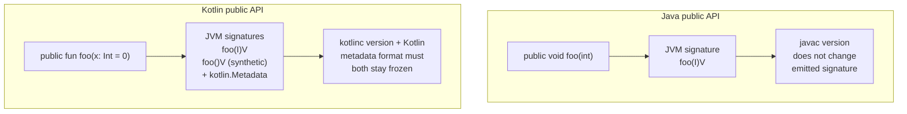

The contrast in that diagram is the engineering crux. For Java, a single source
declaration maps to a single, well-defined JVM signature, and `javac` versions
do not change that mapping. For Kotlin, a single source declaration maps to a
*set* of JVM artifacts — signatures, synthetic helpers, mangled names,
`Continuation` parameters, value-class hashes, plus the `kotlin.Metadata`
annotation blob that the Kotlin reflection and tooling layers parse to
reconstruct source-level semantics. The shape of that set depends on the kotlinc
version, the metadata format version, and the interop annotations the source
uses. To freeze a Kotlin public API the way Java APIs are frozen, every piece of
that machinery would need to be declared a binary contract — kotlinc cannot
evolve any of them without breaking compiled callers. And, as the boot
classpath section above showed, that contract would extend past the
framework's own signatures into the `kotlin-stdlib` version that the device's
shared classloader would force on every Kotlin-using app.

## Toolchain Lock-In

The signature contract described in "The Public API Contract" is enforced by a
Java-shaped toolchain. Even where individual tools happen to be written in
Kotlin, their input and output formats are designed for the Java/JVM signature
model.

**Metalava** lives at `tools/metalava/`. It is itself a Kotlin tool — 657 `.kt`
files across its sub-modules. That metalava is written in Kotlin while operating
on a Java-shaped API is part of the constraint, not a contradiction: metalava
can consume Kotlin source to produce signatures, but the signature *format*
(defined in `tools/metalava/FORMAT.md`) has no syntax for Kotlin-specific
constructs. There is no way to write `suspend`, `inline`, `value class`, or
`data class` in `current.txt`. A Kotlin source file that uses those features is
either flattened to its JVM-visible projection (losing the source-level
semantics) or rejected by API lint.

The flattening is informative. Metalava has a unified `Item` model — a class is
an `Item`, a method is an `Item`, a field is an `Item` — and that model is
intentionally language-neutral. The PSI frontend (which reads Kotlin source) and
the Turbine frontend (which reads Java source) both produce Items in the same
shape. When metalava emits a signature, it walks the Items and writes them in
the format spec. A Kotlin `data class Foo(val x: Int)` is read by the PSI
frontend, then projected to the equivalent Java declarations: a class with a
final field-style accessor `getX`, a synthesized constructor, and the
`equals`/`hashCode`/`toString`/`copy`/`componentN` cluster. The signature file
shows the projection, not the source. The frozen-forever contract is the
projection; the source is implementation detail.

This also means that an internal Kotlin source change — refactoring a `data
class` to add a new field, splitting a sealed hierarchy, renaming a top-level
function — does not show up in `current.txt` as long as the Kotlin members are
not part of the public surface. Metalava only includes members it sees as
`public` or `protected` and that are not annotated `@hide`. The vast majority of
the 35 Kotlin files in `frameworks/base/core/` qualify as `@hide` or as
package-private, so they exist but are invisible to the API check.

The metalava module layout shows the separation of concerns:

- `tools/metalava/metalava/` — the main tool entry point.
- `tools/metalava/metalava-model/` — abstract API model independent of any
  language frontend.
- `tools/metalava/metalava-model-psi/` — Kotlin source frontend (using JetBrains
  PSI).
- `tools/metalava/metalava-model-source/` — generic source-based model.
- `tools/metalava/metalava-model-text/` — text (signature file) frontend, used
  for round-tripping `current.txt`.
- `tools/metalava/metalava-model-turbine/` — Turbine-based Java frontend.
- `tools/metalava/metalava-reporter/` — issue reporting subsystem.
- `tools/metalava/metalava-testing/` — test utilities.
- `tools/metalava/stub-annotations/` — annotation jar used in generated stubs.

The text model is the canonical one. PSI and Turbine exist to feed it. A future
Kotlin-aware public API would need a text model that can express, and
round-trip, every Kotlin construct it would admit on the public surface.

**Documentation generation**. The platform reference documentation pipeline runs
Doclava (the historical Javadoc-derived tool) and Dackka (the newer Kotlin-aware
doc tool). Dackka understands Kotlin source but produces documentation pages
that describe the Java-projection of Kotlin APIs — because that is what app
developers see in their IDE when they call into the platform. A Kotlin `data
class` shows up in the docs with its synthesized `equals`, `hashCode`,
`toString`, `copy`, and `componentN` methods listed individually, because that
is what Java callers see. The documentation can show source-level Kotlin shape
only when the reader is in Kotlin mode; the underlying contract is still the JVM
projection.

**Hidden API enforcement** is the second pillar of the Java-shaped toolchain.
The blocklist is maintained in plain-text files under
`frameworks/base/boot/hiddenapi/`:

- `hiddenapi-unsupported.txt` — fully blocked APIs.
- `hiddenapi-unsupported-packages.txt` — entire packages with the surface
  blocked.
- `hiddenapi-max-target-o.txt` — APIs targeted at SDK O or earlier (legacy
  block).
- `hiddenapi-max-target-p.txt` — APIs targeted at SDK P or earlier.
- `hiddenapi-max-target-q.txt` — APIs targeted at SDK Q or earlier.
- `hiddenapi-max-target-r-loprio.txt` — APIs targeted at R or earlier, low
  priority.

A blocked Kotlin extension function appears as
`Lcom/example/UtilsKt;->extensionMethod(Lcom/example/Receiver;)V`, not by its
Kotlin source signature. Each line in these files is a JVM descriptor in the
form `Lpackage/Class;->method(Lpackage/Type;)Lpackage/Return;`. The format is
the same form used by `dexdump`, by ART's runtime checks, and by every tool that
introspects compiled class files. Kotlin source compiles into JVM class files,
so Kotlin code is reachable via these descriptors — but the descriptor uses the
kotlinc-emitted shape, not the source-level Kotlin name.

The build system merges the source text files into a single generated CSV:

- `out/soong/hiddenapi/hiddenapi-flags.csv` — the build-time artifact, ~750k
  rows. Each row is a member descriptor plus a flag list (`public-api`, `sdk`,
  `system-api`, `test-api`, `blocked`, etc.).
- `prebuilts/runtime/appcompat/hiddenapi-flags.csv` — the prebuilt copy shipped
  for app-compat checks (~51 MB).

Sample rows from the generated file:

```
Landroid/Manifest$permission;-><init>()V,public-api,sdk,system-api,test-api
Landroid/Manifest$permission;->ACCEPT_HANDOVER:Ljava/lang/String;,public-api,sdk,system-api,test-api
Landroid/Manifest$permission;->ACCESSIBILITY_MOTION_EVENT_OBSERVING:Ljava/lang/String;,blocked,test-api
```

The CSV is loaded into ART at runtime. When an app calls
`Manifest.permission.ACCESSIBILITY_MOTION_EVENT_OBSERVING`, the runtime checks
the flags. `blocked` triggers a hard exception; the various `max-target-*` flags
trigger softer warnings or version-gated blocks. The granularity is
per-descriptor. A Kotlin API that emits multiple descriptors per source
declaration (overloads from `@JvmOverloads`, the `Companion` accessor plus the
`@JvmStatic` projection, the value-class-mangled name plus an unmangled erased
fallback) would multiply the entries needed to express the same source-level
intent in this CSV.

**jarjar rules**. Several framework modules rewrite their dependency class names
during build to avoid colliding with app-visible classes. The rules are declared
in `.jarjar` files processed by the jarjar tool. Kotlin metadata annotations
(`kotlin.Metadata`) embed string references to the original class names — a
jarjar rewrite that renames `kotlin.collections.MapsKt` to
`com.android.internal.kotlin.collections.MapsKt` would mismatch with the
metadata blob and break Kotlin reflection at runtime. Java has no equivalent
embedded metadata; jarjar over Java is a straightforward textual rewrite.

**`@SystemApi` and `@UnsupportedAppUsage`** are processed by metalava and by the
hidden API toolchain. `@SystemApi` widens the surface for platform-signed
callers; the corresponding `system-current.txt` is its frozen signature.
`@UnsupportedAppUsage` is the annotation framework code uses to mark members
that should land in the hidden API CSV with a specific max-target flag — a
Kotlin equivalent of these annotations would need both a Kotlin source-level
annotation type and a metalava rule to project that annotation into the
generated CSV correctly.

The annotations themselves come with subtle constraints. `@SystemApi` accepts
client-type arguments (`MODULE_LIBRARIES`, `PRIVILEGED_APPS`, `MODULE_APPS`)
that gate which downstream consumers see the member. Metalava reads those
arguments and routes the member into the appropriate signature surface; an
incorrectly routed annotation leaks into the wrong `current.txt`, and the
build's `m checkapi` step catches the leak. For Java source, the annotation
processing is unambiguous: the annotation sits on the declaration, metalava
reads the AST node, the routing happens. For Kotlin source, metalava has to
reach the same conclusion via a Kotlin source frontend — and any future Kotlin
annotation that has source-level shape (file-level annotations, target-class
extensions, repeating annotations with non-trivial retention semantics) needs
explicit support in the metalava annotation extraction logic in
`tools/metalava/.../ExtractAnnotations.kt`.

The `out/soong/hiddenapi/hiddenapi-flags.csv` artifact is the merge point of
every input mentioned above: source `.txt` blocklists, `@SystemApi` membership,
`@UnsupportedAppUsage` annotations, and public-API stub descriptors all flow
through Soong into a single descriptor-keyed table. The same machinery feeds
`prebuilts/runtime/appcompat/hiddenapi-flags.csv`, the prebuilt copy older
runtimes consult during app-compat fallbacks. Any change to the descriptor
shape, the flag vocabulary, or the way Kotlin members map to descriptors flows
through this pipeline.

## OEM, Vendor, and Mainline Constraints

The public API contract is not the only freeze in the system. Two adjacent
surfaces — the vendor partition and Mainline modules — extend the "stable
forever" property to additional layers.

**Vendor partition freeze**. When an OEM device launches with SDK level N, the
vendor partition is built against the system-API and module-library surfaces
frozen at that level. Subsequent OS upgrades on the same device (within Project
Treble's framework-vendor split) must preserve binary compatibility with the
existing vendor partition. The system-API surface acts as the binary contract
between the framework (Java + Kotlin allowed internally, Java-shaped externally)
and vendor code (typically C++, sometimes Java). A Kotlin emission shift on a
`@SystemApi` class would break vendor partitions on every device that compiled
against the previous shape.

**Mainline APEX modules** are the second freeze. A Mainline module is an APEX
package containing platform components that ship through Play Store updates
rather than full system OTAs. The architecture is documented in
`system/apex/docs/README.md` (with supporting docs in
`system/apex/tests/README.md` and `system/apex/shim/README.md`). Each Mainline
module declares a `min_sdk_version` and is compiled against the module-library
surface at that SDK level. The APEX-build rules live in
`build/soong/apex/apex.go` and `build/soong/android/apex.go`, which together
enforce that an APEX file does not depend on symbols outside its declared SDK
floor.

A Mainline module that ships in Play Store updates to a five-year-old device
must still resolve every symbol it references against that device's frozen
module-library surface. If the framework introduced a new Kotlin-shaped public
method between SDK N and SDK N+3, the device at SDK N would not have it. The
Mainline module either has to declare a higher `min_sdk_version` (losing reach)
or stay Java-shaped (losing nothing).

**kotlinc release cadence vs. AOSP cadence**. Soong's Kotlin integration
hard-pins a specific kotlinc version. The build's prebuilt kotlinc lives at
`external/kotlinc/`, with version stamped in `external/kotlinc/build.txt`:

```
2.2.0-release-294
```

The pinning is enforced in Soong's compiler-flag plumbing:

- `build/soong/java/kotlin.go` — defines the Ninja rules for `kotlinc`
  invocation, kotlin-jar snapshotting, and incremental compilation.
- `build/soong/java/kotlin_test.go` — unit tests for those rules.
- `build/soong/java/config/kotlin.go` — declares the variables Soong uses to
  find kotlinc components (`external/kotlinc/bin/kotlinc`,
  `external/kotlinc/lib/kotlin-stdlib.jar`,
  `external/kotlinc/lib/kotlin-compiler.jar`, the Compose plugin, kapt,
  jvm-abi-gen).

The same config file forbids callers from overriding `-no-jdk`, `-no-stdlib`, or
`-language-version`. The platform decides which Kotlin language version to
compile against; individual modules cannot opt into a newer or older version.
The kotlinc JVM is invoked with `-J-Xmx8192M` to handle the heap pressure of
compiling the platform's Kotlin modules in a single pass.

The pinned kotlinc version is the source of a coupling problem. AOSP picks a
version, validates it across the tree, ships it. Public APIs compiled with that
kotlinc emit the JVM signatures that version produces. Upgrading kotlinc to a
newer version (for a Compose update, for a Kotlin language feature the platform
wants internally, for a security fix) could change the emitted signatures of any
public Kotlin class. The current solution to that risk is to keep public classes
Java. The risk does not arise.

For internal Kotlin (services, SystemUI, Settings, apps), the kotlinc pin is
fine. Everything internal recompiles when kotlinc is upgraded. The frozen
artifacts are the public stubs and the hidden API CSV; both are regenerated as
part of the kotlinc bump and the changes are validated by the API and hidden API
checks before the bump lands.

A concrete way to see the cadence problem is to walk through what would happen
if the framework added a single Kotlin public method to `android.os.SomeClass`.
The method ships in SDK level N, compiled by kotlinc 2.2.0. The frozen artifact
at `prebuilts/sdk/N/public/api/android.txt` records the JVM signature kotlinc
2.2.0 produced. Devices launch with SDK N and bake that artifact into their stub
jar. A year later, AOSP picks up kotlinc 2.4.0 to enable a new Compose feature.
If kotlinc 2.4.0's emission of the same source class produces a different JVM
signature — even slightly, even for an opaque mangling reason — apps that
compiled against the SDK N stub will fail to resolve the method on devices
running the new framework. The framework either has to keep the old kotlinc
emission shape pinned (defeating the purpose of the upgrade) or to ship a
compatibility shim that forwards the new shape to the old shape (multiplying the
surface). Java has neither problem because `javac` does not have feature
versions that affect emitted signatures.

The vendor-side mirror of the kotlinc problem is that vendor partitions are
typically built once, at device launch, and not rebuilt for the life of the
device. A vendor service that links against a framework Kotlin API gets the
kotlinc-N emission baked in. When the framework is updated to kotlinc N+1 via an
OS upgrade, the vendor partition still expects kotlinc-N emission. The framework
cannot recompile the vendor partition. Java avoids this entirely;
Kotlin-on-the-public-surface would create a new freeze axis (kotlinc emission
shape) that has no counterpart in the vendor-partition contract today.

The Mainline picture sharpens the problem because Mainline modules ship more
frequently than the OS. A Mainline APEX built today targets a `min_sdk_version`
of (say) Android 11. It must run on every device at SDK 11 or higher. If the
framework introduced a Kotlin public API at SDK 12 and the Mainline module wants
to use it, the module either:

1. Raises its `min_sdk_version` to 12 (losing reach across older devices).
2. Uses runtime reflection to call the API conditionally (defeating compile-time
   type checking).
3. Stays on the equivalent Java API.

Option 3 is the path of least resistance, which is what the inventory above
shows: Mainline modules are Java-shaped on their entry points, even when their
internal implementations are Kotlin.

The historical context matters as well. Project Treble formalized the
framework-vendor split, and the system-API surface was retrofitted to be a
stable contract across that split. The Mainline initiative formalized the
framework-module split, and the module-library surface was added on top of
system-API to give modules a controlled inter-module contract. Each new freeze
axis was added with explicit signature management, explicit toolchain support,
and explicit test infrastructure. Adding "Kotlin emission shape" as a fourth
freeze axis would require equivalent work — which has not happened.

For deeper context on the APEX format and update flow, see [Chapter 54 —
Mainline Modules](54-mainline-modules.md) at the repo root.

## Where Kotlin Already Lives in AOSP

Kotlin's role in the platform is substantial but localized. The inventory
introduced in "The Asymmetry" can be expanded with the role each location plays:

| Path | Kotlin files | Role |
|------|--------------|------|
| `frameworks/base/packages/SystemUI/` | 7,846 | System UI shell: lock screen, notifications, quick settings, status bar, system bars, Compose for UI |
| `packages/apps/Settings/` | 1,576 | Settings app |
| `packages/apps/Launcher3/` | 949 | Launcher home and recents |
| `cts/` | 925 | Compatibility Test Suite (Kotlin used freely in tests) |
| `frameworks/base/services/` | 237 | All in `services/permission/`, plus tests; no other system service uses production Kotlin |
| `frameworks/base/core/` | 35 | Sparse use in framework internals; not exposed on the public API surface |
| `tools/metalava/` | 657 | The signature tool itself is Kotlin |

Within `frameworks/base/services/`, the production Kotlin is concentrated in the
permission access subsystem introduced in Android 13. Three representative files
illustrate the shape:

**`AccessCheckingService.kt`** —
`frameworks/base/services/permission/java/com/android/server/permission/access/AccessCheckingService.kt`,
323 lines. This is the entry-point class for the new permission stack. It
extends `SystemService`, registers manager interfaces with `LocalServices`, and
exposes its state via the `getState { ... }` scope helper. The relevant
fragment:

```kotlin
@Keep
class AccessCheckingService(context: Context) : SystemService(context) {
    @Volatile private lateinit var state: AccessState
    private val stateLock = Any()
    ...
    override fun onStart() {
        appOpService = AppOpService(this)
        permissionService = PermissionService(this)
        ...
        LocalServices.addService(AppOpsCheckingServiceInterface::class.java, appOpService)
        LocalServices.addService(PermissionManagerServiceInterface::class.java, permissionService)
```

It is safely Kotlin because every interface it presents to external callers —
`AppOpsCheckingServiceInterface`, `PermissionManagerServiceInterface`,
`AppFunctionAccessServiceInterface` — is a Java interface registered into a
Java-shaped service registry. Other system code calls into those Java interfaces
and never sees a Kotlin class. The service's binder surface (defined in
`IPermissionManager.aidl` and friends) is AIDL, which is Java-shaped by
construction.

The internal implementation is unapologetically Kotlin-idiomatic. Near the
bottom of the file:

```kotlin
@OptIn(ExperimentalContracts::class)
internal inline fun <T> getState(action: GetStateScope.() -> T): T {
    contract { callsInPlace(action, InvocationKind.EXACTLY_ONCE) }
    return GetStateScope(state).action()
}
```

This single declaration uses three Kotlin features that would each be
problematic on a public surface: a function type with receiver
(`GetStateScope.() -> T`) which has no Java equivalent; an `inline` function
with a `reified`-adjacent lambda parameter that gets inlined into every caller's
bytecode; and the experimental `contract` API from `kotlin.contracts`, which is
itself opt-in and source-level only. The function is `internal`, the package is
`com.android.server.permission.access` (server-only), and the only callers are
other Kotlin classes in the same package. Every one of the three problematic
features is fine here because the boundary is intra-Kotlin within a single
subsystem.

Compare with how the same pattern would have to be expressed if `getState` were
on a public Java surface. The `inline` function would have to become a regular
method (no inlining benefit). The function type with receiver would have to
become an explicit `GetStateScope` parameter. The `contract` would have no equivalent. The
result would be uglier and slower than either the Kotlin original or what an
equivalent Java design would produce — which is one of the reasons the team
chose to keep the implementation Kotlin and the boundary Java.

**`AccessPolicy.kt`** —
`frameworks/base/services/permission/java/com/android/server/permission/access/AccessPolicy.kt`,
527 lines. The `AccessPolicy` class indexes a map of `SchemePolicy`
implementations and delegates per-scheme work to subclasses. The relevant
declaration:

```kotlin
class AccessPolicy
private constructor(
    private val schemePolicies: IndexedMap<String, IndexedMap<String, SchemePolicy>>
)
```

with an abstract `SchemePolicy` base class declared later in the file. The
abstract-class-plus-subclasses pattern is purely internal:
`AppIdPermissionPolicy`, `DevicePermissionPolicy`, `AppIdAppOpPolicy`,
`PackageAppOpPolicy`, and `AppIdAppFunctionAccessPolicy` are all package-private
to the permission subsystem and do not appear in any signature file.

**`Permission.kt`** —
`frameworks/base/services/permission/java/com/android/server/permission/access/permission/Permission.kt`,
185 lines. A `data class` modeling a single permission entry with a `companion
object` of constants:

```kotlin
data class Permission(
    val permissionInfo: PermissionInfo,
    val isReconciled: Boolean,
    val type: Int,
    val appId: Int,
    @Suppress("ArrayInDataClass") val gids: IntArray = EmptyArray.INT,
    val areGidsPerUser: Boolean = false
) {
    ...
    companion object {
        const val TYPE_MANIFEST = 0
        const val TYPE_DYNAMIC = 2

        fun typeToString(type: Int): String = ...
    }
}
```

This file shows the features that would be a public-API liability — `data class`
synthesizing `equals`, `hashCode`, `toString`, `copy`, `componentN`; default
parameter values; companion-object constants — all present here without
consequence because nothing outside `services/permission/` references
`Permission` by type.

**Permission subsystem testing**. The `services/tests/` Kotlin files round out
the picture. JUnit's runner is Java; when a Kotlin test wants a `@BeforeClass`
setup, the Java runner needs a static method on the test class. Kotlin test code
therefore puts the setup inside a `companion object` and annotates it
`@JvmStatic`. The test utility files in `services/tests/displayservicetests/`
use `@JvmOverloads` to expose default-parameter helpers to Java test code that
has not been migrated to Kotlin. These usages do not appear in production
because production Kotlin in AOSP only calls into Java; only the Java test
runner actually needs to reach into Kotlin from outside.

A few additional notes on where Kotlin appears help round out the picture:

**The CTS Kotlin tests.** Roughly 925 Kotlin files live under `cts/`. CTS
validates that an OEM build conforms to the Android compatibility definition;
tests in CTS are necessarily Java-callable from the test runner, but the test
bodies themselves can be Kotlin. CTS uses Kotlin freely because the tests do not
ship in the OS — they run against the OS. The frozen-forever constraint does not
apply.

**Settings, Launcher3, and the app layer.** These apps ship with the system
image but are functionally apps. They compile against the public SDK and share
the same lifecycle constraints as third-party apps; their Kotlin use is governed
by the same rules as any well-managed Kotlin codebase. The ABI between Settings
and the framework is the public + system-API surface — Java-shaped — even though
Settings' internal classes are heavily Kotlin.

**SystemUI's role.** SystemUI is the system_server-adjacent process that hosts
the lock screen, notifications, quick settings, and system bars. It is the
largest Kotlin codebase in AOSP at 7,846 files. SystemUI's interface to the rest
of the platform is via well-defined boundaries: AIDL for binder calls, content
providers for shared state, intents for activity launches. None of those
boundaries surface Kotlin types as parameters. SystemUI can refactor freely; the
ABI it presents to the rest of the system is bounded by AIDL and the platform's
intent contracts.

**Tests across `frameworks/base/services/`.** The same Kotlin-test/Java-runner
interop pattern noted under `@JvmOverloads`, `@JvmStatic`, and "Permission
subsystem testing" appears throughout `services/tests/`; see those subsections.

**`frameworks/base/core/` Kotlin.** The 35 files here are an interesting
outlier. They include some support utilities, occasional helper classes, and a
small amount of newer code. None of them appears as a public-API entry in
`current.txt` because nothing in the Kotlin source declares a `public` type that
crosses into the `android.*` namespace and resolves through metalava as a public
member. Kotlin source can sit in `frameworks/base/core/` as long as it stays out
of the public API surface — and the API check is what enforces that boundary.

**The kotlin-stdlib boot inclusion.** When the boot classpath is computed by
Soong, the stdlib jars are added so that Kotlin classes in the boot image
resolve their stdlib dependencies at runtime. This means stdlib types like
`kotlin.collections.MapsKt`, `kotlin.coroutines.Continuation`, `kotlin.Result`,
and `kotlin.Metadata` are all reachable from any process in the system. They do
not appear in `current.txt` because metalava is told to exclude them, but they
are present at runtime. A future Kotlin-on-the-public-surface story would need
to decide whether stdlib types are part of the public API (they would be,
transitively, through any public method that returns a stdlib type) or whether
the public API can use only a vetted subset of stdlib.

## The Kotlin Features Hardest for a Public Surface

The ABI gap section walked through individual emission mechanics. This section
steps back and groups the same features by the kind of design pressure they put
on a frozen public surface.

**Companion objects.** As detailed in the `@JvmStatic` subsection of "The
Java/Kotlin ABI Gap", every companion object pins a choice of whether to expose
statics on the outer class. The choice is observable in `current.txt`; once made
it cannot be undone. For internal code the default — Java callers go through
`Foo.Companion` — is fine because there are no Java callers. For a public class,
the choice is permanent and influences the IDE experience of every app
developer. There is also a downstream subtlety: companion-object members marked
`@JvmStatic` are duplicated in the bytecode, once on the companion class and
once on the outer class. Any reflective lookup of the member sees both copies,
and tooling that walks the class hierarchy (Hilt-style dependency injection,
mock generators, runtime annotation scanners) has to reckon with the
duplication.

**Default arguments.** Detailed under the `@JvmOverloads` subsection. The
frozen-forever consequence is that reordering parameters in a public Kotlin
function would silently break previously synthesized overloads, and adding
`@JvmOverloads` later (or removing it) changes the size of the overload set.
There is a related concern around evolution: even within Kotlin, adding a new
defaulted parameter at the *end* of an existing function is source-compatible
but not always binary-compatible, because the synthetic `$default` helper takes
a bitmask whose width is parameter-count-dependent. A function that crosses an
internal kotlinc width threshold gets a different `$default` synthetic shape
and requires recompilation of all callers. Java has no equivalent; you either
add a new overload or you do not.

**Inline classes / value classes.** Detailed under the value-class subsection.
The mangling scheme depends on kotlinc; the inferred JVM signature of every
method that takes or returns a value class is a hash, not a stable string. For a
public API, the entire mangling discipline would need to be declared a binary
contract that kotlinc could not evolve. There is a second-order concern as well:
value classes "unbox" at certain call boundaries and "box" at others. The exact
unboxing rules — when a `UserId` is passed as a `long` versus when it is passed
as an object reference — is also a kotlinc emission decision that affects the
JVM signatures observable to Java callers.

**Typealiases.** Kotlin typealiases are source-level only. `typealias UserId =
Long` resolves to `Long` at the JVM level — no signature impact. They are
entirely safe in internal Kotlin and also safe at the public boundary,
*provided* metalava is taught to expand them before emitting `current.txt`.
Today metalava does this for the Kotlin source it consumes. The risk is purely
tooling. The flip side is that a typealias does not carry its own identity into
the API: two typealiases that resolve to the same underlying type are
indistinguishable at the JVM level, so `current.txt` can only ever show the
resolved type, not the alias the source author used. For a public API where
naming is part of the contract, this is a source-level pleasantry that must be
flattened away at the API boundary.

**`suspend` functions.** Detailed under the suspend subsection. The
`Continuation` parameter and the `Object` erased return type encode kotlinc's
choice of coroutine lowering. For a frozen public API the lowering would need to
be a contract. The lowering also entangles the public API with the coroutines
runtime: the `Continuation` interface lives in `kotlin.coroutines`, but the
actual coroutine machinery (dispatchers, contexts, cancellation, structured
concurrency) lives in `kotlinx.coroutines`, a separate library that has its own
version cadence and is not part of the boot classpath. A public `suspend` API
would have to declare which coroutine runtime is the implicit contract, or it
would have to ship its own runtime, or it would have to remain agnostic — all of
which are non-trivial decisions.

**Nullability annotations.** Kotlin's `T?` vs `T` is reflected in JVM method
signatures as `@Nullable`/`@NonNull` annotations (typically the JetBrains
annotations `org.jetbrains.annotations.Nullable` and `.NotNull`). For Java
callers, these annotations are advisory — the bytecode signature is the same
with or without them. For Kotlin callers consuming a Java API, the annotations
matter: they determine whether Kotlin infers `T` or `T?`. Public framework Java
uses `androidx.annotation.Nullable`/`androidx.annotation.NonNull` to express the
same intent. Migrating to Kotlin source would either preserve those annotations
explicitly or rely on kotlinc emitting JetBrains-flavor annotations — and the
framework's nullability story would have to declare which annotation namespace
is the contract. There is also a quieter concern around `platform types`: when
Kotlin code consumes a Java API without nullability annotations, the parameter
or return type becomes a "platform type" with no compile-time null check. The
reverse — a Kotlin public API consumed from Java — drops the nullability
information entirely unless metalava is taught to project it into Java-callable
annotations.

**Sealed classes and sealed interfaces.** A Kotlin `sealed` class restricts
subclassing to a known set of types declared in the same file or module. The
bytecode marks the class with a `kotlin.Metadata` flag, and Kotlin's exhaustive
`when` checking relies on it. From Java, the sealing is invisible at the
language level: a Java caller can extend the sealed class if the source-level
subclass restriction is not enforced by the JVM. kotlinc only emits the JVM
`PermittedSubclasses` attribute when targeting JVM 17+, so a public Kotlin
sealed class's enforcement floor depends on the kotlinc target version — itself
a freeze axis. A public Kotlin sealed class would have to commit to a specific
sealing semantics that survives both Kotlin and Java consumers across the SDK
lifetime.

**Extension functions.** A Kotlin extension function — `fun
String.lastSegment(): String` — compiles to a static method whose first
parameter is the receiver. The class containing the static method is named after
the source file (`UtilsKt`, by default). For Java callers, the extension
function is just a static method on a synthetic class; for Kotlin callers, it is
reachable via dot-notation on the receiver. Adding a public extension function
to the framework would put a new static method on a new (or existing) Kt class,
and removing it would delete the method. The choices about which file the
extension lives in and whether the receiver is the first or last parameter are
all observable in `current.txt`.

In every case, the feature is convenient internally and constrained externally.
The recurring theme is the same one the ABI section described: Kotlin's
source-level abstractions are richer than Java's, and the cost of that richness
is paid at compile time by mapping a single declaration into a *set* of JVM
artifacts whose exact composition depends on the compiler. A frozen-forever
surface needs each artifact to be individually nameable, individually citable,
and individually preserved across every future compiler upgrade.

## What Adoption Would Require

This is a snapshot of constraints, not a roadmap. If the AOSP project decided to
admit Kotlin on the public framework API surface, the following list captures
what would need to be in place. Items are listed in dependency order: each later
item presupposes the earlier ones.

1. **A stable Kotlin metadata format declared as a binary contract.** The
   `kotlin.Metadata` annotation embedded in every Kotlin class file encodes
   source-level shape (sealed hierarchies, nullability, default values, suspend
   lowering) that Kotlin reflection and tooling consume. Today the format is
   versioned and kotlinc-coupled. The Kotlin community has discussed binary
   stability through KEEP (Kotlin Evolution and Enhancement Process) proposals.
   For AOSP to consume Kotlin on the public surface, the metadata format would
   have to be a declared, externally-versioned binary contract, with explicit
   backward and forward compatibility guarantees and a deprecation policy that
   matches AOSP's ten-year horizon. The current per-`kotlin.Metadata`-version
   compatibility behaviour is "kotlinc N can read metadata from kotlinc N-K for
   some bounded K" — bounded enough for Gradle-driven Kotlin projects that
   recompile frequently, but not bounded for ten years.

2. **A Kotlin-aware metalava that emits `current.txt`-equivalent signatures.**
   The signature format defined in `tools/metalava/FORMAT.md` would need to grow
   syntax for Kotlin constructs: `suspend`, `inline`, `value class`, `data
   class`, `sealed class`/`interface`, default arguments, nullability,
   `companion object` shape. Each addition is an API design problem in itself —
   the new syntax must round-trip through the text model and survive future
   kotlinc evolution. The text model in `tools/metalava/metalava-model-text/`
   would need extensions to parse and emit the new constructs, and the
   comparison logic in
   `tools/metalava/metalava/src/main/.../ComparisonVisitor.kt` would need rules
   for which Kotlin-specific changes constitute breaking deltas. Today metalava
   can read Kotlin source via its PSI model
   (`tools/metalava/metalava-model-psi/`) but emits a Java-projection signature.

3. **Hidden API enforcement that tracks Kotlin descriptors.** The CSV at
   `out/soong/hiddenapi/hiddenapi-flags.csv` uses raw JVM descriptors. Kotlin
   classes already appear in it via their kotlinc-emitted shapes, but the
   per-source-feature multiplicity (one `@JvmOverloads` declaration producing N
   descriptor rows) makes per-source policy hard to express. A descriptor-level
   CSV would need a higher-level companion that maps "source declaration X is in
   the public API" to "JVM descriptors {d1, d2, ..., dN} must all be flagged
   consistently". Without that mapping, an author updating a Kotlin public API
   has no easy way to confirm that all the resulting descriptors landed in the
   right hidden API category.

4. **Updated documentation tooling.** Dackka understands Kotlin source today,
   but the reference docs would need a shared model where the Kotlin
   source-level view and the Java JVM-projection view are both first-class. App
   developers using Java tooling against a Kotlin platform API must see a
   coherent Javadoc; app developers using Kotlin tooling must see source-level
   Kotlin signatures. The current model assumes the underlying API is
   Java-shaped. A genuinely bilingual API surface implies bilingual
   documentation, with the toolchain understanding that, for instance, a Kotlin
   `data class` should be rendered with its source-level fields when viewed from
   Kotlin and with its synthesized `componentN` methods when viewed from Java.

5. **An API Council ruling on naming convention rules.** The lint rules in
   `tools/metalava/API-LINT.md` are calibrated to Java naming conventions
   (`is`/`get` accessor pairs, plural collection methods, `setOnXxxListener`
   callback registration patterns). Kotlin idioms — property syntax, operator
   overloads, infix functions, extension functions — would need explicit
   acceptance or rejection rules, ratified by the API Council as policy. The
   rules also have to compose with the Java-callable projection: a Kotlin `var`
   on a public class compiles to `getX`/`setX` Java accessors, but the rule body
   would need to specify whether the Kotlin source uses `var`, the Java accessor
   names, or both as the canonical contract.

6. **kotlinc release alignment with AOSP cadence.** A version of kotlinc that
   the framework can adopt without observable signature shifts on any public
   class. This is the strongest constraint because it ties two independent
   organizations' release cycles together. AOSP cuts a major SDK roughly
   annually; the kotlinc release train is faster and not aligned to SDK
   boundaries. The practical mitigation is to declare a "frozen kotlinc version
   per public API surface" — a Kotlin equivalent of `LOCAL_SDK_VERSION` — so
   that every shipped SDK is bound to the kotlinc that produced its signatures.
   Implementing that requires Soong machinery to track which kotlinc compiled
   which `current.txt` and to enforce the binding for downstream Mainline
   modules.

7. **Tooling for migration and audit.** Even if all of the above were in place,
   the AOSP project would face a one-time migration cost. Each existing Java
   public-API class proposed for Kotlinization would need a side-by-side audit:
   confirm that the source declarations, when run through the new Kotlin-aware
   metalava, produce the same `current.txt` entries as the Java source did.
   Anywhere the entries differ is a binary break. The audit tooling does not
   exist today.

8. **A coroutines-runtime decision for `suspend` APIs.** As discussed in "The
   Kotlin Features Hardest for a Public Surface", a public `suspend` API ties
   consumers to a coroutines runtime. AOSP would have to either (a) declare
   `kotlinx.coroutines` as a frozen platform library, with all the binary
   stability that entails, or (b) ship its own minimal coroutine runtime, or (c)
   avoid `suspend` entirely on the public surface. Each option is a multi-year
   commitment.

This list is a snapshot of the constraints visible from inside the AOSP tree
today. It is not a prediction of how (or whether) these constraints will be
addressed, and it is not advocacy for any of the items being undertaken.

## Try It

The five exercises below let you verify the appendix's claims against the actual
AOSP checkout. Each uses commands that work from the AOSP root.

### Exercise C-1: Inventory Kotlin in the platform tree

The asymmetry table at the top of the appendix is generated by counting `.kt`
files in selected paths. Run the same `find` commands to confirm the numbers in
your local tree, then compare against the inventory table in this appendix.

```bash
cd $AOSP

echo "frameworks/base/services Kotlin: $(find frameworks/base/services -name '*.kt' | wc -l)"
echo "frameworks/base/core Kotlin:     $(find frameworks/base/core -name '*.kt' | wc -l)"
echo "packages/SystemUI Kotlin:        $(find frameworks/base/packages/SystemUI -name '*.kt' | wc -l)"
echo "packages/apps/Settings Kotlin:   $(find packages/apps/Settings -name '*.kt' | wc -l)"
echo "packages/apps/Launcher3 Kotlin:  $(find packages/apps/Launcher3 -name '*.kt' | wc -l)"
echo "cts Kotlin:                      $(find cts -name '*.kt' | wc -l)"
echo "frameworks/base total Kotlin:    $(find frameworks/base -name '*.kt' | wc -l)"
echo "frameworks/base total Java:      $(find frameworks/base -name '*.java' | wc -l)"
```

**Expected output**: numbers in the same orders of magnitude as the table, with
`frameworks/base/core` and `frameworks/base/services` both small relative to the
Java total. The exact counts will drift as the tree evolves.

### Exercise C-2: Inspect a public API signature file

Open `frameworks/base/core/api/current.txt` and look at the structure. It is
large (~65k lines), so use a pager.

```bash
cd $AOSP

# Header
head -5 frameworks/base/core/api/current.txt

# Find a class entry
grep -n 'public final class Manifest ' frameworks/base/core/api/current.txt

# Locate the Java source for that class
find frameworks/base/core -name 'Manifest.java' -path '*/java/android/*'

# Confirm the file is Java
head -3 frameworks/base/core/java/android/Manifest.java
```

**What to look for**: the signature file opens with `// Signature format: 2.0`
followed by `package android {`. Every class is described in Java-flavor syntax.
The `Manifest.java` source file should exist at
`frameworks/base/core/java/android/Manifest.java` and be Java, not Kotlin.

### Exercise C-3: Trace a Kotlin-implementing service across binder

`AccessCheckingService` is one of the few production Kotlin services in the
platform. Confirm that despite its Kotlin source, the contract it presents to
other system code is Java-shaped.

```bash
cd $AOSP

# The Kotlin source
ls -l frameworks/base/services/permission/java/com/android/server/permission/access/AccessCheckingService.kt

# Confirm it extends SystemService
grep -n 'class AccessCheckingService' \
    frameworks/base/services/permission/java/com/android/server/permission/access/AccessCheckingService.kt

# The Java interfaces it registers with LocalServices
grep -rn 'PermissionManagerServiceInterface\|AppOpsCheckingServiceInterface' \
    frameworks/base/services/permission/java/com/android/server/permission/access/AccessCheckingService.kt

# Find the AIDL definition for the binder surface
find frameworks/base -name 'IPermissionManager.aidl'
```

**What to look for**: `AccessCheckingService` extends the Java `SystemService`
base class, registers Java interfaces, and the corresponding binder surface is
defined in an `.aidl` file that compiles to Java stubs. The Kotlin
implementation never crosses the process boundary as Kotlin.

### Exercise C-4: Find `@JvmStatic` / `@JvmOverloads` in AOSP

These two annotations exist to make Kotlin code callable from Java. Production
framework code rarely needs them, because production Kotlin calls into Java (not
the reverse). Verify the pattern by searching the tree.

```bash
cd $AOSP

# Where does @JvmStatic appear in services?
grep -rln '@JvmStatic' frameworks/base/services/ | head -10

# Where does @JvmOverloads appear in services?
grep -rln '@JvmOverloads' frameworks/base/services/ | head -10

# Same searches scoped to production (non-test) code only
grep -rln '@JvmStatic' frameworks/base/services/ | grep -v '/tests/' | head -10
grep -rln '@JvmOverloads' frameworks/base/services/ | grep -v '/tests/' | head -10
```

**What to look for**: every hit in the first two searches is inside a `tests/`
subdirectory. The third and fourth searches return no results. The takeaway:
AOSP service Kotlin is one-direction Kotlin-to-Java; it does not need to project
itself back into Java-callable shape, which is why `@JvmStatic` and
`@JvmOverloads` are absent from production. A public API would need these
annotations everywhere, and would have to commit to their emission shape
forever.

### Exercise C-5: Inspect metalava

Metalava is the tool that defines the public API contract. Read its top-level
layout, its format spec, and its compatibility doc.

```bash
cd $AOSP

# Top-level layout
ls tools/metalava/

# Main readme
head -40 tools/metalava/README.md

# Format spec for current.txt
wc -l tools/metalava/FORMAT.md
head -40 tools/metalava/FORMAT.md

# Compatibility policy
head -40 tools/metalava/COMPATIBILITY.md

# API lint rules
head -40 tools/metalava/API-LINT.md

# Module count
ls -d tools/metalava/metalava-* | wc -l

# Total Kotlin source size of the tool itself
find tools/metalava -name '*.kt' | wc -l
```

**What to look for**: the tool is itself Kotlin (the `.kt` count should be about
657), but the signature format it emits (`FORMAT.md`) has no Kotlin-specific
syntax. The compatibility policy is what gates whether a change to `current.txt`
is allowed; it does not have a separate Kotlin track. The module list
(`metalava-*` directories) shows the language frontends and the text model.
Running metalava as a tool requires a built binary and is not part of this
exercise.

## Summary

The asymmetry between Kotlin's role inside AOSP and its absence from the public
API surface is not a stylistic preference. It is a consequence of four
constraints that all bear on the same artifact, the per-SDK frozen signature
snapshot in `prebuilts/sdk/<N>/public/api/android.txt` and its live source
`frameworks/base/core/api/current.txt`.

The first constraint is the lifetime of the contract. Devices in service stay on
a fixed SDK level for the better part of a decade. Every signature in
`current.txt` must remain compatible across every kotlinc release, every Kotlin
metadata format revision, every standard-library change, for that lifetime. No
comparable lifetime constraint applies to internal Kotlin, where any change in
compiler-emitted signatures is absorbed by recompilation in the next build.

The second constraint is the binary mapping. Java source declarations map to JVM
signatures one-to-one. Kotlin source declarations map to a set of JVM artifacts
— overloads, mangled names, companion accessors, synthetic helpers,
`Continuation` parameters, metadata blobs — whose composition depends on the
compiler. Freezing the set requires freezing each piece independently. The
"Java/Kotlin ABI Gap" section walked through eight feature categories where this
multiplicity manifests; each category is independently a freezing problem.

The third constraint is the toolchain. Metalava, hidden API enforcement,
Doclava/Dackka, jarjar, and the `@SystemApi`/`@UnsupportedAppUsage` annotation
pipeline all operate on JVM descriptors. They consume Kotlin source (metalava
and Dackka can read it) but their output is the language-neutral, JVM-shaped
contract — `current.txt` text, descriptor CSVs, Javadoc HTML. A Kotlin-shape
public API would require parallel tooling that admits Kotlin constructs as
first-class. The toolchain itself is not in opposition to Kotlin; it simply does
not yet model the Kotlin source layer.

The fourth constraint is runtime sharing. Framework jars load into a single
boot classpath shared with every app process forked from the zygote, and
parent-first classloader delegation means any type in BOOTCLASSPATH wins over
the same name in the app's APK. Putting Kotlin signatures on the public API
forces `kotlin-stdlib` into the boot classpath, which then overrides whatever
`kotlin-stdlib` version each app's Gradle build bundled. The OEM cannot fix
this from inside the device's image and the app developer cannot fix it from
inside the APK; the only escape is WebView-style per-process zygote
isolation, which AOSP only pays the cost of in one well-justified case today.

The result is what the inventory shows. Kotlin lives in the app and UI layer,
in test code, in metalava itself, in the permission subsystem, and in a few
corners of `frameworks/base/core/`. It does not appear in `current.txt` because
the cost of putting it there has not yet been paid in full.

## Key Source Files Reference

| Path | Purpose |
|------|---------|
| `tools/metalava/` | The signature tool. Itself Kotlin (657 .kt files); emits language-neutral signature text. |
| `tools/metalava/FORMAT.md` | Specification of the `current.txt` text format. |
| `tools/metalava/COMPATIBILITY.md` | Compatibility policy enforced by metalava on signature drift. |
| `tools/metalava/API-LINT.md` | API lint rule documentation. |
| `frameworks/base/core/api/current.txt` | Public API signature snapshot (`android.*`); ~65k lines. |
| `frameworks/base/services/api/current.txt` | API surface for system services. |
| `frameworks/base/api/` | Build logic (`api.go`, `Android.bp`, `StubLibraries.bp`, `ApiDocs.bp`) that orchestrates signature generation. |
| `prebuilts/sdk/<N>/public/api/android.txt` | Frozen public API signature for SDK level N (e.g. `prebuilts/sdk/34/public/api/android.txt`). |
| `prebuilts/sdk/<N>/public/android.jar` | Frozen stub jar apps compile against at SDK level N. |
| `frameworks/base/boot/hiddenapi/hiddenapi-unsupported.txt` | Source blocklist: fully blocked APIs. |
| `frameworks/base/boot/hiddenapi/hiddenapi-unsupported-packages.txt` | Source blocklist: entirely-blocked packages. |
| `frameworks/base/boot/hiddenapi/hiddenapi-max-target-o.txt` | Source blocklist: legacy O-or-earlier APIs. |
| `frameworks/base/boot/hiddenapi/hiddenapi-max-target-p.txt` | Source blocklist: P-or-earlier APIs. |
| `frameworks/base/boot/hiddenapi/hiddenapi-max-target-q.txt` | Source blocklist: Q-or-earlier APIs. |
| `frameworks/base/boot/hiddenapi/hiddenapi-max-target-r-loprio.txt` | Source blocklist: R-or-earlier APIs (low priority). |
| `out/soong/hiddenapi/hiddenapi-flags.csv` | Generated descriptor enforcement table (~750k rows). |
| `prebuilts/runtime/appcompat/hiddenapi-flags.csv` | Prebuilt descriptor table shipped for app-compat checks (~51 MB). |
| `build/soong/java/kotlin.go` | Soong kotlinc Ninja rules (compile, snapshot, incremental). |
| `build/soong/java/kotlin_test.go` | Unit tests for the kotlinc rules. |
| `build/soong/java/config/kotlin.go` | Soong configuration: kotlinc binary paths, plugins, forbidden flags. |
| `external/kotlinc/` | Pinned prebuilt kotlinc. |
| `external/kotlinc/build.txt` | Pinned kotlinc version stamp (`2.2.0-release-294`). |
| `external/kotlinc/bin/kotlinc` | The kotlinc binary. |
| `external/kotlinc/lib/kotlin-stdlib.jar` | Kotlin standard library prebuilt; non-boot dependency today (no boot classpath jar links it). |
| `external/kotlinc/Android.bp` | `kotlin-stdlib` `java_import` declaration (line 59). |
| `build/make/target/product/default_art_config.mk` | `PRODUCT_BOOT_JARS` default composition (line 38). |
| `frameworks/base/core/java/com/android/internal/os/ZygoteInit.java` | `preloadClasses()` reads `/system/etc/preloaded-classes` (line 284). |
| `libcore/dalvik/src/main/java/dalvik/system/PathClassLoader.java` | App classloader; parent is the boot classloader (line 44). |
| `libcore/ojluni/src/main/java/java/lang/ClassLoader.java` | `loadClass()` parent-first delegation (line 622). |
| `frameworks/base/core/java/android/webkit/WebViewZygote.java` | Separate zygote that isolates WebView's classloader from the main one (line 32). |
| `external/kotlinc/lib/kotlin-compiler.jar` | Kotlin compiler jar. |
| `external/kotlinc/lib/compose-compiler-plugin.jar` | Compose compiler plugin. |
| `external/kotlinc/lib/kotlin-annotation-processing.jar` | kapt (Kotlin annotation processing). |
| `external/kotlinc/lib/jvm-abi-gen.jar` | JVM ABI generation plugin. |
| `frameworks/base/services/permission/java/com/android/server/permission/access/AccessCheckingService.kt` | Sample production Kotlin service (323 lines); extends `SystemService`. |
| `frameworks/base/services/permission/java/com/android/server/permission/access/AccessPolicy.kt` | Sample policy hierarchy (527 lines); abstract `SchemePolicy` plus concrete subclasses. |
| `frameworks/base/services/permission/java/com/android/server/permission/access/permission/Permission.kt` | Sample `data class` with companion object (185 lines). |
| `frameworks/base/services/permission/java/com/android/server/permission/access/AccessPersistence.kt` | Production `companion object` usage example. |
| `system/apex/docs/README.md` | APEX/Mainline binary stability docs. |
| `system/apex/tests/README.md` | APEX test infrastructure docs. |
| `system/apex/shim/README.md` | APEX shim module docs. |
| `build/soong/apex/apex.go` | Main Soong APEX module definition. |
| `build/soong/android/apex.go` | Cross-cutting APEX utilities. |

<!-- chapter:D-appendix-android-17-updates -->
# Appendix D: Android 17 Updates

This appendix summarizes the important platform changes between Android 16 (the `android-16.0.0_r4` tag) and Android 17 (the `android17-release` branch). It is derived from a per-repository diff of the two releases and verified against the Android 17 source tree. The focus is new projects, new code modules, and architecture changes; `external/*` dependencies are covered only by how they are integrated, and routine bugfixes and version bumps are omitted. Where a change is still flag-gated or scaffolded-but-not-default in 17, that status is called out.

## D.1 How to read this appendix

The appendix is organized by book Part (subsystem), in chapter order. Within each Part, changes are grouped by category: **New projects** (new top-level repositories), **New modules** (new code modules, APEXes, or HAL packages inside existing repos), **Architecture changes** (structural reworks), and **Notable integrations** (how new or external pieces are wired into the platform). Every claim cites real AOSP paths, and a closing **Key Source Files Reference** table (D.16) collects the standout files per Part.

## D.2 Kernel & Boot

Android 17 carves USB accessory handling out into its own top-level repo, moves snapshot-based OTA toward a userspace block-device (UBLK) backend, and ships the first `android17-6.18` GKI configs. The init first-stage mount path also finishes splitting Android-specific logic from Microdroid.

### New projects

**`system/usb` (`platform/system/usb`)** is a brand-new top-level repo holding the USB stack's userspace components. Its first inhabitant is `aoad`, a userspace daemon implementing the **Android Open Accessory (AOA)** protocol that historically lived in the kernel's `f_accessory` USB function driver. The repo ships:

- An AIDL contract `android.hardware.usb.aoa` (`system/usb/aoa/aidl/android/hardware/usb/aoa/IUsbAoa.aidl`) exposing `openAccessory()`, `openAccessoryForInputStream/OutputStream()`, `getMaxPacketSize()`, `getAccessoryStrings()`, `getInitializationStatus()`, and `isStartRequested()`. Clients such as `UsbDeviceManager` call `getInitializationStatus()` to confirm the userspace AOA path is healthy.
- The daemon itself (`system/usb/aoa/daemon/main.cpp`), registering the `aoad` Binder service, plus `UsbAoaService.cpp`, `VendorControlRequestMonitor.cpp`, and `AccessoryLegacyBridgeThread.cpp` (built into `libaoad_core` per `system/usb/aoa/daemon/Android.bp`).

The architectural move is from a kernel gadget function to a **FunctionFS (FFS) + userspace** model: `VendorControlRequestMonitor` (`system/usb/aoa/daemon/VendorControlRequestMonitor.h`) opens the FFS control endpoint `ep0`, epoll-waits, and decodes the AOA vendor control requests (`ACCESSORY_GET_PROTOCOL=51`, `..._SEND_STRING=52`, `..._START=53`, HID requests `54..57`, `..._SET_AUDIO_MODE=58`) entirely in userspace. HID-over-AOA is bridged to `/dev/uhid`. The daemon is gated off by default and only starts when opted in.

Userspace AOA daemon startup gate

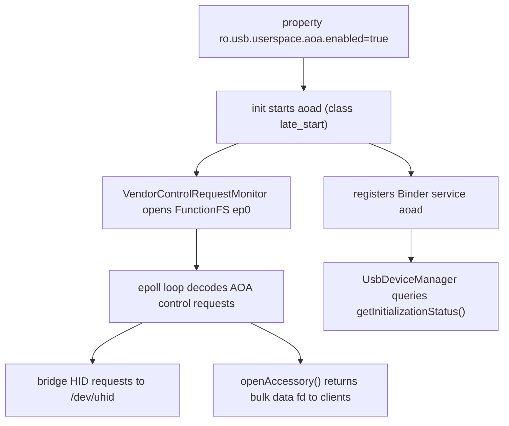

`system/usb/aoa/daemon/aoad.rc` declares `service aoad /system/bin/aoad`, `disabled`, started only `on property:ro.usb.userspace.aoa.enabled=true`, running as `user system` with groups `system usb uhid` under `seclabel u:r:aoad:s0`. A `cc_fuzz` target (`aoad_fuzzer`) fuzzes the privileged surface.

### Architecture changes

**OTA snapshots move to a UBLK backend (`system/core` + `system/update_engine`).** Virtual A/B snapshot merges, previously served by `snapuserd` through the kernel `dm-user` device, can now run over **UBLK** (userspace block driver). First-stage init selects the mode at boot: `system/core/init/first_stage_mount_android.cpp` calls `sm->UpdateUsesUblk()`, then `LaunchFirstStageSnapuserd(use_ublk)` and initializes `/dev/block/ublkb*` / `/dev/ublk*` misc devices. A new manifest field `disable_ublk` (`system/update_engine/update_metadata.proto:385-387`) lets OEMs force dm-user even on UBLK-configured devices. The legacy `system snapuserd` codepath and `ro.virtual_ab.userspace.snapshots.enabled`-style props are removed on both sides.

**update_engine COW/compression updates.** Android 17 adds **zstd compression for REPLACE ops** (plus a `zstd_extent_writer` unittest) and a flag to disable REPLACE compression. It also **removes squashfs support** and retrofit-dynamic-partition logic, drops `SnapshotMergeStats`, and stops saving manifest bytes / frees manifest partition memory after use to cut peak RAM. Large patches are now written to a file and applied via fd rather than held in memory.

**First-stage init: Microdroid vs Android separation.** The first-stage mount logic was refactored so Android-specific mounting no longer compiles into Microdroid (and vice versa): `system/core/init/first_stage_mount_android.cpp/.h` and `first_stage_mount_microdroid.cpp` now sit beside the shared `first_stage_mount.cpp`, the `FirstStageMount` virtual base class was removed, and second-stage init no longer pulls in first-stage mount/main.

**Other init/boot changes.** A reworked **boot monitor** lands, though enabling it by default was reverted again this cycle. Boot analysis gains `ro.boottime.event.*` properties and richer bootchart capture (early bootcharting via kernel command line, full-command-line capture, CPU model detection from `/proc/cpuinfo`). Init now passes the shutdown reason to the kernel on reboot, adds reboot reasons for long power-key presses, mounts `securityfs`, and removes the interactive FDR prompt when the TPM has been cleared. `ueventd` gains wildcard matching in sysfs attribute specs and can pull firmware from bootstrap APEXes before the full APEX set is ready.

### Notable integrations

- **GKI kernel: first `android17-6.18` configs.** `kernel/configs` adds the `android17-6.18` branch targeting the Linux 6.18 GKI kernel, while pruning Android R configs and refreshing OGKI approved-build lists and `kernel-lifetimes.xml`.
- **Shared OTA headers across init/fastboot/recovery.** `libupdate_engine_headers` is exported so `init`, `fastboot`, and recovery's `libinstall` can find `file_descriptor.h` (`system/core` and `bootable/recovery`), tightening the coupling between the OTA engine and the boot/recovery tooling that feeds it.
- **Recovery (`bootable/recovery`).** Picks up F2FS `packed_ssa` support, a `binder=c` bit in `MISC_KCMDLINE`, and a configurable `recovery_ui` graphics timeout.

## D.3 Native Foundation

The native layer of Android 17 is dominated by two stories: a much larger AIDL HAL surface (820 commits in `hardware/interfaces`, a new framework compatibility matrix, several new device contracts), and a structural maturation of berberis, the dynamic binary translator (439 commits), which grows beyond riscv64-on-x86_64 into a multi-guest engine with arm64 scaffolded in. bionic and libcore round it out with page-size/memory-tagging hardening and an OpenJDK uprev aimed at jdk-25.

### New projects

No entirely new repositories enter this Part. The notable additions are new *HAL packages* inside `hardware/interfaces` and new *subdirectories* inside berberis (covered under New modules and Architecture changes).

### New modules

New AIDL HAL contracts shipped in `hardware/interfaces` and declared in the Android 17 framework compatibility matrix `compatibility_matrices/compatibility_matrix.202704.xml` (FCM `level="202704"`):

- **Motion Context HAL** — `hardware/interfaces/motioncontext/aidl/android/hardware/motioncontext/` defines `IMotionContext`, `IMotionContextClient`, `IMotionContextCallback`, plus `MotionState`, `MotionEvent`, `MotionSubscription`, `EventDeliveryReason`: a subscription-based stream of device motion state to framework clients.
- **NPU HAL** — `hardware/interfaces/npu/aidl/android/hardware/npu/` adds `IScheduling` and `ISchedulingCallback` with `SchedulingConfig`, `WorkInfo`, `StartReason`, `EndReason`, `Uuid`. Per `npu/README.md`, the first revision lets Android inform a neural-processing unit of application priorities (0-1000, 0 = most important) and receive callbacks when NPU work starts/ends.
- **`libwrapfd` (`system/memory/libwrapfd`)** -- a new Rust/LLNDK library (`rust/lib.rs`, `cc_library_shared libwrapfd`) over a new `/dev/wrapfd` kernel driver. It wraps an existing fd and controls how it may be `mmap`ed: `wrapfd_driver_wrap()` pins a `PROT_READ`/`PROT_WRITE`/`PROT_NONE` mask, with ioctls to query state and acquire/release ownership. It is `apex_available` to `com.android.npumanager`, backing NPU-buffer protection.
- **Secure Execution Environment (SEE) family** — a large new `hardware/interfaces/security/see/` tree, all declared in the 202704 matrix:
  - `security/see/hwcrypto/aidl/.../hwcrypto/` — `IHwCryptoOperations`, `IOpaqueKey`, `ICryptoOperationContext` (+`CryptoOperation`, `CryptoOperationSet`, `KeyPolicy`, `MemoryBufferParameter`): a TEE-side crypto operation surface using opaque key handles.
  - `security/see/storage/aidl/.../storage/` — `ISecureStorage`, `IStorageSession`, `IDir`, `IFile` (+`CreationMode`, `Integrity`, `Availability`, `Filesystem`, `OpenOptions`): a tamper-evident/rollback-protected secure filesystem contract.
  - `security/see/devicestate/.../IDeviceState`, `security/see/authmgr/`, and `security/see/ext/.../ITrustedHalExt.aidl` — an extension point letting a trusted HAL be reached from the SEE.
- **Existing HAL version bumps**: health AIDL V5 (battery manufacturer/model/voltage-min-design), Weaver V3, Bluetooth Audio V6 (LE Audio peripheral/broadcast-sink, LE Audio over HDT phy, ISO parameter update), Channel Sounding additions (`UpdateChannelSoundingConfig`, `GetVelocity`), wifi Proximity Ranging, USB `PortPartnerStatus`/`Bc12Type`, and a new "timestamp HAL".

berberis adds a `cpu_emulation/` umbrella module (below) and splits the riscv64 translator into its own libraries (`translator_riscv64`, `runtime_library`).

### Architecture changes

**berberis: from a riscv64 translator to a multi-guest, multi-tier engine.** Android 16's tree was effectively riscv64-on-x86_64 only. In 17 the engine is reorganized under `frameworks/libs/binary_translation/cpu_emulation/`, gathering three execution tiers plus shared infrastructure:

- `cpu_emulation/interpreter/` — first-tier interpreter (riscv64).
- `cpu_emulation/lite_translator/` — fast, low-optimization JIT (`lite_translator/riscv64_to_x86_64`).
- `cpu_emulation/heavy_optimizer/` — optimizing JIT (`heavy_optimizer/riscv64`), the focus of the 17 cycle: global guest context optimization is implemented and enabled by default, plus `LoopGuestContextOptimizer` for irreducible loops and register-lifetime work in `LocalGuestContextOptimizer`.
- shared support: `cpu_emulation/{decoder,assembler,backend/x86_64,code_gen_lib,intrinsics}/`.

The arm64 guest is now scaffolded across the tree. New arch directories appear under `runtime/arm64/` and `runtime/arm64_to_x86_64/`, `guest_loader/arm64/`, `guest_state/arm64/` (with `get_cpu_state.cc`), `guest_abi/arm64/`, `guest_os_primitives/arm64/`, `kernel_api/arm64/`, plus `cpu_emulation/insn_tests/arm64/` and intrinsic-mapping dirs (`intrinsics/riscv64_to_arm64/`, `code_gen_lib/arm64_to_x86_64/`, `arm64_to_all/`). So while `README.md` still advertises riscv64-on-x86_64, the 17 codebase generalizes the abstractions to host more than one guest ISA. Runtime hardening in the same cycle increases the translation host stack to 1 MB with guard pages and adds `clone3` syscall emulation.

#### berberis three-tier translation pipeline (riscv64 guest, x86_64 host)

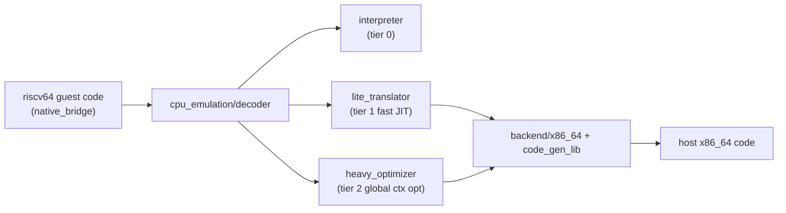

**AIDL toolchain.** `system/tools/aidl` (78 commits) gains the `@VersionSupport(version=N)` interface annotation, registered in `system/tools/aidl/aidl_language.cpp` (`AidlAnnotation::Type::VERSION_SUPPORT`) and enforced by `AidlInterface::VersionSpecificCheckValid()` plus `GetVersionSupportVersion()` in `aidl_language.h:372` — it pins a declared version to the interface's actual version. The Rust backend gains `no_std` variants, Soong rules are progressively sandboxed, and C++ tracing in generated code is now off by default.

**VINTF.** `system/libvintf` is quiet (8 commits, no contract change), but the compatibility surface advances via the new `compatibility_matrix.202704.xml` FCM plus placeholder values for the next dessert release.

### Notable integrations

- **bionic memory/page-size hardening.** The 16 KB page-size transition continues: a padded ELF test library, 16 KB backcompat-mode guard pages (added then reverted), and `RWX_MiddlePageProtection` regression coverage. The dynamic linker re-enables execute-only memory (XOM) in the linker binary, adds missing BTI instructions/ELF notes, and refines MTE handling (only calling `get_tagged_address` on readable sections). String routines move toward portable-SIMD (`strlen.cpp` from psimd, rustlib's x86_64 strlen replaced with psimd), plus optimized `wmemset`/`wmemcpy`/`memccpy`.
- **libcore OpenJDK uprev.** libcore (205 commits) imports broadly from `jdk-25.0.1-ga` and `jdk-25+26` — `java.util.concurrent` (+`.locks`, `.atomic`), `java.time.chrono`, `Character`, `ClassValue`, `Collections`, `Invokers`/`NamedParameterSpec` — alongside OpenJDK 21's 3 new `String` API methods. An `OpenJDK 25` entry is added to the `libcore-openjdk-analyzer` tool, signalling the class libraries tracking toward JDK 25.

## D.4 Native Services & Media

Android 17's native-services and media layer advances on several fronts. SurfaceFlinger gains scaffolding for **out-of-process rendering (OOPR)** -- a shared-memory render-command channel that lets a client record draw commands instead of pushing finished buffers -- plus a reworked multi-display modeset path. libbinder grows a generic-netlink diagnostics channel. On the media side, codec2 splits a stable NDK codec surface (`libapexcodecs`) out for the media APEX, the camera service adds a multi-client *shared session* mode, and the Photo Picker grows search and a category grid.

### New modules

- **`libapexcodecs` -- stable C2 codec NDK for the media APEX.** `frameworks/av/media/module/libapexcodecs/include/apex/ApexCodecs.h` defines a C ABI (`ApexCodec_ComponentStore`, `ApexCodec_Component`, `ApexCodec_Buffer`, with `ApexCodec_Component_create/start/flush/reset/process`, all `__INTRODUCED_IN(36)`) so the updatable media (swcodec) APEX can expose Codec2 software components across the APEX boundary. The 17 cycle wires real decoders onto it (`C2ApexAacDec`, `C2ApexOpusDec`) and `Codec2Client` learns to enumerate and rank ApexCodecs-based components.
- **libgui lockless IPC primitives for OOPR.** A cluster of new headers under `frameworks/native/libs/gui/include/gui/` -- `RenderCommandBuffer{,Producer,Consumer}.h`, plus the lock-free building blocks `MagicRingBuffer.h`, `LocklessStaticQueue.h`, `LocklessTripleBuffer.h`, `LocklessQueue.h`, and `RPointer.h` (relative pointers for shared memory) -- back the render-command channel below.

### Architecture changes

**SurfaceFlinger out-of-process rendering (OOPR).** The largest SF theme of the cycle. Instead of rendering into a `GraphicBuffer` and queueing it, a client records Skia draw operations into an ashmem-backed `RenderCommandBuffer` that SurfaceFlinger replays at composition time. `RenderCommandBufferProducer` (`frameworks/native/libs/gui/include/gui/RenderCommandBufferProducer.h`) owns the ashmem `IpcRenderRegion`, exposes `startRecording()`/`finishRecordingAndPostFrame()`, and attaches to a layer via a new `SurfaceComposerClient::Transaction` setter; bulk uploads move through the lock-free `MagicRingBuffer`. SF-side support adds `RenderResourceCache` (`frameworks/native/services/surfaceflinger/RenderResourceCache.{h,cpp}`), composition shaders, a frameId plumbed end-to-end for sync, and OOPR-aware stats. The path sits behind an aconfig flag; in 17 it is infrastructure, not yet the default render path.

#### OOPR render-command channel versus the classic buffer-queue path

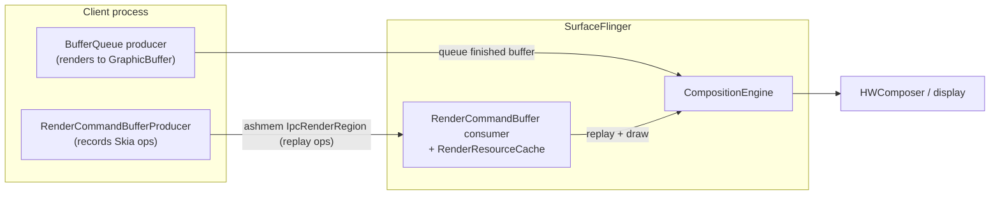

**Multi-display atomic modeset.** SF reworks how mode changes are committed across displays: a new display-command modeset implementation and state machine, a `SurfaceControl` API to drive an atomic modeset (`gui: Plumb SurfaceControl API for atomic modeset`), and flag-gated enablement. Related scheduler work moves pacesetter selection to peak FPS rather than vsync rate. HIDL power is removed from SF.

**libbinder generic-netlink reporting.** A new `frameworks/native/libs/binder/BinderNetlink.cpp` opens a generic-netlink socket to the kernel binder driver's `"binder"` family and consumes asynchronous reports: `BinderNetlink::open()/getReport()/readReport()` decode `BINDER_A_REPORT_ERROR` / `BINDER_A_REPORT_CONTEXT` attributes, giving userspace a diagnostics stream of driver-side binder errors keyed by context. The cycle also continues libbinder_rs `no_std` enablement plus RPC `IAccessor`/Parcel performance cleanups, and SensorService suspends events for frozen clients.

**Camera multi-client shared session.** The camera service adds a *shared session* mode letting multiple clients observe one camera. `frameworks/av/services/camera/libcameraservice/config/SharedSessionConfigReader.h` parses an XML descriptor of shared output streams (`SharedSessionConfig` with `surfaceType`, `streamUseCase`, `dataSpace`, color space); the `camera_multi_client` flag is retired and metrics for shared mode / current surface id are added, mirrored in metadata by a brand-new section (below).

### Notable integrations

- **New camera-metadata sections (`system/media`).** `system/media/camera/include/system/camera_metadata_tags.h` adds two sections ahead of `ANDROID_SECTION_COUNT`: `ANDROID_SHARED_SESSION` (`..._COLOR_SPACE`, `..._OUTPUT_CONFIGURATIONS`, both `fwk_only`) backing the shared-session feature, and `ANDROID_DESKTOP_EFFECTS` (`..._CAPABILITIES`, `..._BACKGROUND_BLUR_MODES`, `system`/HIDL v3.2) for camera-pipeline background blur. The cycle also adds an AGTM dynamic-range-profile entry and promotes `libcamera_metadata` to LLNDK.
- **codec2 surface migration and 10-bit color.** Codec2 migrates its `GraphicsTracker` and allocator onto `Surface`, and the codec stack gains 10-bit RGB / YUV support. The xHE-AAC encoder (`C2SoftXheAacEnc`) is fleshed out (presentation id, end-of-frame marking, live mode).
- **New Codec2 software components and AudioFlinger MMAP AIDL.** `frameworks/av/media/codec2/components/` gains APV codecs (`libcodec2_soft_apvdec`/`...apvenc`, `apv/C2SoftApvDec.cpp`) and an IAMF decoder (`libcodec2_soft_iamfdec`, `iamf/C2SoftIamfDec.cpp`). AudioFlinger also moves MMAP stream control onto stable AIDL via `IMmapStream` (`frameworks/av/media/libaudioclient/aidl/android/media/IMmapStream.aidl`, `createMmapBuffer`/`startTrack`/`stopTrack`).
- **Photo Picker: search and categories (`packages/providers/MediaProvider`).** The Kotlin Photo Picker becomes default on T+ and grows two major features under `photopicker/src/com/android/photopicker/features/`: a `search/` feature (local on-device search backed by AppSearch with a 50k-document limit and restricted-word filtering, plus a cloud-provider `SearchMediaService` SPI) and a `categorygrid/` feature (album/category browsing, including SD-card categories). The embedded picker gains a V2 API surface, `PhotoPickerSelectionParams`, and a location-metadata feature flag.
- **`packages/modules/Media` API surface.** Mostly housekeeping, but `MediaParser` is migrated onto Media3/ExoPlayer, gains track-aware seeking (per-track duration in `MediaFormat`), deprecates `SAMPLE_FLAG_DECODE_ONLY`, and the media-metrics AIDL is converted to stable AIDL.

## D.5 Runtime

Android 17 reshapes the lowest layers of the managed runtime. The headline is a ground-up rewrite of the Zygote in Rust as a new top-level project, alongside a new x86 micro-architecture target in ART and continued shrinking of the APEX-mounted runtime surface.

### New projects

**`system/zygote` (Native Zygote / `zygote_next`).** Android 17 introduces an entirely new top-level repository implementing the Zygote process server in Rust. It builds the `zygote_next` daemon (`system/zygote/zygote/src/bin/zygote.rs`) and is split into focused crates (`system/zygote/Android.bp`, `edition: "2024"`):

- `zygote-sys` wraps raw syscalls (`fork`, `clone3`, `epoll_wait`, `setresuid`/`setresgid`, `prctl`) and `/proc` introspection behind safe Rust (`system/zygote/zygote-sys/src/`).
- `zygote-messages` defines the system_server <-> Zygote IPC as a FlatBuffers schema (`system/zygote/zygote-messages/schemas/messages.fbs`) with derive-macro marshalling from `zygote-proc-macros`.
- `zygote-core` centralizes logging/tracing init and hooks into `atrace`.
- `zygote` holds the `Server` event loop and the `Species` abstraction.

The classic `frameworks/base` `ZygoteInit` Java path still exists; `zygote_next` is the native successor the platform is migrating toward. It logs a `NativeZygoteStarted` statsd atom on launch, runs at `nice -20`, and is built with ASYNC MTE (Soong `sanitize: { memtag_heap: true }` in `system/zygote/zygote/Android.bp`).

### Architecture changes

**The Species / subspecies process model.** Rather than the old fork-and-specialize flow, `zygote_next` models each preload-and-spawn environment as a *Species* (`system/zygote/zygote/src/species.rs`). The `Species` trait (lines 82-181) is a vtable of callbacks (`gather_reinitialization_data`, `speciate`, `gestate`, `set_seccomp_filters`, `sync_fd_state`, file/socket allow-list checks). Three implementations are registered statically: `AndroidNative` (`.../species/android_native.rs`), `LibApp`, and a `Mock` "Turtle" used in tests.

A key new capability is the **subspecies**: the schema defines `SpawnSubspecies` and the `SpawnSubspeciesAndroidNative` payload (`messages.fbs` lines 31-43, 87-93), and the server can spawn a *native child Zygote* on demand that re-initializes itself as a subspecies (`speciate()` runs before `re_initialize_as_subspecies()`). This generalizes the old "child zygote" idea into a first-class, per-payload spawn command carrying its own library paths, ABI list, preload function, and UID/GID range.

Native Zygote spawn dispatch through the Species abstraction

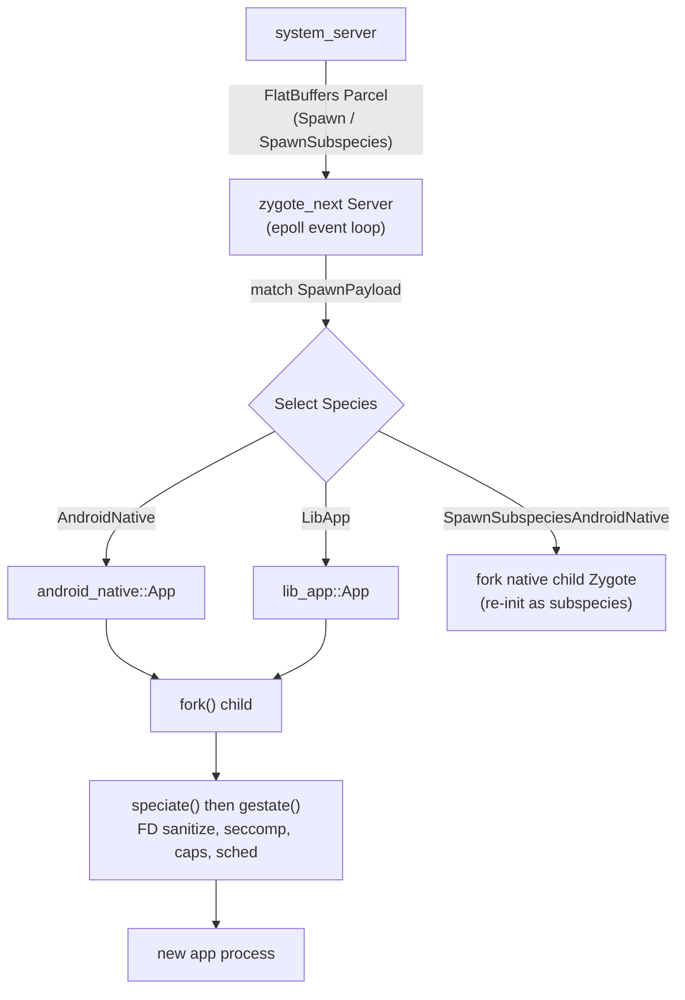

FD inheritance is now governed by explicit, dated allow-lists in each species (`android_native.rs` lines 41-77): each `AllowListEntry` records a reviewer and review date, and a unit test (`species.rs` `allow_list_audit`) fails the build when an entry goes stale (> 365 days). The transport also moved from a hand-rolled loop to `epoll`, with coalesced `SIGCHLD` handling and child exit status forwarded to ActivityManager over the unsolicited Zygote socket.

**ART: pantherlake x86 target.** ART adds Intel **Panther Lake** -- Intel's client (consumer/mobile) CPU generation, newer than the Kaby Lake / Alder Lake parts already known to ART -- as a recognized x86 / x86-64 instruction-set variant (`art/runtime/arch/x86/instruction_set_features_x86.cc` lines 43-115). Like other Intel client silicon it exposes AVX/AVX2 but not server-only AVX-512, so the variant is registered with SSSE3, SSE4.1/4.2, POPCNT, and AVX/AVX2 (feature string `ssse3,sse4.1,sse4.2,avx,avx2,popcnt`, bitmap 63) -- the same AVX2 tier as `alderlake`/`kabylake`, verified by the `X86FeaturesFromPantherlakeVariant` unit test for both 32- and 64-bit. Naming this variant lets `dex2oat` emit 256-bit AVX2-vectorized code for these CPUs on x86-64 Android targets such as the emulator and x86 form factors.

**DEX container format V41.** The runtime treats DEX **version 41** as the container format (`art/libdexfile/dex/dex_file.h` line 112, `kDexContainerVersion = 41`; `HeaderV41` at line 181). V41 files carry a container offset/size so multiple logical DEX files share one backing buffer; profile machinery was updated for the V41-only location syntax. `HasDexContainer()` / `ContainerSize()` (lines 165-174) gate the new behavior.

**Value and record classes.** `mirror::Class` gains first-class `IsValueClass()`/`SetValueClass()` and `IsRecordClass()`/`SetRecordClass()` accessors (`art/runtime/mirror/class.h` lines 341-357), backed by new `mirror::Class` flags (`kClassFlagValue`/`kClassFlagRecord`). This is groundwork for Valhalla-style value classes; records are now treated as normal classes carrying the record flag.

**GC tuning.** The collector re-enables eager `MADV_FREE`-based page release under the concurrent-copying GC (reverting an earlier temporary disable; `art/runtime/gc/collector/garbage_collector.cc` ~line 465), and GC knobs are now reported through the `ArtDeviceStatus` pulled atom for fleet telemetry.

### Notable integrations

**APEX: shrinking the runtime mount surface.** `apexd` continues to remove runtime components from the bootstrap APEX set. The `com.android.runtime` APEX is now gated behind `RELEASE_DEPRECATE_RUNTIME_APEX` in the bootstrap list (`system/apex/apexd/apexd.cpp` lines 169-180): when set, the runtime APEX disappears and its contents move into the base system image.

**EROFS file-backed mounts (no loop device).** A major mounting change lets `apexd` mount EROFS-format APEX payloads directly from the file, skipping the loop device entirely (`system/apex/apexd/apexd.cpp` lines 522-534): when file-backed mount is enabled, the payload is mounted with a `fsoffset=` option pointing at the in-APEX image. This is controlled by the `erofs_file_backed_mount` aconfig flag and runtime properties (`apexd_mount.cpp` lines 38-120). A companion `microdroid_no_loop_device` flag lets Microdroid activate block APEXes via `dm-linear` instead of loop devices. Together these cut the per-APEX loop-device cost as the mainline module set keeps growing. `apexd` also enables Direct I/O on loop devices and dm-verity verification in a tasklet for APEX payloads.

## D.6 Framework Core

The Framework Core delta is dominated by `frameworks/base` (15,196 commits). This section covers the genuinely platform-level changes: the new SDK level, new system services with public/system API surfaces, a new mainline SDK-extension version, and the maturation of desktop windowing in WindowManager Shell.

### New API level

Android 17 is API level 37, codename **CINNAMON_BUN**. The constant lives in `frameworks/base/core/java/android/os/Build.java`:

- `VERSION_CODES.CINNAMON_BUN = 37` (Build.java:1318), following `BAKLAVA = 36`.
- `VERSION_CODES_FULL.CINNAMON_BUN = 3700000` (Build.java:1545) — the full-version encoding (`SDK_INT_MULTIPLIER = 100000`) introduced to carry minor versions alongside the major `SDK_INT`. Both `SDK_INT_FULL` and `VERSION_CODES_FULL.CINNAMON_BUN` are public API (`core/api/current.txt:34998`, `:35049`).

The 17 public API surface is `core/api/current.txt` (~65k lines); new feature areas surface there and in `core/api/system-current.txt`.

### New modules

**AdvancedProtectionService** — a new device-hardening framework (Advanced Protection Mode). A single user-facing toggle drives a set of independent security "features" that each tighten one subsystem.

- System service: `frameworks/base/services/core/java/com/android/server/security/advancedprotection/AdvancedProtectionService.java`, registered in `services/java/com/android/server/SystemServer.java:1868`.
- Public/system API: `frameworks/base/core/java/android/security/advancedprotection/AdvancedProtectionManager.java`, reachable via `Context.ADVANCED_PROTECTION_SERVICE = "advanced_protection"` (`Context.java:6873`); `isAdvancedProtectionEnabled()` plus register/unregister callbacks are public (`core/api/current.txt:42225`).
- Feature hooks under `.../advancedprotection/features/`: `DisallowCellular2GAdvancedProtectionHook`, `DisallowInstallUnknownSourcesAdvancedProtectionHook`, `UsbDataAdvancedProtectionHook`, `MemoryTaggingExtensionHook` (MTE). The `@SystemApi` feature IDs in `AdvancedProtectionManager` (DISALLOW_CELLULAR_2G=0 … DISALLOW_USB=2, DISALLOW_WEP=3, ENABLE_MTE=4, plus insecure-Wi-Fi-autojoin and a11y-restriction) map one-to-one to those hooks.

**SupervisionService** — a first-class supervision (parental-controls) framework, splitting supervision out from DevicePolicy.

- System service: `frameworks/base/services/supervision/java/com/android/server/supervision/SupervisionService.java` (with `SupervisionSettings`, `SupervisionUserData`, `SupervisionPolicyMigrator`, `SupervisionRecoveryInfoStorage`), registered at `SystemServer.java:1705`.
- API/AIDL surface: `frameworks/base/core/java/android/app/supervision/` — `SupervisionManager.java`, `ISupervisionManager.aidl`, `Policy.java`/`PolicyKey.java`, `PackageUsagePolicy.java`, `SupervisionRecoveryInfo`. SystemUI and SettingsLib gained `supervision/` packages consuming it.

**AiSeal** — a new system service mediating access to an AiSeal virtual machine for on-device AI host services (landed very late, Nov 2025).

- Service: `AiSealSystemService`, registered at `SystemServer.java:3024`.
- API (`@SystemApi`, flag-gated `android.aiseal.aiseal_host_apis`): `frameworks/base/core/java/android/aiseal/AiSealManager.java` with `connectService(String)`, plus `Context.AISEAL_HOST_SERVICE = "aiseal_host"` and `PackageManager.FEATURE_AISEAL` (`core/api/system-current.txt:674`, `:4513`, `:5065`).

**NpuManager** (`npu`) — a flag-gated (`com.android.npumanager.npumanager_enabled`) NPU model-management surface. Only mock dirs exist under `core/java/android/npumanager/mock` and `core/java/android/ranging/mock`; the API hooks (`Context.NPU_SERVICE = "npu"`, `PackageManager.FEATURE_NEURAL_PROCESSING_UNIT`, system permissions) are declared in `core/api/*.txt` behind the flag, so treat this as a reserved/preview surface in `frameworks/base` rather than a shipped service (the real module lives under `packages/modules/NpuManager`, see D.12).

### Architecture changes

**Desktop windowing maturation (WindowManager Shell).** The largest WM-Shell expansion is the `desktopmode` package: `frameworks/base/libs/WindowManager/Shell/src/com/android/wm/shell/desktopmode/` is now one of WM-Shell's largest packages. `DesktopTasksController.kt` is the core orchestrator; supporting pieces include `DesktopImmersiveController`, `DesktopUserRepositories`, `DesktopMixedTransitionHandler`, `DragToDesktopTransitionHandler`, `DesktopModeMoveToDisplayTransitionHandler`/`CrossDisplay` handling, `DesktopWallpaperActivity`, and a sibling `desktopai/` package. Multi-display desktop (move-to-display, cross-display transitions), home-screen peek hot corners, and per-user desktop repositories are the notable additions over 16.

Desktop windowing transition flow (Shell):

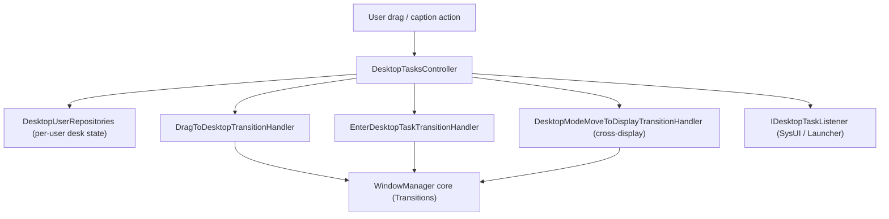

**SystemUI scene container (flexiglass).** SystemUI continues the shade/keyguard rewrite around the scene framework under `frameworks/base/packages/SystemUI/src/com/android/systemui/scene/` (`data`, `domain`, `ui/{view,viewmodel,compose}`, `shared`). Numerous `[flexiglass]` and `[Desktop]` shade/status-bar commits feed this; the Compose-backed `SceneWindowRootView` path is the direction of travel for the shade and lockscreen.

### Notable integrations

**SDK Extensions version 22 + new "C" extension.** `packages/modules/SdkExtensions` bumped the extension database to **version 22** (`gen_sdk/extensions_db.textpb` tail — ART/CONSCRYPT/MEDIA/MEDIAPROVIDER/PERMISSIONS/STATSD/TETHERING/APPSEARCH/etc. all at 22). The releases mechanism gained a new per-dessert extension axis for Android 17, "**c**":

- `derive_sdk/derive_sdk.cpp:85` iterates desserts `{"r","s","t","ad_services","u","v","b","c"}`; `:244` adds `relevant_modules.insert(kCModules…)` and sets the `c` extension when `IsAtLeastC()`.
- `sdk-extensions-info.xml` gained the C extension entries; Conscrypt was added to SDK extensions (incl. `EchConfigList`/`InvalidEchDataException` ECH APIs), and `android.net.dns`/`DnsResolver` were exposed S+. AD_SERVICES/EXT_SERVICES are frozen at 20 per `gen_sdk/gen_sdk.py:134`.

This is the mainline-API mechanism that lets modules ship API additions to older OS versions independently of the OS dessert; v22 is the Android 17 baseline, and the new `c` axis lets future module updates target "Android 17+".

## D.7 Framework Services

Android 17 reorganizes several framework-service-adjacent subsystems. The headline is a brand-new native memory daemon (`mmd`) taking over ZRAM management from system_server and adding per-process writeback/prefetch. The Permission/Privacy module grows an agent-activity surface and Private Compute Core (PCC) awareness, while UprobeStats and Profiling ship as prebuilt module SDKs.

### New projects

**`system/memory/mmd` (Modern Memory Daemon).** Android 17 introduces `mmd`, a new native Rust daemon centralizing memory-management configuration and ZRAM tunables (`system/memory/mmd/README.md`), unifying what was fragmented across `swapon_all`, `config.xml` overlays and `ro.zram.*` properties and pulling swap management out of system_server. It registers a Binder service named `mmd` (`system/memory/mmd/src/main.rs:203-205`) exposing the `IMmd` AIDL interface (`system/memory/mmd/aidl/android/os/IMmd.aidl`). A dedicated `mmd_setup` service (`system/memory/mmd/src/mmd_setup.rs`), started by init, performs first-boot ZRAM activation. When `mmd.zram.enabled` is set, ZRAM setup inside `swapon_all` becomes a no-op and the legacy overlay config is ignored.

### New modules

**UprobeStats prebuilt module SDK.** The uprobe-based tracing module (attaching BPF uprobes to instrument method calls and emitting results as statsd atoms) now ships a prebuilt module SDK: `sdk { name: "uprobestats-module-sdk" }` (`packages/modules/UprobeStats/apex/Android.bp:87-88`). In A17 its Rust `core` crate gained a typed `UprobeStatsError` and a `Handler` trait carrying `MAP_PATH`/`PROG_PATH` constants, granular BPF-attachment error reporting, and batched event delivery in `UprobeStatsBridgeServiceImpl`. New BPF handlers cover accessibility and "disruptive app" detection, plus generic instrumentation resolving primitive call arguments from registers.

**Profiling prebuilt module SDK + anomaly detector.** The on-device Profiling module likewise ships `sdk { name: "profiling-module-sdk" }` (`packages/modules/Profiling/apex/Android.bp:103-104`). A17 adds an `AnomalyDetectorService` (`.../anomaly-detector/service/java/com/android/os/profiling/anomaly/AnomalyDetectorService.java`), gated by an `anomaly_detector_core_c` flag, that evaluates rule-based signals (such as a `BinderSpamAnomalyDetector`) and triggers Perfetto traces. A dedicated `MemoryAnomalyRateLimiter` throttles memory-limit anomaly profiling before requests reach `ProfilingService`.

**Web App (PWA) service.** New `com.android.webapp` APEX installs/manages Progressive Web Apps, publishing `WebAppManager` under `Context.WEB_APP_SERVICE` (`"web_app"`) via an AIDL system service, gated by `enable_web_app_service_v2` (namespace `lse_desktop_experience`) (`packages/modules/WebApp/framework/java/android/content/pm/webapp/WebAppManager.java`).

**Wired Serial API + native daemon.** A wired serial-port API (`Context.SERIAL_SERVICE`, `"serial"`), distinct from USB serial: `SerialManager`/`SerialPort` in `frameworks/base/core/java/android/hardware/serial/`, backed by `SerialManagerService` in `SystemServer.java`. A Rust daemon registers the lazy binder `native_serial` behind the `enable_wired_serial_api` flag (`frameworks/native/services/serialservice/rust/service.rs:53`).

**Process Memory Guardian Daemon (pmgd).** Native Rust per-process daemon watching each target process's cgroup-v2 `memory.high` pressure and `anon_limit_in_mb`, killing offenders after a reclaim grace period and emitting kill telemetry as statsd atoms (`system/memory/guardian/README.md`). Complements `mmd` with granular per-process enforcement.

**New system_server services.** Three managers join `SystemServer.java`, each with a `Context.*_SERVICE` constant: `MultisensoryService` (audio-haptic, `MULTISENSORY_MANAGER_SERVICE`), `ContentRestrictionService` (`CONTENT_RESTRICTION_SERVICE`), and `PccSandboxManagerService` (Private Compute Core, `PCC_SANDBOX_SERVICE`) (`frameworks/base/core/java/android/content/Context.java`).

### Architecture changes

**mmd ZRAM lifecycle and per-process writeback/prefetch.** After boot, `mmd_setup` activates ZRAM and calls `swapon` with an optional swap priority; A17 added explicit swap-priority and multi-device support (`mmd.zram.num_devices`, per-device properties), packing priority into the swap flags via `SWAP_FLAG_PREFER` (`system/memory/mmd/src/zram/setup.rs:40-73`). ZRAM maintenance (idle writeback, recompression) is no longer driven by system_server's own logic; system_server sends `doZramMaintenanceAsync()` hints over Binder and `mmd` applies its own policy.

The genuinely new low-memory path is **per-process** ZRAM operations. `IMmd` gained `supportsProcessMemoryZramOps()`, `asyncWritebackProcessZramMemory(pidfd, callback)` and `asyncPrefetchProcessZramMemory(pidfd)` (`system/memory/mmd/aidl/android/os/IMmd.aidl:51-80`). Writeback targets a single process by `pidfd`, pushes its ZRAM-resident pages to the backing device, and reports a `WritebackStatus` plus bytes written through `IMmdProcessWritebackCallback`. Prefetch is the inverse: it pulls a process's written-back pages back into the compressed pool before a cached app is resumed. These ride new zram kernel ioctls (`ZRAM_ANDROID_IOC_PROCESS_WRITEBACK_CMD`, `..._PREFETCH_CMD`) wrapped in `system/memory/mmd/src/zram/per_process_ioctls.rs`.

Internally `MmdService` runs a two-level work queue (`system/memory/mmd/src/service.rs:68-146`): prefetch goes on a high-priority `prefetch_work` deque, writeback and periodic maintenance on low-priority `other_work`. A prefetch request for a pid cancels any still-pending writeback for that process (matched via `pidfds_likely_equals`), so a resume cannot race a writeback about to evict the very pages being prefetched.

mmd per-process ZRAM writeback and prefetch flow

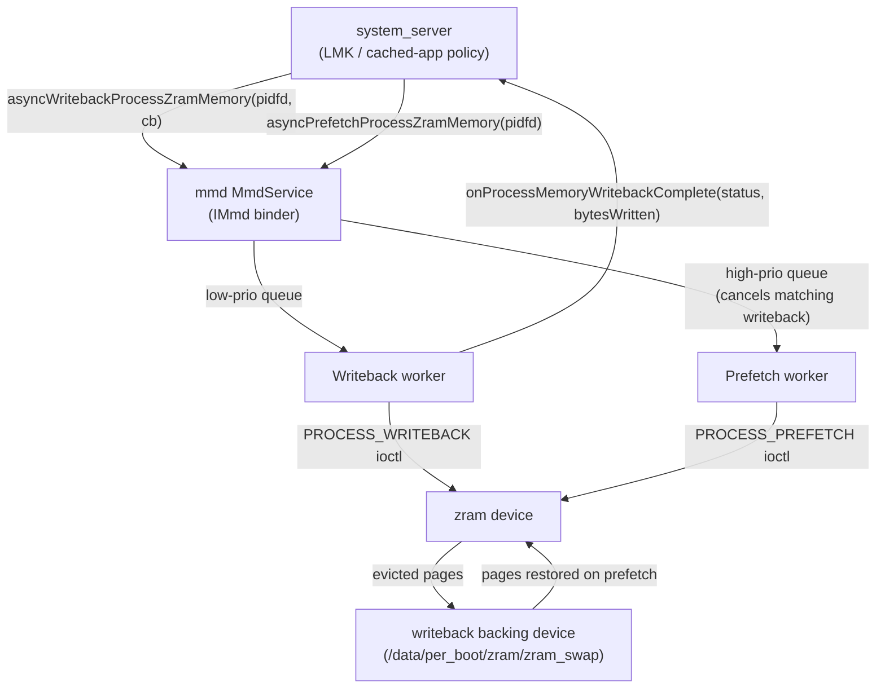

**Permission / Privacy: agent activity and PCC awareness.** The Permission module (PermissionController, role-controller, Safety Center, 533 commits) has two architectural threads. First, a new *agent activity / agent timeline* privacy surface tracks which AI agents accessed user data, with 24-hour and 7-day windows, under new `appinteraction` and `appfunctions` source trees (e.g. `.../permissioncontroller/appinteraction/domain/model/v31/AgentActivityItem.kt`, `.../appfunctions/ui/handheld/v37/AgentUsageDetailsFragment.kt`) behind an agent-activity flag. Second, Private Compute Core awareness threads through permission/Safety Center UID checks: Safety Center resolves a PCC sandbox UID back to its owning app UID before comparison (`packages/modules/Permission/.../safetycenter/SafetyCenterService.java`), and the `PERSONAL_CONTEXT_*` signature permissions are now marked `allowedInPrivateComputeCore`.

**Private space role policy.** Role qualification gained per-package and cross-user hooks. `RoleBehavior` adds `isPackageAllowedToBypassQualificationAsUser(...)`, and `Role` now treats `EXCLUSIVITY_PROFILE_GROUP` roles as unavailable to private-space profiles unless the device is organization-owned (`.../role-controller/java/com/android/role/controller/model/{RoleBehavior,Role}.java`).

### Notable integrations

**statsd metrics pipeline and io_uring.** The StatsD module (130 commits) added an `io_uring`-based socket listener for atom ingestion, guarded behind a new minimum API level 37: `IO_URING_API_VERSION 37`, activated only when both `flags::use_iouring_socket_listener()` and runtime support are present (`packages/modules/StatsD/statsd/src/main.cpp:52-119`). statsd also handles `SIGTERM` cleanly via its `stop()` path and refines UID mapping for sandbox/SDK-sandbox UIDs.

**mmd as a statsd producer.** `mmd` reports its own ZRAM telemetry as statsd atoms via `statslog_rust`: `ZramSetupExecuted` from the setup service, plus `ZramMaintenanceExecuted`/`ZramMmStatMmd`/`ZramIoStatMmd`/`ZramBdStatMmd` from maintenance (`system/memory/mmd/src/atom.rs:29-39`). UprobeStats and the Profiling anomaly detector are likewise statsd producers, so A17's memory, tracing, profiling and metrics subsystems are increasingly stitched together through the statsd pipeline.

## D.8 Connectivity

Android 17's connectivity surface is dominated by one cross-cutting theme: **generic ranging**. A new system service unifies UWB, Bluetooth Channel Sounding, Wi-Fi RTT and BLE RSSI behind a single `RangingManager` API, and the controller-level stacks in Bluetooth, Wi-Fi and UWB all grew the primitives that feed it. Alongside ranging, Wi-Fi gained a new Unsynchronized Service Discovery (USD) service, NFC added a gesture-exchange API for tap-to-X, and telephony continued building out satellite / NTN support.

### New projects

**`hardware/nxp/uwb` -- NXP UWB vendor HAL.** A new repository providing a concrete vendor implementation of the `android.hardware.uwb` AIDL HAL for NXP's SR1XX UWB chipset family. Previously the tree shipped only the HAL interface and a stub; this repo carries a shippable implementation OEMs using NXP silicon can build directly.

The AIDL service implements `IUwb`/`IUwbChip` (`hardware/nxp/uwb/aidl/uwb.h:33`, `uwb_chip.h:35`) and registers as `android.hardware.uwb-service.nxp` (init service `vendor.uwb_hal`, declaring `IUwb` v1). The thin AIDL layer bridges into the legacy NXP HAL core -- `open()`/`coreInit()`/`sendUciMessage()` forward to `phNxpUciHal_open`/`_coreInitialization`/`_write` (`hardware/nxp/uwb/aidl/uwb_chip.cpp:69,90,101`) -- with the bulk of the logic (HBCI firmware download, TML transport, calibration, session/time-sync) under `halimpl/` and board profiles like `example_config/SR1XX`. This is what makes UWB hardware ranging work on NXP-based devices feeding the ranging stack below.

### New modules

**Generic Ranging stack (`packages/modules/Uwb/ranging`).** A new multi-technology ranging subsystem ships inside the UWB module, exposing the public `android.ranging` framework (50 classes under `packages/modules/Uwb/ranging/framework/java/android/ranging`), fronted by `RangingManager` registered as the `Context.RANGING_SERVICE` system service (`RangingManager.java:55`). The backing `RangingService extends SystemService` and `publishBinderService(Context.RANGING_SERVICE, ...)` (`service/.../RangingService.java:25,38`); SystemServer loads it from the UWB apex JAR via `startServiceFromJar(RANGING_SERVICE_CLASS, RANGING_APEX_SERVICE_JAR_PATH)` (`frameworks/base/services/java/com/android/server/SystemServer.java:3310-3312`).

The service abstracts six underlying technologies behind a common `RangingAdapter` (`service/.../RangingTechnology.java:39-46`): `UWB`, `CS` (Bluetooth Channel Sounding, formerly HADM), `RTT` and `RTT_STATION` (Wi-Fi 802.11mc), `RSSI` (BLE) and `WIFI_PD` (Wi-Fi Proximity Detection). Per-technology API params live in subpackages (`ble/cs/BleCsRangingParams`, `wifi/rtt/RttRangingParams`, `wifi/pd/WifiPdRangingParams`, `uwb/UwbRangingParams`). Apps express a `RangingPreference`/`SessionConfig` and the service picks, fuses and switches technologies at runtime through a `fusion` engine (`FilteringFusionEngine`, `DataFusers`) and session `engine` classes including make-before-break / break-before-make handoff. Out-of-band negotiation (`oob/`) lets two devices agree on a technology over BLE.

**Wi-Fi USD service (`packages/modules/Wifi/.../usd`).** Unsynchronized Service Discovery gets a dedicated `@SystemApi UsdManager` (`framework/java/android/net/wifi/usd/UsdManager.java:65-67`, gated on `Flags.FLAG_USD`) registered as `Context.WIFI_USD_SERVICE` (`WifiFrameworkInitializer.java:124-132`), with `PublishSession`/`SubscribeSession` and a new `IUsdManager` AIDL. USD also threads into Wi-Fi Aware and Wi-Fi P2P (`WifiP2pUsdBasedServiceDiscoveryConfig`, plus `WifiP2pUsdBasedServiceResponse` in the `nsd/` subpackage).

**USB device authorization (`frameworks/native/services/usbauthservice`).** A new Rust daemon implementing the `IUsbAuthManager` binder service (`service.rs:15`) behind the framework-internal `android.hardware.usb.auth` AIDL interface (`Android.bp:23`, depends on `android.hardware.usb.auth-rust`; defined in `frameworks/base/core/java/Android.bp`, not a vendor HAL). It authorizes attached USB devices against an allow / interactive-PIN policy engine (`rules.rs`, `authorization.rs`) -- desktop / large-screen security hardening.

**AOSP IMS stack (`packages/modules/ImsStack`).** A full in-tree IMS stack shipped as the `com.android.imsstack` privileged app (`java/.../ImsStackApp.java`, `java/Android.bp:111`): a Java service over JNI driving a native `libimsstack` C++ SIP engine (`native/libimsstack/Android.bp`, `cc_library_shared "libimsstack"`).

**LE Audio Peripheral (server) role (`packages/modules/Bluetooth`).** The stack gained an in-stack LE Audio server/acceptor role -- the "BAP Peripheral" `LeAudioServer` (`system/bta/le_audio/server/server.cc:63,66`) -- backed by new Rust ISO and periodic-sync managers (`system/rust/src/le_audio/iso_manager/manager.rs`, `periodic_advertising_sync/manager.rs`), complementing the LE Audio HAL / broadcast-sink noted in D.3.

**Mainline supplicant (`packages/modules/Wifi`) -- architecture change.** wpa_supplicant is moving into the Wi-Fi mainline module via the unstable `IMainlineSupplicant` AIDL (`aidl/mainline_supplicant/.../IMainlineSupplicant.aidl:26`), reached through `MainlineSupplicantAidlManager` binding the `wifi_mainline_supplicant` service (`service/.../MainlineSupplicantAidlManager.java:44,46`).

### Architecture changes

**Bluetooth Channel Sounding feeds the ranging stack.** The Bluetooth stack gained a Channel Sounding pipeline: the GD HCI `channel_sounding/` metrics layer, a `distance_measurement_manager_impl` driving `METHOD_CS` sessions with security levels and producing distance/velocity results (`system/gd/hci/distance_measurement_manager_impl.cc:45,361`), and the RAS (Ranging Service GATT profile) types under `system/bta/ras/`. A new `enforce_security_for_ranging` flag hardens CS ranging sessions, and the results surface to apps via the `CS` adapter in the generic ranging service. Bluetooth (`packages/modules/Bluetooth`, the release's largest module delta) also continued its LE Audio buildout in parallel.

How the generic ranging service multiplexes the radios:

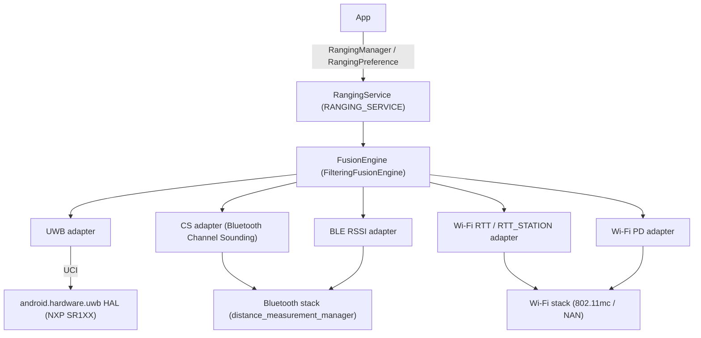

### Notable integrations

**Telephony satellite / NTN.** The satellite stack under `frameworks/opt/telephony/.../satellite` keeps expanding: carrier-roaming NTN APIs (`isInCarrierRoamingNtnMode`, `getCarrierRoamingNtnAvailableServices`), NR-NTN signal-strength keys (SSRSRP/SSRSRQ/SSSINR), satellite enable/suspend APIs, emergency-messaging routing carrier configs, and new RIL constants for the 26Q2 Satellite HAL. `NtnCapabilityResolver`, `SatellitePlmnNetworkInfo` and `SatelliteController` carry the bulk; the framework now lists satellite PLMNs and ICCID to the modem via `updateSystemSelectionChannels`. On the app side, `packages/services/Telephony` tracked these with satellite messaging/SOS UI and carrier-config plumbing.

**NFC gesture exchange / tap-to-X.** NFC added a `NfcGestureExchangeCallbackListener` and `PERFORM_GESTURE_EXCHANGE`-gated APIs (`packages/modules/Nfc/framework/java/android/nfc/`) plus home-screen tap-to-X routing, building on the existing observe-mode and wallet-role infrastructure. Observe mode's "always on" variant was removed.


**Wi-Fi Aware.** Aware reporting and pairing matured: group-key cipher-suite reporting, `AwarePairingConfig` / supplicant-driven pairing verification with NPKSA handling, USD-based discovery, and `UsdPeerId` carried in `RangingResult` -- another path connecting Aware discovery to the unified ranging results.

**Connectivity (Tethering/NetworkStack).** The 877-commit Connectivity delta is mostly incremental hardening of Tethering, NetworkStack and ConnectivityService; the notable new-capability item is the device-to-device path under `nearby/` gated by `enable_d2d_connectivity_service` (`packages/modules/Connectivity/nearby/flags/d2d_connectivity.aconfig`).

## D.9 Security

Android 17 reshapes the hardware-backed security stack around two themes: moving the secure services (KeyMint, SecureClock, SharedSecret, RKP, Gatekeeper) into protected VMs, and introducing a general in-process sandboxing primitive (LFI) so untrusted native code can run inside trusted processes. Several new repos appear: a dedicated Weaver implementation, the SEE AuthMgr, and an out-of-tree key-attestation verification library.

### New projects

**`system/lfi` — Lightweight Fault Isolation runtime support.** A new repo holding the shared glue to compile and load LFI-sandboxed libraries. Per `system/lfi/README.md` it has three pieces: `boxrt` (runtime stubs linked into the sandboxed library, e.g. `abort`/`brk`/`pause` as raw `svc` syscalls in `boxrt/boxrt_minimal.c`), `allocator` (a thread-safe spinlock minimal allocator, `allocator/alloc.c`), and `relocator` (a minimal `-static-pie` loader doing relocations for `lfi-bind`, `relocator/relocate.c` + `start.S`). LFI is the software-fault-isolation scheme from Stanford/LLVM that confines a library's memory accesses and control flow to a sandbox region via verified machine code rather than a separate address space. `system/lfi/Android.bp` defines `cc_defaults` `system_lfi_defaults` (`lfi_supported: true`, `nocrt`, `stl: "none"`, statically linking `libc_lfi`/`libm_lfi`, arm64-only, `apex_available: ["com.android.media.swcodec"]`) — the first production consumer is the swcodec APEX.

**`system/weaver` — Weaver anti-rollback secret storage TA.** A new Rust workspace (`Cargo.toml` members `ta`, `wire`) implementing the `IWeaver` HAL backed by a secure-environment trusted application. Weaver stores per-slot key/value secrets for credential throttling: each `Slot` (`ta/src/lib.rs`) holds a `slot_key`, `slot_value`, `last_checked_timestamp`, and `failure_counter`, and the TA returns `Error::IncorrectKey(ms)` / `Error::Throttle(ms)` to enforce hardware-backed retry back-off that survives reboots. The HAL service (`hal/src/lib.rs`) is a thin `IWeaver` binder shim serializing requests as CBOR over a `SerializedChannel` to the TA, reusing the shared `system/security/hals/*` channel + wire crates.

**`system/see/authmgr` — Secure Execution Environment authentication manager.** Rust crates split into a frontend (`authmgr-fe`), backend (`authmgr-be`, `authmgr-be-impl`, `authmgr-be-storage-impl`), and `authmgr-common`, plus a `secure-storage-aidl-wrapper`. AuthMgr implements `hardware/interfaces/security/see/authmgr/IAuthMgrAuthorization.aidl` (cited in `authmgr-fe/src/authorization.rs`), authenticating protected VMs (pVMs) to secure-side trusted apps using DICE certificate chains and policies: `AuthMgrFe::authenticate` presents an `ExplicitKeyDiceCertChain` + `SignedConnectionRequest`, and the backend deduplicates instances by instance-id and DICE mode and enforces rollback protection. The 42 commits add two DICE-chain modes per instance id, override points for DICE policy, and secure-storage staging/commit plus `read_file`/`write_file` APIs.

### New modules

**`external/lfi/*` — LFI toolchain (external, integration only).** Upstream components vendored to back the in-process sandbox: `lfi-verifier` (validates an ELF emits only sandbox-safe instructions), `lfi-runtime` (`liblfi`: reserves/maps the sandbox address space, transfers control in/out, emulates host calls), `lfi-bind` (Go trampoline generator), `rlbox`/`rlbox-lfi` (RLBox API with an LFI backend), and `disarm`/`fadec` (AArch64/x86 decoders for the verifier). Integrated, not modified: the build links `liblfi` and the sandboxed `libopus_lfi` into `frameworks/av/media/module/libapexcodecs`, and codec2 takes the in-process path when `android.media.codec.in_process_sw_codec_lfi` is set (`frameworks/av/media/codec2/hal/client/client.cpp:1909,2034`) — running an untrusted software decoder inside the codec process with memory safety enforced by verified code rather than a separate process.

**`external/keyattestation` — Android Key Attestation verifier (external, integration only).** A Kotlin library (`Android.bp` builds `java_library "keyattestation"`, visible to `//frameworks/base/core/java` and vendor) verifying key-attestation certificate chains produced by KeyMint/RKP. Its `Verifier` takes trust-anchor, revoked-serial, and time sources and returns a `VerificationResult` exposing the attested public key, security level, verified-boot state, and device info, with pluggable `ChallengeChecker`s. It ships its own root set (`roots.json`, `keyattestation_roots` filegroup), mirrored from `github.com/android/keyattestation`.

### Architecture changes

**KeyMint and friends move into a protected VM (keymint-in-vm).** The largest sepolicy theme this cycle (`system/sepolicy`, 452 commits) is exposing the hardware security HALs from inside a VM. New `accessor` service support is defined, and accessor permissions are added for `IRemotelyProvisionedComponent`, `ISecureClock`, `ISharedSecret`, `IProvisioning`, and (separately) `gatekeeper-in-vm` for `IGatekeeper`. `ISharedSecret/security_vm` and a KeyMint provisioning service context are added to `service_contexts`. The effect: KeyMint, RKP, SecureClock, SharedSecret, and Gatekeeper can run in a `security_vm` (Microdroid/pVM), reached by the platform through accessor services rather than a vendor HIDL/AIDL HAL on the host. This is what AuthMgr's pVM authentication underpins.

**KeyMint reference TA gains ML-DSA (post-quantum) keys.** `system/keymint` (63 commits) adds ML-DSA signature support to the Rust reference TA, including ML-DSA-87 and PKCS#8 seed import. Keystore2 follows: `system/security/keystore2/src/key_parameter.rs` and `security_level.rs` handle ML-DSA, metrics record ML-DSA variants, and `Algorithm.aidl` adds the enum. KeyMint also reworks attestation: attestation IDs are parsed out of the `KeyParam` list, `Cow` strings hold the application attestation id and encoded Root-of-Trust, and destroying attestation IDs is removed in HAL v5 / AIDL >= 500. The timestamp interface is consolidated into the KeyMint HAL (`hal_timestamp_service` removed from `hal_keymint`).

The diagram below shows how an untrusted software codec runs inside the trusted swcodec process under LFI.

#### LFI in-process software-codec sandbox flow

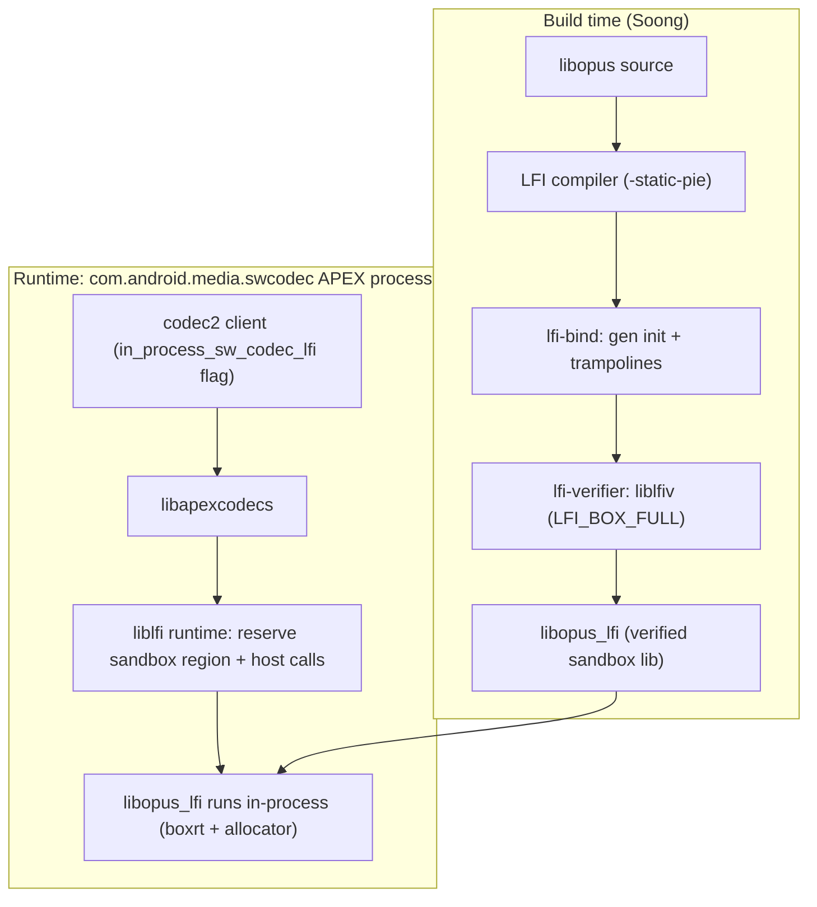

### Notable integrations

- **RKP module** (`packages/modules/RemoteKeyProvisioning`, 55 commits): hardening rather than new architecture — fallback to a default provisioning URL when the server omits/returns a bad one, reset-to-default config on repeated failures/boot, Widevine provisioning moved to the request POST body and gated on model + OEMCrypto/crypto version, device-reset reporting via `UnverifiedDeviceInfo`, and support for the updated `requestSignedCertificates` server API and Sigma.
- **Weaver warmup/timeout** flags (`android.security.enable_weaver_warmup`, `enable_weaver_get_timeout`, `frameworks/base/core/java/android/security/flags.aconfig`) are consumed by `LockSettingsService` and the keyguard/bouncer UI to pre-warm the Weaver TA before the credential prompt, reducing unlock latency for the new throttling path.
- **PCC / Private Compute Core** is granted keystore access in sepolicy ("Allow keystore operations from within PCC").

## D.10 UI Framework

Between Android 16 and the Android 17 release branch the UI-framework repos saw their largest churn in the desktop-windowing path (Launcher3, 1978 commits), in the graphics stack (ANGLE promoted toward the default GLES driver, 1335 commits), and in the shared SystemUI/theming libraries.

### New modules

`frameworks/libs/systemui` gained a standalone `dynamiccolors` Android library (`frameworks/libs/systemui/dynamiccolors/Android.bp`) carrying light and dark Material color resources (`res/values/colors.xml`, `res/values-night/colors.xml`) so the dynamic-color palette can be consumed without pulling in the whole Monet stack.

Launcher3's recents/overview is now built as a *windowed* surface rather than a full activity. The new `com.android.quickstep.window` package (`quickstep/src/com/android/quickstep/window/RecentsWindowManager.kt`, `RecentsWindowContext.kt`, `RecentsWindowRootView.kt`, `RecentsWindowSwipeHandler.java`, `RecentsWindowTracker.kt`) hosts Overview inside a `WindowlessWindowManager` / `SurfaceControlViewHost`, gated by `RecentsWindowFlags`, so Overview can coexist with freeform desktop windows on one display.

### Architecture changes

**Per-display taskbar.** Taskbar state is no longer a single global; it is keyed per display through `DisplayModel<PerDisplayTaskbarResource>` (`quickstep/src/com/android/quickstep/DisplayModel.kt`, backed by a `SparseArray` and `PerDisplayRepository`). `TaskbarManagerImpl` (`quickstep/src/com/android/launcher3/taskbar/TaskbarManagerImpl.java`) holds an `mPrimaryDisplayId` plus an `mResources` `DisplayModel`, and creates/recreates a `TaskbarActivityContext` per display (`getTaskbarForDisplay`, `recreateTaskbarForDisplay`). Each `PerDisplayTaskbarResource` owns its own window context, config-change callback, and broadcast receivers, enabling an independent taskbar on external / connected displays in desktop mode.

**Desktop windowing in Launcher.** `TaskbarDesktopModeController` (`quickstep/src/com/android/launcher3/taskbar/TaskbarDesktopModeController.kt`) listens to `DesktopVisibilityController` and exposes display-scoped queries (`isInDesktopMode(displayId)`). `TaskbarRecentAppsController.kt` switches the taskbar's app row by mode: fullscreen shows most-recent tasks, desktop mode shows currently *running* tasks as `GroupTask`s. Desktop app launches route through dedicated remote transitions in the new `com.android.launcher3.desktop` package (`DesktopAppLaunchTransitionManager.kt` and siblings), and desktop mode resolves through `DesktopStateProvider.kt`, now gated by the platform `android.window.DesktopExperienceFlags` mechanism rather than ad-hoc Launcher flags.

#### Launcher3 desktop-windowing surface ownership

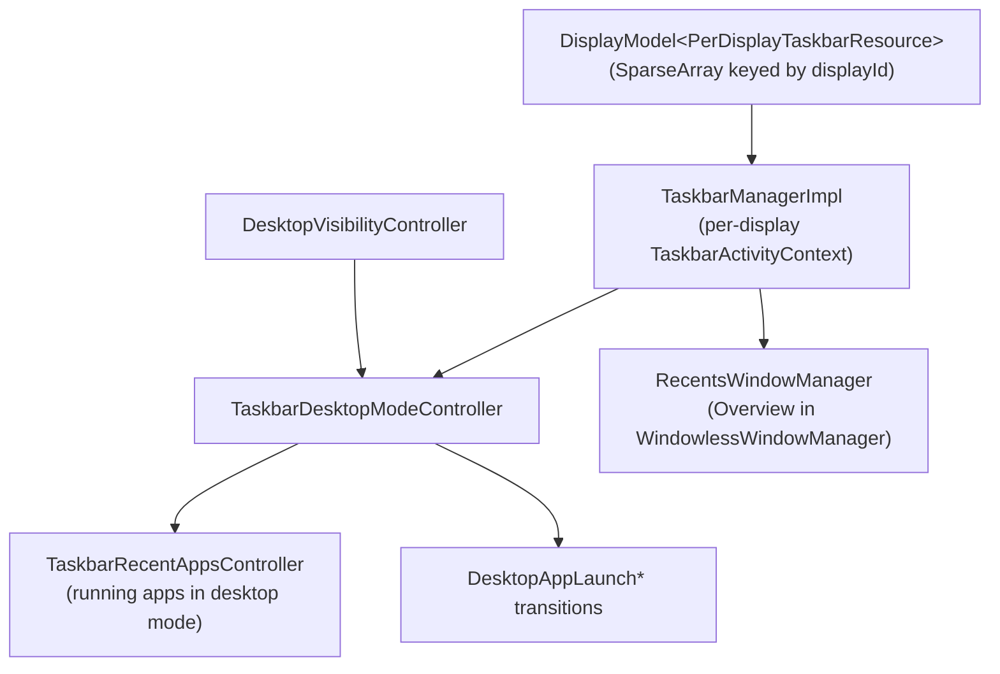

**Multi-seed Material color scheme.** `ColorScheme` (`frameworks/libs/systemui/monet/src/com/android/systemui/monet/ColorScheme.java`) now accepts a list of seed colors -- a `private final List<Integer> mSeeds` field, a `ColorScheme(List<Integer> seeds, boolean isDark, ...)` constructor and a `getSeeds()` accessor -- so a wallpaper can drive several palettes instead of one dominant seed.

### Notable integrations

**ANGLE as the default GLES driver.** Android 17 ships the ANGLE (GLES-over-Vulkan) drivers in every base system image: `base_system.mk` unconditionally adds `libEGL_angle`, `libGLESv1_CM_angle`, and `libGLESv2_angle` to `PRODUCT_PACKAGES` (`build/make/target/product/base_system.mk:493`). A product can make ANGLE the *default* GLES implementation by inheriting `angle_default.mk`, which sets `persist.graphics.egl=angle` via `PRODUCT_SYSTEM_EXT_PROPERTIES`. With that property set, the platform EGL loader resolves `libEGL`/`libGLESv2` to ANGLE instead of the vendor GL driver, so every GLES app runs through ANGLE's translator onto Vulkan -- one conformance-tested, driver-independent front end. (The 1335 ANGLE commits are an upstream refresh; only the build-time integration above is platform-visible.)

**Theme Service in the wallpaper/theming UI.** WallpaperPicker2 now routes color-overlay application through the platform Theme Service, gated by the framework flag `android.server.Flags.enableThemeService` (`packages/apps/WallpaperPicker2/src/com/android/wallpaper/config/BaseFlags.kt`, `isThemeServiceEnabled()`), alongside desktop-form-factor work in the wallpaper carousel and named custom icon themes for the home screen.

## D.11 System Apps

The front doors to Android 17's platform features land in two apps: **Settings** (2145 commits, the 2nd-largest app delta) and **DocumentsUI** (667 commits). Settings gains new feature dashboards (Supervision, desktop experience) and continues a large preference-framework migration; DocumentsUI gets a redesigned file-info experience, a search rebuild, and desktop/large-screen polish.

### New modules

**Settings: Supervision dashboard.** The most significant new Settings surface in 17 is the parental-supervision area, a new package under `src/com/android/settings/supervision/` (first commit 2025-01-21), built on the platform `android.app.supervision.SupervisionManager` and the new `ROLE_SUPERVISION` role. The landing page `SupervisionDashboardScreen.kt` exposes a primary on/off switch, a dynamically-built feature list, and a PIN-management entry point. Sub-areas:

- `webcontentfilters/` — Safe Search / Safe Sites toggles plus per-app browser/search filter screens.
- `appstorefilters/` — app-store content filtering (`SupervisionAppStoreFiltersScreen.kt`).
- `credentialmanagement/` — supervision PIN setup/change/delete and recovery (`SupervisionPinManagementScreen.kt`, `SupervisionPinRecoveryActivity.kt`).
- `ipc/` — a `SupervisionMessengerClient` plus request/response data classes letting a supervision client app inject preferences and supervised-app lists into the dashboard.

Setup/teardown uses dedicated activities (`SetupSupervisionActivity.kt`, `EnableSupervisionActivity.kt`, `DisableSupervisionActivity.kt`), gated behind `android.app.supervision.flags.Flags` (e.g. `enableSupervisionSettingsUiUpdates`).

**Settings: desktop experience developer toggles.** A new developer-options package `src/com/android/settings/development/desktopexperience/` (first commit 2025-02-13) surfaces the desktop-windowing work: `DesktopExperiencePreferenceController.java` (master `override_desktop_experience_features` toggle backed by `Settings.Global.DEVELOPMENT_OVERRIDE_DESKTOP_EXPERIENCE_FEATURES` and `android.window.DesktopModeFlags`), plus `DesktopModePreferenceController`, `DesktopModeSecondaryDisplayPreferenceController`, `FreeformWindowsPreferenceController` — the front door for Connected Displays / desktop mode.

### Architecture changes

**Settings: continued Catalyst preference-screen migration.** Screens are increasingly Kotlin classes annotated `@ProvidePreferenceScreen` implementing `settingslib.metadata` interfaces (`PreferenceScreenMixin`, `PreferenceAvailabilityProvider`, `PreferenceLifecycleProvider`) instead of XML + `PreferenceController` pairs. ~217 new `*Screen.kt` files were added since the 16 branch; ~233 files now reference `@ProvidePreferenceScreen`. The framework also feeds App Functions metadata, so each migrated screen doubles as a machine-readable surface for on-device agents.

**DocumentsUI: feature gating consolidated in `FlagUtils`.** Nearly every behavioral change is gated through a single `src/com/android/documentsui/util/FlagUtils.kt` (added this cycle), centralizing ~24 aconfig flags with dev overrides — the cleanest map of what changed: `isUseMaterial3FlagEnabled`, `isSearchV2Enabled`, `isGetInfoDialogEnabled`, `isUsePeekPreviewFlagEnabled`, `isDesktopFileHandlingFlagEnabled`, `isDesktopUxPhase2FlagEnabled`, `isSingleClickToSelectEnabled`, `isTrashFlowEnabled`, `isUseApprovedDocumentHandlerEnabled`, `isMovingContentIntoPrivateSpaceEnabled`, `isUseLocalSearchProviderEnabled`, and more. Several gates AND with `isUseMaterial3FlagEnabled()`, so the Material 3 redesign is the umbrella the rest hang off.

### Notable integrations

**DocumentsUI: "Get Info" / metadata redesign.** A new `src/com/android/documentsui/files/getinfo/` package (`GetInfoDialogFragment.kt`, `GetInfoViewModel.kt`, `MetadataUtils.kt`) and a `peek/` package (`PeekFragment.kt`, `PeekViewManager.kt`, `Metadata*SheetController.kt`) add a rich file-details dialog and peek preview, flag-gated by `isGetInfoDialogEnabled` / `isUsePeekPreviewFlagEnabled`. A reactive summary column is driven by `dirlist/SummaryProviderManager.kt` and `SummaryConsentFragment.kt`.

**DocumentsUI: Search V2.** A rebuilt search stack under `queries/` (`SearchOptionsController.kt`, `SearchOptionsState.kt`, `FileTypeOption.kt`, `LastModifiedOption.kt`, `SearchLocationOption.kt`) plus new loaders (`loaders/SearchLoader.kt`, `loaders/QueryOptions.kt`) provide filterable search by type/date/location and an optional local search provider (`isUseLocalSearchProviderEnabled`).

**DocumentsUI: desktop / large-screen polish.** A Kotlin rewrite of the sidebar into a RecyclerView nav rail (`sidebar/RecyclerRootsAdapter.kt`, `RootsRecyclerViewHandler.kt`) and a Kotlin breadcrumb stack (`breadcrumbs/Breadcrumb{Controller,Model,View}.kt`) support desktop UX phase 2, alongside single-click-to-select and drags from other apps.

**DocumentsUI: approved document handlers & private space.** A new `approveddochandlers/` package (`ApprovedDocHandlers.kt`, `ApprovedDocMenuController.kt`, gated by `isUseApprovedDocumentHandlerEnabled`) governs which apps may open documents via signature-based trust. The picker also gains "move content into Private Space" (`isMovingContentIntoPrivateSpaceEnabled`) and a new `picker/TrampolineActivity.kt` / `PickFilesFragment.kt`.

## D.12 AI & Devices

Android 17 pushes on-device AI deeper into the platform: a new NPU Manager mainline module arbitrating access to neural accelerators, a new PersonalContext system app building an on-device personal-context surface, and the first integration of the Khronos OpenXR SDK signalling Android XR runtime support. CHRE grows a high-throughput data-flow subsystem for always-on sensing.

### New projects

`packages/modules/NpuManager` is a new launched APEX (`com.android.npumanager`, `min_sdk_version: 36`) shipping its own module SDK in 17 (`apex/Android.bp` defines `npumanager-module-sdk`). It is gated by the `RELEASE_NPUMANAGER_MODULE` release flag and the `npumanager_enabled` aconfig flag (`machine_learning` namespace, `flags/npumanager_flags.aconfig`), and contributes both a bootclasspath fragment (`framework-npumanager`) and a systemserver fragment (`service-npumanager`). Details in "New modules" below.

`packages/apps/PersonalContext` (`com.android.personalcontext`) is a new privileged, platform-signed, `product_specific` system app (`Android.bp` `PersonalContext_defaults`: `privileged: true`, `certificate: "platform"`) building an on-device personal-context layer that feeds assistant-style surfaces. Its `AndroidManifest.xml` declares `ContextUnderstanderService` implementations (`ChatUnderstanderService`, `NotificationUnderstanderService`, `ContextMenuUnderstanderService` under `src/com/android/personalcontext/understander/`) bound under `android.service.personalcontext.UnderstanderService` and guarded by `BIND_CONTEXT_COMPONENT_SERVICE`.

Its working components are tagged `android:privateComputeCore` and the app holds new `PERSONAL_CONTEXT_*` permissions (`PUBLISH_INSIGHTS`, `READ_SETTINGS`, `RECEIVE_HINTS`) plus `USE_ON_DEVICE_INTELLIGENCE`, so it runs inside the Private Compute Core sandbox and talks to on-device models rather than the network. Source subpackages (`memorygeneration/`, `magicrecall/`, `magicactions/`, `appfunctions/`, `aicore/`, AppSearch-backed `storage/appsearch/`) point to a personal-memory store driving recall and "magic action" suggestions, gated by the `enable_osi` aconfig master flag (`personal_context` namespace).

### New modules

NpuManager multiplexes on-device neural accelerators across competing apps. The framework surface is the `@SystemApi`, `@FlaggedApi`-gated `NpuManager` class (`Context.NPU_SERVICE`) at `framework/java/android/npumanager/NpuManager.java`. Apps do not get raw NPU access; instead they ask permission to load a model and the service answers when it is advisable. The binder contract (`framework/java/android/npumanager/INpuManagerService.aidl`) is admission control plus memory management:

- `canLoadModel`, `cancelModelLoad`, `notifyModelLoaded`, `notifyModelUnloaded`, `setPolicy`
- `createAllocator(INpuAllocatorCallback)` returning an `INpuAllocator`.

The system-server side (`service/java/com/android/server/npumanager/`, `NpuManagerService` / `NpuManagerServiceImpl`) implements pluggable model loading policies behind the abstract `NpuModelLoadingPolicy`: `BudgetModelLoadingPolicy` (memory-budget arbitration keyed on `KEY_MAX_BUDGET` and coarse `NpuModelSize` buckets of <1GB / 1-2GB / >2GB), `TurnTakingModelLoadingPolicy`, `StatusQuoModelLoadingPolicy`, all backed by a `PriorityManager`. Native buffer management is Rust-based (`service/jni/lib.rs`, `ndk/*.rs`) and exposes a C NDK surface (`ndk/include/android/npumanager/buffer.h`) with an `ANpuBuffer` priority range of 0-1000.

The module is paired with a new vendor HAL, `android.hardware.npu` (`hardware/interfaces/npu/`, AIDL v1), through which NpuManager informs the NPU of per-app priorities and receives work callbacks (`IScheduling`, `ISchedulingCallback`, `WorkInfo`, `StartReason`, `EndReason`, `SchedulingConfig`).

#### NpuManager admission-control flow

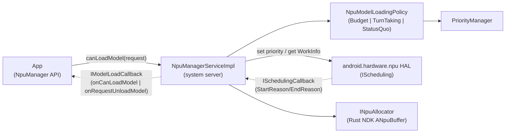

### Architecture changes

CHRE (`system/chre`, 536 commits) gains a new **data-flow** subsystem for high-throughput streaming between a single source and multiple sinks (nanoapps and other endpoints), using shared memory regions to minimise copies. The public API is `chre_api/include/chre_api/chre/data_flow.h` (events `CHRE_EVENT_DATA_FLOW_CREATED`, `_SINK_CREATED`, `_ALERT`, `_SINK_CONFIGURE_DONE`; calls like `chreDataFlowSinkEnable()`). Flows are keyed by source message-hub ID + data-flow ID, aligning with the endpoint/message-hub model; the reference implementation lives in `system/chre/data_flow/` (shared-region core + host-side managers), and a new `WakeupStatsManager` centralises host wakeup attribution. Together these target low-power, always-on sensing and ML offload without waking the application processor.

`packages/modules/OnDevicePersonalization` was repackaged/moved in 17 and retains its Private Compute model: the framework + system service (`framework/`, `systemservice/`), a `pluginlib/` sandbox, and a `federatedcompute/` subtree for federated learning/analytics keeping personalization signals on-device.

### Notable integrations

**Android XR: API scaffolding only.** `external/openxr-sdk` (Khronos OpenXR SDK, `release-1.1.50`) is newly vendored read-only: its `Android.bp` builds a single `cc_library_headers { name: "openxr_headers" }` over `include/` — the OpenXR headers, with no loader and no in-tree consumer. The matching framework surface in `frameworks/base/core/api/current.txt` is equally inert: `FEATURE_XR_API_OPENXR` ("android.software.xr.api.openxr") and `FEATURE_XR_API_SPATIAL`; the `FEATURE_XR_INPUT_*` strings (controller, eye-tracking, hand-tracking); `XrWindowProperties` and its full-space vs home-space activity start modes; `DisplayManager.DISPLAY_CATEGORY_XR_PROJECTED`; and the dangerous body/environment-tracking permissions plus AppOps (`EYE_TRACKING_COARSE/FINE`, `FACE_TRACKING`, `HAND_TRACKING`, `HEAD_TRACKING`, `SCENE_UNDERSTANDING_COARSE/FINE`) are all `@FlaggedApi`-gated by the `android.xr.xr_manifest_entries` aconfig flag (`core/java/android/content/pm/xr.aconfig`), which is disabled by default. The framing is explicit: the runtime, compositor, OpenXR loader, and scene/spatial SDK are not in AOSP — vendor runtimes plus the off-tree Jetpack XR SDK supply them. The only behavioral XR code upstream is a headset-side recorder statsd atom (`frameworks/proto_logging/stats/atoms/xr/recorder/`, `XrRecorderSessionStatusReported`).

**MicroXR: the XR-glasses peripheral class.** Distinct from the headset surface, lightweight body-worn XR glasses ride a separate flag: `com.android.microxr`'s `xr_glasses_feature` (`frameworks/base/core/java/android/content/pm/glasses.aconfig`, also default-off). It gates `FEATURE_XR_PERIPHERAL` (`android.hardware.type.xr_peripheral`), a device-class marker (peer of `FEATURE_PC` / `FEATURE_WATCH`) whose `PackageManager` javadoc defines an XR peripheral as a body-worn full-stack Android device with no user-installable apps that likely needs a companion device for interaction. Unlike the inert headset features, this marker is actually read in-tree: WiFi (`WifiGlobals`), Bluetooth audio (`Util.isXrDevice()`), and MediaProvider all branch on `hasSystemFeature(FEATURE_XR_PERIPHERAL)` to treat glasses as a constrained device class. Its glasses telemetry lives in `frameworks/proto_logging/stats/atoms/microxr/` (`MicroXrDonDoffStateChanged` for donned/doffed wear state, `MicroXrPhotoCaptured` / `MicroXrVideoCaptured` for button- vs voice-triggered capture, `MicroXrMcuCrashOccurred` for a separate MCU). No MicroXR module, service, HAL, or device target ships in AOSP.

Health Connect (`packages/modules/HealthFitness`, 689 commits) is mostly incremental API/UX work: new bulk `grantHealthPermissions` / `revokeHealthPermissions` APIs, derivation of distance and calories from step data, reduced conversion layers in the Changelogs API, and continued build-out of cross-device "matchmaking" / device-data-provider flows (`service/.../onboarding/matchmaking/`, `apk/src/.../controller/matchmaking/`, `.../newDevices/DeviceDataProvider*`).

## D.13 Infrastructure

Android 17's build and virtualization plumbing moved on two fronts. The Soong build system grew a first-class machine-readable "API/compliance" database and continued migrating off Kati-era Make logic, while AVF (the Android Virtualization Framework) turned protected VMs into a multi-tenant, Trusty-capable platform. A new top-level `tools/mainline` repository carries the open-source mainline-train build tooling.

### New projects

**`tools/mainline` (mainline-train build tooling).** Android 17 adds a new top-level repository for assembling mainline "trains" (the bundles of APEX/APK modules shipped as a unit). Its `train_build/` directory is a set of Python host binaries and libraries (`tools/mainline/train_build/Android.bp`) implementing the steps that turn per-module artifacts into a signed, versioned train:

- `trim_action.py` strips a bundled APEX down to the architectures a target needs, mapping module ABIs onto DCLA arch sets (`DCLA_ARCH_BY_MODULE_ARCH`).
- `dcla_build_action.py` builds the shared "DCLA" library APEX (`com.google.mainline.primary.libs` / `...go.primary.libs`) that dedupes common native libs across modules (`BIG_ANDROID_DCLA`/`GO_DCLA`).
- `versioning_action.py` bumps module version codes; `pack_action.py` packs the result.
- `generic_train_build_action.py` and `primary_train_build_action.py` are the orchestrators, modelling each train as a `TrainBuildSpec` and dispatching by `TrainType` (TELEMETRY, ADSERVICES, NPU, NONUPDATABLE, TIMEZONE, PRELOAD, Go variants).

Most legacy mock data and proprietary scripts moved out to `vendor/google/train_build`; what remains in AOSP is the reusable trim/DCLA/versioning/pack machinery plus host unit tests.

### New modules

**`cipd_package` (`build/soong/android/cipd/cipd_package.go`).** A new Soong module type fetching a prebuilt from CIPD (Chrome Infrastructure Package Deployment) at build time, publishing a `CipdPackageInfoProvider` carrying the full package name and pinned version. A bounded `cipdPool` (depth 8) limits concurrent fetches. Many `prebuilt_*` module types now record their CIPD source so it flows into compliance metadata.

**`android_filesystem_prebuilt` (`build/soong/filesystem/prebuilt.go`).** A generic prebuilt-image module wrapping an existing system image file (`Src`) in the normal `filesystem` machinery, so a vendor-supplied partition image participates in packaging/AVB like a Soong-built one.

**`trusty_vm_signing_tool` (`packages/modules/Virtualization/guest/trusty/tools/Android.bp`).** A new Rust host tool that signs Trusty pVM payloads for pvmfw.

### Architecture changes

**Soong API / compliance database (`soong_api`).** The biggest build-system change is a new singleton `soong_api_db` (`build/soong/soong_api/soong_api.go`) that walks every module proxy and emits a per-module `SoongApiModuleRecord` (identity/type, install/built files, license metadata, `trendy_team_id`, Java/CC/Rust dependency edges, CIPD source), exporting `soong_api.json`/`.zip` and a SQLite `soong_api.db` under `out/soong/soong_api/<product>/`. It succeeds the older `metadata.db`/`metadata_db_loader` family and underpins SBOM/provenance generation, replacing the removed native-gRPC query path.

The pipeline below shows how module providers feed the database that downstream SBOM/compliance tooling consumes.

Soong API database collection and export pipeline

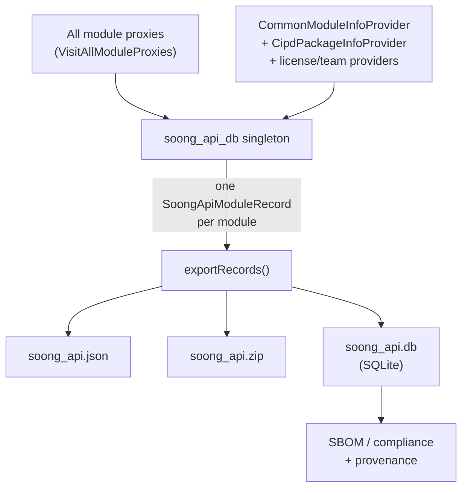

**Partial analysis and on-demand variants.** Soong gained an opt-in `SOONG_PARTIAL_ANALYSIS` env var (`build/soong/ui/build/config.go`) restricting the analysis graph to a named target set and its transitive closure. Blueprint added a `PrePartial()` mutator group running before partial analysis (`build/blueprint/context.go`) and a "passive" `moduleGroup` flag for module groups not yet in the build graph. The variant system shifted toward "variants on demand" (VoD): rather than eagerly splitting every os/arch/image variant, Blueprint creates and mutates dependency variants lazily via `createVariantOnDemand`/`searchOnDemandVariant`. Several eager-split paths (test module types, `PRODUCT_HOST_PACKAGES`, `vndk_prebuilt_library`) were retained for correctness during the transition.

**Release-config maturity.** The Make-era release-config logic now lives entirely under Soong (`build/soong/cmd/release_config/`), and naming is enforced: maps must be named `release_config_map.textproto` (`.../release_config_lib/release_configs.go`). build/make's 871 new vs 154 dropped commits are largely build-ID bumps plus removal of legacy product entries, winding down the Kati path.

### Notable integrations

**AVF multitenancy.** From Android 26Q2, a single protected VM can host multiple mutually isolated tenants (`packages/modules/Virtualization/docs/multitenancy.md`). The VM owner ships a signed `TenancyConfig` (a JSON payload config inside the APK, set via `VirtualMachineConfig#setPayloadConfigPath`) declaring each tenant's `package`, a unique `uid` in `[10000, 65534]`, a `min_version`, and an `expected_authority` map of per-build-flavor signing hashes. virtmgr validates each tenant's authority against the OS signing status and reflects it in the pVM's DICE certificates; per-tenant cgroup and SELinux domains isolate tenants, and unmatched payloads are discarded.

**Trusty as a pVM.** Trusty OS now runs as an AVF-managed protected VM (`packages/modules/Virtualization/guest/trusty/docs/trusty_vm.md`). The Trusty kernel gained virtio-vsock over PCI for host/VM IPC, virtio-vsock over virtio-msg over FF-A for host-opaque channels into a secure-world TEE, device-tree parsing of the crosvm-generated DT (including the pvmfw DICE region), PSCI CPU on/off, and ARM TRNG entropy. The payload is built, signed (via the new `trusty_vm_signing_tool`), and packaged for pvmfw through Soong genrules, producing the `security_vm`/`test_vm` images under `.../guest/trusty/`.

**Linux/Terminal VM in-guest agent and pVM TEE services.** AVF adds `linux_vm_manager`, an in-guest Rust agent for the Linux/Terminal VM (`packages/modules/Virtualization/guest/linux_vm_manager/`) that connects back to the host over vsock (`src/main.rs`) and registers an `IGuestAgent` binder whose handlers (e.g. `shutdownAsync`) live in `src/guest_agent.rs`. The libavf LLNDK also exposes `AVirtualMachineRawConfig_addTeeService` (`libs/libavf/include/android/virtualization.h`, `introduced=37`), letting a protected VM declare TrustZone/TEE services it may reach.

## D.14 Device Support

Android 17's marquee device-support change is the **Software Defined Vehicle (SDV)** platform. Rather than a single repo, SDV arrives as a new top-level tree (`system/software_defined_vehicle/`) plus a reference device (`device/google/sdv`), a new HAL interface package (`hardware/sdv/interfaces`), and an automotive display-safety service (`packages/services/display_safety`). The model is a *headless* vehicle Android OS: SDV "Core" runs vehicle services in their own VM with no UI, communicating with one or more AAOS In-Vehicle Infotainment (IVI) VMs and non-Android automotive ECUs over SOME/IP.

### New projects

`manifest-snapshots/_compare/android-16.0.0_r4-to-android17-release/added-removed.txt` lists 84 ADDED projects; the SDV cluster is the bulk:

- **16 new `system/software_defined_vehicle/*` repos**: `middleware`, `orchestration`, `some_ip`, `vsidl`, `telemetry`, `update_manager`, `sdv_gateway`, `lifecycle_management`, `health_monitor`, `service_bundles_registry`, `automotive_services`, `platform`, `common`, `samples`, `tools`, `vpm`.
- **`device/google/sdv`** (sha `f4bfa128`, groups `swcar, pdk`) — the reference device with all SDV lunch targets.
- **`device/google/sdv_display_safety`** (sha `0971a467`) — display-safety product overlays.
- **`hardware/sdv/interfaces`** — the new SDV HAL/AIDL contract package.
- **`packages/services/display_safety`** — the automotive display-safety ("HARry") service.

`packages/services/Car` (Android Automotive CarService) is a *moved/extended* existing repo (561 commits), not a new project.

### New modules

From `device/google/sdv/sdv_core_base/sdv_packages_core_services.mk`, an SDV Core VM installs these agents and APEXes:

- **Communication stack** (`middleware/`): `sdv_sd_agent` (Service Discovery), `dt_agent` (Data Tunnel pub/sub, `com.android.sdv.dt`), `rpcagent` (`middleware/rpc_agent`); shared client library `libsdv_comms` (`middleware/sdv_comms`) over `wire_format` and `transport` (Rust).
- **Lifecycle & orchestration**: `sdv_lifecycle_agent`, `lifecycle_service_bundle_runner`, `sdv_orchestration_agent` (`com.android.sdv.orchestrator`), `sdv_service_bundles_registry_agent` — the orchestrator drives bundle lifecycle from `orch_config.textproto`.
- **VSIDL toolchain** (host): `vsidlc`, `vsidl_rc_generator`, `someip_translation_generator`; on-device `sdv_vsidl_provider_agent`.
- **SOME/IP**: `sdv_someip_stack_agent` + `vsomeip_config.json`, `sdv_someip_broker_agent_comms`.
- **Platform/ops**: `sdv_health_monitor`, `sdv_update_manager_agent`, `sdv_diagnostics_agent`, `vepsm` (vehicle power-state manager).

`hardware/sdv/interfaces` defines the stable AIDL surface: `ISdvGateway`/`ISdvGatewaySession` (`sdv_gateway/google/sdv/gateway/`), `IRpcAgent` (`middleware/rpc/`), `IRegistry` (`service_bundles_registry/`, API v3 under `aidl_api/`), lifecycle `IService`/`IServiceManager`, the vehicle-power-manager AIDL, and privileged Service-Discovery / identity agents.

`packages/services/display_safety` is a Rust workspace (root `Cargo.toml`) implementing the **HARry** Driver-UI runtime: `framework/` (Impeller graphics, audio, layout, monitoring), `reference/` (`harry-app`, `safety-monitor`, ADAS visualization), and `service/har-sdv-service` whose `libhar_sdv_service_bundle` publishes vehicle data and serves the Driver UI over gRPC through the middleware.

### Architecture changes

The SDV stack layers a vehicle-service fabric beneath (and beside) AAOS. The new tree provides the communication middleware and agents; `device/google/sdv` composes them into lunch targets; `hardware/sdv/interfaces` defines the contracts; CarService and the IVI VM consume them through the gateway.

**Lunch-target composition** (`device/google/sdv/AndroidProducts.mk`, `README.md`): OEM products inherit from one SDV "base" plus a vendor target. The bases are `sdv_base` (comm stack only), `sdv_core_base` (full SDV Core services), `sdv_media_base` (Core + media APIs), and `sdv_ivi_base` (an AAOS IVI talking to SDV services on other VMs). Sample targets `sdv_core_cf`, `sdv_media_cf`, `sdv_ivi_cf` (Cuttlefish) and their `*_arm64` peers boot multiple VM instances (`cvd_config_sdv_core_instance{1,2,3}.json`).

**VSIDL → generated Rust.** Services are described in `.vsidl` service-bundle definitions plus `.proto` message schemas in a catalog. `vsidlc` (`vsidl/vsidlc`) walks the catalog and emits Rust middleware bindings into `generated_rs/`; `someip_translation_generator` emits SOME/IP↔proto translation code for messages tagged `INTERPRET_AS_BYTES` (static) or `DYNAMIC_LIBRARY` (dynamic). This is the SDV equivalent of AIDL stub generation.

**Vehicle-service interface layers.** Inside a VM, the comm stack splits into Service Discovery, Data Tunnel (named pub/sub topics), and RPC (`IRpcAgent`). Cross-VM and cross-ECU traffic goes over **SOME/IP** via the SOME/IP stack agent and broker-agent-comms layer, with vsomeip as transport. Non-SDV-aware native/Java apps reach the fabric through the **SDV Gateway** (`sdv_gateway/`): the gateway's `vhal_proxy` (`libvhal_proxy`) lets a VHAL service call `initComms` and publish vehicle properties, gated by `sdv_gateway_config.json` (`/vendor/etc/sdv_gateway_config.json`) which allowlists SDV package names per process UID. SDV-RPC traffic rides a dedicated VLAN (`androidboot.sdv.rpc.interface`, default `sdv_rpc`).

**Display safety.** On the IVI side, `packages/services/display_safety` runs the HARry Driver-UI as an SDV service bundle (`har-sdv-service`) with a `safety-monitor` enforcing distraction/safety constraints. The window migrated the ADAS framework crates and DriverUI SEPolicy into this repo, and ships `com.google.display_safety.har.apex` only for SDV builds.

The stack:

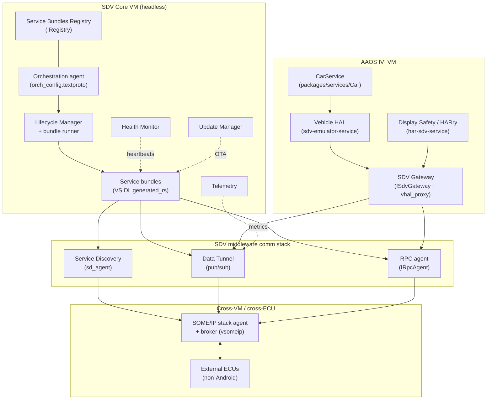

### Notable integrations

- **CarService ↔ SDV.** `packages/services/Car` (moved repo, 561 commits) gained the Driver-UI plumbing the IVI side needs: `com.android.car.driverui` privapp permissions and `ACCESS_LOCAL_NETWORK` default-grant, plus SDV linters. The IVI lunch target wires a Vehicle HAL specifically for SDV: `LOCAL_VHAL_PRODUCT_PACKAGE := android.hardware.automotive.vehicle@V1-sdv-emulator-service` (`device/google/sdv/sdv_ivi_cf/sdv_ivi_cf.mk`), so CarService talks to vehicle properties ultimately served by SDV Core through the gateway.
- **AIDL relocation into `hardware/sdv/interfaces`.** Several interface sets moved out of `system/` into the new HAL package: the SDV Gateway interfaces, the Service Bundles Registry AIDL, vpm stable AIDL, and (after a revert) the Telemetry AIDL. This makes the SDV hardware contract a versioned, VINTF-stable surface independent of the agent implementations.
- **VHAL proxy bridge & OEM/PDK.** `sdv_gateway/vhal_proxy` (`libvhal_proxy`, `config_loader`) lets an unmodified VHAL join the SDV fabric under an allowlisted SDV package name. The reference device supports a custom `/oem_ab` partition (`sdv_core_base/oem_ab/`) for OEM service bundles, and Core targets are PDK-buildable (SDV KeyMint is force-added because the PDK is tested without `system/software_defined_vehicle/` sources).
- **Security model.** VM-level permissions are an APEX with id `com.oem.sdv.authz` (reference `com.oem.sdv.authz.allow_all.{core,ivi}`); the gateway config additionally restricts native clients by UID, and the middleware ships `crypto_rpc` and `service_authz` for authenticated RPC.

## D.15 Practical

Practical dev/test tooling moved modestly: Cuttlefish (290 commits) gained a new desktop product, a unified VKMS controller, an NPU HAL, and AiSeal wiring, while Traceur added two Perfetto trace categories.

### New projects

`vsoc_x86_64_only/desktop/` is a new Cuttlefish product, `aosp_cf_x86_64_desktop` (registered in `AndroidProducts.mk:40`), targeting the Android Desktop form factor. It is HSUM-only (`PRODUCT_USE_HSUM := true`), 64-bit only, uses dynamic partitions with lz4 virtual-AB compression, and ships a `desktop_init_dev_config` service picking APEX/device config at first boot (`shared/desktop/common.mk`). The product turns on verity+encryption by default and enables Trusty gatekeeper/keymint plus `pvmfw-cf` (`vsoc_x86_64_only/desktop/desktop.mk`).

### New modules

- `guest/commands/vkms_controller/` is a new guest-side binary for Virtual Kernel Mode Setting (`main.cpp`). It consolidates fragmented VKMS logic so the host CLI is a stateless `adb shell vkms_controller ...` proxy, test frameworks share one setup path, and the guest correlates virtual hardware (ConfigFS indices) to SurfaceFlinger display IDs. Ships as a `vendor` `cc_binary` (`guest/commands/vkms_controller/Android.bp`).
- NPU support: `shared/device.mk:489` installs the `com.android.hardware.npu.cf` HAL APEX and copies `android.hardware.npu.xml` as a vendor feature permission, advertising the new NPU HAL surface on virtual devices.

### Architecture changes

- AiSeal (on-device AI sealing) is now wired for Cuttlefish via `shared/aiseal/device_vendor.mk`, gated on `RELEASE_AISEAL_FRAMEWORK` and optionally AppSearch. Because Cuttlefish has no protected-VM support, it forces `service.aiseal.protected_vm=0` and runs AiSeal in a nonprotected VM; `aosp_cf_x86_64_only_phone` opts into the feature.
- Host tooling cleanup: the acloud translator was deleted from the Cuttlefish host package, and `cvd-host-package` is now built sandboxed (Sbox) with incremental-walk dependency tracking, tightening reproducibility of the developer host tarball.
- Variant breadth is unchanged in count but reaffirmed across all four `minidroid` targets (`vsoc_{arm64,arm,riscv64,x86_64}_minidroid`) plus the page-size-agnostic `vsoc_x86_64_pgagnostic` / `vsoc_arm64_pgagnostic` products used to validate 16 KB-page builds.

### Notable integrations

Traceur adds two Perfetto trace categories developers can toggle in the system tracing UI (`src_common/com/android/traceur/TraceUtils.java:127`):

- `wattson` ("Wattson power estimation"): when enabled, Traceur emits a minimum Perfetto config with `linux.sys_stats` (cpufreq/cpuidle polling) and a `linux.ftrace` block capturing CPU-hotplug, devfreq, cpu_frequency/idle, suspend_resume, and sched_switch events (`src_common/com/android/traceur/PerfettoUtils.java:821`).
- `mq` ("messagequeue tracing"): enables the `mq` `track_event` category for Looper/MessageQueue dispatch tracing (`src_common/com/android/traceur/PerfettoUtils.java:851`).

Traceur also bumped `targetSdk` to 36, enabled R8 bytecode optimization, and removed the dead `bitmaps_in_traceur` flag and the WinscopeUtils/view-capture path.

## D.16 Key Source Files Reference

| Part | Key files |
| --- | --- |
| Kernel & Boot | `system/usb/aoa/{aidl/.../IUsbAoa.aidl, daemon/main.cpp, daemon/VendorControlRequestMonitor.h, daemon/aoad.rc}`; `system/core/init/first_stage_mount_android.cpp`; `system/update_engine/update_metadata.proto:385`; `kernel/configs` (`android17-6.18`) |
| Native Foundation | `hardware/interfaces/compatibility_matrices/compatibility_matrix.202704.xml`; `hardware/interfaces/{motioncontext,npu,security/see}/aidl/`; `frameworks/libs/binary_translation/cpu_emulation/`; `system/tools/aidl/aidl_language.cpp` |
| Native Services & Media | `frameworks/av/media/module/libapexcodecs/include/apex/ApexCodecs.h`; `frameworks/native/libs/gui/include/gui/RenderCommandBufferProducer.h`; `frameworks/native/services/surfaceflinger/RenderResourceCache.{h,cpp}`; `frameworks/native/libs/binder/BinderNetlink.cpp`; `system/media/camera/include/system/camera_metadata_tags.h` |
| Runtime | `system/zygote/{Android.bp, zygote/src/species.rs, zygote/src/species/android_native.rs, zygote-messages/schemas/messages.fbs}`; `art/runtime/arch/x86/instruction_set_features_x86.cc`; `art/libdexfile/dex/dex_file.h`; `system/apex/apexd/apexd.cpp` |
| Framework Core | `frameworks/base/core/java/android/os/Build.java`; `.../services/core/.../advancedprotection/AdvancedProtectionService.java`; `.../services/supervision/.../SupervisionService.java`; `.../libs/WindowManager/Shell/.../desktopmode/`; `packages/modules/SdkExtensions/derive_sdk/derive_sdk.cpp` |
| Framework Services | `system/memory/mmd/{src/main.rs, aidl/android/os/IMmd.aidl, src/service.rs, src/zram/per_process_ioctls.rs, src/atom.rs}`; `packages/modules/{UprobeStats,Profiling}/apex/Android.bp`; `packages/modules/StatsD/statsd/src/main.cpp` |
| Connectivity | `hardware/nxp/uwb/aidl/{uwb_chip.cpp, nxp-uwb-service.rc}`; `packages/modules/Uwb/ranging/{framework/.../RangingManager.java, service/.../RangingTechnology.java}`; `packages/modules/Wifi/.../usd/UsdManager.java`; `system/gd/hci/distance_measurement_manager_impl.cc` |
| Security | `system/lfi/{boxrt/boxrt_minimal.c, allocator/alloc.c, relocator/relocate.c, Android.bp}`; `frameworks/av/media/codec2/hal/client/client.cpp:1909`; `system/weaver/{ta/src/lib.rs, hal/src/lib.rs}`; `system/see/authmgr/authmgr-fe/src/authorization.rs`; `external/keyattestation/{Android.bp, roots.json}`; `system/keymint`; `system/sepolicy` accessor service contexts |
| UI Framework | `frameworks/libs/systemui/dynamiccolors/Android.bp`; `quickstep/src/com/android/quickstep/{window/RecentsWindowManager.kt, DisplayModel.kt}`; `.../launcher3/taskbar/TaskbarManagerImpl.java`; `frameworks/libs/systemui/monet/.../ColorScheme.java`; `build/make/target/product/{base_system.mk:493, angle_default.mk}` |
| System Apps | `packages/apps/Settings/src/com/android/settings/{supervision/SupervisionDashboardScreen.kt, development/desktopexperience/}`; `packages/apps/DocumentsUI/src/com/android/documentsui/{util/FlagUtils.kt, files/getinfo/, queries/}` |
| AI & Devices | `packages/modules/NpuManager/{apex/Android.bp, framework/.../NpuManager.java, service/.../NpuManagerServiceImpl, ndk/include/android/npumanager/buffer.h}`; `packages/apps/PersonalContext/AndroidManifest.xml`; `system/chre/{chre_api/include/chre_api/chre/data_flow.h, data_flow/}`; `external/openxr-sdk` |
| Infrastructure | `tools/mainline/train_build/{Android.bp, primary_train_build_action.py}`; `build/soong/{soong_api/soong_api.go, android/cipd/cipd_package.go, filesystem/prebuilt.go}`; `packages/modules/Virtualization/{docs/multitenancy.md, guest/trusty/docs/trusty_vm.md, guest/trusty/tools/Android.bp}` |
| Device Support (SDV) | `system/software_defined_vehicle/*` (16 repos: `middleware`, `orchestration`, `some_ip`, `vsidl`, `sdv_gateway`, …); `device/google/sdv/{AndroidProducts.mk, sdv_core_base/sdv_packages_core_services.mk, sdv_ivi_cf/sdv_ivi_cf.mk}`; `hardware/sdv/interfaces`; `packages/services/display_safety`; `packages/services/Car` |
| Practical | `device/google/cuttlefish/vsoc_x86_64_only/desktop/desktop.mk`; `device/google/cuttlefish/guest/commands/vkms_controller/main.cpp`; `device/google/cuttlefish/shared/aiseal/device_vendor.mk`; `.../traceur/{TraceUtils.java, PerfettoUtils.java}` |

